# SOP-01.4: HƯỚNG DẪN NHẬP HỌC (ORIENTATION)

## 1. THÔNG TIN QUY TRÌNH

| **Thuộc tính** | **Nội dung** |
|---|---|
| Mã SOP | SOP-01.4 |
| Tên quy trình | Hướng dẫn nhập học (Orientation) |
| Quy trình cha | SOP-01: Tiếp nhận học sinh |
| Phiên bản | 1.0 |
| Tần suất | Đầu năm học (1-2 ngày trước khai giảng) |

## 2. MỤC ĐÍCH

- **Giảm lo lắng**: HS mới làm quen trường, Bớt sợ
- **Hiểu quy định**: HS biết nề nếp, Quy tắc trường
- **Kết bạn**: HS làm quen bạn mới, GVCN
- **PH yên tâm**: PH hiểu cách trường vận hành

## 3. PHẠM VI ÁP DỤNG

- **Mầm non**: Tất cả HS mới (Vì mới đi học lần đầu!)
- **Tiểu học**: 
  - Lớp 1: Tất cả HS
  - Lớp 2-5: HS chuyển trường
- **THCS**: 
  - Lớp 6: Tất cả HS (Môi trường mới so với TH)
  - Lớp 7-9: HS chuyển trường

## 4. CHƯƠNG TRÌNH ORIENTATION

### 4.1. Tổng quan chương trình

```
╔═══════════════════════════════════════════════════════════════╗
║              CHƯƠNG TRÌNH ORIENTATION                         ║
╠═══════════════════════════════════════════════════════════════╣
║ THỜI GIAN: 1 buổi sáng (09:00 - 11:30)                        ║
║ ĐỐI TƯỢNG: HS mới + PH (Bắt buộc)                             ║
║ ĐỊA ĐIỂM: Hội trường + Lớp học + Campus                       ║
╠═══════════════════════════════════════════════════════════════╣
║ MỤC TIÊU:                                                     ║
║  • HS làm quen: Trường, GVCN, Bạn, Quy định                   ║
║  • PH hiểu: Cách trường vận hành, Liên hệ khi cần             ║
║  • Phát: Thẻ, Sổ liên lạc, Sách (Nếu có)                      ║
╚═══════════════════════════════════════════════════════════════╝
```

### 4.2. Lịch trình chi tiết

| **Giờ** | **Hoạt động** | **Địa điểm** | **Người dẫn** | **Nội dung** |
|---|---|---|---|---|
| **09:00-09:30** | Chào đón & Giới thiệu trường | Hội trường | HT, BGH | Video trường, Phát biểu HT, Giới thiệu BGH/GVCN |
| **09:30-10:00** | Tham quan trường | Campus | GVCN | Phòng học, Thư viện, Bếp, Sân, WC, Y tế... |
| **10:00-10:30** | Làm quen lớp học | Lớp | GVCN | Giới thiệu bạn, Chơi game, Làm Name tag |
| **10:30-11:00** | Hướng dẫn quy định | Lớp | GVCN | Giờ học, Nghỉ, Quy tắc, Nề nếp, Đồng phục... |
| **11:00-11:30** | Q&A & Phát đồ dùng | Lớp | GVCN, NV | Trả lời thắc mắc, Phát thẻ, Sổ, Túi... |

## 5. QUY TRÌNH CHI TIẾT

### 5.1. Chuẩn bị (1 tuần trước)

**Bước 1: NV Phòng HS chuẩn bị danh sách**

- Danh sách HS mới từng lớp
- In phiếu điểm danh (QT06-F13)

**Bước 2: GVCN chuẩn bị lớp học**

```
CHUẨN BỊ LỚP HỌC:
□ Dọn dẹp lớp sạch sẽ, Thoáng mát
□ Trang trí: Banner "Chào mừng các em đến lớp [X]!"
□ Bàn ghế xếp theo nhóm 4-6 (Dễ làm quen)
□ Chuẩn bị: Name tag trắng, Bút màu, Keo dán
□ Chuẩn bị: Sổ liên lạc, Thẻ HS (Đã in sẵn)
□ Chuẩ bị: Quà tặng nhỏ (Bút chì, Sticker...)
```

**Bước 3: IT chuẩn bị**

- Video giới thiệu trường (5-7 phút)
- Slide giới thiệu BGH, GVCN
- Loa, Máy chiếu hội trường

**Bước 4: Phòng Y tế chuẩn bị**

- Sẵn sàng xử lý (Nếu HS té, Khóc, Ốm...)

**Bước 5: Gửi thông báo PH (3 ngày trước)**

```
THÔNG BÁO ORIENTATION

Kính gửi PH em [Tên HS],

Trường tổ chức buổi Hướng dẫn nhập học:
• Thời gian: [Ngày], 09:00-11:30
• Địa điểm: Hội trường + Lớp [X]
• Đối tượng: Em [Tên] + PH (Bắt buộc)

YÊU CẦU:
• PH và em đến đúng giờ
• Em mặc thoải mái (Nếu chưa có đồng phục)
• PH mang theo: CMND/CCCD (Để nhận thẻ HS)

Mọi thắc mắc, Liên hệ: [SĐT]

Trân trọng,
Ban Giám hiệu
```

### 5.2. Chào đón & Giới thiệu (09:00-09:30)

**Bước 6: NV đón tiếp tại cổng (08:45)**

- Mỉm cười, Chào: "Chào cháu! Chào quý PH!"
- Kiểm tra danh sách: "Cháu là em [Tên] lớp [X] phải không ạ?"
- Phát sticker tên: "Cháu dán sticker này lên áo nhé! Để mọi người biết tên cháu!"
- Hướng dẫn: "Quý PH dẫn cháu vào hội trường, Ngồi khu vực lớp [X] ạ!"

**Bước 7: HS + PH vào hội trường, Ngồi theo lớp (08:45-09:00)**

**Sắp xếp chỗ ngồi:**

```
                 [MÀN HÌNH]
         ┌───────────────────────┐
         │   BÀN CHỦ TỌA (BGH)   │
         └───────────────────────┘
                    
    Lớp 1A        Lớp 1B        Lớp 1C
 [HS+PH][HS+PH] [HS+PH][HS+PH] [HS+PH][HS+PH]
 [HS+PH][HS+PH] [HS+PH][HS+PH] [HS+PH][HS+PH]
 
    Lớp 1D        Lớp 1E        ...
```

**Bước 8: Phát biểu chào mừng (09:00-09:10)**

**HT phát biểu:**

```
"Kính chào quý Phụ huynh,
Chào các em học sinh thân mến!

Thay mặt Ban Giám hiệu, Tôi rất vui được chào đón 
các em đến với [Tên trường]!

[Giới thiệu ngắn gọn:]
• Trường có lịch sử [X] năm
• [Số] HS đang học
• Đội ngũ GV giỏi, Cơ sở hiện đại...

Hôm nay, Chúng ta sẽ cùng:
• Tham quan trường
• Làm quen với GVCN, Bạn bè
• Hiểu quy định của trường

Chúc các em có buổi sáng vui vẻ!
Xin cảm ơn!"
```

**Bước 9: Chiếu video giới thiệu trường (09:10-09:17)**

**Nội dung video:**

```
00:00 - 00:30  | Cảnh đẹp trường (Cổng, Sân, Lớp...)
00:30 - 01:30  | Giới thiệu BGH, GV
01:30 - 02:30  | HS học tập (Lớp, Thư viện, Thí nghiệm...)
02:30 - 03:30  | Hoạt động ngoại khóa (Thể thao, Nghệ thuật...)
03:30 - 04:30  | Ăn uống, Vui chơi
04:30 - 05:00  | Slogan: "Nơi ước mơ bay xa!"
```

**Bước 10: Giới thiệu GVCN (09:17-09:30)**

```
MC: "Bây giờ, Chúng ta mời các cô GVCN lên giới thiệu!"

GVCN lần lượt lên sân khấu:
"Chào các em lớp 1A! Cô là cô [Tên], GVCN của các em.
 Cô rất mong được đồng hành cùng các em trong năm học này!
 Các em yên tâm, Cô sẽ giúp các em học giỏi và Vui vẻ!
 Gặp lại các em ở lớp nhé!"
 
[Vỗ tay]
```

### 5.3. Tham quan trường (09:30-10:00)

**Bước 11: GVCN dẫn HS + PH tham quan**

**Lộ trình tham quan:**

```
1. CỔNG TRƯỜNG (2 phút)
   "Các em sẽ đến trường qua cổng này. 
    Có bác bảo vệ, Rất an toàn!"

2. SÂN TRƯỜNG (3 phút)
   "Đây là sân chơi. Giờ ra chơi, Các em chạy nhảy ở đây.
    Có xích đu, Cầu trượt, Bóng rổ..."

3. PHÒNG HỌC (5 phút)
   "Đây là lớp mình! Các em sẽ học ở đây mỗi ngày.
    [Chỉ bàn] Đây là bàn cô. [Chỉ bảng] Đây là bảng.
    [Chỉ tủ] Các em để sách ở tủ này."

4. NHÀ VỆ SINH (3 phút)
   "Các em muốn đi vệ sinh, Xin phép cô:
    'Cô ơi, Con xin phép đi vệ sinh ạ!'
    Nhà vệ sinh ở đây, Rất gần lớp."

5. THƯ VIỆN (5 phút)
   "Thư viện có rất nhiều sách! Các em thích đọc gì?
    [HS: Truyện tranh!] Có! Có rất nhiều!
    Các em được mượn về nhà đọc nhé!"

6. PHÒNG Y TẾ (3 phút)
   "Nếu em nào ốm, Đau bụng, Té...
    → Đến đây, Cô Y tế sẽ chăm sóc!
    [Cô Y tế chào:] Chào các em!"

7. BẾP ĂN (5 phút)
   "Trưa các em ăn ở đây. Cô đầu bếp nấu rất ngon!
    [Chỉ thực đơn] Tuần sau ăn gì? Xem nhé:
    Thứ 2: Cơm, Thịt kho, Canh...
    Ai đăng ký ăn bán trú? [HS giơ tay]"

8. SÂN CHƠI NGOÀI TRỜI (3 phút)
   "Các em thích chơi gì? Bóng đá? Nhảy dây?
    Ở đây có đầy đủ!"

9. VỀ LỚP (2 phút)
   "OK! Giờ chúng ta về lớp thôi!"
```

### 5.4. Làm quen lớp học (10:00-10:30)

**Bước 12: HS vào lớp, Ngồi theo nhóm**

**GVCN sắp xếp:**
- Mỗi bàn: 4-6 HS (Hỗn hợp Nam/Nữ, Giỏi/Yếu)
- PH ngồi phía sau lớp (Quan sát)

**Bước 13: Chơi game "Tự giới thiệu" (15 phút)**

**Cách chơi:**

```
GVCN: "Giờ chúng ta chơi game! Mỗi em giới thiệu:
       • Tên
       • Tuổi
       • Thích gì
       
       Cô làm mẫu nhé:
       'Tên cô là [Tên], Cô [X] tuổi, Cô thích đọc sách!'
       
       Bây giờ đến lượt các em! Ai tự nguyện?"

HS1: "Con tên là Nguyễn Văn A, Con 6 tuổi, Con thích chơi bóng!"
GVCN: "Giỏi lắm! Vỗ tay cho bạn A! [Vỗ tay]"

HS2: "Con tên là Trần Thị B, Con 6 tuổi, Con thích vẽ!"
GVCN: "Hay quá! B vẽ giỏi lắm à?"

... (Tất cả HS giới thiệu)
```

**Bước 14: Làm Name tag (10 phút)**

- Phát giấy trắng, Bút màu
- HS viết tên + Vẽ hình (Sở thích)
- GVCN giúp HS yếu, Nhỏ

**VD Name tag:**

```
┌───────────────────┐
│                   │
│   NGUYỄN VĂN A    │
│                   │
│   [Vẽ quả bóng]   │
│                   │
└───────────────────┘
```

- Dán lên áo hoặc Để trên bàn

**Bước 15: Chơi game "Tìm bạn cùng sở thích" (5 phút)**

```
GVCN: "Giờ các em đi tìm bạn cùng sở thích!
       VD: Bạn nào thích bóng đá, Đứng lại với nhau!
       
       [HS di chuyển, Tìm bạn]
       
       Wow! Nhóm bóng đá có 5 bạn!
       Nhóm vẽ có 3 bạn!
       ...
       
       Sau này các em chơi cùng nhau nhé!"
```

### 5.5. Hướng dẫn quy định (10:30-11:00)

**Bước 16: GVCN giảng quy định (20 phút)**

**A. Giờ học, Giờ nghỉ:**

```
GVCN: "Các em nhớ nhé:
       • Đến trường: 7h30 (Không muộn!)
       • Học: 8h00 - 11h30 (Sáng), 13h30 - 15h30 (Chiều)
       • Ra chơi: 9h30 (15 phút), 14h30 (15 phút)
       • Tan học: 15h30 (PH đón)
       
       [Chỉ đồng hồ treo tường]
       Kim ngắn chỉ 7, Kim dài chỉ 6 → 7h30!
       Các em về nhà nhìn đồng hồ, Tập đọc giờ nhé!"
```

**B. Quy tắc lớp học:**

| **Quy tắc** | **Giải thích** |
|---|---|
| **Giơ tay khi muốn nói** | "Không la to! Giơ tay, Cô cho phép mới nói!" |
| **Không đánh bạn** | "Ai đánh bạn → Cô phê bình, Gọi PH!" |
| **Giữ lớp sạch** | "Rác bỏ thùng. Lớp sạch, Học vui!" |
| **Yêu thương bạn** | "Bạn khóc → An ủi. Bạn té → Giúp!" |

**C. Đồng phục:**

```
GVCN: "Các em mặc đồng phục thế này nhé:
       [Chỉ ảnh]
       • Thứ 2, 4, 6: Áo trắng, Quần xanh
       • Thứ 3, 5: Áo thể thao
       • Thứ 7: Tự do (Nhưng lịch sự!)
       
       PH đã đặt đồng phục chưa ạ? [PH gật đầu]"
```

**D. Ăn uống:**

```
GVCN: "Em nào đăng ký ăn bán trú?
       → 11h30 đi ăn, Xếp hàng, Không xô đẩy!
       
       Em nào không ăn → PH đón về!
       
       Uống nước: Mỗi em có bình nước riêng.
       Hết nước → Múc thêm ở bình lớn (Góc lớp)."
```

**E. Đi vệ sinh:**

```
GVCN: "Muốn đi vệ sinh:
       Giơ tay: 'Cô ơi, Con xin phép đi vệ sinh!'
       Cô cho phép → Đi!
       
       Nhưng: Giờ ra chơi, Các em đi trước nhé!
       Đừng đợi đến giờ học mới đi!"
```

**Bước 17: PH hỏi đáp (10 phút)**

```
GVCN: "Giờ đến lượt PH! Quý PH có thắc mắc gì không ạ?"

PH: "Con ốm thì liên hệ ai?"
GVCN: "Gọi cô hoặc Phòng Y tế. Số điện thoại trong Sổ liên lạc ạ!"

PH: "Con không biết đọc, Làm sao làm bài?"
GVCN: "Lớp 1 cô dạy từ đầu ạ! PH yên tâm!"

...
```

### 5.6. Phát đồ dùng & Kết thúc (11:00-11:30)

**Bước 18: Phát đồ dùng (20 phút)**

**Danh sách phát:**

| **STT** | **Đồ dùng** | **Số lượng** | **Ghi chú** |
|---|---|---|---|
| 1 | Thẻ HS | 1 | PH ký nhận (QT06-F14) |
| 2 | Sổ liên lạc | 1 | Đã ghi tên HS |
| 3 | Túi vải in logo | 1 | Đựng sách vở |
| 4 | Bút chì | 2 | Quà tặng |
| 5 | Tẩy | 1 | Quà tặng |
| 6 | Vở ô ly | 2 | Quà tặng |
| 7 | Sticker trường | 1 tờ | Quà tặng |
| 8 | Thư chào mừng | 1 | Từ HT |

**GVCN gọi tên từng HS:**

```
GVCN: "Em Nguyễn Văn A!"
HS: "Dạ!" [Đứng lên]
GVCN: "Lên đây nhận đồ nhé!"
[Trao: Thẻ, Sổ, Túi, Quà...]
GVCN: "Cô chúc em học giỏi! Vỗ tay!" [Vỗ tay]
[HS về chỗ]

... (Tất cả HS)
```

**Bước 19: Hướng dẫn sử dụng Sổ liên lạc (5 phút)**

```
GVCN: "Sổ liên lạc dùng để:
       • Cô ghi nhận xét em
       • PH ghi (Nếu em nghỉ, Ốm...)
       • PH ký mỗi ngày! (Để biết PH đã xem)
       
       [Mở sổ, Chỉ]
       Trang này: Thông tin em
       Trang này: Lịch học
       Trang này: Nhận xét hàng ngày
       
       PH nhớ: Mỗi tối xem Sổ, Ký nhé!"
```

**Bước 20: Chụp ảnh lưu niệm (5 phút)**

- GVCN + Tất cả HS lớp [X]
- PH đứng sau (Nếu muốn)
- Chụp 3-5 ảnh → Gửi PH sau

**Bước 21: Kết thúc (11:30)**

```
GVCN: "Hôm nay các em rất giỏi!
       Thứ Hai tuần sau, Các em đến trường nhé!
       7h30 đừng quên!
       
       Cô rất mong gặp lại các em!
       Về nhà vui vẻ! Tạm biệt!"

HS: "Tạm biệt cô!" [Vỗ tay]
```

## 6. LƯU ĐỒ QUY TRÌNH

```mermaid
graph TD
    A[1 tuần trước: Chuẩn bị] --> B[NV: Danh sách, Phiếu điểm danh]
    B --> C[GVCN: Dọn lớp, Trang trí, Chuẩn bị đồ]
    C --> D[IT: Video, Slide, Loa, Máy chiếu]
    D --> E[Y tế: Sẵn sàng xử lý]
    E --> F[Gửi thông báo PH: 3 ngày trước]
    
    F --> G[Ngày Orientation: 08:45]
    G --> H[NV đón tại cổng]
    H --> I[Kiểm tra danh sách, Phát sticker tên]
    I --> J[Hướng dẫn vào hội trường, Ngồi theo lớp]
    
    J --> K[09:00: Chào đón]
    K --> L[HT phát biểu chào mừng]
    L --> M[Chiếu video giới thiệu trường]
    M --> N[Giới thiệu GVCN từng lớp]
    
    N --> O[09:30: Tham quan]
    O --> P[GVCN dẫn HS+PH đi]
    P --> Q[Cổng → Sân → Lớp → WC → Thư viện → Y tế → Bếp → Về lớp]
    
    Q --> R[10:00: Làm quen]
    R --> S[HS ngồi theo nhóm 4-6]
    S --> T[Game: Tự giới thiệu]
    T --> U[Làm Name tag]
    U --> V[Game: Tìm bạn cùng sở thích]
    
    V --> W[10:30: Hướng dẫn quy định]
    W --> X[Giờ học, Giờ nghỉ]
    X --> Y[Quy tắc lớp: Giơ tay, Không đánh bạn...]
    Y --> Z[Đồng phục, Ăn uống, Đi vệ sinh]
    Z --> AA[PH hỏi đáp]
    
    AA --> AB[11:00: Phát đồ dùng]
    AB --> AC[Gọi tên từng HS]
    AC --> AD[Trao: Thẻ, Sổ, Túi, Quà]
    AD --> AE[Hướng dẫn Sổ liên lạc]
    
    AE --> AF[Chụp ảnh lưu niệm]
    AF --> AG[GVCN kết thúc, Tạm biệt]
    AG --> AH[✅ Sẵn sàng khai giảng!]
```



## 7. BIỂU MẪU LIÊN QUAN

| **Mã** | **Tên** |
|---|---|
| QT06-F13 | Phiếu điểm danh Orientation |
| QT06-F14 | Biên nhận nhận thẻ HS (PH ký) |

## 8. TIÊU CHUẨN VÀ CHỈ TIÊU

| **Chỉ tiêu** | **Mục tiêu** |
|---|---|
| HS tham gia Orientation | ≥ 95% |
| PH tham gia Orientation | ≥ 90% |
| HS vui vẻ sau Orientation | ≥ 90% (Khảo sát) |
| PH hài lòng | ≥ 85% |

## 9. TRÁCH NHIỆM CỤ THỂ

| **Vai trò** | **Trách nhiệm** |
|---|---|
| **NV Phòng HS** | Chuẩn bị danh sách, Đón tiếp, Phát đồ dùng |
| **GVCN** | Dẫn tham quan, Hướng dẫn quy định, Làm quen HS |
| **IT** | Chuẩn bị video, Slide, Thiết bị |
| **Y tế** | Sẵn sàng xử lý khi HS ốm, Khóc, Té... |
| **HT/BGH** | Phát biểu chào mừng |

## 10. LƯU Ý QUAN TRỌNG

- ⚠️ **HS nhỏ (MN, Lớp 1) dễ khóc**: GVCN cần kiên nhẫn, Ôm, An ủi! Không mắng!
- ✅ **PH bắt buộc tham gia**: Để hiểu cách trường vận hành, Hợp tác tốt hơn!
- 🔥 **Không quá dài**: 2.5 giờ là đủ! Dài hơn → HS mệt, Không tập trung!
- ✅ **Vui vẻ, Thân thiện**: Tạo ấn tượng tốt → HS thích trường → Giảm bỏ học!

## 11. PHỤ LỤC

### 11.1. Xử lý tình huống đặc biệt

**A. HS khóc, Không chịu vào lớp:**

```
TÌNH HUỐNG: HS ôm PH, Khóc, Không chịu vào!

XỬ LÝ:
1. GVCN đến gần, Nói nhỏ: "Sao em khóc?"
2. PH: "Con sợ cô, Sợ lạ..."
3. GVCN: "Em đừng sợ cô nhé! Cô tốt lắm!
           Cô có kẹo đây! Em ăn không?" [Đưa kẹo]
4. Nếu HS nhận → Từ từ dẫn vào lớp
5. Nếu HS vẫn khóc → PH ở lại lớp 30 phút
6. Sau 30 phút → PH từ từ rời (Khi HS chơi với bạn)

KHÔNG: Ép HS, Tách PH đột ngột!
```

**B. HS quá nhút, Không giới thiệu:**

```
TÌNH HUỐNG: Đến lượt HS, Nhưng không dám nói!

XỬ LÝ:
GVCN: "Em ngại à? Không sao! Cô giới thiệu giúp em nhé!
       Đây là bạn [Tên], Bạn [Tuổi] tuổi, Bạn thích [X]!
       Vỗ tay cho bạn!" [Vỗ tay]
       
→ Không ép! Từ từ HS sẽ quen!
```

**C. HS hiếu động, Chạy lung tung:**

```
TÌNH HUỐNG: HS không ngồi yên, Chạy lung tung!

XỬ LÝ:
GVCN: "Em [Tên], Về chỗ ngồi!"
Nếu không nghe → Đến gần, Nắm tay, Dẫn về chỗ
Nếu vẫn chạy → Gọi PH: "Quý PH giữ con một chút ạ!"

KHÔNG: La hét, Mắng trước lớp!
```

### 11.2. Checklist GVCN trước Orientation

```
□ Lớp đã dọn sạch, Thoáng mát
□ Banner "Chào mừng" đã treo
□ Bàn ghế xếp theo nhóm 4-6
□ Name tag trắng, Bút màu đã chuẩn bị
□ Sổ liên lạc, Thẻ HS đã kiểm tra (Đủ số, Đúng tên)
□ Quà tặng (Bút, Tẩy, Vở, Sticker) đã chuẩn bị
□ Biên nhận nhận thẻ (QT06-F14) đã in
□ Lịch trình đã thuộc
□ Đã xem danh sách HS, Biết tên, Đặc điểm
```

## 12. FAQ

**Q1: PH không thể tham gia Orientation?**  
A: Yêu cầu người thân khác (Ông bà, Cô dì...) tham gia thay. Nếu không được → Gửi video ghi lại buổi Orientation cho PH xem!

**Q2: HS không hiểu tiếng Việt (HS nước ngoài)?**  
A: Chuẩn bị GVCN hoặc NV biết tiếng Anh hỗ trợ. Hoặc Dùng hình ảnh, Cử chỉ!

**Q3: Có nên tổ chức Orientation riêng cho từng cấp?**  
A: NÊN! Vì:
- MN/Lớp 1: Cần hướng dẫn kỹ (Lần đầu đi học)
- THCS: Nội dung khác (Nhiều môn, Nhiều GV...)

**Q4: Nếu HS chuyển đến giữa năm?**  
A: Tổ chức Orientation mini (1 tiết):
- GVCN dẫn HS tham quan
- Giới thiệu với lớp
- Phát đồ dùng

---

**PHÊ DUYỆT**

| GVCN | Trưởng BP HS | Phó HT |
|---|---|---|
| [Họ tên] | [Họ tên] | [Họ tên] |
