# SOP-01.5: THEO DÕI THÍCH NGHI

## 1. THÔNG TIN QUY TRÌNH

| **Thuộc tính** | **Nội dung** |
|---|---|
| Mã SOP | SOP-01.5 |
| Tên quy trình | Theo dõi thích nghi |
| Quy trình cha | SOP-01: Tiếp nhận học sinh |
| Phiên bản | 1.0 |
| Tần suất | Tuần 1-4 (HS mới), Theo dõi liên tục đến HK1 |

## 2. MỤC ĐÍCH

- **Hỗ trợ HS**: Giúp HS thích nghi nhanh với môi trường mới
- **Phát hiện sớm**: Kịp thời phát hiện HS có vấn đề (Lo lắng, Không kết bạn...)
- **Can thiệp kịp**: Hỗ trợ khi cần (Tâm lý, Phụ đạo...)
- **Giữ chân HS**: Giảm tỷ lệ bỏ học, Chuyển trường

## 3. PHẠM VI ÁP DỤNG

- Tất cả HS mới (Lớp 1, Chuyển trường)
- HS có vấn đề đặc biệt (Khuyết tật, Tâm lý...)

## 4. GIAI ĐOẠN THÍCH NGHI

### 4.1. Mô hình 4 giai đoạn

```
╔══════════════════════════════════════════════════════════════════╗
║                 MÔ HÌNH THÍCH NGHI 4 TUẦN                        ║
╠══════════════════════════════════════════════════════════════════╣
║ TUẦN 1: LO LẮ CỰC ĐỘ (Crisis Week)                          ║
║  • HS: Lo lắng, Khóc, Nhớ trường cũ/PH, Không ăn            ║
║  • GV: Quan tâm 200%, Ôm, An ủi, Không mắng                 ║
║  • PH: Có thể ở lại lớp 1-2 tiết (Nếu HS quá lo lắng)      ║
╠══════════════════════════════════════════════════════════════════╣
║ TUẦN 2: BẮT ĐẦU QUEN (Adjustment Week)                       ║
║  • HS: Bớt lo lắng, Nhưng còn nhút, Chưa tự tin             ║
║  • GV: Khuyến khích tham gia, Khen ngợi nhiều               ║
║  • PH: Không cần ở lại, Nhưng đón đúng giờ                  ║
╠══════════════════════════════════════════════════════════════════╣
║ TUẦN 3: QUEN HƠN (Integration Week)                         ║
║  • HS: Quen hơn, Chơi với 1-2 bạn, Tham gia hoạt động       ║
║  • GV: Tạo cơ hội kết bạn, Ghép nhóm                        ║
║  • PH: Bắt đầu yên tâm                                      ║
╠══════════════════════════════════════════════════════════════════╣
║ TUẦN 4: THÍCH NGHI TỐT (Settled Week)                       ║
║  • HS: 80% HS thích nghi tốt, Vui vẻ, Tự tin               ║
║  • GV: Theo dõi 20% chưa thích nghi, Can thiệp              ║
║  • PH: Hài lòng, Tin tưởng trường                           ║
╚══════════════════════════════════════════════════════════════════╝
```

### 4.2. Bảng hành vi HS theo từng tuần

| **Hành vi** | **Tuần 1** | **Tuần 2** | **Tuần 3** | **Tuần 4** |
|---|---|---|---|---|
| **Khóc** | 60% HS | 30% HS | 10% HS | <5% HS |
| **Từ chối ăn** | 40% HS | 15% HS | 5% HS | <2% HS |
| **Không chơi với bạn** | 70% HS | 40% HS | 20% HS | <10% HS |
| **Xin nghỉ học** | 20% HS | 10% HS | 5% HS | <2% HS |
| **Vui vẻ, Tự tin** | 20% HS | 40% HS | 60% HS | 80% HS |

**Lưu ý:** Đây là số liệu trung bình. Mỗi HS khác nhau!

## 5. QUY TRÌNH THEO DÕI

### 5.1. Tuần 1: Quan sát hàng ngày (Crisis Week)

**Bước 1: GVCN quan sát HS MỖI NGÀY**

**Checklist quan sát hàng ngày (QT06-CL05):**

```
═══════════════════════════════════════════════════════
  PHIẾU QUAN SÁT THÍCH NGHI HÀNG NGÀY
  HS: ____________  Lớp: ____  Ngày: __/__/20__
═══════════════════════════════════════════════════════

1. ĐIỂM DANH:
   □ Đến đúng giờ    □ Muộn (<15 phút)    □ Muộn (>15 phút)    □ Nghỉ
   
2. TÌNH TRẠNG KHI ĐẾN:
   □ Vui vẻ    □ Bình thường    □ Buồn    □ Khóc
   
3. TƯƠNG TÁC VỚI GVCN:
   □ Chào cô    □ Không chào    □ Chạy lại ôm cô    □ Tránh cô
   
4. TƯƠNG TÁC VỚI BẠN:
   □ Chơi với bạn    □ Chơi 1 mình    □ Không chơi (Ngồi im)
   □ Quan sát bạn chơi (Chưa dám tham gia)
   
5. THAM GIA HỌC TẬP:
   □ Tích cực    □ Bình thường    □ Thụ động    □ Từ chối
   
6. ĂN UỐNG:
   □ Ăn hết    □ Ăn 1/2    □ Ăn ít (<1/2)    □ Không ăn
   
7. NGỦ TRƯA (Nếu có):
   □ Ngủ ngon    □ Ngủ lâu mới chìm    □ Không ngủ (Khóc, Lo lắng)
   
8. TÂM TRẠNG CHUNG:
   □ Vui vẻ cả ngày    □ Vui vẻ một số thời điểm
   □ Buồn, Nhưng không khóc    □ Khóc (__ lần)
   
9. SỰ CỐ ĐẶC BIỆT:
   □ Không    □ Có: _______________________________________
   
10. GHI CHÚ:
    __________________________________________________________
    __________________________________________________________

GVCN ký: __________
═══════════════════════════════════════════════════════
```

**Bước 2: GVCN ghi vào Phần mềm hoặc Sổ theo dõi**

**Bước 3: Xử lý tình huống hàng ngày**

**A. HS khóc:**

```
NGUYÊN NHÂN:                  | XỬ LÝ:
──────────────────────────────|──────────────────────────────────
• Nhớ PH                      | → Ôm, An ủi: "Chiều PH đến đón!"
• Sợ lạ                       | → Dẫn đi chơi với bạn
• Bị bạn chọc                 | → Phê bình bạn, Bảo vệ HS
• Không hiểu bài              | → Giảng lại riêng
• Ốm                          | → Đưa Y tế, Gọi PH
```

**B. HS không ăn:**

```
NGUYÊN NHÂN:                  | XỬ LÝ:
──────────────────────────────|──────────────────────────────────
• Chưa quen món ăn            | → Cho ăn thử, Không ép
• Lo lắng (No đờ)             | → Cho uống nước, Ăn ít
• Không thích                 | → Gọi PH, Trao đổi thực đơn
• Ốm                          | → Y tế khám
```

**C. HS không chơi với bạn:**

```
NGUYÊN NHÂN:                  | XỬ LÝ:
──────────────────────────────|──────────────────────────────────
• Nhút nhát                   | → Dẫn đến nhóm bạn, Giới thiệu
• Chưa biết cách chơi         | → Dạy cách chơi
• Bị bạn từ chối              | → Nói chuyện với bạn đó
• Thích ở 1 mình              | → Tôn trọng, Nhưng theo dõi
```

**Bước 4: Liên hệ PH (Mỗi ngày - Khi đón con)**

```
GVCN: "Chào quý PH! Hôm nay con [Tên]:
       • [Điểm tốt]: Vui vẻ hơn, Chơi với bạn X!
       • [Điểm cần cải thiện]: Còn ngại tham gia, Cô sẽ khuyến khích!
       • [Yêu cầu PH]: Về nhà PH khen con, Động viên con nhé!"
       
→ Luôn nói ĐIỂM TỐT trước, Sau đó mới nói điểm cần cải thiện!
```

### 5.2. Cuối Tuần 1: Đánh giá sơ bộ

**Bước 5: GVCN tổng hợp 5 ngày quan sát**

**Phân loại HS:**

| **Nhóm** | **Tiêu chí** | **Tỷ lệ** | **Xử lý** |
|---|---|---|---|
| **A: Thích nghi tốt** | Vui vẻ, Ăn uống OK, Chơi với bạn | ~20% | Tiếp tục theo dõi thường |
| **B: Thích nghi trung bình** | Còn lo lắng, Nhưng không khóc | ~60% | Quan tâm nhiều |
| **C: Thích nghi khó** | Khóc nhiều, Không ăn, Xin nghỉ | ~20% | Hỗ trợ đặc biệt |

**Bước 6: Họp nhóm GV (Cuối tuần 1)**

- GVCN báo cáo tình hình lớp
- Thảo luận HS nhóm C (Khó thích nghi)
- Đưa ra phương án hỗ trợ

### 5.3. Tuần 2-3: Hỗ trợ tích cực (Adjustment & Integration Week)

**Bước 7: GVCN thực hiện các biện pháp hỗ trợ**

**A. Hỗ trợ kết bạn:**

```
PHƯƠNG PHÁP:
1. Ghép bạn: HS nhút + HS vui vẻ, Năng động (Làm Buddy)
   
   GVCN: "Bạn A, Cô giao cho bạn nhiệm vụ:
          Chăm sóc bạn B nhé! Rủ bạn B chơi, Giúp bạn B!"
          
2. Tạo hoạt động nhóm: Vẽ, Làm đồ thủ công... (HS phải hợp tác)

3. Khen ngợi: "Hôm nay bạn B chơi với bạn A! Giỏi lắm! Vỗ tay!"
```

**B. Tăng cường tự tin:**

```
PHƯƠNG PHÁP:
1. Giao nhiệm vụ nhỏ (Dễ làm được):
   "Bạn B, Giúp cô phát vở cho các bạn nhé!"
   → Làm được → Khen: "Giỏi lắm! Cảm ơn bạn!"
   
2. Hỏi bài dễ:
   "Bạn B, Câu này bạn biết không? 2+2 = ?"
   → Trả lời đúng → Khen: "Đúng rồi! Giỏi!"
   
3. Cho thể hiện sở trường:
   Nếu bạn B giỏi vẽ → Cho vẽ tranh treo lớp
   → Bạn khác khen → Tự tin ↑
```

**C. Giảm lo lắng:**

```
PHƯƠNG PHÁP:
1. Thường xuyên hỏi thăm:
   "Bạn B hôm nay thế nào? Vui không?"
   
2. Cho HS biết lịch:
   "Sáng học, 9h30 ra chơi, 11h30 ăn cơm, Chiều PH đón!"
   → HS biết trước → Bớt lo!
   
3. Khen mọi tiến bộ nhỏ:
   "Hôm nay bạn B không khóc! Giỏi lắm!"
```

**Bước 8: Liên hệ PH (Mỗi tuần 1-2 lần)**

- Gọi điện hoặc Gặp trực tiếp (Khi đón con)
- Báo cáo tiến triển
- Hỏi tình hình HS ở nhà
- Thống nhất phương án hỗ trợ

**Bước 9: Theo dõi HS nhóm C (Khó thích nghi) - MỖI NGÀY**

### 5.4. Cuối Tuần 3: Đánh giá chính thức

**Bước 10: GVCN đánh giá HS bằng QT06-CL06**

**Phiếu đánh giá thích nghi (QT06-CL06):**

```
═══════════════════════════════════════════════════════
  PHIẾU ĐÁNH GIÁ THÍCH NGHI (Tuần 3)
  HS: ____________  Lớp: ____  Ngày: __/__/20__
═══════════════════════════════════════════════════════

TIÊU CHÍ (10 tiêu chí):

1. ĐIỂM DANH
   □ Đến đều (≥4 ngày/tuần)       [2 điểm]
   □ Đến 2-3 ngày/tuần             [1 điểm]
   □ Đến <2 ngày/tuần              [0 điểm]

2. TÂM TRẠNG
   □ Vui vẻ, Không khóc            [2 điểm]
   □ Thỉnh thoảng buồn             [1 điểm]
   □ Thường xuyên khóc             [0 điểm]

3. KẾT BẠN
   □ Có ≥2 bạn thân                [2 điểm]
   □ Có 1 bạn                      [1 điểm]
   □ Không có bạn                  [0 điểm]

4. THAM GIA HOẠT ĐỘNG
   □ Tích cực tham gia             [2 điểm]
   □ Thỉnh thoảng tham gia         [1 điểm]
   □ Không tham gia                [0 điểm]

5. ĂN UỐNG
   □ Ăn uống bình thường           [2 điểm]
   □ Ăn ít, Nhưng không từ chối    [1 điểm]
   □ Từ chối ăn                    [0 điểm]

6. NGỦ TRƯA
   □ Ngủ ngon                      [2 điểm]
   □ Ngủ lâu mới chìm              [1 điểm]
   □ Không ngủ                     [0 điểm]

7. HỌC TẬP
   □ Làm bài, Tham gia             [2 điểm]
   □ Làm 1 số bài                  [1 điểm]
   □ Từ chối làm bài               [0 điểm]

8. TƯƠNG TÁC GVCN
   □ Tự nhiên, Thân thiện          [2 điểm]
   □ Ngại ngùng, Nhưng không tránh [1 điểm]
   □ Tránh, Sợ                     [0 điểm]

9. HÀNH VI
   □ Tuân thủ quy tắc              [2 điểm]
   □ Thỉnh thoảng vi phạm nhỏ      [1 điểm]
   □ Thường xuyên vi phạm          [0 điểm]

10. Ý MUỐN ĐẾN TRƯỜNG
    □ Muốn đến trường               [2 điểm]
    □ Không muốn, Nhưng không khóc  [1 điểm]
    □ Từ chối đến trường (Khóc, Xin nghỉ) [0 điểm]

───────────────────────────────────────────────────────
TỔNG ĐIỂM: _____/20

ĐÁNH GIÁ:
□ 16-20 điểm: THÍCH NGHI TỐT ✅
□ 10-15 điểm: THÍCH NGHI TRUNG BÌNH (Cần theo dõi)
□ 0-9 điểm: THÍCH NGHI KHÓ (Cần can thiệp đặc biệt) ⚠️

NHẬN XÉT CỦA GVCN:
__________________________________________________________
__________________________________________________________

GVCN ký: __________  Ngày: __/__/20__
═══════════════════════════════════════════════════════
```

**Bước 11: Phân loại HS sau đánh giá**

| **Nhóm** | **Điểm** | **Tỷ lệ dự kiến** | **Xử lý** |
|---|---|---|---|
| **Thích nghi tốt** | 16-20 | 60-70% | Tiếp tục theo dõi thường |
| **Thích nghi TB** | 10-15 | 20-30% | Tăng cường hỗ trợ |
| **Thích nghi khó** | 0-9 | 5-10% | Can thiệp đặc biệt (Tâm lý, Gặp PH...) |

### 5.5. Tuần 4: Can thiệp HS khó thích nghi

**Bước 12: Lập danh sách HS cần can thiệp (Điểm < 10)**

**Bước 13: GVCN gặp riêng từng HS**

```
GVCN: "Em [Tên], Cô muốn nói chuyện với em.
       Em thấy trường mình thế nào?"
       
HS: "Con không thích..."
GVCN: "Sao em không thích? Kể cho cô nghe!"
HS: "Con không có bạn..."
GVCN: "À, Cô hiểu rồi. Cô sẽ giúp em kết bạn nhé!"

→ Lắng nghe, Tìm nguyên nhân, Cam kết hỗ trợ!
```

**Bước 14: GVCN gọi PH đến gặp trực tiếp**

**Nội dung họp PH:**

```
GVCN: "Chào quý PH. Hôm nay cô mời PH đến để bàn về con [Tên].
       
       [Trình bày thực tế - Không che giấu:]
       • Con đã học 3 tuần, Nhưng vẫn chưa thích nghi tốt.
       • Con [Liệt kê vấn đề]: Không có bạn, Không ăn...
       • Điểm đánh giá: __/20 (Thấp hơn mức trung bình)
       
       [Hỏi PH:]
       • Ở nhà con thế nào? Con có nói gì về trường không?
       • PH có nhận thấy con buồn, Lo lắng không?
       
       [PH trả lời...]
       
       [Đề xuất phương án:]
       • Cô sẽ ghép con với bạn A (Bạn thân thiện)
       • Cô sẽ giao nhiệm vụ cho con (Tăng tự tin)
       • Cô đề nghị tâm lý học đường hỗ trợ con
       
       [Yêu cầu PH hợp tác:]
       • Về nhà PH động viên con: 'Con giỏi! Con làm được!'
       • PH KHÔNG nói: 'Con không thích thì nghỉ!' → Làm con thêm lo!
       • PH đưa đón đúng giờ (Đừng muộn)
       
       Chúng ta cùng giúp con nhé!"
```

**Bước 15: Chuyển Tâm lý học đường (Nếu cần)**

**Tiêu chí chuyển Tâm lý:**

| **Triệu chứng** | **Chuyển Tâm lý?** |
|---|---|
| Lo lắng nhẹ, Nhút nhát | Chưa cần (GVCN xử lý được) |
| Lo lắng nặng, Khóc nhiều, Mất ngủ | ✅ CẦN |
| Từ chối đến trường | ✅ CẦN |
| Có dấu hiệu trầm cảm | ✅ CẦN GẤP |

**Bước 16: Tâm lý học đường làm việc với HS (3-5 buổi)**

**Nội dung:**
- Trò chuyện, Tìm nguyên nhân
- Dạy kỹ năng xã hội (Cách kết bạn)
- Giảm lo lắng (Thư giãn, Hít thở...)
- Tư vấn PH

**Bước 17: GVCN + Tâm lý + PH họp đánh giá (Sau 2 tuần can thiệp)**

```
GVCN: "Con [Tên] đã tiến bộ:
       • Trước: Không có bạn → Giờ: Chơi với 2 bạn!
       • Trước: Không ăn → Giờ: Ăn được 1/2 phần!
       
       [Nếu tiến bộ] → Tiếp tục theo dõi!
       [Nếu không tiến bộ] → Xem xét phương án khác:
         • Chuyển lớp? (Môi trường khác)
         • Giảm giờ học? (VD: Chỉ học buổi sáng)
         • Tạm nghỉ, Quay lại năm sau? (Nếu con quá nhỏ)
```

### 5.6. Theo dõi liên tục đến HK1

**Bước 18: GVCN theo dõi tất cả HS đến cuối HK1**

- Ghi nhận trong Sổ liên lạc (Mỗi tuần)
- Họp PH (Tháng 1 lần)
- Báo cáo BP HS (Tháng 1 lần)

**Bước 19: Cuối HK1 - Đánh giá tổng thể**

```
GVCN tổng hợp:
• Tỷ lệ HS thích nghi tốt: ___% (Mục tiêu: ≥90%)
• Tỷ lệ HS bỏ học, Chuyển trường: ___% (Mục tiêu: ≤5%)
• Tỷ lệ PH hài lòng: ___% (Mục tiêu: ≥85%)

→ Nộp báo cáo (QT06-BC01)
```

## 6. LƯU ĐỒ QUY TRÌNH

```mermaid
graph TD
    A[Tuần 1: Quan sát hàng ngày] --> B[GVCN ghi Phiếu QT06-CL05]
    B --> C[Quan sát: Điểm danh, Tâm trạng, Kết bạn, Ăn uống...]
    C --> D[Xử lý tình huống: Khóc→Ôm, Không ăn→Cho thử...]
    D --> E[Liên hệ PH mỗi ngày khi đón con]
    
    E --> F[Cuối tuần 1: Đánh giá sơ bộ]
    F --> G[Phân loại: A-Tốt, B-TB, C-Khó]
    G --> H[Họp nhóm GV: Thảo luận nhóm C]
    
    H --> I[Tuần 2-3: Hỗ trợ tích cực]
    I --> J[Ghép bạn: HS nhút + HS vui vẻ]
    J --> K[Tăng tự tin: Giao nhiệm vụ nhỏ, Khen ngợi]
    K --> L[Giảm lo lắng: Hỏi thăm, Cho biết lịch]
    L --> M[Liên hệ PH: 1-2 lần/tuần]
    M --> N[Theo dõi nhóm C MỖI NGÀY]
    
    N --> O[Cuối tuần 3: Đánh giá chính thức]
    O --> P[Điền Phiếu QT06-CL06: 10 tiêu chí, 20 điểm]
    P --> Q[Tính tổng điểm]
    
    Q --> R{Điểm?}
    R -->|16-20| S[Thích nghi tốt ✅]
    R -->|10-15| T[Thích nghi TB → Tăng hỗ trợ]
    R -->|0-9| U[Thích nghi khó ⚠️]
    
    S --> V[Tiếp tục theo dõi thường]
    T --> W[Tăng cường hỗ trợ]
    
    U --> X[Tuần 4: Can thiệp đặc biệt]
    X --> Y[Lập danh sách HS < 10 điểm]
    Y --> Z[GVCN gặp riêng HS: Tìm nguyên nhân]
    Z --> AA[Gọi PH đến gặp trực tiếp]
    AA --> AB[Họp: GVCN + PH]
    AB --> AC[Trình bày vấn đề, Đề xuất phương án]
    AC --> AD[Yêu cầu PH hợp tác: Động viên, Đưa đón đúng giờ]
    
    AD --> AE{Cần Tâm lý?}
    AE -->|Lo lắng nặng, Từ chối đến trường| AF[✅ Chuyển Tâm lý]
    AE -->|Lo lắng nhẹ| AG[❌ GVCN xử lý]
    
    AF --> AH[Tâm lý làm việc với HS: 3-5 buổi]
    AH --> AI[Tìm nguyên nhân, Dạy kỹ năng, Giảm lo lắng]
    AI --> AJ[Sau 2 tuần: Họp GVCN+Tâm lý+PH]
    
    AG --> AJ
    W --> AJ
    
    AJ --> AK{Tiến bộ?}
    AK -->|Có| AL[✅ Tiếp tục theo dõi]
    AK -->|Không| AM[Xem xét: Chuyển lớp? Giảm giờ? Nghỉ tạm?]
    
    AM --> AN[Quyết định với PH]
    AL --> AO[Theo dõi liên tục đến HK1]
    V --> AO
    
    AO --> AP[Ghi Sổ liên lạc mỗi tuần]
    AP --> AQ[Họp PH tháng 1 lần]
    AQ --> AR[Báo cáo BP HS tháng 1 lần]
    
    AR --> AS[Cuối HK1: Đánh giá tổng thể]
    AS --> AT[Tỷ lệ thích nghi tốt: ___% Mục tiêu ≥90%]
    AT --> AU[Tỷ lệ bỏ học: ___% Mục tiêu ≤5%]
    AU --> AV[Nộp báo cáo QT06-BC01]
    AV --> AW[✅ Hoàn thành theo dõi thích nghi!]
```



## 7. BIỂU MẪU LIÊN QUAN

| **Mã** | **Tên** |
|---|---|
| QT06-CL05 | Phiếu quan sát thích nghi hàng ngày |
| QT06-CL06 | Phiếu đánh giá thích nghi (Tuần 3) |
| QT06-BC01 | Báo cáo thích nghi cuối HK1 |

## 8. TIÊU CHUẨN VÀ CHỈ TIÊU

| **Chỉ tiêu** | **Mục tiêu** |
|---|---|
| Tỷ lệ HS thích nghi tốt (≥16 điểm) sau 4 tuần | ≥ 80% |
| Tỷ lệ HS thích nghi khó (<10 điểm) sau 4 tuần | ≤ 10% |
| Tỷ lệ HS bỏ học, Chuyển trường (Do không thích nghi) | ≤ 5% |
| Thời gian phát hiện HS có vấn đề | ≤ 2 tuần |
| Tỷ lệ HS được can thiệp kịp thời | 100% |

## 9. TRÁCH NHIỆM CỤ THỂ

| **Vai trò** | **Trách nhiệm** |
|---|---|
| **GVCN** | Quan sát, Ghi chép, Hỗ trợ, Liên hệ PH, Đánh giá |
| **Tâm lý học đường** | Can thiệp HS khó thích nghi, Tư vấn PH |
| **BP HS** | Theo dõi tổng thể, Hỗ trợ GVCN, Báo cáo BGH |
| **PH** | Hợp tác với trường, Động viên con |

## 10. LƯU Ý QUAN TRỌNG

- ⚠️ **Phát hiện sớm = Thành công**: HS có vấn đề → Phát hiện tuần 1-2 → Dễ can thiệp!
- ✅ **Kiên nhẫn**: Mỗi HS khác nhau! HS này 1 tuần quen, HS kia 2 tháng!
- 🔥 **Không bỏ qua**: Dù chỉ 1 HS khó thích nghi → Phải hỗ trợ hết mình!
- ✅ **Hợp tác PH**: Không có PH hợp tác → Rất khó giúp HS!

## 11. PHỤ LỤC

### 11.1. Dấu hiệu cảnh báo (Red flags)

**CẦN CAN THIỆP GẤP nếu HS có ≥2 dấu hiệu sau:**

```
⚠️ RED FLAGS:

□ Khóc kéo dài >2 tuần (Mỗi ngày >30 phút)
□ Từ chối ăn uống hoàn toàn
□ Tự gây thương tích (Cắn tay, Đập đầu...)
□ Nói: "Con muốn chết", "Con ghét trường"...
□ Mất ngủ, Ác mộng
□ PH báo: Con khóc mỗi tối, Không muốn đến trường
□ Nghỉ học >3 ngày/tuần
□ Tấn công bạn, GV

→ CHUYỂN TÂM LÝ NGAY! Không chờ tuần 3!
```

### 11.2. Kỹ thuật hỗ trợ HS lo lắng

**A. Kỹ thuật "Anchor" (Neo):**

```
GVCN: "Bạn B, Mỗi khi bạn nhớ PH, Bạn nhìn vào ảnh PH này nhé!
       [Dán ảnh PH lên bàn học]
       Cô cũng cho bạn mang theo thú bông nhà!
       [HS ôm thú bông → Bớt lo lắng]"
```

**B. Kỹ thuật "Countdown" (Đếm ngược):**

```
GVCN: "Bạn B, Giờ 3 giờ chiều. PH đến đón 4 giờ.
       Còn 1 tiếng! = 2 tiết nữa thôi!
       [Vẽ 2 ô vuông trên giấy]
       Học xong 1 tiết → Tô 1 ô! Tô hết 2 ô → PH đến!"
       
→ HS biết còn bao lâu → Bớt lo!
```

**C. Kỹ thuật "Reward" (Thưởng):**

```
GVCN: "Bạn B, Nếu hôm nay bạn không khóc → Bạn được 1 ngôi sao!
       Tích đủ 5 sao → Được quà!"
       
→ HS cố gắng không khóc → Dần dần quen!
```

### 11.3. Mẫu báo cáo cuối HK1 (QT06-BC01)

```
═══════════════════════════════════════════════════════
     BÁO CÁO THÍCH NGHI HỌC SINH MỚI - HK1
     Lớp: _______  GVCN: _______  Năm học: _______
═══════════════════════════════════════════════════════

I. TỔNG QUAN:
• Tổng số HS mới: ____ (Trong đó: Lớp 1: __, Chuyển trường: __)
• Tổng số HS thích nghi tốt (≥16 điểm): ____ (__%)
• Tổng số HS thích nghi TB (10-15 điểm): ____ (__%)
• Tổng số HS thích nghi khó (<10 điểm): ____ (__%)

II. XỬ LÝ HS KHÓ THÍCH NGHI:
• Số HS được can thiệp: ____
  - GVCN hỗ trợ: ____
  - Tâm lý can thiệp: ____
  - Họp PH: ____
• Kết quả:
  - Thích nghi tốt sau can thiệp: ____
  - Vẫn khó thích nghi: ____
  - Bỏ học/Chuyển trường: ____

III. NGUYÊN NHÂN KHÓ THÍCH NGHI:
• Lo lắng, Nhút nhát: ____
• Không kết bạn: ____
• Chậm phát triển: ____
• Xung đột với bạn: ____
• Khác: _____________________________

IV. BÀI HỌC KINH NGHIỆM:
• Điểm làm tốt:
  _________________________________________________
• Điểm cần cải thiện:
  _________________________________________________
• Đề xuất cho năm sau:
  _________________________________________________

GVCN ký: __________  Trưởng BP HS ký: __________
═══════════════════════════════════════════════════════
```

## 12. FAQ

**Q1: HS khóc 4 tuần liền, Không tiến bộ. Làm gì?**  
A: Họp PH, Đề xuất:
- Tạm nghỉ 1-2 tuần (Cho HS nghỉ ngơi)
- Quay lại với lịch nhẹ (Chỉ học buổi sáng)
- Nếu vẫn không được → Xem xét nghỉ năm nay, Quay lại năm sau (Có thể con còn nhỏ!)

**Q2: PH không hợp tác (Không đưa con đến trường)?**  
A: 
- Gọi điện hỏi thăm
- Gặp trực tiếp, Động viên
- Nếu PH vẫn không đưa con đến (>2 tuần) → Báo BGH, Xem xét thôi học

**Q3: HS thích nghi tốt đột nhiên không muốn đến trường (Tuần 5-6)?**  
A: Tìm nguyên nhân:
- Bị bạn bắt nạt? → Xử lý bạn đó
- Bị GV mắng? → GV tự phê bình
- Ốm? → Cho nghỉ dưỡng bệnh
- Chán (Honeymoon effect hết)? → Tạo hoạt động mới, Hấp dẫn!

**Q4: Có nên cho PH ở lại lớp cả ngày không?**  
A: KHÔNG! Tối đa 1-2 tiết (Tuần 1). Lâu hơn → HS phụ thuộc PH, Không tự lập!

---

**PHÊ DUYỆT**

| GVCN | Tâm lý học đường | Trưởng BP HS | Phó HT |
|---|---|---|---|
| [Họ tên] | [Họ tên] | [Họ tên] | [Họ tên] |

---

✅ **HOÀN THÀNH SOP-01: TIẾP NHẬN HỌC SINH (6 files)!** 🎉🔥📚
