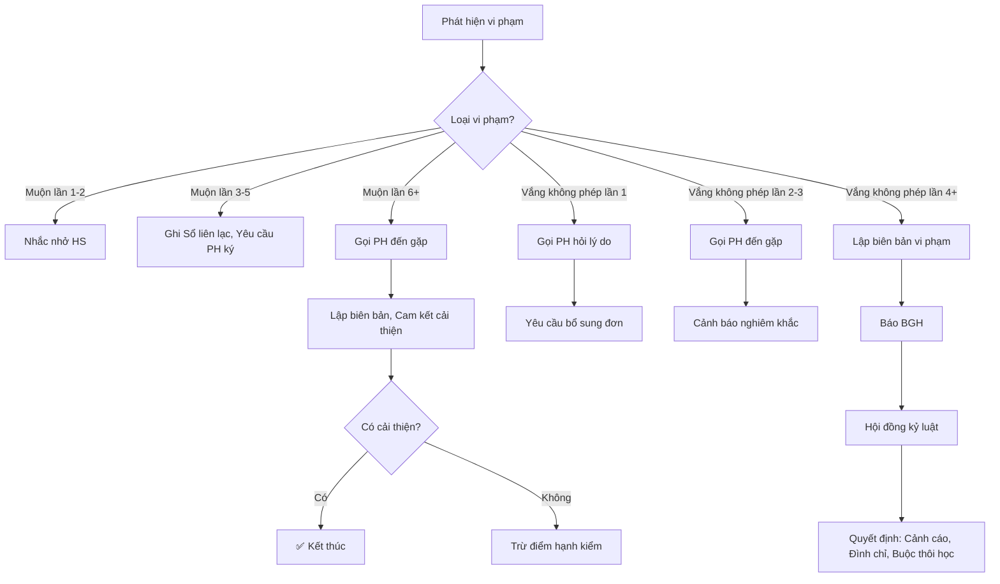

# SOP-02.1: QUY ĐỊNH ĐIỂM DANH

## 1. THÔNG TIN QUY TRÌNH

| **Thuộc tính** | **Nội dung** |
|---|---|
| Mã SOP | SOP-02.1 |
| Tên quy trình | Quy định điểm danh |
| Quy trình cha | SOP-02: Quản lý điểm danh |
| Phiên bản | 1.0 |
| Tần suất | Áp dụng hằng ngày |

## 2. MỤC ĐÍCH

- **Quy định rõ ràng**: Thời gian điểm danh, Cách thức, Trách nhiệm
- **Thống nhất**: Tất cả GV, HS, PH hiểu và Thực hiện giống nhau
- **Minh bạch**: Quy định công khai, Dễ tra cứu
- **Pháp lý**: Tuân thủ quy định của Bộ GD&ĐT

## 3. PHẠM VI ÁP DỤNG

Tất cả học sinh, Tất cả cấp học (Mầm non - Tiểu học - THCS)

## 4. KHUNG THỜI GIAN ĐIỂM DANH

### 4.1. Giờ học chính thức

| **Cấp** | **Buổi sáng** | **Buổi chiều** | **Ghi chú** |
|---|---|---|---|
| **Mầm non** | 8:00 - 11:00 | 13:30 - 15:30 | Có ngủ trưa |
| **Tiểu học** | 7:30 - 11:30 | 13:00 - 16:00 | Lớp 1-2: Về 15:30 |
| **THCS** | 7:00 - 11:30 | 13:00 - 17:00 | Có thể học đến 17:30 (Lớp 9) |

### 4.2. Thời điểm điểm danh

**Quy định:**

```
╔══════════════════════════════════════════════════════════════════╗
║             THỜI ĐIỂM ĐIỂM DANH TRONG NGÀY                       ║
╠══════════════════════════════════════════════════════════════════╣
║ 1. ĐIỂM DANH BUỔI SÁNG (Bắt buộc)                                ║
║    • Thời gian: Tiết 1 (7:30-7:40 TH, 7:00-7:10 THCS)            ║
║    • Người thực hiện: GVCN hoặc GV tiết 1                        ║
║    • Nội dung: Điểm danh + Kiểm tra trang phục                   ║
╠══════════════════════════════════════════════════════════════════╣
║ 2. ĐIỂM DANH BUỔI CHIỀU (Bắt buộc)                               ║
║    • Thời gian: Tiết 1 buổi chiều (13:00-13:10)                  ║
║    • Người thực hiện: GV tiết 1 buổi chiều                       ║
║    • Nội dung: Điểm danh                                         ║
╠══════════════════════════════════════════════════════════════════╣
║ 3. ĐIỂM DANH TỪNG TIẾT (Khuyến khích)                            ║
║    • GV môn học điểm danh đầu tiết                               ║
║    • Phát hiện HS vắng giữa chừng (VD: Đi vệ sinh không về)      ║
╚══════════════════════════════════════════════════════════════════╝
```

## 5. ĐỊNH NGHĨA TRẠNG THÁI ĐIỂM DANH

### 5.1. 6 trạng thái chính

| **Trạng thái** | **Ký hiệu** | **Định nghĩa** | **Tính vào số buổi học?** |
|---|---|---|---|
| **Có mặt** | **P** (Present) | HS đến đúng giờ, Có mặt cả buổi | ✅ Có |
| **Vắng có phép** | **AP** (Absent with Permission) | HS nghỉ có đơn/Giấy BV | ❌ Không |
| **Vắng không phép** | **A** (Absent) | HS nghỉ không đơn | ❌ Không, ⚠️ Vi phạm |
| **Muộn** | **L** (Late) | HS đến sau giờ quy định | ✅ Có, ⚠️ Vi phạm nếu thường xuyên |
| **Về sớm** | **E** (Early leave) | HS về trước giờ tan học | ✅ Có (1/2 buổi), ⚠️ Vi phạm nếu thường xuyên |
| **Đi học đến** | **I** (In-school) | HS có mặt, Nhưng không vào lớp (VD: Ốm, Ở Y tế) | ✅ Có |

### 5.2. Chi tiết từng trạng thái

**A. Có mặt (P):**

```
HS đến trước hoặc đúng giờ quy định:
• Mầm non: ≤ 8:00
• Tiểu học: ≤ 7:30
• THCS: ≤ 7:00

Có mặt cả buổi (Sáng hoặc Chiều)
```

**B. Muộn (L):**

```
Phân loại:
┌────────────────────────────────────────────────┐
│ MUỘN NHẸ (L1): Muộn 1-10 phút                  │
│  • VD: Đến 7:35 (Quy định 7:30)                │
│  • Xử lý: Nhắc nhở                             │
├────────────────────────────────────────────────┤
│ MUỘN VỪA (L2): Muộn 11-30 phút                 │
│  • VD: Đến 7:50                                │
│  • Xử lý: Ghi Sổ liên lạc, Yêu cầu giải trình  │
├────────────────────────────────────────────────┤
│ MUỘN NẶNG (L3): Muộn >30 phút                  │
│  • VD: Đến 8:30                                │
│  • Xử lý: Phê bình, Gọi PH                     │
│  • Tính: 1/2 buổi học (Nếu muộn >1 tiết)       │
└────────────────────────────────────────────────┘
```

**Lưu ý đặc biệt:**
- Muộn do xe trường → Không tính lỗi HS
- Muộn do mưa bão, Ùn tắc (Có xác nhận PH) → Không phạt

**C. Vắng có phép (AP):**

```
HS nghỉ với 1 trong các lý do sau + CÓ GIẤY TỜ:

1. Ốm, Bệnh:
   • Giấy bác sĩ (Nếu nghỉ ≥3 ngày)
   • Đơn xin nghỉ của PH (Nếu nghỉ 1-2 ngày)

2. Việc gia đình:
   • Đám tang, Đám cưới...
   • Có đơn xin nghỉ, PH ký

3. Tham gia thi đấu, Cuộc thi (Đại diện trường):
   • Có giấy mời/Xác nhận từ BGH

4. Lý do bất khả kháng:
   • Tai nạn, Thiên tai...
```

**D. Vắng không phép (A):**

```
HS nghỉ KHÔNG có giấy tờ hoặc Lý do không chính đáng:

VD:
• PH quên gửi đơn
• HS trốn học
• PH cho con nghỉ (Không lý do)

XỬ LÝ:
• Lần 1: Nhắc nhở PH
• Lần 2-3: Phê bình
• Lần 4+: Báo BGH, Xem xét kỷ luật
```

**E. Về sớm (E):**

```
HS về trước giờ tan học:

TÍNH BUỔI HỌC:
• Về sớm <1 tiết: Tính 1 buổi
• Về sớm ≥1 tiết: Tính 1/2 buổi

LÝ DO HỢP LÝ:
• Ốm (Có xác nhận Y tế trường)
• Việc gia đình khẩn cấp (PH đến đón + Ký biên bản)

LÝ DO KHÔNG HỢP LÝ:
• PH đón sớm đi chơi → Vi phạm!
```

**F. Đi học đến (I):**

```
HS có mặt trường, Nhưng không vào lớp:

VD:
• Ốm → Nằm phòng Y tế
• Tham gia hoạt động khác (VD: Thi đấu thể thao)

TÍNH: 1 buổi học (Vì HS vẫn đến trường)
```

## 6. QUY ĐỊNH VỀ SỐ BUỔI HỌC

### 6.1. Tính số buổi học

| **Tình huống** | **Sáng** | **Chiều** | **Tổng** |
|---|---|---|---|
| Đến đúng giờ, Học cả ngày | 0.5 | 0.5 | 1.0 |
| Đến đúng giờ, Chỉ học sáng | 0.5 | 0 | 0.5 |
| Muộn <30 phút sáng, Học cả ngày | 0.5 | 0.5 | 1.0 |
| Muộn >30 phút sáng (Đến sau 8:00) | 0.25 | 0.5 | 0.75 |
| Nghỉ sáng, Học chiều | 0 | 0.5 | 0.5 |
| Nghỉ cả ngày (Có phép) | 0 | 0 | 0 (Không vi phạm) |
| Nghỉ cả ngày (Không phép) | 0 | 0 | 0 (⚠️ Vi phạm!) |

### 6.2. Điều kiện dự thi

**Theo quy định Bộ GD&ĐT:**

```
HS được dự thi HK/Cuối năm nếu:

Số buổi học ≥ 70% tổng số buổi

VD: Học kỳ có 100 ngày = 200 buổi
    → HS phải có ≥ 140 buổi

NGOẠI LỆ:
• Ốm dài ngày (Có giấy BV) → Xét đặc cách
• Tai nạn, Thiên tai → Xét đặc cách
```

## 7. QUY TRÌNH XIN NGHỈ HỌC

### 7.1. Nghỉ có kế hoạch (Biết trước)

**Bước 1: PH gửi đơn xin nghỉ (QT06-F15)**

**Thời gian gửi:**
- Nghỉ 1-2 ngày: Gửi trước 1 ngày
- Nghỉ ≥3 ngày: Gửi trước 3 ngày

**Hình thức gửi:**
- Viết tay vào Sổ liên lạc
- Hoặc Gửi email GVCN
- Hoặc Nhập vào App trường

**Mẫu đơn:**

```
═══════════════════════════════════════════════════════
              ĐƠN XIN NGHỈ HỌC
═══════════════════════════════════════════════════════

Kính gửi: Cô/Thầy Giáo chủ nhiệm lớp ________

Tên HS: _____________________  Lớp: __________

Xin nghỉ học:
• Từ ngày: __/__/____ Đến ngày: __/__/____
• Tổng số buổi: ____

Lý do: _____________________________________________
___________________________________________________

Cam kết: Con em sẽ tự học bài, Bù bài khi đi học lại.

                             Ngày __/__/____
                             Phụ huynh ký tên
                             
                             _________________

═══════════════════════════════════════════════════════
```

**Bước 2: GVCN duyệt**

- Lý do hợp lý → Duyệt
- Lý do không hợp lý → Gọi PH trao đổi

**Bước 3: GVCN ghi vào Phần mềm (AP)**

### 7.2. Nghỉ đột xuất (Không kịp báo trước)

**Bước 1: PH gọi điện/Nhắn tin GVCN NGAY (Sáng, Trước 8:00)**

```
"Cô ơi, Con em [Tên] hôm nay ốm, Sốt 38.5 độ.
 Con em xin nghỉ ạ. Em sẽ gửi đơn và Giấy BV sau!"
```

**Bước 2: GVCN ghi nhận tạm (AP)**

**Bước 3: PH bổ sung đơn + Giấy BV (Trong 3 ngày)**

- Nếu có → OK, Giữ nguyên AP
- Nếu không → Chuyển thành A (Vắng không phép)

### 7.3. Nghỉ dài ngày (≥1 tuần)

**Quy trình đặc biệt:**

```
1. PH gửi đơn xin nghỉ + Giấy BV (Nếu ốm)
2. GVCN trình BGH
3. BGH duyệt
4. Nếu nghỉ >2 tuần:
   • GVCN giao bài về nhà
   • HS tự học hoặc Gia sư
   • Khi đi học lại: Kiểm tra kiến thức
```

## 8. XỬ LÝ VI PHẠM ĐIỂM DANH

### 8.1. Thang vi phạm

| **Vi phạm** | **Mức độ** | **Xử lý** |
|---|---|---|
| Muộn 1-5 lần/HK | Nhẹ | Nhắc nhở |
| Muộn 6-10 lần/HK | Vừa | Phê bình trước lớp, Gọi PH |
| Muộn >10 lần/HK | Nặng | Kỷ luật, Trừ điểm hạnh kiểm |
| Vắng không phép 1-3 lần/HK | Nhẹ | Nhắc nhở PH |
| Vắng không phép 4-6 lần/HK | Vừa | Phê bình, Gặp PH |
| Vắng không phép >6 lần/HK | Nặng | Kỷ luật, Có thể đình chỉ |

### 8.2. Quy trình xử lý



## 9. TRÁCH NHIỆM

| **Vai trò** | **Trách nhiệm** |
|---|---|
| **HS** | Đến đúng giờ, Không vắng mặt tùy tiện |
| **PH** | Đưa con đến đúng giờ, Xin nghỉ khi cần, Hợp tác với trường |
| **GVCN** | Điểm danh chính xác, Theo dõi, Liên hệ PH khi HS vắng |
| **GV môn** | Điểm danh từng tiết, Báo GVCN nếu HS vắng giữa chừng |
| **BP HS** | Rà soát dữ liệu, Báo cáo BGH, Xử lý vi phạm |
| **BGH** | Phê duyệt quy định, Quyết định kỷ luật |

## 10. BIỂU MẪU LIÊN QUAN

| **Mã** | **Tên** |
|---|---|
| QT06-F15 | Đơn xin nghỉ học |
| QT06-F16 | Biên bản vi phạm điểm danh |
| QT06-F17 | Cam kết cải thiện (PH ký) |

## 11. LƯU Ý QUAN TRỌNG

- ⚠️ **Nhất quán**: Tất cả lớp phải áp dụng giống nhau! Không lớp này lỏng, Lớp kia chặt!
- ✅ **Linh hoạt**: Xét đặc biệt (Ốm dài, Tai nạn...) nhưng Phải có giấy tờ!
- 🔥 **Minh bạch**: Công khai quy định cho PH từ đầu năm!
- ✅ **Nhân văn**: Hiểu hoàn cảnh HS, PH. Không cứng nhắc!

## 12. PHỤ LỤC

### 12.1. Các trường hợp đặc biệt

**A. HS đi thi đấu thể thao (Đại diện trường):**

```
• Tính: Đi học đến (I)
• Không tính vắng
• GVCN chuẩn bị bài cho HS tự học
```

**B. HS cách ly y tế (COVID, Sốt xuất huyết...):**

```
• Tính: Vắng có phép (AP)
• HS học online (Nếu có thể)
• Không bị trừ điểm
```

**C. HS đi du lịch với PH (Trong năm học):**

```
• PH xin nghỉ trước ≥1 tuần
• BGH duyệt (Nếu nghỉ <3 ngày)
• Tính: Vắng có phép (AP)
• Nhưng: GVCN NÊN khuyên PH không nên!
```

### 12.2. Quy định riêng cho Mầm non

```
Mầm non LINH HOẠT hơn (Trẻ nhỏ, Dễ ốm):

• Muộn <30 phút: Không phạt
• Vắng <5 ngày/tháng (Có đơn): Bình thường
• Không áp dụng "Đủ 70% buổi học mới dự thi"
  (Vì MN không có thi chính thức)
```

## 13. FAQ

**Q1: HS muộn do xe trường, Có bị phạt không?**  
A: KHÔNG! Đó là lỗi của xe. HS không chịu trách nhiệm. GVCN ghi: "Muộn do xe" → Không tính vi phạm.

**Q2: PH quên gửi đơn, Hôm sau mới gửi. Có được tính vắng có phép không?**  
A: Nếu:
- Lý do chính đáng (Ốm, Việc đột xuất)
- PH có giải trình rõ ràng
→ OK, Chấp nhận!

**Q3: HS nghỉ 20 ngày (Do tai nạn), Có được dự thi không?**  
A: Nếu có:
- Giấy BV xác nhận
- HS tự học, Kiểm tra bù
→ Xét đặc cách, Cho dự thi!

**Q4: HS trốn học (PH không biết), Trách nhiệm thuộc ai?**  
A: 
- HS: Chịu kỷ luật nặng
- Trường: Phải gọi PH NGAY khi phát hiện HS vắng (Buổi sáng)
- PH: Cần theo dõi con chặt chẽ hơn

---

**PHÊ DUYỆT**

| BP HS | Phó HT | Hiệu trưởng |
|---|---|---|
| [Họ tên] | [Họ tên] | [Họ tên] |
