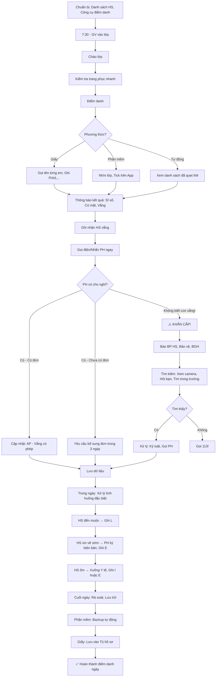

# SOP-02.2: THỰC HIỆN ĐIỂM DANH

## 1. THÔNG TIN QUY TRÌNH

| **Thuộc tính** | **Nội dung** |
|---|---|
| Mã SOP | SOP-02.2 |
| Tên quy trình | Thực hiện điểm danh |
| Quy trình cha | SOP-02: Quản lý điểm danh |
| Phiên bản | 1.0 |
| Tần suất | Mỗi ngày (Sáng + Chiều) |

## 2. MỤC ĐÍCH

- **Chính xác**: Ghi nhận đúng HS có mặt/Vắng
- **Nhanh chóng**: Điểm danh trong 5-10 phút
- **Nhất quán**: Tất cả GV thực hiện giống nhau
- **Kịp thời**: Phát hiện ngay HS vắng, Liên hệ PH

## 3. PHẠM VI ÁP DỤNG

Tất cả GVCN, GV môn, Tất cả cấp học

## 4. CHUẨN BỊ ĐIỂM DANH

### 4.1. Công cụ điểm danh

**Lựa chọn 1 trong 3 phương thức:**

```
╔══════════════════════════════════════════════════════════════════╗
║              3 PHƯƠNG THỨC ĐIỂM DANH                             ║
╠══════════════════════════════════════════════════════════════════╣
║ A. ĐIỂM DANH GIẤY (Traditional)                                  ║
║    • Công cụ: Sổ điểm danh giấy                                  ║
║    • Ưu điểm: Đơn giản, Không cần điện/Internet                  ║
║    • Nhược điểm: Chậm, Dễ sai sót, Khó tra cứu                   ║
║    • Phù hợp: Trường nhỏ, Vùng sâu vùng xa                       ║
╠══════════════════════════════════════════════════════════════════╣
║ B. ĐIỂM DANH PHẦN MỀM (Digital)                                  ║
║    • Công cụ: App/Phần mềm quản lý                               ║
║    • Ưu điểm: Nhanh, Chính xác, Dễ tra cứu, Tự động báo cáo     ║
║    • Nhược điểm: Cần Internet, Thiết bị                          ║
║    • Phù hợp: Trường thành thị, Hiện đại                         ║
╠══════════════════════════════════════════════════════════════════╣
║ C. ĐIỂM DANH TỰ ĐỘNG (Auto - High-tech)                         ║
║    • Công cụ: Thẻ RFID, Nhận diện khuôn mặt, QR Code            ║
║    • Ưu điểm: Rất nhanh (<1 phút), Chính xác 100%               ║
║    • Nhược điểm: Đắt, Cần đầu tư                                 ║
║    • Phù hợp: Trường quốc tế, Lớn                                ║
╚══════════════════════════════════════════════════════════════════╝
```

**Khuyến nghị:** Phương thức B (Phần mềm) - Cân bằng giữa chi phí và Hiệu quả!

### 4.2. Danh sách lớp

**GVCN chuẩn bị:**

- Danh sách HS (Theo ABC)
- Ảnh HS (Để dễ nhận diện - Đặc biệt lớp mới)
- Sđt PH (Để liên hệ khi cần)

**Cập nhật:**
- Khi có HS mới → Thêm vào
- Khi HS chuyển đi → Xóa hoặc Đánh dấu "Đã chuyển"

## 5. QUY TRÌNH ĐIỂM DANH

### 5.1. Điểm danh buổi sáng (Tiết 1)

**Thời gian:** 7:30-7:40 (TH), 7:00-7:10 (THCS)

**Bước 1: GVCN/GV vào lớp đúng giờ**

**Bước 2: Chào lớp**

```
GV: "Chào các em!"
HS: "Chào cô!" [Đứng lên, Cúi chào]
GV: "Ngồi xuống!"
```

**Bước 3: Kiểm tra trang phục (Nhanh - 1 phút)**

```
GV nhìn tổng thể:
• Đồng phục: Đúng không? (Thứ 2,4,6: Trắng-xanh, Thứ 3,5: Thể thao)
• Tóc: Gọn gàng không?
• Móng tay: Dài không?

Nếu có vi phạm → Ghi tên, Xử lý sau (Không làm mất thời gian điểm danh!)
```

**Bước 4: Điểm danh**

**Phương thức A: Điểm danh giấy**

```
GV: "Giờ cô điểm danh!"

[Mở Sổ điểm danh]

GV gọi tên từng em:
"Nguyễn Văn A!"
HS: "Dạ!" [Giơ tay]
GV: [Ghi "P" vào ô]

"Trần Thị B!"
[Không có tiếng trả lời]
GV: "Bạn B vắng à? Ai biết B đâu không?"
HS: "Dạ, B ốm ạ!"
GV: [Ghi "?" vào ô] → Chờ xác nhận PH

... (Tiếp tục đến hết danh sách)
```

**Phương thức B: Điểm danh phần mềm**

```
GV: [Mở App điểm danh trên Tablet/Điện thoại]

[Danh sách HS hiện ra với ảnh]

GV nhìn lớp, So sánh với danh sách:
• HS nào có mặt → Tick ✅
• HS nào vắng → Để trống hoặc Tick ❌

[Hoàn thành trong 2-3 phút!]

App tự động:
• Gửi thông báo đến PH của HS vắng
• Ghi nhận vào Dữ liệu
```

**Phương thức C: Điểm danh tự động**

```
HS đến cổng trường:
→ Quẹt thẻ RFID hoặc Quét QR trên App
→ Hệ thống tự động ghi nhận: "[Tên HS] đã đến lúc 7:25"

GV vào lớp:
→ Mở App
→ Xem danh sách: Ai đã quẹt (Có mặt), Ai chưa (Vắng)
→ Xác nhận!

[Hoàn thành trong <1 phút!]
```

**Bước 5: Thông báo kết quả**

```
GV: "Hôm nay lớp mình có:
     • Sĩ số: 25 em
     • Có mặt: 23 em
     • Vắng: 2 em (Bạn B, Bạn C)
     
     Ai biết 2 bạn đâu không?"
     
HS: "Dạ, B ốm, C đi du lịch ạ!"

GV: "OK, Cô cảm ơn! Giờ chúng ta vào bài!"
```

**Bước 6: Liên hệ PH của HS vắng (NGAY SAU ĐIỂM DANH)**

```
GV gọi điện/Nhắn tin:
"Chào quý PH, Con [Tên] hôm nay vắng mặt.
 Quý PH có cho con nghỉ không ạ?"
 
PH: "Dạ có, Con ốm ạ. Em đã ghi Sổ liên lạc!"
GV: "Dạ, Cô xem. Con chăm sóc sức khỏe nhé!"

[Cập nhật: Vắng → Vắng có phép (AP)]

HOẶC:

PH: "Con đến trường rồi mà?"
GV: "Dạ con chưa đến lớp ạ!"
PH: "Ủa? Con xuống xe từ 7h20 rồi!"

[Báo NGAY cho BP HS, Bảo vệ! Tìm em!]
```

### 5.2. Điểm danh buổi chiều (Tiết 1 chiều)

**Thời gian:** 13:00-13:10

**Quy trình tương tự buổi sáng, Nhưng:**

```
BỎ QUA: Kiểm tra trang phục (Đã kiểm tra sáng)

THÊM: Kiểm tra HS đi học đến
• Sáng: 25 HS
• Chiều: 23 HS (2 em về sớm - Ốm, Có đơn)
```

### 5.3. Điểm danh từng tiết (GV môn)

**Không bắt buộc, Nhưng KHUYẾN KHÍCH!**

**Mục đích:** Phát hiện HS vắng giữa chừng

```
GV Toán vào lớp (Tiết 3):
"Chào lớp!"
[Nhìn nhanh]
"Sáng 23 em, Giờ còn 22 em. Bạn D đâu?"
HS: "Dạ, D đi vệ sinh ạ!"
GV: "OK. Nếu D không về sau 5 phút, Báo cô nhé!"

[5 phút sau, D vẫn không về]
→ GV báo GVCN
→ GVCN đi tìm

→ Phát hiện: D ngất trong WC!
→ Đưa Y tế kịp thời! ✅
```

## 6. XỬ LÝ CÁC TÌNH HUỐNG ĐẶC BIỆT

### 6.1. HS đến muộn (Giữa tiết)

**Bước 1: HS gõ cửa**

```
HS: [Gõ gõ gõ]
GV: "Vào!"
HS: "Dạ, Con xin phép vào ạ!"
GV: "Sao em muộn?"
HS: "Dạ, Con dậy trễ ạ!" [Hoặc lý do khác]
```

**Bước 2: GV xử lý**

```
Nếu muộn lần đầu + Lý do hợp lý:
GV: "Lần này cô bỏ qua. Lần sau chú ý nhé! Vào chỗ ngồi!"
[Ghi: L - Late]

Nếu muộn thường xuyên:
GV: "Em đứng ngoài cửa 10 phút, Suy nghĩ!
     Sau đó vào, Gặp cô sau giờ!"
[Ghi: L, Ghi Sổ liên lạc]
```

**Bước 3: Cập nhật điểm danh**

- Phần mềm: Đổi từ "A" (Vắng) → "L" (Muộn)
- Giấy: Gạch "?" → Ghi "L"

### 6.2. HS xin về sớm (Giữa buổi)

**Bước 1: PH đến trường, Gặp GVCN**

```
PH: "Cô ơi, Nhà em có việc gấp. Em xin cho con về sớm!"
GVCN: "Dạ, Việc gì ạ?"
PH: "Ông nội em nhập viện, Em phải đưa đi!"
GVCN: "Ủa, Vậy à? Em thông cảm!
       Quý PH ký vào đây!" [Đưa Biên bản đón sớm - QT06-F18]
```

**Biên bản đón sớm (QT06-F18):**

```
═══════════════════════════════════════════════════════
           BIÊN BẢN ĐÓN HỌC SINH SỚM
═══════════════════════════════════════════════════════

Hôm nay, Ngày __/__/____  Giờ: ____

Tôi là: _______________  SĐT: ____________
Là [Mẹ/Bố/...] của em: _______________  Lớp: ____

Xin đón con về sớm (Trước giờ tan học).

Lý do: _____________________________________________

Cam kết: Tôi chịu trách nhiệm về con từ lúc đón đi.

                         PH ký: ______________

Xác nhận của GVCN: ______________
═══════════════════════════════════════════════════════
```

**Bước 2: GVCN dẫn HS ra, Giao cho PH**

**Bước 3: Cập nhật điểm danh**

- Ghi: E (Early leave)
- Ghi giờ về: 10:30

### 6.3. HS ốm (Trong giờ học)

**Bước 1: HS hoặc Bạn báo GV**

```
HS: "Cô ơi, Con đau bụng!"
GV: [Sờ trán] "Em hơi nóng. Cô cho em xuống Y tế!"
[Gọi 1 bạn dẫn xuống]
```

**Bước 2: Y tế khám**

- Nhẹ → Cho uống thuốc, Nằm nghỉ, Quay lại lớp
- Nặng → Gọi PH đến đón

**Bước 3: Cập nhật điểm danh**

```
Nếu HS nằm Y tế cả buổi:
→ Ghi: I (In-school) - Đi học đến

Nếu PH đón về:
→ Ghi: E (Early leave)
```

### 6.4. HS vắng không báo (PH không biết)

**⚠️ TÌNH HUỐNG NGUY HIỂM!**

**Bước 1: GV phát hiện HS vắng (Điểm danh sáng)**

**Bước 2: GỌI PH NGAY! (Trong 10 phút)**

```
GV: "Chào quý PH, Con [Tên] hôm nay chưa đến lớp.
     Quý PH có cho con nghỉ không ạ?"
     
PH: "KHÔNG! Con xuống xe 7h20 rồi mà?"

→ KHẨN CẤP!
```

**Bước 3: BÁO NGAY BP HS, Bảo vệ, BGH**

**Bước 4: Tìm kiếm**

- Xem camera: HS có vào cổng không?
- Hỏi bạn cùng xe: HS xuống xe đâu?
- Tìm trong trường: WC, Sân, Góc khuất...
- Nếu không thấy → Gọi 113!

**Bước 5: Phát hiện HS → Xử lý**

```
VD: Tìm thấy HS đang chơi game ở quán gần trường!

1. Đưa HS về trường
2. Gọi PH đến
3. Kỷ luật: Cảnh cáo, Gọi PH cam kết
4. Theo dõi sát
```

## 7. GHI NHẬN VÀ LƯU TRỮ

### 7.1. Ghi nhận hàng ngày

**Phương thức giấy:**

```
Mẫu Sổ điểm danh:

┌─────┬──────────┬───┬───┬───┬───┬───┬───┬───┬───┬───┬───┐
│ STT │ Họ tên   │ 1 │ 2 │ 3 │ 4 │ 5 │ 6 │ 7 │ 8 │...│30 │
├─────┼──────────┼───┼───┼───┼───┼───┼───┼───┼───┼───┼───┤
│  1  │Nguyễn VA │ P │ P │ L │ P │AP │ P │ P │ E │   │   │
│  2  │Trần Thị B│ P │ A │ P │ P │ P │ P │ L │ P │   │   │
│ ... │          │   │   │   │   │   │   │   │   │   │   │
└─────┴──────────┴───┴───┴───┴───┴───┴───┴───┴───┴───┴───┘

P = Present, A = Absent, AP = Absent with Permission,
L = Late, E = Early leave, I = In-school
```

**Phương thức phần mềm:**

- Dữ liệu tự động lưu vào Server
- Tra cứu nhanh: Chọn ngày → Xem

### 7.2. Lưu trữ

**Thời gian lưu:** Suốt quá trình HS học tại trường (6-12 năm!)

**Hình thức:**
- Phần mềm: Backup hằng ngày
- Giấy: Lưu trong Tủ hồ sơ, Phòng khô ráo

**Mục đích:**
- Tra cứu khi cần
- Làm bằng chứng (Nếu có tranh chấp với PH)
- Thống kê, Phân tích

## 8. LƯU ĐỒ QUY TRÌNH



## 9. BIỂU MẪU LIÊN QUAN

| **Mã** | **Tên** |
|---|---|
| QT06-F18 | Biên bản đón HS sớm |
| QT06-F19 | Sổ điểm danh giấy (Mẫu) |

## 10. TIÊU CHUẨN VÀ CHỈ TIÊU

| **Chỉ tiêu** | **Mục tiêu** |
|---|---|
| Thời gian điểm danh | ≤ 10 phút |
| Tỷ lệ chính xác | ≥ 99% |
| Thời gian liên hệ PH (Khi HS vắng) | ≤ 10 phút sau điểm danh |
| Tỷ lệ PH được thông báo kịp thời | 100% |

## 11. TRÁCH NHIỆM CỤ THỂ

| **Vai trò** | **Trách nhiệm** |
|---|---|
| **GVCN** | Điểm danh buổi sáng, Liên hệ PH, Xử lý tình huống |
| **GV môn** | Điểm danh từng tiết (Nếu có), Báo GVCN khi phát hiện bất thường |
| **BP HS** | Cung cấp công cụ, Hỗ trợ GV, Xử lý khẩn cấp |
| **IT** | Bảo trì phần mềm, Backup dữ liệu |
| **Bảo vệ** | Hỗ trợ tìm HS (Khi cần) |

## 12. LƯU Ý QUAN TRỌNG

- ⚠️ **Liên hệ PH NGAY**: Không chờ! HS vắng → Gọi ngay trong 10 phút!
- ✅ **Chính xác 100%**: Sai sót điểm danh → Hậu quả nghiêm trọng!
- 🔥 **Bảo mật**: Dữ liệu điểm danh = Thông tin cá nhân → Phân quyền chặt!
- ✅ **Backup**: Dữ liệu phải backup hằng ngày! Tránh mất dữ liệu!

## 13. PHỤ LỤC

### 13.1. Kịch bản điểm danh (Script cho GV mới)

```
7:30 - Vào lớp:
"Chào các em!"
[HS đứng] "Chào cô!"
"Ngồi xuống!"

Kiểm tra trang phục (Nhanh):
[Nhìn tổng thể]
"Hôm nay trang phục các em OK. Giỏi lắm!"
[Hoặc] "Bạn A, Sao em không mặc đồng phục? Gặp cô sau giờ!"

Điểm danh:
"Giờ cô điểm danh!"
[Mở App hoặc Sổ]
[Gọi tên hoặc Nhìn và Tick]

Thông báo:
"Hôm nay lớp có 23/25 em. Vắng: B và C.
 Ai biết 2 bạn đâu?"
[HS trả lời]
"OK. Giờ vào bài!"

Sau 5 phút (Giờ ra chơi hoặc Giữa tiết):
[Gọi PH của B và C]
"Chào quý PH, Con [Tên] hôm nay vắng..."
```

### 13.2. So sánh 3 phương thức

| **Tiêu chí** | **Giấy** | **Phần mềm** | **Tự động** |
|---|---|---|---|
| **Chi phí** | Rất thấp | Trung bình | Cao |
| **Tốc độ** | Chậm (5-10 phút) | Nhanh (2-3 phút) | Rất nhanh (<1 phút) |
| **Chính xác** | Dễ sai | Chính xác | Rất chính xác |
| **Tra cứu** | Khó | Dễ | Rất dễ |
| **Báo cáo** | Thủ công | Tự động | Tự động |
| **Thông báo PH** | Thủ công | Tự động | Tự động |
| **Phù hợp** | Trường nhỏ | Đa số trường | Trường lớn, Quốc tế |

## 14. FAQ

**Q1: HS nói "Dạ!" rồi, Nhưng GV quên tick. Sau đó PH phàn nàn con bị ghi vắng. Xử lý?**  
A: 
- GV XIN LỖI PH và HS
- Sửa lại dữ liệu (Vắng → Có mặt)
- Rút kinh nghiệm: Phải tập trung khi điểm danh!

**Q2: HS đến trễ 1 giây (7:30:01), GV ghi "Late". HS khóc. Có nên không?**  
A: KHÔNG NÊN! Quá cứng nhắc!
- Muộn 1-2 phút: Bỏ qua (Có thể do đồng hồ lệch)
- Muộn >5 phút: Mới ghi Late

**Q3: GV quên điểm danh (Vào bài luôn). Cuối giờ mới nhớ. Làm gì?**  
A: 
- Điểm danh bù ngay!
- Hỏi HS: "Ai vắng hôm nay?"
- Ghi nhận, Nhưng NHẮC NHỞI: Lần sau không được quên!

**Q4: Phần mềm bị lỗi (Mất mạng). Điểm danh thế nào?**  
A: 
- Dự phòng: Luôn có Sổ giấy!
- Điểm danh giấy trước
- Có mạng → Nhập vào phần mềm sau

---

**PHÊ DUYỆT**

| GVCN | BP HS | Phó HT |
|---|---|---|
| [Họ tên] | [Họ tên] | [Họ tên] |
