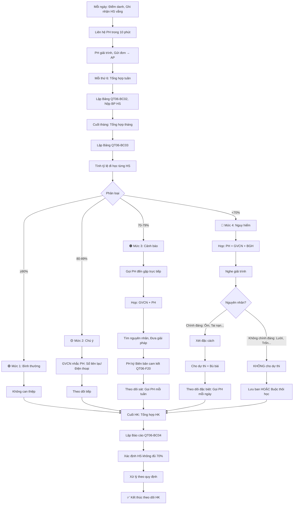

# SOP-02.3: THEO DÕI VẮNG MẶT

## 1. THÔNG TIN QUY TRÌNH

| **Thuộc tính** | **Nội dung** |
|---|---|
| Mã SOP | SOP-02.3 |
| Tên quy trình | Theo dõi vắng mặt |
| Quy trình cha | SOP-02: Quản lý điểm danh |
| Phiên bản | 1.0 |
| Tần suất | Theo dõi liên tục, Báo cáo tuần/tháng |

## 2. MỤC ĐÍCH

- **Phát hiện sớm**: HS vắng nhiều → Nguy cơ học yếu, Bỏ học
- **Can thiệp kịp**: Hỗ trợ HS, PH khi cần
- **Đảm bảo pháp lý**: HS đủ số buổi học theo quy định
- **Báo cáo chính xác**: Phục vụ quản lý, Kiểm tra

## 3. PHẠM VI ÁP DỤNG

Tất cả học sinh, Đặc biệt chú ý HS vắng nhiều

## 4. PHÂN LOẠI MỨC ĐỘ VẮNG

### 4.1. 4 mức độ cảnh báo

```
╔══════════════════════════════════════════════════════════════════╗
║              THANG ĐÁNH GIÁ MỨC ĐỘ VẮNG                          ║
╠══════════════════════════════════════════════════════════════════╣
║ 🟢 MỨC 1: BÌNH THƯỜNG (Green - Safe)                             ║
║    • Vắng: 0-5 ngày/tháng                                        ║
║    • Tỷ lệ: ≥ 90% số buổi học                                    ║
║    • Đánh giá: HS đi học đều, Không lo ngại                      ║
║    • Hành động: Không                                            ║
╠══════════════════════════════════════════════════════════════════╣
║ 🟡 MỨC 2: CHÚ Ý (Yellow - Watch)                                 ║
║    • Vắng: 6-10 ngày/tháng                                       ║
║    • Tỷ lệ: 80-89% số buổi học                                   ║
║    • Đánh giá: Vắng hơi nhiều, Cần theo dõi                      ║
║    • Hành động: Ghi Sổ liên lạc, Nhắc PH                         ║
╠══════════════════════════════════════════════════════════════════╣
║ 🟠 MỨC 3: CẢNH BÁO (Orange - Alert)                              ║
║    • Vắng: 11-15 ngày/tháng                                      ║
║    • Tỷ lệ: 70-79% số buổi học                                   ║
║    • Đánh giá: Vắng nhiều, Nguy cơ không đủ số buổi dự thi       ║
║    • Hành động: Gọi PH đến gặp, Tìm giải pháp                    ║
╠══════════════════════════════════════════════════════════════════╣
║ 🔴 MỨC 4: NGUY HIỂM (Red - Critical)                             ║
║    • Vắng: >15 ngày/tháng                                        ║
║    • Tỷ lệ: <70% số buổi học                                     ║
║    • Đánh giá: Rất nghiêm trọng! Nguy cơ không được dự thi!      ║
║    • Hành động: Họp PH + BGH, Can thiệp mạnh, Xem xét buộc thôi  ║
╚══════════════════════════════════════════════════════════════════╝
```

### 4.2. Dấu hiệu nguy cơ bỏ học

**⚠️ CẦN CAN THIỆP GẤP nếu HS có ≥2 dấu hiệu sau:**

```
□ Vắng nhiều ngày liên tiếp (≥5 ngày) - Không báo trước
□ Vắng không phép nhiều lần
□ PH không trả lời điện thoại, Không hợp tác
□ HS nói: "Con không muốn đi học", "Con ghét trường"
□ Học lực xuống rõ rệt (So với trước)
□ Không làm bài tập, Không quan tâm
□ PH nợ học phí kéo dài (>2 tháng)
□ Gia đình có biến cố (Ly hôn, Mất việc, Chuyển nhà...)
```

## 5. QUY TRÌNH THEO DÕI

### 5.1. Theo dõi hàng ngày

**Bước 1: GVCN ghi nhận HS vắng (Mỗi ngày - Sau điểm danh)**

**Công cụ:** Sổ theo dõi hoặc Phần mềm

**Ghi nhận:**

```
Ngày 01/09/2024:
• Nguyễn Văn A: Vắng có phép (AP) - Ốm, Có giấy BV
• Trần Thị B: Vắng không phép (A) - PH chưa gửi đơn

→ Liên hệ PH của B!
```

**Bước 2: Liên hệ PH (Trong 10 phút)**

- PH trả lời + Lý do hợp lý → Chuyển A thành AP
- PH không trả lời → Gọi lại 2 lần trong ngày
- PH vẫn không trả lời → Báo BP HS

**Bước 3: Ghi chú (Nếu cần)**

```
VD:
• "A vắng do ốm, Đã có giấy BV, Dự kiến nghỉ 3 ngày"
• "B vắng, PH nói đi du lịch, Nhưng chưa gửi đơn. 
   Đã nhắc nhở, PH hứa gửi mai"
```

### 5.2. Tổng hợp tuần (Mỗi thứ 6)

**Bước 4: GVCN lập Bảng tổng hợp tuần (QT06-BC02)**

```
═══════════════════════════════════════════════════════
  BẢNG TỔNG HỢP VẮNG MẶT TUẦN __
  Lớp: _______  GVCN: _______  Từ __/__ đến __/__
═══════════════════════════════════════════════════════

STT | Họ tên        | Vắng | Vắng  | Lý do       | Ghi chú
    |               | có   | không|             |
    |               | phép | phép  |             |
────┼───────────────┼──────┼───────┼─────────────┼──────────
 1  | Nguyễn Văn A  |  3   |   0   | Ốm (Sốt)   | Có giấy BV
 2  | Trần Thị B    |  1   |   1   | Du lịch +  | Chưa gửi đơn
    |               |      |       | Quên đơn   | lần 2
 3  | Lê Văn C      |  0   |   2   | Không rõ   | ⚠️ PH không
    |               |      |       |            | trả lời!
────┴───────────────┴──────┴───────┴─────────────┴──────────

TỔNG: 25 HS
• Vắng có phép: 4 buổi (4 HS)
• Vắng không phép: 3 buổi (2 HS) ⚠️

HS CẦN CHÚ Ý:
• Lê Văn C: Vắng không phép 2 lần, PH không liên lạc được!
  → Sẽ gặp PH tuần sau!

GVCN ký: __________  Ngày: __/__/____
═══════════════════════════════════════════════════════
```

**Bước 5: Nộp BP HS (Thứ 6 hằng tuần)**

### 5.3. Tổng hợp tháng (Cuối tháng)

**Bước 6: GVCN lập Bảng tổng hợp tháng (QT06-BC03)**

```
═══════════════════════════════════════════════════════
  BẢNG TỔNG HỢP VẮNG MẶT THÁNG __
  Lớp: _______  GVCN: _______  Tháng __/____
═══════════════════════════════════════════════════════

STT | Họ tên       | Sĩ số | Có   | Vắng | Vắng  | Tỷ lệ | Mức độ
    |              | buổi  | mặt  | có   | không | đi    |
    |              |       |      | phép | phép  | học   |
────┼──────────────┼───────┼──────┼──────┼───────┼───────┼────────
 1  | Nguyễn Văn A |  40   |  37  |  3   |   0   | 92.5% | 🟢 OK
 2  | Trần Thị B   |  40   |  35  |  3   |   2   | 87.5% | 🟡 Chú ý
 3  | Lê Văn C     |  40   |  32  |  2   |   6   | 80.0% | 🟡 Chú ý
 4  | Phạm Thị D   |  40   |  28  |  5   |   7   | 70.0% | 🟠 Cảnh báo!
────┴──────────────┴───────┴──────┴──────┴───────┴───────┴────────

THỐNG KÊ:
• Tổng HS: 25
• 🟢 Bình thường (≥90%): 18 HS (72%)
• 🟡 Chú ý (80-89%): 5 HS (20%)
• 🟠 Cảnh báo (70-79%): 2 HS (8%)
• 🔴 Nguy hiểm (<70%): 0 HS (0%)

HS CẦN CAN THIỆP:
• Phạm Thị D: Vắng không phép 7 lần! Tỷ lệ 70%!
  → Đã gọi PH 3 lần, PH hứa cải thiện
  → Sẽ họp PH + BGH tuần sau!

GVCN ký: __________  Ngày: __/__/____
═══════════════════════════════════════════════════════
```

**Bước 7: Nộp BP HS (Ngày 5 tháng sau)**

**Bước 8: BP HS tổng hợp toàn trường, Báo BGH**

### 5.4. Tổng hợp học kỳ (Cuối HK)

**Bước 9: GVCN lập Báo cáo HK (QT06-BC04)**

```
Lớp: _______  GVCN: _______  HK: __  Năm học: ________

TỔNG SỐ BUỔI HỌC: 180 buổi (90 ngày × 2 buổi)

╔═══════════════════════════════════════════════════╗
║  PHÂN LOẠI HS THEO TỶ LỆ ĐI HỌC                  ║
╠═══════════════════════════════════════════════════╣
║ ≥90% (Rất tốt)    : 20 HS (80%)                  ║
║ 80-89% (Tốt)      :  3 HS (12%)                  ║
║ 70-79% (Trung bình):  2 HS (8%)                  ║
║ <70% (Yếu)        :  0 HS (0%)                   ║
╚═══════════════════════════════════════════════════╝

HS KHÔNG ĐỦ 70% (Không được dự thi):
• (Không có)

HS GẦN KHÔNG ĐỦ (70-75% - Cần lưu ý HK sau):
• Phạm Thị D: 70.5% (127/180 buổi)
  → Đã can thiệp, PH cam kết cải thiện HK2

NHẬN XÉT:
• Tỷ lệ đi học chung lớp: 89.2% (Tốt!)
• Có 2 HS cần theo dõi sát HK2
• Đã hợp tác tốt với PH

GVCN ký: __________  Trưởng BP HS ký: __________
```

## 6. CAN THIỆP THEO MỨC ĐỘ

### 6.1. Mức 1: Bình thường (🟢)

**Không can thiệp đặc biệt**

- Tiếp tục theo dõi thường xuyên

### 6.2. Mức 2: Chú ý (🟡 80-89%)

**Bước 10: GVCN nhắc nhở PH**

```
Ghi Sổ liên lạc:
"Con [Tên] tháng này vắng 8 ngày (Tỷ lệ 86%).
 PH chú ý đưa con đi học đều hơn ạ!
 Con vắng nhiều → Khó theo kịp bài!"

Hoặc Gọi điện:
"Chào quý PH, Cô nhận thấy con [Tên] tháng này 
 vắng hơi nhiều. Có vấn đề gì không ạ?"
 
[PH giải thích...]

"Cô hiểu. Nhưng nếu vắng nhiều, Con sẽ không đủ 70%
 số buổi, Không được dự thi HK ạ. PH lưu ý nhé!"
```

### 6.3. Mức 3: Cảnh báo (🟠 70-79%)

**Bước 11: GVCN gọi PH đến gặp trực tiếp**

```
Nội dung họp:

1. Trình bày tình hình:
   "Con [Tên] đã vắng ____ ngày (Tỷ lệ __%).
    Theo quy định, Con phải có ≥70% số buổi mới dự thi.
    Giờ con đang ở mức nguy hiểm!"

2. Tìm hiểu nguyên nhân:
   "Tại sao con vắng nhiều vậy ạ?"
   
   [PH trả lời: Ốm, Gia đình khó khăn, Con không thích trường...]

3. Đưa ra giải pháp:
   • Nếu ốm: Tăng cường sức khỏe, Chăm sóc tốt hơn
   • Nếu không thích trường: Tìm hiểu lý do, Hỗ trợ
   • Nếu khó khăn: Xem xét hỗ trợ học phí, Xe đưa đón...

4. Cam kết:
   "Từ giờ đến cuối HK, Con cần đi học đều.
    Chỉ nghỉ khi thật sự cần thiết!
    Quý PH cam kết được không ạ?"
   
   [PH ký Biên bản cam kết - QT06-F20]
```

**Biên bản cam kết (QT06-F20):**

```
═══════════════════════════════════════════════════════
         BIÊN BẢN CAM KẾT CẢI THIỆN CHUYÊN CẦN
═══════════════════════════════════════════════════════

Hôm nay, Ngày __/__/____

Tôi là PH của em: _______________  Lớp: __________

NHẬN THẤY:
• Con em đã vắng ____ ngày (Tỷ lệ ____%)
• Hiện tại gần không đủ số buổi dự thi (< 70%)

CAM KẾT:
Từ nay đến cuối HK, Tôi cam kết:
• Đưa con đi học đều đặn
• Chỉ cho con nghỉ khi thật sự ốm, Có giấy BV
• Hợp tác với trường, Liên lạc thường xuyên

Nếu không thực hiện được cam kết, Tôi xin chịu trách nhiệm!

PH ký: __________  GVCN ký: __________
═══════════════════════════════════════════════════════
```

**Bước 12: Theo dõi sát (Mỗi tuần gọi PH 1 lần)**

### 6.4. Mức 4: Nguy hiểm (🔴 <70%)

**Bước 13: Họp PH + GVCN + BGH**

```
Thành phần: PH, HS, GVCN, BP HS, Phó HT (Hoặc HT)

Nội dung:

1. BGH phát biểu:
   "Con [Tên] đã vắng ____ buổi (Tỷ lệ ____%).
    Theo quy định, Con KHÔNG được dự thi HK này!
    Đây là vấn đề RẤT NGHIÊM TRỌNG!"

2. Nghe PH & HS giải trình:
   [Tìm hiểu nguyên nhân sâu xa]

3. Quyết định:
   
   TRƯỜNG HỢP A: Nguyên nhân chính đáng (Ốm dài, Tai nạn, Thiên tai...)
   → Xét đặc cách (Cho dự thi, Nhưng phải bù bài, Kiểm tra)
   
   TRƯỜNG HỢP B: Nguyên nhân không chính đáng (Lười, Trốn học...)
   → KHÔNG cho dự thi!
   → Lưu ban HOẶC Buộc thôi học (Nếu quá nghiêm trọng)

4. Lập Biên bản (QT06-F21)
```

**Bước 14: Theo dõi đặc biệt (Nếu tiếp tục học)**

- Gọi PH mỗi ngày
- Kiểm tra HS đến lớp
- Hỗ trợ học tập (Phụ đạo miễn phí)

## 7. LƯU ĐỒ QUY TRÌNH



## 8. BIỂU MẪU LIÊN QUAN

| **Mã** | **Tên** |
|---|---|
| QT06-BC02 | Bảng tổng hợp vắng mặt tuần |
| QT06-BC03 | Bảng tổng hợp vắng mặt tháng |
| QT06-BC04 | Báo cáo vắng mặt học kỳ |
| QT06-F20 | Biên bản cam kết cải thiện chuyên cần |
| QT06-F21 | Biên bản họp PH (Mức nguy hiểm) |

## 9. TIÊU CHUẨN VÀ CHỈ TIÊU

| **Chỉ tiêu** | **Mục tiêu** |
|---|---|
| Tỷ lệ HS đi học ≥90% | ≥ 85% |
| Tỷ lệ HS không đủ 70% (Không dự thi) | ≤ 2% |
| HS mức Cảnh báo/Nguy hiểm được can thiệp kịp | 100% |
| Báo cáo tuần/tháng đúng hạn | 100% |

## 10. TRÁCH NHIỆM CỤ THỂ

| **Vai trò** | **Trách nhiệm** |
|---|---|
| **GVCN** | Theo dõi hàng ngày, Lập báo cáo tuần/tháng, Can thiệp Mức 1-2 |
| **BP HS** | Tổng hợp toàn trường, Hỗ trợ GVCN, Can thiệp Mức 3 |
| **BGH** | Can thiệp Mức 4, Quyết định xét đặc cách/Lưu ban/Buộc thôi học |
| **PH** | Đưa con đi học đều, Hợp tác với trường |

## 11. LƯU Ý QUAN TRỌNG

- ⚠️ **Phát hiện sớm = Cứu được HS**: HS vắng nhiều → Can thiệp ngay, Không chờ!
- ✅ **Tìm nguyên nhân**: Hiểu tại sao HS vắng → Mới giúp được!
- 🔥 **Nhân văn**: Gia đình khó khăn → Hỗ trợ, Không đuổi học!
- ✅ **Kiên quyết**: Trốn học, Lười → Xử lý nghiêm!

## 12. PHỤ LỤC

### 12.1. Xử lý các tình huống đặc biệt

**A. HS ốm dài ngày (>2 tuần):**

```
1. Yêu cầu giấy BV xác nhận
2. GVCN giao bài về nhà (Qua PH)
3. HS tự học hoặc Gia sư
4. Khi đi học lại:
   • Kiểm tra kiến thức bù
   • Nếu đạt → Tính đủ số buổi
   • Nếu không → Xem xét lưu ban
```

**B. HS bị tai nạn, Nhập viện:**

```
1. Trường đến thăm (GVCN + Đại diện BGH)
2. Động viên HS, PH
3. Xét đặc cách (Cho dự thi không cần đủ 70%)
4. Hỗ trợ học bù (Miễn phí)
```

**C. Gia đình khó khăn (Không tiền đưa con đi học):**

```
1. Tìm hiểu hoàn cảnh
2. Hỗ trợ:
   • Miễn giảm học phí
   • Hỗ trợ xe đưa đón
   • Hỗ trợ ăn trưa
3. Kêu gọi từ thiện (Nếu cần)
4. Mục tiêu: GIỮ CHÂN HS!
```

**D. HS trốn học (PH không biết):**

```
1. Phát hiện → Gọi PH NGAY
2. Tìm HS (Xem camera, Hỏi bạn...)
3. Tìm thấy → Đưa về trường
4. Họp: HS + PH + GVCN + Tâm lý
5. Tìm nguyên nhân: Sao trốn?
   • Bị bắt nạt? → Xử lý bạn bắt nạt
   • Học yếu, Xấu hổ? → Phụ đạo
   • Nghiện game? → Tâm lý can thiệp
6. Kỷ luật + Theo dõi sát
```

### 12.2. Công thức tính tỷ lệ đi học

```
Tỷ lệ đi học (%) = (Số buổi có mặt / Tổng số buổi) × 100%

VD:
Tháng 9 có 20 ngày học = 40 buổi
HS A có mặt: 36 buổi
→ Tỷ lệ = (36/40) × 100% = 90%

LƯU Ý:
• Vắng có phép (AP): TÍNH vào "Số buổi có mặt"? 
  → KHÔNG! Vì HS không đến trường!
  → Nhưng KHÔNG vi phạm!
  
• Muộn (L): TÍNH vào "Số buổi có mặt"?
  → CÓ! (Nếu muộn <30 phút)
  → KHÔNG! (Nếu muộn >1 tiết) → Tính 1/2 buổi
```

## 13. FAQ

**Q1: HS vắng có phép nhiều (Do ốm), Tỷ lệ 65%. Có được dự thi không?**  
A: Theo quy định: KHÔNG!
Nhưng: Nếu có giấy BV, Lý do chính đáng → Xét đặc cách (Cho dự thi + Bù bài)

**Q2: HS đi thi đấu thể thao (Đại diện trường) 10 ngày. Có tính vắng không?**  
A: KHÔNG tính vắng! Tính "Đi học đến" (I) → Đủ số buổi!

**Q3: PH nói con ốm, Nhưng không có giấy BV. Có được tính vắng có phép không?**  
A: 
- Nghỉ 1-2 ngày: OK, Tin PH (Không cần giấy)
- Nghỉ ≥3 ngày: BẮT BUỘC phải có giấy BV!
- Không có giấy → Tính vắng không phép!

**Q4: Cuối HK mới phát hiện HS không đủ 70%. Giờ xử lý thế nào?**  
A: Đã MUỘ N! Lỗi do GVCN không theo dõi sát!
- HS: Không được dự thi, Lưu ban
- GVCN: Bị phê bình (Vì không làm tốt nhiệm vụ!)

→ Bài học: PHẢI theo dõi LIÊN TỤC, Đừng chờ cuối HK!

---

**PHÊ DUYỆT**

| GVCN | Trưởng BP HS | Phó HT |
|---|---|---|
| [Họ tên] | [Họ tên] | [Họ tên] |
