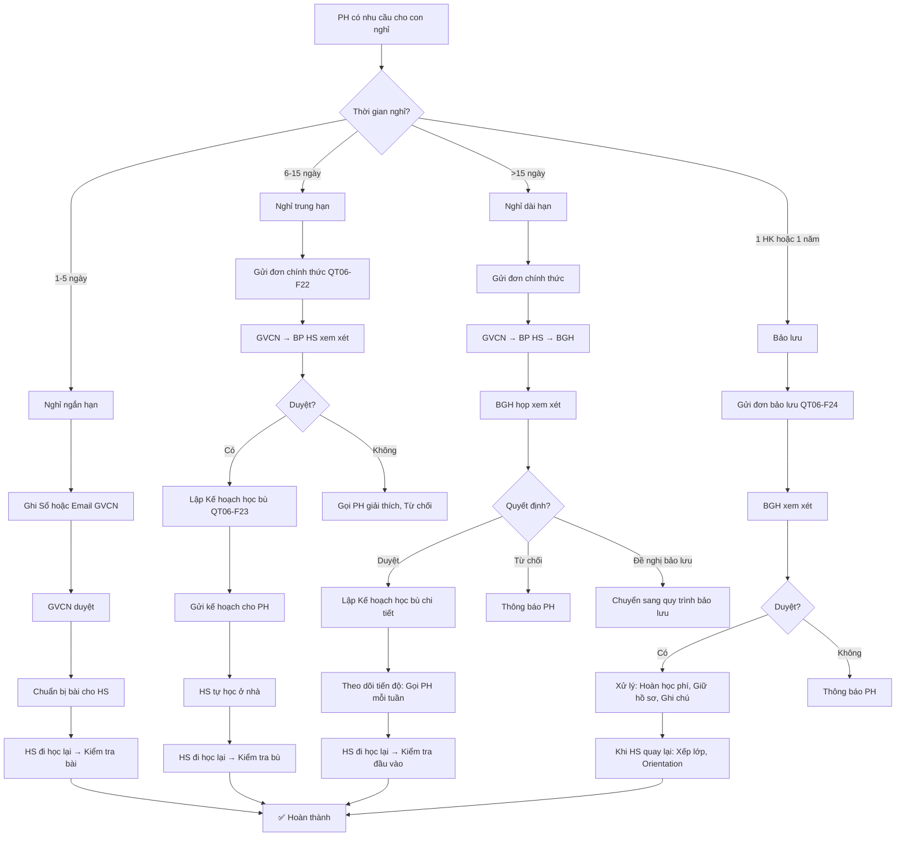

# SOP-02.4: XỬ LÝ NGHỈ HỌC

## 1. THÔNG TIN QUY TRÌNH

| **Thuộc tính** | **Nội dung** |
|---|---|
| Mã SOP | SOP-02.4 |
| Tên quy trình | Xử lý nghỉ học |
| Quy trình cha | SOP-02: Quản lý điểm danh |
| Phiên bản | 1.0 |
| Tần suất | Khi HS nghỉ |

## 2. MỤC ĐÍCH

- **Quy trình rõ ràng**: PH biết cách xin nghỉ đúng
- **Đảm bảo học tập**: HS nghỉ → Vẫn theo kịp bài
- **An toàn**: Biết HS ở đâu, Làm gì
- **Pháp lý**: Tuân thủ quy định xin nghỉ

## 3. PHẠM VI ÁP DỤNG

Tất cả học sinh có nhu cầu nghỉ học (Dài hạn hoặc Ngắn hạn)

## 4. PHÂN LOẠI NGHỈ HỌC

### 4.1. Theo thời gian

```
╔══════════════════════════════════════════════════════════════════╗
║               PHÂN LOẠI THEO THỜI GIAN                           ║
╠══════════════════════════════════════════════════════════════════╣
║ A. NGHỈ NGẮN HẠN (Short-term Leave)                             ║
║    • Thời gian: 1-5 ngày                                         ║
║    • Lý do: Ốm thông thường, Việc gia đình nhỏ                   ║
║    • Thủ tục: Đơn giản (Ghi Sổ hoặc Gửi email GVCN)             ║
║    • Phê duyệt: GVCN                                             ║
╠══════════════════════════════════════════════════════════════════╣
║ B. NGHỈ TRUNG HẠN (Medium-term Leave)                           ║
║    • Thời gian: 6-15 ngày                                        ║
║    • Lý do: Ốm nặng, Việc gia đình quan trọng                    ║
║    • Thủ tục: Đơn xin nghỉ chính thức + Giấy tờ chứng minh      ║
║    • Phê duyệt: GVCN → BP HS                                     ║
╠══════════════════════════════════════════════════════════════════╣
║ C. NGHỈ DÀI HẠN (Long-term Leave)                               ║
║    • Thời gian: >15 ngày (Hoặc ≥3 tuần)                          ║
║    • Lý do: Ốm rất nặng, Tai nạn, Đi nước ngoài, Gia đình...    ║
║    • Thủ tục: Đơn chính thức + Giấy tờ + Kế hoạch học bù        ║
║    • Phê duyệt: GVCN → BP HS → BGH                               ║
╠══════════════════════════════════════════════════════════════════╣
║ D. BẢO LƯU (Leave of Absence)                                    ║
║    • Thời gian: 1 HK hoặc 1 năm học                              ║
║    • Lý do: Chữa bệnh dài hạn, Đi nước ngoài...                  ║
║    • Thủ tục: Đơn bảo lưu + Giấy tờ chứng minh                   ║
║    • Phê duyệt: BGH                                              ║
║    • Lưu ý: Giữ chỗ, Không mất học phí (Hoặc hoàn 50%)          ║
╚══════════════════════════════════════════════════════════════════╝
```

### 4.2. Theo lý do

| **Lý do** | **Mức độ hợp lý** | **Giấy tờ cần** |
|---|---|---|
| **Ốm, Bệnh** | ✅ Rất hợp lý | Giấy BV (Nếu ≥3 ngày) |
| **Việc gia đình (Đám tang, cưới...)** | ✅ Hợp lý | Đơn xin nghỉ, Giấy mời (Nếu có) |
| **Thi đấu thể thao, Cuộc thi** | ✅ Hợp lý | Giấy mời/Xác nhận |
| **Đi du lịch với gia đình** | ⚠️ Chấp nhận (Nhưng không khuyến khích) | Đơn xin nghỉ |
| **Không thích đi học** | ❌ Không hợp lý | Không chấp nhận |
| **Phụ giúp gia đình (Bán hàng...)** | ❌ Không hợp lý | Không chấp nhận |

## 5. QUY TRÌNH XIN NGHỈ

### 5.1. Nghỉ ngắn hạn (1-5 ngày)

**Bước 1: PH gửi đơn (Trước 1 ngày - Nếu biết trước)**

**Hình thức:**
- Viết tay vào Sổ liên lạc
- Hoặc Gửi email GVCN
- Hoặc Nhắn tin qua App trường
- Hoặc Gọi điện (Nếu đột xuất)

**Mẫu đơn:**

```
Kính gửi Cô/Thầy GVCN lớp ________

Con em [Tên HS] xin nghỉ học:
• Ngày __/__/____
• Lý do: Con ốm, Sốt 38.5 độ

Xin cô/thầy cho phép!

                             PH ký: __________
```

**Bước 2: GVCN duyệt**

- Lý do hợp lý → Duyệt, Ghi vào Phần mềm (AP)
- Lý do không hợp lý → Gọi PH trao đổi

**Bước 3: GVCN chuẩn bị bài cho HS (Nếu nghỉ ≥2 ngày)**

```
Gửi qua Sổ liên lạc, Email hoặc App:

"Hôm nay lớp học:
 • Toán: Bài 15 - Phép nhân, Trang 45-47
 • Tiếng Việt: Đọc văn 'Bác Hồ với thiếu nhi', Trang 20
 
 Con tự học ở nhà, Không hiểu hỏi cô qua điện thoại!"
```

**Bước 4: HS đi học lại → GVCN kiểm tra bài**

### 5.2. Nghỉ trung hạn (6-15 ngày)

**Bước 1: PH gửi đơn chính thức (Trước 3 ngày - Nếu biết trước)**

**Đơn xin nghỉ (QT06-F22):**

```
═══════════════════════════════════════════════════════
              ĐƠN XIN NGHỈ HỌC TRUNG HẠN
═══════════════════════════════════════════════════════

Kính gửi: Ban Giám hiệu trường __________

Tên HS: _____________________  Lớp: __________

Xin nghỉ học:
• Từ ngày: __/__/____  Đến ngày: __/__/____
• Tổng số ngày: ____ ngày

Lý do: _____________________________________________
___________________________________________________

Đính kèm: [Giấy BV / Giấy chứng nhận / ...]

Cam kết:
• Con em sẽ tự học bài tại nhà
• Khi đi học lại, Con sẽ làm bài kiểm tra bù
• PH chịu trách nhiệm việc học của con

                             Ngày __/__/____
                             PH ký: __________

---
PHẦN TRƯỜNG DUYỆT:
□ Đồng ý    □ Không đồng ý
Lý do (Nếu không đồng ý): ______________________

GVCN ký: __________  Trưởng BP HS ký: __________
═══════════════════════════════════════════════════════
```

**Bước 2: GVCN nhận đơn → Trình BP HS (Trong 1 ngày)**

**Bước 3: BP HS xem xét**

```
Kiểm tra:
• Lý do có hợp lý?
• Có giấy tờ chứng minh?
• HS đã vắng bao nhiêu ngày trong HK?
  → Nếu đã vắng nhiều → Cân nhắc!
```

**Bước 4: BP HS phê duyệt hoặc Từ chối**

- Đồng ý → Ký duyệt
- Từ chối → Ghi rõ lý do, Gọi PH giải thích

**Bước 5: GVCN lập Kế hoạch học bù (QT06-F23)**

```
═══════════════════════════════════════════════════════
           KẾ HOẠCH HỌC BÙ CHO HS NGHỈ HỌC
═══════════════════════════════════════════════════════

HS: _______________  Lớp: ____  Nghỉ: ____ ngày

BÀI HỌC CẦN TỰ HỌC:

1. TOÁN:
   • Bài 15: Phép nhân (SGK trang 45-47, SBT bài 1-5)
   • Bài 16: Phép chia (SGK trang 50-52, SBT bài 6-10)
   
2. TIẾNG VIỆT:
   • Đọc văn "Bác Hồ với thiếu nhi" (Trang 20-22)
   • Làm bài tập trang 23
   
3. ... (Các môn khác)

BÀI KIỂM TRA BÙ (Khi đi học lại):
• Toán: Bài kiểm tra 15 phút (Bài 15-16)
• Tiếng Việt: Đọc văn + Trả lời câu hỏi

Liên hệ: GVCN [Tên], SĐT: __________

GVCN ký: __________
═══════════════════════════════════════════════════════
```

**Bước 6: Gửi Kế hoạch cho PH**

**Bước 7: HS đi học lại → Kiểm tra bài bù**

### 5.3. Nghỉ dài hạn (>15 ngày)

**Bước 1: PH gửi đơn chính thức (Trước 1 tuần - Nếu biết trước)**

**Đơn tương tự nghỉ trung hạn, Nhưng:**
- Giải thích rõ hơn lý do
- Cam kết học bù nghiêm túc
- Đính kèm đầy đủ giấy tờ

**Bước 2: GVCN → BP HS → BGH**

**Bước 3: BGH họp xem xét**

```
Thành phần: HT, Phó HT, Trưởng BP HS, GVCN

Nội dung:
1. GVCN trình bày: HS [Tên], Lý do nghỉ, Thời gian...
2. Kiểm tra:
   • HS đã vắng bao nhiêu trong HK?
   • Học lực hiện tại thế nào?
   • Có khả năng theo kịp bài sau khi nghỉ?
3. Quyết định:
   • Đồng ý + Lập kế hoạch học bù chi tiết
   • Từ chối (Nếu lý do không chính đáng)
   • Đề nghị bảo lưu (Nếu nghỉ quá dài)
```

**Bước 4: Lập Kế hoạch học bù CHI TIẾT**

- Giao bài cụ thể từng tuần
- HS tự học + Làm bài tập → Gửi qua email/App
- GVCN chấm, Phản hồi

**Bước 5: Theo dõi tiến độ (Gọi PH mỗi tuần)**

**Bước 6: HS đi học lại**

- Kiểm tra đầu vào (Tất cả môn)
- Nếu đạt → Tiếp tục học
- Nếu không đạt → Phụ đạo thêm

### 5.4. Bảo lưu (1 HK hoặc 1 năm)

**Bước 1: PH gửi Đơn xin bảo lưu (QT06-F24)**

```
═══════════════════════════════════════════════════════
              ĐƠN XIN BẢO LƯU HỌC TẬP
═══════════════════════════════════════════════════════

Kính gửi: Ban Giám hiệu trường __________

Tên HS: _____________________  Lớp: __________

Xin BẢO LƯU học tập:
• Thời gian: □ HK __  □ Năm học ________

Lý do: _____________________________________________
___________________________________________________
___________________________________________________

Đính kèm: [Giấy BV / Giấy chứng nhận / ...]

Cam kết:
• Con em sẽ quay lại học sau khi hết thời gian bảo lưu
• PH chịu trách nhiệm việc học của con trong thời gian bảo lưu

                             Ngày __/__/____
                             PH ký: __________

---
PHẦN TRƯỜNG DUYỆT:
□ Đồng ý bảo lưu
□ Không đồng ý

Thời hạn bảo lưu: Từ __/__/____ Đến __/__/____

HT ký: __________  Ngày: __/__/____
═══════════════════════════════════════════════════════
```

**Bước 2: BGH xem xét, Phê duyệt**

**Bước 3: Xử lý hành chính**

```
1. Học phí:
   • Bảo lưu HK: Hoàn 50% học phí HK đó
   • Bảo lưu năm: Hoàn 80% học phí
   
2. Hồ sơ:
   • Lưu lại (KHÔNG trả cho PH)
   • Ghi chú: "Đã bảo lưu __/__/____ đến __/__/____"
   
3. Danh sách lớp:
   • Đánh dấu "Bảo lưu"
   • Giữ chỗ (Trong thời hạn bảo lưu)
```

**Bước 4: Khi HS quay lại**

```
PH đến trường:
1. Gặp BP HS
2. Xác nhận HS đã khỏe, Sẵn sàng học lại
3. Đóng học phí (Nếu chưa đóng)
4. Xếp lớp (Lớp cũ hoặc Lớp tương đương)
5. Orientation ngắn (1 buổi)
```

### 5.5. Nghỉ đột xuất (Không báo trước)

**Tình huống:** HS ốm đột ngột sáng, PH chưa kịp gửi đơn

**Bước 1: PH gọi điện/Nhắn tin GVCN NGAY (Trước 8:00)**

```
"Cô ơi, Con em [Tên] hôm nay ốm đột ngột, 
 Sốt 39 độ. Con em xin nghỉ ạ.
 Em sẽ gửi đơn và Giấy BV sau!"
```

**Bước 2: GVCN ghi nhận TẠM (AP)**

**Bước 3: PH bổ sung đơn + Giấy (Trong 3 ngày)**

- Có → OK, Xác nhận AP
- Không → Chuyển thành A (Vắng không phép)

## 6. XỬ LÝ KHI HS ĐI HỌC LẠI

### 6.1. Kiểm tra bài bù

**Nghỉ 1-2 ngày:**
- Hỏi miệng hoặc Xem bài tập

**Nghỉ 3-5 ngày:**
- Kiểm tra miệng các môn chính (Toán, Văn)

**Nghỉ ≥6 ngày:**
- Kiểm tra viết (15-30 phút)
- Tất cả môn đã học

### 6.2. Phụ đạo (Nếu cần)

```
HS không theo kịp bài (Nghỉ quá lâu):
→ GVCN phụ đạo buổi chiều (Miễn phí)
→ Thời gian: 1-2 tuần
→ Mục tiêu: HS theo kịp lớp
```

### 6.3. Theo dõi tiếp

- GVCN chú ý HS trong 1-2 tuần
- Đảm bảo HS theo kịp bài
- Liên hệ PH (Nếu có vấn đề)

## 7. LƯU ĐỒ QUY TRÌNH



## 8. BIỂU MẪU LIÊN QUAN

| **Mã** | **Tên** |
|---|---|
| QT06-F22 | Đơn xin nghỉ trung hạn |
| QT06-F23 | Kế hoạch học bù |
| QT06-F24 | Đơn xin bảo lưu |

## 9. TIÊU CHUẨN VÀ CHỈ TIÊU

| **Chỉ tiêu** | **Mục tiêu** |
|---|---|
| Thời gian duyệt đơn nghỉ ngắn hạn | ≤ 1 ngày |
| Thời gian duyệt đơn nghỉ trung/dài hạn | ≤ 3 ngày |
| Tỷ lệ HS có Kế hoạch học bù (Nghỉ ≥3 ngày) | 100% |
| Tỷ lệ HS theo kịp bài sau nghỉ | ≥ 90% |

## 10. TRÁCH NHIỆM CỤ THỂ

| **Vai trò** | **Trách nhiệm** |
|---|---|
| **PH** | Xin nghỉ đúng quy trình, Giám sát con học bù |
| **GVCN** | Duyệt nghỉ ngắn hạn, Lập kế hoạch học bù, Kiểm tra bài bù |
| **BP HS** | Duyệt nghỉ trung hạn, Hỗ trợ GVCN |
| **BGH** | Duyệt nghỉ dài hạn, Bảo lưu |
| **HS** | Tự học ở nhà, Làm bài tập, Kiểm tra bù khi đi học lại |

## 11. LƯU Ý QUAN TRỌNG

- ⚠️ **Xin phép TRƯỚC khi nghỉ**: Không xin → Vi phạm!
- ✅ **Học bù nghiêm túc**: Nghỉ ≠ Được chơi! Phải học ở nhà!
- 🔥 **Không lạm dụng**: Đi du lịch trong năm học → KHÔNG khuyến khích!
- ✅ **Giữ liên lạc**: PH phải báo tình hình con hằng ngày (Nếu nghỉ dài)!

## 12. PHỤ LỤC

### 12.1. Xử lý tình huống đặc biệt

**A. HS nghỉ quá nhiều (Gần không đủ 70%):**

```
VD: HS đã nghỉ 25 ngày, Còn 5 ngày nữa là không đủ dự thi.
    PH xin cho con nghỉ thêm 10 ngày (Đi du lịch)

XỬ LÝ:
GVCN: "Quý PH ạ, Con [Tên] đã nghỉ nhiều. Nếu nghỉ thêm,
       Con sẽ không đủ số buổi, Không được dự thi!
       Chúng em KHÔNG thể duyệt đơn này!"
       
→ Từ chối đơn!
→ Giải thích PH rõ hậu quả!
```

**B. PH xin nghỉ, Nhưng HS vẫn đến trường:**

```
VD: PH gửi đơn "Con ốm, Xin nghỉ 3 ngày"
    Nhưng HS vẫn đến lớp bình thường!

XỬ LÝ:
1. GVCN gọi PH hỏi: "Con không ốm à? Sao vẫn đến?"
2. Nếu PH nói "Con khỏe rồi, Đi học được!"
   → OK! Hủy đơn nghỉ, Ghi HS có mặt!
3. Nếu phát hiện HS "Trốn nhà" (PH tưởng con nghỉ, Nhưng con vẫn đi)
   → Gọi PH đến GẤP! Xử lý HS!
```

**C. HS xin nghỉ giữa chừng (Trong giờ học):**

```
Tiết 3, HS: "Cô ơi, Con đau bụng!"

GV:
1. Kiểm tra: Sờ trán, Hỏi triệu chứng
2. Nếu thật sự ốm:
   • Đưa Y tế
   • Y tế gọi PH đến đón
   • PH ký biên bản đón sớm
3. Nếu HS giả vờ (Để trốn kiểm tra):
   • Phát hiện → Phê bình
   • Vẫn phải làm bài kiểm tra!
```

### 12.2. Mẫu tin nhắn gửi PH (Khi con nghỉ)

```
TIN NHẮN HẰNG NGÀY (Nếu nghỉ ≥3 ngày):

"Chào quý PH,

Hôm nay (Ngày __), Lớp học:
• Toán: Bài 16 - Phép chia, Trang 50-52
• Văn: Đọc "Bác Hồ với thiếu nhi", Trang 20-22

Quý PH nhắc con học bài nhé! Con đang nghỉ ngày thứ __/__.

Chúc con sớm khỏe!

Cô/Thầy [Tên GVCN]"
```

## 13. FAQ

**Q1: Con ốm, PH gửi đơn xin nghỉ 3 ngày. Nhưng 2 ngày sau con đã khỏe. Có được đi học không?**  
A: ĐƯỢC! Khuyến khích luôn! PH gọi cô, Cho con đi học. Tốt hơn là nghỉ thêm!

**Q2: HS xin nghỉ đi du lịch 10 ngày (Giữa HK). Trường có duyệt không?**  
A: 
- Không khuyến khích!
- Nếu HS học giỏi, Chưa vắng nhiều, Lý do chính đáng (Đám cưới anh/chị...) → Xem xét duyệt
- Nếu HS học yếu, Đã vắng nhiều → TỪ CHỐI!

**Q3: HS nghỉ dài, Khi đi học lại không làm bài kiểm tra bù. Xử lý?**  
A: 
- Nhắc nhở lần 1: "Em phải làm bài kiểm tra bù!"
- Lần 2: Gọi PH, Yêu cầu làm
- Lần 3: Không cho lên lớp, Bắt làm bài trước!
- Mục đích: Không để HS lợi dụng "Nghỉ = Thoát kiểm tra"!

**Q4: Bảo lưu 1 năm, Khi quay lại HS học lớp nào?**  
A: 
- Nguyên tắc: Học lại lớp cũ!
  VD: Bảo lưu lớp 3 → Quay lại học lớp 3 (Năm sau)
- Trừ khi: HS tự học ở nhà, Kiểm tra đầu vào đạt → Lên lớp 4 (Xét đặc cách)

---

**PHÊ DUYỆT**

| GVCN | Trưởng BP HS | Phó HT | Hiệu trưởng |
|---|---|---|---|
| [Họ tên] | [Họ tên] | [Họ tên] | [Họ tên] |
