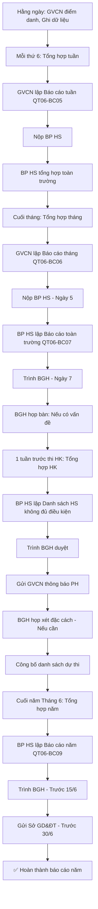

# SOP-02.5: BÁO CÁO ĐIỂM DANH

## 1. THÔNG TIN QUY TRÌNH

| **Thuộc tính** | **Nội dung** |
|---|---|
| Mã SOP | SOP-02.5 |
| Tên quy trình | Báo cáo điểm danh |
| Quy trình cha | SOP-02: Quản lý điểm danh |
| Phiên bản | 1.0 |
| Tần suất | Tuần/Tháng/HK/Năm |

## 2. MỤC ĐÍCH

- **Quản lý hiệu quả**: BGH nắm tình hình chuyên cần toàn trường
- **Phát hiện xu hướng**: Lớp nào vắng nhiều? Tháng nào vắng nhiều?
- **Ra quyết định**: Dựa vào dữ liệu để Can thiệp, Điều chỉnh
- **Báo cáo cấp trên**: Sở GD, Thanh tra...

## 3. PHẠM VI ÁP DỤNG

Tất cả các cấp học (Mầm non - Tiểu học - THCS)

## 4. HỆ THỐNG BÁO CÁO

### 4.1. Tổng quan hệ thống

```
╔══════════════════════════════════════════════════════════════════╗
║             HỆ THỐNG BÁO CÁO ĐIỂM DANH                           ║
╠══════════════════════════════════════════════════════════════════╣
║ CẤP 1: BÁO CÁO TUẦN (Weekly Report)                              ║
║  • Người lập: GVCN                                               ║
║  • Nộp cho: BP HS                                                ║
║  • Thời hạn: Thứ 6 hằng tuần                                     ║
║  • Mục đích: Theo dõi nhanh, Phát hiện sớm vấn đề                ║
╠══════════════════════════════════════════════════════════════════╣
║ CẤP 2: BÁO CÁO THÁNG (Monthly Report)                            ║
║  • Người lập: GVCN + BP HS                                       ║
║  • Nộp cho: BGH                                                  ║
║  • Thời hạn: Ngày 5 tháng sau                                    ║
║  • Mục đích: Đánh giá chuyên cần, Can thiệp HS vắng nhiều        ║
╠══════════════════════════════════════════════════════════════════╣
║ CẤP 3: BÁO CÁO HỌC KỲ (Semester Report)                          ║
║  • Người lập: BP HS                                              ║
║  • Nộp cho: BGH                                                  ║
║  • Thời hạn: 1 tuần trước khi thi HK                             ║
║  • Mục đích: Xác định HS đủ/Không đủ điều kiện dự thi            ║
╠══════════════════════════════════════════════════════════════════╣
║ CẤP 4: BÁO CÁO NĂM (Annual Report)                               ║
║  • Người lập: BP HS                                              ║
║  • Nộp cho: BGH, Sở GD&ĐT                                        ║
║  • Thời hạn: Trước 30/6                                          ║
║  • Mục đích: Tổng kết, So sánh năm, Lập kế hoạch năm sau         ║
╚══════════════════════════════════════════════════════════════════╝
```

### 4.2. Ma trận báo cáo

| **Loại báo cáo** | **Tần suất** | **Người lập** | **Người nhận** | **Hạn nộp** |
|---|---|---|---|---|
| Báo cáo tuần | Mỗi tuần | GVCN | BP HS | Thứ 6 |
| Báo cáo tháng | Mỗi tháng | GVCN + BP HS | BGH | Ngày 5/tháng sau |
| Báo cáo HK | Mỗi HK | BP HS | BGH | 1 tuần trước thi HK |
| Báo cáo năm | Mỗi năm | BP HS | BGH + Sở GD | Trước 30/6 |
| Báo cáo đột xuất | Khi cần | BP HS | BGH | Theo yêu cầu |

## 5. QUY TRÌNH BÁO CÁO

### 5.1. Báo cáo tuần (QT06-BC05)

**Bước 1: GVCN tổng hợp dữ liệu tuần (Thứ 5)**

**Công cụ:** Phần mềm hoặc Excel

**Bước 2: Lập báo cáo (QT06-BC05)**

```
═══════════════════════════════════════════════════════
       BÁO CÁO ĐIỂM DANH TUẦN __
       Lớp: _______  GVCN: _______
       Từ __/__/____ đến __/__/____
═══════════════════════════════════════════════════════

I. TỔNG QUAN:
• Sĩ số: ____ HS
• Tổng số buổi: ____ buổi (__ ngày × 2)
• Tổng lượt có mặt: ____ (Tỷ lệ: ___%)
• Tổng lượt vắng: ____ (Trong đó: Có phép: __, Không phép: __)
• Tổng lượt muộn: ____

II. BẢNG CHI TIẾT:

STT | Họ tên     | Có mặt | Vắng | Vắng  | Muộn | Ghi chú
    |            |        | có   | không|      |
    |            |        | phép | phép |      |
────┼────────────┼────────┼──────┼──────┼──────┼─────────
 1  | Nguyễn VA  |   10   |   0  |   0  |   0  | OK
 2  | Trần Thị B |    8   |   2  |   0  |   1  | Ốm 2 ngày
 3  | Lê Văn C   |    7   |   0  |   3  |   0  | ⚠️ Vắng không
    |            |        |      |      |      | phép 3 lần!
────┴────────────┴────────┴──────┴──────┴──────┴─────────

III. HS CẦN CHÚ Ý:
• Lê Văn C: Vắng không phép 3 lần. PH không liên lạc được.
  → Hành động: Sẽ gặp PH tuần sau.

IV. NHẬN XÉT:
• Tỷ lệ đi học chung: __% (So với tuần trước: +/- __%)
• Xu hướng: □ Tốt lên  □ Giữ nguyên  □ Xấu đi

GVCN ký: __________  Ngày: __/__/____
═══════════════════════════════════════════════════════
```

**Bước 3: Gửi cho BP HS (Thứ 6, Trước 16h)**

- Email hoặc Nộp giấy
- Kèm file Excel (Nếu có)

**Bước 4: BP HS tổng hợp toàn trường (Thứ 6 chiều)**

```
TỔNG HỢP TUẦN __ - TOÀN TRƯỜNG:

• Tổng sĩ số: ____ HS
• Tỷ lệ đi học trung bình: ___% 
• Lớp cao nhất: ____ (___%)
• Lớp thấp nhất: ____ (___%)
• Số HS vắng không phép: ____
• Số HS cần can thiệp: ____
```

### 5.2. Báo cáo tháng (QT06-BC06)

**Bước 1: GVCN tổng hợp dữ liệu tháng (Ngày cuối tháng)**

**Bước 2: Lập báo cáo (QT06-BC06)**

```
═══════════════════════════════════════════════════════
       BÁO CÁO ĐIỂM DANH THÁNG __/____
       Lớp: _______  GVCN: _______
═══════════════════════════════════════════════════════

I. TỔNG QUAN:
• Sĩ số: ____ HS
• Số ngày học: ____ ngày (= ____ buổi)
• Tỷ lệ đi học trung bình: ___% (So với tháng trước: +/- __%)

II. THỐNG KÊ THEO MỨC ĐỘ:
• 🟢 Bình thường (≥90%): ____ HS (___%)
• 🟡 Chú ý (80-89%):      ____ HS (___%)
• 🟠 Cảnh báo (70-79%):   ____ HS (___%)
• 🔴 Nguy hiểm (<70%):    ____ HS (___%)

III. BẢNG CHI TIẾT:

STT | Họ tên    | Sĩ số | Có  | Vắng| Vắng | Tỷ lệ | Mức độ
    |           | buổi  | mặt | có  | không| đi học|
    |           |       |     | phép| phép |       |
────┼───────────┼───────┼─────┼─────┼──────┼───────┼────────
 1  | Nguyễn VA |  40   |  39 |  1  |   0  | 97.5% | 🟢
 2  | Trần Thị B|  40   |  35 |  5  |   0  | 87.5% | 🟡
 3  | Lê Văn C  |  40   |  30 |  3  |   7  | 75.0% | 🟠 ⚠️
────┴───────────┴───────┴─────┴─────┴──────┴───────┴────────

IV. PHÂN TÍCH:
• Lý do vắng chính: 
  - Ốm: ___% (So với tháng trước: +/- __%)
  - Việc gia đình: ___%
  - Không phép: ___%
  - Khác: ___%

V. HS ĐÃ CAN THIỆP:
• Lê Văn C: Vắng không phép 7 lần. Đã gọi PH 3 lần.
  Kết quả: PH cam kết cải thiện.

VI. KẾ HOẠCH THÁNG SAU:
• Theo dõi sát HS mức 🟠🟡
• Gọi PH mỗi tuần

GVCN ký: __________  Ngày: __/__/____
═══════════════════════════════════════════════════════
```

**Bước 3: Nộp BP HS (Ngày 5 tháng sau)**

**Bước 4: BP HS tổng hợp toàn trường, Lập báo cáo BGH (QT06-BC07)**

```
═══════════════════════════════════════════════════════
   BÁO CÁO ĐIỂM DANH THÁNG __/____ - TOÀN TRƯỜNG
   Người lập: BP HS
═══════════════════════════════════════════════════════

I. TỔNG QUAN:
• Tổng sĩ số: ____ HS (MN: __, TH: __, THCS: __)
• Tỷ lệ đi học trung bình: ___% (So với tháng trước: +/- __%)

II. THỐNG KÊ THEO CẤP:

| Cấp   | Sĩ số | Tỷ lệ | Xếp hạng |
|-------|-------|-------|----------|
| MN    | ___   | ___% | □ Tốt □ TB □ Yếu |
| TH    | ___   | ___% | □ Tốt □ TB □ Yếu |
| THCS  | ___   | ___% | □ Tốt □ TB □ Yếu |

III. TOP 5 LỚP CAO NHẤT:
1. Lớp __: ___% (GVCN: _______)
2. Lớp __: ___% (GVCN: _______)
...

IV. TOP 5 LỚP THẤP NHẤT: ⚠️
1. Lớp __: ___% (GVCN: _______)  ← Cần can thiệp!
2. Lớp __: ___% (GVCN: _______)
...

V. PHÂN TÍCH:
• Tháng này tỷ lệ đi học □ Tăng □ Giảm so với tháng trước
• Nguyên nhân:
  - Mùa dịch (HS ốm nhiều)
  - Thời tiết (Mưa bão)
  - ...

VI. CẢN THIỆP ĐÃ THỰC HIỆN:
• Số HS can thiệp: ____
  - Mức 🟡: ____
  - Mức 🟠: ____
  - Mức 🔴: ____
• Kết quả: ____ HS cải thiện, ____ HS chưa cải thiện

VII. KIẾN NGHỊ:
• ...
• ...

BP HS ký: __________  Ngày: __/__/____
═══════════════════════════════════════════════════════
```

**Bước 5: Trình BGH (Ngày 7 tháng sau)**

**Bước 6: BGH họp bàn (Nếu cần)**

### 5.3. Báo cáo học kỳ (QT06-BC08)

**Mục đích chính:** Xác định HS đủ/Không đủ điều kiện dự thi HK

**Bước 1: BP HS tổng hợp dữ liệu HK (1 tuần trước thi)**

**Công cụ:** Phần mềm tự động (Export từ database)

**Bước 2: Lập Danh sách HS không đủ điều kiện dự thi**

```
═══════════════════════════════════════════════════════
   DANH SÁCH HS KHÔNG ĐỦ ĐIỀU KIỆN DỰ THI HK __
   Năm học: ________
═══════════════════════════════════════════════════════

Quy định: HS phải có ≥70% số buổi học mới được dự thi.
Tổng số buổi HK này: ____ buổi

STT | Họ tên | Lớp | Có mặt | Tỷ lệ | Vắng | Vắng  |Ghi chú
    |        |     | (buổi) |       | có   | không|
    |        |     |        |       | phép | phép |
────┼────────┼─────┼────────┼───────┼──────┼───────┼────────
 1  | Lê V C | 3A  |  110   | 61.1% |  30  |   40 |Trốn học
    |        |     |        |       |      |      |nhiều
────┴────────┴─────┴────────┴───────┴──────┴───────┴────────

TỔNG: ____ HS không đủ điều kiện dự thi (___% tổng HS)

XỬ LÝ:
□ Không cho dự thi, Lưu ban
□ Xét đặc cách (Nếu có lý do chính đáng)

BP HS ký: __________  HT ký: __________
═══════════════════════════════════════════════════════
```

**Bước 3: Gửi Danh sách cho GVCN (Để thông báo PH)**

**Bước 4: GVCN gọi PH đến gặp (Thông báo chính thức)**

```
GVCN: "Quý PH, Con [Tên] học kỳ này chỉ có __% số buổi.
       Theo quy định, Con KHÔNG đủ điều kiện dự thi HK!
       
       [Nếu lý do chính đáng:]
       Chúng em sẽ xin BGH xét đặc cách cho con.
       
       [Nếu không:]
       Con sẽ lưu ban lớp này năm sau!"
```

**Bước 5: BGH họp quyết định cuối cùng**

**Bước 6: Công bố danh sách (3 ngày trước thi)**

### 5.4. Báo cáo năm (QT06-BC09)

**Bước 1: BP HS tổng hợp dữ liệu cả năm (Tháng 6)**

**Bước 2: Lập báo cáo (QT06-BC09)**

```
═══════════════════════════════════════════════════════
   BÁO CÁO ĐIỂM DANH NĂM HỌC ________
   Trường: __________
   Người lập: BP HS
═══════════════════════════════════════════════════════

I. TỔNG QUAN:
• Tổng sĩ số: ____ HS
• Tổng số ngày học: ____ ngày (= ____ buổi)
• Tỷ lệ đi học trung bình: ___% 
  (HK1: ___%, HK2: ___%)

II. SO SÁNH QUA CÁC NĂM:

| Năm học   | Sĩ số | Tỷ lệ đi học | Xu hướng |
|-----------|-------|--------------|----------|
| 2021-2022 | 500   | 88.5%        | -        |
| 2022-2023 | 520   | 89.2%        | ↑        |
| 2023-2024 | 540   | 90.1%        | ↑        |
| 2024-2025 | 550   | 91.3%        | ↑ ✅     |

→ NHẬN XÉT: Tỷ lệ đi học TẠU lên qua các năm! Tốt!

III. PHÂN TÍCH THEO THÁNG:

[Biểu đồ cột: Tỷ lệ đi học từ Tháng 9 → Tháng 5]

• Tháng cao nhất: Tháng __ (___%)
• Tháng thấp nhất: Tháng __ (___%)
  (Thường: Tháng 1-2 thấp do Tết, Ốm)

IV. PHÂN TÍCH THEO CẤP:

| Cấp  | Tỷ lệ  | So với năm trước |
|------|--------|------------------|
| MN   | ___% | +/- __% |
| TH   | ___% | +/- __% |
| THCS | ___% | +/- __% |

V. LÝ DO VẮNG:

[Biểu đồ tròn]
• Ốm: ___%
• Việc gia đình: ___%
• Không phép: ___%
• Khác: ___%

VI. CAN THIỆP:
• Tổng số HS can thiệp: ____
• Tỷ lệ cải thiện: ___% (____/____ HS)
• Số HS lưu ban (Do vắng nhiều): ____

VII. THÀNH TÍCH:
• TOP 3 LỚP TỐT NHẤT:
  1. Lớp __: ___% (GVCN: ______) 🏆
  2. Lớp __: ___% (GVCN: ______)
  3. Lớp __: ___% (GVCN: ______)

VIII. VẤN ĐỀ CÒN TỒN TẠI:
• ...
• ...

IX. KIẾN NGHỊ NĂM SAU:
• ...
• ...

BP HS ký: __________  HT ký: __________
Ngày: __/__/____
═══════════════════════════════════════════════════════
```

**Bước 3: Trình BGH (Trước 15/6)**

**Bước 4: Gửi Sở GD&ĐT (Trước 30/6)**

## 6. CÔNG CỤ HỖ TRỢ

### 6.1. Phần mềm quản lý

**Tính năng cần có:**

```
✅ Tự động tổng hợp dữ liệu
✅ Export báo cáo (Excel, PDF)
✅ Biểu đồ trực quan (Cột, Tròn, Đường...)
✅ Cảnh báo HS vắng nhiều
✅ So sánh theo thời gian (Tuần/Tháng/Năm)
```

**Ví dụ phần mềm:**
- Vietschool
- iSchool
- Azota
- Hoặc Tự phát triển

### 6.2. Excel (Nếu không có phần mềm)

**Template Excel (QT06-TL01):**

```
Sheet "Dữ liệu": Nhập dữ liệu hằng ngày
Sheet "Báo cáo tuần": Tự động tính
Sheet "Báo cáo tháng": Tự động tính
Sheet "Biểu đồ": Trực quan hóa
```

## 7. LƯU ĐỒ QUY TRÌNH



## 8. BIỂU MẪU LIÊN QUAN

| **Mã** | **Tên** |
|---|---|
| QT06-BC05 | Báo cáo điểm danh tuần (GVCN) |
| QT06-BC06 | Báo cáo điểm danh tháng (GVCN) |
| QT06-BC07 | Báo cáo điểm danh tháng (BP HS - Toàn trường) |
| QT06-BC08 | Danh sách HS không đủ điều kiện dự thi HK |
| QT06-BC09 | Báo cáo điểm danh năm |
| QT06-TL01 | Template Excel báo cáo điểm danh |

## 9. TIÊU CHUẨN VÀ CHỈ TIÊU

| **Chỉ tiêu** | **Mục tiêu** |
|---|---|
| Báo cáo tuần đúng hạn (Thứ 6) | 100% |
| Báo cáo tháng đúng hạn (Ngày 5) | 100% |
| Báo cáo HK kịp thời (1 tuần trước thi) | 100% |
| Báo cáo năm đúng hạn (Trước 30/6) | 100% |
| Độ chính xác dữ liệu | ≥ 99% |

## 10. TRÁCH NHIỆM CỤ THỂ

| **Vai trò** | **Trách nhiệm** |
|---|---|
| **GVCN** | Lập báo cáo tuần, tháng |
| **BP HS** | Tổng hợp toàn trường, Lập báo cáo HK/Năm, Gửi Sở GD |
| **IT** | Hỗ trợ kỹ thuật, Export dữ liệu, Backup |
| **BGH** | Xem xét báo cáo, Ra quyết định |

## 11. LƯU Ý QUAN TRỌNG

- ⚠️ **Đúng hạn**: Báo cáo muộn → BGH không có dữ liệu ra quyết định!
- ✅ **Chính xác**: Dữ liệu sai → Quyết định sai → Hậu quả nghiêm trọng!
- 🔥 **Trực quan**: Dùng biểu đồ! BGH không có thời gian đọc số!
- ✅ **Phân tích**: Không chỉ liệt kê số, Mà phải GIẢI THÍCH tại sao!

## 12. PHỤ LỤC

### 12.1. Mẫu biểu đồ

**A. Biểu đồ cột: Tỷ lệ đi học theo tháng**

```
Tỷ lệ %
100 |                    ┌───┐
 90 |   ┌───┐   ┌───┐   │ 5 │   ┌───┐
 80 |   │ 9 │   │11 │   │   │   │ 1 │
 70 |   │   │   │   │   │   │   │   │
 60 |   │   │   │   │   │   │   │   │
    └───┴───┴───┴───┴───┴───┴───┴───┴─────
       9  10  11  12   1   2   3   4  Tháng
```

**B. Biểu đồ tròn: Lý do vắng**

```
   Ốm 60%
     ╱────╲
    ╱      ╲
   │ Ốm    │
   │ 60%   │
    ╲      ╱╲
     ╲────╱  ╲Việc gia đình 25%
          ╲──╱
           Không phép 10%
           Khác 5%
```

### 12.2. Công thức tính

**A. Tỷ lệ đi học trung bình:**

```
Tỷ lệ = (Tổng lượt có mặt / (Sĩ số × Số buổi)) × 100%

VD:
Lớp 25 HS, Tháng có 40 buổi
Tổng lượt có mặt: 950
→ Tỷ lệ = (950 / (25 × 40)) × 100% = 95%
```

**B. Xu hướng (So với kỳ trước):**

```
Xu hướng = Tỷ lệ kỳ này - Tỷ lệ kỳ trước

VD:
Tháng này: 95%, Tháng trước: 92%
→ Xu hướng = 95% - 92% = +3% ↑ (Tốt lên!)
```

### 12.3. Checklist trước khi nộp báo cáo

```
□ Dữ liệu đã kiểm tra chéo (Không sai số)
□ Tỷ lệ đã tính đúng
□ Biểu đồ rõ ràng, Dễ hiểu
□ Phân tích đã đầy đủ (Không chỉ liệt kê số)
□ HS cần chú ý đã ghi rõ
□ Kiến nghị cụ thể (Có thể thực hiện)
□ Đã ký tên, Đóng dấu (Nếu cần)
□ File PDF đã export (Nếu gửi email)
```

## 13. FAQ

**Q1: GVCN nộp báo cáo tuần muộn (Thứ 2 mới nộp). Có sao không?**  
A: CÓ! Vì:
- BP HS cần tổng hợp thứ 6 → Muộn thì không kịp!
- Lần 1: Nhắc nhở
- Lần 2-3: Phê bình
- Lần 4+: Trừ điểm đánh giá GV!

**Q2: Báo cáo tháng và Dữ liệu thực tế không khớp (Do sửa sau). Xử lý?**  
A: 
- Nguyên tắc: Dữ liệu CHỐT ngày cuối tháng!
- Sửa sau (Tháng sau) → Không ảnh hưởng báo cáo tháng trước!
- Trừ khi: Sai sót nghiêm trọng → Báo cáo bổ sung!

**Q3: BGH yêu cầu báo cáo đột xuất (VD: Thanh tra đến). Làm thế nào?**  
A: 
- Phần mềm tốt → Export ngay! (5 phút)
- Không có phần mềm → Làm bằng Excel (1-2 giờ)
- Vì vậy: Nên đầu tư phần mềm!

**Q4: Có cần in báo cáo ra giấy không?**  
A: 
- Báo cáo năm: CẦN (Lưu hồ sơ, Gửi Sở GD)
- Báo cáo tháng: Không bắt buộc (File PDF là đủ)
- Báo cáo tuần: Không (Chỉ cần email)

---

**PHÊ DUYỆT**

| BP HS | Phó HT | Hiệu trưởng |
|---|---|---|
| [Họ tên] | [Họ tên] | [Họ tên] |

---

✅ **HOÀN THÀNH SOP-02: QUẢN LÝ ĐIỂM DANH (5 files)!** 🎉🔥📚
