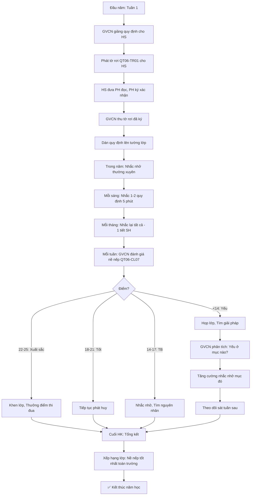

# SOP-03.1: QUY ĐỊNH NỀ NẾP HỌC TẬP

## 1. THÔNG TIN QUY TRÌNH

| **Thuộc tính** | **Nội dung** |
|---|---|
| Mã SOP | SOP-03.1 |
| Tên quy trình | Quy định nề nếp học tập |
| Quy trình cha | SOP-03: Nề nếp - Kỷ luật |
| Phiên bản | 1.0 |
| Áp dụng | Tất cả HS, Tất cả cấp |

## 2. MỤC ĐÍCH

- **Môi trường học tập tốt**: Lớp ngăn nắp, Trật tự
- **HS có thói quen tốt**: Tự giác, Kỷ luật
- **Công bằng**: Quy định áp dụng cho TẤT CẢ
- **Rõ ràng**: HS, PH hiểu được phải làm gì

## 3. PHẠM VI ÁP DỤNG

Tất cả học sinh (Mầm non - Tiểu học - THCS)

## 4. HỆ THỐNG NỀ NẾP

### 4.1. 5 nhóm nề nếp chính

```
╔══════════════════════════════════════════════════════════════════╗
║                  5 NHÓM NỀ NẾP CHỦ CHỐT                          ║
╠══════════════════════════════════════════════════════════════════╣
║ 1. NỀ NẾP THỜI GIAN (Punctuality & Time Management)             ║
║    • Đến đúng giờ, Nộp bài đúng hạn                             ║
║    • Không lãng phí thời gian giờ học                            ║
╠══════════════════════════════════════════════════════════════════╣
║ 2. NỀ NẾP TRANG PHỤC (Dress Code)                               ║
║    • Mặc đồng phục đúng quy định                                 ║
║    • Sạch sẽ, Gọn gàng                                           ║
╠══════════════════════════════════════════════════════════════════╣
║ 3. NỀ NẾP HỌC TẬP (Academic Discipline)                         ║
║    • Tập trung, Không nói chuyện riêng                           ║
║    • Làm bài tập đầy đủ, Chuẩn bị bài                            ║
╠══════════════════════════════════════════════════════════════════╣
║ 4. NỀ NẾP GIAO TIẾP (Communication Manners)                     ║
║    • Tôn trọng GV, Bạn bè                                        ║
║    • Lịch sự, Không nói tục, Không la hét                        ║
╠══════════════════════════════════════════════════════════════════╣
║ 5. NỀ NẾP VỆ SINH (Hygiene & Cleanliness)                       ║
║    • Giữ lớp sạch, Bàn ghế ngăn nắp                              ║
║    • Rác bỏ đúng nơi                                             ║
╚══════════════════════════════════════════════════════════════════╝
```

## 5. QUY ĐỊNH CHI TIẾT

### 5.1. Nề nếp thời gian

**A. Đến đúng giờ:**

| **Cấp** | **Giờ quy định** | **Muộn = Vi phạm** |
|---|---|---|
| Mầm non | ≤ 8:00 | >10 phút |
| Tiểu học | ≤ 7:30 | >5 phút |
| THCS | ≤ 7:00 | >5 phút |

**Quy định:**
```
✅ HS phải CÓ MẶT trong lớp trước giờ học!
   Không phải "Vào cổng trường" là đúng giờ!
   
VD: Giờ học 7:30 → HS phải ngồi yên trong lớp lúc 7:30!
```

**B. Nộp bài đúng hạn:**

```
GV giao bài tập:
"Bài tập về nhà, Nộp sáng thứ 2!"

HS phải nộp: Trước 7:30 thứ 2
• Nộp đúng: OK ✅
• Nộp muộn 1 ngày: Nhắc nhở (Lần đầu)
• Nộp muộn >2 ngày: Vi phạm ⚠️
• Không nộp: Vi phạm nặng ⚠️⚠️
```

**C. Sử dụng thời gian hợp lý:**

```
Giờ học:
□ Tập trung học
□ Không đi vệ sinh liên tục (Trừ thật sự cần)
□ Không xin uống nước nhiều lần

Giờ ra chơi:
□ Chơi, Ăn, Nghỉ ngơi
□ Đi vệ sinh (Để không phải đi giữa giờ học)
□ Chuẩn bị bài tiết sau
```

### 5.2. Nề nếp trang phục

**A. Quy định đồng phục:**

```
╔══════════════════════════════════════════════════════════════════╗
║              QUY ĐỊNH ĐỒNG PHỤC THEO NGÀY                        ║
╠══════════════════════════════════════════════════════════════════╣
║ THỨ 2, 4, 6: Đồng phục chính thức                                ║
║  • Áo trắng (Logo trường), Quần/Váy xanh                         ║
║  • Giày đen hoặc Giày thể thao trắng                             ║
║  • Vớ trắng                                                      ║
╠══════════════════════════════════════════════════════════════════╣
║ THỨ 3, 5: Đồng phục thể thao                                     ║
║  • Áo thể thao (Logo trường), Quần thể thao                      ║
║  • Giày thể thao                                                 ║
╠══════════════════════════════════════════════════════════════════╣
║ THỨ 7: Tự do (Nhưng lịch sự!)                                    ║
║  • Áo có cổ hoặc Áo thun (Không hở hang!)                        ║
║  • Quần dài/Váy (Không quần đùi, Váy ngắn!)                      ║
║  • KHÔNG mặc: Áo 2 dây, Áo rách, Quần jean rách...               ║
╚══════════════════════════════════════════════════════════════════╝
```

**B. Quy định trang điểm, Tóc:**

| **Tiêu chí** | **Mầm non** | **Tiểu học** | **THCS** |
|---|---|---|---|
| **Tóc** | Gọn gàng, Có thể nhuộm sáng | Tự nhiên, KHÔNG nhuộm | Tự nhiên, KHÔNG nhuộm |
| **Móng tay** | Ngắn, Sạch | Ngắn, Sạch, KHÔNG sơn | Ngắn, Sạch, KHÔNG sơn |
| **Trang điểm** | Không | Không | KHÔNG (Trừ son dưỡng môi) |
| **Trang sức** | Bông tai nhỏ (Nếu đã xỏ lỗ) | Không khuyến khích | KHÔNG (Trừ đồng hồ) |

**C. Vệ sinh cá nhân:**

```
HS phải:
✅ Tắm rửa sạch sẽ (Không mùi hôi!)
✅ Đánh răng (Hơi thở thơm tho)
✅ Cắt móng tay (Ngắn, Sạch)
✅ Gội đầu (Tóc không bết, Không gàu)
✅ Giặt đồng phục (Không bẩn, Không nhăn)
```

### 5.3. Nề nếp học tập

**A. Trong giờ học:**

```
╔══════════════════════════════════════════════════════════════════╗
║              QUY TẮC VÀNG TRONG GIỜ HỌC                          ║
╠══════════════════════════════════════════════════════════════════╣
║ 1. LẮNG NGHE (Listen)                                            ║
║    • Mắt nhìn GV/Bạn đang nói                                    ║
║    • Không nói chuyện riêng                                      ║
║    • Không chơi đồ dùng học tập                                  ║
╠══════════════════════════════════════════════════════════════════╣
║ 2. GIƠTAY KHI MUỐN NÓI (Raise Hand)                             ║
║    • Không hét to, Không ngắt lời GV                             ║
║    • GV cho phép mới nói                                         ║
╠══════════════════════════════════════════════════════════════════╣
║ 3. TÔN TRỌNG Ý KIẾN (Respect)                                    ║
║    • Bạn nói sai → Không cười, Không chế giễu                   ║
║    • GV nhắc nhở → Lắng nghe, Không cãi                          ║
╠══════════════════════════════════════════════════════════════════╣
║ 4. CHUẨN BỊ BÀI (Preparation)                                    ║
║    • Đọc bài trước ở nhà                                         ║
║    • Mang đầy đủ sách vở, Dụng cụ                                ║
╠══════════════════════════════════════════════════════════════════╣
║ 5. GHI CHÉP ĐẦY ĐỦ (Note-taking)                                 ║
║    • Ghi những gì GV viết bảng                                   ║
║    • Ghi chú điểm quan trọng                                     ║
╚══════════════════════════════════════════════════════════════════╝
```

**B. Bài tập về nhà:**

```
QUY ĐỊNH:
✅ Làm bài đầy đủ (100% bài GV giao)
✅ Làm bài TỰ MÌ NH (Không chép bài bạn!)
✅ Nộp đúng hạn
✅ Viết sạch, Rõ ràng (GV phải đọc được!)
✅ Sửa bài khi GV trả (Học từ sai lầm!)

⚠️ VI PHẠM:
❌ Không làm bài
❌ Chép bài bạn
❌ Nộp muộn thường xuyên
❌ Viết bẩn, Không đọc được
```

**C. Trong thư viện:**

```
• Giữ yên lặng (Không nói to)
• Đi nhẹ nhàng (Không chạy)
• Cầm sách nhẹ nhàng (Không rách, Không nhăn)
• Trả sách đúng vị trí
• Không ăn uống trong thư viện
```

### 5.4. Nề nếp giao tiếp

**A. Với giáo viên:**

```
✅ Chào GV khi gặp:
   "Chào cô/thầy!" (Cúi đầu nhẹ)
   
✅ Xưng hô lịch sự:
   • Tự xưng: "Em" hoặc "Con"
   • Xưng GV: "Cô" hoặc "Thầy"
   • KHÔNG: "Tui", "Tao", "Mày"...
   
✅ Nói năng:
   • Giọng nhẹ nhàng (Không hét)
   • Đúng ngữ pháp (Không nói tắt lung tung)
   • KHÔNG: Nói tục, Chửi thề
   
✅ Xin phép:
   "Cô ơi, Em xin phép [Đi vệ sinh/Uống nước/...]"
   GV cho phép → Mới làm!
```

**B. Với bạn bè:**

```
✅ Tôn trọng:
   • Gọi tên lịch sự (Không đặt biệt danh xấu)
   • Không đánh, Không đẩy
   • Không lấy đồ của bạn (Không xin phép)
   
✅ Giúp đỡ:
   • Bạn khó khăn → Giúp
   • Bạn không hiểu bài → Giải thích
   • Bạn bị bắt nạt → Báo GV
   
✅ Chia sẻ:
   • Đồ ăn, Đồ chơi → Có thể chia sẻ (Nếu muốn)
   • Dụng cụ học tập → Cho bạn mượn
```

**C. Với người lớn khác (Bảo vệ, Nấu ăn...):**

```
✅ Chào hỏi lịch sự:
   "Chào chú/cô!"
   
✅ Nói "Cảm ơn":
   Bác nấu ăn cho ăn → "Cảm ơn cô ạ!"
   
✅ Tôn trọng:
   Không coi thường, Không kênh kiệu
```

### 5.5. Nề nếp vệ sinh

**A. Vệ sinh lớp học:**

```
╔══════════════════════════════════════════════════════════════════╗
║             NHIỆM VỤ VỆ SINH HẰNG NGÀY                           ║
╠══════════════════════════════════════════════════════════════════╣
║ SÁNG (Trước 7:30):                                               ║
║  • Nhóm trực nhật: Quét lớp, Lau bàn, Sắp ghế thẳng hàng         ║
║  • Tất cả HS: Sắp giày dép gọn (Giá giày)                        ║
╠══════════════════════════════════════════════════════════════════╣
║ TRONG NGÀY:                                                      ║
║  • Rác → Bỏ thùng (Không vứt lung tung!)                         ║
║  • Sau ăn: Dọn đồ ăn, Lau bàn                                    ║
║  • Bàn học: Ngăn nắp (Không để sách vở lộn xộn)                  ║
╠══════════════════════════════════════════════════════════════════╣
║ CHIỀU (Trước khi tan học):                                       ║
║  • Nhóm trực nhật: Quét lại, Đổ rác, Tắt đèn/Quạt               ║
║  • Tất cả HS: Xếp ghế lên bàn (Để lau sàn)                       ║
╚══════════════════════════════════════════════════════════════════╝
```

**B. Quy định về rác:**

```
PHÂN LOẠI RÁC (Nếu trường áp dụng):
┌─────────────┬─────────────┬─────────────┐
│ XANH        │ VÀNG        │ ĐỎ          │
│ Tái chế     │ Thực phẩm   │ Khác        │
├─────────────┼─────────────┼─────────────┤
│ • Giấy      │ • Thức ăn   │ • Túi ni lông│
│ • Nhựa      │ thừa        │ • Bẩn       │
│ • Chai/Lon  │ • Vỏ trái   │             │
│             │   cây       │             │
└─────────────┴─────────────┴─────────────┘

⚠️ Bỏ sai thùng → Vi phạm!
```

**C. Vệ sinh WC:**

```
✅ Xả nước sau khi sử dụng
✅ Rửa tay bằng xà phòng
✅ Không vẽ bậy lên tường
✅ Không lãng phí giấy vệ sinh
✅ Báo GV nếu WC hỏng, Bẩn
```

## 6. HƯỚNG DẪN ÁP DỤNG

### 6.1. Đầu năm học

**Bước 1: GVCN giảng quy định cho HS (Tuần 1)**

```
GVCN: "Các em, Hôm nay cô sẽ giới thiệu quy định nề nếp lớp mình!
       
       [Giải thích từng mục - Có ví dụ cụ thể]
       
       VD: Nề nếp thời gian:
       'Các em phải đến trước 7:30. Nếu muộn, Phải xin phép cô.
        Muộn không lý do → Vi phạm nhé!'
        
       Các em có hiểu không?"

HS: "Dạ!"

GVCN: "Giờ cô phát tờ rơi. Về đưa PH xem!"
```

**Bước 2: Phát tờ rơi quy định (QT06-TR01)**

```
═══════════════════════════════════════════════════════
      QUY ĐỊNH NỀ NẾP LỚP __
      Năm học: ________  GVCN: _______
═══════════════════════════════════════════════════════

Con thân mến,

Dưới đây là quy định nề nếp lớp mình. Con cần tuân thủ!

1. NỀ NẾP THỜI GIAN:
   • Đến trước 7:30 ✅
   • Nộp bài đúng hạn ✅
   
2. NỀ NẾP TRANG PHỤC:
   • Thứ 2,4,6: Đồng phục chính thức
   • Thứ 3,5: Đồng phục thể thao
   • Thứ 7: Tự do (Nhưng lịch sự!)
   
3. ...

Quý PH vui lòng ký xác nhận đã đọc!

PH ký: __________  Ngày: __/__/____
═══════════════════════════════════════════════════════
```

**Bước 3: Dán quy định lên tường lớp (Để HS nhìn mỗi ngày)**

### 6.2. Trong năm học

**Nhắc nhở thường xuyên:**

```
• Mỗi sáng (5 phút đầu tiết): GVCN nhắc 1-2 quy định
  VD: "Hôm nay cô nhắc: Giờ học phải giơ tay khi muốn nói nhé!"
  
• Mỗi tháng: Nhắc lại TẤT CẢ quy định (1 tiết sinh hoạt)
```

### 6.3. Kiểm tra định kỳ

**Mỗi tuần: GVCN đánh giá nề nếp lớp (QT06-CL07)**

```
═══════════════════════════════════════════════════════
   PHIẾU ĐÁNH GIÁ NỀ NẾP LỚP - TUẦN __
   Lớp: _______  GVCN: _______
═══════════════════════════════════════════════════════

Tiêu chí (5 điểm mỗi mục):

1. Nề nếp thời gian:
   □ 5: Tất cả HS đến đúng giờ
   □ 4: 1-2 HS muộn
   □ 3: 3-4 HS muộn
   □ 2: 5+ HS muộn
   □ 1: Nhiều HS muộn, Không cải thiện
   
   Điểm: ____

2. Trang phục:
   □ 5: 100% HS mặc đúng
   □ 4: 1-2 HS sai
   □ 3: 3-4 HS sai
   □ 2: 5+ HS sai
   □ 1: Nhiều HS sai, Không cải thiện
   
   Điểm: ____

3. Học tập: (Tập trung, Làm bài...)
   Điểm: ____

4. Giao tiếp: (Lịch sự, Tôn trọng...)
   Điểm: ____

5. Vệ sinh: (Lớp sạch, Bàn ngăn nắp...)
   Điểm: ____

TỔNG: ____/25 điểm

ĐÁNH GIÁ:
□ 22-25: Xuất sắc ⭐⭐⭐
□ 18-21: Tốt ⭐⭐
□ 14-17: Trung bình ⭐
□ <14: Yếu (Cần cải thiện!) ⚠️

GVCN ký: __________
═══════════════════════════════════════════════════════
```

## 7. LƯU ĐỒ QUY TRÌNH



## 8. BIỂU MẪU LIÊN QUAN

| **Mã** | **Tên** |
|---|---|
| QT06-TR01 | Tờ rơi quy định nề nếp (Phát HS đầu năm) |
| QT06-CL07 | Phiếu đánh giá nề nếp lớp (Tuần) |
| QT06-BC10 | Báo cáo nề nếp học kỳ |

## 9. TIÊU CHUẨN VÀ CHỈ TIÊU

| **Chỉ tiêu** | **Mục tiêu** |
|---|---|
| Tỷ lệ HS đến đúng giờ | ≥ 95% |
| Tỷ lệ HS mặc đồng phục đúng | ≥ 98% |
| Tỷ lệ HS nộp bài đúng hạn | ≥ 90% |
| Điểm nề nếp trung bình lớp | ≥ 20/25 |

## 10. TRÁCH NHIỆM CỤ THỂ

| **Vai trò** | **Trách nhiệm** |
|---|---|
| **HS** | Tuân thủ quy định |
| **GVCN** | Giảng, Nhắc nhở, Đánh giá, Xử lý vi phạm |
| **PH** | Hợp tác, Nhắc con ở nhà |
| **BP HS** | Kiểm tra định kỳ, Hỗ trợ GVCN |

## 11. LƯU Ý QUAN TRỌNG

- ⚠️ **Nhất quán**: Tất cả lớp phải áp dụng giống nhau!
- ✅ **Giải thích rõ**: HS phải HIỂU tại sao có quy định này!
- 🔥 **Làm gương**: GV phải làm gương trước! (Đến đúng giờ, Mặc đẹp...)
- ✅ **Linh hoạt**: Đặc biệt (Ốm, Hoàn cảnh...) → Xem xét!

## 12. PHỤ LỤC

### 12.1. Giải thích cho HS (Tại sao cần nề nếp?)

```
GVCN giải thích cho HS hiểu:

"Các em à, Tại sao phải có nề nếp?

VD 1: Nề nếp thời gian
• Nếu em đến muộn → Lỡ bài → Không hiểu → Học yếu!
• Nếu nhiều em muộn → GV phải chờ → Lãng phí thời gian!

VD 2: Nề nếp vệ sinh
• Lớp bẩn → Ốm (Nhiều vi khuẩn!)
• Lớp sạch → Học vui vẻ!

→ Nề nếp = Giúp các em học tốt hơn!"
```

### 12.2. Quy định riêng cho từng cấp

**Mầm non: LINH HOẠT hơn**

```
• Muộn <30 phút: Chấp nhận (Trẻ nhỏ, Khó tính giờ)
• Trang phục: Không bắt buộc nghiêm (Chỉ cần sạch, Gọn)
• Học tập: Không bắt buộc ngồi yên lâu (15-20 phút/hoạt động)
```

**Tiểu học: CÂN BẰNG**

```
• Áp dụng đầy đủ 5 nhóm
• Nhưng: Nhắc nhở nhiều hơn Phạt!
```

**THCS: NGHIÊM KHẮC hơn**

```
• Áp dụng đầy đủ, Nghiêm túc
• Vi phạm → Xử lý nhanh, Rõ ràng
• Mục tiêu: Rèn HS tự giác, Chuẩn bị THPT
```

## 13. FAQ

**Q1: HS muộn do xe trường. Có bị vi phạm không?**  
A: KHÔNG! Đó là lỗi của xe, Không phải HS. GVCN ghi: "Muộn do xe" → Không phạt.

**Q2: Ngày nào cũng có 1-2 HS quên mang đồng phục. Xử lý thế nào?**  
A: 
- Lần 1-2: Nhắc nhở
- Lần 3: Gọi PH, Yêu cầu đưa đồng phục đến trường!
- Lần 4+: Không cho vào lớp (Đứng ngoài) → PH phải đến!

**Q3: HS không làm bài tập (Lý do: Quên!). Có nên phạt không?**  
A: 
- Lần 1: "Lần này bỏ qua. Lần sau chú ý!"
- Lần 2: Làm bù vào giờ ra chơi
- Lần 3+: Gọi PH, Ghi Sổ liên lạc

**Q4: Lớp bẩn (Nhiều rác). Phạt cả lớp hay Chỉ nhóm trực nhật?**  
A: 
- Nếu do nhóm trực nhật không quét → Phạt nhóm đó!
- Nếu do cả lớp vứt rác lung tung → Phạt cả lớp! (Quét lại vào giờ ra chơi)

---

**PHÊ DUYỆT**

| GVCN | Trưởng BP HS | Phó HT |
|---|---|---|
| [Họ tên] | [Họ tên] | [Họ tên] |
