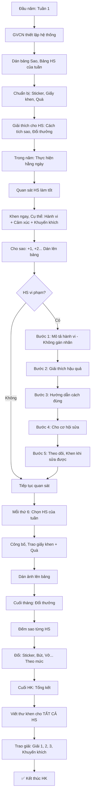

# SOP-03.2: THỰC HIỆN KỶ LUẬT TÍCH CỰC

## 1. THÔNG TIN QUY TRÌNH

| **Thuộc tính** | **Nội dung** |
|---|---|
| Mã SOP | SOP-03.2 |
| Tên quy trình | Thực hiện kỷ luật tích cực |
| Quy trình cha | SOP-03: Nề nếp - Kỷ luật |
| Phiên bản | 1.0 |
| Áp dụng | Tất cả HS, Tất cả cấp |

## 2. MỤC ĐÍCH

- **Tập trung vào tích cực**: Khen thưởng nhiều hơn Phạt
- **Động viên**: HS muốn làm tốt (Không phải vì sợ phạt!)
- **Xây dựng**: Thói quen tốt, Tự giác
- **Môi trường an toàn**: HS không sợ hãi, Tự tin

## 3. PHẠM VI ÁP DỤNG

Tất cả giáo viên, Tất cả học sinh

## 4. TRIẾT LÝ KỶ LUẬT TÍCH CỰC

### 4.1. So sánh 2 mô hình

```
╔══════════════════════════════════════════════════════════════════╗
║     KỶ LUẬT TRUYỀN THỐNG vs KỶ LUẬT TÍCH CỰC                     ║
╠══════════════════════════════════════════════════════════════════╣
║ KỶ LUẬT TRUYỀN THỐNG (Punishment-based)                         ║
║  • Tập trung: Tìm lỗi, Phạt                                      ║
║  • HS sai → Mắng, Đứng góc, Phạt                                 ║
║  • HS đúng → Im lặng (Không khen)                                ║
║  • Kết quả: HS sợ hãi, Giả vờ ngoan                              ║
╠══════════════════════════════════════════════════════════════════╣
║ KỶ LUẬT TÍCH CỰC (Positive Discipline) ✅                        ║
║  • Tập trung: Khen tốt, Dạy cách đúng                            ║
║  • HS sai → Giải thích, Hướng dẫn sửa                            ║
║  • HS đúng → Khen ngay! Tạo động lực                             ║
║  • Kết quả: HS tự giác, Muốn làm tốt                             ║
╚══════════════════════════════════════════════════════════════════╝
```

### 4.2. Nguyên tắc vàng: 5 KHEN - 1 PHẠT

```
Với mỗi HS:
✅ Khen 5 lần → Mới phạt 1 lần!

Tại sao?
• Khen nhiều → HS vui vẻ, Muốn làm tốt hơn
• Phạt nhiều → HS chán nản, Bỏ cuộc

VD:
Sáng: "Bạn A đến đúng giờ! Giỏi lắm!" [Khen 1]
Tiết 2: "Bạn A giơ tay trả lời tốt!" [Khen 2]
...
Tiết 5: "Bạn A nói chuyện riêng. Em chú ý!" [Phạt 1]

→ Bạn A vẫn cảm thấy được yêu thương! ❤️
```

## 5. CÔNG CỤ KỶ LUẬT TÍCH CỰC

### 5.1. Công cụ 1: Khen ngợi cụ thể (Specific Praise)

**KHÔNG HIỆU QUẢ:**
```
GV: "Giỏi lắm!" (Chung chung - HS không biết giỏi chỗ nào!)
```

**HIỆU QUẢ:**
```
GV: "Bạn A, Hôm nay bạn đến đúng giờ 7:20! 
     Sớm hơn quy định 10 phút! Cô rất vui!
     Tiếp tục phát huy nhé!"

→ HS biết rõ: "Mình giỏi vì đến sớm!"
→ Lần sau sẽ cố gắng đến sớm tiếp!
```

**Công thức khen cụ thể:**

```
"Bạn [Tên], [Hành vi cụ thể] + [Cảm xúc GV] + [Khuyến khích]"

VD:
• "Bạn B, Bài tập của bạn rất sạch và Đúng 10/10 câu! 
   Cô rất hài lòng! Lần sau cũng cố gắng nhé!"
   
• "Bạn C, Bạn đã giúp bạn D nhặt sách! Bạn rất tốt bụng!
   Cô thích lắm! Cảm ơn bạn!"
```

### 5.2. Công cụ 2: Hệ thống điểm thưởng (Token Economy)

**Cách thức:**

```
╔══════════════════════════════════════════════════════════════════╗
║           HỆ THỐNG ĐIỂM THƯỞNG "SAO VÀNG"                        ║
╠══════════════════════════════════════════════════════════════════╣
║ CÁCH TÍCH SAO:                                                   ║
║  • Đến đúng giờ: +1 ⭐                                           ║
║  • Nộp bài đúng hạn: +1 ⭐                                       ║
║  • Giúp bạn: +2 ⭐                                               ║
║  • Làm bài tốt (Điểm 9-10): +2 ⭐                                ║
║  • Nhặt rác: +1 ⭐                                               ║
║  • Tuân thủ quy định cả tuần: +5 ⭐                              ║
╠══════════════════════════════════════════════════════════════════╣
║ ĐỔI THƯỞNG:                                                      ║
║  • 10 ⭐ → 1 Sticker                                             ║
║  • 50 ⭐ → 1 Bút chì / Tẩy                                       ║
║  • 100 ⭐ → 1 Quyển vở / Bộ bút màu                              ║
║  • 200 ⭐ → Giấy khen + Quà lớn (Balo, Sách...)                  ║
╚══════════════════════════════════════════════════════════════════╝
```

**Công cụ:**
- Bảng sao (Treo tường lớp)
- Mỗi HS có 1 cột
- Mỗi ngày GV dán sao

**Mẫu bảng:**

```
┌─────────────────────────────────────────────────┐
│         BẢNG SAO VÀNG LỚP 1A                    │
├──────────┬──────┬──────┬──────┬──────┬──────────┤
│ Tên HS   │ T2   │ T3   │ T4   │ T5   │ T6 TỔNG │
├──────────┼──────┼──────┼──────┼──────┼──────────┤
│Nguyễn VA │ ⭐⭐ │ ⭐   │ ⭐⭐⭐│ ⭐   │ ⭐ 9⭐   │
│Trần Thị B│ ⭐   │ ⭐⭐ │ ⭐   │ ⭐⭐ │⭐⭐ 8⭐  │
│...       │      │      │      │      │          │
└──────────┴──────┴──────┴──────┴──────┴──────────┘
```

### 5.3. Công cụ 3: Bảng "Học sinh của tuần" (Student of the Week)

**Cách chọn:**

```
Mỗi tuần, GVCN chọn 1 HS tiêu biểu:
• Có thể là: HS học giỏi, HS giúp bạn, HS tiến bộ nhiều...
• Không nhất thiết phải học giỏi!
• Mỗi HS được chọn ít nhất 1 lần/HK!

Thưởng:
• Ảnh dán lên bảng "HS của tuần" (Góc lớp)
• Được ngồi ghế đặc biệt (Ghế có gắn nơ!)
• Được làm trưởng nhóm tuần đó
• Giấy khen + Quà nhỏ
```

### 5.4. Công cụ 4: Thư khen (Praise Letter)

**Khi nào viết?**
- HS có tiến bộ đột biến
- HS làm điều tốt đẹp (Giúp bạn, Nhặt được của rơi trả lại...)
- Cuối HK (Viết cho tất cả HS!)

**Mẫu thư:**

```
═══════════════════════════════════════════════════════
              THƯ KHEN
              (Gửi cho Phụ huynh)
═══════════════════════════════════════════════════════

Kính gửi Quý Phụ huynh của em [Tên HS],

Cô rất vui được thông báo với Quý PH:

Em [Tên] đã có những tiến bộ đáng khen:
• [Điểm tích cực 1]: VD: "Từ thường xuyên muộn, 
  Giờ em đến đúng giờ suốt 2 tuần!"
• [Điểm tích cực 2]: "Em giúp bạn C nhặt sách khi bạn vấp ngã"
• [Điểm tích cực 3]: "Bài kiểm tra Toán đạt 9 điểm (Lần trước 6!)"

Cô rất tự hào về em!

Quý PH hãy khen con và Khuyến khích con tiếp tục nhé!

Trân trọng,
GVCN [Tên]
Ngày __/__/____
═══════════════════════════════════════════════════════
```

### 5.5. Công cụ 5: Quy tắc tích cực (Positive Rules)

**KHÔNG HIỆU QUẢ: Quy tắc tiêu cực**

```
❌ "KHÔNG nói chuyện riêng!"
❌ "KHÔNG chạy nhảy trong lớp!"
❌ "KHÔNG đánh bạn!"

→ HS chỉ biết KHÔNG được làm gì,
  Nhưng KHÔNG biết nên làm gì!
```

**HIỆU QUẢ: Quy tắc tích cực**

```
✅ "HÃY lắng nghe GV và Bạn!"
✅ "HÃY đi nhẹ nhàng trong lớp!"
✅ "HÃY yêu thương bạn bè!"

→ HS biết rõ: Nên làm gì!
```

**So sánh:**

| **Quy tắc tiêu cực** | **Quy tắc tích cực** |
|---|---|
| Không nói to | Nói nhỏ, Lịch sự |
| Không vứt rác | Bỏ rác đúng nơi |
| Không đánh bạn | Yêu thương bạn |
| Không chép bài | Tự làm bài, Chăm chỉ |

## 6. QUY TRÌNH THỰC HIỆN

### 6.1. Đầu năm học

**Bước 1: GVCN thiết lập hệ thống (Tuần 1)**

```
1. Dán bảng Sao Vàng lên tường
2. Làm bảng "HS của tuần" (Góc lớp)
3. Chuẩn bị: Sticker, Giấy khen, Quà nhỏ
4. Giải thích cho HS: "Cách tích sao, Đổi thưởng..."
```

**Bước 2: Giải thích cho HS (30 phút)**

```
GVCN: "Các em, Năm nay lớp mình có hệ thống Sao Vàng!
       
       [Chỉ vào bảng sao]
       
       Mỗi khi em làm tốt, Cô sẽ cho em 1 sao!
       VD: 
       • Em đến đúng giờ → +1 ⭐
       • Em giúp bạn → +2 ⭐
       
       Tích đủ 10 sao → Đổi 1 sticker!
       Tích đủ 100 sao → Đổi 1 quyển vở!
       
       Các em hiểu chưa?"

HS: "Dạ!"

GVCN: "OK! Giờ chúng ta bắt đầu nhé! Ai đến đúng giờ hôm nay?"
[Nhiều em giơ tay]
GVCN: "Tất cả! Giỏi lắm! Mỗi em +1 sao!"
[Dán sao cho từng em]

→ HS rất vui! Có động lực! 🎉
```

### 6.2. Trong năm học

**A. Hằng ngày: Khen ngợi tích cực**

```
SÁNG:
• HS đến sớm → Khen ngay!
  "Bạn A đến sớm! +1 sao!"
  
• HS mặc đồng phục đẹp → Khen!
  "Bạn B hôm nay đẹp quá! +1 sao!"

TRONG GIỜ:
• HS giơ tay trả lời đúng → Khen!
  "Bạn C trả lời đúng! Giỏi! +1 sao!"
  
• HS tập trung (Không nói chuyện) → Khen!
  "Bạn D tập trung! Cô thích lắm! +1 sao!"

CHIỀU:
• Nhóm trực nhật quét sạch → Khen cả nhóm!
  "Nhóm 1 hôm nay quét rất sạch! Mỗi bạn +2 sao!"
```

**B. Mỗi tuần: Chọn "HS của tuần"**

```
Thứ 6 chiều:
GVCN: "Tuần này, HS của tuần là... Bạn E!
       Vì bạn E:
       • Từ không biết bài, Giờ hiểu rồi!
       • Tự làm bài, Không chép!
       • Giúp bạn F nhặt vở!
       
       Vỗ tay cho bạn E!"
       
[Cả lớp vỗ tay]
[GVCN trao giấy khen + Quà]
[Dán ảnh E lên bảng "HS của tuần"]

→ E rất tự hào! Các bạn khác cũng muốn được chọn!
```

**C. Mỗi tháng: Đổi thưởng**

```
Cuối tháng (Ngày cuối):
GVCN: "Giờ cô kiểm tra các em tích được bao nhiêu sao!
       
       [Đếm sao từng em]
       
       Bạn A: 45 sao → Đổi 4 sticker (40 sao) + Còn 5 sao
       Bạn B: 60 sao → Đổi 1 bút chì (50 sao) + Còn 10 sao
       ...
       
       Tháng sau cố gắng tích nhiều hơn nhé!"
```

### 6.3. Xử lý khi HS vi phạm (Vẫn TÍCH CỰC!)

**Bước 1: Mô tả hành vi (Không gán nhãn!)**

```
❌ KHÔNG NÊN:
"Em là đứa trẻ hư! Em rất hỗn!"

✅ NÊN:
"Em vừa nói chuyện riêng giữa giờ học."

→ Chỉ nói hành vi, Không công kích nhân cách!
```

**Bước 2: Giải thích hậu quả**

```
"Em nói chuyện → Em không nghe bài 
 → Em không hiểu → Em học yếu!"
```

**Bước 3: Hướng dẫn cách đúng**

```
"Lần sau, Em muốn nói với bạn → Chờ đến giờ ra chơi!
 Giờ học → Em phải lắng nghe cô nhé!"
```

**Bước 4: Cho cơ hội sửa sai**

```
"Giờ tiết còn 20 phút. Em tập trung 20 phút này được không?
 Nếu được, Cô sẽ cho em +1 sao!"

→ HS: "Dạ được ạ!" (Có động lực sửa!)
```

**Bước 5: Theo dõi và Khen khi sửa**

```
10 phút sau:
GVCN: "Bạn G, 10 phút nay em rất tập trung! Giỏi lắm!
       Em đã sửa được lỗi! +1 sao!"

→ HS cảm thấy: "Mình sửa được! Mình giỏi!"
```

### 6.4. Cuối HK: Tổng kết

**Bước 1: Viết thư khen cho TẤT CẢ HS**

- Mỗi HS 1 thư (Khen điểm tích cực riêng)
- Gửi PH

**Bước 2: Trao giải "Sao sáng lớp"**

```
• Giải 1: HS tích nhiều sao nhất (VD: 800 sao!)
• Giải 2: HS tiến bộ nhiều nhất
• Giải 3: HS giúp bạn nhiều nhất
• Giải Khuyến khích: Tất cả HS còn lại!

→ Ai cũng có giải! Ai cũng vui! 🎉
```

## 7. LƯU ĐỒ QUY TRÌNH



## 8. BIỂU MẪU LIÊN QUAN

| **Mã** | **Tên** |
|---|---|
| QT06-TL02 | Bảng Sao Vàng (Template) |
| QT06-TL03 | Bảng "HS của tuần" |
| QT06-F25 | Thư khen (Gửi PH) |
| QT06-F26 | Giấy khen "Sao sáng lớp" |

## 9. TIÊU CHUẨN VÀ CHỈ TIÊU

| **Chỉ tiêu** | **Mục tiêu** |
|---|---|
| Tỷ lệ Khen/Phạt | ≥ 5:1 |
| % HS được chọn "HS của tuần" (Trong HK) | 100% |
| % HS được tích ít nhất 50 sao/tháng | ≥ 80% |
| % HS hài lòng với hệ thống (Khảo sát) | ≥ 90% |

## 10. TRÁCH NHIỆM CỤ THỂ

| **Vai trò** | **Trách nhiệm** |
|---|---|
| **GVCN** | Thiết lập hệ thống, Khen ngợi hằng ngày, Dán sao, Đổi thưởng |
| **GV môn** | Khen HS trong giờ dạy, Báo GVCN HS làm tốt |
| **BP HS** | Cung cấp ngân sách mua quà, Theo dõi hiệu quả |
| **PH** | Khen con ở nhà (Khi nhận thư khen) |

## 11. LƯU Ý QUAN TRỌNG

- ⚠️ **Khen NGAY**: Không chờ! HS làm tốt → Khen ngay lập tức!
- ✅ **Khen CỤ THỂ**: Không nói "Giỏi!" chung chung!
- 🔥 **Công bằng**: Cố gắng khen TẤT CẢ HS (Không chỉ HS giỏi!)
- ✅ **Nhất quán**: Hôm nay khen việc X → Hôm sau cũng phải khen việc X!

## 12. PHỤ LỤC

### 12.1. 20 cách khen sáng tạo

```
1. Vỗ tay: "Vỗ tay cho bạn A!"
2. Giơ ngón tay cái: 👍 + "Excellent!"
3. High five: Vỗ tay với HS
4. Viết giấy nhắn: "Bạn A hôm nay rất giỏi!"
5. Sticker dán vào vở: ⭐ "Well done!"
6. Gọi điện PH (Khi đón): "Con A hôm nay tốt lắm!"
7. Cho HS làm trưởng nhóm
8. Cho HS phát vở (Giúp cô)
9. Cho HS ngồi bàn đầu (1 ngày)
10. Chụp ảnh + Gửi PH
11. Ghi vào Sổ liên lạc: "Con A giỏi vì..."
12. Khen trước lớp: "Cả lớp học bạn A!"
13. Ghi tên lên bảng vinh danh
14. Tặng bút chì có tên HS
15. Cho HS chọn bài hát (Giờ ra chơi)
16. Cho HS chọn trò chơi (Tiết sinh hoạt)
17. Viết thư tay gửi nhà
18. Gửi email PH (Có ảnh HS làm tốt)
19. Khen qua loa trường (Buổi sáng chào cờ)
20. Mời HS lên gặp HT (Để HT khen!)
```

### 12.2. Xử lý tình huống khó

**A. HS không quan tâm đến sao (Động lực nội tại thấp):**

```
GIẢI PHÁP:
1. Tìm hiểu: HS thích gì?
   VD: HS thích được chơi → Thưởng bằng 30 phút chơi game
   
2. Cho HS chọn phần thưởng
   "Em tích 100 sao, Em muốn quà gì?"
   
3. Khen bằng lời (Quan trọng hơn sao!)
   "Em rất giỏi! Cô tự hào về em!"
```

**B. HS ganh tị (Bạn được nhiều sao hơn):**

```
GVCN giải thích:
"Mỗi người có điểm mạnh khác nhau!
 Bạn A giỏi Toán → Được nhiều sao từ bài Toán
 Bạn B giỏi giúp bạn → Được nhiều sao từ giúp bạn
 
 Em có thể tích sao theo cách của em!"
 
→ Nhấn mạnh: Không so sánh, Mỗi người 1 phong cách!
```

**C. HS gian lận (Tự dán sao):**

```
XỬ LÝ:
1. Gọi riêng HS (Không mắng trước lớp!)
2. Nói: "Cô thấy em tự dán sao. Vì sao em làm vậy?"
3. HS: "Em muốn có nhiều sao..."
4. GV: "Cô hiểu. Nhưng tự dán = Gian lận.
        Em muốn sao → Em phải TỰ KIẾM bằng cách làm tốt!
        Lần này cô bỏ qua. Lần sau không được nhé!"
5. Gỡ sao gian lận
6. Động viên: "Em cố gắng, Em sẽ kiếm được nhiều sao thật!"
```

### 12.3. Lợi ích khoa học của kỷ luật tích cực

```
NGHIÊN CỨU CHỨNG MINH:

1. Tăng động lực nội tại:
   • HS tự giác, Không cần GV giám sát
   
2. Giảm hành vi tiêu cực:
   • Vi phạm giảm 40% (So với phạt)
   
3. Tăng thành tích học tập:
   • Điểm số tăng trung bình 15%
   
4. Môi trường tích cực:
   • HS vui vẻ, Thích đến trường
   • GV ít stress hơn
   
5. Mối quan hệ tốt:
   • HS tin tưởng, Yêu thương GV
```

## 13. FAQ

**Q1: Khen nhiều quá, HS có trở nên kiêu ngạo không?**  
A: KHÔNG! Nếu khen ĐÚNG (Cụ thể, Chân thành).
Khen sai: "Em giỏi nhất lớp!" → Kiêu ngạo!
Khen đúng: "Em cố gắng, Em tiến bộ!" → Động viên!

**Q2: HS yếu, Không có gì để khen. Khen thế nào?**  
A: AI cũng có điểm tốt!
- HS yếu Toán → Khen: "Em viết chữ đẹp!"
- HS học yếu → Khen: "Em giúp bạn tốt!"
- HS chậm → Khen: "Em cố gắng, Em tiến bộ!"

**Q3: Chi phí mua quà nhiều. Trường nghèo làm sao?**  
A: Thưởng không cần đắt!
- Sticker: 1000đ/tờ (100 con)
- Bút chì: 2000đ/cây
- Hoặc: Thưởng KHÔNG VẬT CHẤT:
  - Được làm trưởng nhóm
  - Được chọn bài hát
  - Được ngồi bàn đầu...

**Q4: Hệ thống sao chỉ phù hợp TH. THCS có dùng được không?**  
A: ĐƯỢC! Nhưng điều chỉnh:
- THCS: Không dùng sao → Dùng điểm
- Thưởng: Không phải đồ chơi → Thưởng: Quyền lợi (Được miễn nộp bài 1 lần, Được chọn chỗ ngồi...)

---

**PHÊ DUYỆT**

| GVCN | Tâm lý học đường | Trưởng BP HS | Phó HT |
|---|---|---|---|
| [Họ tên] | [Họ tên] | [Họ tên] | [Họ tên] |
