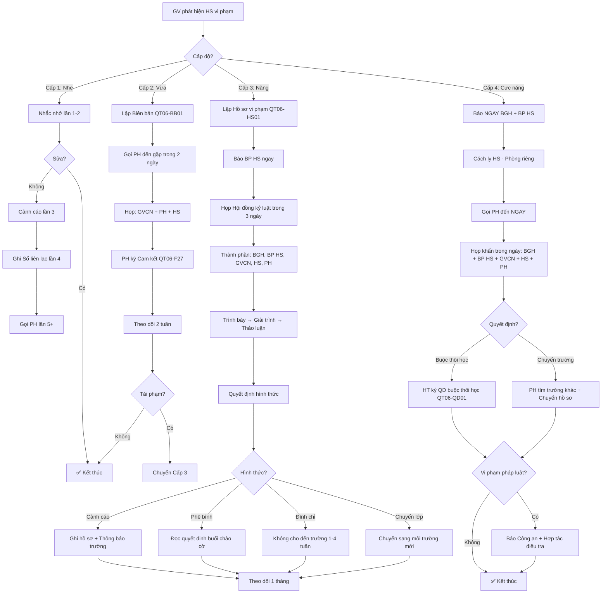

# SOP-03.3: XỬ LÝ VI PHẠM KỶ LUẬT

## 1. THÔNG TIN QUY TRÌNH

| **Thuộc tính** | **Nội dung** |
|---|---|
| Mã SOP | SOP-03.3 |
| Tên quy trình | Xử lý vi phạm kỷ luật |
| Quy trình cha | SOP-03: Nề nếp - Kỷ luật |
| Phiên bản | 1.0 |
| Áp dụng | Khi HS vi phạm |

## 2. MỤC ĐÍCH

- **Xử lý công bằng**: Ai vi phạm, Người đó chịu trách nhiệm
- **Giáo dục**: Giúp HS hiểu lỗi, Sửa lỗi
- **Răn đe**: Người khác không làm theo
- **Bảo vệ**: Bảo vệ HS khác, Môi trường an toàn

## 3. PHẠM VI ÁP DỤNG

Tất cả học sinh vi phạm kỷ luật

## 4. PHÂN LOẠI VI PHẠM

### 4.1. 4 cấp độ vi phạm

```
╔══════════════════════════════════════════════════════════════════╗
║              4 CẤP ĐỘ VI PHẠM KỶ LUẬT                            ║
╠══════════════════════════════════════════════════════════════════╣
║ CẤP 1: VI PHẠM NHẸ (Minor Violation) 🟢                          ║
║  • Nói chuyện riêng trong giờ học                                ║
║  • Không làm bài tập (1-2 lần)                                   ║
║  • Quên mang sách vở                                             ║
║  • Mặc sai đồng phục (1-2 lần)                                   ║
║  • Muộn (Không lý do, 1-2 lần)                                   ║
║  → XỬ LÝ: Nhắc nhở, Cảnh cáo                                     ║
╠══════════════════════════════════════════════════════════════════╣
║ CẤP 2: VI PHẠM VỪA (Moderate Violation) 🟡                       ║
║  • Không làm bài thường xuyên (>3 lần)                           ║
║  • Vắng không phép (3-5 lần)                                     ║
║  • Làm bài không trung thực (Chép bài)                           ║
║  • Không tôn trọng GV (Cãi lại nhẹ)                              ║
║  • Gây rối nhẹ (La hét, Chạy nhảy trong lớp)                     ║
║  → XỬ LÝ: Cảnh cáo, Gọi PH, Ghi Sổ liên lạc                      ║
╠══════════════════════════════════════════════════════════════════╣
║ CẤP 3: VI PHẠM NẶNG (Serious Violation) 🟠                       ║
║  • Đánh bạn (Gây thương tích nhẹ)                                ║
║  • Bắt nạt (Bullying)                                            ║
║  • Nói tục, Chửi thề thường xuyên                                ║
║  • Gian lận trong thi (Mang tài liệu, Quay cóp...)               ║
║  • Trốn học (Nhiều lần)                                          ║
║  • Hút thuốc (THCS)                                              ║
║  → XỬ LÝ: Họp kỷ luật, Phê bình trước trường, Đình chỉ tạm      ║
╠══════════════════════════════════════════════════════════════════╣
║ CẤP 4: VI PHẠM CỰC NẶNG (Critical Violation) 🔴                  ║
║  • Đánh GV                                                       ║
║  • Đánh bạn (Gây thương tích nặng)                               ║
║  • Trộm cắp                                                      ║
║  • Sử dụng ma túy                                                ║
║  • Mang vũ khí (Dao, Súng...)                                    ║
║  • Phá hoại tài sản nghiêm trọng                                 ║
║  → XỬ LÝ: Họp khẩn, Buộc thôi học, Chuyển cơ quan chức năng     ║
╚══════════════════════════════════════════════════════════════════╝
```

### 4.2. Ma trận vi phạm - Xử lý

| **Vi phạm** | **Lần 1** | **Lần 2** | **Lần 3+** | **Ghi nhận** |
|---|---|---|---|---|
| Nói chuyện riêng | Nhắc nhở | Ghi Sổ | Phê bình | GVCN |
| Không làm bài | Nhắc nhở | Gọi PH | Trừ điểm | GVCN |
| Chép bài | Không tính điểm | Gọi PH | Không cho thi | GVCN + GV môn |
| Đánh bạn nhẹ | Gọi PH | Cảnh cáo | Đình chỉ 1 tuần | BP HS |
| Đánh bạn nặng | Đình chỉ | Buộc thôi học | - | BGH |
| Trộm cắp | Bồi thường + Cảnh cáo | Buộc thôi học | - | BGH + Công an |

## 5. QUY TRÌNH XỬ LÝ

### 5.1. Cấp 1: Vi phạm nhẹ

**Bước 1: GV phát hiện**

```
VD: HS A nói chuyện riêng giữa giờ học

GV: "Bạn A, Im lặng! Lắng nghe cô!"
```

**Bước 2: Nhắc nhở (Lần 1-2)**

```
Sau giờ học:
GV: "Bạn A, Hôm nay bạn nói chuyện riêng.
     Lần này cô bỏ qua. Lần sau chú ý nhé!"
HS: "Dạ, Em xin lỗi!"
```

**Bước 3: Cảnh cáo (Lần 3)**

```
GV: "Bạn A, Đây là lần thứ 3 bạn nói chuyện riêng rồi.
     Cô phải cảnh cáo bạn.
     Lần sau cô sẽ ghi Sổ liên lạc!"
```

**Bước 4: Ghi Sổ liên lạc (Lần 4)**

```
Ghi vào Sổ:
"Con A hôm nay nói chuyện riêng lần thứ 4.
 Quý PH nhắc nhở con ạ!
 
 GVCN ký: __________"
 
→ Yêu cầu PH ký xác nhận đã đọc!
```

**Bước 5: Gọi PH (Lần 5+)**

```
Nếu vẫn không sửa:
GVCN gọi PH đến trường, Gặp trực tiếp
"Con A vẫn không sửa. Quý PH cần nghiêm khắc hơn ạ!"
```

### 5.2. Cấp 2: Vi phạm vừa

**Bước 1: Ghi nhận vi phạm (QT06-BB01)**

```
═══════════════════════════════════════════════════════
         BIÊN BẢN VI PHẠM KỶ LUẬT
═══════════════════════════════════════════════════════

Ngày __/__/____  Giờ: ____

HS vi phạm: _______________  Lớp: ____

Vi phạm: [Chọn]
□ Không làm bài thường xuyên
□ Vắng không phép
□ Chép bài
□ Không tôn trọng GV
□ Khác: ________________

Mô tả chi tiết:
__________________________________________________________
__________________________________________________________

Nhân chứng (Nếu có): ________________

GV/GVCN phát hiện ký: __________
═══════════════════════════════════════════════════════
```

**Bước 2: Gọi PH đến gặp (Trong 2 ngày)**

```
Nội dung họp:
1. Trình bày vi phạm
2. Xuất trình bằng chứng (Biên bản, Ảnh...)
3. Nghe HS + PH giải trình
4. Quyết định hình thức xử lý
5. PH ký cam kết (QT06-F27)
```

**Mẫu cam kết (QT06-F27):**

```
═══════════════════════════════════════════════════════
           CAM KẾT KHẮC PHỤC VI PHẠM
═══════════════════════════════════════════════════════

Tôi là PH của em: _______________  Lớp: ____

Nhận thấy con đã vi phạm: ________________

Tôi CAM KẾT:
• Nhắc nhở con nghiêm khắc
• Hợp tác với trường theo dõi con
• Nếu con tái phạm, Tôi chấp nhận hình thức xử lý nặng hơn

PH ký: __________  GVCN ký: __________
Ngày: __/__/____
═══════════════════════════════════════════════════════
```

**Bước 3: Theo dõi (2 tuần)**

- GVCN theo dõi HS mỗi ngày
- Báo PH qua Sổ liên lạc
- Nếu không tái phạm → Kết thúc
- Nếu tái phạm → Chuyển cấp 3

### 5.3. Cấp 3: Vi phạm nặng

**Bước 1: Lập hồ sơ vi phạm (QT06-HS01)**

```
Hồ sơ bao gồm:
1. Biên bản vi phạm (Chi tiết)
2. Bằng chứng:
   • Ảnh (Nếu có)
   • Lời khai nhân chứng
   • Báo cáo của GV/GVCN
3. Lời khai của HS
4. Ý kiến của PH
```

**Bước 2: Báo BP HS (Ngay)**

**Bước 3: Họp Hội đồng kỷ luật (Trong 3 ngày)**

```
THÀNH PHẦN:
• HT hoặc Phó HT (Chủ tọa)
• Trưởng BP HS
• GVCN
• Tâm lý học đường (Nếu cần)
• HS
• PH

TRÌNH TỰ:
1. Chủ tọa đọc biên bản
2. GVCN trình bày
3. Xuất trình bằng chứng
4. HS trình bày (Giải trình)
5. PH phát biểu
6. Hội đồng thảo luận (HS + PH ra ngoài)
7. Quyết định hình thức xử lý
8. Công bố (Gọi HS + PH vào)
9. Lập biên bản họp (QT06-BB02)
```

**Bước 4: Quyết định xử lý**

**Hình thức:**

| **Hình thức** | **Nội dung** | **Thời gian** |
|---|---|---|
| **Cảnh cáo** | Ghi vào hồ sơ, Thông báo toàn trường | Vĩnh viễn trong hồ sơ |
| **Phê bình trước trường** | Đọc quyết định trước cả trường (Buổi chào cờ) | 1 lần |
| **Đình chỉ học tạm thời** | Không cho đến trường | 1-4 tuần |
| **Chuyển lớp** | Chuyển sang lớp khác (Môi trường mới) | Vĩnh viễn |

**Bước 5: Thông báo công khai (Nếu Phê bình trước trường)**

```
Buổi chào cờ thứ 2:
HT đọc:
"Hôm nay, Nhà trường thông báo:
 Em [Tên], Lớp [X] đã vi phạm kỷ luật:
 [Nội dung vi phạm]
 
 Nhà trường quyết định: [Hình thức xử lý]
 
 Đây là bài học cho tất cả các em!
 Mong các em rút kinh nghiệm!"
```

**Bước 6: Theo dõi sau xử lý**

- Nếu Đình chỉ → Kiểm tra khi quay lại
- Nếu Cảnh cáo → Theo dõi 1 tháng
- Báo cáo BGH

### 5.4. Cấp 4: Vi phạm cực nặng

**Bước 1: Báo NGAY BGH + BP HS (Trong 30 phút)**

**Bước 2: Cách ly HS (Tránh tiếp tục gây hại)**

```
Đưa HS ra phòng riêng:
• Có người giám sát
• Không cho tiếp xúc HS khác
• Chờ PH đến
```

**Bước 3: Gọi PH đến NGAY**

**Bước 4: Họp khẩn (Trong ngày)**

```
Thành phần:
• BGH (Cả 3: HT + 2 Phó)
• Trưởng BP HS
• GVCN
• HS
• PH

Nội dung:
• Trình bày vi phạm
• Quyết định:
  - Buộc thôi học
  - Hoặc Chuyển trường (Nếu PH tìm được trường khác nhận)
```

**Bước 5: Chuyển cơ quan chức năng (Nếu cần)**

```
Nếu vi phạm PHÁP LUẬT:
• Trộm cắp → Báo Công an
• Đánh bạn nặng → Báo Công an
• Ma túy → Báo Công an

Trường hợp tác:
• Cung cấp hồ sơ
• Làm chứng
```

**Bước 6: Buộc thôi học**

```
HT ký Quyết định buộc thôi học (QT06-QD01):
"Quyết định buộc thôi học đối với em [Tên]
 Do vi phạm: [Nội dung]
 
 Có hiệu lực từ ngày __/__/____"
 
→ Trả hồ sơ cho PH
→ Hoàn học phí (Nếu có)
```

## 6. NGUYÊN TẮC XỬ LÝ

### 6.1. 7 nguyên tắc vàng

```
╔══════════════════════════════════════════════════════════════════╗
║             7 NGUYÊN TẮC XỬ LÝ VI PHẠM                           ║
╠══════════════════════════════════════════════════════════════════╣
║ 1. CÔNG BẰNG (Fair)                                             ║
║    • Vi phạm giống nhau → Xử lý giống nhau                       ║
║    • Không thiên vị (Con GV, Con BGH...)                         ║
╠══════════════════════════════════════════════════════════════════╣
║ 2. MINH BẠCH (Transparent)                                       ║
║    • Có bằng chứng rõ ràng                                       ║
║    • Cho HS + PH giải trình                                      ║
╠══════════════════════════════════════════════════════════════════╣
║ 3. TỪNG BƯỚC (Progressive)                                       ║
║    • Nhẹ trước, Nặng sau                                         ║
║    • Cho cơ hội sửa sai                                          ║
╠══════════════════════════════════════════════════════════════════╣
║ 4. KỊP THỜI (Timely)                                             ║
║    • Vi phạm → Xử lý ngay (Không chờ lâu!)                       ║
║    • Đừng để HS quên mất mình đã làm gì                          ║
╠══════════════════════════════════════════════════════════════════╣
║ 5. GIÁO DỤC (Educational)                                        ║
║    • Mục đích: Giúp HS sửa lỗi (Không phải trả thù!)             ║
║    • Giải thích: Tại sao sai, Nên làm thế nào                    ║
╠══════════════════════════════════════════════════════════════════╣
║ 6. TÔN TRỌNG (Respectful)                                        ║
║    • Không mắng chửi, Không công kích nhân cách                  ║
║    • Xử lý hành vi, Không phán xét con người                     ║
╠══════════════════════════════════════════════════════════════════╣
║ 7. BẢO MẬT (Confidential)                                        ║
║    • Không công khai rộng rãi (Trừ vi phạm nặng)                 ║
║    • Bảo vệ danh dự HS                                           ║
╚══════════════════════════════════════════════════════════════════╝
```

### 6.2. Những điều KHÔNG được làm

```
❌ KHÔNG mắng chửi HS
❌ KHÔNG đánh HS (Phạt thân thể)
❌ KHÔNG phạt cả lớp (Vì 1 người sai)
❌ KHÔNG đuổi HS ra khỏi lớp (Không học → Học yếu!)
❌ KHÔNG công khai trước lớp (Vi phạm nhẹ)
❌ KHÔNG kỳ thị HS đã vi phạm (Sau khi đã xử lý xong)
❌ KHÔNG để PH đánh con tại trường (Bạo lực!)
```

## 7. LƯU ĐỒ QUY TRÌNH



## 8. BIỂU MẪU LIÊN QUAN

| **Mã** | **Tên** |
|---|---|
| QT06-BB01 | Biên bản vi phạm kỷ luật |
| QT06-BB02 | Biên bản họp Hội đồng kỷ luật |
| QT06-F27 | Cam kết khắc phục vi phạm (PH ký) |
| QT06-HS01 | Hồ sơ vi phạm (Cấp 3-4) |
| QT06-QD01 | Quyết định buộc thôi học |

## 9. TIÊU CHUẨN VÀ CHỈ TIÊU

| **Chỉ tiêu** | **Mục tiêu** |
|---|---|
| Tỷ lệ vi phạm nhẹ được xử lý kịp thời (≤3 ngày) | 100% |
| Tỷ lệ vi phạm nặng được họp kỷ luật (≤3 ngày) | 100% |
| Tỷ lệ HS sửa sai sau lần xử lý đầu | ≥ 70% |
| Tỷ lệ PH hài lòng với cách xử lý | ≥ 80% |

## 10. TRÁCH NHIỆM CỤ THỂ

| **Vai trò** | **Trách nhiệm** |
|---|---|
| **GV/GVCN** | Phát hiện, Nhắc nhở, Xử lý cấp 1-2 |
| **BP HS** | Hỗ trợ xử lý cấp 2, Tổ chức họp cấp 3 |
| **BGH** | Quyết định cấp 3-4, Ký quyết định |
| **Tâm lý** | Tư vấn HS, PH (Nếu cần) |

## 11. LƯU Ý QUAN TRỌNG

- ⚠️ **Xử lý ngay**: Vi phạm → Xử lý trong ngày! Không để qua đêm!
- ✅ **Bằng chứng rõ**: Không xử lý nếu không có bằng chứng!
- 🔥 **Giáo dục trước, Phạt sau**: Mục đích = Giúp HS sửa, Không phải trả thù!
- ✅ **Công bằng tuyệt đối**: Con GV vi phạm → Xử lý GIỐNG HS khác!

## 12. PHỤ LỤC

### 12.1. Xử lý các tình huống phức tạp

**A. HS đánh nhau (Cả 2 cùng sai):**

```
BƯỚC 1: Tách rời 2 em
BƯỚC 2: Hỏi riêng từng em (Không để gặp nhau)
BƯỚC 3: Hỏi nhân chứng
BƯỚC 4: Xác định:
  • Ai khởi xướng? (Đánh trước)
  • Ai phản ứng? (Đánh lại)
BƯỚC 5: Xử lý:
  • Em khởi xướng: Xử lý NẶNG hơn
  • Em phản ứng: Xử lý NHẸ hơn (Nhưng vẫn sai!)
BƯỚC 6: Hòa giải (Sau khi xử lý):
  • "Các em bắt tay nhau, Xin lỗi nhau!"
```

**B. Nhiều HS cùng vi phạm (VD: Cả nhóm chép bài):**

```
XỬ LÝ: Từng cá nhân!
• Không phạt cả nhóm chung chung!
• Mỗi em 1 biên bản riêng
• Xác định: Ai chủ mưu? (Phạt nặng) Ai đi theo? (Phạt nhẹ)
```

**C. PH không đồng ý với hình thức xử lý:**

```
PH: "Con tôi không sai! Tôi không đồng ý!"

TRƯỜNG:
1. Lắng nghe ý kiến PH
2. Giải thích lại (Có bằng chứng)
3. Nếu PH vẫn không đồng ý:
   → Báo cáo BGH
   → Có thể mời Luật sư tư vấn (Nếu cần)
   → Kiên quyết với quyết định đúng!
   
LƯU Ý: Không vì PH ép mà xử lý sai!
```

**D. HS phản ứng gay gắt (Khóc, Chửi GV...):**

```
XỬ LÝ:
1. Giữ bình tĩnh (GV KHÔNG được nổi giận!)
2. Cho HS bình tĩnh (10-15 phút)
3. Nói: "Cô hiểu em giận. Nhưng em cần bình tĩnh để chúng ta nói chuyện!"
4. Nếu HS vẫn gay gắt → Gọi PH đến, Hoãn họp
5. Nếu HS bình tĩnh → Tiếp tục xử lý

KHÔNG: Mắng HS "Em không biết tôn trọng!" → Tình hình tệ hơn!
```

### 12.2. Quyền của học sinh khi bị xử lý

```
HS CÓ QUYỀN:
✅ Được biết mình bị cáo buộc vi phạm gì
✅ Được giải trình
✅ Được có PH đi cùng
✅ Được yêu cầu xem bằng chứng
✅ Được kháng cáo (Nếu không đồng ý)
✅ Được bảo mật thông tin

HS KHÔNG có quyền:
❌ Từ chối không họp
❌ La hét, Chửi bới GV
❌ Rời khỏi phòng họp (Chưa được phép)
```

### 12.3. Thống kê vi phạm theo tháng/HK

```
GVCN lập Bảng thống kê (QT06-BC11):

THÁNG __:
• Tổng vi phạm: ____
  - Cấp 1: ____
  - Cấp 2: ____
  - Cấp 3: ____
  - Cấp 4: ____
  
• Loại vi phạm phổ biến:
  1. Nói chuyện riêng: ____ lượt
  2. Không làm bài: ____ lượt
  ...
  
• So với tháng trước: □ Tăng □ Giảm
• Nguyên nhân: ________________
• Giải pháp: __________________
```

## 13. FAQ

**Q1: HS vi phạm, Nhưng GV không có bằng chứng (Không ai thấy). Xử lý thế nào?**  
A: KHÔNG xử lý! "In dubio pro reo" - Nghi ngờ thì có lợi cho bị cáo!
Nhưng: Theo dõi HS đó sát hơn!

**Q2: HS bị oan (Bạn khác làm, Đổ tội cho HS). Xử lý?**  
A: Điều tra kỹ! Hỏi nhân chứng. Nếu phát hiện oan → Xin lỗi HS + PH công khai! Xử lý HS đã vu cáo!

**Q3: Vi phạm xảy ra ngoài trường (Trên mạng: Chửi bạn qua Facebook). Trường có quyền xử lý không?**  
A: CÓ! Nếu ảnh hưởng đến HS khác, Môi trường trường học!
VD: HS A chửi HS B trên FB → B buồn, Không muốn đến trường
→ Trường CÓ QUYỀN xử lý A!

**Q4: HS buộc thôi học, PH xin cho con quay lại. Có được không?**  
A: Tùy trường hợp:
- Nếu vi phạm CỰC NẶNG (Đánh GV, Ma túy...) → KHÔNG!
- Nếu vi phạm nặng, Nhưng HS chân thành sám hối, Cam kết sửa → Xem xét (Họp BGH quyết định)

---

**PHÊ DUYỆT**

| Trưởng BP HS | Phó HT | Hiệu trưởng |
|---|---|---|
| [Họ tên] | [Họ tên] | [Họ tên] |
