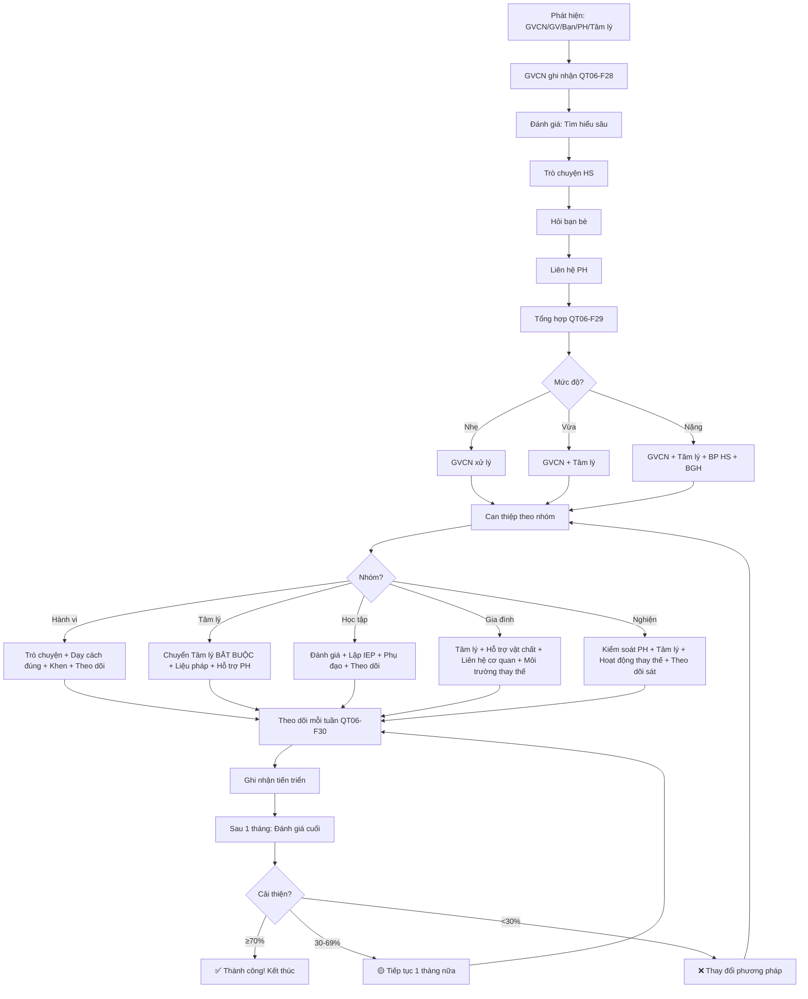

# SOP-03.4: HỖ TRỢ HỌC SINH CÓ VẤN ĐỀ

## 1. THÔNG TIN QUY TRÌNH

| **Thuộc tính** | **Nội dung** |
|---|---|
| Mã SOP | SOP-03.4 |
| Tên quy trình | Hỗ trợ học sinh có vấn đề |
| Quy trình cha | SOP-03: Nề nếp - Kỷ luật |
| Phiên bản | 1.0 |
| Áp dụng | HS có vấn đề hành vi, Tâm lý |

## 2. MỤC ĐÍCH

- **Can thiệp sớm**: Phát hiện và Hỗ trợ kịp thời
- **Giảm vi phạm**: Giúp HS sửa hành vi tiêu cực
- **Bảo vệ**: Bảo vệ HS khác khỏi bị ảnh hưởng
- **Phát triển**: Giúp HS phát triển toàn diện

## 3. PHẠM VI ÁP DỤNG

Học sinh có dấu hiệu: Hành vi tiêu cực, Vấn đề tâm lý, Khó khăn học tập

## 4. PHÂN LOẠI HỌC SINH CÓ VẤN ĐỀ

### 4.1. 5 nhóm chính

```
╔══════════════════════════════════════════════════════════════════╗
║            5 NHÓM HỌC SINH CÓ VẤN ĐỀ                             ║
╠══════════════════════════════════════════════════════════════════╣
║ NHÓM 1: VẤN ĐỀ HÀNH VI (Behavioral Problems)                    ║
║  • Hay gây gổ, Đánh bạn                                          ║
║  • Bắt nạt (Bullying)                                            ║
║  • Không tuân thủ quy định (Ngoan cố)                            ║
║  • Phá hoại tài sản                                              ║
║  → Nguyên nhân: Thiếu kỷ luật, Học theo môi trường xấu          ║
╠══════════════════════════════════════════════════════════════════╣
║ NHÓM 2: VẤN ĐỀ TÂM LÝ (Psychological Issues)                    ║
║  • Lo lắng, Sợ hãi (Anxiety)                                     ║
║  • Trầm cảm (Depression)                                         ║
║  • Tự ti, Thiếu tự tin                                           ║
║  • Căng thẳng, Stress                                            ║
║  → Nguyên nhân: Gia đình, Áp lực học tập, Bị bắt nạt            ║
╠══════════════════════════════════════════════════════════════════╣
║ NHÓM 3: KHÓ KHĂN HỌC TẬP (Learning Difficulties)                ║
║  • Học chậm (Slow learner)                                       ║
║  • Khó khăn đọc viết (Dyslexia)                                  ║
║  • Khó tập trung (ADHD)                                          ║
║  • Tự kỷ (Autism)                                                ║
║  → Nguyên nhân: Bẩm sinh, Thiếu kích thích sớm                  ║
╠══════════════════════════════════════════════════════════════════╣
║ NHÓM 4: VẤN ĐỀ GIA ĐÌNH (Family Issues)                         ║
║  • Gia đình ly hôn                                               ║
║  • Bạo lực gia đình                                              ║
║  • Gia đình nghèo, Không quan tâm con                            ║
║  → Ảnh hưởng: HS buồn, Không tập trung học                      ║
╠══════════════════════════════════════════════════════════════════╣
║ NHÓM 5: NGHIỆN (Addictions)                                     ║
║  • Nghiện game                                                   ║
║  • Nghiện điện thoại, Mạng xã hội                                ║
║  • Nghiện thuốc lá (THCS)                                        ║
║  • Ma túy (Hiếm, Nhưng nguy hiểm!)                               ║
║  → Nguyên nhân: Tò mò, Bạn bè rủ rê                              ║
╚══════════════════════════════════════════════════════════════════╝
```

### 4.2. Dấu hiệu nhận biết

| **Nhóm** | **Dấu hiệu** |
|---|---|
| **Hành vi** | Hay gây gổ, Không nghe lời, Phá đồ... |
| **Tâm lý** | Buồn, Khóc nhiều, Không muốn đến trường, Mất ngủ... |
| **Học tập** | Học yếu kéo dài, Không hiểu bài dù GV giảng nhiều lần |
| **Gia đình** | Cha/mẹ không đến họp PH, HS mặc quần áo cũ/rách, Không ăn trưa... |
| **Nghiện** | Luôn nghĩ đến game/điện thoại, Không tập trung, Mắt thâm quầng... |

## 5. QUY TRÌNH HỖ TRỢ

### 5.1. Giai đoạn 1: Phát hiện (Detection)

**Ai phát hiện?**

```
╔══════════════════════════════════════════════════════════════════╗
║            NGUỒN PHÁT HIỆN HỌC SINH CÓ VẤN ĐỀ                    ║
╠══════════════════════════════════════════════════════════════════╣
║ 1. GVCN/GV môn quan sát:                                         ║
║    • Trong giờ học: HS buồn, Không tập trung...                  ║
║    • Hành vi bất thường: Hay gây gổ, Trầm lặng...                ║
╠══════════════════════════════════════════════════════════════════╣
║ 2. Bạn bè báo:                                                   ║
║    • "Cô ơi, Bạn A khóc!", "Bạn B bị bạn C đánh!"                ║
╠══════════════════════════════════════════════════════════════════╣
║ 3. PH phản ánh:                                                  ║
║    • "Con em về nhà hay khóc, Không muốn đi học!"                ║
╠══════════════════════════════════════════════════════════════════╣
║ 4. Tâm lý sàng lọc (Định kỳ):                                    ║
║    • Khảo sát tâm lý HS (Mỗi HK 1 lần)                           ║
║    • Phát hiện HS có dấu hiệu lo lắng, Trầm cảm...               ║
╚══════════════════════════════════════════════════════════════════╝
```

**Bước 1: GVCN ghi nhận (QT06-F28)**

```
═══════════════════════════════════════════════════════
       PHIẾU GHI NHẬN HỌC SINH CÓ VẤN ĐỀ
═══════════════════════════════════════════════════════

Ngày: __/__/____

HS: _______________  Lớp: ____

Vấn đề phát hiện:
□ Hành vi tiêu cực
□ Tâm lý (Buồn, Lo lắng...)
□ Học tập khó khăn
□ Gia đình
□ Nghiện (Game, Điện thoại...)

Mô tả cụ thể:
__________________________________________________________
__________________________________________________________

Người phát hiện: __________  (GVCN/GV/Bạn/PH/Tâm lý)

GVCN ký: __________
═══════════════════════════════════════════════════════
```

### 5.2. Giai đoạn 2: Đánh giá (Assessment)

**Bước 2: GVCN tìm hiểu sâu (1-2 ngày)**

**A. Trò chuyện với HS:**

```
GVCN: "Em [Tên], Cô nhận thấy mấy hôm nay em buồn.
       Em có chuyện gì không? Kể cô nghe!"
       
[Lắng nghe, Không ngắt lời]

HS: "Em...em bị bạn C chọc!"
GVCN: "Ồ, Vậy à? Kể cô nghe chi tiết!"

[Ghi chép lại]
```

**B. Hỏi bạn bè:**

```
GVCN: "Bạn D, Bạn thấy bạn A những ngày qua thế nào?"
Bạn D: "Dạ, Bạn A hay khóc, Không chơi với bọn em!"
GVCN: "Bạn biết tại sao không?"
Bạn D: "Dạ, Em nghe nói bạn A bị bạn C chọc!"
```

**C. Liên hệ PH:**

```
GVCN gọi PH:
"Chào quý PH, Cô nhận thấy con [Tên] mấy ngày nay buồn.
 Ở nhà con có chuyện gì không ạ?"
 
PH: "Không có gì đặc biệt..."
GVCN: "Vậy à? Con có nói với PH là bị bạn chọc không?"
PH: "Ồ, Có! Con có nói!"
```

**Bước 3: GVCN tổng hợp (QT06-F29)**

```
═══════════════════════════════════════════════════════
        PHIẾU ĐÁNH GIÁ HỌC SINH CÓ VẤN ĐỀ
═══════════════════════════════════════════════════════

HS: _______________  Lớp: ____

VẤN ĐỀ: Bị bạn chọc (Bullying)

NGUYÊN NHÂN:
• Bạn C thường xuyên chọc, Lấy đồ của A
• A nhút nhát, Không dám nói GV
• PH không biết (A không dám nói PH)

MỨC ĐỘ:
□ Nhẹ: A chưa bị thương, Nhưng buồn
□ Vừa: ___
□ Nặng: ___

KẾ HOẠCH HỖ TRỢ:
1. Xử lý bạn C (Nhắc nhở, Gọi PH)
2. Động viên A (Tâm lý can thiệp)
3. Dạy A kỹ năng tự vệ ("Em hãy nói cô khi bị chọc!")
4. Theo dõi 2 tuần

GVCN ký: __________
═══════════════════════════════════════════════════════
```

**Bước 4: Quyết định mức độ can thiệp**

| **Mức độ** | **Can thiệp** |
|---|---|
| **Nhẹ** | GVCN xử lý |
| **Vừa** | GVCN + Tâm lý |
| **Nặng** | GVCN + Tâm lý + BP HS + BGH |

### 5.3. Giai đoạn 3: Can thiệp (Intervention)

**Can thiệp theo nhóm:**

**A. Nhóm 1: Vấn đề hành vi**

```
KẾ HOẠCH CAN THIỆP:

1. Xác định nguyên nhân:
   • Tại sao HS hay gây gổ?
   • Học hành vi này từ đâu? (Gia đình? Bạn bè?)
   
2. Can thiệp GVCN:
   • Trò chuyện riêng: Giải thích hậu quả hành vi
   • Dạy cách đúng: "Em giận → Em nói, Không đánh!"
   • Khen khi HS làm đúng
   
3. Can thiệp PH:
   • Gọi PH hợp tác
   • Yêu cầu PH: Không đánh con (Tránh HS học theo!)
   • Theo dõi con chặt hơn
   
4. Can thiệp Tâm lý (Nếu nặng):
   • Dạy kỹ năng kiểm soát cảm xúc
   • Liệu pháp hành vi nhận thức (CBT)
   • 5-10 buổi (1 tuần 1 buổi)
   
5. Theo dõi:
   • GVCN theo dõi hằng ngày
   • Báo cáo tiến triển mỗi tuần
```

**B. Nhóm 2: Vấn đề tâm lý**

```
KẾ HOẠCH CAN THIỆP:

1. Chuyển Tâm lý học đường (BẮT BUỘC!):
   • HS lo lắng, Trầm cảm → PHẢI có chuyên gia!
   
2. Tâm lý làm việc với HS:
   • Trò chuyện, Tìm nguyên nhân
   • Liệu pháp (Play therapy, Art therapy...)
   • Dạy kỹ năng thư giãn, Quản lý stress
   
3. Tâm lý làm việc với PH:
   • Hướng dẫn PH cách hỗ trợ con ở nhà
   • Giảm áp lực học tập (Nếu cần)
   
4. GVCN hỗ trợ tại lớp:
   • Quan tâm, Động viên HS
   • Tạo môi trường an toàn
   • Giảm áp lực (VD: Không gọi lên bảng nếu HS sợ)
   
5. Theo dõi sát:
   • Mỗi ngày hỏi: "Em hôm nay thế nào?"
   • Liên hệ PH hằng ngày (1 tuần đầu)
   
⚠️ CẢNH BÁO:
Nếu HS có dấu hiệu TỰ TỬ (Nói "Muốn chết", Tự gây thương tích...)
→ BÁO NGAY BGH + PH! Đưa đến Bệnh viện Tâm thần!
```

**C. Nhóm 3: Khó khăn học tập**

```
KẾ HOẠCH CAN THIỆP:

1. Đánh giá năng lực (Test đầu vào):
   • Xác định: HS yếu môn nào? Yếu ở đâu?
   
2. Lập IEP (Individualized Education Plan) - Kế hoạch cá nhân:
   • Mục tiêu cụ thể: VD "Em học được bảng cửu chương 2, 3"
   • Phương pháp dạy: Dạy chậm hơn, Nhiều hình ảnh...
   • Thời gian: 3 tháng
   
3. Phụ đạo:
   • GVCN hoặc GV phụ đạo (Buổi chiều, Miễn phí)
   • 2-3 buổi/tuần, 45 phút/buổi
   
4. Sử dụng công nghệ hỗ trợ:
   • App học Toán (Monkey Math, Khan Academy Kids...)
   • Sách nói (Nếu HS khó đọc)
   
5. Giảm áp lực:
   • Không ép HS phải giỏi như bạn
   • Khen mỗi tiến bộ nhỏ
   
6. Theo dõi:
   • Kiểm tra tiến độ mỗi tháng
   • Điều chỉnh IEP nếu cần
```

**D. Nhóm 4: Vấn đề gia đình**

```
KẾ HOẠCH CAN THIỆP:

1. Tìm hiểu hoàn cảnh:
   • Gia đình ly hôn? Bạo lực? Nghèo?
   
2. Hỗ trợ tâm lý:
   • Tâm lý nói chuyện với HS
   • Giúp HS hiểu: "Bố mẹ ly hôn không phải lỗi của con!"
   • Dạy cách đối phó với cảm xúc
   
3. Hỗ trợ vật chất (Nếu gia đình nghèo):
   • Miễn giảm học phí
   • Hỗ trợ ăn trưa
   • Tặng sách vở, Đồng phục
   • Kêu gọi từ thiện (Nếu cần)
   
4. Liên hệ cơ quan chức năng (Nếu bạo lực):
   • Báo Trung tâm Bảo trợ trẻ em
   • Báo Công an (Nếu nghiêm trọng)
   
5. Tạo môi trường thay thế:
   • Trường = "Ngôi nhà thứ 2"
   • GVCN = Người thân (Ôm, An ủi khi HS buồn)
   • Bạn bè = Gia đình
```

**E. Nhóm 5: Nghiện**

```
KẾ HOẠCH CAN THIỆP:

1. Xác định mức độ nghiện:
   • Nhẹ: Chơi game 2-3 giờ/ngày
   • Vừa: 4-6 giờ/ngày, Ảnh hưởng học tập
   • Nặng: >6 giờ/ngày, Không ăn, Không ngủ, Bỏ học
   
2. Can thiệp PH (QUAN TRỌNG NHẤT!):
   • PH kiểm soát điện thoại/máy tính
   • Đặt mật khẩu, Giới hạn thời gian
   • Không để con chơi game quá 1 giờ/ngày
   
3. Can thiệp Tâm lý:
   • Tìm nguyên nhân: Tại sao con nghiện?
     (Trốn tránh thực tại? Bạn bè rủ rê?)
   • Liệu pháp cai nghiện (Cognitive Behavioral Therapy)
   
4. Tạo hoạt động thay thế:
   • Cho HS tham gia CLB (Thể thao, Nghệ thuật...)
   • Giúp HS tìm sở thích khác (Không phải game!)
   
5. Theo dõi sát:
   • PH báo cáo GVCN mỗi ngày
   • GVCN kiểm tra HS có mệt, Thiếu ngủ không?
   
⚠️ NGHIỆN NẶNG:
• Chuyển đến Trung tâm Cai nghiện
• Tạm nghỉ học để điều trị
```

### 5.4. Giai đoạn 4: Theo dõi (Monitoring)

**Bước 5: Theo dõi tiến triển (Mỗi tuần)**

```
GVCN ghi nhận (QT06-F30):

TUẦN 1 (Sau can thiệp):
• HS A: Vẫn còn buồn, Nhưng bớt hơn
• Bạn C: Đã nhắc nhở, Không chọc A nữa
• Đánh giá: Cải thiện 30%

TUẦN 2:
• HS A: Vui vẻ hơn, Chơi với bạn
• Đánh giá: Cải thiện 60%

TUẦN 3:
• HS A: Hoàn toàn bình thường
• Đánh giá: Cải thiện 90%

→ CAN THIỆP THÀNH CÔNG! ✅
```

**Bước 6: Đánh giá cuối (Sau 1 tháng)**

```
Nếu:
✅ Cải thiện ≥70% → THÀNH CÔNG! Kết thúc can thiệp
🟡 Cải thiện 30-69% → Tiếp tục can thiệp 1 tháng nữa
❌ Cải thiện <30% → Thay đổi phương pháp can thiệp
```

## 6. LƯU ĐỒ QUY TRÌNH



## 7. BIỂU MẪU LIÊN QUAN

| **Mã** | **Tên** |
|---|---|
| QT06-F28 | Phiếu ghi nhận HS có vấn đề |
| QT06-F29 | Phiếu đánh giá HS có vấn đề |
| QT06-F30 | Phiếu theo dõi tiến triển (Tuần) |
| QT06-IEP | Kế hoạch giáo dục cá nhân (IEP) |

## 8. TIÊU CHUẨN VÀ CHỈ TIÊU

| **Chỉ tiêu** | **Mục tiêu** |
|---|---|
| Thời gian phát hiện đến can thiệp | ≤ 3 ngày |
| Tỷ lệ can thiệp thành công (Cải thiện ≥70%) | ≥ 80% |
| Tỷ lệ HS được theo dõi đầy đủ | 100% |
| Tỷ lệ PH hài lòng với hỗ trợ | ≥ 85% |

## 9. TRÁCH NHIỆM CỤ THỂ

| **Vai trò** | **Trách nhiệm** |
|---|---|
| **GVCN** | Phát hiện, Đánh giá, Can thiệp nhẹ, Theo dõi |
| **Tâm lý** | Can thiệp vừa/nặng, Liệu pháp, Tư vấn PH |
| **BP HS** | Hỗ trợ, Điều phối, Huy động nguồn lực |
| **BGH** | Quyết định can thiệp nặng, Huy động ngân sách |
| **PH** | Hợp tác, Thực hiện tại nhà |

## 10. LƯU Ý QUAN TRỌNG

- ⚠️ **Bảo mật**: Thông tin HS = Bí mật! Không tiết lộ!
- ✅ **Không kỳ thị**: HS có vấn đề ≠ HS xấu! Cần giúp đỡ!
- 🔥 **Kiên trì**: Can thiệp không thành công ngay! Phải kiên trì!
- ✅ **Hợp tác PH**: Không có PH hợp tác → Rất khó thành công!

## 11. PHỤ LỤC

### 11.1. Dấu hiệu cảnh báo TỰ TỬ

```
⚠️⚠️⚠️ CỰC KỲ NGUY HIỂM! ⚠️⚠️⚠️

NẾU HS CÓ ≥2 DẤU HIỆU SAU → NGUY CƠ TỰ TỬ CAO!

□ Nói: "Muốn chết", "Không muốn sống nữa"
□ Tự gây thương tích (Cắt tay, Đập đầu...)
□ Viết thư tạm biệt
□ Cho đồ của mình cho bạn
□ Đột nhiên vui vẻ (Sau thời gian dài buồn) - Đã quyết định!
□ Tìm kiếm cách tự tử (Search Google...)

→ XỬ LÝ NGAY:
1. BÁO BGH + PH NGAY! (Trong 10 phút)
2. KHÔNG để HS một mình!
3. Gọi 115 (Cấp cứu)
4. Đưa đến Bệnh viện Tâm thần
5. Theo dõi 24/7 (Đến khi an toàn)
```

### 11.2. Kỹ năng lắng nghe tích cực (Active Listening)

```
KHI TRÒ CHUYỆN VỚI HS CÓ VẤN ĐỀ:

✅ LÀM:
• Nhìn vào mắt HS
• Gật đầu: "Ừ, Cô hiểu..."
• Lặp lại: "Vậy là em bị bạn chọc à?"
• Đồng cảm: "Cô hiểu em buồn lắm..."
• Không ngắt lời
• Hỏi thêm: "Rồi sau đó thế nào?"

❌ KHÔNG LÀM:
• Nhìn điện thoại (Không tôn trọng!)
• Ngắt lời: "Ừ, Cô biết rồi!"
• Phán xét: "Em sai rồi!"
• So sánh: "Bạn khác không buồn mà!"
• Nhỏ: "Chuyện nhỏ vậy mà buồn!"
```

### 11.3. Mẫu IEP (Kế hoạch giáo dục cá nhân)

```
═══════════════════════════════════════════════════════
  KẾ HOẠCH GIÁO DỤC CÁ NHÂN (IEP)
  HS: _______________  Lớp: ____
═══════════════════════════════════════════════════════

VẤN ĐỀ: Em yếu Toán (Chưa biết bảng cửu chương)

MỤC TIÊU (3 tháng):
• Học thuộc bảng cửu chương 2, 3, 4, 5
• Làm được phép nhân 1 chữ số

PHƯƠNG PHÁP:
• Dạy bằng hình ảnh (2 × 3 = Vẽ 2 nhóm, Mỗi nhóm 3 con)
• Học qua bài hát (Bảng cửu chương rap)
• Luyện tập mỗi ngày 15 phút

LỊCH PHỤ ĐẠO:
• Thứ 2, 4, 6: 15h00-15:45 (Phòng phụ đạo)
• GV: Cô [Tên]

ĐÁNH GIÁ:
• Mỗi tuần: Kiểm tra 1 bảng
• Cuối tháng 1: Kiểm tra tổng hợp
• Cuối tháng 3: Đánh giá cuối (Đạt/Chưa đạt)

GVCN ký: __________  PH ký: __________
═══════════════════════════════════════════════════════
```

## 12. FAQ

**Q1: HS có vấn đề, Nhưng PH không hợp tác. Làm sao?**  
A: 
- Gọi PH nhiều lần, Kiên trì
- Giải thích hậu quả: "Không can thiệp → Con học yếu, Bỏ học..."
- Nếu PH vẫn không hợp tác → Báo Trung tâm Bảo trợ trẻ em
- Trường vẫn can thiệp (Dù không có PH hợp tác!)

**Q2: Can thiệp 3 tháng, HS vẫn không cải thiện. Bỏ cuộc?**  
A: KHÔNG! Có thể:
- Thay đổi phương pháp (VD: Chuyển Tâm lý khác)
- Tìm nguyên nhân sâu xa hơn
- Tham khảo chuyên gia bên ngoài
- Mục tiêu: KHÔNG BỎ RƠI HS!

**Q3: HS nghiện game nặng, PH không kiểm soát được. Xử lý?**  
A: 
- Đề nghị PH đưa con đến Trung tâm Cai nghiện
- Tạm nghỉ học để điều trị
- Sau khi cai xong, Quay lại học

**Q4: Có nên công khai HS có vấn đề không? (VD: Thông báo lớp "Bạn A đang trầm cảm"):**  
A: KHÔNG! Tuyệt đối bảo mật! Chỉ GV, BGH, Tâm lý biết. Không cho bạn bè biết (Tránh bạn bè kỳ thị!)

---

**PHÊ DUYỆT**

| GVCN | Tâm lý học đường | Trưởng BP HS | Phó HT |
|---|---|---|---|
| [Họ tên] | [Họ tên] | [Họ tên] | [Họ tên] |
