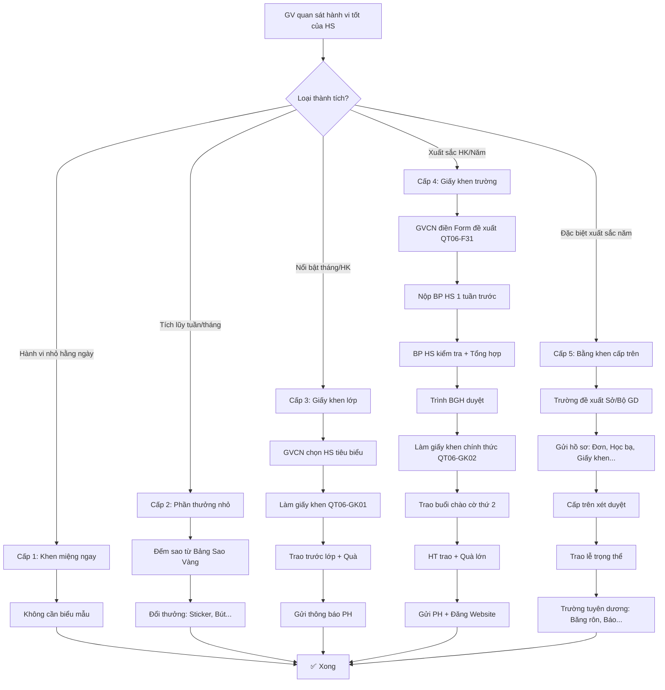

# SOP-03.5: GHI NHẬN VÀ KHEN THƯỞNG

## 1. THÔNG TIN QUY TRÌNH

| **Thuộc tính** | **Nội dung** |
|---|---|
| Mã SOP | SOP-03.5 |
| Tên quy trình | Ghi nhận và khen thưởng |
| Quy trình cha | SOP-03: Nề nếp - Kỷ luật |
| Phiên bản | 1.0 |
| Áp dụng | Tất cả HS có hành vi tích cực |

## 2. MỤC ĐÍCH

- **Động viên**: HS muốn làm tốt hơn
- **Ghi nhận công lao**: HS thấy nỗ lực được trân trọng
- **Tạo văn hóa tích cực**: Môi trường khen nhiều hơn phạt
- **Lan tỏa**: HS khác học tập

## 3. PHẠM VI ÁP DỤNG

Tất cả học sinh có hành vi, Thành tích tích cực

## 4. CÁC HÌNH THỨC GHI NHẬN

### 4.1. Hệ thống 5 cấp độ

```
╔══════════════════════════════════════════════════════════════════╗
║           HỆ THỐNG GHI NHẬN 5 CẤP ĐỘ                             ║
╠══════════════════════════════════════════════════════════════════╣
║ CẤP 1: KHEN MIỆNG (Verbal Praise)                                ║
║  • Khi: Hằng ngày, Hành vi nhỏ                                   ║
║  • VD: "Bạn A đến đúng giờ! Giỏi lắm!"                           ║
║  • Ai khen: GVCN, GV môn                                         ║
║  • Chi phí: 0đ                                                   ║
╠══════════════════════════════════════════════════════════════════╣
║ CẤP 2: PHẦN THƯỞNG NHỎ (Small Rewards)                           ║
║  • Khi: Tuần, Tích lũy hành vi tốt                               ║
║  • VD: Sticker, Sao vàng, Bút chì...                             ║
║  • Ai trao: GVCN                                                 ║
║  • Chi phí: 2,000-10,000đ                                        ║
╠══════════════════════════════════════════════════════════════════╣
║ CẤP 3: GIẤY KHEN LỚP (Class Certificate)                         ║
║  • Khi: Tháng/HK, Thành tích nổi bật                             ║
║  • VD: HS của tháng, HS tiến bộ...                               ║
║  • Ai trao: GVCN                                                 ║
║  • Chi phí: 5,000-20,000đ (In + Quà)                             ║
╠══════════════════════════════════════════════════════════════════╣
║ CẤP 4: GIẤY KHEN TRƯỜNG (School Certificate)                     ║
║  • Khi: HK/Năm, Thành tích xuất sắc                              ║
║  • VD: HS giỏi toàn diện, HS gương mẫu...                        ║
║  • Ai trao: HT (Buổi chào cờ)                                    ║
║  • Chi phí: 50,000-200,000đ (Giấy khen + Quà lớn)                ║
╠══════════════════════════════════════════════════════════════════╣
║ CẤP 5: BẰNG KHEN CẤP TRÊN (Higher Authority)                     ║
║  • Khi: Năm, Thành tích đặc biệt xuất sắc                        ║
║  • VD: HS 3 tốt (Cấp Phường), HS giỏi Quốc gia...                ║
║  • Ai trao: Sở GD, UBND, Trung ương                              ║
║  • Chi phí: Do cấp trên quyết định                               ║
╚══════════════════════════════════════════════════════════════════╝
```

## 5. TIÊU CHÍ GHI NHẬN

### 5.1. Các loại thành tích

**A. Thành tích học tập:**

| **Loại** | **Tiêu chí** | **Cấp độ khen** |
|---|---|---|
| Học sinh giỏi | ĐTB ≥ 8.5, Tất cả môn ≥ 8.0, HK Tốt | Cấp 4 |
| Học sinh khá | ĐTB ≥ 7.0, HK Khá | Cấp 3 |
| Tiến bộ vượt bậc | Tăng ≥2 điểm so với HK trước | Cấp 3 |
| Bài kiểm tra tốt | Điểm 9-10 | Cấp 1-2 |

**B. Thành tích hạnh kiểm:**

| **Loại** | **Tiêu chí** | **Cấp độ khen** |
|---|---|---|
| HS gương mẫu | HK Tốt, Không vi phạm, Giúp bạn nhiều | Cấp 4 |
| HS có tinh thần tập thể | Tham gia hoạt động tích cực | Cấp 3 |
| Hành động đẹp | Nhặt được của rơi trả lại, Giúp HS khó khăn... | Cấp 2 |

**C. Thành tích thi đấu:**

| **Loại** | **Tiêu chí** | **Cấp độ khen** |
|---|---|---|
| Giải Quốc gia/Quốc tế | Vàng, Bạc, Đồng | Cấp 5 + Tiền thưởng lớn |
| Giải cấp Thành phố | Top 3 | Cấp 4 |
| Giải cấp Trường | Top 3 | Cấp 3 |
| Tham gia thi đấu | Đại diện trường | Cấp 2 |

**D. Thành tích khác:**

| **Loại** | **Tiêu chí** | **Cấp độ khen** |
|---|---|---|
| Chuyên cần 100% | Cả năm không nghỉ 1 buổi nào | Cấp 4 |
| Không vi phạm | Cả năm không vi phạm kỷ luật | Cấp 3 |
| Sáng kiến nhỏ | Đề xuất ý tưởng hay cho lớp/trường | Cấp 2 |

## 6. QUY TRÌNH GHI NHẬN

### 6.1. Cấp 1: Khen miệng (Hằng ngày)

**Bước 1: GV quan sát, Phát hiện hành vi tốt**

```
VD:
• Sáng: Bạn A đến lúc 7:20 (Sớm 10 phút)
• Tiết 2: Bạn B giơ tay trả lời đúng
• Giờ ra chơi: Bạn C giúp bạn D nhặt sách
```

**Bước 2: GV khen NGAY, CỤ THỂ**

```
GV: "Bạn A, Hôm nay bạn đến sớm 10 phút! 
     Cô rất vui! Tiếp tục phát huy nhé!"
     
→ Bạn A rất vui! Ngày mai sẽ cố gắng đến sớm tiếp!
```

**Không cần biểu mẫu, Không cần ghi nhận chính thức!**

### 6.2. Cấp 2: Phần thưởng nhỏ (Tuần/Tháng)

**Bước 1: GVCN tổng hợp hành vi tốt trong tuần**

```
Sử dụng "Bảng Sao Vàng" (Đã làm ở SOP-03.2):
• Bạn A: 12 sao (Đến đúng giờ 5 ngày + Giúp bạn 2 lần + Làm bài tốt 1 lần)
• Bạn B: 8 sao
...
```

**Bước 2: Đổi thưởng cuối tuần/tháng**

```
Thứ 6:
GVCN: "Giờ cô kiểm tra các em tích được bao nhiêu sao!
       Bạn A: 12 sao → Đổi 1 sticker! [Trao]
       Bạn B: 8 sao → Chưa đủ 10 sao, Tuần sau cố gắng nhé!"
```

**Không cần biểu mẫu phức tạp!**

### 6.3. Cấp 3: Giấy khen lớp (Tháng/HK)

**Bước 1: GVCN chọn HS tiêu biểu**

**Tiêu chí chọn:**

```
MỖI THÁNG: Chọn 3 HS
• HS của tháng (Toàn diện nhất)
• HS học giỏi (Điểm cao nhất)
• HS tiến bộ (Tăng điểm nhiều nhất)

MỖI HK: Chọn 5 HS
• HS giỏi toàn diện (Học + Hạnh kiểm)
• HS chuyên cần (Không nghỉ 1 buổi)
• HS giúp bạn nhiều
• HS sạch sẽ nhất
• HS khác (Tùy GVCN)

LƯU Ý: Cố gắng TẤT CẢ HS được khen ít nhất 1 lần/HK!
```

**Bước 2: Làm giấy khen (QT06-GK01)**

```
═══════════════════════════════════════════════════════
              GIẤY KHEN
              (Cấp lớp)
═══════════════════════════════════════════════════════

Lớp ________ xin khen ngợi:

Họ tên: _______________
Ngày sinh: __/__/____

Đã đạt danh hiệu: "HỌC SINH CỦA THÁNG __"

Vì:
• Học tập chăm chỉ, Tiến bộ vượt bậc
• Chuyên cần 100%
• Giúp đỡ bạn bè tích cực

Lớp ________ khen thưởng để làm gương!

                         GVCN ký: __________
                         Ngày __/__/____
                         
                         [Đóng dấu lớp - Nếu có]
═══════════════════════════════════════════════════════
```

**Bước 3: Trao giấy khen (Trước lớp)**

```
Thứ 6 chiều:
GVCN: "Tuần này, Cô rất vui thông báo:
       Bạn A được khen "HS của tháng"!
       
       [Đọc lý do]
       
       Vỗ tay cho bạn A!"
       
[Cả lớp vỗ tay]
[GVCN trao giấy khen + Quà (Bút, Vở...)]
[Chụp ảnh + Gửi PH]
```

**Bước 4: Gửi thông báo PH**

```
Ghi vào Sổ liên lạc:
"Con [Tên] hôm nay được nhận giấy khen "HS của tháng"!
 Quý PH khen con và Khuyến khích con tiếp tục nhé!
 
 GVCN ký: __________"
```

### 6.4. Cấp 4: Giấy khen trường (HK/Năm)

**Bước 1: GVCN đề xuất (Cuối HK/Năm)**

```
GVCN điền Form đề xuất (QT06-F31):

═══════════════════════════════════════════════════════
       PHIẾU ĐỀ XUẤT KHEN THƯỞNG
═══════════════════════════════════════════════════════

Họ tên HS: _______________  Lớp: ____

Đề xuất danh hiệu:
□ Học sinh giỏi (ĐTB ≥ 8.5, HK Tốt)
□ Học sinh gương mẫu (HK Tốt, Không vi phạm)
□ Học sinh tiến bộ xuất sắc (Tăng ≥2 điểm)
□ Khác: ________________

Thành tích cụ thể:
__________________________________________________________
__________________________________________________________

GVCN ký: __________  Ngày: __/__/____
═══════════════════════════════════════════════════════
```

**Bước 2: GVCN nộp BP HS (1 tuần trước khi trao)**

**Bước 3: BP HS tổng hợp toàn trường**

```
Kiểm tra:
• Điểm số chính xác không?
• Hạnh kiểm đúng không?
• Có vi phạm gì không?

Nếu OK → Duyệt
Nếu có vấn đề → Trả lại GVCN
```

**Bước 4: Lập danh sách, Trình BGH**

```
DANH SÁCH HS ĐƯỢC KHEN (HK __):
• Học sinh giỏi: ____ HS
• Học sinh gương mẫu: ____ HS
• Học sinh tiến bộ: ____ HS
• Tổng: ____ HS (__% tổng HS trường)

BGH xem xét, Ký duyệt
```

**Bước 5: Làm giấy khen chính thức (QT06-GK02)**

```
═══════════════════════════════════════════════════════
        [LOGO TRƯỜNG]
        
              GIẤY KHEN
═══════════════════════════════════════════════════════

BAN GIÁM HIỆU TRƯỜNG ________
Xin khen ngợi:

Họ tên: _______________
Lớp: ____  Năm học: ________

Đã đạt danh hiệu: "HỌC SINH GIỎI HỌC KỲ __"

Vì:
• Điểm trung bình: ____ (Xuất sắc!)
• Hạnh kiểm: Tốt
• Chuyên cần: ___%
• Không vi phạm kỷ luật

Trường ________ khen thưởng để làm gương cho các em!

                         HT ký: __________
                         [Đóng dấu trường]
                         Ngày __/__/____
═══════════════════════════════════════════════════════
```

**Bước 6: Trao giấy khen (Buổi chào cờ thứ 2)**

```
Buổi chào cờ:
HT: "Hôm nay, Nhà trường rất vinh dự trao giấy khen
     cho các em đạt thành tích xuất sắc HK __!
     
     [Đọc danh sách]
     
     Mời các em lên nhận!"

[HS lên sân khấu]
[HT trao giấy khen + Quà (Sách, Balo...)]
[Vỗ tay]
[Chụp ảnh]
```

**Bước 7: Gửi thông báo PH + Đăng Website/Fanpage**

### 6.5. Cấp 5: Bằng khen cấp trên (Năm)

**Bước 1: Trường đề xuất (Cuối năm)**

```
Gửi danh sách + Hồ sơ đến:
• Phòng GD (HS 3 tốt cấp Phường/Quận)
• Sở GD (HS giỏi cấp Thành phố)
• Bộ GD (HS giỏi Quốc gia)

Hồ sơ bao gồm:
• Đơn đề xuất
• Học bạ photo
• Giấy khen đã có
• Ảnh HS
• Thành tích nổi bật (Nếu có)
```

**Bước 2: Cấp trên xét duyệt**

**Bước 3: Trao bằng khen (Lễ trọng thể)**

```
VD: Lễ trao "HS 3 tốt cấp Quận":
• Địa điểm: Hội trường Quận
• Trưởng phòng GD trao
• PH + HS tham dự
• Bằng khen + Quà + Tiền (1-5 triệu)
```

**Bước 4: Trường tuyên dương**

- Treo băng rôn: "Chúc mừng em [Tên] đạt HS 3 tốt cấp Quận!"
- Đăng báo trường
- Chia sẻ trên mạng xã hội

## 7. NGÂN SÁCH KHEN THƯỞNG

### 7.1. Dự toán năm

```
GIẢ SỬ TRƯỜNG 500 HS:

CẤP 1: Khen miệng
• Chi phí: 0đ

CẤP 2: Phần thưởng nhỏ
• Sticker: 20 tờ × 10,000đ = 200,000đ
• Bút chì: 50 cây × 3,000đ = 150,000đ
• Tẩy, Vở: 200,000đ
• Tổng: 550,000đ/HK = 1,100,000đ/năm

CẤP 3: Giấy khen lớp
• 100 HS (20% được khen) × 20,000đ = 2,000,000đ/HK
• Tổng: 4,000,000đ/năm

CẤP 4: Giấy khen trường
• 50 HS (10% được khen) × 100,000đ = 5,000,000đ/HK
• Tổng: 10,000,000đ/năm

CẤP 5: Bằng khen cấp trên
• 5 HS × 500,000đ (Quà từ trường) = 2,500,000đ/năm

╔════════════════════════════════╗
║ TỔNG: ~18 TRIỆU/NĂM             ║
║ = 36,000đ/HS/năm (Rất rẻ!)     ║
╚════════════════════════════════╝
```

### 7.2. Nguồn ngân sách

```
• 70%: Ngân sách trường (Chi phí hoạt động)
• 20%: Tài trợ doanh nghiệp (Sponsor)
• 10%: Quỹ lớp (PH đóng góp)
```

## 8. LƯU ĐỒ QUY TRÌNH



## 9. BIỂU MẪU LIÊN QUAN

| **Mã** | **Tên** |
|---|---|
| QT06-GK01 | Giấy khen cấp lớp |
| QT06-GK02 | Giấy khen cấp trường |
| QT06-F31 | Phiếu đề xuất khen thưởng |
| QT06-BC12 | Báo cáo khen thưởng HK/Năm |

## 10. TIÊU CHUẨN VÀ CHỈ TIÊU

| **Chỉ tiêu** | **Mục tiêu** |
|---|---|
| Tỷ lệ HS được khen miệng (Cấp 1) | 100% (Mỗi HS ít nhất 1 lần/tuần) |
| Tỷ lệ HS được giấy khen lớp (Cấp 3) | ≥ 50% (Mỗi HS ít nhất 1 lần/năm) |
| Tỷ lệ HS được giấy khen trường (Cấp 4) | 10-15% |
| Tỷ lệ PH hài lòng với hệ thống khen thưởng | ≥ 90% |

## 11. TRÁCH NHIỆM CỤ THỂ

| **Vai trò** | **Trách nhiệm** |
|---|---|
| **GV/GVCN** | Khen cấp 1-2, Đề xuất cấp 3-4 |
| **BP HS** | Tổng hợp cấp 4, Làm giấy khen trường |
| **BGH** | Duyệt cấp 4, Trao giấy khen, Đề xuất cấp 5 |
| **Kế toán** | Quản lý ngân sách khen thưởng |

## 12. LƯU Ý QUAN TRỌNG

- ⚠️ **Công bằng**: Cố gắng KHEN TẤT CẢ HS! Không chỉ HS giỏi!
- ✅ **Khen HÀNH VI, Không khen NHÂN CÁCH**: "Em làm bài tốt!" (✅) vs "Em thông minh!" (❌)
- 🔥 **Khen CỤ THỂ**: "Em đến sớm 10 phút!" (✅) vs "Em giỏi!" (❌)
- ✅ **Khen NGAY**: Không chờ! HS làm tốt → Khen ngay!

## 13. PHỤ LỤC

### 13.1. 50 cách khen sáng tạo (Bổ sung SOP-03.2)

```
NGÔN NGỮ:
1. "Tuyệt vời!" (Wonderful!)
2. "Xuất sắc!" (Excellent!)
3. "Giỏi quá!" (Great job!)
4. "Cô tự hào về em!" (I'm proud of you!)
5. "Em làm được rồi!" (You did it!)

HÀNH ĐỘNG:
6. Vỗ tay
7. Giơ ngón tay cái 👍
8. High five
9. Ôm (Nếu HS đồng ý)
10. Vỗ vai

VẬT CHẤT:
11. Sticker
12. Sao vàng
13. Bút chì
14. Tẩy
15. Vở

QUY game:
16. Được chọn bài hát
17. Được chọn trò chơi
18. Được ngồi bàn đầu 1 ngày
19. Được làm trưởng nhóm
20. Được miễn nộp bài 1 lần (THCS)

CÔNG KHAI:
21. Ghi tên lên bảng vinh danh
22. Chụp ảnh + Dán tường
23. Khen trước lớp
24. Khen trước trường (Chào cờ)
25. Đăng Facebook/Website

LIÊN HỆ PH:
26. Gọi điện khen (Khi đón)
27. Ghi Sổ liên lạc
28. Gửi email + Ảnh
29. Viết thư tay
30. Mời PH đến xem con nhận giải

GIẤY KHEN:
31-50. [Các loại giấy khen khác nhau...]
```

### 13.2. Xử lý tình huống khó

**A. HS yếu, Không có thành tích để khen:**

```
GIẢI PHÁP: TÌM ĐIỂM TỐT NHỎ NHẤT!
• HS yếu Toán → Khen: "Hôm nay em làm đúng 3/10 câu!
                       Tiến bộ rồi! (Hôm qua 1/10)"
• HS học yếu → Khen: "Em chăm chỉ! Cô thấy em cố gắng!"
• HS không có gì → Khen: "Em hôm nay mặc đẹp quá!"

→ AI cũng có điểm tốt! Hãy tìm và Khen!
```

**B. HS ganh tị (Sao bạn được khen nhiều hơn?):**

```
GIẢI THÍCH:
"Mỗi người có điểm mạnh khác nhau!
 Bạn A giỏi Toán → Được khen Toán
 Em giỏi Văn → Được khen Văn
 Bạn B giúp bạn nhiều → Được khen giúp bạn
 
 Em có thể được khen theo cách của em!"
 
→ Không so sánh! Mỗi người 1 phong cách!
```

**C. PH so sánh con với con người khác:**

```
PH: "Sao con tôi không được giấy khen như con bạn X?"

GVCN: "Quý PH ạ, Con [Tên] cũng có nhiều điểm tốt:
       • Con chăm chỉ
       • Con giúp bạn
       • Con tiến bộ (Từ 6 điểm lên 7 điểm!)
       
       Mỗi con có tốc độ riêng. Chúng ta đừng so sánh!
       Quan trọng là con có tiến bộ mỗi ngày!"
```

### 13.3. Thống kê khen thưởng

```
GVCN lập Bảng thống kê (QT06-BC12):

HỌC KỲ __:
• Tổng lượt khen miệng: ____ lượt
  (TB: ____lượt/HS)
  
• Tổng phần thưởng nhỏ: ____ lượt
  (TB: ____lượt/HS)
  
• Giấy khen lớp: ____ HS (___%)
• Giấy khen trường: ____ HS (___%)
• Bằng khen cấp trên: ____ HS

• HS CHƯA ĐƯỢC KHEN LẦN NÀO: ____ HS ⚠️
  (Cần chú ý HK sau!)
  
• Chi phí: __________đ
```

## 14. FAQ

**Q1: Có nên khen HS trước lớp không? (HS có thể xấu hổ?)**  
A: NÊN! Hầu hết HS thích được khen trước lớp (Tự hào!).
Nhưng: Nếu HS nhút nhát, Ngại → Khen riêng!

**Q2: Khen nhiều quá, HS sẽ lười không làm nữa?**  
A: KHÔNG! Nghiên cứu chứng minh: Khen → Động lực ↑ !
Nhưng: Khen phải ĐÚNG (Cụ thể, Chân thành)!

**Q3: Chi phí khen thưởng nhiều, Trường nghèo không đủ. Làm sao?**  
A: 
- Tập trung Cấp 1 (Khen miệng - 0đ!)
- Cấp 2: Thưởng KHÔNG VẬT CHẤT (Quyền lợi: Được chọn bài hát...)
- Cấp 3-4: Tìm sponsor (Doanh nghiệp tài trợ)

**Q4: HS không quan tâm đến giấy khen (Chỉ quan tâm tiền). Làm sao?**  
A: 
- Giải thích ý nghĩa: "Giấy khen = Ghi nhận nỗ lực của em!"
- Thưởng kèm quà (Có giá trị sử dụng: Sách, Bút...)
- Khen trước ĐÁM ĐÔNG (Trước trường) → HS tự hào hơn!

---

**PHÊ DUYỆT**

| GVCN | Trưởng BP HS | Phó HT | Hiệu trưởng |
|---|---|---|---|
| [Họ tên] | [Họ tên] | [Họ tên] | [Họ tên] |

---

✅ **HOÀN THÀNH SOP-03: NỀ NẾP - KỶ LUẬT (5 files)!** 🎉🔥📚
