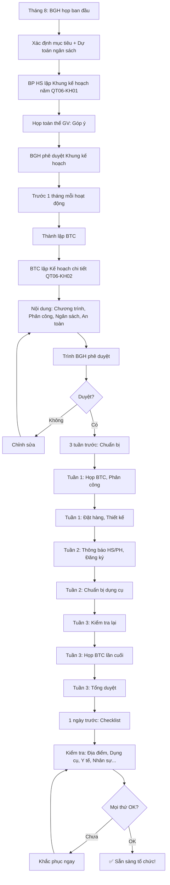

# SOP-04.1: LẬP KẾ HOẠCH HOẠT ĐỘNG

## 1. THÔNG TIN QUY TRÌNH

| **Thuộc tính** | **Nội dung** |
|---|---|
| Mã SOP | SOP-04.1 |
| Tên quy trình | Lập kế hoạch hoạt động ngoại khóa |
| Quy trình cha | SOP-04: Hoạt động ngoại khóa |
| Phiên bản | 1.0 |
| Tần suất | Đầu năm học, Đầu HK |

## 2. MỤC ĐÍCH

- **Có kế hoạch rõ ràng**: Biết tổ chức hoạt động gì, Khi nào
- **Phân bổ nguồn lực**: Ngân sách, Nhân lực hợp lý
- **Phù hợp mục tiêu**: Hoạt động phục vụ giáo dục HS
- **Tuân thủ quy định**: Đảm bảo an toàn, Pháp lý

## 3. PHẠM VI ÁP DỤNG

Tất cả hoạt động ngoại khóa của trường

## 4. PHÂN LOẠI HOẠT ĐỘNG NGOẠI KHÓA

### 4.1. 6 loại chính

```
╔══════════════════════════════════════════════════════════════════╗
║          6 LOẠI HOẠT ĐỘNG NGOẠI KHÓA                             ║
╠══════════════════════════════════════════════════════════════════╣
║ 1. HOẠT ĐỘNG VĂN HÓA - NGHỆ THUẬT                                ║
║    • Ngày hội văn hóa, Biểu diễn văn nghệ                        ║
║    • Triển lãm tranh, Thủ công mỹ nghệ                           ║
║    • Tần suất: 2-3 lần/năm                                       ║
╠══════════════════════════════════════════════════════════════════╣
║ 2. HOẠT ĐỘNG THỂ THAO                                            ║
║    • Ngày hội thể thao, Giải bóng đá/bóng rổ...                 ║
║    • Marathon, Yoga, Aerobic...                                  ║
║    • Tần suất: 1-2 lần/HK                                        ║
╠══════════════════════════════════════════════════════════════════╣
║ 3. HOẠT ĐỘNG TRẢ I NGHIỆM - THAM QUAN                            ║
║    • Dã ngoại, Cắm trại                                          ║
║    • Tham quan bảo tàng, Nhà máy, Công viên...                   ║
║    • Tần suất: 2-3 lần/năm                                       ║
╠══════════════════════════════════════════════════════════════════╣
║ 4. HOẠT ĐỘNG XÃ HỘI - TỪ THIỆN                                   ║
║    • Thăm trẻ mồ côi, Người già                                  ║
║    • Quyên góp sách vở, Quần áo...                               ║
║    • Dọn dẹp môi trường, Trồng cây                               ║
║    • Tần suất: 1-2 lần/HK                                        ║
╠══════════════════════════════════════════════════════════════════╣
║ 5. HOẠT ĐỘNG KHOA HỌC - STEM                                     ║
║    • Hội thi khoa học kỹ thuật                                   ║
║    • Robotics, Coding, Science Fair...                           ║
║    • Tần suất: 1 lần/năm                                         ║
╠══════════════════════════════════════════════════════════════════╣
║ 6. HOẠT ĐỘNG TRUYỀN THỐNG - LỄ HỘI                               ║
║    • Khai giảng, Kết nạp Đội, Lễ tốt nghiệp                      ║
║    • Trung thu, Tết, 20/11, 8/3...                               ║
║    • Tần suất: Theo lịch năm                                     ║
╚══════════════════════════════════════════════════════════════════╝
```

### 4.2. Theo quy mô

| **Quy mô** | **Mô tả** | **Số HS** | **Ngân sách** | **Thời gian chuẩn bị** |
|---|---|---|---|---|
| **Cấp lớp** | Trong 1 lớp | 20-30 | 500K-2M | 1 tuần |
| **Cấp khối** | Cả khối (VD: Tất cả lớp 3) | 100-150 | 5M-10M | 2 tuần |
| **Cấp trường** | Toàn trường | 300-500 | 20M-50M | 1 tháng |
| **Liên trường** | Nhiều trường cùng tổ chức | 500+ | 50M+ | 2-3 tháng |

## 5. QUY TRÌNH LẬP KẾ HOẠCH

### 5.1. Giai đoạn 1: Khởi động (Tháng 8)

**Bước 1: BGH họp ban đầu**

```
Nội dung họp:
1. Xác định mục tiêu năm học:
   • Phát triển kỹ năng sống cho HS
   • Tăng cường tinh thần tập thể
   • Giáo dục truyền thống, Đạo đức...
   
2. Dự toán ngân sách:
   • Tổng ngân sách hoạt động ngoại khóa: ____M
   • Phân bổ: 
     - Văn hóa - Nghệ thuật: 30%
     - Thể thao: 25%
     - Trải nghiệm: 20%
     - Xã hội - Từ thiện: 10%
     - STEM: 10%
     - Truyền thống: 5%
     
3. Phân công:
   • Phó HT phụ trách: _______
   • BP HS chủ trì
```

**Bước 2: BP HS lập Khung kế hoạch năm (QT06-KH01)**

```
═══════════════════════════════════════════════════════
   KHUNG KẾ HOẠCH HOẠT ĐỘNG NGOẠI KHÓA NĂM HỌC ____
═══════════════════════════════════════════════════════

I. MỤC TIÊU:
• [Mục tiêu 1]
• [Mục tiêu 2]
...

II. DANH SÁCH HOẠT ĐỘNG DỰ KIẾN:

Tháng 9:
• Lễ khai giảng (05/09) - Cấp trường - 30M
• Ngày hội STEM (Tuần 3) - Cấp khối - 5M

Tháng 10:
• Ngày hội Phụ nữ Việt Nam (20/10) - Cấp trường - 5M
• Tham quan bảo tàng (Tuần 4) - Cấp khối - 3M

Tháng 11:
• Ngày Nhà giáo Việt Nam (20/11) - Cấp trường - 10M
• Giải bóng đá nội bộ (Cả tháng) - Cấp trường - 8M

Tháng 12:
• Noel (24/12) - Cấp trường - 15M

Tháng 1:
• Tết (Âm lịch) - Cấp trường - 20M

...

TỔNG: ____ hoạt động, Ngân sách: ____M

BP HS ký: __________  Phó HT ký: __________
═══════════════════════════════════════════════════════
```

**Bước 3: Họp toàn thể GV (Tuần 2 tháng 8)**

```
Phó HT trình bày Khung kế hoạch
→ GV đóng góp ý kiến
→ Bổ sung, Điều chỉnh
→ BGH phê duyệt
```

### 5.2. Giai đoạn 2: Lập kế hoạch chi tiết (Trước 1 tháng mỗi hoạt động)

**Bước 4: Thành lập Ban tổ chức (BTC)**

```
VD: Hoạt động "Ngày hội thể thao" (Tháng 11)

BTC bao gồm:
• Trưởng ban: Phó HT
• Phó ban: Trưởng BP HS
• Thành viên:
  - GV Thể dục (2 người)
  - GVCN đại diện (3 người)
  - Y tế (1 người)
  - Kỹ thuật (1 người)
  - Hậu cần (2 người)
```

**Bước 5: BTC lập Kế hoạch chi tiết (QT06-KH02)**

```
═══════════════════════════════════════════════════════
    KẾ HOẠCH CHI TIẾT HOẠT ĐỘNG
    "NGÀY HỘI THỂ THAO NĂM HỌC 2024-2025"
═══════════════════════════════════════════════════════

I. THÔNG TIN CHUNG:
• Tên hoạt động: Ngày hội thể thao
• Thời gian: 08h00-16h00, Ngày 15/11/2024
• Địa điểm: Sân vận động trường
• Đối tượng: Toàn trường (500 HS)
• Ngân sách: 15,000,000đ

II. MỤC TIÊU:
• Rèn luyện sức khỏe, Tinh thần đồng đội
• Khám phá tài năng thể thao
• Tăng cường kết nối HS - GV - PH

III. NỘI DUNG:

A. CHƯƠNG TRÌNH:
08h00-08h30: Khai mạc (Phát biểu HT, Đồng diễn)
08h30-11h30: Thi đấu (Chạy, Nhảy xa, Bóng đá...)
11h30-13h00: Nghỉ trưa
13h00-15h30: Thi đấu tiếp
15h30-16h00: Trao giải, Bế mạc

B. MÔN THI ĐẤU:

| Môn | Đối tượng | Số HS | Giải thưởng |
|-----|-----------|-------|-------------|
| Chạy 100m | TH+THCS | 50 | 3 giải/khối |
| Nhảy xa | TH+THCS | 40 | 3 giải/khối |
| Bóng đá | THCS | 80 (8 đội) | 3 giải |
| Kéo co | TH | 100 (10 đội) | 3 giải |
| ... | ... | ... | ... |

C. PHÂN CÔNG:

| Nhiệm vụ | Người phụ trách | Deadline |
|----------|-----------------|----------|
| Thiết kế sân | GV Thể dục A | 10/11 |
| Chuẩn bị dụng cụ | GV Thể dục B | 12/11 |
| Làm huy hiệu | GV Mỹ thuật | 10/11 |
| Âm thanh, MC | GV Âm nhạc | 14/11 |
| Y tế | Cô Y tế | 15/11 |
| Ăn uống | Hậu cần | 15/11 |
| ... | ... | ... |

IV. NGÂN SÁCH CHI TIẾT:

| Khoản chi | Số lượng | Đơn giá | Thành tiền |
|-----------|----------|---------|------------|
| Huy hiệu | 500 | 10,000 | 5,000,000 |
| Giải thưởng | 30 | 100,000 | 3,000,000 |
| Nước uống | 500 | 5,000 | 2,500,000 |
| Thuê âm thanh | 1 | 2,000,000 | 2,000,000 |
| Dụng cụ | - | - | 1,500,000 |
| Dự phòng | - | - | 1,000,000 |
| **TỔNG** | | | **15,000,000** |

V. AN TOÀN:
• Y tế sẵn sàng (Xe cấp cứu)
• Bảo vệ túc trực
• Bảo hiểm tai nạn cho HS
• Phương án mưa: Hoãn sang 22/11

VI. TRUYỀN THÔNG:
• Thông báo PH: 01/11
• Poster tại trường: 05/11
• Facebook/Website: 07/11

Trưởng BTC ký: __________
Phó HT duyệt: __________
═══════════════════════════════════════════════════════
```

**Bước 6: Trình BGH phê duyệt (Trước 3 tuần)**

```
BGH xem xét:
• Nội dung phù hợp?
• Ngân sách hợp lý?
• An toàn đảm bảo?

→ Phê duyệt hoặc Yêu cầu chỉnh sửa
```

### 5.3. Giai đoạn 3: Chuẩn bị (3 tuần trước sự kiện)

**Bước 7: Họp BTC (Tuần 1)**

```
Nội dung:
• Chia sẻ Kế hoạch chi tiết cho tất cả thành viên
• Mỗi người nhận nhiệm vụ cụ thể
• Thống nhất Timeline, Deadline
• Tạo Group chat (Zalo/Telegram) để liên lạc nhanh
```

**Bước 8: Thực hiện theo Timeline**

```
Tuần 1 (3 tuần trước):
□ Đặt hàng: Huy hiệu, Giải thưởng
□ Liên hệ: Thuê âm thanh
□ Thiết kế: Poster, Banner

Tuần 2 (2 tuần trước):
□ Thông báo HS, PH
□ Đăng ký tham gia
□ Chuẩn bị dụng cụ

Tuần 3 (1 tuần trước):
□ Kiểm tra lại mọi thứ
□ Họp BTC lần cuối
□ Tổng duyệt (Nếu cần)
```

**Bước 9: Kiểm tra Checklist (1 ngày trước)**

```
CHECKLIST NGÀY HỘI THỂ THAO:

□ Địa điểm:
  □ Sân đã vạch line
  □ Khán đài đã dọn sạch
  □ Loa, Micro đã test
  
□ Dụng cụ:
  □ Bóng đá: 5 quả
  □ Cờ xuất phát: 10 cái
  □ Băng kéo co: 2 sợi
  □ Huy hiệu: 500 cái
  
□ Giải thưởng: 30 phần (Đã mua)
  
□ Nước uống: 500 chai (Đã đặt)

□ Y tế:
  □ Thuốc men đầy đủ
  □ Cáng (Nếu cần)
  □ Xe cấp cứu sẵn sàng
  
□ Nhân sự:
  □ Tất cả BTC đã rõ nhiệm vụ
  □ Trọng tài: 10 người
  □ Bảo vệ: 5 người
  
□ Truyền thông:
  □ Photographer: 2 người
  □ Live stream: Có

NGƯỜI KIỂM TRA: __________
```

## 6. CÁC YẾU TỐ QUAN TRỌNG

### 6.1. Mục tiêu SMART

```
MỖI HOẠT ĐỘNG PHẢI CÓ MỤC TIÊU SMART:

S - Specific (Cụ thể):
"Tăng cường sức khỏe cho HS"
→ Cụ thể hơn: "100% HS tham gia ít nhất 1 môn thể thao"

M - Measurable (Đo lường được):
"HS vui vẻ"
→ Đo lường: "≥90% HS đánh giá hài lòng trong khảo sát"

A - Achievable (Khả thi):
"Tổ chức Olympic"
→ Không khả thi! → "Tổ chức Giải thể thao nội bộ"

R - Relevant (Phù hợp):
Mục tiêu hoạt động phải phù hợp với mục tiêu giáo dục tổng thể

T - Time-bound (Có thời hạn):
"Tổ chức trong tháng 11"
→ Cụ thể: "Ngày 15/11/2024, 8h-16h"
```

### 6.2. An toàn trên hết

```
╔══════════════════════════════════════════════════════════════════╗
║             CHECKLIST AN TOÀN (Bắt buộc!)                        ║
╠══════════════════════════════════════════════════════════════════╣
║ □ Đánh giá rủi ro (Risk Assessment):                             ║
║   • Nguy cơ: Té ngã, Đuối nước, Lạc...                           ║
║   • Biện pháp phòng ngừa: Giám sát, Rào chắn...                  ║
╠══════════════════════════════════════════════════════════════════╣
║ □ Bảo hiểm tai nạn:                                              ║
║   • Mua bảo hiểm cho TẤT CẢ HS tham gia                          ║
║   • Đặc biệt: Hoạt động nguy hiểm (Leo núi, Bơi...)              ║
╠══════════════════════════════════════════════════════════════════╣
║ □ Y tế sẵn sàng:                                                 ║
║   • Cô/Chú Y tế có mặt                                           ║
║   • Thuốc men đầy đủ                                             ║
║   • Xe cấp cứu/Số điện thoại BV gần nhất                         ║
╠══════════════════════════════════════════════════════════════════╣
║ □ Giám sát chặt chẽ:                                             ║
║   • Tỷ lệ GV/HS: 1/10 (Hoạt động thường)                         ║
║   • Tỷ lệ GV/HS: 1/5 (Hoạt động nguy hiểm)                       ║
╠══════════════════════════════════════════════════════════════════╣
║ □ Phương án dự phòng:                                            ║
║   • Mưa bão: Hoãn hoặc Chuyển trong nhà                          ║
║   • Tai nạn: Quy trình cấp cứu                                   ║
║   • Mất tích: Quy trình tìm kiếm                                 ║
╚══════════════════════════════════════════════════════════════════╝
```

### 6.3. Tính toán ngân sách

```
CÔNG THỨC DỰ TOÁN:

Tổng ngân sách = Chi phí cố định + Chi phí biến đổi + Dự phòng

CHI PHÍ CỐ ĐỊNH (Không phụ thuộc số HS):
• Thuê địa điểm
• Thuê âm thanh, Ánh sáng
• Giải thưởng
• Trang trí
• ...

CHI PHÍ BIẾN ĐỔI (Phụ thuộc số HS):
• Ăn uống: __đ × Số HS
• Huy hiệu: __đ × Số HS
• Vận chuyển: __đ × Số HS
• ...

DỰ PHÒNG: 10-15% tổng chi phí
(Cho trường hợp phát sinh!)

VD: Ngân sách = 10M + 5M + 2M = 17M
```

## 7. LƯU ĐỒ QUY TRÌNH



## 8. BIỂU MẪU LIÊN QUAN

| **Mã** | **Tên** |
|---|---|
| QT06-KH01 | Khung kế hoạch hoạt động ngoại khóa năm |
| QT06-KH02 | Kế hoạch chi tiết từng hoạt động |
| QT06-CL08 | Checklist chuẩn bị hoạt động |

## 9. TIÊU CHUẨN VÀ CHỈ TIÊU

| **Chỉ tiêu** | **Mục tiêu** |
|---|---|
| Có Khung kế hoạch năm (Đầu năm học) | 100% |
| Kế hoạch chi tiết (Trước 1 tháng mỗi hoạt động) | 100% |
| BGH phê duyệt đúng hạn | 100% |
| Hoạt động diễn ra đúng kế hoạch | ≥ 90% |

## 10. TRÁCH NHIỆM CỤ THỂ

| **Vai trò** | **Trách nhiệm** |
|---|---|
| **BGH** | Phê duyệt kế hoạch, Phân bổ ngân sách |
| **BP HS** | Lập Khung kế hoạch năm, Điều phối các hoạt động |
| **BTC** | Lập Kế hoạch chi tiết, Tổ chức thực hiện |
| **GV** | Tham gia BTC, Hỗ trợ tổ chức |

## 11. LƯU Ý QUAN TRỌNG

- ⚠️ **An toàn trên hết**: Không hy sinh an toàn vì hoành tráng!
- ✅ **Dự phòng**: Luôn có Plan B (Mưa, Tai nạn...)!
- 🔥 **Tham gia rộng rãi**: Cố gắng TẤT CẢ HS được tham gia!
- ✅ **Báo cáo sau hoạt động**: Để rút kinh nghiệm lần sau!

## 12. PHỤ LỤC

### 12.1. Mẫu thông báo HS/PH

```
═══════════════════════════════════════════════════════
        THÔNG BÁO HOẠT ĐỘNG NGOẠI KHÓA
        "NGÀY HỘI THỂ THAO"
═══════════════════════════════════════════════════════

Kính gửi: Quý Phụ huynh và Các em học sinh

Trường ________ tổ chức "Ngày hội thể thao"

• Thời gian: 08h00-16h00, Ngày 15/11/2024
• Địa điểm: Sân vận động trường
• Đối tượng: Toàn trường

Nội dung:
• Thi đấu: Chạy, Nhảy xa, Bóng đá, Kéo co...
• Trao giải thưởng
• Ăn trưa tại trường (Miễn phí)

YÊU CẦU HS:
• Mặc đồng phục thể thao
• Mang giày thể thao
• Mang nước uống

YÊU CẦU PH:
• Đồng ý cho con tham gia (Ký phiếu dưới đây)
• PH có thể đến cổ vũ (Khu vực khán giả)

Hạn đăng ký: 08/11/2024

Trân trọng,
Ban Giám hiệu

---PHIẾU ĐĂNG KÝ---
Con em: ___________ Lớp: ____
□ Đồng ý tham gia
□ Không tham gia (Lý do: _______)

PH ký: __________
═══════════════════════════════════════════════════════
```

### 12.2. Top 10 lỗi thường gặp khi lập kế hoạch

```
❌ LỖI 1: Không có mục tiêu rõ ràng
   → Hoạt động "Để vui" → Không hiệu quả!
   
❌ LỖI 2: Ngân sách không thực tế (Quá cao hoặc Quá thấp)
   → Thiếu tiền giữa chừng!
   
❌ LỖI 3: Không tính đến an toàn
   → Tai nạn xảy ra!
   
❌ LỖI 4: Quá tham vọng (Làm quá nhiều việc!)
   → Không kịp chuẩn bị!
   
❌ LỖI 5: Không có Plan B (Mưa, Tai nạn...)
   → Hoãn đột xuất → HS, PH thất vọng!
   
❌ LỖI 6: Phân công không rõ ràng
   → Ai cũng tưởng người khác làm!
   
❌ LỖI 7: Deadline không thực tế (Quá gấp!)
   → BTC stress, Chất lượng kém!
   
❌ LỖI 8: Không thông báo sớm cho HS/PH
   → HS không chuẩn bị, PH không sắp xếp!
   
❌ LỖI 9: Không kiểm tra Checklist
   → Thiếu dụng cụ giữa chừng!
   
❌ LỖI 10: Không đánh giá sau hoạt động
   → Lần sau lặp lại sai lầm!
```

## 13. FAQ

**Q1: Hoạt động ngoại khóa có bắt buộc không?**  
A: 
- Hoạt động trong giờ học (VD: Tham quan liên quan bài học) → BẮT BUỘC!
- Hoạt động ngoài giờ (VD: Cắm trại cuối tuần) → TỰ NGUYỆN!

**Q2: PH không đồng ý cho con tham gia. Xử lý thế nào?**  
A: 
- Tôn trọng quyết định PH
- HS không tham gia → Ở lớp (Có GV trông)
- Hoặc PH đón về (Nếu hoạt động cả ngày)

**Q3: Ngân sách không đủ. Có nên cắt giảm an toàn không?**  
A: KHÔNG! An toàn = Không thể cắt!
- Cắt ở phần khác: Ít trang trí, Giải thưởng nhỏ hơn...
- Hoặc Huy hoạt động (Không đủ an toàn → Không tổ chức!)

**Q4: Mưa to, Hoãn hay Tổ chức trong nhà?**  
A: Tùy hoạt động:
- Thể thao ngoài trời → Hoãn!
- Văn nghệ → Chuyển vào hội trường!

---

**PHÊ DUYỆT**

| Trưởng BP HS | Phó HT | Hiệu trưởng |
|---|---|---|
| [Họ tên] | [Họ tên] | [Họ tên] |
