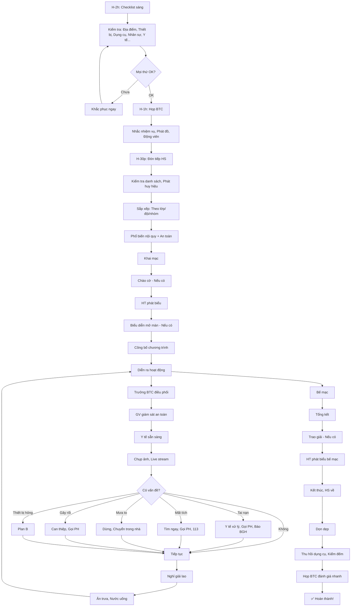

# SOP-04.2: TỔ CHỨC HOẠT ĐỘNG

## 1. THÔNG TIN QUY TRÌNH

| **Thuộc tính** | **Nội dung** |
|---|---|
| Mã SOP | SOP-04.2 |
| Tên quy trình | Tổ chức hoạt động ngoại khóa |
| Quy trình cha | SOP-04: Hoạt động ngoại khóa |
| Phiên bản | 1.0 |
| Áp dụng | Trong ngày diễn ra hoạt động |

## 2. MỤC ĐÍCH

- **Thực hiện đúng kế hoạch**: Mọi thứ diễn ra như dự kiến
- **Đảm bảo an toàn**: Không có tai nạn
- **Tạo trải nghiệm tốt**: HS vui vẻ, Học được điều gì đó
- **Xử lý tình huống**: Linh hoạt khi có vấn đề

## 3. PHẠM VI ÁP DỤNG

Tất cả hoạt động ngoại khóa trong ngày diễn ra

## 4. CHUẨN BỊ TRƯỚC GIỜ G

### 4.1. Checklist buổi sáng (H-2 giờ)

```
╔══════════════════════════════════════════════════════════════════╗
║         CHECKLIST SÁNG NGÀY TỔ CHỨC (VD: 6h sáng)                ║
╠══════════════════════════════════════════════════════════════════╣
║ TRƯỞNG BTC ĐẾN TRƯỜNG, KIỂM TRA:                                 ║
║                                                                  ║
║ □ 1. ĐỊA ĐIỂM:                                                   ║
║     □ Sân/Phòng đã dọn sạch?                                     ║
║     □ Bàn ghế đã bày đúng vị trí?                                ║
║     □ Trang trí đã hoàn thành?                                   ║
║     □ Banner, Poster đã treo?                                    ║
╠══════════════════════════════════════════════════════════════════╣
║ □ 2. THIẾT BỊ:                                                   ║
║     □ Micro, Loa test OK?                                        ║
║     □ Máy chiếu hoạt động?                                       ║
║     □ Đèn, Quạt, Điều hòa OK?                                    ║
╠══════════════════════════════════════════════════════════════════╣
║ □ 3. DỤNG CỤ:                                                    ║
║     □ Đếm lại: Đủ số lượng?                                      ║
║     □ Xếp gọn, Dễ lấy?                                           ║
╠══════════════════════════════════════════════════════════════════╣
║ □ 4. NHÂN SỰ:                                                    ║
║     □ Gọi điện xác nhận: Tất cả có mặt?                          ║
║     □ Ai vắng → Tìm người thay ngay!                             ║
╠══════════════════════════════════════════════════════════════════╣
║ □ 5. Y TẾ:                                                       ║
║     □ Cô/Chú Y tế có mặt?                                        ║
║     □ Thuốc men, Băng bó đầy đủ?                                 ║
║     □ Xe cấp cứu/Số BV đã lưu?                                   ║
╠══════════════════════════════════════════════════════════════════╣
║ □ 6. ĂN UỐNG (Nếu có):                                           ║
║     □ Nước uống đã về?                                           ║
║     □ Thức ăn đặt đúng giờ?                                      ║
╠══════════════════════════════════════════════════════════════════╣
║ □ 7. TRUYỀN THÔNG:                                               ║
║     □ Photographer sẵn sàng?                                     ║
║     □ Thiết bị live stream OK?                                   ║
╚══════════════════════════════════════════════════════════════════╝

NẾU TẤT CẢ ✅ → SẴN SÀNG!
NẾU CÓ ❌ → KHẮC PHỤC NGAY!
```

### 4.2. Họp BTC (H-1 giờ)

```
VD: Hoạt động 8h → Họp 7h

Nội dung:
1. Trưởng BTC: Nhắc lại nhiệm vụ từng người
2. Phát đồ: Áo BTC, Bảng tên, Walkie-talkie (Nếu có)
3. Nhắc nhở:
   • Mỉm cười, Thân thiện với HS
   • Giữ trật tự
   • Báo ngay nếu có vấn đề
4. Động viên: "Chúc mọi người thành công!"
```

## 5. QUY TRÌNH TỔ CHỨC

### 5.1. Đón tiếp (H-30 phút)

**Bước 1: Đón HS đến (VD: 7:30)**

```
Bố trí:
• Cổng trường: Bảo vệ + 2 GV
  → Kiểm tra: HS có trong danh sách?
  → Phát: Huy hiệu/Vòng tay (Để nhận diện)
  
• Khu tập trung: GVCN điểm danh lớp
  → Đủ HS chưa? Ai vắng?
  → Gọi PH của HS vắng (Hỏi tại sao?)
```

**Bước 2: Sắp xếp (VD: 7:30-7:50)**

```
Tùy loại hoạt động:

A. Hoạt động TĨNH (Văn nghệ, Hội thảo...):
   → HS ngồi theo lớp (Khu vực đã phân)
   
B. Hoạt động ĐỘNG (Thể thao, Trò chơi...):
   → HS tập trung theo đội
   
C. Hoạt động TRẢI NGHIỆM (Tham quan...):
   → Chia nhóm 20-30 HS/nhóm, Mỗi nhóm có 2 GV
```

**Bước 3: Phổ biến nội quy (VD: 7:50-8:00)**

```
Trưởng BTC (hoặc MC) thông báo:

"Các em chào các thầy cô và Các bạn!

Hôm nay chúng ta có [Tên hoạt động].

NỘI QUY:
1. Giữ trật tự, Không ồn ào
2. Nghe theo hướng dẫn của GV
3. Không rời khỏi khu vực (Nếu cần đi → Xin phép GV)
4. Giữ vệ sinh (Rác bỏ đúng nơi)
5. Giúp đỡ bạn bè

AN TOÀN:
• Nếu em thấy không khỏe → Báo GV ngay!
• Nếu em bị thương → Đến Khu Y tế (Chỉ vị trí)

Chúc các em vui vẻ!"
```

### 5.2. Khai mạc (VD: 8:00-8:30)

**Bước 4: Nghi thức chào cờ (Nếu có)**

```
• Toàn thể đứng nghiêm
• Hát Quốc ca
• Chào cờ
```

**Bước 5: Phát biểu khai mạc**

```
TRÌNH TỰ:

1. MC giới thiệu:
   "Kính thưa Quý Thầy Cô, Các em học sinh!
    Ngày hôm nay, Chúng ta tham gia [Tên hoạt động]!
    
    Mời Thầy Hiệu trưởng phát biểu!"

2. HT phát biểu (5-7 phút):
   • Chào mừng
   • Ý nghĩa hoạt động
   • Kỳ vọng
   • Chúc thành công

3. MC: "Cảm ơn Thầy Hiệu trưởng!"

4. Phần biểu diễn mở màn (Nếu có):
   • Đồng diễn
   • Ca múa nhạc...
```

**Bước 6: Công bố chương trình**

```
MC:
"Chương trình hôm nay:
 • 8:30-11:30: [Hoạt động A]
 • 11:30-13:00: Nghỉ trưa
 • 13:00-15:30: [Hoạt động B]
 • 15:30-16:00: Trao giải, Bế mạc
 
 Giờ chúng ta bắt đầu!"
```

### 5.3. Diễn ra hoạt động (VD: 8:30-15:30)

**Bước 7: Điều phối chung**

```
TRƯỞNG BTC:
• Ngồi ở vị trí trung tâm (Nhìn toàn cảnh)
• Quan sát:
  - Hoạt động có đúng tiến độ?
  - HS có vui vẻ?
  - Có vấn đề gì?
• Liên lạc: Walkie-talkie hoặc Điện thoại
• Xử lý vấn đề ngay (Xem mục 5.4)

CÁC THÀNH VIÊN BTC:
• Làm đúng nhiệm vụ được giao
• Báo Trưởng BTC nếu có vấn đề
• Hỗ trợ lẫn nhau
```

**Bước 8: Giám sát an toàn**

```
GV GIÁM SÁT:
• Luân chuyển: Không đứng 1 chỗ!
• Quan sát: HS có bất thường?
  - Mệt, Choáng, Khóc...
  - Gây gổ, Đánh nhau...
• Can thiệp ngay khi cần!

Y TẾ:
• Sẵn sàng tại Khu Y tế
• Tuần tra (Nếu hoạt động rộng)
• Ghi nhận: Có bao nhiêu trường hợp?
  (QT06-F32 - Sổ Y tế)
```

**Bước 9: Chụp ảnh, Ghi hình**

```
PHOTOGRAPHER:
• Chụp các khoảnh khắc đẹp
• Đa dạng: HS, GV, BGH, Toàn cảnh...
• Tránh: Chụp HS trong tư thế xấu!

LIVE STREAM (Nếu có):
• Streaming trên Facebook/YouTube
• Cho PH ở nhà xem
• MC bình luận sinh động
```

**Bước 10: Nghỉ giải lao (VD: 11:30-13:00)**

```
TRƯỞNG BTC thông báo:
"Các em nghỉ trưa! 
 • Ăn trưa tại [Địa điểm]
 • 13h tập trung lại đúng giờ nhé!"

TỔ CHỨC:
• HS xếp hàng lấy cơm (Nếu tự phục vụ)
• Hoặc GV phát suất ăn
• Nước uống: Để tự do lấy

GV TRỰC:
• Giữ trật tự
• Đảm bảo: Tất cả HS đều có đồ ăn
```

### 5.4. Xử lý tình huống

**A. Tai nạn, HS bị thương**

```
BƯỚC 1: Dừng hoạt động ngay (Khu vực đó)
BƯỚC 2: Y tế đến ngay
BƯỚC 3: Sơ cứu:
  • Nhẹ (Trầy da...) → Băng bó tại chỗ
  • Nặng (Gãy chân...) → ĐƯA BV NGAY!
BƯỚC 4: Gọi PH (Trong 10 phút)
BƯỚC 5: Báo BGH
BƯỚC 6: Ghi nhận (QT06-BB03 - Biên bản tai nạn)
BƯỚC 7: Tiếp tục hoạt động (Khu vực khác)
```

**B. HS mất tích**

```
⚠️ CỰC KỲ NGHIÊM TRỌNG!

BƯỚC 1: Xác nhận: HS thật sự mất tích?
  • Hỏi bạn: "Bạn A đâu?"
  • Kiểm tra: WC, Y tế, Các góc...
  
BƯỚC 2: Nếu không tìm thấy (Trong 15 phút):
  → BÁO NGAY BGH + TRƯỞNG BTC
  
BƯỚC 3: Phân công tìm kiếm:
  • Nhóm 1: Tìm trong trường
  • Nhóm 2: Tìm ngoài cổng
  • Nhóm 3: Xem camera (Nếu có)
  
BƯỚC 4: Gọi PH (Ngay lập tức)
  "Con [Tên] hiện không thấy. Quý PH có biết không?"
  
BƯỚC 5: Nếu vẫn không tìm thấy (30 phút):
  → GỌI 113!
  
BƯỚC 6: Khi tìm thấy:
  • Kiểm tra sức khỏe
  • Hỏi: Em đi đâu?
  • Báo PH: Đã tìm thấy!
  • Xử lý: Tùy tình huống
```

**C. Mưa to (Hoạt động ngoài trời)**

```
KẾ HOẠCH:
• Mưa nhỏ: Tiếp tục (Phát áo mưa)
• Mưa vừa: Tạm dừng (Chờ tạnh)
• Mưa to + Sấm sét: DỪNG NGAY!
  → Di chuyển vào trong nhà
  → Hoặc Hoãn hoạt động

THÔNG BÁO:
MC: "Các em, Do trời mưa, Chúng ta tạm dừng.
     Di chuyển vào Hội trường!"
```

**D. HS gây rối (Đánh nhau, La hét...)**

```
BƯỚC 1: GV can thiệp ngay
  • Tách rời (Nếu đánh nhau)
  • Nhắc nhở: "Em giữ trật tự!"
  
BƯỚC 2: Nếu vẫn gây rối:
  → Đưa ra khỏi khu vực
  → Giao cho GVCN xử lý
  → Gọi PH đến đón (Nếu nghiêm trọng)
  
BƯỚC 3: Ghi nhận (QT06-BB04 - Biên bản vi phạm)
```

**E. Thiết bị hỏng (Loa, Micro...)**

```
PLAN B:
• Loa hỏng → Dùng loa dự phòng (Đã chuẩn bị!)
• Micro hỏng → Hô to (Hoặc Dùng loa cầm tay)
• Máy chiếu hỏng → In tài liệu phát cho HS

NGUYÊN TẮC: Hoạt động vẫn tiếp tục!
(Không để thiết bị hỏng → Hủy hoạt động!)
```

### 5.5. Bế mạc (VD: 15:30-16:00)

**Bước 11: Tổng kết**

```
MC:
"Kính thưa Quý Thầy Cô, Các em!
 
 Chúng ta đã trải qua 1 ngày vui vẻ!
 
 KẾT QUẢ:
 • [Số liệu: VD 500 HS tham gia]
 • [Thành tích: VD 30 giải thưởng]
 • ...
 
 Giờ chúng ta mời Thầy HT trao giải!"
```

**Bước 12: Trao giải (Nếu có)**

```
TRÌNH TỰ:
1. MC đọc danh sách: "Giải Nhất: Lớp 5A!"
2. HS lên nhận (Vỗ tay)
3. HT/Phó HT trao: Giấy khen + Quà
4. Chụp ảnh lưu niệm
5. HS về chỗ
6. Tiếp tục giải khác...
```

**Bước 13: Phát biểu bế mạc**

```
HT:
"Các em đã tham gia rất tốt!
 Thầy rất vui!
 
 Các em về nhà nghỉ ngơi!
 Hẹn gặp lại vào thứ 2!
 
 Chúc các em khỏe mạnh!"
```

**Bước 14: Kết thúc**

```
MC:
"Xin trân trọng cảm ơn!
 Chúc Quý Thầy Cô và Các em về nhà an toàn!"

[Vỗ tay]

→ Hoạt động kết thúc!
```

### 5.6. Dọn dẹp (Sau khi HS về)

**Bước 15: Thu dọn**

```
BTC:
□ Thu hồi: Dụng cụ, Thiết bị
□ Kiểm đếm: Mất gì không?
□ Dọn dẹp: Rác, Sân, Ghế...
□ Trả lại: Đồ thuê (Loa, Bàn...)
□ Thanh toán: Hóa đơn (Nếu có)

THỜI GIAN: ~1 giờ
```

**Bước 16: Họp BTC đánh giá nhanh (15 phút)**

```
Trưởng BTC:
"Hôm nay mọi người làm tốt!
 
 ĐIỂM TỐT:
 • [VD: Tất cả đến đúng giờ]
 • [VD: Không có tai nạn]
 
 ĐIỂM CẦN CẢI THIỆN:
 • [VD: Loa hơi nhỏ]
 • [VD: Nghỉ trưa hơi lâu]
 
 Lần sau chúng ta sẽ cải thiện!
 Cảm ơn mọi người!"
```

## 6. LƯU ĐỒ QUY TRÌNH



## 7. BIỂU MẪU LIÊN QUAN

| **Mã** | **Tên** |
|---|---|
| QT06-F32 | Sổ Y tế (Ghi nhận tai nạn) |
| QT06-BB03 | Biên bản tai nạn |
| QT06-BB04 | Biên bản vi phạm (Trong hoạt động) |

## 8. TIÊU CHUẨN VÀ CHỈ TIÊU

| **Chỉ tiêu** | **Mục tiêu** |
|---|---|
| Hoạt động bắt đầu đúng giờ | 100% |
| Tỷ lệ tai nạn | 0% (Mục tiêu!) |
| Tỷ lệ HS hài lòng (Khảo sát sau) | ≥ 90% |
| Hoạt động kết thúc đúng giờ | ≥ 90% |

## 9. TRÁCH NHIỆM CỤ THỂ

| **Vai trò** | **Trách nhiệm** |
|---|---|
| **Trưởng BTC** | Điều phối chung, Xử lý vấn đề |
| **Thành viên BTC** | Thực hiện nhiệm vụ được giao |
| **GV giám sát** | Giữ trật tự, Đảm bảo an toàn |
| **Y tế** | Xử lý tai nạn, Chăm sóc HS ốm |
| **MC** | Dẫn chương trình, Thông báo |

## 10. LƯU Ý QUAN TRỌNG

- ⚠️ **An toàn LUÔN ưu tiên số 1**: Có vấn đề → Dừng hoạt động ngay!
- ✅ **Linh hoạt**: Kế hoạch = Tham khảo! Thực tế có thể khác!
- 🔥 **Giữ liên lạc**: BTC phải liên lạc được với nhau mọi lúc!
- ✅ **Ghi nhận mọi thứ**: Ảnh, Video, Biên bản... Để báo cáo sau!

## 11. PHỤ LỤC

### 11.1. Kịch bản MC (Mẫu)

```
═══════════════════════════════════════════════════════
      KỊCH BẢN MC - NGÀY HỘI THỂ THAO
═══════════════════════════════════════════════════════

8:00 - KHAI MẠC

MC: 
"Kính chào Quý Thầy Cô!
 Chào các em học sinh thân mến!
 
 Hôm nay, Ngày 15 tháng 11 năm 2024,
 Trường [Tên] tổ chức 'Ngày hội thể thao'!
 
 [Dừng, Vỗ tay]
 
 Có mặt hôm nay:
 • Thầy [Tên], Hiệu trưởng
 • Cô [Tên], Phó Hiệu trưởng
 • Quý Thầy Cô giáo
 • 500 em học sinh
 
 Chúng ta bắt đầu với nghi thức chào cờ!
 Toàn thể ĐỨNG NGHIÊM!"

[Chào cờ]

MC:
"Xin mời Thầy Hiệu trưởng phát biểu khai mạc!"

[HT phát biểu]

MC:
"Cảm ơn Thầy Hiệu trưởng!
 
 Giờ chúng ta có tiết mục đồng diễn
 Của các em khối Tiểu học!
 
 Xin mời!"

[Đồng diễn]

MC:
"Các em đồng diễn rất đẹp! Vỗ tay!
 
 Chương trình hôm nay:
 • 8:30-11:30: Thi đấu (Chạy, Nhảy, Bóng...)
 • 11:30-13:00: Nghỉ trưa
 • 13:00-15:30: Thi đấu tiếp
 • 15:30: Trao giải
 
 Chúc các em thi đấu vui vẻ!
 BẮT ĐẦU!"

...

15:30 - BẾ MẠC

MC:
"Kính thưa Quý Thầy Cô, Các em!
 
 Chúng ta đã có 1 ngày thi đấu sôi nổi!
 
 KẾT QUẢ:
 • 500 em tham gia
 • 10 môn thi đấu
 • 30 giải thưởng
 
 Giờ chúng ta trao giải!
 Xin mời Thầy Hiệu trưởng!"

[Trao giải]

MC:
"Xin mời Thầy HT phát biểu bế mạc!"

[HT phát biểu]

MC:
"Cảm ơn Thầy!
 
 'Ngày hội thể thao' đã thành công!
 
 Cảm ơn Quý Thầy Cô!
 Cảm ơn các em!
 Hẹn gặp lại!"

═══════════════════════════════════════════════════════
```

### 11.2. Các tín hiệu tay quan trọng

```
(Cho BTC sử dụng khi không có Walkie-talkie)

👍 = OK, Sẵn sàng
👎 = Có vấn đề
✋ = Dừng lại
👉 = Đi đến đó
🙆 = Đã xong
⏰ = Hết giờ, Nhanh lên
```

## 12. FAQ

**Q1: MC bị ốm đột ngột. Ai thay?**  
A: Phó MC (Đã chuẩn bị sẵn!) thay ngay!
Luôn có Plan B cho VAI TRÒ QUAN TRỌNG!

**Q2: HS không chịu về (Sau khi kết thúc). Xử lý?**  
A: 
- Thông báo rõ: "Hoạt động đã hết! Các em về nhà!"
- Gọi PH đến đón
- GV không về cho đến khi HS cuối cùng được đón!

**Q3: Có quá nhiều vấn đề (Mưa + Tai nạn + Thiết bị hỏng...). Có nên hủy giữa chừng không?**  
A: 
- Đánh giá: Có thể tiếp tục an toàn không?
- Nếu KHÔNG an toàn → HỦY! (Thông báo HS, Gọi PH đón)
- Nếu CÒN an toàn → Tiếp tục (Nhưng rút ngắn nếu cần)

**Q4: PH phàn nàn hoạt động không hay. Xử lý?**  
A: 
- Lắng nghe, Ghi nhận
- Giải thích (Nếu có hiểu lầm)
- Cảm ơn góp ý
- Cải thiện lần sau!

---

**PHÊ DUYỆT**

| Trưởng BTC | Phó HT | Hiệu trưởng |
|---|---|---|
| [Họ tên] | [Họ tên] | [Họ tên] |
