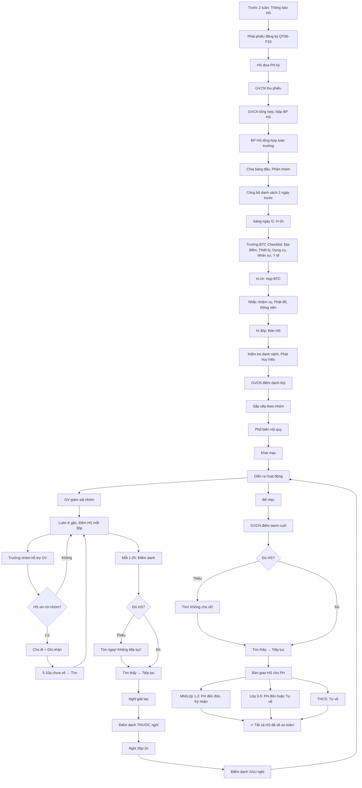

# SOP-04.3: QUẢN LÝ HỌC SINH THAM GIA

## 1. THÔNG TIN QUY TRÌNH

| **Thuộc tính** | **Nội dung** |
|---|---|
| Mã SOP | SOP-04.3 |
| Tên quy trình | Quản lý học sinh tham gia hoạt động ngoại khóa |
| Quy trình cha | SOP-04: Hoạt động ngoại khóa |
| Phiên bản | 1.0 |
| Áp dụng | Trước, Trong và Sau hoạt động |

## 2. MỤC ĐÍCH

- **Đăng ký chính xác**: Biết bao nhiêu HS tham gia
- **Điểm danh đầy đủ**: Không để HS mất tích
- **Phân nhóm hợp lý**: Dễ quản lý, Dễ điều phối
- **Đánh giá tham gia**: Ghi nhận cho hồ sơ HS

## 3. PHẠM VI ÁP DỤNG

Tất cả hoạt động ngoại khóa có HS tham gia

## 4. QUY TRÌNH ĐĂNG KÝ

### 4.1. Phân loại hoạt động theo tính chất

```
╔══════════════════════════════════════════════════════════════════╗
║           PHÂN LOẠI THEO TÍNH CHẤT THAM GIA                      ║
╠══════════════════════════════════════════════════════════════════╣
║ LOẠI A: BẮT BUỘC (Mandatory)                                     ║
║  • Tất cả HS phải tham gia                                       ║
║  • VD: Khai giảng, Chào cờ thứ 2, Thi HK...                      ║
║  • Không cần đăng ký (Mặc định 100% HS)                          ║
╠══════════════════════════════════════════════════════════════════╣
║ LOẠI B: TỰ NGUYỆN (Voluntary)                                    ║
║  • HS tự do chọn tham gia/Không                                  ║
║  • VD: Dã ngoại, Cắm trại, Tham quan...                          ║
║  • CẦN đăng ký (Để biết số lượng)                                ║
╠══════════════════════════════════════════════════════════════════╣
║ LOẠI C: TUYỂN CHỌN (Selective)                                   ║
║  • Chỉ HS đạt tiêu chí mới được tham gia                         ║
║  • VD: Đội tuyển thể thao, Đội văn nghệ...                       ║
║  • CẦN đăng ký + Thi tuyển                                       ║
╚══════════════════════════════════════════════════════════════════╝
```

### 4.2. Quy trình đăng ký (Loại B, C)

**Bước 1: Thông báo (Trước 2 tuần)**

```
GVCN thông báo lớp:
"Các em, Ngày 15/11 trường tổ chức Ngày hội thể thao!
 
 Ai muốn tham gia → Đăng ký!
 Cô phát phiếu, Về đưa PH ký!"

[Phát phiếu QT06-F33]
```

**Phiếu đăng ký (QT06-F33):**

```
═══════════════════════════════════════════════════════
      PHIẾU ĐĂNG KÝ HOẠT ĐỘNG NGOẠI KHÓA
      "NGÀY HỘI THỂ THAO"
═══════════════════════════════════════════════════════

Họ tên HS: _______________  Lớp: ____

□ Đăng ký tham gia
□ Không tham gia (Lý do: ______)

Nếu tham gia, Đăng ký thi đấu môn:
□ Chạy 100m
□ Nhảy xa
□ Bóng đá
□ Kéo co
□ Khác: ______

THÔNG TIN Y TẾ (Quan trọng!):
• Con có bệnh mãn tính không? □ Có: ____ □ Không
• Con có dị ứng gì không? □ Có: ____ □ Không
• Con đang dùng thuốc gì không? _______________

CAM KẾT CỦA PH:
• Tôi đồng ý cho con tham gia
• Con em đủ sức khỏe tham gia
• Tôi chịu trách nhiệm nếu con có vấn đề sức khỏe

PH ký: __________  Ngày: __/__/____

GVCN ký nhận: __________
═══════════════════════════════════════════════════════
```

**Bước 2: Thu phiếu (1 tuần trước)**

```
GVCN:
• Thu phiếu từ HS
• Kiểm tra: PH đã ký chưa?
  - Chưa → Nhắc HS đưa PH ký!
• Tổng hợp: Lớp có bao nhiêu HS tham gia?
```

**Bước 3: GVCN nộp BP HS (5 ngày trước)**

**Bước 4: BP HS tổng hợp toàn trường**

```
Tạo Danh sách tổng (Excel):

STT | Họ tên | Lớp | Giới | Môn đăng ký | Ghi chú Y tế
----|--------|------|------|-------------|-------------
  1 | Nguyễn VA | 5A | Nam | Chạy 100m | Không
  2 | Trần Thị B | 5A | Nữ | Nhảy xa | Hen suyễn
...

TỔNG HỢP:
• Tổng HS đăng ký: ____
• Chạy 100m: ____ HS
• Nhảy xa: ____ HS
...

→ Phân bổ: Mỗi môn bao nhiêu vòng thi?
```

**Bước 5: Chia bảng đấu (3 ngày trước)**

```
VD: Chạy 100m có 50 HS đăng ký

CHIA:
• Vòng loại: 5 bảng × 10 HS
  → Mỗi bảng chọn 2 HS vào Bán kết
• Bán kết: 2 bảng × 5 HS
  → Mỗi bảng chọn 3 HS vào Chung kết
• Chung kết: 6 HS
  → Chọn 3 giải: Nhất, Nhì, Ba
```

**Bước 6: Công bố danh sách, Bảng đấu (2 ngày trước)**

- Dán tại trường
- Đăng Website/App
- Gửi cho GVCN

## 5. ĐIỂM DANH TRONG HOẠT ĐỘNG

### 5.1. Điểm danh đầu (Trước khi bắt đầu)

**Bước 7: GVCN điểm danh lớp (VD: 7:30)**

```
GVCN gọi tên:
"Nguyễn Văn A!"
HS: "Dạ!" [Giơ tay]

[Ghi: Có mặt]

"Trần Thị B!"
[Không trả lời]

[Gọi PH ngay!]
```

**Bước 8: GVCN báo cáo Trưởng BTC (7:50)**

```
GVCN: "Lớp 5A: 25/26 HS. Vắng: Bạn B (Ốm)"
Trưởng BTC: "OK, Cảm ơn cô!"

[Ghi nhận: Tổng có mặt]
```

### 5.2. Điểm danh liên tục (Trong hoạt động)

**Mỗi 1-2 giờ: GV giám sát kiểm tra**

```
GV: [Đếm HS trong khu vực]
"Nhóm 1: 30 HS → OK!
 Nhóm 2: 28 HS → Thiếu 2?
 
 [Hỏi HS:] Ai biết 2 bạn đâu?"
 
HS: "Dạ, Đi vệ sinh ạ!"
GV: "À, OK!"

[5 phút sau, 2 bạn về]
→ Đủ 30 HS! ✅
```

### 5.3. Điểm danh cuối (Trước khi về)

**Bước 9: GVCN điểm danh lại (VD: 15:45)**

```
QUAN TRỌNG! PHẢI ĐIỂM DANH!

GVCN:
• Gọi tên tất cả HS (Như sáng)
• Nếu đủ → OK, Cho về!
• Nếu thiếu → TÌM NGAY! (Không cho ai về cả!)
```

**Bước 10: Bàn giao HS cho PH (16:00)**

```
Tùy tuổi:

MẦM NON + LỚP 1-2:
• PH BẮT BUỘC đến đón
• GVCN gọi tên HS → PH đến nhận → Bàn giao
• PH ký: "Đã nhận con" (QT06-F34)

LỚP 3-5:
• PH đón hoặc Cho con về 1 mình (Nếu PH đăng ký)
• HS về 1 mình → GVCN ghi lại: "Đã cho về lúc __h__"

THCS:
• Tự về (Không cần PH đón)
• Nhưng: GVCN phải đảm bảo tất cả HS đã ra khỏi trường!
```

## 6. PHÂN NHÓM VÀ QUẢN LÝ

### 6.1. Nguyên tắc phân nhóm

```
╔══════════════════════════════════════════════════════════════════╗
║              NGUYÊN TẮC PHÂN NHÓM                                ║
╠══════════════════════════════════════════════════════════════════╣
║ 1. SỐ LƯỢNG HỢP LÝ:                                              ║
║    • Hoạt động thường: 20-30 HS/nhóm                             ║
║    • Hoạt động nguy hiểm (Leo núi...): 10-15 HS/nhóm             ║
║    • Mầm non: 10-15 HS/nhóm (Nhỏ, Cần chăm sóc nhiều)           ║
╠══════════════════════════════════════════════════════════════════╣
║ 2. CÂN BẰNG NĂNG LỰC:                                            ║
║    • Mỗi nhóm có: Giỏi + Khá + TB + Yếu                          ║
║    • Tránh: Nhóm toàn giỏi, Nhóm toàn yếu                        ║
╠══════════════════════════════════════════════════════════════════╣
║ 3. TRỘN LỚP:                                                     ║
║    • Mỗi nhóm có HS từ nhiều lớp (Tạo kết nối!)                  ║
║    • Trừ khi: Thi đấu theo lớp                                   ║
╠══════════════════════════════════════════════════════════════════╣
║ 4. CÓ TRƯỞNG NHÓM:                                               ║
║    • Chọn HS Lớn, Có khả năng lãnh đạo                           ║
║    • Nhiệm vụ: Điểm danh, Giữ trật tự, Báo GV khi có vấn đề      ║
╚══════════════════════════════════════════════════════════════════╝
```

### 6.2. Công cụ quản lý

**A. Huy hiệu màu (Color-coded badges)**

```
Mỗi nhóm 1 màu:
• Nhóm 1: Huy hiệu ĐỎ
• Nhóm 2: Huy hiệu XANH
• Nhóm 3: Huy hiệu VÀNG
...

Lợi ích:
• Nhìn là biết HS thuộc nhóm nào!
• Dễ tìm nếu HS lạc!
• Tạo tinh thần đội nhóm!
```

**B. Danh sách nhóm (Laminating)**

```
Mỗi GV giám sát cầm 1 danh sách (Ép plastic, Chống nước):

┌─────────────────────────────────────────────────┐
│         NHÓM 1 - MÀU ĐỎ                         │
│         GV: Nguyễn Thị X, SĐT: 0912-xxx-xxx    │
├─────┬───────────────┬──────┬──────┬────────────┤
│ STT │ Họ tên        │ Lớp  │ Giới │ Ghi chú    │
├─────┼───────────────┼──────┼──────┼────────────┤
│  1  │ Nguyễn Văn A  │ 5A   │ Nam  │ Trưởng nhóm│
│  2  │ Trần Thị B    │ 5B   │ Nữ   │ Hen suyễn  │
│ ... │               │      │      │            │
│ 25  │ Lê Văn Z      │ 5D   │ Nam  │            │
├─────┴───────────────┴──────┴──────┴────────────┤
│ ĐIỂM DANH: Sáng [  ] Chiều [  ]                │
└─────────────────────────────────────────────────┘
```

**C. Vòng tay số (Wristbands)**

```
Ngoài huy hiệu màu, Mỗi HS đeo vòng tay có:
• Tên HS
• Lớp
• Nhóm (Màu)
• SĐT GV giám sát

Lợi ích:
• Nếu HS lạc → Người lạ nhìn vòng tay → Gọi GV!
• Y tế dễ xác định HS (Khi cấp cứu)
```

## 7. QUY TRÌNH TRONG HOẠT ĐỘNG

### 7.1. Giám sát nhóm

**Bước 1: GV luôn ở gần nhóm**

```
GV KHÔNG ĐƯỢC:
❌ Ngồi xa (Nói chuyện với GV khác)
❌ Chơi điện thoại
❌ Để HS tự do (Không giám sát)

GV PHẢI:
✅ Đi cùng nhóm
✅ Đếm HS định kỳ (Mỗi 30 phút)
✅ Quan sát: Ai mệt? Ai khỏe?
✅ Can thiệp khi cần
```

**Bước 2: Trưởng nhóm hỗ trợ GV**

```
GV giao nhiệm vụ:
"Bạn A (Trưởng nhóm), Bạn giúp cô:
 • Điểm danh bạn (Đầu giờ, Sau giờ nghỉ)
 • Nhắc bạn giữ trật tự
 • Báo cô nếu ai không khỏe"
```

**Bước 3: Liên lạc với Trưởng BTC**

```
GV báo cáo (Mỗi 1 giờ):
"Nhóm 1: OK, 25/25 HS!"

Hoặc:
"Nhóm 2: Có vấn đề! Bạn B bị thương!"
→ Trưởng BTC điều phối Y tế đến ngay!
```

### 7.2. Xử lý khi HS rời nhóm

**Bước 4: HS xin phép rời nhóm (Đi vệ sinh, Mua nước...)**

```
HS: "Cô ơi, Em xin phép đi vệ sinh!"
GV: "Đi! Nhớ về ngay nhé!"

[Ghi nhận: Bạn A đi vệ sinh lúc 9:30]

[10 phút sau, Bạn A chưa về]
GV: [Gọi điện BTC] "Bạn A đi vệ sinh 10 phút chưa về!"
BTC: "Cô chờ! Tôi gửi người đi tìm!"

[Tìm thấy: Bạn A bị lạc đường]
→ Dẫn về nhóm!
```

**Nguyên tắc:**
```
✅ Cho HS rời nhóm (Nếu cần)
✅ Nhưng GHI LẠI: Ai đi, Lúc mấy giờ
✅ Kiểm tra: 5-10 phút chưa về → Đi tìm!
```

### 7.3. Nghỉ giải lao

**Bước 5: Điểm danh TRƯỚC nghỉ**

```
GV: "Giờ chúng ta nghỉ 30 phút!
     Trước khi nghỉ, Cô điểm danh!
     
     [Gọi tên]
     
     Đủ 25 em! OK!
     
     Các em đi nghỉ! 10h về tập trung đúng chỗ này nhé!"
```

**Bước 6: Điểm danh SAU nghỉ**

```
10h:
GV: "Giờ chúng ta tập trung lại!
     
     [Đếm HS]
     
     Thiếu 2 em! Bạn C và D đâu?"

[Tìm kiếm...]

→ NGUYÊN TẮC: Đủ HS mới tiếp tục!
```

## 8. PHÂN CÔNG NHIỆM VỤ

### 8.1. Ma trận trách nhiệm

| **Vai trò** | **Trước hoạt động** | **Trong hoạt động** | **Sau hoạt động** |
|---|---|---|---|
| **Trưởng BTC** | Checklist, Họp BTC | Điều phối chung | Họp đánh giá |
| **GV giám sát** | Nhận danh sách nhóm | Giám sát 1 nhóm, Điểm danh | Bàn giao HS cho PH |
| **Y tế** | Chuẩn bị thuốc | Sẵn sàng cấp cứu | Báo cáo tình hình |
| **Hậu cần** | Chuẩn bị đồ ăn/uống | Phát đồ ăn | Thu hồi, Dọn dẹp |
| **Trọng tài** | Học luật thi đấu | Điều khiển thi đấu | - |
| **MC** | Chuẩn bị kịch bản | Dẫn chương trình | - |

### 8.2. Ví dụ phân công cụ thể

```
NGÀY HỘI THỂ THAO - 500 HS:

• Trưởng BTC: Phó HT A (Điều phối chung)
• Phó BTC: Trưởng BP HS (Hỗ trợ)

• GV giám sát: 20 người (Mỗi người 1 nhóm 25 HS)
  - Nhóm 1: Cô X
  - Nhóm 2: Thầy Y
  ...

• Y tế: 2 người (Cô Y1 + Cô Y2)
  - Vị trí: Lều Y tế (Giữa sân)
  
• Trọng tài: 10 người (GV Thể dục + GV tình nguyện)
  - Chạy 100m: 2 trọng tài
  - Nhảy xa: 2 trọng tài
  ...

• Hậu cần: 5 người
  - Ăn uống: 3 người
  - Dụng cụ: 2 người

• MC: 2 người (MC1 + MC2 dự phòng)

• Photographer: 2 người

• Bảo vệ: 5 người (Các cổng, Khu vực)
```

## 9. LƯU ĐỒ QUY TRÌNH



## 10. BIỂU MẪU LIÊN QUAN

| **Mã** | **Tên** |
|---|---|
| QT06-F33 | Phiếu đăng ký tham gia hoạt động |
| QT06-F34 | Phiếu bàn giao HS cho PH (MN/Lớp 1-2) |
| QT06-CL09 | Checklist điểm danh hoạt động |

## 11. TIÊU CHUẨN VÀ CHỈ TIÊU

| **Chỉ tiêu** | **Mục tiêu** |
|---|---|
| Tỷ lệ HS đăng ký đúng hạn | ≥ 95% |
| Tỷ lệ điểm danh chính xác | 100% |
| Tỷ lệ HS mất tích | 0% |
| Tỷ lệ bàn giao HS an toàn cho PH | 100% |

## 12. TRÁCH NHIỆM CỤ THỂ

| **Vai trò** | **Trách nhiệm** |
|---|---|
| **BP HS** | Tổng hợp đăng ký, Phân nhóm |
| **GVCN** | Phát phiếu, Thu phiếu, Điểm danh lớp |
| **GV giám sát** | Giám sát 1 nhóm, Điểm danh liên tục |
| **Trưởng nhóm (HS)** | Hỗ trợ GV, Điểm danh, Giữ trật tự |

## 13. LƯU Ý QUAN TRỌNG

- ⚠️ **Điểm danh LIÊN TỤC**: Không chỉ 1 lần! Mỗi 1-2 giờ phải điểm danh!
- ✅ **Bàn giao rõ ràng**: Không để HS "Tự về" khi chưa có PH (MN, Lớp 1-2)!
- 🔥 **Giám sát sát**: GV PHẢI ở gần HS, Không để HS một mình!
- ✅ **Ghi chú Y tế**: Biết HS nào hen, Dị ứng... → Chăm sóc tốt hơn!

## 14. PHỤ LỤC

### 14.1. Case study: Hoạt động Tham quan Bảo tàng

```
════════════════════════════════════════════════════════
CASE STUDY: THAM QUAN BẢO TÀNG LỊCH SỬ
════════════════════════════════════════════════════════

ĐỐI TƯỢNG: Lớp 5 (120 HS)
THỜI GIAN: 8h-15h, Thứ 7

CHUẨN BỊ:
1. Đăng ký:
   • 2 tuần trước: Phát phiếu
   • 1 tuần trước: Thu phiếu
   • Kết quả: 115/120 HS đăng ký

2. Phân nhóm:
   • 115 HS → 5 nhóm × 23 HS
   • Mỗi nhóm: 2 GV giám sát + 1 Trưởng nhóm
   • Màu: Đỏ, Xanh, Vàng, Tím, Cam

3. Thuê xe:
   • 3 xe 45 chỗ (45+45+45 = 135 chỗ > 115 HS + 10 GV)

TỔ CHỨC:
7h30: HS tập trung trường
      • GVCN điểm danh: 115/115 ✅
      • Phát huy hiệu, Vòng tay
      
8h00: Lên xe
      • Nhóm Đỏ + Vàng → Xe 1
      • Nhóm Xanh + Tím → Xe 2
      • Nhóm Cam + GV, BTC → Xe 3
      • GV điểm danh trên xe!
      
9h00: Đến Bảo tàng
      • Điểm danh xuống xe: 115/115 ✅
      • Vào Bảo tàng theo nhóm (Giãn cách 5 phút/nhóm)
      
9h15: Tham quan
      • Nhóm Đỏ đi trước, GV X + Y giám sát
      • GV X cầm danh sách, Đếm HS liên tục
      • HS được tự do xem (Trong tầm mắt GV!)
      
10h30: Nghỉ giải lao (Sảnh Bảo tàng)
      • Điểm danh TRƯỚC nghỉ: 23/23 ✅
      • Ăn nhẹ, Uống nước
      • Điểm danh SAU nghỉ: 23/23 ✅
      
11h00: Tham quan tiếp

12h00: Về trường
      • Điểm danh lên xe: 115/115 ✅
      • Về đến trường: Điểm danh xuống xe: 115/115 ✅
      
12h30: Ăn trưa tại trường

13h30: PH đón
      • GVCN bàn giao từng em
      • PH ký nhận
      
15h00: HS cuối cùng về → Kết thúc! ✅

KẾT QUẢ:
✅ Không có tai nạn
✅ Không có HS mất tích
✅ 98% HS hài lòng (Khảo sát sau)
════════════════════════════════════════════════════════
```

### 14.2. Checklist GV giám sát

```
GV CẦM DANH SÁCH, KIỂM TRA:

□ Sáng (Trước hoạt động):
  □ Đếm HS: Đủ ____ em?
  □ Ai vắng? Đã gọi PH?
  □ Ai ốm? (Ghi chú Y tế)

□ Trong hoạt động (Mỗi 30 phút):
  □ Đếm HS: Vẫn đủ?
  □ Ai mệt, Khỏe? → Cho nghỉ
  □ Ai rời nhóm? Lý do gì?

□ Nghỉ giải lao:
  □ Điểm danh TRƯỚC nghỉ
  □ Điểm danh SAU nghỉ

□ Cuối hoạt động:
  □ Điểm danh lần cuối
  □ Đủ rồi → Bàn giao PH

LƯU Ý: KHÔNG BAO GIỜ bỏ qua điểm danh!
```

## 15. FAQ

**Q1: HS xin không tham gia (Vì ngại, Sợ...). Có nên ép không?**  
A: 
- Hoạt động bắt buộc (A) → Giải thích, Động viên, Vẫn phải tham gia!
- Hoạt động tự nguyện (B) → Không ép! Tôn trọng!

**Q2: Trong hoạt động, HS xin về sớm (Do ốm). Xử lý?**  
A: 
1. Y tế khám
2. Nếu thật sự ốm → Gọi PH đến đón
3. PH đến → Bàn giao, Ký biên bản (QT06-F35)
4. Cập nhật danh sách (HS đã về)

**Q3: PH đến muộn đón con (Sau khi hoạt động kết thúc 1 giờ). Xử lý?**  
A: 
- GV ở lại chờ (Không bỏ HS!)
- Gọi PH liên tục
- Nhắc nhở: "Quý PH về lấy con đi ạ! Cô phải về rồi!"
- Lần sau: Nhắc PH đến đúng giờ!

**Q4: Chia nhóm xong, HS xin chuyển nhóm (Muốn chơi với bạn). Cho không?**  
A: 
- Xem xét: Nếu chuyển không ảnh hưởng (Số HS vẫn cân bằng) → OK!
- Nếu ảnh hưởng → Giải thích, Từ chối nhẹ nhàng!

---

**PHÊ DUYỆT**

| Trưởng BP HS | Phó HT | Hiệu trưởng |
|---|---|---|
| [Họ tên] | [Họ tên] | [Họ tên] |
