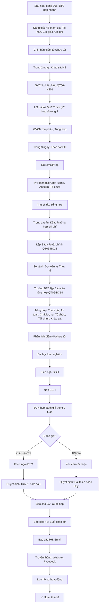

# SOP-04.4: ĐÁNH GIÁ VÀ BÁO CÁO

## 1. THÔNG TIN QUY TRÌNH

| **Thuộc tính** | **Nội dung** |
|---|---|
| Mã SOP | SOP-04.4 |
| Tên quy trình | Đánh giá và báo cáo hoạt động ngoại khóa |
| Quy trình cha | SOP-04: Hoạt động ngoại khóa |
| Phiên bản | 1.0 |
| Áp dụng | Sau mỗi hoạt động |

## 2. MỤC ĐÍCH

- **Đánh giá hiệu quả**: Hoạt động có đạt mục tiêu?
- **Rút kinh nghiệm**: Điểm tốt phát huy, Điểm xấu sửa
- **Báo cáo BGH**: Minh bạch, Có căn cứ
- **Cải tiến**: Lần sau tổ chức tốt hơn

## 3. PHẠM VI ÁP DỤNG

Tất cả hoạt động ngoại khóa đã tổ chức

## 4. QUY TRÌNH ĐÁNH GIÁ

### 4.1. Đánh giá ngay (Trong ngày)

**Bước 1: BTC họp nhanh (Sau hoạt động 30 phút)**

```
Trưởng BTC:
"Chúng ta đánh giá nhanh nhé!

CÁC CHỈ SỐ:
• Số HS tham gia: ____/____  (___%)
• Số tai nạn: ____ (Mục tiêu: 0!)
• Hoạt động kết thúc: __h__ (Đúng/Muộn/Sớm?)
• Chi phí: ____đ (Đúng/Vượt dự toán?)

ĐIỂM TỐT:
• [VD: Tất cả HS vui vẻ]
• [VD: Không có tai nạn]
• [VD: Đúng giờ]

ĐIỂM CHƯA TỐT:
• [VD: Loa hơi nhỏ]
• [VD: Trọng tài thiếu kinh nghiệm]

HÀNH ĐỘNG:
• Lần sau: Thuê loa lớn hơn
• Đào tạo trọng tài trước

OK! Cảm ơn mọi người!"

[Ghi lại → Báo cáo chính thức]
```

### 4.2. Khảo sát HS (Trong 2 ngày)

**Bước 2: GVCN phát phiếu khảo sát (QT06-KS01)**

```
═══════════════════════════════════════════════════════
      PHIẾU KHẢO SÁT HỌC SINH
      Hoạt động: "NGÀY HỘI THỂ THAO"
═══════════════════════════════════════════════════════

Họ tên: _______________  Lớp: ____

1. Em có tham gia hoạt động không?
   □ Có    □ Không (Tại sao? ________)

2. Em cảm thấy hoạt động thế nào?
   □ Rất vui (5 ⭐)
   □ Vui (4 ⭐)
   □ Bình thường (3 ⭐)
   □ Không vui (2 ⭐)
   □ Rất không vui (1 ⭐)

3. Em thích phần nào nhất?
   □ Thi đấu
   □ Trao giải
   □ Ăn uống
   □ Khác: ________

4. Em không thích phần nào?
   _______________________________

5. Em học được gì từ hoạt động?
   □ Tinh thần đội nhóm
   □ Rèn luyện sức khỏe
   □ Kỹ năng thể thao
   □ Làm quen bạn mới
   □ Khác: ________

6. Em có muốn tham gia lần sau không?
   □ Có    □ Không

7. Góp ý khác:
   _______________________________________________
   _______________________________________________

Cảm ơn em! ❤️
═══════════════════════════════════════════════════════
```

**Bước 3: Thu phiếu, Tổng hợp**

```
GVCN tổng hợp (Excel):
• Tổng phiếu: ____
• Rất vui (5⭐): ____ (___%)
• Vui (4⭐): ____ (___%)
• Bình thường (3⭐): ____ (___%)
• Không vui (2⭐): ____ (___%)
• Rất không vui (1⭐): ____ (___%)

→ Điểm trung bình: ____/5

• Muốn tham gia lần sau: ____% (Mục tiêu: ≥85%)
```

### 4.3. Khảo sát PH (Trong 3 ngày)

**Bước 4: Gửi khảo sát PH (Email/App)**

```
═══════════════════════════════════════════════════════
      KHẢO SÁT PHỤ HUYNH
      Hoạt động: "NGÀY HỘI THỂ THAO"
═══════════════════════════════════════════════════════

Kính gửi Quý PH,

Con quý vị: _______________  Lớp: ____

1. Con quý vị có tham gia không?
   □ Có    □ Không

2. Quý vị đánh giá hoạt động thế nào?
   □ Rất tốt (5⭐)
   □ Tốt (4⭐)
   □ Trung bình (3⭐)
   □ Kém (2⭐)
   □ Rất kém (1⭐)

3. Về AN TOÀN, Quý vị đánh giá:
   □ Rất an toàn (5⭐)
   □ An toàn (4⭐)
   □ Trung bình (3⭐)
   □ Không an toàn (2⭐)
   □ Rất nguy hiểm (1⭐)

4. Về TỔ CHỨC, Quý vị đánh giá:
   □ Rất tốt (5⭐)
   □ Tốt (4⭐)
   □ Trung bình (3⭐)
   □ Kém (2⭐)
   □ Rất kém (1⭐)

5. Quý vị có cho con tham gia lần sau không?
   □ Có    □ Không (Tại sao? ________)

6. Góp ý:
   _______________________________________________

Cảm ơn Quý vị!
═══════════════════════════════════════════════════════
```

**Bước 5: Tổng hợp khảo sát PH**

### 4.4. Tổng hợp chi phí (Trong 1 tuần)

**Bước 6: Kế toán tổng hợp (QT06-BC13)**

```
═══════════════════════════════════════════════════════
      BÁO CÁO TÀI CHÍNH HOẠT ĐỘNG
      "NGÀY HỘI THỂ THAO"
═══════════════════════════════════════════════════════

I. Dự TOÁN: 15,000,000đ

II. CHI THỰC TẾ:

| Khoản chi | Dự toán | Thực tế | Chênh lệch |
|-----------|---------|---------|------------|
| Huy hiệu | 5,000,000 | 4,800,000 | -200,000 |
| Giải thưởng | 3,000,000 | 3,200,000 | +200,000 |
| Nước uống | 2,500,000 | 2,600,000 | +100,000 |
| Âm thanh | 2,000,000 | 2,000,000 | 0 |
| Dụng cụ | 1,500,000 | 1,300,000 | -200,000 |
| Dự phòng | 1,000,000 | 800,000 | -200,000 |
| **TỔNG** | **15,000,000** | **14,700,000** | **-300,000** |

III. KẾT LUẬN:
✅ Tiết kiệm: 300,000đ (2% dự toán)
□ Vượt: ____đ

IV. GIẢI TRÌNH (Nếu vượt):
• _______________

Kế toán ký: __________  Trưởng BTC ký: __________
═══════════════════════════════════════════════════════
```

### 4.5. Lập báo cáo tổng hợp (Trong 1 tuần)

**Bước 7: Trưởng BTC lập Báo cáo (QT06-BC14)**

```
═══════════════════════════════════════════════════════
   BÁO CÁO TỔNG HỢP HOẠT ĐỘNG NGOẠI KHÓA
   "NGÀY HỘI THỂ THAO"
   Ngày: 15/11/2024
═══════════════════════════════════════════════════════

I. THÔNG TIN CHUNG:
• Tên hoạt động: Ngày hội thể thao
• Thời gian: 8h-16h, 15/11/2024
• Địa điểm: Sân vận động trường
• Đối tượng: Toàn trường
• BTC: 30 người

II. KẾT QUẢ THAM GIA:

| Cấp | Sĩ số | Đăng ký | Tham gia | Tỷ lệ |
|-----|-------|---------|----------|-------|
| MN | 100 | 95 | 92 | 92% |
| TH | 200 | 190 | 185 | 92.5% |
| THCS | 200 | 180 | 175 | 87.5% |
| **Tổng** | **500** | **465** | **452** | **90.4%** |

III. CHƯƠNG TRÌNH ĐÃ THỰC HIỆN:

[Liệt kê các hoạt động]
• Khai mạc: Đúng giờ ✅
• Thi đấu: 10 môn, 452 HS tham gia
• Trao giải: 30 giải
• Bế mạc: Đúng giờ ✅

IV. ĐÁNH GIÁ:

A. Điểm tốt:
• Tổ chức tốt, Đúng kế hoạch
• Không có tai nạn nghiêm trọng ✅
• HS vui vẻ, Hào hứng
• PH hài lòng

B. Điểm chưa tốt:
• Loa hơi nhỏ (Một số HS ngồi xa không nghe)
• Thời gian trao giải hơi lâu (45 phút → Nên 30 phút)
• 3 HS bị trầy da nhẹ (Đã băng bó)

V. KHẢO SÁT:

A. Học sinh (450 phiếu):
• Điểm TB: 4.5/5 ⭐
• Rất vui/Vui: 92%
• Muốn tham gia lần sau: 95%

B. Phụ huynh (200 phiếu):
• Điểm TB: 4.3/5 ⭐
• Hài lòng về An toàn: 88%
• Hài lòng về Tổ chức: 85%

VI. TÀI CHÍNH:
• Dự toán: 15,000,000đ
• Thực tế: 14,700,000đ
• Tiết kiệm: 300,000đ ✅

VII. HÌNH ẢNH:
• Ảnh: 250 ảnh
• Video: 2 video (Tổng 45 phút)
• Live stream: 3,000 views

VIII. BÀI HỌC KINH NGHIỆM:

A. Phát huy:
• Chuẩn bị kỹ → Không có sự cố lớn
• Phân công rõ → BTC làm việc tốt

B. Cải thiện:
• Lần sau: Thuê loa lớn hơn
• Rút ngắn thời gian trao giải
• Bổ sung: 1 Y tế nữa (2 người → 3 người)

IX. KIẾN NGHỊ:
• Đề nghị BGH duy trì hoạt động này hằng năm
• Tăng ngân sách lên 20M (Để giải thưởng hấp dẫn hơn)

Trưởng BTC ký: __________
Ngày: __/__/____
═══════════════════════════════════════════════════════
```

**Bước 8: Nộp BGH (Trong 1 tuần)**

**Bước 9: BGH họp đánh giá (Trong 2 tuần)**

```
Nội dung:
• Đọc báo cáo
• Thảo luận
• Khen ngợi BTC (Nếu tốt)
• Yêu cầu cải thiện (Nếu có vấn đề)
• Quyết định: Duy trì/Hủy hoạt động này năm sau
```

## 5. CHỈ TIÊU ĐÁNH GIÁ

### 5.1. 6 nhóm chỉ tiêu chính

```
╔══════════════════════════════════════════════════════════════════╗
║           6 NHÓM CHỈ TIÊU ĐÁNH GIÁ                               ║
╠══════════════════════════════════════════════════════════════════╣
║ 1. THAM GIA (Participation)                                      ║
║    • Tỷ lệ HS tham gia: Mục tiêu ≥85%                            ║
║    • Tỷ lệ PH hài lòng: Mục tiêu ≥80%                            ║
╠══════════════════════════════════════════════════════════════════╣
║ 2. AN TOÀN (Safety)                                              ║
║    • Số tai nạn: Mục tiêu 0                                      ║
║    • Số HS mất tích: Mục tiêu 0                                  ║
║    • Điểm an toàn (Khảo sát PH): Mục tiêu ≥4.0/5                 ║
╠══════════════════════════════════════════════════════════════════╣
║ 3. CHẤT LƯỢNG (Quality)                                          ║
║    • HS hài lòng: Mục tiêu ≥85%                                  ║
║    • HS học được điều gì: Mục tiêu ≥90% trả lời được             ║
║    • Muốn tham gia lần sau: Mục tiêu ≥85%                        ║
╠══════════════════════════════════════════════════════════════════╣
║ 4. TỔ CHỨC (Organization)                                        ║
║    • Bắt đầu đúng giờ: Mục tiêu 100%                             ║
║    • Đúng kế hoạch: Mục tiêu ≥90%                                ║
║    • Kết thúc đúng giờ: Mục tiêu ≥90%                            ║
╠══════════════════════════════════════════════════════════════════╣
║ 5. TÀI CHÍNH (Financial)                                         ║
║    • Không vượt dự toán: Mục tiêu 100%                           ║
║    • Minh bạch: Mục tiêu 100%                                    ║
╠══════════════════════════════════════════════════════════════════╣
║ 6. TÁC ĐỘNG (Impact)                                             ║
║    • HS thay đổi hành vi tích cực: Mục tiêu ≥30%                 ║
║    • HS phát triển kỹ năng: Mục tiêu ≥50%                        ║
╚══════════════════════════════════════════════════════════════════╝
```

### 5.2. Thang điểm tổng hợp

```
TÍNH ĐIỂM TỔNG HỢP HOẠT ĐỘNG (100 điểm):

1. Tham gia (20 điểm):
   • Tỷ lệ HS tham gia ≥85%: 10 điểm
   • Tỷ lệ PH hài lòng ≥80%: 10 điểm

2. An toàn (30 điểm):
   • Không tai nạn: 15 điểm
   • Không mất tích: 10 điểm
   • Điểm an toàn ≥4.0: 5 điểm

3. Chất lượng (25 điểm):
   • HS hài lòng ≥85%: 10 điểm
   • HS học được: 10 điểm
   • Muốn tham gia lại: 5 điểm

4. Tổ chức (15 điểm):
   • Đúng giờ: 5 điểm
   • Đúng kế hoạch: 10 điểm

5. Tài chính (10 điểm):
   • Không vượt dự toán: 10 điểm

───────────────────────────────────────────────────────
TỔNG: ____/100 điểm

ĐÁNH GIÁ:
• 90-100: Xuất sắc ⭐⭐⭐
• 80-89: Tốt ⭐⭐
• 70-79: Khá ⭐
• 60-69: Trung bình
• <60: Yếu (Cần cải thiện nghiêm túc!)
```

## 6. BÁO CÁO CHO CÁC BÊN LIÊN QUAN

### 6.1. Báo cáo nội bộ

**A. Báo cáo BGH (Trong 1 tuần):**
- Nội dung: Như mục 4.5
- Hình thức: Văn bản + Trình bày (Nếu BGH yêu cầu)

**B. Báo cáo GV (Trong 2 tuần):**
- Tại cuộc họp GV
- Chia sẻ: Bài học kinh nghiệm

**C. Báo cáo HS (Trong 1 tuần):**
- Tại buổi chào cờ
- Thông báo: Kết quả, Cảm ơn HS tham gia

### 6.2. Báo cáo bên ngoài

**A. Báo cáo PH:**
- Gửi email/App: Tóm tắt + Ảnh đẹp
- Cảm ơn PH đã hỗ trợ

**B. Báo cáo Sở GD (Nếu hoạt động lớn):**
- Gửi báo cáo chính thức
- Kèm ảnh, Video

**C. Truyền thông (Báo, Mạng xã hội):**
- Đăng bài viết
- Chia sẻ ảnh, Video
- Tăng uy tín trường!

## 7. LƯU ĐỒ QUY TRÌNH



## 8. BIỂU MẪU LIÊN QUAN

| **Mã** | **Tên** |
|---|---|
| QT06-KS01 | Phiếu khảo sát HS |
| QT06-KS02 | Phiếu khảo sát PH |
| QT06-BC13 | Báo cáo tài chính hoạt động |
| QT06-BC14 | Báo cáo tổng hợp hoạt động |

## 9. TIÊU CHUẨN VÀ CHỈ TIÊU

| **Chỉ tiêu** | **Mục tiêu** |
|---|---|
| Thời gian nộp báo cáo (Sau hoạt động) | ≤ 1 tuần |
| Tỷ lệ HS trả lời khảo sát | ≥ 90% |
| Tỷ lệ PH trả lời khảo sát | ≥ 40% |
| Điểm tổng hợp hoạt động | ≥ 80/100 |

## 10. TRÁCH NHIỆM CỤ THỂ

| **Vai trò** | **Trách nhiệm** |
|---|---|
| **Trưởng BTC** | Lập báo cáo tổng hợp, Trình BGH |
| **GVCN** | Khảo sát HS, Tổng hợp |
| **BP HS** | Khảo sát PH, Tổng hợp |
| **Kế toán** | Báo cáo tài chính |
| **BGH** | Đánh giá, Ra quyết định |

## 11. LƯU Ý QUAN TRỌNG

- ⚠️ **Trung thực**: Không che giấu điểm xấu! Báo cáo đúng sự thật!
- ✅ **Định lượng**: Dùng SỐ (%, Điểm...) chứ không "Có vẻ tốt"!
- 🔥 **Rút kinh nghiệm**: Mục đích báo cáo = Cải thiện lần sau!
- ✅ **Đúng hạn**: Báo cáo muộn → Không còn ý nghĩa!

## 12. PHỤ LỤC

### 12.1. So sánh hoạt động qua các năm

```
BẢNG SO SÁNH (3 năm):

| Năm | HS tham gia | Điểm HS | Điểm PH | Tai nạn | Chi phí | Tổng điểm |
|-----|-------------|---------|---------|---------|---------|-----------|
| 2022| 400 (80%)   | 4.2⭐   | 4.0⭐   | 1       | 12M     | 75/100    |
| 2023| 450 (90%)   | 4.4⭐   | 4.2⭐   | 0       | 14M     | 85/100    |
| 2024| 452 (90.4%) | 4.5⭐   | 4.3⭐   | 0       | 14.7M   | 88/100    |

NHẬN XÉT:
✅ Tham gia tăng: 80% → 90.4%
✅ Chất lượng tăng: 75 → 88 điểm
✅ An toàn tốt hơn: 1 tai nạn → 0
→ Hoạt động NGÀY CÀNG TỐT! Nên duy trì!
```

### 12.2. Mẫu thông báo kết quả

**Gửi HS (Buổi chào cờ):**

```
HT/MC:
"Tuần trước, Chúng ta đã tổ chức Ngày hội thể thao!

KẾT QUẢ:
• 452 em tham gia (90% toàn trường!)
• Không có tai nạn nghiêm trọng ✅
• Trao 30 giải thưởng

Trường RẤT VUI vì các em đã tham gia tích cực!

Đặc biệt, Trường CẢM ƠN:
• Ban tổ chức
• Quý Thầy Cô
• Các em học sinh

Hẹn gặp lại trong hoạt động tiếp theo!"
```

**Gửi PH (Email):**

```
═══════════════════════════════════════════════════════
Kính gửi Quý Phụ huynh,

Trường ________ xin báo cáo kết quả hoạt động
"NGÀY HỘI THỂ THAO" ngày 15/11/2024:

• 452 HS tham gia (90.4%)
• Không có tai nạn nghiêm trọng
• 92% HS hài lòng
• 85% PH hài lòng

Trường xin cảm ơn Quý PH đã hỗ trợ!

Xem ảnh, Video tại: [Link]

Trân trọng,
Ban Giám hiệu
═══════════════════════════════════════════════════════
```

## 13. FAQ

**Q1: Hoạt động thất bại (HS không vui, Nhiều tai nạn...). Có nên che giấu trong báo cáo không?**  
A: KHÔNG! Phải báo cáo trung thực!
- Giải thích nguyên nhân
- Đưa ra giải pháp
- Cam kết cải thiện
- Xin lỗi BGH, HS, PH (Nếu cần)

**Q2: PH phàn nàn trong khảo sát. Có nên trả lời không?**  
A: NÊN!
- Gọi điện PH
- Giải thích (Nếu có hiểu lầm)
- Xin lỗi (Nếu thật sự trường sai)
- Cam kết cải thiện

**Q3: BGH yêu cầu hủy hoạt động này năm sau (Do yếu). Xử lý?**  
A: 
- Tôn trọng quyết định BGH
- Nhưng: Đề xuất cải thiện thay vì Hủy!
- Nếu BGH vẫn muốn hủy → Tuân thủ!

**Q4: Báo cáo quá dài, BGH không đọc. Làm sao?**  
A: 
- Làm 2 phiên bản:
  - Bản TÓM TẮT (2-3 trang) → Trình BGH
  - Bản ĐẦY ĐỦ (10-15 trang) → Lưu hồ sơ

---

**PHÊ DUYỆT**

| Trưởng BTC | Trưởng BP HS | Phó HT |
|---|---|---|
| [Họ tên] | [Họ tên] | [Họ tên] |
