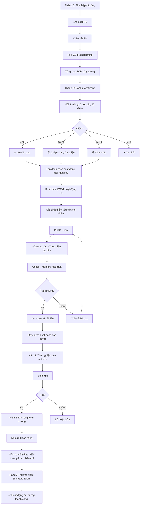

# SOP-04.5: PHÁT TRIỂN HOẠT ĐỘNG

## 1. THÔNG TIN QUY TRÌNH

| **Thuộc tính** | **Nội dung** |
|---|---|
| Mã SOP | SOP-04.5 |
| Tên quy trình | Phát triển hoạt động ngoại khóa |
| Quy trình cha | SOP-04: Hoạt động ngoại khóa |
| Phiên bản | 1.0 |
| Áp dụng | Liên tục |

## 2. MỤC ĐÍCH

- **Đổi mới**: Hoạt động hấp dẫn hơn, Không nhàm chán
- **Nâng cao chất lượng**: Tổ chức tốt hơn mỗi năm
- **Mở rộng**: Thêm hoạt động mới, Phù hợp xu hướng
- **Tối ưu**: Giảm chi phí, Tăng hiệu quả

## 3. PHẠM VI ÁP DỤNG

Tất cả hoạt động ngoại khóa của trường

## 4. NGUỒN Ý TƯỞNG MỚI

### 4.1. 7 nguồn

```
╔══════════════════════════════════════════════════════════════════╗
║              7 NGUỒN Ý TƯỞNG HOẠT ĐỘNG MỚI                       ║
╠══════════════════════════════════════════════════════════════════╣
║ 1. TỪ HỌC SINH                                                   ║
║    • Khảo sát: "Em muốn trường tổ chức hoạt động gì?"            ║
║    • Hòm thư góp ý                                               ║
║    • Hội đồng HS (Nếu có)                                        ║
╠══════════════════════════════════════════════════════════════════╣
║ 2. TỪ PHỤ HUYNH                                                  ║
║    • Họp PH: "Quý vị mong muốn gì?"                              ║
║    • Form góp ý online                                           ║
╠══════════════════════════════════════════════════════════════════╣
║ 3. TỪ GIÁO VIÊN                                                  ║
║    • GV đề xuất (Dựa trên kinh nghiệm)                           ║
║    • Họp GV: Brainstorming                                       ║
╠══════════════════════════════════════════════════════════════════╣
║ 4. TỪ TRƯỜNG KHÁC                                                ║
║    • Tham quan trường khác                                       ║
║    • Học tập mô hình tốt                                         ║
╠══════════════════════════════════════════════════════════════════╣
║ 5. TỪ XU HƯỚNG THẾ GIỚI                                          ║
║    • Đọc báo, Tạp chí giáo dục                                   ║
║    • Nghiên cứu xu hướng: STEM, Coding, Robotics...              ║
╠══════════════════════════════════════════════════════════════════╣
║ 6. TỪ ĐỐI TÁC (Doanh nghiệp, Tổ chức)                           ║
║    • Doanh nghiệp đề xuất: "Chúng tôi có thể tổ chức..."         ║
║    • Hợp tác: VD: Coca-Cola tổ chức Giải bóng đá...              ║
╠══════════════════════════════════════════════════════════════════╣
║ 7. TỪ ĐÁNH GIÁ HOẠT ĐỘNG CŨ                                     ║
║    • Hoạt động X năm ngoái yếu → Năm nay cải thiện!              ║
╚══════════════════════════════════════════════════════════════════╝
```

### 4.2. Quy trình thu thập ý tưởng

**Bước 1: Khảo sát HS (Tháng 5 - Cuối năm học)**

```
═══════════════════════════════════════════════════════
   KHẢO SÁT Ý TƯỞNG HOẠT ĐỘNG NGOẠI KHÓA
   Dành cho: Học sinh
═══════════════════════════════════════════════════════

Họ tên: _______________  Lớp: ____

1. Năm nay, Em thích hoạt động nào nhất?
   _______________________________________________

2. Hoạt động nào em KHÔNG thích?
   _______________________________________________

3. Năm sau, Em muốn trường tổ chức gì?
   (Gợi ý: Dã ngoại, Cắm trại, Tham quan, Thi đấu...)
   
   _______________________________________________
   _______________________________________________

4. Em có ý tưởng mới nào không?
   _______________________________________________

Cảm ơn em! 💡
═══════════════════════════════════════════════════════
```

**Bước 2: Thu phiếu, Tổng hợp**

```
BP HS tổng hợp (Excel):

| Ý tưởng | Số phiếu | % | Ghi chú |
|---------|----------|---|---------|
| Cắm trại | 250 | 50% | Rất nhiều HS muốn! |
| Đi biển | 180 | 36% | |
| Tham quan Nhà máy | 50 | 10% | Ít HS muốn |
| ... | ... | ... | ... |

→ Ưu tiên: Cắm trại (50% HS muốn!)
```

**Bước 3: Khảo sát PH (Tháng 5)**

```
Gửi email/App:
"Quý PH muốn trường tổ chức hoạt động gì cho con năm sau?"

[PH trả lời...]

Tổng hợp tương tự!
```

**Bước 4: Họp GV brainstorming (Tháng 6)**

```
Nội dung:
• Chia sẻ kết quả khảo sát HS, PH
• GV đề xuất thêm
• Thảo luận: Khả thi? An toàn? Ngân sách?
• Chọn TOP 10 ý tưởng tốt nhất
```

## 5. ĐÁNH GIÁ VÀ CHỌN LỌC

### 5.1. Ma trận đánh giá (Scoring Matrix)

**Bước 5: Đánh giá từng ý tưởng (Tháng 6)**

```
MỖI Ý TƯỞNG ĐÁNH GIÁ 5 TIÊU CHÍ (Mỗi tiêu chí 1-5 điểm):

VD: Ý tưởng "CẮM TRẠI 2 NGÀY 1 ĐÊM"

1. PHÙ HỢP MỤC TIÊU GIÁO DỤC (Educational Value):
   • Dạy kỹ năng sống: ✅
   • Rèn tính tự lập: ✅
   • Tăng cường đội nhóm: ✅
   → Điểm: 5/5 ⭐⭐⭐⭐⭐

2. AN TOÀN (Safety):
   • Nguy hiểm? Cắm trại → Có rủi ro (Rắn, Lạc...)
   • Có kiểm soát được? Nếu chọn địa điểm an toàn → OK
   → Điểm: 3/5 ⭐⭐⭐ (Trung bình)

3. NGÂN SÁCH (Budget):
   • Chi phí: ~20M (500 HS × 40K)
   • So với ngân sách có: 50M/năm → OK (40%)
   → Điểm: 4/5 ⭐⭐⭐⭐

4. KHẢ THI (Feasibility):
   • Trường có kinh nghiệm? Chưa → Phải học!
   • Thời gian chuẩn bị: 2 tháng → Khả thi!
   → Điểm: 3/5 ⭐⭐⭐

5. SỰ YÊU THÍCH (Popularity):
   • 50% HS muốn → Rất cao!
   → Điểm: 5/5 ⭐⭐⭐⭐⭐

──────────────────────────────────────────────────────
TỔNG: 20/25 điểm (80%) → CHẤP NHẬN! ✅
```

**Ma trận quyết định:**

| **Tổng điểm** | **Quyết định** |
|---|---|
| 22-25 (≥88%) | ✅ Chấp nhận ngay! Ưu tiên cao! |
| 18-21 (72-84%) | 🟡 Chấp nhận, Nhưng cải thiện điểm yếu |
| 14-17 (56-68%) | 🟠 Cân nhắc, Thảo luận thêm |
| <14 (<56%) | ❌ Từ chối! |

**Bước 6: Lập danh sách hoạt động mới (Năm sau)**

```
TOP 5 Ý TƯỞNG MỚI (Năm 2025-2026):

1. Cắm trại 2N1Đ (20/25 điểm) ✅
2. Tham quan Nhà máy Intel (19/25 điểm) ✅
3. Hội thi Robotics (22/25 điểm) ✅
4. Ngày hội Ẩm thực (18/25 điểm) ✅
5. Dã ngoại Hồ Tây (17/25 điểm) 🟠

→ Chọn 4 hoạt động đầu (Điểm ≥18)
→ Hoạt động 5: Cân nhắc thêm!
```

## 6. CẢI TIẾN HOẠT ĐỘNG CŨ

### 6.1. Phân tích SWOT

**Bước 7: Phân tích hoạt động hiện có (Mỗi năm 1 lần)**

**VD: Ngày hội thể thao**

```
╔══════════════════════════════════════════════════════════════════╗
║                    PHÂN TÍCH SWOT                                ║
╠══════════════════════════════════════════════════════════════════╣
║ ĐIỂM MẠNH (Strengths):                                           ║
║  • HS thích (90% hài lòng)                                       ║
║  • Tổ chức tốt (Không tai nạn)                                   ║
║  • Truyền thống (Tổ chức hằng năm)                               ║
╠══════════════════════════════════════════════════════════════════╣
║ ĐIỂM YẾU (Weaknesses):                                           ║
║  • Loa nhỏ (Một số HS không nghe)                                ║
║  • Trao giải lâu (45 phút)                                       ║
║  • Thiếu môn cho MN (Chỉ tập trung TH, THCS)                     ║
╠══════════════════════════════════════════════════════════════════╣
║ CƠ HỘI (Opportunities):                                          ║
║  • Sponsor muốn tài trợ (Tăng giải thưởng!)                      ║
║  • Xu hướng: E-sport (Thêm thi đấu game thể thao)                ║
╠══════════════════════════════════════════════════════════════════╣
║ NGUY CƠ (Threats):                                               ║
║  • Thời tiết (Mưa → Hoãn)                                        ║
║  • Dịch bệnh (COVID... → Hủy)                                    ║
╚══════════════════════════════════════════════════════════════════╝
```

**Bước 8: Đưa ra cải tiến**

```
DỰA VÀO SWOT → CẢI TIẾN:

1. Phát huy điểm mạnh:
   • Tiếp tục tổ chức hằng năm ✅
   • Duy trì tiêu chuẩn an toàn ✅

2. Khắc phục điểm yếu:
   • Thuê loa lớn hơn → Giải quyết vấn đề nghe
   • Trao giải nhanh hơn → Chỉ trao TOP 3 (Không trao hết 30 giải!)
   • Thêm môn cho MN: Chạy bò, Ném bóng vào rổ...

3. Tận dụng cơ hội:
   • Liên hệ Sponsor → Tăng giải thưởng từ 3M lên 5M!
   • Thêm E-sport (FIFA, PES...) cho THCS

4. Phòng ngừa nguy cơ:
   • Xem dự báo thời tiết trước 1 tuần
   • Nếu dự báo mưa → Hoãn sớm (Không đợi đến ngày!)
```

### 6.2. Học hỏi từ trường khác

**Bước 9: Tham quan, Học tập (Mỗi năm 1-2 lần)**

```
BGH cử GV đi tham quan trường khác:

VD: Trường X tổ chức "Science Fair" rất hay!

GV về:
• Trình bày tại họp GV
• Chia sẻ kinh nghiệm
• Đề xuất: Trường mình cũng tổ chức!

BGH:
• Xem xét
• Thử nghiệm (Quy mô nhỏ trước)
• Nếu tốt → Nhân rộng!
```

### 6.3. Áp dụng công nghệ

**Bước 10: Công nghệ hóa hoạt động**

```
╔══════════════════════════════════════════════════════════════════╗
║          ÁP DỤNG CÔNG NGHỆ VÀO HOẠT ĐỘNG NGOẠI KHÓA              ║
╠══════════════════════════════════════════════════════════════════╣
║ 1. ĐĂNG KÝ ONLINE                                                ║
║    • PH đăng ký qua App/Website                                  ║
║    • Tự động tổng hợp → Không cần giấy!                          ║
╠══════════════════════════════════════════════════════════════════╣
║ 2. ĐIỂM DANH TỰ ĐỘNG                                             ║
║    • HS quẹt thẻ RFID → Tự động ghi nhận                         ║
║    • Giảm thời gian điểm danh từ 10 phút → 1 phút!               ║
╠══════════════════════════════════════════════════════════════════╣
║ 3. LIVE STREAM                                                   ║
║    • PH ở nhà xem con thi đấu                                    ║
║    • Tăng tương tác!                                             ║
╠══════════════════════════════════════════════════════════════════╣
║ 4. APP TƯƠNG TÁC                                                 ║
║    • HS vote: "Bạn nào biểu diễn hay nhất?"                      ║
║    • Kết quả real-time!                                          ║
╠══════════════════════════════════════════════════════════════════╣
║ 5. VR/AR (Tương lai)                                             ║
║    • Tham quan ảo (Nếu không đi được thật)                       ║
║    • VD: Tham quan Vũ trụ bằng VR!                               ║
╚══════════════════════════════════════════════════════════════════╝
```

## 7. QUY TRÌNH PHÁT TRIỂN

### 7.1. Quy trình thử nghiệm hoạt động mới

**Bước 1: Đề xuất ý tưởng (Bất kỳ lúc nào)**

```
Ai cũng có thể đề xuất (HS, GV, PH):

Điền Form (QT06-F36):
• Tên hoạt động: ________________
• Mục tiêu: ____________________
• Đối tượng: ___________________
• Thời gian dự kiến: ____________
• Ngân sách dự kiến: ___________
• Lý do đề xuất: _______________

→ Nộp BP HS
```

**Bước 2: BP HS đánh giá sơ bộ**

```
Dùng Ma trận 5 tiêu chí (Như mục 5.1):
• Điểm ≥18 → Chuyển bước 3
• Điểm <18 → Từ chối (Giải thích lý do cho người đề xuất)
```

**Bước 3: Thử nghiệm quy mô nhỏ**

```
VD: Ý tưởng "Cắm trại"
→ Thử nghiệm: 1 lớp (25 HS) trước!

Tổ chức:
• GVCN + 2 GV tình nguyện
• 1 ngày 1 đêm
• Địa điểm gần (Cách trường 30km)
• Ngân sách: 1M

Đánh giá:
• HS có vui không?
• Có tai nạn không?
• Khả thi mở rộng không?
```

**Bước 4: Nếu thử nghiệm THÀNH CÔNG → Nhân rộng (Năm sau)**

```
Năm sau:
• Tổ chức cho cả khối (VD: Tất cả lớp 5)
• Hoặc Toàn trường (Nếu rất thành công!)
```

**Bước 5: Nếu thử nghiệm THẤT BẠI → Bỏ hoặc Cải thiện**

### 7.2. Cải tiến liên tục (PDCA)

```
╔══════════════════════════════════════════════════════════════════╗
║              CHU TRÌNH PDCA                                      ║
╠══════════════════════════════════════════════════════════════════╣
║ P - PLAN (Lập kế hoạch):                                         ║
║    • Xác định vấn đề: "Loa nhỏ"                                  ║
║    • Giải pháp: "Thuê loa lớn hơn"                               ║
║    • Mục tiêu: "100% HS nghe rõ"                                 ║
╠══════════════════════════════════════════════════════════════════╣
║ D - DO (Thực hiện):                                              ║
║    • Năm sau: Thuê loa 2000W (Năm trước: 1000W)                  ║
╠══════════════════════════════════════════════════════════════════╣
║ C - CHECK (Kiểm tra):                                            ║
║    • Khảo sát: "Em có nghe rõ không?"                            ║
║    • Kết quả: 98% HS nghe rõ (Năm trước: 75%) ✅                 ║
╠══════════════════════════════════════════════════════════════════╣
║ A - ACT (Hành động):                                             ║
║    • Thành công → Duy trì loa 2000W!                             ║
║    • Ghi vào Quy chuẩn: "Loa phải ≥2000W"                        ║
╚══════════════════════════════════════════════════════════════════╝

→ Mỗi năm cải thiện 1 vấn đề → 5 năm → Hoạt động HOÀN HẢO!
```

## 8. XÂY DỰNG HOẠT ĐỘNG ĐẶC TRƯNG

### 8.1. Concept "Signature Event"

```
MỖI TRƯỜNG NÊN CÓ 1-2 HOẠT ĐỘNG ĐẶC TRƯNG:
• Hoạt động CHỈ trường mình có
• Tổ chức XUẤT SẮC
• Nổi tiếng trong khu vực

VD:
• Trường A: "Ngày hội Sách" (Book Fair) - Nổi tiếng!
• Trường B: "Marathon từ thiện" - Hằng năm!
• Trường C: "STEM Show" - Ấn tượng!

LỢI ÍCH:
• Tạo danh tiếng cho trường
• Phụ huynh chọn trường vì hoạt động này!
• Tạo truyền thống (5-10 năm)
```

**Bước 11: Xây dựng hoạt động đặc trưng (3-5 năm)**

```
NĂM 1: Thử nghiệm (Quy mô nhỏ)
NĂM 2: Mở rộng (Toàn trường)
NĂM 3: Hoàn thiện (Sửa lỗi)
NĂM 4: Nổi tiếng (Mời trường khác, Báo chí...)
NĂM 5: Thương hiệu (Signature Event!)

VD: "Ngày hội Sách" của Trường X:
• Năm 1: 1 lớp (25 HS)
• Năm 2: Toàn trường (500 HS)
• Năm 3: Mời nhà văn nổi tiếng
• Năm 4: Mời 5 trường khác + Báo Tuổi trẻ đưa tin!
• Năm 5: 2000 HS tham gia, Nổi tiếng Hà Nội!
```

## 9. LƯU ĐỒ QUY TRÌNH



## 10. BIỂU MẪU LIÊN QUAN

| **Mã** | **Tên** |
|---|---|
| QT06-F36 | Form đề xuất hoạt động mới |
| QT06-BC15 | Báo cáo phân tích SWOT |
| QT06-BC16 | Kế hoạch cải tiến (PDCA) |

## 11. TIÊU CHUẨN VÀ CHỈ TIÊU

| **Chỉ tiêu** | **Mục tiêu** |
|---|---|
| Số ý tưởng thu được (Mỗi năm) | ≥ 20 |
| Số hoạt động mới (Mỗi năm) | ≥ 2 |
| Tỷ lệ hoạt động được cải tiến (Mỗi năm) | ≥ 50% |
| Có hoạt động đặc trưng (Sau 5 năm) | ≥ 1 |

## 12. TRÁCH NHIỆM CỤ THỂ

| **Vai trò** | **Trách nhiệm** |
|---|---|
| **BP HS** | Thu thập ý tưởng, Đánh giá, Đề xuất BGH |
| **GV** | Đề xuất ý tưởng, Thử nghiệm |
| **BGH** | Phê duyệt, Phân bổ ngân sách |
| **HS, PH** | Đóng góp ý tưởng |

## 13. LƯU Ý QUAN TRỌNG

- ⚠️ **Lắng nghe HS**: Họ là người tham gia! Ý kiến họ rất quan trọng!
- ✅ **Thử nghiệm trước**: Đừng tổ chức ngay quy mô lớn! Dễ thất bại!
- 🔥 **Kiên trì**: Hoạt động đặc trưng cần 3-5 năm mới thành công!
- ✅ **Học hỏi**: Không ngại học từ trường khác!

## 14. PHỤ LỤC

### 14.1. 20 ý tưởng hoạt động HOT hiện nay

```
1. STEM Fair (Hội thi khoa học)
2. Coding Challenge (Thi lập trình)
3. Robotics Competition (Thi robot)
4. TEDx for Kids (HS thuyết trình)
5. Book Fair (Ngày hội sách)
6. Career Day (Ngày hội nghề nghiệp - Mời PH giới thiệu nghề)
7. Culture Day (Ngày hội văn hóa các nước)
8. Cooking Contest (Thi nấu ăn)
9. Fashion Show (Trình diễn thời trang - Từ đồ tái chế!)
10. Talent Show (Tìm kiếm tài năng)
11. Marathon từ thiện
12. Cắm trại dưới sao
13. Escape Room (Phòng thoát hiểm)
14. Treasure Hunt (Tìm kho báu)
15. Debate Competition (Tranh biện)
16. Film Festival (Liên hoan phim - HS quay phim ngắn!)
17. Eco Day (Ngày môi trường - Trồng cây, Dọn rác...)
18. Yoga & Meditation Day
19. Charity Bazaar (Phiên chợ từ thiện)
20. International Food Festival (Ẩm thực quốc tế)

→ Chọn phù hợp với trường mình!
```

### 14.2. Case study: Phát triển "Science Fair"

```
════════════════════════════════════════════════════════
CASE STUDY: XÂY DỰNG "SCIENCE FAIR"
(Từ ý tưởng → Signature Event)
════════════════════════════════════════════════════════

NĂM 1 (2020): THỬ NGHIỆM
• Quy mô: 1 khối (Lớp 5 - 120 HS)
• Nội dung: HS làm dự án khoa học đơn giản
  VD: "Núi lửa phun trào" (Giấm + Baking soda)
• Ngân sách: 2M
• Kết quả: 85% HS thích! PH hài lòng!

NĂM 2 (2021): MỞ RỘNG
• Quy mô: Toàn trường (500 HS)
• Chia khối: MN, TH, THCS (Mỗi khối 1 chủ đề)
• Ngân sách: 10M
• Mời: PH xem (200 PH đến!)
• Kết quả: 90% HS thích! Báo địa phương đưa tin!

NĂM 3 (2022): HOÀN THIỆN
• Cải tiến:
  - Thêm: Giải thưởng lớn (5M)
  - Mời: Nhà khoa học nổi tiếng làm giám khảo
  - Tăng: Thời gian chuẩn bị (2 tháng → 3 tháng)
• Kết quả: 95% HS thích!

NĂM 4 (2023): NỔI TIẾNG
• Mời: 5 trường khác tham gia!
• Tổng: 1000 HS!
• Báo Tuổi trẻ, VTV đưa tin!
• Sponsor: Intel tài trợ 20M!

NĂM 5 (2024): SIGNATURE EVENT! 🏆
• "Science Fair" = Thương hiệu của trường!
• PH chọn trường VÌ hoạt động này!
• Hằng năm: 1500 HS (10 trường) tham gia!
• Ngân sách: 50M (Sponsor tài trợ 80%)

→ THÀNH CÔNG! 🎉
════════════════════════════════════════════════════════
```

### 14.3. Xu hướng hoạt động 2025-2030

```
DỰ ĐOÁN:

1. Hoạt động ONLINE/HYBRID:
   • COVID đã dạy: Cần hoạt động online!
   • VD: Thi Coding online, Hội thảo Zoom...

2. Hoạt động BỀN VỮNG (Sustainability):
   • Xu hướng: Bảo vệ môi trường!
   • VD: Dọn rác biển, Trồng cây, Tái chế...

3. Hoạt động CÔNG NGHỆ:
   • AI, VR, AR, Robotics...
   • HS thế hệ Z, Alpha → Thích công nghệ!

4. Hoạt động TỪ THIỆN - XÃ HỘI:
   • Gen Z quan tâm xã hội!
   • VD: Thăm trẻ mồ côi, Quyên góp...

5. Hoạt động SỨC KHỎE TÂM THẦN:
   • Stress, Lo lắng tăng!
   • VD: Yoga, Meditation, Art therapy...

→ Trường cần BẮT KỊP XU HƯỚNG!
```

## 15. FAQ

**Q1: Hoạt động cũ tổ chức 10 năm, HS chán. Có nên bỏ không?**  
A: Không bỏ! Cải tiến!
- Giữ cốt lõi (VD: Ngày hội thể thao)
- Đổi mới hình thức (Thêm môn mới, Công nghệ...)
- Làm mới mỗi năm!

**Q2: GV đề xuất hoạt động hay, Nhưng quá tốn kém. Làm sao?**  
A: 
- Tìm sponsor (Doanh nghiệp tài trợ)
- Thu phí HS (Nếu PH đồng ý)
- Hoặc Rút gọn quy mô (Cho phù hợp ngân sách)

**Q3: Có nên tổ chức hoạt động mới mỗi năm không?**  
A: NÊN! Nhưng:
- Giữ hoạt động truyền thống (70%)
- Thêm hoạt động mới (30%)
- Cân bằng: Quen thuộc + Mới mẻ!

**Q4: Ý tưởng từ HS (Đi Karaoke). Có nên chấp nhận không?**  
A: Xem xét:
- Phù hợp mục tiêu giáo dục? Karaoke → Không thật sự!
- Có cách biến thành giáo dục? VD: "Hội thi hát" (Tại trường) → OK!
- Nguyên tắc: Lắng nghe HS, Nhưng quyết định dựa trên giáo dục!

---

**PHÊ DUYỆT**

| Trưởng BP HS | Phó HT | Hiệu trưởng |
|---|---|---|
| [Họ tên] | [Họ tên] | [Họ tên] |

---

✅ **HOÀN THÀNH SOP-04: HOẠT ĐỘNG NGOẠI KHÓA (5 files)!** 🎉🔥📚
