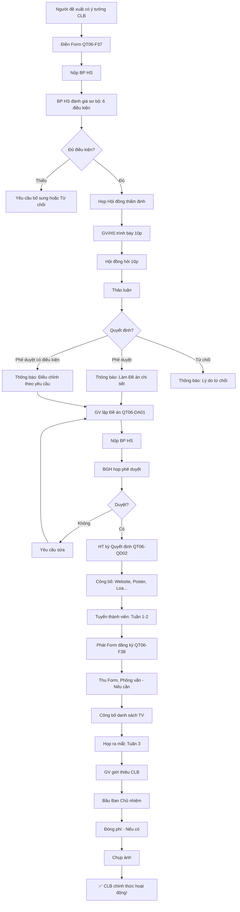

# SOP-05.1: THÀNH LẬP VÀ ĐĂNG KÝ CLB

## 1. THÔNG TIN QUY TRÌNH

| **Thuộc tính** | **Nội dung** |
|---|---|
| Mã SOP | SOP-05.1 |
| Tên quy trình | Thành lập và đăng ký CLB |
| Quy trình cha | SOP-05: Quản lý CLB |
| Phiên bản | 1.0 |
| Tần suất | Đầu năm học hoặc Khi có nhu cầu |

## 2. MỤC ĐÍCH

- **Quy trình rõ ràng**: GV, HS biết cách thành lập CLB
- **Quản lý chất lượng**: Chỉ CLB tốt mới được phê duyệt
- **Đảm bảo nguồn lực**: Có đủ GV, Phòng, Ngân sách
- **Phù hợp định hướng**: CLB phục vụ mục tiêu giáo dục

## 3. PHẠM VI ÁP DỤNG

- GV muốn mở CLB mới
- HS muốn thành lập CLB
- Đối tác muốn hợp tác mở CLB

## 4. LOẠI CLB

### 4.1. Phân loại theo lĩnh vực

```
╔══════════════════════════════════════════════════════════════════╗
║              6 NHÓM CLB CHÍNH                                    ║
╠══════════════════════════════════════════════════════════════════╣
║ 1. CLB HỌC THUẬT (Academic Clubs)                                ║
║    • Toán, Văn, Anh, Khoa học...                                 ║
║    • Mục tiêu: Nâng cao kiến thức, Thi Olympic                   ║
║    • Phù hợp: HS giỏi, Yêu thích môn                             ║
╠══════════════════════════════════════════════════════════════════╣
║ 2. CLB THỂ THAO (Sports Clubs)                                   ║
║    • Bóng đá, Bóng rổ, Bơi lội, Cầu lông...                      ║
║    • Mục tiêu: Rèn luyện sức khỏe, Thi đấu                       ║
║    • Phù hợp: HS khỏe, Năng động                                 ║
╠══════════════════════════════════════════════════════════════════╣
║ 3. CLB NGHỆ THUẬT (Arts Clubs)                                   ║
║    • Hội họa, Âm nhạc, Múa, Kịch...                              ║
║    • Mục tiêu: Phát triển tài năng nghệ thuật                    ║
║    • Phù hợp: HS có năng khiếu                                   ║
╠══════════════════════════════════════════════════════════════════╣
║ 4. CLB CÔNG NGHỆ (Tech Clubs)                                    ║
║    • Coding, Robotics, STEM, Nhiếp ảnh...                        ║
║    • Mục tiêu: Phát triển kỹ năng công nghệ                      ║
║    • Phù hợp: HS thích công nghệ                                 ║
╠══════════════════════════════════════════════════════════════════╣
║ 5. CLB KỸ NĂNG SỐNG (Life Skills Clubs)                          ║
║    • Hùng biện, Lãnh đạo, Tài chính cá nhân...                   ║
║    • Mục tiêu: Rèn kỹ năng mềm                                   ║
║    • Phù hợp: Tất cả HS                                          ║
╠══════════════════════════════════════════════════════════════════╣
║ 6. CLB XÃ HỘI - TỪ THIỆN (Social Clubs)                          ║
║    • Tình nguyện, Môi trường, Đọc sách...                        ║
║    • Mục tiêu: Phát triển trách nhiệm xã hội                     ║
║    • Phù hợp: HS có tâm huyết                                    ║
╚══════════════════════════════════════════════════════════════════╝
```

### 4.2. Phân loại theo quy mô

| **Loại** | **Số TV** | **GV phụ trách** | **Phòng** | **Ngân sách/năm** |
|---|---|---|---|---|
| **CLB nhỏ** | 10-20 | 1 GV | Dùng chung | 2-5M |
| **CLB vừa** | 21-40 | 1-2 GV | Dùng chung hoặc Riêng | 5-10M |
| **CLB lớn** | 41-80 | 2-3 GV | Riêng | 10-20M |
| **CLB đặc biệt** | >80 | 3+ GV | Riêng + Trang thiết bị | 20M+ |

## 5. ĐIỀU KIỆN THÀNH LẬP CLB

### 5.1. 6 điều kiện bắt buộc

```
╔══════════════════════════════════════════════════════════════════╗
║           6 ĐIỀU KIỆN THÀNH LẬP CLB                              ║
╠══════════════════════════════════════════════════════════════════╣
║ 1. MỤC TIÊU RÕ RÀNG                                              ║
║    • CLB làm gì? Vì sao?                                         ║
║    • Phù hợp định hướng giáo dục của trường                      ║
╠══════════════════════════════════════════════════════════════════╣
║ 2. ĐỦ THÀNH VIÊN                                                 ║
║    • Tối thiểu: 10 HS đăng ký                                    ║
║    • Cam kết tham gia ≥80% buổi                                  ║
╠══════════════════════════════════════════════════════════════════╣
║ 3. CÓ GV PHỤ TRÁCH                                               ║
║    • Tối thiểu: 1 GV (≤40 HS)                                    ║
║    • GV có chuyên môn phù hợp (VD: CLB Toán → GV Toán)           ║
║    • GV tự nguyện (Không ép!)                                    ║
╠══════════════════════════════════════════════════════════════════╣
║ 4. CÓ PHÒNG HỌC                                                  ║
║    • Dùng chung (Nếu CLB nhỏ)                                    ║
║    • Riêng (Nếu CLB lớn, Cần thiết bị đặc biệt)                  ║
╠══════════════════════════════════════════════════════════════════╣
║ 5. CÓ NGÂN SÁCH                                                  ║
║    • Từ trường (50-70%)                                          ║
║    • Từ học phí CLB (30-50%)                                     ║
║    • Từ sponsor (Nếu có)                                         ║
╠══════════════════════════════════════════════════════════════════╣
║ 6. AN TOÀN, HỢP PHÁP                                             ║
║    • Hoạt động không nguy hiểm cho HS                            ║
║    • Không vi phạm pháp luật                                     ║
╚══════════════════════════════════════════════════════════════════╝
```

## 6. QUY TRÌNH THÀNH LẬP

### 6.1. Giai đoạn đề xuất

**Bước 1: Người đề xuất điền Form (QT06-F37)**

```
═══════════════════════════════════════════════════════
        ĐƠN ĐỀ XUẤT THÀNH LẬP CLB
═══════════════════════════════════════════════════════

Người đề xuất:
□ GV: _______________  Bộ môn: ________
□ HS: _______________  Lớp: ____ (Nếu HS → Cần GV bảo trợ!)
□ Đối tác: _______________  Tổ chức: ________

I. THÔNG TIN CLB:

• Tên CLB: ________________
• Lĩnh vực: 
  □ Học thuật  □ Thể thao  □ Nghệ thuật
  □ Công nghệ  □ Kỹ năng sống  □ Xã hội - Từ thiện

• Mục tiêu:
  __________________________________________________________
  __________________________________________________________

• Đối tượng: Lớp ____ đến Lớp ____
• Số lượng dự kiến: ____ HS

II. KẾ HOẠCH HOẠT ĐỘNG:

• Lịch họp: Thứ ____, ____h-____h (Mỗi tuần)
• Địa điểm: Phòng __________
• Nội dung chính:
  __________________________________________________________
  __________________________________________________________

III. NGUỒN LỰC:

• GV phụ trách: _______________
• Thiết bị cần: ________________
• Ngân sách dự kiến: ___________đ/năm
  - Từ trường: ____đ
  - Từ học phí TV: ____đ
  - Từ sponsor: ____đ

IV. KẾT QUẢ DỰ KIẾN:

• Sau 1 năm, CLB sẽ:
  __________________________________________________________
  __________________________________________________________

Người đề xuất ký: __________  Ngày: __/__/____
═══════════════════════════════════════════════════════
```

**Bước 2: Nộp BP HS (Bất kỳ lúc nào trong năm)**

**Bước 3: BP HS đánh giá sơ bộ (Trong 1 tuần)**

```
Kiểm tra 6 điều kiện (Mục 5.1):
• Mục tiêu rõ? ✅/❌
• Đủ 10 HS? ✅/❌
• Có GV? ✅/❌
• Có phòng? ✅/❌
• Có ngân sách? ✅/❌
• An toàn? ✅/❌

Nếu 6/6 ✅ → Chuyển bước 4
Nếu có ❌ → Yêu cầu bổ sung hoặc Từ chối
```

### 6.2. Giai đoạn thẩm định

**Bước 4: Họp Hội đồng thẩm định (Trong 2 tuần)**

```
THÀNH PHẦN:
• HT hoặc Phó HT (Chủ tọa)
• Trưởng BP HS
• Trưởng BP chuyên môn (Nếu CLB học thuật)
• GV phụ trách CLB đề xuất
• Kế toán (Nếu ngân sách lớn)

TRÌNH TỰ:
1. GV/HS trình bày (10 phút):
   • Tại sao muốn thành lập CLB này?
   • Kế hoạch cụ thể?
   • Nguồn lực?
   
2. Hội đồng hỏi (10 phút):
   "Nếu không đủ 10 HS, Có đóng CLB không?"
   "Ngân sách 5M từ đâu?"
   ...
   
3. GV/HS trả lời

4. Hội đồng thảo luận (Người đề xuất ra ngoài)

5. Quyết định:
   □ PHÊ DUYỆT
   □ PHÊ DUYỆT CÓ ĐIỀU KIỆN (VD: Giảm ngân sách xuống 3M)
   □ TỪ CHỐI (Ghi rõ lý do)

6. Lập biên bản (QT06-BB05)
```

**Bước 5: Thông báo kết quả (Trong 3 ngày)**

```
Nếu PHÊ DUYỆT:
"Xin chúc mừng!
 CLB [Tên] đã được phê duyệt!
 
 Bước tiếp theo:
 • Làm Đề án chi tiết (QT06-DA01)
 • Nộp trước __/__/____"

Nếu TỪ CHỐI:
"Rất tiếc, CLB [Tên] chưa được phê duyệt.
 
 Lý do: [Giải thích cụ thể]
 
 Quý Thầy/Em có thể:
 • Chỉnh sửa, Nộp lại
 • Hoặc Tham gia CLB khác đang có!"
```

### 6.3. Giai đoạn hoàn thiện

**Bước 6: GV lập Đề án chi tiết (QT06-DA01)**

```
═══════════════════════════════════════════════════════
        ĐỀ ÁN THÀNH LẬP CLB (Chi tiết)
        CLB: ________________
═══════════════════════════════════════════════════════

I. GIỚI THIỆU:
• Tên CLB: ________________
• Tên tiếng Anh: ____________ (Nếu có)
• Logo: [Đính kèm]
• Slogan: ___________________

II. MỤC TIÊU CỤ THỂ (SMART):

• Mục tiêu 1: [VD: Sau 1 năm, 80% TV biết lập trình cơ bản]
• Mục tiêu 2: [VD: Tham gia Cuộc thi Robotics cấp Thành phố]
• ...

III. CƠ CẤU TỔ CHỨC:

┌─────────────────────────────────────┐
│      Chủ nhiệm CLB (GV)             │
├─────────────────────────────────────┤
│      Phó chủ nhiệm (GV/HS lớn)      │
├─────────────────────────────────────┤
│   Ban Chủ nhiệm (5-7 HS):           │
│   • Chủ tịch (HS lớp 8-9)           │
│   • Phó chủ tịch                    │
│   • Thư ký                          │
│   • Thủ quỹ                         │
│   • Truyền thông                    │
└─────────────────────────────────────┘
         ↓
   Thành viên (50 HS)

IV. NỘI QUY:

• Điều 1: Tham gia ≥80% buổi (Nếu không → Xem xét đuổi khỏi CLB)
• Điều 2: Đóng phí đúng hạn
• Điều 3: Tôn trọng GV, Bạn
• Điều 4: Giữ gìn tài sản CLB
• ...

V. KẾ HOẠCH HOẠT ĐỘNG NĂM:

Tháng 9:
• Tuyển thành viên
• Bầu Ban Chủ nhiệm

Tháng 10-12:
• Học cơ bản (VD: Lập trình Scratch)

Tháng 1-3:
• Học nâng cao (VD: Python)

Tháng 4:
• Làm dự án cuối khóa

Tháng 5:
• Thi Robotics cấp Thành phố

VI. NGÂN SÁCH CHI TIẾT:

| Khoản | Số lượng | Đơn giá | Thành tiền |
|-------|----------|---------|------------|
| Laptop | 10 | 15M | 150M (Đầu tư 1 lần) |
| Phần mềm | 50 license | 200K | 10M/năm |
| Tài liệu | 50 bộ | 100K | 5M/năm |
| Thi đấu | - | - | 10M/năm |
| Dự phòng | - | - | 5M/năm |
| **TỔNG** | | | **30M/năm** |

Nguồn:
• Trường: 10M (33%)
• Học phí TV: 50 HS × 400K = 20M (67%)

VII. KẾT QUẢ KỲ VỌNG:

Sau 1 năm:
• 50 HS biết lập trình cơ bản
• Tham gia 1 cuộc thi
• Làm 10 dự án

Sau 3 năm:
• CLB có 100 TV
• Giành giải tại Cuộc thi Quốc gia
• Trở thành CLB nổi tiếng!

GV phụ trách ký: __________
Trưởng BP HS ký: __________
═══════════════════════════════════════════════════════
```

**Bước 7: Nộp Đề án (Theo hạn)**

**Bước 8: BGH họp phê duyệt chính thức (Trong 1 tuần)**

```
BGH đánh giá:
• Đề án có khả thi?
• Ngân sách hợp lý?
• Có ảnh hưởng học tập chính khóa không?

Quyết định:
□ Phê duyệt → Cho phép thành lập!
□ Từ chối → Giải thích lý do
```

**Bước 9: HT ký Quyết định thành lập (QT06-QD02)**

```
═══════════════════════════════════════════════════════
            QUYẾT ĐỊNH THÀNH LẬP CLB
═══════════════════════════════════════════════════════

HIỆU TRƯỞNG TRƯỜNG __________

Căn cứ: [Quy chế hoạt động ngoại khóa...]

QUYẾT ĐỊNH:

Điều 1: Cho phép thành lập CLB [Tên CLB]
• Mã CLB: CLB-2024-01
• Lĩnh vực: __________
• Thời gian: Từ __/__/____ (Không xác định thời hạn - Đến khi đóng)

Điều 2: Phân công:
• GV phụ trách: _______________
• Phòng hoạt động: ___________
• Ngân sách: ___________đ/năm

Điều 3: Quyền và Trách nhiệm:
• CLB có quyền: Tuyển TV, Tổ chức hoạt động, Sử dụng cơ sở vật chất...
• CLB có trách nhiệm: Báo cáo BGH, Tuân thủ nội quy trường...

                         HT ký: __________
                         [Đóng dấu]
                         Ngày __/__/____
═══════════════════════════════════════════════════════
```

### 6.4. Giai đoạn vận hành

**Bước 10: Tuyển thành viên (Tuần 1-2)**

```
GV phụ trách:
• Thông báo toàn trường (Poster, Fanpage, Loa...)
• Phát Form đăng ký (QT06-F38)
• Thu Form
• Phỏng vấn (Nếu cần - VD: CLB tuyển chọn)
• Công bố danh sách
```

**Bước 11: Họp ra mắt (Tuần 3)**

```
Nội dung:
• GV giới thiệu CLB
• Giải thích: Mục tiêu, Kế hoạch, Nội quy
• Bầu Ban Chủ nhiệm (HS tự ứng cử, Bỏ phiếu)
• Đóng phí (Nếu có)
• Chụp ảnh lưu niệm

→ CLB chính thức hoạt động!
```

## 7. LƯU ĐỒ QUY TRÌNH



## 8. BIỂU MẪU LIÊN QUAN

| **Mã** | **Tên** |
|---|---|
| QT06-F37 | Form đề xuất thành lập CLB |
| QT06-DA01 | Đề án chi tiết CLB |
| QT06-QD02 | Quyết định thành lập CLB |
| QT06-F38 | Form đăng ký thành viên CLB |
| QT06-BB05 | Biên bản họp Hội đồng thẩm định |

## 9. TIÊU CHUẨN VÀ CHỈ TIÊU

| **Chỉ tiêu** | **Mục tiêu** |
|---|---|
| Thời gian xét duyệt (Từ nộp đến thông báo) | ≤ 3 tuần |
| Tỷ lệ CLB được phê duyệt (Trong tổng số đề xuất) | 60-70% |
| Số CLB mới mỗi năm | 2-5 |
| Số CLB hoạt động ổn định (≥2 năm) | ≥ 10 |

## 10. TRÁCH NHIỆM CỤ THỂ

| **Vai trò** | **Trách nhiệm** |
|---|---|
| **Người đề xuất** | Lập Form, Đề án, Trình bày |
| **BP HS** | Đánh giá sơ bộ, Tổ chức họp thẩm định |
| **Hội đồng** | Thẩm định, Quyết định |
| **BGH** | Phê duyệt, Ký quyết định, Phân bổ nguồn lực |

## 11. LƯU Ý QUAN TRỌNG

- ⚠️ **Chất lượng hơn số lượng**: Không phê duyệt quá nhiều CLB → Không đủ nguồn lực!
- ✅ **Hỗ trợ người đề xuất**: Đừng từ chối cứng nhắc! Hướng dẫn cải thiện!
- 🔥 **Khuyến khích sáng tạo**: Đề xuất mới, Lạ → Xem xét tích cực!
- ✅ **Minh bạch**: Công bố rõ tiêu chí phê duyệt → Công bằng!

## 12. PHỤ LỤC

### 12.1. Tiêu chí phê duyệt chi tiết

**Bảng chấm điểm (Hội đồng sử dụng):**

```
═══════════════════════════════════════════════════════
     BẢNG CHẤM ĐIỂM ĐỀ XUẤT CLB
     CLB: ________________
═══════════════════════════════════════════════════════

1. MỤC TIÊU (20 điểm):
   □ 18-20: Rõ ràng, Cụ thể, SMART, Phù hợp giáo dục
   □ 15-17: Rõ ràng, Nhưng chưa SMART
   □ 10-14: Mơ hồ
   □ <10: Không rõ ràng
   
   Điểm: ____

2. NỘI DUNG (20 điểm):
   □ 18-20: Phong phú, Hấp dẫn, Độc đáo
   □ 15-17: Tốt, Nhưng chưa độc đáo
   □ 10-14: Bình thường
   □ <10: Nhàm chán
   
   Điểm: ____

3. NGUỒN LỰC (20 điểm):
   □ 18-20: Đầy đủ GV, Phòng, Ngân sách
   □ 15-17: Đủ, Nhưng hơi thiếu 1-2 thứ
   □ 10-14: Thiếu nhiều
   □ <10: Không đủ
   
   Điểm: ____

4. KHẢ THI (20 điểm):
   □ 18-20: Rất khả thi, GV có kinh nghiệm
   □ 15-17: Khả thi, Nhưng cần đào tạo GV
   □ 10-14: Khó khăn
   □ <10: Không khả thi
   
   Điểm: ____

5. TÁC ĐỘNG (20 điểm):
   □ 18-20: Lợi ích lớn cho HS, Trường
   □ 15-17: Lợi ích trung bình
   □ 10-14: Lợi ích nhỏ
   □ <10: Không có lợi ích rõ
   
   Điểm: ____

──────────────────────────────────────────────────────
TỔNG: ____/100 điểm

QUYẾT ĐỊNH:
□ 80-100: PHÊ DUYỆT NGAY! ✅
□ 60-79: PHÊ DUYỆT CÓ ĐIỀU KIỆN 🟡
□ 40-59: YÊU CẦU SỬA 🟠
□ <40: TỪ CHỐI ❌

Hội đồng ký: __________
═══════════════════════════════════════════════════════
```

### 12.2. Danh sách CLB tiêu biểu (Gợi ý)

```
HỌC THUẬT:
• CLB Toán học
• CLB Tiếng Anh
• CLB Khoa học trẻ

THỂ THAO:
• CLB Bóng đá
• CLB Bơi lội
• CLB Cờ vua

NGHỆ THUẬT:
• CLB Hội họa
• CLB Âm nhạc
• CLB Múa

CÔNG NGHỆ:
• CLB Robotics
• CLB Coding
• CLB Nhiếp ảnh

KỸ NĂNG SỐNG:
• CLB Hùng biện
• CLB Lãnh đạo trẻ
• CLB Quản lý tài chính cá nhân

XÃ HỘI:
• CLB Tình nguyện
• CLB Môi trường xanh
• CLB Đọc sách
```

### 12.3. Xử lý đề xuất đặc biệt

**A. HS đề xuất (Không có GV bảo trợ):**

```
VD: HS lớp 9 đề xuất "CLB Nhiếp ảnh"

XỬ LÝ:
1. Khen ngợi: "Ý tưởng hay!"
2. Yêu cầu: "Em cần tìm 1 GV bảo trợ!"
3. Hỗ trợ: BP HS giúp kết nối với GV có thể quan tâm
4. Nếu tìm được GV → Tiếp tục quy trình
5. Nếu không → Tạm hoãn đến khi có GV
```

**B. Đối tác đề xuất (Doanh nghiệp):**

```
VD: Công ty Lập trình ABC đề xuất "Mở CLB Coding miễn phí!"

XỬ LÝ:
1. Đánh giá uy tín công ty
2. Kiểm tra mục đích: 
   • Giáo dục HS? ✅
   • Quảng cáo sản phẩm? 🟡 (Xem xét)
   • Tuyển dụng HS? ❌ (Từ chối!)
3. Ký hợp đồng hợp tác (Rõ trách nhiệm)
4. Giám sát chặt (Đảm bảo chất lượng)
```

## 13. FAQ

**Q1: CLB đã thành lập, Nhưng chỉ có 5 HS đăng ký (Không đủ 10). Xử lý?**  
A: 
- Hoãn: Chờ thêm 2 tuần (Tuyển thêm)
- Nếu vẫn không đủ → Tạm ngưng CLB!
- Có thể mở lại khi đủ HS quan tâm!

**Q2: GV muốn mở CLB, Nhưng trường không đủ phòng. Làm sao?**  
A: 
- Dùng chung phòng (VD: CLB họp Thứ 3, CLB khác Thứ 5)
- Hoặc Họp ngoài giờ (17h-18h, Sau khi tan học)
- Hoặc Họp online (Zoom) - Nếu phù hợp!

**Q3: HS lớp 3 muốn thành lập CLB. Có cho không?**  
A: 
- HS nhỏ (Lớp 1-5): CẦN GV chủ trì! (HS chỉ là TV, Không điều hành)
- HS THCS (Lớp 6-9): Có thể cho điều hành (Dưới sự giám sát GV)

**Q4: Có giới hạn số CLB/trường không?**  
A: Không có con số cứng!
Nhưng: Tùy nguồn lực!
- Trường nhỏ: 5-10 CLB
- Trường vừa: 10-20 CLB
- Trường lớn: 20-40 CLB

---

**PHÊ DUYỆT**

| Trưởng BP HS | Phó HT | Hiệu trưởng |
|---|---|---|
| [Họ tên] | [Họ tên] | [Họ tên] |
