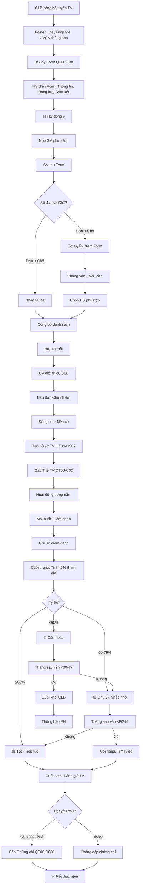

# SOP-05.2: QUẢN LÝ THÀNH VIÊN CLB

## 1. THÔNG TIN QUY TRÌNH

| **Thuộc tính** | **Nội dung** |
|---|---|
| Mã SOP | SOP-05.2 |
| Tên quy trình | Quản lý thành viên CLB |
| Quy trình cha | SOP-05: Quản lý CLB |
| Phiên bản | 1.0 |
| Áp dụng | Liên tục trong năm |

## 2. MỤC ĐÍCH

- **Hồ sơ đầy đủ**: Biết TV là ai, Thông tin liên hệ
- **Theo dõi tham gia**: TV có đi đều không?
- **Động viên**: TV tích cực → Khen thưởng
- **Xử lý**: TV không tham gia → Nhắc nhở hoặc Cho ra khỏi CLB

## 3. PHẠM VI ÁP DỤNG

Tất cả CLB của trường

## 4. QUY TRÌNH TUYỂN THÀNH VIÊN

### 4.1. Công bố tuyển (Đầu năm hoặc Khi CLB mới thành lập)

**Bước 1: GV phụ trách thông báo**

```
HÌNH THỨC:
• Poster dán tại trường (Cổng, Lớp, Sảnh...)
• Thông báo qua Loa (Buổi chào cờ)
• Đăng Fanpage/Website trường
• GVCN thông báo lớp

NỘI DUNG POSTER:
┌─────────────────────────────────────────────────┐
│         [LOGO CLB]                              │
│                                                 │
│      CLB ROBOTICS TUYỂN THÀNH VIÊN!            │
│                                                 │
│  Bạn thích Công nghệ? Robot? Lập trình?        │
│  Hãy tham gia CLB Robotics!                     │
│                                                 │
│  THÔNG TIN:                                     │
│  • Đối tượng: Lớp 6-9                           │
│  • Số lượng: 50 TV                              │
│  • Lịch họp: Thứ 4, 15h-17h                     │
│  • Học phí: 500K/tháng                          │
│  • Nội dung: Lập trình, Lắp ráp robot, Thi đấu │
│                                                 │
│  ĐĂNG KÝ:                                       │
│  • Lấy Form tại: Phòng Đoàn                     │
│  • Hoặc Tải: [Link]                             │
│  • Hạn nộp: 15/09/2024                          │
│                                                 │
│  Liên hệ: Thầy X, SĐT: 0912-xxx-xxx           │
└─────────────────────────────────────────────────┘
```

**Bước 2: HS lấy Form, Điền, Nộp**

**Form đăng ký (QT06-F38):**

```
═══════════════════════════════════════════════════════
      PHIẾU ĐĂNG KÝ THÀNH VIÊN CLB
      CLB: ROBOTICS
═══════════════════════════════════════════════════════

I. THÔNG TIN CÁ NHÂN:
• Họ tên: _______________
• Lớp: ____  Giới tính: □ Nam  □ Nữ
• Ngày sinh: __/__/____
• SĐT: _______________
• Email: _______________

II. THÔNG TIN PHỤ HUYNH:
• Họ tên PH: _______________
• SĐT: _______________
• Email: _______________

III. ĐỘNG LỰC:
1. Tại sao em muốn tham gia CLB này?
   __________________________________________________________
   __________________________________________________________

2. Em có kinh nghiệm về Robot/Lập trình không?
   □ Có: _______________
   □ Không (Mới bắt đầu)

3. Em kỳ vọng gì từ CLB?
   __________________________________________________________

IV. CAM KẾT:
□ Em cam kết tham gia ≥80% buổi học
□ Em cam kết đóng phí đúng hạn
□ Em cam kết tuân thủ nội quy CLB

HS ký: __________  Ngày: __/__/____

---PHỤ HUYNH XÁC NHẬN---
□ Tôi đồng ý cho con tham gia CLB
□ Tôi đồng ý đóng phí: 500K/tháng

PH ký: __________  Ngày: __/__/____
═══════════════════════════════════════════════════════
```

**Bước 3: GV thu Form, Sơ tuyển (Nếu quá nhiều đơn)**

```
VD: CLB chỉ nhận 50 TV, Nhưng có 80 đơn đăng ký!

XỬ LÝ:
• Sơ tuyển (Xem Form):
  - Có kinh nghiệm? → Ưu tiên!
  - Động lực mạnh? → Ưu tiên!
  
• Phỏng vấn (Nếu cần):
  - Hỏi thêm về kiến thức, Sở thích
  - Chọn 50 HS phù hợp nhất
  
• Thông báo:
  - 50 HS được nhận → Vui mừng! 🎉
  - 30 HS không được → Động viên: "Năm sau đăng ký nhé!"
    (Hoặc Giới thiệu CLB khác phù hợp!)
```

### 4.2. Nhận thành viên chính thức

**Bước 4: Công bố danh sách (1 tuần sau hạn nộp)**

**Bước 5: Họp ra mắt (Như SOP-05.1)**

**Bước 6: Tạo hồ sơ TV (QT06-HS02)**

```
Mỗi TV có 1 hồ sơ (Lưu tại CLB):
• Form đăng ký (Có ký HS + PH)
• Ảnh 3×4 (1 ảnh)
• Sổ theo dõi tham gia (Điểm danh mỗi buổi)
• Sổ khen thưởng - Kỷ luật (Nếu có)
• Chứng chỉ, Giải thưởng (Nếu có)
```

**Bước 7: Cấp Thẻ thành viên (QT06-C02)**

```
┌─────────────────────────────────────┐
│ [LOGO CLB]   CLB ROBOTICS           │
│         THẺ THÀNH VIÊN              │
├─────────────────────────────────────┤
│                                     │
│  [Ảnh 3×4]    Họ tên: Nguyễn Văn A │
│               Mã TV: RB-2024-001   │
│               Lớp: 8A               │
│               Ngày gia nhập: 05/09 │
│                                     │
│  GV phụ trách: Thầy X              │
│                                     │
│  [QR Code - Thông tin TV]          │
│                                     │
│  Có hiệu lực: Năm học 2024-2025    │
└─────────────────────────────────────┘

MẶT SAU:
• Nội quy CLB (Tóm tắt)
• Lịch họp
• Liên hệ
```

## 5. QUẢN LÝ TRONG NĂM

### 5.1. Điểm danh mỗi buổi

**Bước 8: GV phụ trách điểm danh (Đầu buổi)**

```
Sổ điểm danh CLB:

┌──────┬──────────┬────┬────┬────┬────┬────┐
│ STT  │ Họ tên   │ 1  │ 2  │ 3  │ 4  │... │
├──────┼──────────┼────┼────┼────┼────┼────┤
│  1   │Nguyễn VA │ P  │ P  │ A  │ P  │    │
│  2   │Trần Thị B│ P  │ P  │ P  │ P  │    │
│ ...  │          │    │    │    │    │    │
└──────┴──────────┴────┴────┴────┴────┴────┘

P = Present (Có mặt)
A = Absent (Vắng)
L = Late (Muộn)
```

**Bước 9: Liên hệ TV vắng**

```
Nếu TV vắng (Không báo trước):
• GV nhắn tin: "Em có đến CLB không?"
• Nếu HS trả lời + Lý do hợp lý → OK
• Nếu không trả lời → Ghi nhận (Vắng không phép)
```

### 5.2. Theo dõi tỷ lệ tham gia

**Bước 10: Cuối tháng - Tính tỷ lệ (QT06-BC17)**

```
═══════════════════════════════════════════════════════
   BÁO CÁO THAM GIA CLB - THÁNG __
   CLB: ROBOTICS  GV: Thầy X
═══════════════════════════════════════════════════════

Tổng TV: 50
Tổng buổi: 8 (Tháng 10: 4 tuần × 2 buổi)

STT | Họ tên     | Có mặt | Vắng | Tỷ lệ | Mức độ
----|------------|--------|------|-------|--------
  1 | Nguyễn VA  |   8    |   0  | 100%  | 🟢 Tốt
  2 | Trần Thị B |   7    |   1  | 87.5% | 🟢 Tốt
  3 | Lê Văn C   |   5    |   3  | 62.5% | 🟡 Chú ý
  4 | Phạm Thị D |   3    |   5  | 37.5% | 🔴 Cảnh báo!
----|------------|--------|------|-------|--------

PHÂN LOẠI:
• 🟢 Tốt (≥80%): 42 TV (84%)
• 🟡 Chú ý (60-79%): 6 TV (12%)
• 🔴 Cảnh báo (<60%): 2 TV (4%)

TV CẦN XỬ LÝ:
• Phạm Thị D: 37.5% → Gọi đến nói chuyện!

GV ký: __________
═══════════════════════════════════════════════════════
```

**Bước 11: Xử lý TV tham gia kém**

```
╔══════════════════════════════════════════════════════════════════╗
║         QUY TRÌNH XỬ LÝ TV THAM GIA KÉM                          ║
╠══════════════════════════════════════════════════════════════════╣
║ THÁNG 1 (Tỷ lệ <80%):                                            ║
║  → Nhắc nhở: "Em đi ít quá! Cố gắng đi đều hơn nhé!"             ║
╠══════════════════════════════════════════════════════════════════╣
║ THÁNG 2 (Vẫn <80%):                                              ║
║  → Gọi riêng: "Sao em vắng nhiều? Có vấn đề gì?"                 ║
║     • Bận học: Giảm buổi (VD: 2 buổi/tuần → 1 buổi)              ║
║     • Không thích: Hỏi lý do, Cải thiện                          ║
╠══════════════════════════════════════════════════════════════════╣
║ THÁNG 3 (Vẫn <60%):                                              ║
║  → Cảnh báo: "Nếu tháng sau vẫn vậy, Em sẽ bị cho ra khỏi CLB!"  ║
╠══════════════════════════════════════════════════════════════════╣
║ THÁNG 4 (Vẫn <60%):                                              ║
║  → Cho ra khỏi CLB! (Nhường chỗ cho HS khác muốn tham gia!)      ║
╚══════════════════════════════════════════════════════════════════╝
```

### 5.3. Quản lý học phí CLB (Nếu có)

**Bước 12: Thu phí (Đầu tháng)**

```
Cách thu:
• PH chuyển khoản → GV
• Hoặc HS nộp tiền mặt (Ngày họp)

GV:
• Ghi Sổ thu (QT06-ST01)
• Cấp biên nhận (QT06-F39)
• Nộp Kế toán (Cuối tuần)
```

**Sổ thu (QT06-ST01):**

```
CLB: ROBOTICS  Tháng: 10/2024  Học phí: 500K/TV

STT | Họ tên     | Đã đóng? | Ngày đóng | Số tiền | Biên nhận
----|------------|----------|-----------|---------|----------
  1 | Nguyễn VA  | ✅       | 01/10     | 500K    | BR-001
  2 | Trần Thị B | ✅       | 03/10     | 500K    | BR-002
  3 | Lê Văn C   | ❌       | -         | -       | -
----|------------|----------|-----------|---------|----------

TỔNG THU: 49/50 TV × 500K = 24,500,000đ
CHƯA ĐÓNG: 1 TV (Lê Văn C)

GV ký: __________
```

**Bước 13: Nhắc TV chưa đóng**

```
Ngày 5:
Nhắn tin: "Em C, Em chưa đóng phí CLB tháng 10.
          Em đóng trước ngày 10 nhé!"

Ngày 10:
Nếu vẫn chưa đóng:
→ Gọi PH: "Con C chưa đóng phí CLB ạ!"

Ngày 15:
Nếu vẫn chưa đóng:
→ Tạm dừng cho C tham gia (Đến khi đóng!)
```

## 6. QUYỀN VÀ TRÁCH NHIỆM TV

### 6.1. Quyền lợi

```
THÀNH VIÊN CLB ĐƯỢC:
✅ Tham gia tất cả hoạt động CLB
✅ Sử dụng trang thiết bị CLB (Trong giờ họp)
✅ Được đào tạo bởi GV/HLV chuyên nghiệp
✅ Tham gia thi đấu/Trình diễn (Đại diện CLB)
✅ Nhận chứng chỉ (Cuối năm - Nếu đạt yêu cầu)
✅ Được ưu tiên (Nếu CLB có hoạt động đặc biệt)
✅ Ghi nhận vào Hồ sơ HS (Tham gia CLB = Điểm cộng!)
```

### 6.2. Trách nhiệm

```
THÀNH VIÊN CLB PHẢI:
✅ Tham gia ≥80% buổi học
✅ Đóng phí đúng hạn (Nếu có)
✅ Tuân thủ nội quy CLB
✅ Giữ gìn tài sản CLB (Không làm hỏng, Mất...)
✅ Tham gia tích cực (Không ngồi chơi!)
✅ Tôn trọng GV, Bạn
✅ Đại diện CLB tham gia thi đấu (Khi được gọi)
```

### 6.3. Xử lý vi phạm

| **Vi phạm** | **Lần 1** | **Lần 2** | **Lần 3** |
|---|---|---|---|
| Vắng không phép | Nhắc nhở | Cảnh cáo | Đuổi khỏi CLB |
| Không đóng phí | Nhắc nhở | Tạm dừng tham gia | Đuổi khỏi CLB |
| Không tôn trọng GV | Cảnh cáo | Gọi PH | Đuổi khỏi CLB |
| Phá hoại tài sản | Bồi thường + Cảnh cáo | Đuổi khỏi CLB | - |

## 7. LƯU ĐỒ QUY TRÌNH



## 8. BIỂU MẪU LIÊN QUAN

| **Mã** | **Tên** |
|---|---|
| QT06-F38 | Phiếu đăng ký thành viên CLB |
| QT06-HS02 | Hồ sơ thành viên CLB |
| QT06-C02 | Thẻ thành viên CLB |
| QT06-ST01 | Sổ thu học phí CLB |
| QT06-F39 | Biên nhận học phí CLB |
| QT06-BC17 | Báo cáo tham gia CLB tháng |
| QT06-CC01 | Chứng chỉ hoàn thành CLB |

## 9. TIÊU CHUẨN VÀ CHỈ TIÊU

| **Chỉ tiêu** | **Mục tiêu** |
|---|---|
| Tỷ lệ TV tham gia ≥80% buổi | ≥ 80% |
| Tỷ lệ TV đóng phí đúng hạn | ≥ 95% |
| Tỷ lệ TV hài lòng (Khảo sát) | ≥ 85% |
| Tỷ lệ TV tiếp tục năm sau | ≥ 70% |

## 10. TRÁCH NHIỆM CỤ THỂ

| **Vai trò** | **Trách nhiệm** |
|---|---|
| **GV phụ trách** | Tuyển TV, Điểm danh, Thu phí, Đánh giá TV |
| **Ban Chủ nhiệm (HS)** | Hỗ trợ GV, Điểm danh, Tổ chức hoạt động |
| **BP HS** | Giám sát CLB, Hỗ trợ GV |
| **TV** | Tham gia đầy đủ, Đóng phí, Tuân thủ nội quy |

## 11. LƯU Ý QUAN TRỌNG

- ⚠️ **Không ép HS**: Tham gia CLB = Tự nguyện! Không ép!
- ✅ **Công bằng**: Tuyển TV phải công bằng (Không thiên vị!)
- 🔥 **Động viên**: TV tham gia tốt → Khen ngợi, Trao chứng chỉ!
- ✅ **Linh hoạt**: HS bận học → Cho giảm buổi, Không đuổi ngay!

## 12. PHỤ LỤC

### 12.1. Mẫu chứng chỉ hoàn thành CLB

```
═══════════════════════════════════════════════════════
        [LOGO TRƯỜNG]
        
           CHỨNG NHẬN HOÀN THÀNH
═══════════════════════════════════════════════════════

Trường ________ xin chứng nhận:

Họ tên: _______________
Lớp: ____  Năm học: ________

Đã hoàn thành khóa học tại:

        CLB ROBOTICS
        
• Thời gian: 09/2024 - 05/2025
• Tỷ lệ tham gia: 95% (Xuất sắc!)
• Kết quả: 
  - Học: Lập trình Scratch, Python
  - Làm: 3 dự án robot
  - Thi: Giải Ba Cuộc thi Robotics cấp Thành phố

Trường ________ chứng nhận để làm tài liệu.

        GV phụ trách ký: __________
        HT ký: __________
        [Đóng dấu]
        Ngày __/__/____
═══════════════════════════════════════════════════════
```

### 12.2. Xử lý tình huống đặc biệt

**A. TV muốn ra khỏi CLB (Giữa năm):**

```
VD: Tháng 11, HS muốn ra khỏi CLB

GV:
"Sao em muốn ra?"

HS: "Em bận học quá, Không theo nổi!"

GV:
"Em có thể:
 • Giảm buổi: 2 buổi/tuần → 1 buổi
 • Hoặc Nghỉ tạm 1 tháng, Quay lại sau
 
 Em không nhất thiết phải ra hẳn!
 Suy nghĩ thêm nhé!"

Nếu HS vẫn muốn ra:
→ Cho ra (Không ép!)
→ Hoàn phí (Tháng chưa học)
→ Trả hồ sơ
```

**B. CLB quá đông (Nhiều HS muốn vào giữa năm):**

```
VD: CLB 50 chỗ, Đã đủ. Nhưng 10 HS nữa muốn vào!

XỬ LÝ:
• Lập danh sách chờ (Waiting list)
• Khi có TV ra → Nhận HS trong danh sách chờ
• Hoặc: Xin BGH mở lớp 2 (Nếu có GV + Phòng)
```

## 13. FAQ

**Q1: HS lớp 3 muốn tham gia CLB Robotics (Lớp 6-9). Có cho không?**  
A: 
- Nguyên tắc: Theo đúng đối tượng!
- Ngoại lệ: Nếu HS xuất sắc (Test đầu vào đạt) → Xem xét!
- Nhưng: Phải hỏi PH đồng ý (Vì HS nhỏ, Học với HS lớn!)

**Q2: TV không đóng phí (3 tháng liền). Xử lý?**  
A: 
- Tìm hiểu: Gia đình khó khăn?
  - Có → Xin BGH miễn giảm
  - Không (Lười đóng) → Cho ra khỏi CLB!

**Q3: Có nên công khai tỷ lệ tham gia của TV không?**  
A: KHÔNG! (Tránh HS xấu hổ!)
- Chỉ nói riêng với từng TV
- Hoặc Công bố chung: "CLB tháng này tỷ lệ 88%" (Không nêu tên!)

**Q4: TV đạt yêu cầu, Nhưng không muốn nhận chứng chỉ. Có nên ép không?**  
A: KHÔNG! Tôn trọng! Nhưng giải thích: "Chứng chỉ = Ghi nhận nỗ lực em! Nhận đi!"

---

**PHÊ DUYỆT**

| GV phụ trách CLB | Trưởng BP HS | Phó HT |
|---|---|---|
| [Họ tên] | [Họ tên] | [Họ tên] |
