# SOP-05.3: HOẠT ĐỘNG VÀ SỰ KIỆN CLB

## 1. THÔNG TIN QUY TRÌNH

| **Thuộc tính** | **Nội dung** |
|---|---|
| Mã SOP | SOP-05.3 |
| Tên quy trình | Hoạt động và sự kiện CLB |
| Quy trình cha | SOP-05: Quản lý CLB |
| Phiên bản | 1.0 |
| Áp dụng | Hoạt động hằng tuần + Sự kiện đặc biệt |

## 2. MỤC ĐÍCH

- **Hoạt động đều đặn**: CLB họp đúng lịch, Đúng nội dung
- **Chất lượng cao**: TV học được kiến thức/Kỹ năng thật
- **Sự kiện ấn tượng**: Tạo dấu ấn, Tăng uy tín CLB
- **Ghi nhận thành tích**: TV được công nhận, Động viên

## 3. PHẠM VI ÁP DỤNG

Tất cả CLB của trường

## 4. PHÂN LOẠI HOẠT ĐỘNG

### 4.1. 3 loại hoạt động

```
╔══════════════════════════════════════════════════════════════════╗
║              3 LOẠI HOẠT ĐỘNG CLB                                ║
╠══════════════════════════════════════════════════════════════════╣
║ 1. HOẠT ĐỘNG THƯỜNG KỲ (Regular Activities)                     ║
║    • Họp hằng tuần (1-2 buổi)                                    ║
║    • Nội dung: Học, Luyện tập, Thảo luận...                      ║
║    • Tần suất: 40-60 buổi/năm                                    ║
║    • Mục tiêu: Phát triển kỹ năng dần dần                        ║
╠══════════════════════════════════════════════════════════════════╣
║ 2. SỰ KIỆN NỘI BỘ (Internal Events)                              ║
║    • Tổ chức trong CLB (Chỉ TV tham gia)                         ║
║    • VD: Giao lưu nội bộ, Cắm trại, Sinh nhật CLB...             ║
║    • Tần suất: 2-4 lần/năm                                       ║
║    • Mục tiêu: Gắn kết TV, Tăng tinh thần                        ║
╠══════════════════════════════════════════════════════════════════╣
║ 3. SỰ KIỆN CÔNG KHAI (Public Events)                             ║
║    • Mở rộng (Cả trường hoặc Liên trường)                        ║
║    • VD: Hội thi, Triển lãm, Biểu diễn...                        ║
║    • Tần suất: 1-2 lần/năm                                       ║
║    • Mục tiêu: Quảng bá CLB, Tạo uy tín                          ║
╚══════════════════════════════════════════════════════════════════╝
```

## 5. HOẠT ĐỘNG THƯỜNG KỲ

### 5.1. Chuẩn bị buổi họp

**Bước 1: GV lập Giáo án CLB (Mỗi buổi)**

```
═══════════════════════════════════════════════════════
        GIÁO ÁN CLB
        CLB: ROBOTICS  Buổi: 5  Ngày: 15/10/2024
═══════════════════════════════════════════════════════

I. MỤC TIÊU:
• Kiến thức: TV hiểu cách lập trình động cơ
• Kỹ năng: TV lập trình được robot đi thẳng
• Thái độ: Kiên nhẫn, Làm việc nhóm

II. CHUẨN BỊ:
• Thiết bị: 10 bộ robot (Đã sạc pin)
• Tài liệu: In 50 bản hướng dẫn
• Phần mềm: Scratch cài sẵn trên laptop

III. NỘI DUNG (90 phút):

15:00-15:10 (10p): Điểm danh + Ôn bài cũ
"Buổi trước chúng ta học gì? Ai nhớ?"

15:10-15:30 (20p): Giảng bài mới
"Hôm nay học lập trình động cơ..."
[Demo trên màn hình]

15:30-16:00 (30p): Thực hành
"Giờ các em tự làm! Chia nhóm 5 em/nhóm!"
[TV lập trình, GV hỗ trợ]

16:00-16:20 (20p): Trình bày
"Nhóm 1 lên trình bày!"
[Mỗi nhóm chạy robot]

16:20-16:30 (10p): Tổng kết + Giao bài về
"Hôm nay các em làm tốt!
 Về nhà xem video: [Link]
 Tuần sau tiếp tục nhé!"

IV. ĐÁNH GIÁ:
• TV nào xuất sắc? Khen ngợi!
• TV nào chưa hiểu? Giải thích thêm!

GV ký: __________
═══════════════════════════════════════════════════════
```

**Bước 2: Chuẩn bị vật chất (Trước 1 ngày)**

```
GV kiểm tra:
□ Phòng: Đã dọn sạch?
□ Thiết bị: Đủ? Hoạt động?
□ Tài liệu: Đã in?
□ Bảng, Máy chiếu: Test OK?
```

### 5.2. Tổ chức buổi họp

**Bước 3: Điểm danh (5-10 phút đầu)**

```
GV: "Chào các em!"
TV: "Chào thầy!"

GV: "Hôm nay ai vắng?"
[Gọi tên]

Kết quả: 48/50 TV
Vắng: Bạn A (Ốm), Bạn B (Không báo)

→ Nhắn tin B: "Em có đến CLB không?"
```

**Bước 4: Thực hiện theo Giáo án**

```
NGUYÊN TẮC:
✅ Giảng rõ ràng, Dễ hiểu
✅ Thực hành nhiều (Học bằng làm!)
✅ Hỗ trợ TV yếu (Không bỏ rơi!)
✅ Thách thức TV giỏi (Bài khó hơn!)
✅ Vui vẻ, Không căng thẳng như học chính khóa!
```

**Bước 5: Tổng kết buổi (5-10 phút cuối)**

```
GV:
"Hôm nay chúng ta học:
 • [Tóm tắt kiến thức]
 
 ĐIỂM TỐT:
 • Nhóm 1 làm rất nhanh!
 • Bạn C giúp bạn D! Tốt lắm!
 
 ĐIỂM CẦN CẢI THIỆN:
 • Một số em còn nhầm lẫn về [X]
 • Tuần sau cô sẽ giảng lại!
 
 BÀI VỀ NHÀ:
 • Xem video: [Link]
 • Làm bài tập: Trang 10
 
 Hẹn gặp lại tuần sau!"
```

### 5.3. Theo dõi tiến độ

**Bước 6: GV ghi nhận tiến độ (QT06-ST02)**

```
Sổ theo dõi tiến độ:

┌──────┬──────────┬──────┬──────┬──────┬──────┬──────┐
│ STT  │ Họ tên   │ Buổi │ Buổi │ Buổi │ Buổi │ Ghi  │
│      │          │  1   │  2   │  3   │  4   │ chú  │
├──────┼──────────┼──────┼──────┼──────┼──────┼──────┤
│  1   │Nguyễn VA │ 8/10 │ 9/10 │ 10   │      │ Tiến │
│      │          │      │      │      │      │ bộ!  │
│  2   │Trần Thị B│ 7/10 │ 7/10 │ 7/10 │      │ Trung│
│      │          │      │      │      │      │ bình │
│ ...  │          │      │      │      │      │      │
└──────┴──────────┴──────┴──────┴──────┴──────┴──────┘

→ Theo dõi: Ai tiến bộ? Ai đứng yên?
```

## 6. SỰ KIỆN NỘI BỘ CLB

### 6.1. Các loại sự kiện

```
╔══════════════════════════════════════════════════════════════════╗
║            CÁC SỰ KIỆN NỘI BỘ PHỔ BIẾN                           ║
╠══════════════════════════════════════════════════════════════════╣
║ 1. SINH NHẬT CLB (Anniversary)                                   ║
║    • Kỷ niệm ngày thành lập (Mỗi năm 1 lần)                      ║
║    • Nội dung: Ôn lại hành trình, Trao giải TV xuất sắc, Tiệc   ║
╠══════════════════════════════════════════════════════════════════╣
║ 2. CẮM TRẠI/DÃ NGOẠI (Camp/Picnic)                               ║
║    • 1-2 ngày                                                    ║
║    • Nội dung: Vui chơi, Gắn kết, Team building                  ║
╠══════════════════════════════════════════════════════════════════╣
║ 3. GIAO LƯU NỘI BỘ (Internal Competition)                        ║
║    • Thi đấu giữa các TV                                         ║
║    • VD: Thi lập trình, Thi vẽ, Thi hát...                       ║
║    • Chọn TV giỏi → Tham gia thi bên ngoài                       ║
╠══════════════════════════════════════════════════════════════════╣
║ 4. HỌC TỪ CHUYÊN GIA (Guest Speaker)                             ║
║    • Mời chuyên gia ngoài đến chia sẻ                            ║
║    • VD: Lập trình viên Google, Họa sĩ nổi tiếng...              ║
╠══════════════════════════════════════════════════════════════════╣
║ 5. THAM QUAN (Field Trip)                                        ║
║    • Đi thực tế (VD: CLB Coding → Thăm Google Office)            ║
║    • Học hỏi, Trải nghiệm                                        ║
╚══════════════════════════════════════════════════════════════════╝
```

### 6.2. Quy trình tổ chức sự kiện nội bộ

**VD: Sinh nhật CLB Robotics (1 năm tuổi!)**

**Bước 1: Ban Chủ nhiệm (HS) đề xuất (1 tháng trước)**

```
Chủ tịch CLB viết Đề xuất:

Đề xuất tổ chức "Sinh nhật CLB Robotics lần 1"
• Thời gian: 15h-18h, 05/09/2025 (Đúng 1 năm thành lập!)
• Địa điểm: Phòng CLB + Sân trường
• Đối tượng: 50 TV + 20 PH (Nếu muốn)
• Ngân sách: 5M
• Nội dung: Ôn lại 1 năm, Trao giải, Tiệc, Chụp ảnh...

→ Nộp GV phụ trách
```

**Bước 2: GV phê duyệt (Hoặc Trình BGH nếu ngân sách lớn)**

**Bước 3: Ban Chủ nhiệm chuẩn bị (3 tuần)**

```
Phân công:
• Chủ tịch: Tổng điều phối
• Phó CT: Trang trí
• Thư ký: Làm slide ôn lại hành trình (Video, Ảnh...)
• Thủ quỹ: Mua đồ ăn, Quà
• Truyền thông: Thiết kế poster, Mời TV, Chụp ảnh...

Timeline:
Tuần 1: Thiết kế, Đặt hàng
Tuần 2: Mời TV, Chuẩn bị slide
Tuần 3: Tổng duyệt
```

**Bước 4: Tổ chức (Ngày G)**

```
CHƯƠNG TRÌNH (3 giờ):

15:00-15:30: Tập trung
• TV + PH đến
• Điểm danh
• Sắp xếp chỗ ngồi

15:30-16:00: Ôn lại hành trình
• Chiếu video: "1 năm CLB Robotics"
  (Ảnh từ buổi đầu tiên đến giờ)
• GV phát biểu: "Nhớ lại buổi đầu, Chỉ có 10 em!
                 Giờ 50 em! Cô rất tự hào!"
• TV chia sẻ: "Em học được gì từ CLB?"

16:00-16:30: Trao giải
• TV xuất sắc nhất (Điểm cao + Chuyên cần 100%)
• TV tiến bộ nhất
• TV tích cực nhất (Giúp bạn nhiều)
• TV sáng tạo nhất (Dự án hay)

16:30-17:30: Tiệc + Vui chơi
• Ăn uống (Bánh kem, Nước...)
• Chơi game
• Chụp ảnh lưu niệm

17:30-18:00: Kết thúc
• GV phát biểu: "Chúc mừng sinh nhật CLB!
                 Năm sau chúng ta sẽ mạnh hơn!"
• Hẹn gặp lại tuần sau!
```

**Bước 5: Đánh giá sau sự kiện**

## 7. SỰ KIỆN CÔNG KHAI

### 7.1. Quy trình tổ chức

**VD: Hội thi Robotics cấp trường**

**Bước 1: Lập kế hoạch (3 tháng trước)**

```
GV phụ trách + Ban Chủ nhiệm họp:

1. Mục tiêu:
   • Quảng bá CLB Robotics
   • Thu hút TV mới
   • Tạo sân chơi cho HS yêu thích robot

2. Quy mô:
   • Đối tượng: Lớp 6-9 (Toàn trường + Trường bạn)
   • Dự kiến: 100 HS (20 đội × 5 HS)

3. Nội dung:
   • Thi: "Robot vượt chướng ngại vật"
   • Thời gian: 1 ngày (8h-16h)

4. Ngân sách: 15M
   • Giải thưởng: 5M
   • Trang trí, Thiết bị: 5M
   • Ăn uống: 3M
   • Dự phòng: 2M
```

**Bước 2: Trình BGH phê duyệt (2.5 tháng trước)**

**Bước 3: Chuẩn bị (2 tháng)**

```
Phân công (Cả GV + TV cùng làm!):

• Nội dung thi:
  - GV thiết kế đường đua, Chướng ngại vật
  - TV làm mô hình thử nghiệm
  
• Truyền thông:
  - TV thiết kế poster, Video quảng bá
  - Đăng Facebook, Gửi email trường bạn
  
• Tài trợ:
  - Liên hệ doanh nghiệp (VD: Công ty Lập trình, Lego...)
  - Xin tài trợ giải thưởng
  
• Đăng ký:
  - Nhận đăng ký (Online + Offline)
  - Tổng hợp danh sách

• Chuẩn bị:
  - Thuê thiết bị (Loa, Màn hình...)
  - Mua giải thưởng
  - Đặt ăn uống
```

**Bước 4: Tổ chức (Ngày G)**

```
CHƯƠNG TRÌNH:

8:00-8:30: Đón đội
• Kiểm tra danh sách
• Phát huy hiệu
• Hướng dẫn khu vực thi

8:30-9:00: Khai mạc
• HT phát biểu
• GV CLB giới thiệu luật thi
• Bốc thăm thứ tự thi

9:00-11:30: Vòng loại (20 đội → 8 đội)

11:30-13:00: Nghỉ trưa

13:00-14:30: Vòng bán kết (8 đội → 4 đội)

14:30-15:30: Chung kết (4 đội → TOP 3)

15:30-16:00: Trao giải, Bế mạc
```

**Bước 5: Sau sự kiện**

```
• Đăng ảnh, Video lên Fanpage
• Cảm ơn Sponsor
• Báo cáo BGH
• TV họp đánh giá: "Thành công? Lần sau cải thiện gì?"
```

## 8. LẬP KẾ HOẠCH NĂM

### 8.1. Mẫu kế hoạch (QT06-KH03)

```
═══════════════════════════════════════════════════════
     KẾ HOẠCH HOẠT ĐỘNG CLB NĂM HỌC 2024-2025
     CLB: ROBOTICS  GV: Thầy X
═══════════════════════════════════════════════════════

I. MỤC TIÊU NĂM:
• 50 TV biết lập trình robot cơ bản
• Tham gia 2 cuộc thi (1 cấp Thành phố, 1 cấp Quốc gia)
• Tổ chức 1 Hội thi Robotics cấp trường

II. LỊCH HOẠT ĐỘNG THƯỜNG KỲ:
• Thứ 4: 15h-17h (Học lý thuyết + Thực hành)
• Thứ 7: 9h-11h (Thực hành nâng cao - Tự nguyện)
• Tổng: ~60 buổi/năm

III. NỘI DUNG CHƯƠNG TRÌNH:

GIAI ĐOẠN 1 (Tháng 9-11): CƠ BẢN
• Làm quen robot, Linh kiện
• Lập trình Scratch
• Lắp ráp robot đơn giản

GIAI ĐOẠN 2 (Tháng 12-2): NÂNG CAO
• Lập trình Python
• Cảm biến (Siêu âm, Ánh sáng...)
• Robot tự động

GIAI ĐOẠN 3 (Tháng 3-4): DỰ ÁN
• Chia nhóm (10 nhóm × 5 TV)
• Mỗi nhóm làm 1 dự án robot
• Trình bày cuối khóa

GIAI ĐOẠN 4 (Tháng 5): THI ĐẤU
• Tham gia Cuộc thi Robotics cấp TP (Tháng 5)

IV. SỰ KIỆN ĐẶC BIỆT:

| Tháng | Sự kiện | Loại | Ngân sách |
|-------|---------|------|-----------|
| 9 | Sinh nhật CLB (1 tuổi!) | Nội bộ | 3M |
| 11 | Giao lưu nội bộ | Nội bộ | 1M |
| 1 | Cắm trại (2N1Đ) | Nội bộ | 8M |
| 3 | Hội thi Robotics cấp trường | Công khai | 15M |
| 5 | Thi Robotics cấp TP | Bên ngoài | 5M |

V. NGÂN SÁCH TỔNG:
• Hoạt động thường kỳ: 15M
• Sự kiện: 32M
• **TỔNG: 47M**

Nguồn:
• Trường: 10M (21%)
• Học phí TV: 50 × 500K × 10 tháng = 25M (53%)
• Sponsor: 12M (26%)

GV ký: __________  Phó HT duyệt: __________
═══════════════════════════════════════════════════════
```

## 9. LƯU ĐỒ QUY TRÌNH

```mermaid
graph TD
    A[HOẠT ĐỘNG THƯỜNG KỲ] --> B[Mỗi tuần]
    B --> C[GV lập Giáo án buổi]
    C --> D[Chuẩn bị: Thiết bị, Tài liệu]
    D --> E[Điểm danh 5-10p]
    E --> F[Thực hiện theo Giáo án 70-80p]
    F --> G[Giảng → Thực hành → Trình bày]
    G --> H[Tổng kết + Giao bài 5-10p]
    H --> I[GV ghi tiến độ QT06-ST02]
    I --> J[Lặp lại tuần sau]
    
    J --> K[SỰ KIỆN NỘI BỘ]
    K --> L[2-4 lần/năm]
    L --> M[Ban Chủ nhiệm đề xuất 1 tháng trước]
    M --> N[GV phê duyệt]
    N --> O[Ban CN + TV chuẩn bị 3 tuần]
    O --> P[Phân công: Trang trí, Slide, Đồ ăn, Poster...]
    P --> Q[Tổ chức ngày G]
    Q --> R[Chương trình: Ôn lại hành trình, Trao giải, Tiệc]
    R --> S[Đánh giá sau sự kiện]
    
    S --> T[SỰ KIỆN CÔNG KHAI]
    T --> U[1-2 lần/năm]
    U --> V[GV + Ban CN lập Kế hoạch 3 tháng trước]
    V --> W[Mục tiêu, Quy mô, Nội dung, Ngân sách]
    W --> X[Trình BGH phê duyệt 2.5 tháng trước]
    X --> Y[Chuẩn bị 2 tháng]
    Y --> Z[Phân công: GV + TV cùng làm]
    Z --> AA[Nội dung thi, Truyền thông, Tài trợ, Đăng ký...]
    AA --> AB[Tổ chức ngày G]
    AB --> AC[Chương trình: Khai mạc, Thi đấu, Trao giải, Bế mạc]
    AC --> AD[Sau sự kiện: Đăng ảnh, Cảm ơn Sponsor, Báo cáo BGH]
    
    AD --> AE[Cuối năm: Tổng kết]
    AE --> AF[GV lập Báo cáo năm CLB QT06-BC18]
    AF --> AG[Nộp BP HS]
    AG --> AH[✅ Hoàn thành năm học!]
```



## 10. BIỂU MẪU LIÊN QUAN

| **Mã** | **Tên** |
|---|---|
| QT06-ST02 | Sổ theo dõi tiến độ TV |
| QT06-KH03 | Kế hoạch hoạt động CLB năm |
| QT06-BC18 | Báo cáo hoạt động CLB năm |

## 11. TIÊU CHUẨN VÀ CHỈ TIÊU

| **Chỉ tiêu** | **Mục tiêu** |
|---|---|
| Số buổi họp thường kỳ/năm | 40-60 buổi |
| Tỷ lệ buổi họp đúng kế hoạch | ≥ 90% |
| Số sự kiện nội bộ/năm | 2-4 |
| Số sự kiện công khai/năm | 1-2 |
| TV hài lòng với hoạt động CLB | ≥ 90% |

## 12. TRÁCH NHIỆM CỤ THỂ

| **Vai trò** | **Trách nhiệm** |
|---|---|
| **GV phụ trách** | Lập giáo án, Giảng dạy, Tổ chức sự kiện lớn |
| **Ban Chủ nhiệm** | Đề xuất sự kiện, Hỗ trợ tổ chức, Động viên TV |
| **TV** | Tham gia tích cực, Hỗ trợ sự kiện |
| **BP HS** | Hỗ trợ nguồn lực, Giám sát chất lượng |

## 13. LƯU Ý QUAN TRỌNG

- ⚠️ **Chất lượng > Số lượng**: Họp ít nhưng HAY hơn Họp nhiều nhưng NHÀM!
- ✅ **HS làm chủ**: Sự kiện nội bộ → Để HS tổ chức (GV chỉ giám sát!)
- 🔥 **Đa dạng**: Không chỉ học lý thuyết! Có thi, Có chơi, Có giao lưu!
- ✅ **Ghi hình**: Mỗi sự kiện → Chụp ảnh, Quay video → Lưu niệm + Quảng bá!

## 14. PHỤ LỤC

### 14.1. 20 ý tưởng sự kiện CLB

```
NỘI BỘ (10 ý tưởng):
1. Sinh nhật CLB
2. Cắm trại 2N1Đ
3. Giao lưu nội bộ (Thi giữa các TV)
4. Học từ chuyên gia (Guest speaker)
5. Tham quan công ty/Nhà máy
6. Workshop kỹ năng (Teamwork, Leadership...)
7. Game night (Chơi game cùng nhau)
8. Potluck party (Mỗi người mang 1 món ăn)
9. Secret Santa (Giáng sinh - Tặng quà bí mật)
10. Farewell party (Chia tay lớp 9)

CÔNG KHAI (10 ý tưởng):
11. Hội thi (Thi đấu, Trao giải)
12. Triển lãm (VD: CLB Hội họa triển lãm tranh)
13. Biểu diễn (VD: CLB Múa biểu diễn)
14. Workshop mở (Mời cả trường tham gia học)
15. Ngày hội (VD: Ngày hội STEM)
16. Liên hoan (VD: Liên hoan phim - CLB Điện ảnh)
17. Charity event (Từ thiện - Bán tranh gây quỹ...)
18. Talk show (Mời diễn giả nổi tiếng)
19. Hackathon (CLB Coding - Thi lập trình 24h!)
20. Science fair (Hội chợ khoa học)
```

### 14.2. Checklist tổ chức sự kiện CLB

```
□ 3 THÁNG TRƯỚC:
  □ Lập kế hoạch
  □ Trình BGH (Nếu cần)
  
□ 2 THÁNG TRƯỚC:
  □ Phân công nhiệm vụ
  □ Liên hệ: Sponsor, Địa điểm, Thiết bị...
  □ Thiết kế: Poster, Banner...
  
□ 1 THÁNG TRƯỚC:
  □ Thông báo rộng rãi
  □ Nhận đăng ký
  □ Đặt hàng: Giải thưởng, Đồ ăn...
  
□ 1 TUẦN TRƯỚC:
  □ Tổng duyệt
  □ Kiểm tra Checklist
  □ Họp BTC lần cuối
  
□ NGÀY G:
  □ Đến sớm 2 giờ
  □ Kiểm tra lại mọi thứ
  □ Tổ chức!
  
□ SAU SỰ KIỆN:
  □ Dọn dẹp
  □ Đánh giá nhanh
  □ Đăng ảnh
  □ Báo cáo chính thức (1 tuần sau)
```

### 14.3. Xử lý tình huống

**A. Ít TV đăng ký sự kiện (Nội bộ):**

```
VD: Cắm trại 2N1Đ, Chỉ 10/50 TV đăng ký!

NGUYÊN NHÂN:
• Học phí cắm trại cao (1M/người)?
• PH không cho?
• HS sợ?

GIẢI PHÁP:
• Giảm học phí (500K)
• Giải thích PH: An toàn, Ý nghĩa...
• Động viên HS: "Vui lắm! Các anh khóa trước rất thích!"

Nếu vẫn ít:
→ Hoãn! Tổ chức khi đủ HS quan tâm!
```

**B. Sự kiện công khai: Ít đội ngoài đăng ký:**

```
VD: Hội thi Robotics, Chỉ 5 đội ngoài đăng ký!

GIẢI PHÁP:
• Mở rộng đối tượng: Cấp Tiểu học cũng được!
• Giảm phí đăng ký (Nếu có)
• Quảng bá mạnh hơn (Facebook Ads, Liên hệ trường trực tiếp...)

Nếu vẫn ít:
→ Tổ chức trong trường (Chỉ HS trường mình)
→ Năm sau mới mở rộng!
```

## 15. FAQ

**Q1: Hoạt động CLB có ảnh hưởng học tập chính khóa không?**  
A: Nếu HS biết cân bằng → KHÔNG!
Nhưng: GV cần theo dõi! Nếu TV học yếu đi → Gọi nói chuyện:
"Em nên tập trung học chính khóa trước! CLB có thể giảm buổi!"

**Q2: CLB có nên tổ chức hoạt động cuối tuần không?**  
A: ĐƯỢC! Nhưng:
- Tự nguyện (Không bắt buộc!)
- Không quá nhiều (1-2 buổi/tháng)
- PH đồng ý

**Q3: GV bận, Không chuẩn bị giáo án. Có nên để TV tự học không?**  
A: KHÔNG! 
- GV bận → Báo trước, Nghỉ 1 buổi!
- Hoặc: Để Ban Chủ nhiệm tổ chức (Ôn bài cũ, Chơi game...)
- Nhưng: Không thường xuyên! (GV phải có trách nhiệm!)

**Q4: Sự kiện công khai lỗ (Chi > Thu). Ai chịu trách nhiệm?**  
A: 
- Dự toán trước kỹ! Tránh lỗ!
- Nếu lỗ: Trường hỗ trợ (Một phần)
- GV + Ban Chủ nhiệm: Tự chịu trách nhiệm tìm sponsor, Kêu gọi...
- Bài học: Lần sau dự toán cẩn thận hơn!

---

**PHÊ DUYỆT**

| GV phụ trách CLB | Trưởng BP HS | Phó HT |
|---|---|---|
| [Họ tên] | [Họ tên] | [Họ tên] |
