# SOP-05.4: TÀI CHÍNH VÀ TÀI NGUYÊN CLB

## 1. THÔNG TIN QUY TRÌNH

| **Thuộc tính** | **Nội dung** |
|---|---|
| Mã SOP | SOP-05.4 |
| Tên quy trình | Quản lý tài chính và tài nguyên CLB |
| Quy trình cha | SOP-05: Quản lý CLB |
| Phiên bản | 1.0 |
| Áp dụng | Liên tục trong năm |

## 2. MỤC ĐÍCH

- **Minh bạch tài chính**: Thu - Chi rõ ràng
- **Quản lý hiệu quả**: Tiền được dùng đúng mục đích
- **Bảo vệ tài sản**: Thiết bị không mất, Hỏng
- **Tối ưu nguồn lực**: Dùng ít, Hiệu quả cao

## 3. PHẠM VI ÁP DỤNG

Tất cả CLB có thu - Chi, Sử dụng tài nguyên

## 4. QUẢN LÝ TÀI CHÍNH

### 4.1. Nguồn thu

```
╔══════════════════════════════════════════════════════════════════╗
║              4 NGUỒN THU CHÍNH CỦA CLB                           ║
╠══════════════════════════════════════════════════════════════════╣
║ 1. TỪ TRƯỜNG (School Budget)                                     ║
║    • Ngân sách hoạt động ngoại khóa hằng năm                     ║
║    • Phân bổ theo số TV, Tầm quan trọng CLB                      ║
║    • VD: CLB lớn (80 TV) → Nhiều hơn CLB nhỏ (20 TV)             ║
║    • Tỷ lệ: 30-50% tổng ngân sách CLB                            ║
╠══════════════════════════════════════════════════════════════════╣
║ 2. HỌC PHÍ THÀNH VIÊN (Membership Fee)                           ║
║    • TV đóng hằng tháng hoặc Đầu năm                             ║
║    • Mức: 100K-500K/tháng (Tùy CLB)                              ║
║    • Miễn giảm: HS khó khăn, HS giỏi                             ║
║    • Tỷ lệ: 40-60% tổng ngân sách CLB                            ║
╠══════════════════════════════════════════════════════╣
║ 3. TÀI TRỢ (Sponsorship)                                         ║
║    • Doanh nghiệp tài trợ (Tiền hoặc Hiện vật)                   ║
║    • VD: Lego tài trợ 10 bộ robot cho CLB Robotics               ║
║    • Tỷ lệ: 5-20% (Nếu có)                                       ║
╠══════════════════════════════════════════════════════════════════╣
║ 4. TỰ GÂY QUỸ (Fundraising)                                      ║
║    • CLB tổ chức bán hàng, Biểu diễn có vé...                    ║
║    • VD: CLB Hội họa bán tranh, CLB Âm nhạc tổ chức Concert     ║
║    • Tỷ lệ: 0-10% (Không bắt buộc)                               ║
╚══════════════════════════════════════════════════════════════════╝
```

**Ví dụ ngân sách CLB Robotics (50 TV):**

| **Nguồn** | **Số tiền** | **%** |
|---|---|---|
| Trường | 10,000,000đ | 21% |
| Học phí TV (50 × 500K × 10 tháng) | 25,000,000đ | 53% |
| Sponsor (Intel) | 12,000,000đ | 26% |
| **TỔNG** | **47,000,000đ** | **100%** |

### 4.2. Quy trình thu học phí

**Bước 1: Công bố mức phí (Đầu năm)**

```
GV thông báo:
"CLB Robotics năm nay học phí: 500K/tháng

Bao gồm:
• Tài liệu
• Linh kiện robot (Mỗi em 1 bộ)
• Thi đấu
• Sự kiện

Nếu gia đình khó khăn → Xin miễn giảm!"
```

**Bước 2: Thu phí (Đầu mỗi tháng)**

```
Cách 1: Chuyển khoản
• PH chuyển vào TK CLB
• Ghi rõ: "[Tên HS] - Phí CLB tháng __"
• GV đối chiếu, Tick ✅

Cách 2: Tiền mặt
• HS nộp cho GV (Ngày họp)
• GV đếm, Ghi Sổ, Cấp biên nhận
• Nộp Kế toán (Cuối tuần)
```

**Sổ thu chi (QT06-ST03):**

```
CLB: ROBOTICS  Tháng: 10/2024

THU:
┌────┬─────────┬────────┬───────┬─────────┬────────────┐
│STT │ Họ tên  │ Học phí│ Ngày  │ Hình    │ Biên nhận  │
│    │         │        │       │ thức    │            │
├────┼─────────┼────────┼───────┼─────────┼────────────┤
│ 1  │Nguyễn VA│ 500K   │ 01/10 │ CK      │ BR-001     │
│ 2  │Trần Thị B│ 500K   │ 03/10 │ Tiền mặt│ BR-002     │
│... │         │        │       │         │            │
│ 50 │Phạm Thị Z│ 500K   │ 05/10 │ CK      │ BR-050     │
├────┴─────────┴────────┴───────┴─────────┴────────────┤
│ TỔNG THU THÁNG 10: 25,000,000đ                       │
└───────────────────────────────────────────────────────┘

CHI:
┌────┬────────────────┬────────────┬─────────┬──────────┐
│STT │ Khoản chi      │ Số tiền    │ Ngày    │ Hóa đơn  │
├────┼────────────────┼────────────┼─────────┼──────────┤
│ 1  │ Linh kiện robot│ 5,000,000  │ 10/10   │ HD-001   │
│ 2  │ Tài liệu       │ 1,000,000  │ 12/10   │ HD-002   │
│ 3  │ Sửa chữa laptop│   500,000  │ 20/10   │ HD-003   │
├────┴────────────────┴────────────┴─────────┴──────────┤
│ TỔNG CHI THÁNG 10: 6,500,000đ                        │
└───────────────────────────────────────────────────────┘

TỒN QUỸ:
• Đầu tháng: 5,000,000đ
• Thu: 25,000,000đ
• Chi: 6,500,000đ
• Cuối tháng: 23,500,000đ

GV ký: __________  Thủ quỹ (HS) ký: __________
```

**Bước 3: Đối chiếu với Kế toán (Cuối tháng)**

```
GV nộp:
• Sổ thu chi
• Biên nhận (Bản gốc)
• Hóa đơn (Bản gốc)

Kế toán:
• Kiểm tra: Số liệu khớp?
• Lưu hồ sơ
• Xác nhận: Đã đối chiếu!
```

### 4.3. Quy trình chi tiêu

**Nguyên tắc:**

```
✅ CHI ĐÚNG MỤC ĐÍCH: Chỉ chi cho hoạt động CLB!
   Không dùng tiền CLB mua đồ cá nhân!

✅ CÓ HÓA ĐƠN: Mọi khoản chi phải có hóa đơn!
   Không có hóa đơn → Không được hoàn!

✅ PHÊ DUYỆT TRƯỚC: Chi >1M → Phải xin phép BGH trước!

✅ MINH BẠCH: Công khai thu chi cho TV, PH (Mỗi quý)
```

**Bước 4: Lập dự toán chi (Đầu tháng)**

```
GV + Thủ quỹ (HS) họp:
"Tháng này cần mua gì?"

• Linh kiện: 5M
• Tài liệu: 1M
• Sửa chữa: 0.5M (Dự phòng)
• Tổng: 6.5M

→ Thu tháng này: 25M → Đủ chi! ✅
```

**Bước 5: Mua sắm**

```
Ai mua?
• <500K: TV mua (Giữ hóa đơn, Hoàn lại)
• 500K-2M: GV mua
• >2M: Kế toán mua (Theo quy định trường)

Quy trình:
1. Lập phiếu đề xuất mua (QT06-F40)
2. GV duyệt
3. Mua
4. Giữ hóa đơn
5. Hoàn tiền (Nếu TV/GV đã ứng)
```

**Bước 6: Ghi sổ chi**

### 4.4. Công khai thu chi

**Bước 7: Mỗi quý - Công khai (QT06-BC19)**

```
═══════════════════════════════════════════════════════
     BÁO CÁO THU CHI CLB QUÝ __
     CLB: ROBOTICS
═══════════════════════════════════════════════════════

Kính gửi: Quý PH và TV CLB

I. THU:
• Học phí TV: 75,000,000đ (3 tháng × 25M)
• Trường hỗ trợ: 10,000,000đ
• Sponsor: 12,000,000đ
• **TỔNG THU: 97,000,000đ**

II. CHI:
• Linh kiện: 30,000,000đ (31%)
• Tài liệu: 5,000,000đ (5%)
• Thiết bị: 20,000,000đ (Laptop - 21%)
• Thi đấu: 8,000,000đ (8%)
• Sự kiện: 15,000,000đ (15%)
• Sửa chữa: 2,000,000đ (2%)
• Khác: 3,000,000đ (3%)
• **TỔNG CHI: 83,000,000đ**

III. TỒN QUỸ:
• Đầu quý: 10,000,000đ
• Thu: 97,000,000đ
• Chi: 83,000,000đ
• **Cuối quý: 24,000,000đ**

IV. KẾ HOẠCH QUÝ SAU:
• Mua thêm: 5 bộ robot (15M)
• Tham gia thi: 5M
• Dự kiến còn: 4M (Dự phòng)

Mọi thắc mắc, Liên hệ: Thầy X, SĐT: ___________

GV ký: __________  Thủ quỹ ký: __________
Ngày: __/__/____
═══════════════════════════════════════════════════════
```

**Bước 8: Dán tại phòng CLB + Gửi email PH**

## 5. QUẢN LÝ TÀI NGUYÊN

### 5.1. Tài sản CLB

**Phân loại:**

```
╔══════════════════════════════════════════════════════════════════╗
║              PHÂN LOẠI TÀI SẢN CLB                               ║
╠══════════════════════════════════════════════════════════════════╣
║ 1. THIẾT BỊ GIÁ TRỊ CAO (High-value Equipment)                   ║
║    • VD: Laptop, Máy chiếu, Nhạc cụ, Robot...                    ║
║    • Giá: >5M/cái                                                ║
║    • Quản lý: Đánh số, Ghi sổ, Bảo quản cẩn thận                 ║
║    • Sử dụng: Chỉ trong phòng CLB (Không cho mượn về!)           ║
╠══════════════════════════════════════════════════════════════════╣
║ 2. DỤNG CỤ THƯỜNG (Regular Tools)                                ║
║    • VD: Bút, Giấy, Màu vẽ, Bóng đá...                           ║
║    • Giá: <1M/cái                                                ║
║    • Quản lý: Kiểm đếm mỗi tháng                                 ║
║    • Sử dụng: Tự do (Trong giờ CLB)                              ║
╠══════════════════════════════════════════════════════════════════╣
║ 3. TÀI LIỆU (Materials)                                          ║
║    • Sách, Giáo trình, Bài tập...                                ║
║    • Cho TV mượn về (Có ghi sổ)                                  ║
╠══════════════════════════════════════════════════════════════════╣
║ 4. PHÒNG HỌC (Room)                                              ║
║    • Phòng riêng hoặc Dùng chung                                 ║
║    • Trang trí (Poster, Kệ, Bàn ghế...)                          ║
║    • Trách nhiệm: Giữ sạch, Không phá hoại                       ║
╚══════════════════════════════════════════════════════════════════╝
```

### 5.2. Quản lý thiết bị

**Bước 1: Lập Sổ tài sản (QT06-ST04)**

```
═══════════════════════════════════════════════════════
        SỔ TÀI SẢN CLB ROBOTICS
═══════════════════════════════════════════════════════

STT | Tên TS | Mã số | Ngày mua | Giá    | Tình trạng
----|--------|-------|----------|--------|------------
  1 | Laptop | LT-01 | 05/09/24 | 15M    | Tốt
  2 | Laptop | LT-02 | 05/09/24 | 15M    | Tốt
 .. | ...    | ...   | ...      | ...    | ...
 10 | Laptop | LT-10 | 05/09/24 | 15M    | Hỏng bàn phím
 11 | Robot  | RB-01 | 10/09/24 | 3M     | Tốt
 .. | ...    | ...   | ...      | ...    | ...
----|--------|-------|----------|--------|------------

TỔNG GIÁ TRỊ: 180,000,000đ

GV ký: __________
═══════════════════════════════════════════════════════
```

**Bước 2: Dán nhãn tài sản**

```
Mỗi thiết bị dán nhãn (Sticker):

┌─────────────────────────┐
│ CLB ROBOTICS            │
│ Mã: LT-01               │
│ Tên: Laptop Dell        │
│ Ngày mua: 05/09/2024    │
│                         │
│ KHÔNG CHO MƯỢN RA NGOÀI!│
└─────────────────────────┘
```

**Bước 3: Cho TV sử dụng (Mỗi buổi)**

```
QUY TRÌNH:
1. TV đến → Lấy thiết bị (VD: Laptop LT-05)
2. Ghi Sổ mượn (QT06-ST05):

   Ngày: 15/10  Giờ: 15:00
   TV: Nguyễn Văn A  Lớp: 8A
   Mượn: Laptop LT-05
   TV ký: __________

3. Sử dụng (Trong phòng CLB)

4. Trả (Cuối buổi):
   Giờ: 17:00
   Tình trạng: □ Tốt  □ Hỏng: ________
   GV kiểm tra ký: __________

NGUYÊN TẮC:
• TV KHÔNG được mang thiết bị ra khỏi phòng!
• Hỏng do TV → TV bồi thường!
```

**Bước 4: Kiểm kê định kỳ (Mỗi HK 1 lần)**

```
GV + Thủ quỹ (HS) kiểm đếm:

Đối chiếu Sổ tài sản vs Thực tế:
• Sổ ghi: 10 laptop
• Thực tế: 9 laptop (Thiếu 1!)
  → Tìm kiếm! Ai mượn không trả?

• Sổ ghi: 20 robot
• Thực tế: 18 tốt + 2 hỏng
  → Sửa chữa 2 cái hỏng!

Lập Biên bản kiểm kê (QT06-BB06)
```

### 5.3. Bảo trì, Sửa chữa

**Bước 5: Phát hiện hỏng → Báo ngay**

```
TV: "Thầy ơi, Laptop LT-05 bị lỗi!"
GV: "Lỗi gì?"
TV: "Không bật được ạ!"

GV:
1. Kiểm tra (Nếu GV biết sửa)
2. Nếu không sửa được → Gửi IT
3. Ghi Sổ: "LT-05 hỏng, Gửi IT ngày 15/10"
4. Lấy laptop khác thay (LT-11 dự phòng)
```

**Bước 6: IT sửa (Trong 1 tuần)**

**Bước 7: Trả lại CLB**

```
IT: "Laptop LT-05 đã sửa xong!
     Lỗi do: RAM hỏng
     Chi phí: 500K"

GV:
• Nhận lại laptop
• Thanh toán 500K (Từ quỹ CLB)
• Cập nhật Sổ: "LT-05 tốt"
```

### 5.4. Thanh lý tài sản

**Bước 8: Tài sản cũ, Hỏng nặng → Thanh lý**

```
VD: Robot RB-03 hỏng nặng, Không sửa được

QUY TRÌNH:
1. GV lập Biên bản đề xuất thanh lý (QT06-BB07)
2. Trình BGH
3. BGH duyệt
4. Thanh lý:
   • Bán phế liệu (Nếu còn giá trị)
   • Hoặc Vứt bỏ (Nếu không còn)
5. Xóa khỏi Sổ tài sản
```

## 6. TÌM KIẾM TÀI TRỢ

### 6.1. Quy trình xin sponsor

**Bước 1: Xác định nhu cầu**

```
CLB cần:
• Tiền: 10M (Mua laptop)
• Hoặc Hiện vật: 5 laptop (Tổng 75M)
```

**Bước 2: Lập đề xuất tài trợ (QT06-F41)**

```
═══════════════════════════════════════════════════════
        ĐỀ XUẤT TÀI TRỢ
        CLB: ROBOTICS
═══════════════════════════════════════════════════════

Kính gửi: Công ty ____________

CLB Robotics - Trường ________ xin kính chào!

I. GIỚI THIỆU CLB:
• Thành lập: 05/09/2024
• Số TV: 50 HS (Lớp 6-9)
• Hoạt động: Học lập trình, Lắp ráp robot
• Thành tích: Giải Ba Cuộc thi Robotics cấp TP (2024)

II. NHU CẦU TÀI TRỢ:
• Cần: 5 laptop (Cấu hình: i5, 8GB RAM...)
• Hoặc: 10,000,000đ (Để CLB tự mua)
• Mục đích: Phục vụ 50 HS học lập trình

III. QUYỀN LỢI NHÀ TÀI TRỢ:
• Logo công ty trên: Poster, Banner, Website trường
• Giới thiệu trong sự kiện CLB (200 người)
• Bài viết cảm ơn trên Fanpage (10,000 followers)
• Ưu tiên tuyển dụng (Khi HS tốt nghiệp)

IV. CAM KẾT:
• Sử dụng đúng mục đích
• Báo cáo kết quả (Mỗi quý)
• Ghi nhận công đức nhà tài trợ

Rất mong nhận được sự hỗ trợ từ Quý công ty!

Liên hệ: [Tên GV], SĐT: ________, Email: ________

GV ký: __________  HT ký: __________
═══════════════════════════════════════════════════════
```

**Bước 3: Gửi cho nhiều công ty (5-10 công ty)**

**Bước 4: Nhận phản hồi**

```
Công ty A: Đồng ý tài trợ 5 laptop! 🎉
Công ty B: Từ chối
Công ty C: Tài trợ 5M (Tiền)

→ Chọn: Công ty A (Laptop = Cần nhất!)
```

**Bước 5: Ký hợp đồng tài trợ**

```
Nội dung:
• Nhà tài trợ: Tài trợ 5 laptop
• CLB: Logo công ty trên sự kiện, Báo cáo quý...
• Thời hạn: 1 năm
• Chấm dứt: Khi hết 1 năm (Có thể gia hạn)

GV ký (Đại diện CLB)
Công ty ký
```

**Bước 6: Nhận tài trợ**

```
• Nhận laptop (5 cái)
• Kiểm tra: Còn nguyên? Hoạt động?
• Ký biên bản bàn giao (QT06-BB08)
• Ghi vào Sổ tài sản
• Dán nhãn: "Tài trợ bởi Công ty A"
```

**Bước 7: Báo cáo (Mỗi quý)**

```
Gửi Công ty:
"5 laptop đang được 50 HS sử dụng học lập trình.
 HS rất vui! Cảm ơn công ty!
 
 [Đính kèm: Ảnh HS dùng laptop, Có logo công ty!]"
```

## 7. LƯU ĐỒ QUY TRÌNH

```mermaid
graph TD
    A[Đầu năm: Lập Kế hoạch tài chính] --> B[Dự toán: Thu 47M, Chi 45M]
    B --> C[Xác định nguồn: Trường, Học phí, Sponsor]
    
    C --> D[Mỗi tháng: Thu học phí]
    D --> E[Cách 1: CK → Đối chiếu]
    D --> F[Cách 2: Tiền mặt → Ghi sổ, Biên nhận]
    E --> G[Ghi Sổ thu QT06-ST03]
    F --> G
    
    G --> H[Đầu tháng: Lập dự toán chi]
    H --> I[GV + Thủ quỹ họp: Cần mua gì?]
    I --> J{Giá trị?}
    
    J -->|<500K| K[TV mua, Giữ hóa đơn]
    J -->|500K-2M| L[GV mua]
    J -->|>2M| M[Kế toán mua + BGH duyệt]
    
    K --> N[Hoàn tiền cho TV/GV]
    L --> N
    M --> N
    
    N --> O[Ghi Sổ chi QT06-ST03]
    O --> P[Cuối tháng: Đối chiếu Kế toán]
    P --> Q[Nộp: Sổ, Biên nhận, Hóa đơn]
    Q --> R[Kế toán kiểm tra, Xác nhận]
    
    R --> S[Mỗi quý: Công khai thu chi QT06-BC19]
    S --> T[Dán phòng CLB + Gửi email PH]
    
    T --> U[Quản lý tài sản]
    U --> V[Lập Sổ tài sản QT06-ST04]
    V --> W[Đánh số, Dán nhãn]
    W --> X[TV mượn: Ghi Sổ QT06-ST05]
    X --> Y[TV trả: GV kiểm tra]
    Y --> Z{Tình trạng?}
    
    Z -->|Tốt| AA[✅ OK]
    Z -->|Hỏng do TV| AB[TV bồi thường]
    Z -->|Hỏng tự nhiên| AC[Gửi IT sửa]
    
    AC --> AD[IT sửa trong 1 tuần]
    AD --> AE[Chi phí sửa từ quỹ CLB]
    AE --> AA
    
    AA --> AF[Mỗi HK: Kiểm kê]
    AF --> AG[Đối chiếu Sổ vs Thực tế]
    AG --> AH{Khớp?}
    AH -->|Không| AI[Tìm kiếm! Ai mượn không trả?]
    AH -->|Có| AJ[Lập Biên bản QT06-BB06]
    AI --> AJ
    
    AJ --> AK[Tài sản hỏng nặng → Thanh lý]
    AK --> AL[Lập Biên bản QT06-BB07]
    AL --> AM[BGH duyệt]
    AM --> AN[Thanh lý, Xóa khỏi sổ]
    
    AN --> AO[Tìm kiếm tài trợ]
    AO --> AP[Xác định nhu cầu: Laptop? Robot?]
    AP --> AQ[Lập Đề xuất QT06-F41]
    AQ --> AR[Gửi 5-10 công ty]
    AR --> AS[Nhận phản hồi]
    AS --> AT{Có sponsor?}
    AT -->|Có| AU[Ký hợp đồng]
    AT -->|Không| AV[Tự mua bằng quỹ CLB]
    
    AU --> AW[Nhận tài trợ, Ký biên bản QT06-BB08]
    AW --> AX[Ghi Sổ tài sản]
    AX --> AY[Báo cáo sponsor mỗi quý]
    
    AV --> AX
    AY --> AZ[✅ Hoàn thành chu trình!]
```



## 8. BIỂU MẪU LIÊN QUAN

| **Mã** | **Tên** |
|---|---|
| QT06-ST03 | Sổ thu chi CLB |
| QT06-ST04 | Sổ tài sản CLB |
| QT06-ST05 | Sổ mượn trả thiết bị |
| QT06-F40 | Phiếu đề xuất mua sắm |
| QT06-F41 | Đề xuất tài trợ (Gửi doanh nghiệp) |
| QT06-BC19 | Báo cáo thu chi quý |
| QT06-BB06 | Biên bản kiểm kê |
| QT06-BB07 | Biên bản thanh lý |
| QT06-BB08 | Biên bản nhận tài trợ |

## 9. TIÊU CHUẨN VÀ CHỈ TIÊU

| **Chỉ tiêu** | **Mục tiêu** |
|---|---|
| Tỷ lệ minh bạch tài chính (Công khai quý) | 100% |
| Tỷ lệ TV đóng phí đúng hạn | ≥ 95% |
| Tỷ lệ mất mát tài sản | < 5% |
| Tỷ lệ hài lòng của sponsor (Khảo sát) | ≥ 80% |

## 10. TRÁCH NHIỆM CỤ THỂ

| **Vai trò** | **Trách nhiệm** |
|---|---|
| **GV phụ trách** | Quản lý tổng thể, Ký duyệt chi >1M, Liên hệ sponsor |
| **Thủ quỹ (HS)** | Ghi sổ thu chi, Kiểm đếm tài sản, Báo cáo |
| **TV** | Đóng phí, Bảo quản thiết bị, Bồi thường nếu làm hỏng |
| **Kế toán trường** | Đối chiếu, Lưu hồ sơ |
| **BGH** | Duyệt chi lớn, Duyệt thanh lý |

## 11. LƯU Ý QUAN TRỌNG

- ⚠️ **Minh bạch tuyệt đối**: Tiền TV đóng → Phải công khai! Không che giấu!
- ✅ **Bảo quản cẩn thận**: Thiết bị đắt → Trách nhiệm lớn!
- 🔥 **Tìm sponsor**: Giảm gánh nặng tài chính cho TV, PH!
- ✅ **Kiểm kê thường xuyên**: Tránh mất mát!

## 12. PHỤ LỤC

### 12.1. Mức học phí CLB tham khảo

```
THAM KHẢO (Hà Nội, 2024):

| Loại CLB | Học phí/tháng | Lý do |
|----------|---------------|-------|
| **Học thuật** (Toán, Văn...) | 200-300K | Ít thiết bị |
| **Thể thao** (Bóng đá, Bơi...) | 300-500K | Thuê sân, HLV |
| **Nghệ thuật** (Hội họa, Nhạc...) | 400-600K | Dụng cụ đắt (Màu, Nhạc cụ...) |
| **Công nghệ** (Robotics, Coding...) | 500-800K | Thiết bị rất đắt! |
| **Kỹ năng** (Hùng biện...) | 200-300K | Ít thiết bị |

LƯU Ý: Tùy từng trường! Đây chỉ là tham khảo!
```

### 12.2. Xử lý tình huống tài chính

**A. Quỹ CLB âm (Chi > Thu):**

```
VD: Thu 20M, Chi 25M → Âm 5M!

NGUYÊN NHÂN:
• Dự toán sai?
• Chi phí phát sinh?

GIẢI PHÁP NGAY:
1. Dừng chi không cần thiết!
2. Xin BGH hỗ trợ khẩn (3-5M)
3. Tìm sponsor gấp
4. Tăng học phí (Tháng sau) - Nếu PH đồng ý

GIẢI PHÁP DÀI HẠN:
• Lập dự toán cẩn thận hơn!
• Dự phòng 15-20%!
```

**B. TV không đóng phí (Do gia đình khó khăn):**

```
GV:
1. Gặp riêng TV: "Em có khó khăn gì không?"
2. TV: "Nhà em nghèo, Không có tiền ạ!"
3. GV: "Em đừng lo! Thầy sẽ xin miễn giảm cho em!"

Thủ tục:
• PH viết đơn xin miễn giảm (QT06-F42)
• Đính kèm: Giấy xác nhận hộ nghèo (Nếu có)
• GV trình BGH
• BGH duyệt: Miễn 50% hoặc 100%

→ Mục tiêu: Không để HS nghèo mất cơ hội học!
```

**C. Sponsor rút tài trợ (Giữa năm):**

```
Công ty X: "Chúng tôi gặp khó khăn, Xin rút tài trợ!"

XỬ LÝ:
1. Cảm ơn (Dù họ rút!)
2. Tìm sponsor khác gấp
3. Hoặc: Cắt giảm chi phí
4. Hoặc: Tăng học phí (Nếu cần)

PHÒNG NGỪA:
• Đừng phụ thuộc 1 sponsor! (Có 2-3 sponsor!)
• Ký hợp đồng rõ ràng (Cam kết tài trợ cả năm!)
```

### 12.3. Mẫu báo cáo sponsor (Mỗi quý)

```
═══════════════════════════════════════════════════════
     BÁO CÁO SPONSOR QUÝ __
     CLB: ROBOTICS
═══════════════════════════════════════════════════════

Kính gửi: Công ty Intel

CLB Robotics xin cảm ơn Quý công ty đã tài trợ 5 laptop!

I. SỬ DỤNG:
• 5 laptop đang được 50 HS sử dụng học lập trình
• Tần suất: 2 buổi/tuần, 8 buổi/tháng
• Tổng: 24 buổi (Quý 4)

II. THÀNH TÍCH:
• 50 HS đã học: Python, Scratch
• Làm: 10 dự án robot
• Tham gia: Cuộc thi Robotics (Đạt Giải Ba!)

III. HÌNH ẢNH:
[Đính kèm: 10 ảnh HS dùng laptop, Có logo Intel!]

IV. KẾ HOẠCH QUÝ SAU:
• Tiếp tục học nâng cao
• Tham gia Cuộc thi Quốc gia

Một lần nữa, Xin chân thành cảm ơn!

GV ký: __________  Ngày: __/__/____
═══════════════════════════════════════════════════════
```

## 13. FAQ

**Q1: TV làm hỏng laptop (Do bất cẩn). Bồi thường bao nhiêu?**  
A: 
- Hỏng nhẹ (Sửa được): Bồi thường = Chi phí sửa
- Hỏng nặng (Không sửa được): Bồi thường = Giá mua mới × 70%
  (Đã khấu hao 30%)

**Q2: Quỹ CLB còn nhiều (100M cuối năm). Xử lý?**  
A: 
- Mua thiết bị mới (Đầu tư dài hạn)
- Hoặc: Giảm học phí năm sau (VD: Từ 500K → 300K)
- Hoặc: Tổ chức thêm sự kiện (Miễn phí cho TV)

**Q3: Có nên để TV quản lý tiền không?**  
A: KHÔNG KHUYẾN KHÍCH!
- TV (HS) còn nhỏ → Dễ sai sót!
- Chỉ nên: Thủ quỹ (HS) GHI SỔ (Dưới giám sát GV)
- Tiền thật: GV giữ hoặc Nộp Kế toán!

**Q4: Sponsor yêu cầu quảng cáo sản phẩm cho HS. Có nên không?**  
A: Xem xét:
- Sản phẩm tốt (Sách, Đồ học...) → OK!
- Sản phẩm xấu (Thuốc lá, Rượu...) → TỪ CHỐI!
- Nguyên tắc: Bảo vệ HS trên hết!

---

**PHÊ DUYỆT**

| GV phụ trách CLB | Kế toán | Trưởng BP HS | Phó HT |
|---|---|---|---|
| [Họ tên] | [Họ tên] | [Họ tên] | [Họ tên] |
