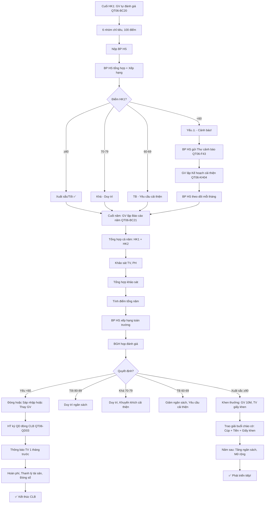

# SOP-05.5: ĐÁNH GIÁ VÀ PHÁT TRIỂN CLB

## 1. THÔNG TIN QUY TRÌNH

| **Thuộc tính** | **Nội dung** |
|---|---|
| Mã SOP | SOP-05.5 |
| Tên quy trình | Đánh giá và phát triển CLB |
| Quy trình cha | SOP-05: Quản lý CLB |
| Phiên bản | 1.0 |
| Áp dụng | HK/Năm, Liên tục |

## 2. MỤC ĐÍCH

- **Đánh giá hiệu quả**: CLB có đạt mục tiêu?
- **Cải tiến**: Phát huy tốt, Sửa yếu
- **Xếp hạng**: CLB nào tốt? CLB nào cần hỗ trợ?
- **Quyết định**: Duy trì, Phát triển hoặc Đóng CLB

## 3. PHẠM VI ÁP DỤNG

Tất cả CLB của trường

## 4. CHỈ TIÊU ĐÁNH GIÁ

### 4.1. 6 nhóm chỉ tiêu

```
╔══════════════════════════════════════════════════════════════════╗
║           6 NHÓM CHỈ TIÊU ĐÁNH GIÁ CLB                           ║
╠══════════════════════════════════════════════════════════════════╣
║ 1. SỐ LƯỢNG (Quantity) - 15 điểm                                 ║
║    • Số TV: Mục tiêu ≥80% kế hoạch (10 điểm)                     ║
║    • Tỷ lệ tham gia: ≥80% buổi (5 điểm)                          ║
╠══════════════════════════════════════════════════════════════════╣
║ 2. CHẤT LƯỢNG (Quality) - 25 điểm                                ║
║    • TV học được: ≥85% đạt mục tiêu (15 điểm)                    ║
║    • TV hài lòng: ≥85% (10 điểm)                                 ║
╠══════════════════════════════════════════════════════════════════╣
║ 3. THÀNH TÍCH (Achievement) - 20 điểm                            ║
║    • Thi đấu: Giải Quốc gia (20), TP (15), Trường (10)           ║
║    • Sự kiện: Tổ chức ≥1 sự kiện công khai (10 điểm)            ║
╠══════════════════════════════════════════════════════════════════╣
║ 4. TÀI CHÍNH (Financial) - 15 điểm                               ║
║    • Không vượt dự toán (10 điểm)                                ║
║    • Minh bạch (Công khai quý) (5 điểm)                          ║
╠══════════════════════════════════════════════════════════════════╣
║ 5. QUẢN LÝ (Management) - 15 điểm                                ║
║    • Họp đúng lịch: ≥90% (5 điểm)                                ║
║    • Hồ sơ đầy đủ (Sổ sách, Báo cáo...) (5 điểm)                ║
║    • GV tận tâm (Đánh giá TV) (5 điểm)                           ║
╠══════════════════════════════════════════════════════════════════╣
║ 6. TÁC ĐỘNG (Impact) - 10 điểm                                   ║
║    • Ảnh hưởng tích cực đến trường (5 điểm)                      ║
║    • Uy tín bên ngoài (5 điểm)                                   ║
╚══════════════════════════════════════════════════════════════════╝

TỔNG: 100 điểm
```

### 4.2. Thang điểm xếp loại

```
╔══════════════════════════════════════════════════════════════════╗
║              THANG ĐIỂM XẾP LOẠI CLB                             ║
╠══════════════════════════════════════════════════════════════════╣
║ 90-100 ĐIỂM: XUẤT SẮC ⭐⭐⭐                                      ║
║  • CLB hoạt động rất tốt                                         ║
║  • Tăng ngân sách năm sau                                        ║
║  • Khen thưởng GV, TV                                            ║
║  • Quảng bá rộng rãi                                             ║
╠══════════════════════════════════════════════════════════════════╣
║ 80-89 ĐIỂM: TỐT ⭐⭐                                             ║
║  • CLB hoạt động tốt                                             ║
║  • Duy trì ngân sách                                             ║
║  • Động viên GV, TV                                              ║
╠══════════════════════════════════════════════════════════════════╣
║ 70-79 ĐIỂM: KHÁ ⭐                                               ║
║  • CLB hoạt động ổn                                              ║
║  • Cần cải thiện 1 số điểm                                       ║
╠══════════════════════════════════════════════════════════════════╣
║ 60-69 ĐIỂM: TRUNG BÌNH                                           ║
║  • CLB còn nhiều vấn đề                                          ║
║  • Yêu cầu cải thiện nghiêm túc                                  ║
║  • Giảm ngân sách năm sau                                        ║
╠══════════════════════════════════════════════════════════════════╣
║ <60 ĐIỂM: YẾU ⚠️                                                 ║
║  • CLB hoạt động kém                                             ║
║  • Xem xét ĐÓNG CLB!                                             ║
╚══════════════════════════════════════════════════════════════════╝
```

## 5. QUY TRÌNH ĐÁNH GIÁ

### 5.1. Đánh giá giữa kỳ (Cuối HK1)

**Bước 1: GV tự đánh giá (QT06-BC20)**

```
═══════════════════════════════════════════════════════
     BÁO CÁO TỰ ĐÁNH GIÁ CLB - HK1
     CLB: ROBOTICS  GV: Thầy X
═══════════════════════════════════════════════════════

I. SỐ LƯỢNG (15 điểm):
• Số TV: 48/50 (96%) → 9/10 điểm
• Tỷ lệ tham gia: 85% → 5/5 điểm
Tổng: 14/15 điểm

II. CHẤT LƯỢNG (25 điểm):
• TV đạt mục tiêu: 90% → 15/15 điểm
• TV hài lòng: 88% → 10/10 điểm
Tổng: 25/25 điểm

III. THÀNH TÍCH (20 điểm):
• Thi đấu: Chưa có (HK1) → 0 điểm
• Sự kiện: Tổ chức Sinh nhật CLB → 10/10 điểm
Tổng: 10/20 điểm

IV. TÀI CHÍNH (15 điểm):
• Không vượt: Chi 20M/25M → 10/10 điểm
• Minh bạch: Công khai đầy đủ → 5/5 điểm
Tổng: 15/15 điểm

V. QUẢN LÝ (15 điểm):
• Họp đúng lịch: 95% → 5/5 điểm
• Hồ sơ đầy đủ → 5/5 điểm
• GV tận tâm (TV đánh giá 4.5/5) → 5/5 điểm
Tổng: 15/15 điểm

VI. TÁC ĐỘNG (10 điểm):
• Ảnh hưởng trường: Trung bình → 3/5 điểm
• Uy tín ngoài: Chưa có → 0/5 điểm
Tổng: 3/10 điểm

──────────────────────────────────────────────────────
TỔNG HK1: 82/100 điểm → XẾP LOẠI: TỐT ⭐⭐

ĐIỂM MẠNH:
• TV hài lòng cao
• Tài chính minh bạch
• GV tận tâm

ĐIỂM YẾU:
• Chưa có thành tích thi đấu (Sẽ thi HK2!)
• Tác động còn hạn chế

KẾ HOẠCH HK2:
• Tham gia Cuộc thi Robotics cấp TP
• Tổ chức Hội thi cấp trường (Mời trường khác)

GV ký: __________  Ngày: __/__/____
═══════════════════════════════════════════════════════
```

**Bước 2: Nộp BP HS (Trước Tết)**

**Bước 3: BP HS tổng hợp toàn trường**

```
Xếp hạng CLB:

| Hạng | CLB | Điểm | Xếp loại |
|------|-----|------|----------|
| 1 | CLB Bóng đá | 95 | Xuất sắc ⭐⭐⭐ |
| 2 | CLB Robotics | 82 | Tốt ⭐⭐ |
| 3 | CLB Hội họa | 78 | Khá ⭐ |
| ... | ... | ... | ... |
| 15 | CLB Cờ vua | 55 | Yếu ⚠️ |

→ CLB Cờ vua cần CẢI THIỆN NGHIÊM TÚC!
```

**Bước 4: BP HS gặp GV các CLB yếu**

```
BP HS:
"CLB Cờ vua đạt 55 điểm. Rất thấp!
 
 Vấn đề:
 • Chỉ 10/30 TV (33% kế hoạch)
 • Tỷ lệ tham gia: 60% (Thấp!)
 • TV không hài lòng: 65%
 
 Nguyên nhân?
 [GV giải thích...]
 
 Nếu HK2 không cải thiện → CLB sẽ bị ĐÓNG!"
```

### 5.2. Đánh giá cuối năm (Tháng 5)

**Bước 5: GV lập Báo cáo năm (QT06-BC21)**

**Tương tự HK1, Nhưng:**
- Tổng hợp CẢ NĂM (HK1 + HK2)
- Bổ sung: Thành tích, Sự kiện HK2
- Kế hoạch năm sau

**Bước 6: Nộp BP HS (Trước 20/5)**

**Bước 7: BP HS tổng hợp + Xếp hạng**

**Bước 8: BGH họp đánh giá (Cuối tháng 5)**

```
Nội dung:
• Xem báo cáo từng CLB
• Thảo luận
• Quyết định:
  - CLB xuất sắc: Khen thưởng, Tăng ngân sách
  - CLB tốt/khá: Duy trì
  - CLB TB: Yêu cầu cải thiện
  - CLB yếu: Đóng hoặc Sáp nhập
```

### 5.3. Khảo sát TV, PH

**Bước 9: Khảo sát TV (Cuối năm)**

```
═══════════════════════════════════════════════════════
     KHẢO SÁT ĐÁNH GIÁ CLB
     CLB: ROBOTICS  Năm học: 2024-2025
═══════════════════════════════════════════════════════

Họ tên: _______________  Lớp: ____

1. Em có hài lòng với CLB không?
   □ Rất hài lòng (5⭐)
   □ Hài lòng (4⭐)
   □ Trung bình (3⭐)
   □ Không hài lòng (2⭐)
   □ Rất không hài lòng (1⭐)

2. Về GV PHỤ TRÁCH:
   • Giảng dạy: ____/5⭐
   • Tận tâm: ____/5⭐
   • Thân thiện: ____/5⭐

3. Về NỘI DUNG:
   • Phù hợp trình độ: □ Có  □ Không (Quá dễ/Khó?)
   • Hấp dẫn: ____/5⭐
   • Bổ ích: ____/5⭐

4. Về CƠ SỞ VẬT CHẤT:
   • Phòng học: ____/5⭐
   • Thiết bị: ____/5⭐

5. Về HỌC PHÍ:
   • Hợp lý: □ Có  □ Không (Quá đắt/Rẻ?)

6. Em học được gì từ CLB?
   □ Kiến thức mới
   □ Kỹ năng
   □ Bạn bè
   □ Tự tin
   □ Khác: ________

7. Năm sau em có tiếp tục không?
   □ Có
   □ Không (Tại sao? ________)

8. Góp ý cải thiện:
   _______________________________________________
   _______________________________________________

Cảm ơn em! 💙
═══════════════════════════════════════════════════════
```

**Bước 10: Tổng hợp kết quả**

```
KẾT QUẢ KHẢO SÁT (48 TV):
• Rất hài lòng/Hài lòng: 92% ✅
• GV giảng dạy: 4.6/5⭐
• Nội dung hấp dẫn: 4.5/5⭐
• Tiếp tục năm sau: 85%

ĐIỂM TỐT:
• GV tận tâm
• Nội dung hay

ĐIỂM CẦN CẢI THIỆN:
• Phòng hơi nhỏ (15% TV phàn nàn)
• Học phí hơi cao (10% TV nói)

→ Năm sau: Xin phòng lớn hơn, Giảm học phí xuống 400K!
```

## 6. XẾP HẠNG VÀ KHEN THƯỞNG

### 6.1. Xếp hạng CLB (Cuối năm)

**Bước 11: BP HS xếp hạng (Theo tổng điểm)**

```
═══════════════════════════════════════════════════════
     XẾP HẠNG CLB NĂM HỌC 2024-2025
     (20 CLB toàn trường)
═══════════════════════════════════════════════════════

| Hạng | CLB | Điểm | Xếp loại | Giải thưởng |
|------|-----|------|----------|-------------|
| 🥇 1 | Bóng đá | 95 | Xuất sắc⭐⭐⭐| 10M |
| 🥈 2 | Robotics | 88 | Xuất sắc⭐⭐⭐| 7M |
| 🥉 3 | Hội họa | 85 | Tốt⭐⭐ | 5M |
| 4 | Âm nhạc | 82 | Tốt⭐⭐ | 3M |
| 5 | Coding | 80 | Tốt⭐⭐ | 3M |
| ... | ... | ... | ... | ... |
| 15 | Cờ vua | 55 | Yếu⚠️ | 0 (Cảnh báo!) |

NHẬN XÉT:
• TOP 5: Xuất sắc/Tốt → Duy trì, Phát triển!
• 6-14: Khá/TB → Cần cải thiện!
• 15+: Yếu → Xem xét đóng!

BGH ký: __________
═══════════════════════════════════════════════════════
```

**Bước 12: Trao giải "CLB xuất sắc" (Cuối năm)**

```
Buổi chào cờ:
HT:
"Năm nay, CLB xuất sắc nhất là: CLB BÓNG ĐÁ!
 Chúc mừng thầy [Tên GV] và 80 TV!
 
 [Vỗ tay]
 
 Mời thầy và Đại diện TV lên nhận!"

[Trao: Giấy khen + 10M tiền thưởng + Cúp]
[Chụp ảnh]
```

### 6.2. Khen thưởng cá nhân

**GV phụ trách xuất sắc:**

```
• Giấy khen từ BGH
• Tiền thưởng: 5-10M
• Tính vào điểm đánh giá GV cuối năm
• Được ưu tiên (Nếu thi GV giỏi...)
```

**TV xuất sắc:**

```
• Giấy khen từ CLB
• Quà (Sách, Đồ chơi liên quan...)
• Ghi vào Hồ sơ HS (Điểm cộng khi xét học bạ!)
• Được ưu tiên (Nếu có cơ hội đi thi đấu...)
```

## 7. PHÁT TRIỂN CLB

### 7.1. Lộ trình 3 năm

```
╔══════════════════════════════════════════════════════════════════╗
║           LỘ TRÌNH PHÁT TRIỂN CLB 3 NĂM                          ║
╠══════════════════════════════════════════════════════════════════╣
║ NĂM 1: KHỞI ĐỘNG (Startup)                                       ║
║  • Mục tiêu: Tuyển TV, Ổn định hoạt động                         ║
║  • Số TV: 30-50                                                  ║
║  • Thành tích: Không cao (Mới học!)                              ║
║  • Đánh giá: ≥70 điểm là tốt!                                    ║
╠══════════════════════════════════════════════════════════════════╣
║ NĂM 2: PHÁT TRIỂN (Growth)                                       ║
║  • Mục tiêu: Tăng chất lượng, Tham gia thi đấu                   ║
║  • Số TV: 50-80                                                  ║
║  • Thành tích: Giải cấp Trường/TP                                ║
║  • Đánh giá: ≥80 điểm                                            ║
╠══════════════════════════════════════════════════════════════════╣
║ NĂM 3: TRƯỞNG THÀNH (Maturity)                                   ║
║  • Mục tiêu: Nổi tiếng, Tạo thương hiệu                          ║
║  • Số TV: 80-100+                                                ║
║  • Thành tích: Giải Quốc gia, Quốc tế                            ║
║  • Đánh giá: ≥90 điểm → Xuất sắc!                                ║
╚══════════════════════════════════════════════════════════════════╝
```

**Ví dụ: CLB Robotics**

```
NĂM 2024 (Năm 1): KHỞI ĐỘNG
• Số TV: 50
• Học: Cơ bản (Scratch)
• Thành tích: Không
• Điểm: 75 (Khá) ⭐

NĂM 2025 (Năm 2): PHÁT TRIỂN
• Số TV: 70
• Học: Nâng cao (Python)
• Thành tích: Giải Ba cấp TP
• Điểm: 85 (Tốt) ⭐⭐

NĂM 2026 (Năm 3): TRƯỞNG THÀNH
• Số TV: 100
• Học: Chuyên sâu (AI, Machine Learning)
• Thành tích: Giải Nhì Quốc gia! 🏆
• Điểm: 92 (Xuất sắc) ⭐⭐⭐
• Nổi tiếng: Báo VTV đưa tin!

→ THÀNH CÔNG! 🎉
```

### 7.2. Mở rộng quy mô

**Bước 1: Khi CLB quá đông (>80 TV, 1 GV không xoay sở nổi)**

**Giải pháp:**

```
PHƯƠNG ÁN A: Tăng GV
• 1 GV → 2 GV
• Chia 2 ca:
  - Ca 1: Thứ 4, 15h-17h (40 TV)
  - Ca 2: Thứ 6, 15h-17h (40 TV)

PHƯƠNG ÁN B: Mở CLB 2
• CLB Robotics Cơ bản (Lớp 6-7)
• CLB Robotics Nâng cao (Lớp 8-9)

PHƯƠNG ÁN C: Giới hạn số lượng
• Chỉ nhận 80 TV
• Danh sách chờ: 20 TV
• Ưu tiên: HS đăng ký trước, HS giỏi
```

### 7.3. Nâng cấp cơ sở

**Bước 2: Xin BGH đầu tư (Nếu CLB xuất sắc)**

```
GV viết Đề xuất:
"CLB Robotics đạt 92 điểm, Xuất sắc!
 
 Đề nghị BGH:
 • Nâng cấp phòng CLB (Phòng lớn hơn)
 • Mua thêm: 10 laptop (150M)
 • Tăng ngân sách: 30M → 50M/năm
 
 Mục tiêu năm sau:
 • Tăng TV: 100 → 150
 • Giành giải Quốc tế!"

BGH:
• Xem xét
• Nếu CLB thật sự tốt → PHÊ DUYỆT! ✅
```

## 8. XỬ LÝ CLB YẾU

### 8.1. Quy trình cảnh báo

**Bước 1: CLB đạt <70 điểm (HK1)**

```
BP HS gửi Thư cảnh báo (QT06-F43):

═══════════════════════════════════════════════════════
              THƯ CẢNH BÁO
              CLB: CỜ VUA
═══════════════════════════════════════════════════════

Kính gửi: Thầy/Cô GV phụ trách

CLB Cờ vua HK1 đạt: 55/100 điểm (YẾU!)

VẤN ĐỀ:
• Số TV: 10/30 (33% kế hoạch) ⚠️
• Tỷ lệ tham gia: 60% ⚠️
• TV hài lòng: 65% ⚠️

CẢNH BÁO:
Nếu HK2 vẫn <70 điểm → CLB sẽ bị ĐÓNG!

YÊU CẦU:
• Tìm nguyên nhân
• Lập Kế hoạch cải thiện (QT06-KH04)
• Nộp trước __/__/____

Trân trọng,
BP HS
═══════════════════════════════════════════════════════
```

**Bước 2: GV lập Kế hoạch cải thiện (QT06-KH04)**

```
NGUYÊN NHÂN:
• Nội dung nhàm chán (Chỉ chơi cờ!)
• GV không nhiệt tình
• Thiếu quảng bá

GIẢI PHÁP:
• Đa dạng nội dung: Chơi cờ + Học chiến thuật + Xem video Grand Master...
• GV tăng cường tương tác
• Quảng bá: Poster đẹp hơn, Tổ chức Giải cờ nội bộ

MỤC TIÊU HK2:
• Tăng TV: 10 → 25
• Tăng tỷ lệ tham gia: 60% → 80%
• Tăng hài lòng: 65% → 80%
• Đạt: ≥75 điểm!
```

**Bước 3: BP HS theo dõi (Mỗi tháng)**

**Bước 4: Cuối HK2 - Đánh giá lại**

```
Kết quả:
• Số TV: 22 (Tăng!)
• Tỷ lệ: 75% (Tăng!)
• Hài lòng: 78% (Tăng!)
• Điểm: 72 (Khá) ⭐

→ CẢI THIỆN! Cho phép hoạt động tiếp năm sau! ✅
```

### 8.2. Đóng CLB (Nếu không cải thiện)

**Bước 5: CLB vẫn <60 điểm (Sau 2 HK cảnh báo)**

```
BGH họp:
"CLB Cờ vua vẫn 58 điểm. Không cải thiện!

QUYẾT ĐỊNH:
□ ĐÓNG CLB (Phương án 1)
□ SÁP NHẬP với CLB khác (Phương án 2 - Nếu có CLB tương tự)
□ THAY GV phụ trách (Phương án 3)

→ Chọn: Đóng CLB!"

HT ký Quyết định đóng CLB (QT06-QD03)
```

**Bước 6: Thông báo TV (1 tháng trước)**

```
GV:
"Các em, CLB Cờ vua sẽ đóng vào cuối năm.
 
 Lý do: Hoạt động không hiệu quả.
 
 Các em có thể:
 • Tham gia CLB khác (VD: CLB Logic, Toán...)
 • Hoặc Tự học cờ ở nhà!
 
 Cô xin lỗi các em!"
```

**Bước 7: Hoàn phí, Trả tài sản (Cuối năm)**

```
• Hoàn phí: Tháng chưa học (Nếu đóng trước cả năm)
• Thanh lý tài sản: Bàn cờ, Đồng hồ... → Bán hoặc Chuyển CLB khác
• Đóng sổ sách
• Nộp hồ sơ BP HS (Lưu trữ)
```

## 9. LƯU ĐỒ QUY TRÌNH



## 10. BIỂU MẪU LIÊN QUAN

| **Mã** | **Tên** |
|---|---|
| QT06-BC20 | Báo cáo tự đánh giá CLB (HK) |
| QT06-BC21 | Báo cáo đánh giá CLB (Năm) |
| QT06-F43 | Thư cảnh báo CLB yếu |
| QT06-KH04 | Kế hoạch cải thiện CLB |
| QT06-QD03 | Quyết định đóng CLB |

## 11. TIÊU CHUẨN VÀ CHỈ TIÊU

| **Chỉ tiêu** | **Mục tiêu** |
|---|---|
| Tỷ lệ CLB đạt ≥80 điểm (Xuất sắc/Tốt) | ≥ 60% |
| Tỷ lệ CLB phải đóng (Do yếu) | ≤ 10% |
| Tỷ lệ TV hài lòng (TB tất cả CLB) | ≥ 85% |
| Tỷ lệ GV hài lòng (Khảo sát GV) | ≥ 80% |

## 12. TRÁCH NHIỆM CỤ THỂ

| **Vai trò** | **Trách nhiệm** |
|---|---|
| **GV phụ trách** | Tự đánh giá, Lập báo cáo, Cải thiện |
| **BP HS** | Tổng hợp, Xếp hạng, Theo dõi CLB yếu |
| **BGH** | Đánh giá cuối cùng, Quyết định khen/Đóng CLB |
| **TV** | Tham gia khảo sát, Góp ý |

## 13. LƯU Ý QUAN TRỌNG

- ⚠️ **Công bằng**: Xếp hạng dựa trên ĐIỂM, Không dựa trên cảm tính!
- ✅ **Cơ hội sửa sai**: CLB yếu → Cảnh báo, Cho cải thiện! Không đóng ngay!
- 🔥 **Khen thưởng xứng đáng**: CLB xuất sắc → Thưởng lớn! Tạo động lực!
- ✅ **Học hỏi**: CLB tốt chia sẻ kinh nghiệm cho CLB yếu!

## 14. PHỤ LỤC

### 14.1. Case study: CLB từ Yếu → Xuất sắc

```
════════════════════════════════════════════════════════
CASE STUDY: CLB HỘI HỌA
(Từ 58 điểm → 90 điểm trong 2 năm!)
════════════════════════════════════════════════════════

NĂM 2023: YẾU (58 điểm)
• TV: 8/30 (27%)
• Tham gia: 55%
• Hài lòng: 60%

VẤN ĐỀ:
• GV A không nhiệt tình
• Nội dung: Chỉ vẽ, Không hướng dẫn kỹ thuật
• Thiếu thiết bị (Bút màu, Giấy...)

CẢNH BÁO: Cải thiện hoặc Đóng!

HÀNH ĐỘNG:
• THAY GV: A → B (GV trẻ, Năng động, Tốt nghiệp Mỹ thuật)
• Đổi nội dung: Dạy kỹ thuật (Phối màu, Bố cục...)
• Đầu tư: 10M mua Bút màu, Giấy Canson, Giá vẽ...
• Quảng bá: Tổ chức Triển lãm tranh (Mời PH xem)

NĂM 2024: KHỞI SẮC (78 điểm)
• TV: 35/40 (88%)
• Tham gia: 82%
• Hài lòng: 85%
• Thành tích: Triển lãm tranh rất thành công!

NĂM 2025: XUẤT SẮC (90 điểm)
• TV: 60 (Tăng gấp đôi!)
• Tham gia: 90%
• Hài lòng: 92%
• Thành tích:
  - Giải Nhất Cuộc thi vẽ tranh cấp TP! 🏆
  - Bán 20 tranh gây quỹ từ thiện (10M!)
  - Báo Thanh niên đưa tin!

→ THÀNH CÔNG NHU! 🎉🔥
════════════════════════════════════════════════════════
```

### 14.2. Bảng so sánh CLB qua các năm

```
CLB ROBOTICS:

| Năm | Điểm | TV | Tham gia | Hài lòng | Thành tích |
|-----|------|----|----|----------|------------|
| 2024| 75   | 50 | 85%| 88%      | Không      |
| 2025| 85   | 70 | 88%| 90%      | Giải Ba TP |
| 2026| 92   | 100| 92%| 95%      | Giải Nhì QG|

NHẬN XÉT:
✅ Số liệu TĂNG qua các năm!
✅ CLB NGÀY CÀNG TỐT!
→ Nên ĐẦU TƯ MẠNH năm sau!
```

## 15. FAQ

**Q1: CLB xuất sắc, Nhưng GV xin nghỉ (Chuyển công tác). Xử lý?**  
A: 
- Tìm GV thay thế (Có chuyên môn tương đương)
- GV cũ bàn giao (Hồ sơ, Kế hoạch, Tài sản...)
- GV mới tiếp tục phát triển CLB!

**Q2: TV phàn nàn CLB không hay, Nhưng GV nghĩ hay. Tin ai?**  
A: TIN TV! (Họ là người học!)
- Khảo sát nhiều TV (Không chỉ 1-2 em)
- Nếu đa số phàn nàn → GV phải sửa!
- Nguyên tắc: Lắng nghe TV!

**Q3: CLB đạt 95 điểm, Nhưng lỗ nặng (Chi > Thu). Có nên khen không?**  
A: KHEN! Nhưng YÊU CẦU cân đối tài chính năm sau!
- Không vì tài chính mà phủ nhận thành tích!

**Q4: Có nên công khai xếp hạng CLB không? (CLB yếu sẽ xấu hổ?)**  
A: NÊN công khai TOP 5!
KHÔNG NÊN công khai CLB yếu (Tránh xấu hổ!)
- Chỉ nói riêng với GV CLB đó!

---

**PHÊ DUYỆT**

| Trưởng BP HS | Phó HT | Hiệu trưởng |
|---|---|---|
| [Họ tên] | [Họ tên] | [Họ tên] |

---

✅ **HOÀN THÀNH SOP-05: QUẢN LÝ CLB (5 files)!** 🎉🔥📚
