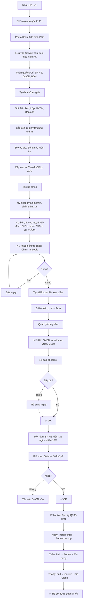

# SOP-06.1: TẠO VÀ QUẢN LÝ HỒ SƠ

## 1. THÔNG TIN QUY TRÌNH

| **Thuộc tính** | **Nội dung** |
|---|---|
| Mã SOP | SOP-06.1 |
| Tên quy trình | Tạo và quản lý hồ sơ học sinh |
| Quy trình cha | SOP-06: Hồ sơ học sinh |
| Phiên bản | 1.0 |
| Áp dụng | Khi nhận HS mới, Quản lý suốt quá trình học |

## 2. MỤC ĐÍCH

- **Hồ sơ đầy đủ**: Đủ thông tin cần thiết
- **Hệ thống hóa**: Dễ tìm, Dễ quản lý
- **Bảo mật**: Thông tin cá nhân được bảo vệ
- **Phục vụ lâu dài**: Hồ sơ dùng suốt 6-12 năm (TH-THCS)

## 3. PHẠM VI ÁP DỤNG

Tất cả học sinh của trường

## 4. CẤU TRÚC HỒ SƠ HỌC SINH

### 4.1. 3 phần chính

```
╔══════════════════════════════════════════════════════════════════╗
║              CẤU TRÚC HỒ SƠ HỌC SINH                             ║
╠══════════════════════════════════════════════════════════════════╣
║ PHẦN A: HỒ SƠ NHẬP HỌC (Admission File)                          ║
║  • Giấy tờ gốc: Khai sinh, Sổ HK, Học bạ...                      ║
║  • Hồ sơ tuyển sinh: Đơn xin học, Hợp đồng...                    ║
║  • Hình thức: GIẤY (Tủ hồ sơ) + SỐ (Scan lưu server)             ║
║  • Lưu: VĨNH VIỄN (Đến khi HS tốt nghiệp/Chuyển đi)              ║
╠══════════════════════════════════════════════════════════════════╣
║ PHẦN B: HỒ SƠ HỌC TẬP (Academic Record)                          ║
║  • Điểm số (Từng môn, Từng HK)                                   ║
║  • Nhận xét GVCN (Mỗi HK)                                        ║
║  • Khen thưởng, Kỷ luật                                          ║
║  • Hoạt động ngoại khóa, CLB                                     ║
║  • Hình thức: SỐ (Phần mềm quản lý)                              ║
║  • Cập nhật: LIÊN TỤC                                            ║
╠══════════════════════════════════════════════════════════════════╣
║ PHẦN C: HỒ SƠ SỨC KHỎE (Health Record)                           ║
║  • Phiếu sức khỏe định kỳ (Mỗi năm 1 lần)                        ║
║  • Sổ tiêm chủng                                                 ║
║  • Bệnh sử, Dị ứng                                               ║
║  • Khám bệnh, Điều trị (Nếu có)                                  ║
║  • Hình thức: GIẤY (Phòng Y tế) + SỐ                             ║
║  • Cập nhật: MỖI NĂM (Khám định kỳ)                              ║
╚══════════════════════════════════════════════════════════════════╝
```

### 4.2. Sơ đồ hồ sơ

```
HỒ SƠ HỌC SINH: HS-2024-001 - Nguyễn Văn A
│
├─ PHẦN A: HỒ SƠ NHẬP HỌC (Tủ hồ sơ - Phòng HS)
│  ├─ Giấy khai sinh (Bản sao công chứng)
│  ├─ Sổ hộ khẩu (Bản sao)
│  ├─ Học bạ (Bản gốc) ⚠️ Trường giữ!
│  ├─ Phiếu sức khỏe (Bản gốc)
│  ├─ Sổ tiêm chủng (Bản sao)
│  ├─ Ảnh 3×4 (6 ảnh)
│  ├─ Đơn xin học
│  ├─ Hợp đồng (Bản trường giữ)
│  ├─ Cam kết PH
│  ├─ Biên nhận đóng phí
│  ├─ Phiếu đăng ký dịch vụ (Ăn, Xe...)
│  └─ Thông tin liên hệ khẩn cấp
│
├─ PHẦN B: HỒ SƠ HỌC TẬP (Phần mềm quản lý)
│  ├─ Thông tin cơ bản (Tên, Ngày sinh, Lớp, GVCN...)
│  ├─ Điểm số
│  │  ├─ Lớp 1, HK1: Toán 8.5, Văn 9.0...
│  │  ├─ Lớp 1, HK2: Toán 9.0, Văn 9.5...
│  │  ├─ Lớp 2, HK1: ...
│  │  └─ ... (Suốt quá trình học!)
│  ├─ Nhận xét GVCN (Mỗi HK)
│  ├─ Khen thưởng (Ngày, Lý do, Hình thức)
│  ├─ Kỷ luật (Ngày, Vi phạm, Xử lý)
│  ├─ Hoạt động ngoại khóa (Ngày, Tên hoạt động)
│  ├─ CLB (Tên CLB, Năm tham gia)
│  └─ Thi đấu (Cuộc thi, Giải thưởng)
│
└─ PHẦN C: HỒ SƠ SỨC KHỎE (Phòng Y tế)
   ├─ Phiếu sức khỏe (Mỗi năm 1 lần)
   │  ├─ 2024: Cao 110cm, Nặng 20kg, Tốt
   │  ├─ 2025: Cao 115cm, Nặng 22kg, Tốt
   │  └─ ...
   ├─ Sổ tiêm chủng (Cập nhật khi tiêm)
   ├─ Bệnh sử (Bệnh mãn tính, Dị ứng...)
   └─ Sổ khám bệnh (Khi HS ốm, Đến Y tế trường)
```

## 5. QUY TRÌNH TẠO HỒ SƠ

### 5.1. Tạo hồ sơ giấy (Phần A)

**Bước 1: Nhận giấy tờ từ PH (Xem SOP-01.2)**

**Bước 2: Photo/Scan giấy tờ**

```
YÊU CẦU SCAN:
• Độ phân giải: 300 DPI
• Định dạng: PDF (Màu)
• Kích thước: <5MB/file
• Đặt tên: [MãHS]_[LoạiGiấy]_[Ngày].pdf
  VD: HS2024001_GiayKhaiSinh_20240825.pdf
```

**Bước 3: Lưu vào Server**

```
Cấu trúc thư mục:

\\Server\Ho_so_HS\
  ├─ 2024\
  │  ├─ HS2024001_Nguyen_Van_A\
  │  │  ├─ HS2024001_GiayKhaiSinh.pdf
  │  │  ├─ HS2024001_SoHoKhau.pdf
  │  │  ├─ HS2024001_HocBa.pdf
  │  │  ├─ HS2024001_PhieuSK.pdf
  │  │  ├─ HS2024001_SoTiemChung.pdf
  │  │  ├─ HS2024001_Anh.jpg (Ảnh 3×4)
  │  │  ├─ HS2024001_DonXinHoc.pdf
  │  │  ├─ HS2024001_HopDong.pdf
  │  │  └─ ... (Các giấy khác)
  │  │
  │  ├─ HS2024002_Tran_Thi_B\
  │  │  └─ ... (Tương tự)
  │  └─ ...
  │
  ├─ 2025\
  │  └─ ...
  └─ ...

PHÂN QUYỀN:
• Chỉ BP HS, GVCN, BGH xem được!
• Có log: Ai xem, Khi nào? (Bảo mật!)
```

**Bước 4: Tạo bìa hồ sơ giấy**

```
BÌA CỨNG, GHI RÕ:

┌────────────────────────────────────┐
│   [LOGO TRƯỜNG]                    │
│                                    │
│   HỒ SƠ HỌC SINH                  │
│                                    │
│   Mã: HS-2024-001                  │
│   Họ tên: NGUYỄN VĂN A            │
│   Ngày sinh: 15/03/2018            │
│   Lớp: 1A  GVCN: Nguyễn Thị X     │
│                                    │
│   [Dán ảnh 3×4]                    │
│                                    │
│   Năm nhập học: 2024               │
└────────────────────────────────────┘
```

**Bước 5: Sắp xếp giấy tờ vào bìa (Thứ tự chuẩn - 15 loại)**

```
Thứ tự từ trên xuống:

1. Phiếu kiểm tra hồ sơ (Checklist - QT06-CL02)
2. Đơn xin học
3. Hợp đồng (Bản trường giữ)
4. Cam kết PH
5. Giấy khai sinh (Bản sao công chứng)
6. Sổ hộ khẩu (Bản sao)
7. Học bạ (Bản gốc - Nếu lớp 2+)
8. Giấy chứng nhận hoàn thành (Lên cấp)
9. Giấy chuyển trường (Nếu có)
10. Phiếu sức khỏe
11. Sổ tiêm chủng (Bản sao)
12. Biên nhận đóng phí
13. Phiếu đăng ký dịch vụ
14. Ảnh 3×4 (5 ảnh còn lại)
15. Thông tin liên hệ khẩn cấp

→ Đóng dấu: "Đã kiểm tra ngày __/__/____"
```

**Bước 6: Xếp vào tủ hồ sơ**

```
NGUYÊN TẮC SẮP XẾP:

1. Theo Khối/Lớp:
   • Tủ A: Mầm non
   • Tủ B: Lớp 1
   • Tủ C: Lớp 2
   • ...

2. Trong tủ: Theo ABC (Họ tên)
   • Nguyễn...
   • Phạm...
   • Trần...
   • ...

VD: Hồ sơ "Nguyễn Văn A, Lớp 1A"
→ Tủ B (Lớp 1) → Ngăn "Nguyễn..." → Xếp theo ABC!
```

### 5.2. Tạo hồ sơ số (Phần B)

**Bước 7: NV nhập thông tin vào Phần mềm quản lý**

```
FORM NHẬP LIỆU (Phần mềm):

═══════════════════════════════════════════════════════
        THÔNG TIN HỌC SINH - HỆ THỐNG
═══════════════════════════════════════════════════════

I. THÔNG TIN CƠ BẢN:
• Mã HS: HS-2024-001 [Tự động tạo]
• Họ và tên: Nguyễn Văn A
• Giới tính: □ Nam  □ Nữ
• Ngày sinh: __/__/____
• Nơi sinh: _______________
• Dân tộc: _______________
• Quốc tịch: _______________
• CCCD/CMND (PH): _______________

II. HỌC TẬP:
• Năm học: 2024-2025
• Khối: □ MN  □ TH  □ THCS
• Lớp: ____
• GVCN: _______________
• Ngày nhập học: __/__/____
• Hình thức: □ Học chính quy  □ Học 2 buổi
• Trường cũ: _______________
• Xếp loại lớp trước: □ Giỏi  □ Khá  □ TB  □ Yếu

III. GIA ĐÌNH:

A. BỐ:
• Họ tên: _______________
• Năm sinh: ____
• Nghề nghiệp: _______________
• Nơi làm việc: _______________
• SĐT: _______________
• Email: _______________

B. MẸ:
• Họ tên: _______________
• Năm sinh: ____
• Nghề nghiệp: _______________
• Nơi làm việc: _______________
• SĐT: _______________
• Email: _______________

C. THÔNG TIN CHUNG:
• Địa chỉ: _______________
• Hoàn cảnh: □ Bình thường  □ Khó khăn  □ Đặc biệt
• Người liên hệ khẩn cấp:
  - Họ tên: _______________
  - Quan hệ: □ Ông  □ Bà  □ Cô  □ Chú  □ Khác: ___
  - SĐT: _______________

IV. SỨC KHỎE:
• Tình trạng: □ Tốt  □ Trung bình  □ Yếu
• Chiều cao: ____cm
• Cân nặng: ____kg
• Nhóm máu: □ A  □ B  □ AB  □ O
• Dị ứng: _______________
• Bệnh mãn tính: _______________
• Ghi chú đặc biệt: _______________

V. DỊCH VỤ ĐĂNG KÝ:
□ Ăn bán trú
□ Xe đưa đón (Tuyến: ___)
□ Học thêm (Môn: ___)

VI. ẢNH:
[Upload ảnh 3×4]

═══════════════════════════════════════════════════════
NV nhập ký: __________  Ngày: __/__/____
═══════════════════════════════════════════════════════
```

**Bước 8: Kiểm tra chéo (QA)**

```
NV khác kiểm tra:
• Họ tên chính tả đúng?
• Ngày sinh hợp lý? (Không thể 40/13/2018!)
• SĐT đúng 10 số?
• Email đúng format?

Nếu sai → Sửa ngay!
```

**Bước 9: Tạo tài khoản PH (Xem điểm online)**

```
Hệ thống tự động gửi:
• Username: hs2024001 (Hoặc SĐT PH)
• Password: [Tự động tạo]

Gửi email PH:
"Kính gửi PH em Nguyễn Văn A,

Tài khoản xem điểm:
• Link: https://school.edu.vn
• User: hs2024001
• Pass: ABC123xyz

Vui lòng đổi mật khẩu sau lần đăng nhập đầu!

Trân trọng,
Nhà trường"
```

## 6. QUẢN LÝ HỒ SƠ

### 6.1. Phân cấp quản lý

```
╔══════════════════════════════════════════════════════════════════╗
║           PHÂN CẤP QUẢN LÝ HỒ SƠ                                 ║
╠══════════════════════════════════════════════════════════════════╣
║ CẤP 1: GVCN                                                      ║
║  • Quản lý: 20-30 HS (1 lớp)                                     ║
║  • Quyền: Xem, Cập nhật (Điểm, Nhận xét...)                      ║
║  • Trách nhiệm: Cập nhật kịp thời, Chính xác                     ║
╠══════════════════════════════════════════════════════════════════╣
║ CẤP 2: TRƯỞNG KHỐI                                               ║
║  • Quản lý: 100-200 HS (1 khối)                                  ║
║  • Quyền: Xem, Kiểm tra                                          ║
║  • Trách nhiệm: Giám sát GVCN, Phát hiện sai sót                 ║
╠══════════════════════════════════════════════════════════════════╣
║ CẤP 3: BP HS                                                     ║
║  • Quản lý: Tất cả HS (500-1000)                                 ║
║  • Quyền: Xem, Cập nhật, Sửa, Xóa                                ║
║  • Trách nhiệm: Quản lý tổng thể, Báo cáo BGH                    ║
╠══════════════════════════════════════════════════════════════════╣
║ CẤP 4: BGH                                                       ║
║  • Quản lý: Tất cả                                               ║
║  • Quyền: Xem tất cả, Phê duyệt                                  ║
║  • Trách nhiệm: Giám sát, Quyết định                             ║
╚══════════════════════════════════════════════════════════════════╝
```

### 6.2. Quy trình kiểm tra định kỳ

**Bước 1: Mỗi HK - GVCN tự kiểm tra (QT06-CL10)**

```
CHECKLIST TỰ KIỂM TRA HỒ SƠ LỚP:

□ Phần A (Giấy):
  □ Tất cả HS đều có bìa hồ sơ?
  □ Giấy tờ đầy đủ (15 loại)?
  □ Xếp đúng thứ tự?
  □ Nằm đúng vị trí trong tủ?

□ Phần B (Số):
  □ Điểm đã nhập đủ? (Tất cả môn, Tất cả HK)
  □ Nhận xét đã viết? (Mỗi HK)
  □ Khen thưởng, Kỷ luật đã ghi?
  □ Hoạt động ngoại khóa đã cập nhật?

□ Phần C (Y tế):
  □ Phiếu SK hằng năm đã có?
  □ Thông tin dị ứng, Bệnh đã cập nhật?

TỔNG: ____/12 mục ✅

GVCN ký: __________  Ngày: __/__/____
```

**Bước 2: Mỗi năm - BP HS kiểm tra ngẫu nhiên (10% HS)**

```
BP HS chọn ngẫu nhiên 50/500 HS:
• Kiểm tra hồ sơ giấy: Đủ? Đúng thứ tự?
• Kiểm tra hồ sơ số: Khớp với giấy không?

Nếu phát hiện sai sót:
→ Yêu cầu GVCN sửa ngay!
→ Nếu sai nhiều → Phê bình GVCN!
```

### 6.3. Backup dữ liệu

**Bước 3: IT backup định kỳ (QT06-IT01)**

```
LỊCH BACKUP:

• Hằng ngày (1h sáng):
  - Backup tăng trưởng (Incremental)
  - Lưu: Server backup (Trong trường)

• Hằng tuần (Chủ nhật):
  - Backup đầy đủ (Full)
  - Lưu: Server backup + Đĩa cứng ngoài

• Hằng tháng:
  - Backup đầy đủ
  - Lưu: Server + Đĩa cứng + Cloud (Google Drive/OneDrive)

MỤC ĐÍCH:
• Nếu Server hỏng → Còn bản backup!
• Nếu mất dữ liệu → Phục hồi được!
```

## 7. LƯU ĐỒ QUY TRÌNH



## 8. BIỂU MẪU LIÊN QUAN

| **Mã** | **Tên** |
|---|---|
| QT06-CL02 | Checklist kiểm tra giấy tờ (15 loại) |
| QT06-CL10 | Checklist tự kiểm tra hồ sơ lớp (GVCN) |
| QT06-IT01 | Lịch backup dữ liệu |

## 9. TIÊU CHUẨN VÀ CHỈ TIÊU

| **Chỉ tiêu** | **Mục tiêu** |
|---|---|
| Tỷ lệ hồ sơ đầy đủ (15 giấy tờ) | 100% |
| Tỷ lệ scan rõ nét | 100% |
| Tỷ lệ hồ sơ giấy vs Số khớp nhau | ≥ 99% |
| Tần suất backup dữ liệu | Hằng ngày |

## 10. TRÁCH NHIỆM CỤ THỂ

| **Vai trò** | **Trách nhiệm** |
|---|---|
| **NV Phòng HS** | Nhận giấy, Scan, Nhập phần mềm, Tạo bìa, Xếp tủ |
| **GVCN** | Tự kiểm tra hồ sơ lớp (Mỗi HK) |
| **BP HS** | Kiểm tra ngẫu nhiên, Giám sát tổng thể |
| **IT** | Backup dữ liệu, Bảo trì hệ thống |

## 11. LƯU Ý QUAN TRỌNG

- ⚠️ **Chính xác 100%**: Sai thông tin HS → Hậu quả nghiêm trọng (Thi, Bằng...)!
- ✅ **Bảo mật tuyệt đối**: Hồ sơ = Thông tin cá nhân → Phân quyền chặt!
- 🔥 **Backup liên tục**: Mất dữ liệu = Thảm họa! Phải backup hằng ngày!
- ✅ **Cập nhật kịp thời**: HS chuyển lớp, Đổi PH... → Cập nhật ngay!

## 12. PHỤ LỤC

### 12.1. Mã hóa hồ sơ

```
MÃ HỌC SINH (Mã chính):
HS-[Năm]-[Số thứ tự]

VD: HS-2024-001
    │    │    │
    │    │    └─ Số thứ tự: 001, 002, 003...
    │    └────── Năm nhập học: 2024
    └─────────── Học sinh

MÃ PHỤ (Nếu cần):
• Mã lớp: 1A, 2B, 3C...
• Mã GVCN: GV-001, GV-002...

LIÊN KẾT:
HS-2024-001 (Nguyễn Văn A)
  → Lớp: 1A (Mã: L-2024-1A)
  → GVCN: Nguyễn Thị X (Mã: GV-015)
```

### 12.2. Xử lý hồ sơ đặc biệt

**A. HS chuyển từ nước ngoài:**

```
Cần thêm:
• Học bạ dịch công chứng (Tiếng Việt)
• Giấy xác nhận học lực tương đương (Sở GD cấp)
• Hộ chiếu (Bản sao - Nếu không có quốc tịch VN)

Lưu: Riêng thư mục "HS Quốc tế"
```

**B. HS mồ côi, Không có PH:**

```
Thông tin PH thay bằng:
• Người giám hộ (Ông bà, Cô chú...)
• Hoặc Đại diện Viện bảo trợ

Cần thêm:
• Giấy xác nhận từ UBND/Viện
• Quyết định về giám hộ (Nếu có)
```

**C. HS khuyết tật:**

```
Cần thêm:
• Giấy xác nhận khuyết tật (Nếu có)
• Báo cáo đánh giá từ chuyên gia (Tâm lý, Phục hồi chức năng...)
• IEP (Kế hoạch giáo dục cá nhân)

Mục đích: Hỗ trợ HS tốt hơn!
```

### 12.3. Quy trình kiểm tra sai sót

```
PHÁT HIỆN SAI SÓT:

VD: PH phàn nàn "Tên con tôi sai chính tả!"

QUY TRÌNH SỬA:
1. BP HS xác nhận: Thật sự sai?
   → Đối chiếu với Giấy khai sinh (Bản gốc)
   
2. Nếu thật sự sai:
   • Xin lỗi PH
   • Sửa ngay trên Phần mềm
   • In lại: Thẻ HS, Học bạ (Nếu đã in)
   • Ghi nhận: Ai nhập sai? (Để rút kinh nghiệm!)
   
3. Nếu đúng (PH nhầm):
   • Giải thích PH: "Con đúng tên theo Giấy khai sinh ạ!"
   • Nếu PH muốn đổi → Yêu cầu đi sửa Giấy khai sinh trước!
```

## 13. FAQ

**Q1: Hồ sơ giấy và Hồ sơ số khác nhau (VD: Giấy ghi Nguyễn Văn A, Số ghi Nguyễn Văn B). Tin cái nào?**  
A: TIN GIấY (Giấy khai sinh = Chính thức!)
- Sửa hồ sơ số cho khớp!
- Tìm hiểu: Ai nhập sai?

**Q2: HS đổi tên (Giấy khai sinh mới). Cập nhật thế nào?**  
A: 
1. PH mang Giấy khai sinh mới (Đã sửa) đến
2. NV đối chiếu
3. Cập nhật:
   • Scan giấy mới → Thay giấy cũ (Server)
   • Cập nhật Phần mềm
   • In lại: Thẻ, Học bạ...
4. Lưu: Giấy cũ vào "Hồ sơ cũ" (Để đối chiếu sau này)

**Q3: PH muốn xem hồ sơ giấy của con. Cho không?**  
A: CHO! (Hồ sơ con = Quyền của PH!)
- PH đến trường
- Xuất trình CMND/CCCD (Xác nhận đúng PH)
- NV lấy hồ sơ ra cho xem (KHÔNG cho mang về!)
- PH xem xong → Trả lại!

**Q4: Mất hồ sơ giấy (Cháy, Lụt...). Xử lý?**  
A: 
- May mắn: Có bản scan trên Server!
- Phục hồi: In lại từ file scan!
- Nhưng: Học bạ gốc mất → Phải xin Sở GD cấp lại (Rất mất thời gian!)
→ Vì vậy: Bảo quản hồ sơ giấy CẨN THẬN! Tủ chống cháy, Chống nước!

---

**PHÊ DUYỆT**

| NV Phòng HS | Trưởng BP HS | Phó HT |
|---|---|---|
| [Họ tên] | [Họ tên] | [Họ tên] |
