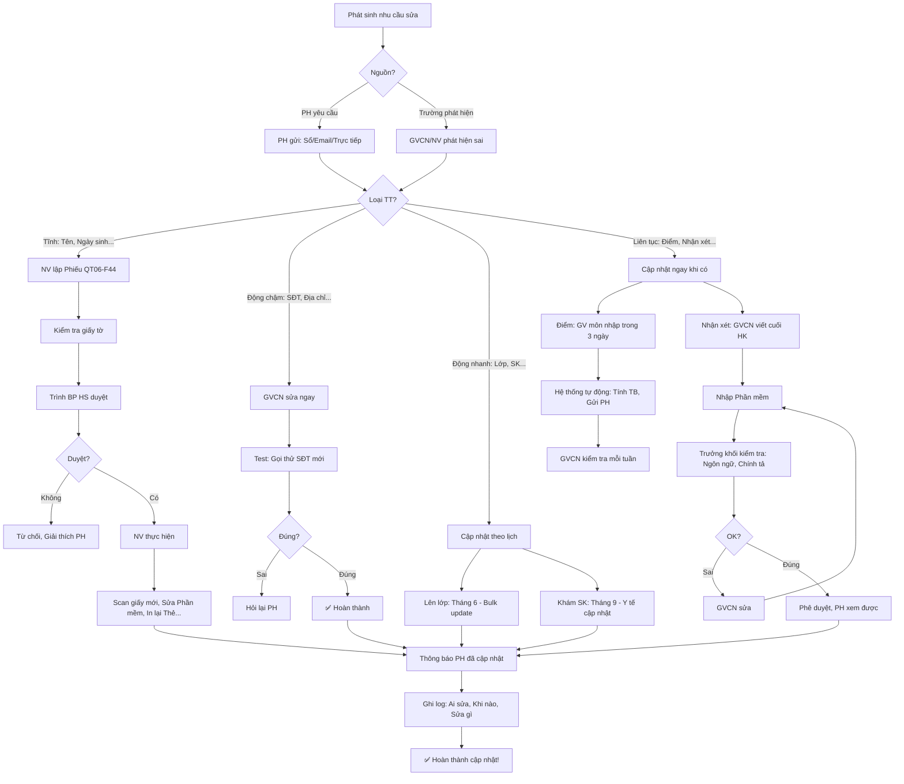

# SOP-06.2: CẬP NHẬT THÔNG TIN HỌC SINH

## 1. THÔNG TIN QUY TRÌNH

| **Thuộc tính** | **Nội dung** |
|---|---|
| Mã SOP | SOP-06.2 |
| Tên quy trình | Cập nhật thông tin học sinh |
| Quy trình cha | SOP-06: Hồ sơ học sinh |
| Phiên bản | 1.0 |
| Áp dụng | Liên tục, Khi có thay đổi |

## 2. MỤC ĐÍCH

- **Thông tin luôn mới**: Không lỗi thời, Chính xác
- **Phục vụ tốt**: Liên hệ PH đúng SĐT, Gửi thông báo đúng email
- **Đánh giá đúng**: Điểm số, Nhận xét cập nhật kịp thời
- **An toàn**: Biết HS dị ứng gì, Bệnh gì → Chăm sóc tốt

## 3. PHẠM VI ÁP DỤNG

Tất cả học sinh, Tất cả thông tin thay đổi

## 4. PHÂN LOẠI THÔNG TIN

### 4.1. Theo tính chất thay đổi

```
╔══════════════════════════════════════════════════════════════════╗
║           4 LOẠI THÔNG TIN THEO TẦN SUẤT THAY ĐỔI                ║
╠══════════════════════════════════════════════════════════════════╣
║ 1. THÔNG TIN TĨNH (Static - Ít thay đổi)                        ║
║    • Họ tên, Ngày sinh, Giới tính...                             ║
║    • Giấy khai sinh, Sổ hộ khẩu...                               ║
║    • Tần suất thay đổi: Hiếm (1-2 lần/toàn bộ quá trình học)    ║
║    • Cập nhật: Khi PH yêu cầu (Có giấy tờ chứng minh)            ║
╠══════════════════════════════════════════════════════════════════╣
║ 2. THÔNG TIN ĐỘNG CHẬM (Slow-changing)                          ║
║    • Địa chỉ, SĐT PH, Email...                                   ║
║    • Nghề nghiệp PH                                              ║
║    • Tần suất: Thỉnh thoảng (VD: Chuyển nhà, Đổi số...)          ║
║    • Cập nhật: Khi PH báo (Qua Sổ liên lạc, Email...)            ║
╠══════════════════════════════════════════════════════════════════╣
║ 3. THÔNG TIN ĐỘNG NHANH (Fast-changing)                         ║
║    • Lớp (Mỗi năm đổi), GVCN                                     ║
║    • Chiều cao, Cân nặng (Mỗi năm khám)                          ║
║    • Tần suất: Thường xuyên                                      ║
║    • Cập nhật: Đầu năm học, Sau khám SK...                       ║
╠══════════════════════════════════════════════════════════════════╣
║ 4. THÔNG TIN LIÊN TỤC (Continuous)                              ║
║    • Điểm số (Mỗi bài kiểm tra, Mỗi HK)                          ║
║    • Nhận xét GVCN (Mỗi HK, Mỗi tháng...)                        ║
║    • Điểm danh (Mỗi ngày!)                                       ║
║    • Khen thưởng, Kỷ luật (Khi có)                               ║
║    • Tần suất: Hằng ngày/tuần/HK                                 ║
║    • Cập nhật: Ngay khi phát sinh                                ║
╚══════════════════════════════════════════════════════════════════╝
```

### 4.2. Quy trình cập nhật theo loại

| **Loại** | **Người cập nhật** | **Khi nào** | **Phê duyệt** |
|---|---|---|---|
| **Tĩnh** | NV Phòng HS | Khi PH yêu cầu | BP HS |
| **Động chậm** | GVCN hoặc NV | Khi PH báo | GVCN |
| **Động nhanh** | GVCN, Y tế | Đầu năm, Sau khám | Không cần |
| **Liên tục** | GVCN, GV môn | Ngay khi có | Không cần |

## 5. QUY TRÌNH CẬP NHẬT

### 5.1. Cập nhật thông tin tĩnh (Hiếm khi)

**Bước 1: PH yêu cầu sửa**

```
VD: PH đến: "Con em đổi tên rồi ạ! Từ Nguyễn Văn A → Nguyễn Văn B"

NV: "Quý PH có giấy tờ không ạ?"
PH: [Đưa Giấy khai sinh mới - Đã sửa tên]

NV: "Dạ, Em xem. Đúng rồi ạ!"
```

**Bước 2: NV kiểm tra giấy tờ**

```
• Giấy khai sinh mới có hợp lệ?
  - Có dấu cơ quan?
  - Còn hiệu lực?
  
• Tên mới khác tên cũ thế nào?
  - Nguyễn Văn A → Nguyễn Văn B (Đổi tên)
```

**Bước 3: Lập Phiếu đề xuất sửa (QT06-F44)**

```
═══════════════════════════════════════════════════════
      PHIẾU ĐỀ XUẤT SỬA THÔNG TIN HỌC SINH
═══════════════════════════════════════════════════════

Mã HS: HS-2024-001

THÔNG TIN CŨ:
• Họ tên: Nguyễn Văn A
• Ngày sinh: 15/03/2018
• ...

THÔNG TIN MỚI:
• Họ tên: Nguyễn Văn B
• Ngày sinh: 15/03/2018 (Không đổi)
• ...

LÝ DO: PH đổi tên con (Theo Giấy khai sinh mới)

GIẤY TỜ CHỨNG MINH:
• Giấy khai sinh mới (Số: _______, Ngày: __/__/____)

ĐỀ XUẤT:
□ Sửa trên Phần mềm
□ In lại: Thẻ HS, Học bạ
□ Thông báo: GVCN, GV môn

NV ký: __________  Ngày: __/__/____

---PHÊ DUYỆT---
□ Đồng ý    □ Không đồng ý (Lý do: _______)

BP HS ký: __________  Ngày: __/__/____
═══════════════════════════════════════════════════════
```

**Bước 4: Trình BP HS phê duyệt**

**Bước 5: Sau khi duyệt → NV thực hiện**

```
1. Scan Giấy khai sinh mới → Lưu Server (Thay file cũ)
2. Sửa Phần mềm:
   • Họ tên: Nguyễn Văn A → Nguyễn Văn B
   • Ghi log: "Đổi tên ngày __/__/____, Lý do: PH đổi tên"
3. In lại: Thẻ HS (Nếu đã phát)
4. Thông báo GVCN: "Bạn A giờ đổi tên thành B. Cô lưu ý nhé!"
5. Hồ sơ giấy: Thêm Giấy mới, Giữ giấy cũ (Đóng dấu "Đã hết hiệu lực")
```

### 5.2. Cập nhật thông tin động chậm (Thỉnh thoảng)

**VD: PH đổi SĐT**

**Bước 1: PH báo (Qua Sổ liên lạc hoặc Gọi điện)**

```
Ghi Sổ:
"Cô ơi, SĐT mẹ em đổi rồi ạ!
 SĐT mới: 0987-xxx-xxx
 
 HS ký: __________"
```

**Bước 2: GVCN cập nhật (Ngay)**

```
GVCN:
• Đăng nhập Phần mềm
• Tìm HS: Nguyễn Văn A
• Sửa: SĐT Mẹ (Cũ: 0913-xxx-xxx → Mới: 0987-xxx-xxx)
• Lưu!

HOẶC:

GVCN ghi phiếu (QT06-F45):
"HS: Nguyễn Văn A
 Sửa: SĐT Mẹ: 0913... → 0987..."
 
→ Chuyển NV Phòng HS sửa!
```

**Bước 3: Test ngay (Gọi thử SĐT mới)**

```
GVCN gọi: 0987-xxx-xxx
PH: "A lô?"
GVCN: "Chào quý PH, Cô là GVCN lớp 1A..."
PH: "Dạ, Cô gì ạ?"
GVCN: "Cô xác nhận SĐT mới của PH. Cảm ơn ạ!"

→ SĐT đúng! ✅
```

### 5.3. Cập nhật thông tin động nhanh (Thường xuyên)

**A. Lên lớp (Mỗi năm)**

```
Tháng 6 (Cuối năm học):
BP HS:
• Cập nhật hàng loạt (Bulk update):
  - Lớp 1A → Lớp 2A
  - Lớp 2B → Lớp 3B
  - ...
• Cập nhật GVCN:
  - Lớp 1A: GVCN X → GVCN Y (Năm sau)
  
Công cụ: Excel + Phần mềm
```

**B. Khám sức khỏe (Mỗi năm 1 lần)**

```
Tháng 9 (Đầu năm):
• Y tế khám HS (Từng lớp)
• Ghi: Chiều cao, Cân nặng, Tình trạng SK
• Cập nhật vào Phần mềm (Phần Sức khỏe)

VD: Nguyễn Văn A
• 2024: Cao 110cm, Nặng 20kg, Tốt
• 2025: Cao 115cm, Nặng 22kg, Tốt (Tăng 5cm!)
```

### 5.4. Cập nhật thông tin liên tục (Hằng ngày/tuần/HK)

**A. Điểm số**

```
QUY TRÌNH:
1. GV môn chấm bài (VD: Kiểm tra Toán 15 phút)
2. GV môn nhập điểm vào Phần mềm (Trong 3 ngày)
3. GVCN kiểm tra (Điểm đã nhập đủ chưa?)
4. Hệ thống tự động:
   • Tính ĐTB môn
   • Tính ĐTB chung
   • Thông báo PH (App/Email)

VD: Bài Toán, Bạn A: 8.5
→ GV Toán nhập → Hệ thống lưu → PH nhận thông báo:
"Con A vừa có điểm Toán: 8.5/10"
```

**B. Nhận xét GVCN (Mỗi HK)**

```
Cuối HK:
GVCN viết nhận xét (Trên Phần mềm):

NHẬN XÉT HK1 - LỚP 1A - NGUYỄN VĂN A:

"A là em ngoan, Học tập chăm chỉ.
 
 ĐIỂM TỐT:
 • Đến lớp đều đặn (Chuyên cần 100%)
 • Bài tập làm đầy đủ
 • Giúp bạn tích cực
 
 ĐIỂM CẦN CẢI THIỆN:
 • Môn Toán còn yếu (ĐTB 6.5)
 • Cần luyện tập thêm về Phép cộng có nhớ
 
 HƯỚNG PHÁT TRIỂN:
 • HK2, Em cần tập trung Toán hơn
 • Cô sẽ hỗ trợ em phụ đạo
 
 Nhìn chung, Em học tập tốt! Cô tin em sẽ tiến bộ!
 
 GVCN: Nguyễn Thị X
 Ngày: 25/12/2024"

→ Lưu vào hồ sơ HS
→ PH xem được (Qua App/Web)
```

**C. Khen thưởng, Kỷ luật**

```
Khi có:
1. GVCN ghi nhận ngay:
   • Ngày: 15/10/2024
   • Loại: □ Khen thưởng  □ Kỷ luật
   • Nội dung: "HS giỏi toàn diện HK1"
   • Hình thức: Giấy khen
   
2. Lưu vào hồ sơ
3. PH nhận thông báo
```

**D. Hoạt động ngoại khóa, CLB**

```
Khi HS tham gia:
1. GVCN/GV CLB ghi nhận:
   • Hoạt động: "Ngày hội thể thao"
   • Ngày: 15/11/2024
   • Vai trò: Tham gia thi Chạy 100m
   • Kết quả: Giải Ba
   
2. Lưu vào hồ sơ (Phần "Hoạt động ngoại khóa")
```

## 6. QUY TRÌNH YÊU CẦU SỬA ĐỔI

### 6.1. PH yêu cầu (Chủ động)

**Bước 1: PH gửi yêu cầu**

```
HÌNH THỨC:
• Ghi Sổ liên lạc
• Gửi email GVCN/Phòng HS
• Đến trực tiếp

NỘI DUNG:
"Em [Tên HS] đổi SĐT mẹ:
 Cũ: 0913-xxx-xxx
 Mới: 0987-xxx-xxx
 
 Xin trường cập nhật!
 
 PH ký: __________"
```

**Bước 2: GVCN/NV tiếp nhận**

**Bước 3: Xử lý theo loại thông tin**

```
THÔNG TIN ÍT QUAN TRỌNG (SĐT, Email, Địa chỉ...):
→ GVCN tự sửa (Không cần phê duyệt)

THÔNG TIN QUAN TRỌNG (Họ tên, Ngày sinh...):
→ NV lập Phiếu → BP HS duyệt (QT06-F44)
```

**Bước 4: Thông báo PH đã cập nhật**

```
GVCN nhắn tin:
"Quý PH, Trường đã cập nhật SĐT mới của PH!
 
 Xin cảm ơn!"
```

### 6.2. Trường phát hiện (Bị động)

**Bước 1: GVCN/NV phát hiện sai sót**

```
VD: Gọi PH (SĐT trong hồ sơ): "Thuê bao không tồn tại!"

→ SĐT SAI!
```

**Bước 2: Liên hệ PH (SĐT khác, Email...)**

```
GVCN:
• Gọi SĐT Bố (Nếu Mẹ không được)
• Hoặc Gửi email
• Hoặc Hỏi HS: "Bạn A, SĐT mẹ bao nhiêu?"
```

**Bước 3: Cập nhật ngay**

**Bước 4: Nhắc PH (Lần sau báo kịp thời!)**

## 7. CẬP NHẬT HỒ SƠ HỌC TẬP

### 7.1. Nhập điểm

**Quy trình chuẩn:**

```
╔══════════════════════════════════════════════════════════════════╗
║           QUY TRÌNH NHẬP ĐIỂM                                    ║
╠══════════════════════════════════════════════════════════════════╣
║ BƯỚC 1: GV môn chấm bài (Trong 3 ngày sau kiểm tra)              ║
║  • Ghi điểm vào sổ điểm giấy (Dự phòng)                          ║
║  • Nhập vào Phần mềm                                             ║
╠══════════════════════════════════════════════════════════════════╣
║ BƯỚC 2: Phần mềm tự động:                                        ║
║  • Lưu vào hồ sơ HS                                              ║
║  • Tính ĐTB môn (Nếu đủ điểm thành phần)                         ║
║  • Gửi thông báo PH                                              ║
╠══════════════════════════════════════════════════════════════════╣
║ BƯỚC 3: GVCN kiểm tra (Mỗi tuần):                                ║
║  • GV đã nhập đủ điểm chưa?                                      ║
║  • Nếu thiếu → Nhắc GV môn!                                      ║
╠══════════════════════════════════════════════════════════════════╣
║ BƯỚC 4: Cuối HK - Hệ thống tự động:                              ║
║  • Tính ĐTB các môn                                              ║
║  • Tính ĐTB chung HK                                             ║
║  • Xếp loại: Giỏi/Khá/TB/Yếu                                     ║
║  • In Học bạ, Bảng điểm                                          ║
╚══════════════════════════════════════════════════════════════════╝
```

**Xử lý sai sót:**

```
TRƯỜNG HỢP: PH phát hiện điểm sai!

PH: "Con em bài Toán được 8.5, Sao ghi 6.5?"

GVCN:
1. Kiểm tra sổ điểm GV môn (Bản giấy)
2. Nếu giấy ghi 8.5 → Lỗi nhập liệu!
   → Sửa: 6.5 → 8.5
   → Xin lỗi PH
   → Nhắc GV Toán: "Lần sau cẩn thận hơn!"
   
3. Nếu giấy ghi 6.5 → Đúng!
   → Giải thích PH: "Con em được 6.5 ạ. Đây là bài photo!"
   [Cho PH xem]
```

### 7.2. Viết nhận xét

**Quy trình:**

```
Cuối HK (1 tuần trước thi):

BƯỚC 1: GVCN soạn nhận xét (Cho 25 HS/lớp)

MẪU NHẬN XÉT (QT06-TL04 - Template):

"[Tên HS] là em [Tính cách chung].

ĐIỂM TỐT:
• [Điểm tích cực 1]
• [Điểm tích cực 2]
• [Điểm tích cực 3]

ĐIỂM CẦN CẢI THIỆN:
• [Điểm cần cải thiện 1]
• [Điểm cần cải thiện 2]

HƯỚNG PHÁT TRIỂN:
• HK sau, Em cần [Gợi ý]

Nhìn chung, [Tổng kết]."

BƯỚC 2: Nhập vào Phần mềm

BƯỚC 3: Trưởng khối kiểm tra (QA):
• Ngôn ngữ có lịch sự?
• Có lỗi chính tả không?
• Có công kích HS không? (VD: "Em rất hư!" → Sửa!)

BƯỚC 4: GVCN sửa (Nếu có lỗi)

BƯỚC 5: Phê duyệt → PH xem được!
```

## 8. LƯU ĐỒ QUY TRÌNH



## 9. BIỂU MẪU LIÊN QUAN

| **Mã** | **Tên** |
|---|---|
| QT06-F44 | Phiếu đề xuất sửa thông tin HS (Thông tin tĩnh) |
| QT06-F45 | Phiếu yêu cầu sửa (Thông tin động - GVCN gửi NV) |
| QT06-TL04 | Template nhận xét HS |

## 10. TIÊU CHUẨN VÀ CHỈ TIÊU

| **Chỉ tiêu** | **Mục tiêu** |
|---|---|
| Thời gian cập nhật thông tin tĩnh (Sau khi PH yêu cầu) | ≤ 3 ngày |
| Thời gian cập nhật thông tin động | ≤ 1 ngày |
| Thời gian GV nhập điểm (Sau kiểm tra) | ≤ 3 ngày |
| Tỷ lệ sai sót thông tin | < 1% |

## 11. TRÁCH NHIỆM CỤ THỂ

| **Vai trò** | **Trách nhiệm** |
|---|---|
| **PH** | Báo khi thông tin thay đổi (SĐT, Địa chỉ...) |
| **GVCN** | Cập nhật thông tin động, Nhập điểm, Viết nhận xét |
| **GV môn** | Nhập điểm đúng hạn |
| **NV Phòng HS** | Cập nhật thông tin tĩnh, Kiểm tra |
| **IT** | Bảo trì phần mềm, Hỗ trợ kỹ thuật |

## 12. LƯU Ý QUAN TRỌNG

- ⚠️ **Cập nhật NGAY**: Không trì hoãn! Thông tin cũ → Gây rắc rối!
- ✅ **Kiểm tra KỸ**: Trước khi lưu, Kiểm tra lại! (Tránh sai!)
- 🔥 **Ghi log**: Ai sửa gì, Khi nào → Truy vết được!
- ✅ **Thông báo PH**: Sửa xong → Báo PH biết!

## 13. PHỤ LỤC

### 13.1. Lịch cập nhật chuẩn (Timeline)

```
THÁNG 8 (Trước khai giảng):
□ Tạo hồ sơ HS mới
□ Cập nhật: Lớp mới, GVCN mới (HS cũ)

THÁNG 9 (Đầu năm):
□ Khám SK → Cập nhật: Chiều cao, Cân nặng
□ Đăng ký dịch vụ → Cập nhật: Ăn, Xe...

THÁNG 9-11 (HK1):
□ Nhập điểm liên tục (GV môn)
□ Ghi khen thưởng, Kỷ luật (Khi có)
□ Ghi hoạt động ngoại khóa (Khi có)

THÁNG 12 (Cuối HK1):
□ GVCN viết nhận xét HK1
□ Hệ thống tính ĐTB HK1, Xếp loại
□ In Học bạ, Phát PH

THÁNG 1-5 (HK2):
□ Tương tự HK1

THÁNG 5 (Cuối HK2):
□ GVCN viết nhận xét HK2
□ Hệ thống tính ĐTB cả năm
□ Xếp loại: Lên lớp/Ở lại
□ In Học bạ

THÁNG 6:
□ Cập nhật: Lên lớp (Bulk update)
□ HS tốt nghiệp → Chuyển hồ sơ sang "Đã tốt nghiệp"
```

### 13.2. Xử lý tình huống phức tạp

**A. PH ly hôn (Thay đổi thông tin PH):**

```
VD: Bố Mẹ ly hôn, Con ở với Mẹ

PH MẸ yêu cầu:
"Xóa thông tin Bố đi! Chỉ liên hệ Mẹ!"

TRƯỜNG:
"Chúng em hiểu. Nhưng:
 • Theo quy định, Hồ sơ phải có thông tin cả Bố và Mẹ
 • Chúng em sẽ:
   - Ưu tiên liên hệ Mẹ (SĐT Mẹ để đầu tiên)
   - Chỉ liên hệ Bố khi: Khẩn cấp + Không liên lạc được Mẹ
   
 Quý PH đồng ý không ạ?"

→ Cập nhật:
  - Ghi chú: "Ưu tiên liên hệ Mẹ"
  - Không xóa thông tin Bố (Vẫn giữ - Phòng trường hợp)
```

**B. Thay đổi loạt (VD: Cả lớp chuyển GVCN):**

```
Tháng 11: Cô X nghỉ việc
→ Lớp 5A chuyển GVCN: Cô X → Cô Y

BP HS:
1. Sửa hàng loạt (Bulk update):
   • Chọn tất cả HS lớp 5A (25 HS)
   • Sửa GVCN: X → Y
   • Lưu!
   
2. Thông báo:
   • Gửi email PH
   • Thông báo HS
   
3. Bàn giao: Cô X → Cô Y
   • Sổ sách
   • Hồ sơ (Nếu có)
   • Thông tin đặc biệt về từng HS
```

### 13.3. Bảo mật khi cập nhật

```
NGUYÊN TẮC:
✅ Chỉ người có QUYỀN mới sửa được!
   VD: GVCN chỉ sửa HS lớp mình, Không sửa lớp khác!
   
✅ Mọi thao tác đều GHI LOG:
   "GVCN X sửa SĐT PH của HS A, Ngày 15/10, 9h30"
   → Nếu sửa sai → Biết ai sửa!
   
✅ Thông tin NHẠY CẢM (Bệnh tật, Hoàn cảnh...) → Phân quyền cao!
   Chỉ GVCN, Y tế, BGH xem được!
```

## 14. FAQ

**Q1: PH yêu cầu xóa thông tin con (Rút con khỏi trường). Có xóa không?**  
A: KHÔNG XÓA! Chỉ chuyển sang trạng thái "Đã thôi học"!
- Hồ sơ vẫn lưu (5 năm - Theo quy định)
- Nhưng: Không xuất hiện trong danh sách HS hiện tại!

**Q2: GV môn nhập điểm sai (Nhầm bài A của HS này sang HS kia). Xử lý?**  
A: 
- Sửa ngay!
- Thông báo cả 2 PH: Xin lỗi + Giải thích!
- Rút kinh nghiệm: GV phải cẩn thận!

**Q3: Hệ thống tính ĐTB sai (Bug phần mềm). Xử lý?**  
A: 
- Tính lại bằng TAY! (Không tin hệ thống!)
- Báo IT sửa bug
- Kiểm tra lại tất cả HS (Không chỉ 1 em!)

**Q4: GVCN viết nhận xét "Em rất hư, Hay gây gổ". PH phản đối. Xử lý?**  
A: 
- Trưởng khối yêu cầu GVCN sửa!
- Ngôn ngữ phải: Tích cực, Xây dựng!
- Sửa: "Em cần rèn luyện kỹ năng kiểm soát cảm xúc"

---

**PHÊ DUYỆT**

| GVCN | Trưởng BP HS | Phó HT |
|---|---|---|
| [Họ tên] | [Họ tên] | [Họ tên] |
