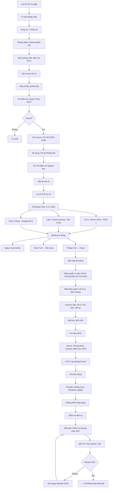

# SOP-06.3: LƯU TRỮ VÀ BẢO MẬT HỒ SƠ

## 1. THÔNG TIN QUY TRÌNH

| **Thuộc tính** | **Nội dung** |
|---|---|
| Mã SOP | SOP-06.3 |
| Tên quy trình | Lưu trữ và bảo mật hồ sơ học sinh |
| Quy trình cha | SOP-06: Hồ sơ học sinh |
| Phiên bản | 1.0 |
| Áp dụng | Liên tục |

## 2. MỤC ĐÍCH

- **Bảo quản an toàn**: Hồ sơ không mất, Hỏng
- **Bảo mật tuyệt đối**: Thông tin cá nhân được bảo vệ
- **Tuân thủ pháp luật**: Theo Luật Bảo vệ dữ liệu cá nhân
- **Truy xuất nhanh**: Cần hồ sơ → Tìm được ngay

## 3. PHẠM VI ÁP DỤNG

- Tất cả hồ sơ HS (Giấy + Số)
- Tất cả cấp bảo mật

## 4. LƯU TRỮ HỒ SƠ GIẤY

### 4.1. Yêu cầu tủ hồ sơ

```
╔══════════════════════════════════════════════════════════════════╗
║              YÊU CẦU TỦ HỒ SƠ                                    ║
╠══════════════════════════════════════════════════════════════════╣
║ 1. VẬT LIỆU:                                                     ║
║    • Tủ sắt hoặc Tủ gỗ cứng (Không tủ nhựa!)                     ║
║    • Chống cháy (Fire-resistant) - Ưu tiên!                      ║
║    • Chống nước (Nếu vùng ngập)                                  ║
╠══════════════════════════════════════════════════════════════════╣
║ 2. KHÓA:                                                         ║
║    • Khóa cơ (2-3 chìa) + Khóa số (Mã PIN)                       ║
║    • Chỉ: BP HS, HT, Phó HT có chìa/Mã                           ║
║    • Không để chìa tại chỗ! (Giữ cẩn thận!)                      ║
╠══════════════════════════════════════════════════════════════════╣
║ 3. VỊ TRÍ:                                                       ║
║    • Phòng riêng (Phòng Hồ sơ/Phòng BP HS)                       ║
║    • Có camera giám sát                                          ║
║    • Không đặt gần: Cửa sổ, Nguồn nước, Lò sưởi...               ║
╠══════════════════════════════════════════════════════════════════╣
║ 4. MÔI TRƯỜNG:                                                   ║
║    • Khô ráo (Độ ẩm <70%)                                        ║
║    • Thoáng mát (Nhiệt độ 20-25°C)                               ║
║    • Có máy hút ẩm (Nếu vùng ẩm)                                 ║
║    • Có bình PCCC (Gần tủ)                                       ║
╚══════════════════════════════════════════════════════════════════╝
```

### 4.2. Quy trình lấy/Trả hồ sơ

**Bước 1: Người cần hồ sơ điền Phiếu (QT06-F46)**

```
═══════════════════════════════════════════════════════
        PHIẾU MƯỢN HỒ SƠ HỌC SINH
═══════════════════════════════════════════════════════

Người mượn: _______________  Chức vụ: _______
Mục đích: 
□ Kiểm tra thông tin
□ Sao chụp
□ Cấp giấy tờ
□ Khác: ________________

Hồ sơ mượn:
• Mã HS: HS-2024-001
• Họ tên: Nguyễn Văn A
• Lớp: 1A

Thời gian dự kiến: ____ giờ

Người mượn ký: __________
Ngày: __/__/____  Giờ: ____

---NGƯỜI CHO MƯỢN (NV Phòng HS)---
□ Đồng ý cho mượn
□ Không đồng ý (Lý do: _______)

NV ký: __________  Giờ: ____

---TRẢ HỒ SƠ---
Ngày: __/__/____  Giờ: ____
Tình trạng: □ Nguyên vẹn  □ Hư hỏng: ______

NV nhận ký: __________
═══════════════════════════════════════════════════════
```

**Bước 2: NV kiểm tra**

```
• Người mượn có quyền không?
  - GVCN lớp này? ✅ Cho mượn!
  - GVCN lớp khác? ❌ Không cho! (Trừ khi có văn bản BGH!)
  
• Mục đích hợp lý?
  - Kiểm tra thông tin? ✅
  - Mang về nhà? ❌ KHÔNG!
```

**Bước 3: Cho mượn (Nếu đủ điều kiện)**

```
NV:
• Mở tủ (Nhập mã PIN hoặc Dùng chìa)
• Lấy hồ sơ HS A ra
• Kiểm tra: Còn nguyên vẹn?
• Giao cho người mượn
• Ghi Sổ mượn (QT06-ST06)
```

**Bước 4: Sử dụng (Người mượn)**

```
NGUYÊN TẮC:
✅ Chỉ xem tại Phòng HS! (Không mang đi!)
✅ Không làm hỏng, Rách, Bẩn!
✅ Không photo (Trừ khi có phép!)
✅ Trả ngay khi xong!
```

**Bước 5: Trả hồ sơ**

```
NV:
• Nhận hồ sơ
• Kiểm tra: Còn đủ giấy tờ? Nguyên vẹn?
• Nếu OK → Xếp lại vào tủ
• Nếu hỏng → Yêu cầu người mượn chịu trách nhiệm!
• Ghi Sổ: Đã trả!
```

## 5. BẢO MẬT HỒ SƠ SỐ

### 5.1. Phân quyền hệ thống

```
╔══════════════════════════════════════════════════════════════════╗
║           HỆ THỐNG PHÂN QUYỀN 4 CẤP                              ║
╠══════════════════════════════════════════════════════════════════╣
║ CẤP 1: GVCN (Class Teacher)                                      ║
║  • Xem: Tất cả thông tin HS lớp mình                             ║
║  • Sửa: Điểm (Nhập), Nhận xét, SĐT PH, Địa chỉ...                ║
║  • KHÔNG sửa: Họ tên, Ngày sinh, Học bạ...                       ║
║  • KHÔNG xem: HS lớp khác                                        ║
╠══════════════════════════════════════════════════════════════════╣
║ CẤP 2: TRƯỞNG KHỐI (Grade Leader)                                ║
║  • Xem: Tất cả HS khối mình                                      ║
║  • Sửa: Lớp (Xếp lớp lại), GVCN                                  ║
║  • KHÔNG xem: HS khối khác                                       ║
╠══════════════════════════════════════════════════════════════════╣
║ CẤP 3: BP HS (Student Affairs)                                   ║
║  • Xem: TẤT CẢ HS                                                ║
║  • Sửa: Hầu hết (Trừ điểm số - Do GV nhập)                       ║
║  • Xóa: Được (Khi HS thôi học - Sau khi BGH duyệt)               ║
╠══════════════════════════════════════════════════════════════════╣
║ CẤP 4: BGH (Admin)                                               ║
║  • Xem: TẤT CẢ                                                   ║
║  • Sửa: TẤT CẢ (Có quyền cao nhất!)                              ║
║  • Phê duyệt: Xóa, Thay đổi quan trọng                           ║
╚══════════════════════════════════════════════════════════════════╝
```

### 5.2. Bảo mật mật khẩu

```
QUY ĐỊNH MẬT KHẨU:

✅ Độ dài: ≥8 ký tự
✅ Bao gồm: Chữ hoa + Chữ thường + Số + Ký tự đặc biệt
   VD: IQSchool@2024

✅ Đổi mật khẩu: Mỗi 3 tháng (Hệ thống nhắc!)

✅ Không dùng: 
   ❌ Ngày sinh (Dễ đoán!)
   ❌ 123456 (Quá đơn giản!)
   ❌ Tên trường (Dễ đoán!)

✅ Không chia sẻ mật khẩu! (Mỗi người 1 tài khoản riêng!)
```

### 5.3. Log truy cập

**Hệ thống tự động ghi:**

```
LOG TRUY CẬP (QT06-LOG01):

┌──────┬────────┬─────────┬──────────┬────────┬──────────┐
│ Ngày │ Giờ    │ User    │ Hành động│ HS     │ Nội dung │
├──────┼────────┼─────────┼──────────┼────────┼──────────┤
│15/10 │ 9:30   │ gvcn_x  │ Xem      │HS-001  │ Xem điểm │
│15/10 │ 9:35   │ gvcn_x  │ Sửa      │HS-001  │ Sửa SĐT PH│
│15/10 │ 10:00  │ admin   │ Xem      │HS-050  │ Xem hồ sơ│
│15/10 │ 14:20  │ gvcn_y  │ Sửa      │HS-100  │ Nhập điểm│
└──────┴────────┴─────────┴──────────┴────────┴──────────┘

MỤC ĐÍCH:
• Nếu có sửa sai → Biết ai sửa!
• Nếu bị hack → Biết ai truy cập!
• Kiểm toán: Ai xem thông tin HS quá nhiều?
```

### 5.4. Mã hóa dữ liệu

```
THÔNG TIN NHẠY CẢM → MÃ HÓA!

VD:
• Bệnh tật: "Ung thư máu" → Mã hóa: Chỉ Y tế, BGH xem được!
• Hoàn cảnh: "Bố tù, Mẹ mất" → Mã hóa: Chỉ GVCN, BGH xem được!
• SĐT PH: 0912-345-678 → Mã hóa: ************78 (10 số đầu ẩn!)

CÔNG NGHỆ:
• Mã hóa AES-256 (Chuẩn quốc tế)
• Chỉ người có quyền mới giải mã xem được!
```

## 6. QUY ĐỊNH BẢO MẬT

### 6.1. 7 nguyên tắc vàng

```
╔══════════════════════════════════════════════════════════════════╗
║           7 NGUYÊN TẮC BẢO MẬT HỒ SƠ                             ║
╠══════════════════════════════════════════════════════════════════╣
║ 1. QUYỀN TRUY CẬP TỐI THIỂU (Least Privilege)                    ║
║    • Mỗi người chỉ xem thông tin CẦN THIẾT!                      ║
║    • VD: GV Toán KHÔNG cần xem bệnh sử HS!                       ║
╠══════════════════════════════════════════════════════════════════╣
║ 2. KHÔNG TIẾT LỘ (Confidentiality)                              ║
║    • KHÔNG nói thông tin HS ra ngoài!                            ║
║    • KHÔNG đăng Facebook: "Em A bị bệnh..."                      ║
╠══════════════════════════════════════════════════════════════════╣
║ 3. KHÔNG PHOTO TÙY TIỆN (No Unauthorized Copy)                  ║
║    • Muốn photo → Xin phép BP HS!                                ║
║    • Photo xong → Hủy ngay (Không giữ lại!)                      ║
╠══════════════════════════════════════════════════════════════════╣
║ 4. KHÓA MÁY TÍNH (Lock Screen)                                   ║
║    • Rời máy → Khóa màn hình (Win + L)!                          ║
║    • Không để người khác xem!                                    ║
╠══════════════════════════════════════════════════════════════════╣
║ 5. KHÔNG SỬ DỤNG WIFI CÔNG CỘNG (No Public WiFi)                ║
║    • Truy cập hồ sơ HS → Chỉ dùng mạng trường!                   ║
║    • Không dùng WiFi quán cà phê! (Dễ bị hack!)                  ║
╠══════════════════════════════════════════════════════════════════╣
║ 6. BÁO CÁO SỰ CỐ (Incident Reporting)                           ║
║    • Mất hồ sơ, Bị hack... → BÁO NGAY BGH!                       ║
║    • Trong 24 giờ!                                               ║
╠══════════════════════════════════════════════════════════════════╣
║ 7. HỦY AN TOÀN (Secure Disposal)                                 ║
║    • Hồ sơ hết hạn lưu → Hủy bằng máy hủy giấy!                  ║
║    • KHÔNG vứt thùng rác! (Người khác nhặt được!)                ║
╚══════════════════════════════════════════════════════════════════╝
```

### 6.2. Xử lý vi phạm bảo mật

```
╔══════════════════════════════════════════════════════════════════╗
║           XỬ LÝ VI PHẠM BẢO MẬT                                  ║
╠══════════════════════════════════════════════════════════════════╣
║ VI PHẠM NHẸ:                                                     ║
║  • Quên khóa màn hình (1-2 lần)                                  ║
║  • Để hồ sơ trên bàn (Khi đi họp)                                ║
║  → Nhắc nhở, Cảnh cáo                                            ║
╠══════════════════════════════════════════════════════════════════╣
║ VI PHẠM NẶNG:                                                    ║
║  • Tiết lộ thông tin HS ra ngoài                                 ║
║  • Cho người ngoài xem hồ sơ (Không phép)                        ║
║  • Mất hồ sơ (Do bất cẩn)                                        ║
║  → Kỷ luật lao động: Cảnh cáo, Phạt tiền, Sa thải!               ║
╚══════════════════════════════════════════════════════════════════╝
```

## 7. LƯU TRỮ HỒ SƠ SỐ

### 7.1. Hệ thống lưu trữ 3 lớp

```
╔══════════════════════════════════════════════════════════════════╗
║           HỆ THỐNG LƯU TRỮ 3 LỚP (3-2-1 Rule)                    ║
╠══════════════════════════════════════════════════════════════════╣
║ LỚP 1: SERVER CHÍNH (Primary Server)                             ║
║  • Vị trí: Phòng Server (Trong trường)                           ║
║  • Công nghệ: RAID 1 (2 ổ cứng - Backup lẫn nhau)                ║
║  • Truy cập: Hằng ngày                                           ║
╠══════════════════════════════════════════════════════════════════╣
║ LỚP 2: SERVER BACKUP (Backup Server)                             ║
║  • Vị trí: Phòng khác (Hoặc Tầng khác)                           ║
║  • Công nghệ: Đĩa cứng ngoài 4TB                                 ║
║  • Backup: Hằng tuần (Tự động)                                   ║
╠══════════════════════════════════════════════════════════════════╣
║ LỚP 3: CLOUD (Offsite Backup)                                    ║
║  • Vị trí: Google Drive/OneDrive (Bên ngoài trường)              ║
║  • Backup: Hằng tháng                                            ║
║  • Mục đích: Nếu trường cháy → Còn bản Cloud!                    ║
╚══════════════════════════════════════════════════════════════════╝

QUY TẮC 3-2-1:
• 3 bản sao
• 2 phương tiện khác nhau (Server + Đĩa + Cloud)
• 1 bản ở ngoài (Cloud)
```

### 7.2. Bảo mật Server

```
AN TOÀN VẬT LÝ:
□ Server đặt trong phòng khóa
□ Có camera giám sát 24/7
□ Có điều hòa (Tránh quá nóng)
□ Có UPS (Nguồn dự phòng - Nếu mất điện)
□ Chỉ IT được vào!

AN TOÀN MẠNG:
□ Tường lửa (Firewall)
□ Chống virus (Kaspersky, Norton...)
□ Cập nhật bảo mật (Windows Update) hằng tuần
□ VPN (Nếu truy cập từ xa)
□ Không kết nối Internet công cộng!

BACKUP:
□ Tự động hằng ngày (1h sáng)
□ Kiểm tra backup (Mỗi tuần): Có chạy không? Có lỗi không?
□ Test phục hồi (Mỗi HK): Thử restore 1 file → Xem có OK không?
```

## 8. LƯU ĐỒ QUY TRÌNH



## 9. BIỂU MẪU LIÊN QUAN

| **Mã** | **Tên** |
|---|---|
| QT06-F46 | Phiếu mượn hồ sơ HS |
| QT06-ST06 | Sổ mượn trả hồ sơ |
| QT06-LOG01 | Log truy cập hệ thống |
| QT06-BC22 | Báo cáo kiểm tra backup (Tuần) |

## 10. TIÊU CHUẨN VÀ CHỈ TIÊU

| **Chỉ tiêu** | **Mục tiêu** |
|---|---|
| Tỷ lệ hồ sơ giấy nguyên vẹn | 100% |
| Tỷ lệ backup thành công | 100% |
| Số lần mất dữ liệu | 0 |
| Số lần vi phạm bảo mật | 0 |
| Thời gian phục hồi dữ liệu (Nếu mất) | ≤ 24 giờ |

## 11. TRÁCH NHIỆM CỤ THỂ

| **Vai trò** | **Trách nhiệm** |
|---|---|
| **NV Phòng HS** | Quản lý tủ hồ sơ, Cho mượn/Trả, Kiểm tra định kỳ |
| **IT** | Quản lý Server, Backup, Bảo mật mạng |
| **GVCN, GV** | Bảo mật thông tin HS, Không tiết lộ |
| **BGH** | Giám sát tổng thể, Xử lý vi phạm |

## 12. LƯU Ý QUAN TRỌNG

- ⚠️ **Bảo mật = Ưu tiên số 1**: Vi phạm → Hậu quả pháp lý nghiêm trọng!
- ✅ **Backup liên tục**: Mất dữ liệu = Thảm họa! Phải backup hằng ngày!
- 🔥 **Test restore**: Backup mà không test → Không biết có dùng được không!
- ✅ **Đào tạo nhân viên**: Tất cả GV, NV phải hiểu quy định bảo mật!

## 13. PHỤ LỤC

### 13.1. Xử lý sự cố bảo mật

**A. Mất hồ sơ giấy:**

```
NGUYÊN NHÂN:
• Cháy
• Lụt
• Trộm
• Bất cẩn (Mất khi cho mượn)

QUY TRÌNH:
1. Phát hiện ngay (Trong 24h)
2. Báo BGH, Công an (Nếu bị trộm)
3. Kiểm tra: Có bản scan không?
   • Có → Phục hồi từ scan! (In lại)
   • Không → Yêu cầu PH cung cấp lại!
4. Điều tra: Tại sao mất? Trách nhiệm ai?
5. Xử lý người có lỗi
6. Rút kinh nghiệm: Bảo quản tốt hơn!
```

**B. Bị hack (Hệ thống số):**

```
DẤU HIỆU:
• Đăng nhập bằng tài khoản mình, Nhưng thấy lạ
• Phát hiện: Có người truy cập lúc 3h sáng (Giờ lạ!)
• Dữ liệu bị sửa (Không phải mình sửa!)

QUY TRÌNH:
1. ĐÓNG HỆ THỐNG NGAY! (Offline!)
2. Báo BGH, IT
3. Đổi TẤT CẢ mật khẩu
4. IT kiểm tra: Hacker vào bằng cách nào?
5. Vá lỗ hổng bảo mật
6. Phục hồi dữ liệu từ backup (Trước khi bị hack)
7. Mở lại hệ thống (Sau khi an toàn)
8. Báo Công an (Nếu nghiêm trọng)
```

**C. Nhân viên tiết lộ thông tin:**

```
VD: GV đăng Facebook:
"Học sinh X (Lớp 5A) bị ung thư máu. Mọi người quyên góp!"

→ VI PHẠM NGHIÊM TRỌNG! (Tiết lộ bệnh tật = Thông tin cá nhân!)

XỬ LÝ:
1. Yêu cầu GV GỠ BÀI ngay!
2. Xin lỗi PH của HS X
3. Kỷ luật GV:
   • Lần đầu: Phê bình, Phạt tiền (5-10M)
   • Lần 2: SA THẢI!
4. Họp toàn thể GV: Nhắc lại quy định bảo mật!
```

### 13.2. Kiểm tra bảo mật định kỳ

**Mỗi HK: IT kiểm tra (QT06-CL11)**

```
═══════════════════════════════════════════════════════
    CHECKLIST KIỂM TRA BẢO MẬT HỆ THỐNG
    Kỳ: HK __  Năm: ____
═══════════════════════════════════════════════════════

□ 1. Phân quyền:
  □ GVCN chỉ xem lớp mình?
  □ GVCN không sửa được học bạ?
  □ BP HS xem được tất cả?
  
□ 2. Mật khẩu:
  □ Tất cả user đã đổi MK (Trong 3 tháng)?
  □ MK đủ mạnh (≥8 ký tự)?
  
□ 3. Log:
  □ Hệ thống ghi log đầy đủ?
  □ Có truy cập bất thường không? (VD: 3h sáng)
  
□ 4. Backup:
  □ Backup hằng ngày chạy OK?
  □ Backup tuần, tháng có không?
  □ Test restore: OK?
  
□ 5. An toàn mạng:
  □ Firewall bật?
  □ Antivirus cập nhật?
  □ Windows Update mới nhất?
  
□ 6. An toàn vật lý:
  □ Server trong phòng khóa?
  □ Camera hoạt động?
  □ Nhiệt độ, Độ ẩm OK?

TỔNG: ____/6 mục ✅

NẾU CÓ ❌ → SỬA NGAY!

IT ký: __________  Ngày: __/__/____
═══════════════════════════════════════════════════════
```

### 13.3. Thời hạn lưu trữ

```
╔══════════════════════════════════════════════════════════════════╗
║           THỜI HẠN LƯU TRỮ HỒ SƠ                                 ║
╠══════════════════════════════════════════════════════════════════╣
║ HỒ SƠ NHẬP HỌC (Phần A):                                         ║
║  • Thời hạn: 5 năm (Sau khi HS tốt nghiệp/Thôi học)              ║
║  • Hình thức: Giấy (Tủ) + Số (Server)                            ║
║  • Sau 5 năm: Hủy giấy (Máy hủy), Xóa số (Theo quy trình)       ║
╠══════════════════════════════════════════════════════════════════╣
║ HỒ SƠ HỌC TẬP (Phần B):                                          ║
║  • Thời hạn: VĨNH VIỄN (Hoặc đến khi PH yêu cầu xóa)             ║
║  • Hình thức: Số (Lưu Cloud)                                     ║
║  • Lý do: PH có thể cần (VD: Chứng minh con học trường nào...)   ║
╠══════════════════════════════════════════════════════════════════╣
║ HỒ SƠ SỨC KHỎE (Phần C):                                         ║
║  • Thời hạn: 10 năm (Sau tốt nghiệp)                             ║
║  • Lý do: Bệnh sử cần lưu lâu (Y tế dùng nghiên cứu...)          ║
╚══════════════════════════════════════════════════════════════════╝
```

## 14. FAQ

**Q1: PH yêu cầu xóa hồ sơ con (Vì lý do cá nhân). Có xóa không?**  
A: 
- Theo Luật Bảo vệ dữ liệu cá nhân: PH CÓ QUYỀN yêu cầu xóa!
- Nhưng: Trường cần lưu (Để chứng minh HS đã học ở đây!)
- Thỏa thuận: Xóa thông tin NHẠY CẢM (Bệnh tật...), Giữ thông tin CƠ BẢN (Tên, Lớp, Năm học...)

**Q2: Nhân viên quên mật khẩu. Xử lý?**  
A: 
- IT reset mật khẩu (Gửi mã OTP qua Email/SĐT đã đăng ký)
- NV đăng nhập → Đổi mật khẩu mới ngay!
- Lưu ý: IT KHÔNG biết mật khẩu cũ! (Hệ thống mã hóa!)

**Q3: Có nên lưu hồ sơ trên Google Drive cá nhân không?**  
A: KHÔNG! Rất nguy hiểm!
- Dùng Google Drive TỔ CHỨC (Google Workspace for Education)
- Phân quyền chặt
- Không dùng Gmail cá nhân!

**Q4: Server cháy, Mất tất cả dữ liệu. Phục hồi thế nào?**  
A: 
- May mắn: Có Đĩa cứng backup + Cloud!
- Mua Server mới
- Restore từ Cloud (Bản mới nhất)
- Kiểm tra: Dữ liệu OK?
- Mở lại hệ thống!
- Thời gian: 1-2 ngày

---

**PHÊ DUYỆT**

| IT | Trưởng BP HS | Phó HT | Hiệu trưởng |
|---|---|---|---|
| [Họ tên] | [Họ tên] | [Họ tên] | [Họ tên] |
