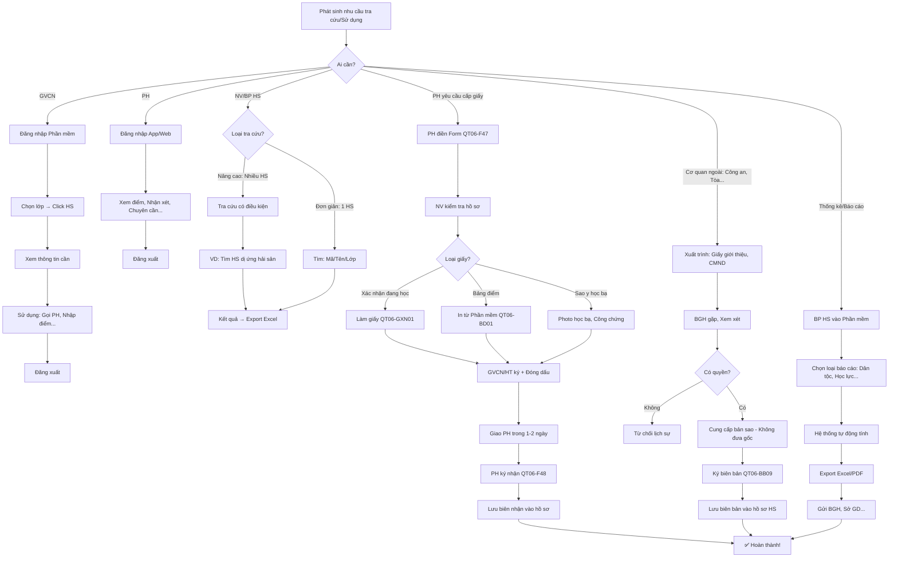

# SOP-06.4: TRUY XUẤT VÀ SỬ DỤNG HỒ SƠ

## 1. THÔNG TIN QUY TRÌNH

| **Thuộc tính** | **Nội dung** |
|---|---|
| Mã SOP | SOP-06.4 |
| Tên quy trình | Truy xuất và sử dụng hồ sơ học sinh |
| Quy trình cha | SOP-06: Hồ sơ học sinh |
| Phiên bản | 1.0 |
| Áp dụng | Khi cần tra cứu, Sử dụng hồ sơ |

## 2. MỤC ĐÍCH

- **Tra cứu nhanh**: Cần thông tin → Tìm được ngay
- **Sử dụng đúng**: Đúng mục đích, Đúng quy định
- **Bảo mật**: Không để lộ thông tin
- **Phục vụ tốt**: HS, PH, GV, Cơ quan chức năng

## 3. PHẠM VI ÁP DỤNG

Tất cả nhu cầu tra cứu, Sử dụng hồ sơ HS

## 4. CÁC TÌNH HUỐNG SỬ DỤNG

### 4.1. 8 tình huống phổ biến

```
╔══════════════════════════════════════════════════════════════════╗
║           8 TÌNH HUỐNG SỬ DỤNG HỒ SƠ                             ║
╠══════════════════════════════════════════════════════════════════╣
║ 1. GVCN TRA CỨU (Hằng ngày)                                      ║
║    • Mục đích: Xem điểm, SĐT PH, Dị ứng...                       ║
║    • Quyền: Xem HS lớp mình                                      ║
║    • Công cụ: Phần mềm (Online)                                  ║
╠══════════════════════════════════════════════════════════════════╣
║ 2. PH XEM ĐIỂM CON (Hằng ngày)                                   ║
║    • Mục đích: Theo dõi học tập                                  ║
║    • Quyền: Chỉ xem con mình                                     ║
║    • Công cụ: App/Website                                        ║
╠══════════════════════════════════════════════════════════════════╣
║ 3. CẤP GIẤY TỜ (Khi PH yêu cầu)                                  ║
║    • Mục đích: Giấy xác nhận HS, Bảng điểm...                    ║
║    • Quyền: PH yêu cầu → Trường cấp                              ║
║    • Công cụ: Hồ sơ giấy + Số                                    ║
╠══════════════════════════════════════════════════════════════════╣
║ 4. CHUYỂN TRƯỜNG (Khi HS chuyển đi)                              ║
║    • Mục đích: Bàn giao hồ sơ cho trường mới                     ║
║    • Quyền: Theo quy định Bộ GD                                  ║
║    • Công cụ: Học bạ gốc + Giấy chuyển trường                    ║
╠══════════════════════════════════════════════════════════════════╣
║ 5. THANH TRA (Sở GD, Thanh tra Chính phủ...)                     ║
║    • Mục đích: Kiểm tra quy định                                 ║
║    • Quyền: Theo văn bản thanh tra                               ║
║    • Công cụ: Cung cấp hồ sơ theo yêu cầu                        ║
╠══════════════════════════════════════════════════════════════════╣
║ 6. THỐNG KÊ - BÁO CÁO (Định kỳ)                                  ║
║    • Mục đích: Báo cáo BGH, Sở GD                                ║
║    • Quyền: BP HS                                                ║
║    • Công cụ: Export từ Phần mềm                                 ║
╠══════════════════════════════════════════════════════════════════╣
║ 7. Y TẾ (Khi HS ốm, Tai nạn...)                                  ║
║    • Mục đích: Xem bệnh sử, Dị ứng, SĐT PH...                    ║
║    • Quyền: Y tế trường                                          ║
║    • Công cụ: Phần mềm (Phần Sức khỏe)                           ║
╠══════════════════════════════════════════════════════════════════╣
║ 8. PHÁP LÝ (Tranh chấp, Kiện tụng...)                            ║
║    • Mục đích: Làm bằng chứng                                    ║
║    • Quyền: Theo quyết định Tòa án                               ║
║    • Công cụ: Cung cấp bản sao công chứng                        ║
╚══════════════════════════════════════════════════════════════════╝
```

## 5. QUY TRÌNH TRA CỨU

### 5.1. Tra cứu online (Phần mềm)

**A. GVCN tra cứu (Hằng ngày):**

```
Bước 1: Đăng nhập hệ thống
• User: gvcn_x
• Pass: ******

Bước 2: Chọn lớp: 1A

Bước 3: Danh sách 25 HS hiện ra

Bước 4: Click vào HS: "Nguyễn Văn A"

Bước 5: Xem thông tin:
┌─────────────────────────────────────────────────┐
│ Nguyễn Văn A - HS-2024-001 - Lớp 1A           │
├─────────────────────────────────────────────────┤
│ Tab: [Cơ bản] [Gia đình] [Học tập] [Sức khỏe] │
├─────────────────────────────────────────────────┤
│ THÔNG TIN CƠ BẢN:                              │
│ • Ngày sinh: 15/03/2018                         │
│ • Giới: Nam                                     │
│ • SĐT PH: 0912-xxx-xxx                          │
│ • Địa chỉ: 123 Đường X...                       │
│                                                 │
│ [Click tab khác để xem thêm]                    │
└─────────────────────────────────────────────────┘

Bước 6: Sử dụng thông tin
VD: Gọi điện PH (Dùng SĐT từ hồ sơ)

Bước 7: Đăng xuất (Khi xong!)
```

**B. PH tra cứu (Qua App/Web):**

```
PH đăng nhập App:
• User: 0912-xxx-xxx (SĐT PH)
• Pass: ******

Màn hình hiện:
┌─────────────────────────────────────────────────┐
│ Con: Nguyễn Văn A - Lớp 1A                     │
├─────────────────────────────────────────────────┤
│ ĐIỂM SỐ:                                        │
│ • Toán: 8.5, 9.0, 7.5 (TB: 8.3)                │
│ • Văn: 9.0, 9.5, 9.0 (TB: 9.2)                 │
│ • ĐTB chung: 8.8 (Giỏi!)                       │
│                                                 │
│ NHẬN XÉT GVCN:                                  │
│ "A là em ngoan, Học tập tốt..."                │
│                                                 │
│ CHUYÊN CẦN:                                     │
│ • Có mặt: 40/42 buổi (95%)                     │
│                                                 │
│ HOẠT ĐỘNG:                                      │
│ • Tham gia: Ngày hội thể thao (Giải Ba)        │
│ • CLB: Robotics                                 │
└─────────────────────────────────────────────────┘

PH: Xem được CẬP NHẬT LIÊN TỤC!
```

### 5.2. Tra cứu hồ sơ giấy (Ít khi)

**Bước 1: Người cần điền Phiếu (QT06-F46 - Đã có ở SOP-06.3)**

**Bước 2: NV mở tủ, Lấy hồ sơ**

**Bước 3: Sử dụng (Tại Phòng HS)**

**Bước 4: Trả lại**

## 6. CẤP GIẤY TỜ

### 6.1. Giấy xác nhận HS đang học (QT06-GXN01)

**Bước 1: PH yêu cầu**

```
PH: "Cho con xin Giấy xác nhận đang học!
     (Để làm hộ chiếu)"

NV: "Dạ, Quý PH điền Form này!"
[Đưa Form QT06-F47]
```

**Form yêu cầu cấp giấy (QT06-F47):**

```
═══════════════════════════════════════════════════════
     PHIẾU YÊU CẦU CẤP GIẤY TỜ
═══════════════════════════════════════════════════════

Họ tên PH: _______________  SĐT: _______________
Con em: _______________  Lớp: ____

Loại giấy cần:
□ Giấy xác nhận đang học
□ Bảng điểm (Học kỳ __/Năm __)
□ Giấy xác nhận hạnh kiểm
□ Sao y học bạ
□ Khác: ________________

Mục đích sử dụng: ___________________________

Số lượng: ____ bản

PH ký: __________  Ngày: __/__/____
═══════════════════════════════════════════════════════
```

**Bước 2: NV kiểm tra hồ sơ**

**Bước 3: Làm giấy (QT06-GXN01)**

```
═══════════════════════════════════════════════════════
        [LOGO TRƯỜNG]
        
        GIẤY XÁC NHẬN
═══════════════════════════════════════════════════════

TRƯỜNG ________ xin xác nhận:

Em: _______________
Ngày sinh: __/__/____
Hiện đang học tại Trường _________

• Lớp: ____
• Năm học: ________
• GVCN: _______________
• Tình trạng: Đang học tập bình thường

Giấy này cấp theo yêu cầu của Phụ huynh
Để làm: [Mục đích]

                         HT ký: __________
                         [Đóng dấu]
                         Ngày __/__/____
═══════════════════════════════════════════════════════
```

**Bước 4: Giao cho PH (Trong 1-2 ngày)**

```
NV: "Dạ, Giấy của quý PH đây ạ!
     Quý PH kiểm tra và Ký nhận!"

PH: [Kiểm tra] "OK!"
[Ký biên nhận - QT06-F48]

NV: Lưu biên nhận (Có PH ký) vào hồ sơ HS
```

### 6.2. Bảng điểm (QT06-BD01)

**Tự động từ Phần mềm:**

```
═══════════════════════════════════════════════════════
        [LOGO TRƯỜNG]
        
        BẢNG ĐIỂM HỌC KỲ __
        Năm học: ________
═══════════════════════════════════════════════════════

Họ tên: _______________
Lớp: ____  GVCN: _______________

┌──────┬────────┬────────┬────────┬────────┬──────┐
│ Môn  │ Miệng  │ 15 phút│ 1 tiết │ HK     │ TB   │
├──────┼────────┼────────┼────────┼────────┼──────┤
│ Toán │ 8  9   │ 8.5    │ 9      │ 8      │ 8.5  │
│ Văn  │ 9  9.5 │ 9      │ 9.5    │ 9      │ 9.2  │
│ Anh  │ 8  8.5 │ 8      │ 8.5    │ 8      │ 8.3  │
│ ... │        │        │        │        │      │
├──────┴────────┴────────┴────────┴────────┼──────┤
│ ĐIỂM TRUNG BÌNH CHUNG:                   │ 8.7  │
├──────────────────────────────────────────┴──────┤
│ XẾP LOẠI: GIỎI                                  │
└──────────────────────────────────────────────────┘

NHẬN XÉT GVCN:
"A là em ngoan, Học tập chăm chỉ..."

                         GVCN ký: __________
                         HT ký: __________
                         [Đóng dấu]
                         Ngày __/__/____
═══════════════════════════════════════════════════════
```

### 6.3. Học bạ (Cuối HK/Năm)

**In từ Phần mềm → Vào Học bạ giấy (Bản gốc)**

```
QUY TRÌNH:
1. Cuối HK: Hệ thống tính ĐTB, Xếp loại
2. BP HS xuất file PDF (Tất cả HS)
3. In ra giấy A4
4. GVCN kiểm tra (Điểm có đúng?)
5. GVCN ký
6. HT ký + Đóng dấu
7. Dán vào Học bạ (Trang HK tương ứng)
8. Phát cho HS (Cuối HK)
9. PH ký nhận (Trong Học bạ)
10. HS mang về cho PH xem
11. PH xem xong → HS mang lại trường (Đầu HK sau)
```

## 7. QUY TRÌNH TRA CỨU

### 7.1. Tra cứu đơn giản (1 HS)

**Công cụ: Thanh tìm kiếm**

```
CÁCH 1: Tìm theo Mã HS
• Nhập: HS-2024-001
• Enter → Hồ sơ hiện ra!

CÁCH 2: Tìm theo Tên
• Nhập: Nguyễn Văn A
• Nếu trùng tên → Chọn thêm: Lớp, Năm sinh

CÁCH 3: Tìm theo Lớp
• Chọn: Lớp 1A
• Danh sách 25 HS hiện ra
• Click vào HS cần xem
```

### 7.2. Tra cứu nâng cao (Nhiều HS, Có điều kiện)

**VD: Tìm tất cả HS dị ứng hải sản (Để tránh cho ăn!)**

**Bước 1: Vào Phần mềm → Chức năng "Tra cứu nâng cao"**

**Bước 2: Nhập điều kiện**

```
Trường: [Dị ứng] Chứa [Hải sản]

→ Tìm kiếm!
```

**Bước 3: Kết quả**

```
TÌM ĐƯỢC 12 HS:

| Mã | Họ tên | Lớp | Dị ứng |
|----|--------|------|--------|
| HS-2024-005 | Trần Thị B | 1A | Hải sản |
| HS-2024-023 | Lê Văn C | 2B | Hải sản, Đậu |
| ... | ... | ... | ... |

→ Export Excel
→ Gửi Bếp ăn: "12 em này KHÔNG cho ăn hải sản!"
```

**VD khác:**

```
• Tìm HS học lực Yếu (ĐTB <5.0) → Lập danh sách phụ đạo
• Tìm HS vắng >15 ngày/tháng → Lập danh sách can thiệp
• Tìm HS sinh tháng 3 → Chuẩn bị quà sinh nhật!
```

## 8. SỬ DỤNG CHO MỤC ĐÍCH ĐẶC BIỆT

### 8.1. Cấp giấy cho cơ quan ngoài

**VD: Công an yêu cầu thông tin HS (Do HS vi phạm pháp luật)**

**Quy trình:**

```
BƯỚC 1: Công an đến trường, Xuất trình:
• Giấy giới thiệu (Từ Công an)
• CMND/CCCD (Cá nhân)

BƯỚC 2: NV báo BGH

BƯỚC 3: BGH gặp Công an
"Các đồng chí cần thông tin gì?"

Công an: "Em [Tên], Lớp [X] đã [Vi phạm].
         Chúng tôi cần:
         • Học bạ
         • Thông tin gia đình
         • Hạnh kiểm"

BƯỚC 4: BGH xem xét
• Công an có quyền không? (Theo pháp luật: CÓ!)
• Cung cấp: Bản sao (Không đưa gốc!)

BƯỚC 5: Làm bản sao công chứng (Nếu cần)

BƯỚC 6: Bàn giao
• Công an nhận
• Ký biên bản (QT06-BB09)

BƯỚC 7: Lưu hồ sơ
• Lưu: Biên bản + Giấy giới thiệu Công an
• Vào hồ sơ HS (Để sau này đối chiếu)
```

### 8.2. Cung cấp cho Tòa án (Tranh chấp)

**VD: PH ly hôn, Tranh quyền nuôi con. Tòa yêu cầu thông tin HS**

**Quy trình:**

```
1. Tòa gửi Văn bản yêu cầu (Chính thức)
2. BGH nhận, Xem xét
3. Cung cấp theo yêu cầu Tòa:
   • Học bạ (Sao y)
   • Nhận xét GVCN
   • Hạnh kiểm
   • ...
4. Không cung cấp: Thông tin y tế (Trừ khi Tòa yêu cầu cụ thể!)
5. Bàn giao Tòa (Có biên bản)
6. Lưu hồ sơ
```

### 8.3. Thống kê - Báo cáo

**VD: Báo cáo Sở GD: "Số HS theo dân tộc"**

**Quy trình:**

```
BƯỚC 1: BP HS vào Phần mềm
BƯỚC 2: Chọn "Báo cáo" → "Thống kê dân tộc"
BƯỚC 3: Hệ thống tự động tính:

| Dân tộc | Số HS | % |
|---------|-------|---|
| Kinh | 480 | 96% |
| Tày | 10 | 2% |
| Mông | 5 | 1% |
| Khác | 5 | 1% |
| **Tổng** | **500** | **100%** |

BƯỚC 4: Export Excel hoặc PDF
BƯỚC 5: Gửi Sở GD
```

## 9. LƯU ĐỒ QUY TRÌNH



## 10. BIỂU MẪU LIÊN QUAN

| **Mã** | **Tên** |
|---|---|
| QT06-F46 | Phiếu mượn hồ sơ |
| QT06-F47 | Phiếu yêu cầu cấp giấy tờ |
| QT06-F48 | Biên nhận nhận giấy (PH ký) |
| QT06-GXN01 | Giấy xác nhận đang học |
| QT06-BD01 | Bảng điểm |
| QT06-BB09 | Biên bản cung cấp hồ sơ (Cơ quan ngoài) |

## 11. TIÊU CHUẨN VÀ CHỈ TIÊU

| **Chỉ tiêu** | **Mục tiêu** |
|---|---|
| Thời gian tra cứu 1 HS | ≤ 1 phút |
| Thời gian cấp giấy xác nhận (Từ lúc PH yêu cầu) | ≤ 2 ngày |
| Tỷ lệ cấp giấy đúng (Không sai sót) | 100% |
| Tỷ lệ hài lòng của PH (Khi xin giấy) | ≥ 90% |

## 12. TRÁCH NHIỆM CỤ THỂ

| **Vai trò** | **Trách nhiệm** |
|---|---|
| **NV Phòng HS** | Cấp giấy, Bàn giao hồ sơ (Khi PH/Cơ quan yêu cầu) |
| **GVCN** | Tra cứu thông tin HS (Khi cần), Ký bảng điểm |
| **BP HS** | Thống kê, Báo cáo, Phê duyệt cấp giấy |
| **BGH** | Ký giấy chính thức, Quyết định cung cấp cho cơ quan ngoài |

## 13. LƯU Ý QUAN TRỌNG

- ⚠️ **Xác minh danh tính**: PH xin giấy → Phải xuất trình CMND! (Tránh người lạ giả danh!)
- ✅ **Không cấp qua điện thoại**: PH gọi xin → Bảo đến trường! (Không gửi email/Zalo!)
- 🔥 **Bảo mật tuyệt đối**: Cơ quan ngoài xin → Phải có văn bản chính thức!
- ✅ **Lưu biên nhận**: Mọi lần cấp giấy → PH/Cơ quan ký nhận!

## 14. PHỤ LỤC

### 14.1. Danh sách giấy tờ thường cấp

```
TOP 10 GIẤY THƯỜNG XIN:

1. Giấy xác nhận đang học (80%)
   • Mục đích: Làm hộ chiếu, Visa, Xin học bổng...
   • Thời gian: 1 ngày
   
2. Bảng điểm (10%)
   • Mục đích: Chuyển trường, Du học...
   • Thời gian: 1 ngày (Nếu có sẵn), 3 ngày (Nếu làm mới)
   
3. Giấy xác nhận hạnh kiểm tốt (5%)
   • Mục đích: Xin việc làm thêm (THCS), Đi thi...
   • Thời gian: 2 ngày
   
4. Sao y học bạ (3%)
   • Mục đích: Lưu trữ cá nhân, Chuyển trường...
   • Thời gian: 2 ngày (Photo + Công chứng)
   
5. Giấy chuyển trường (1%)
   • Mục đích: Chuyển sang trường khác
   • Thời gian: 3 ngày (Xem SOP-06.5)
   
6-10. Khác: 1%
```

### 14.2. Xử lý tình huống từ chối

**A. PH xin giấy, Nhưng nợ học phí:**

```
PH: "Cho em xin Giấy xác nhận!"

NV: [Kiểm tra hệ thống] "Quý PH ạ, Con em đang nợ học phí 3 tháng.
     Quý PH thanh toán xong, Em sẽ cấp giấy ạ!"

PH: "Em gấp lắm! Cho em giấy trước, Em trả tiền sau!"

NV: "Em rất tiếc, Nhưng quy định: Phải thanh toán trước!
     Quý PH vui lòng thanh toán, Em cấp giấy ngay ạ!"

→ NGUYÊN TẮC: Nợ phí → Không cấp giấy! (Trừ trường hợp đặc biệt - BGH duyệt)
```

**B. Người lạ xin hồ sơ HS (Không phải PH):**

```
Người lạ: "Cho tôi hồ sơ em [Tên]!"

NV: "Xin lỗi, Anh/Chị là ai của em ạ?"

Người: "Tôi là cô ruột!"

NV: "Anh/Chị có giấy ủy quyền của PH không ạ?"

Người: "Không!"

NV: "Xin lỗi, Không có giấy ủy quyền, Chúng em không thể cấp ạ!
     Anh/Chị liên hệ PH làm giấy ủy quyền nhé!"

→ NGUYÊN TẮC: Chỉ cấp cho PH (Bố/Mẹ)! Người khác → Phải có ủy quyền!
```

**Giấy ủy quyền (QT06-F49):**

```
═══════════════════════════════════════════════════════
              GIẤY ủy QUYỀN
═══════════════════════════════════════════════════════

Tôi là: _______________  CMND: _______________
Là [Bố/Mẹ] của em: _______________  Lớp: ____

ỦY QUYỀN cho: _______________  CMND: _______________
Là [Cô/Chú/Ông/Bà...] của em

Được thay mặt tôi:
□ Nhận giấy tờ
□ Nhận học bạ
□ Khác: ________________

                         PH ký: __________
                         Ngày __/__/____
                         
Xác nhận của TRƯỜNG:
Đã chứng kiến PH ký (Hoặc Có công chứng)

NV ký: __________
═══════════════════════════════════════════════════════
```

## 15. FAQ

**Q1: HS tự xin Giấy xác nhận (Không có PH đi cùng). Có cấp không?**  
A: Tùy tuổi:
- Lớp 1-5: KHÔNG! Phải có PH!
- Lớp 6-9: Xem xét. Nếu HS mang theo: Sổ liên lạc có chữ ký PH "Cho con xin giấy" → OK!

**Q2: PH xin 10 bản Giấy xác nhận (Cùng lúc). Có cấp không?**  
A: HỎI mục đích!
- Mục đích hợp lý (Xin visa nhiều nước...) → Cấp! (Thu phí: 20K/bản)
- Mục đích lạ (Không giải thích rõ) → Từ chối hoặc Chỉ cấp 1-2 bản!

**Q3: Tra cứu thông tin HS (Để làm list sinh nhật). Có vi phạm bảo mật không?**  
A: KHÔNG! (Nếu mục đích tốt!)
- Làm list sinh nhật → Tặng quà HS → Tốt! ✅
- Nhưng: Không đăng list ra ngoài (Facebook...)! (Vi phạm!)

**Q4: PH quên mật khẩu App xem điểm. Xử lý?**  
A: 
- PH click "Quên mật khẩu"
- Hệ thống gửi OTP qua SĐT/Email đã đăng ký
- PH nhập OTP → Đổi mật khẩu mới!
- Nếu không được → Liên hệ IT (Xác minh danh tính trước!)

---

**PHÊ DUYỆT**

| NV Phòng HS | IT | Trưởng BP HS | Phó HT |
|---|---|---|---|
| [Họ tên] | [Họ tên] | [Họ tên] | [Họ tên] |
