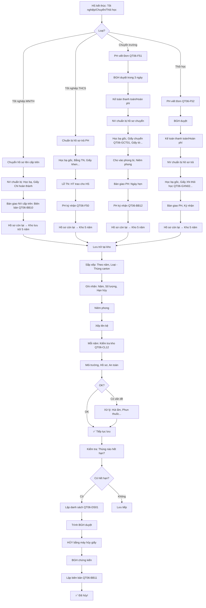

# SOP-06.5: CHUYỂN GIAO VÀ LƯU TRỮ DÀI HẠN

## 1. THÔNG TIN QUY TRÌNH

| **Thuộc tính** | **Nội dung** |
|---|---|
| Mã SOP | SOP-06.5 |
| Tên quy trình | Chuyển giao và lưu trữ dài hạn hồ sơ học sinh |
| Quy trình cha | SOP-06: Hồ sơ học sinh |
| Phiên bản | 1.0 |
| Áp dụng | Khi HS tốt nghiệp, Chuyển trường, Thôi học |

## 2. MỤC ĐÍCH

- **Chuyển giao đầy đủ**: Hồ sơ được bàn giao an toàn
- **Lưu trữ dài hạn**: Hồ sơ cũ được lưu đúng quy định
- **Tuân thủ pháp luật**: Theo quy định Bộ GD&ĐT
- **Giải phóng không gian**: Hồ sơ cũ → Kho lưu trữ

## 3. PHẠM VI ÁP DỤNG

- HS tốt nghiệp
- HS chuyển trường
- HS thôi học

## 4. TRƯỜNG HỢP 1: TỐT NGHIỆP

### 4.1. Tốt nghiệp Mầm non (Lên lớp 1)

**Bước 1: Cuối năm MN - NV chuẩn bị hồ sơ**

```
Hồ sơ chuyển từ MN → Lớp 1:
• Học bạ MN (Bản gốc)
• Giấy chứng nhận hoàn thành MN
• Thông tin đặc biệt (Nếu có: Dị ứng, Bệnh...)

KHÔNG CHUYỂN:
• Giấy khai sinh, Sổ HK... (Đã có từ lúc nhập học!)
```

**Bước 2: Bàn giao cho Lớp 1 (Tháng 8)**

```
NV MN → NV Lớp 1:
• Danh sách: 50 em tốt nghiệp MN, Lên lớp 1
• Hồ sơ: 50 bìa
• Biên bản bàn giao (QT06-BB10)

NV Lớp 1:
• Nhận hồ sơ
• Kiểm đếm: Đủ 50?
• Kiểm tra: Có đủ giấy tờ?
• Ký nhận

→ Lưu vào Tủ hồ sơ Lớp 1!
```

### 4.2. Tốt nghiệp Tiểu học (Lên THCS)

**Tương tự 4.1**

**Lưu ý đặc biệt:**
- Học bạ TH (5 năm!) → Dày! Bảo quản cẩn thận!
- Giấy chứng nhận hoàn thành TH (Quan trọng - Vào lớp 6!)

### 4.3. Tốt nghiệp THCS (Ra trường)

**Bước 1: Cuối lớp 9 - NV chuẩn bị**

```
HỒ SƠ TRẢ CHO PH:
✅ Học bạ (Bản gốc - MN+TH+THCS = 9 năm!)
✅ Bằng tốt nghiệp THCS
✅ Giấy chứng nhận ưu tiên (Nếu có: Con thương binh...)
✅ Giấy khen tích lũy (Nếu có)

HỒ SƠ TRƯỜNG GIỮ LẠI (5 năm):
• Bản sao học bạ
• Hợp đồng
• Sổ sách khác...
```

**Bước 2: Lễ tốt nghiệp (Tháng 6)**

```
HT trao:
• Bằng tốt nghiệp
• Học bạ (Phong bì)
• Giấy khen (Nếu có)

[Chụp ảnh lưu niệm]

PH ký nhận (QT06-F50)
```

**Bước 3: Lưu trữ dài hạn (Hồ sơ còn lại)**

```
Chuyển từ Tủ hồ sơ → Kho lưu trữ (Phòng khác)
• Sắp xếp: Theo năm tốt nghiệp
  - Thùng 2024: 100 hồ sơ (HS tốt nghiệp 2024)
  - Thùng 2025: ...
• Ghi rõ: "Hồ sơ tốt nghiệp 2024 - Lưu đến 2029"
• Niêm phong (Băng dính + Ký tên)
```

**Bước 4: Sau 5 năm - Hủy**

```
Năm 2029 (5 năm sau khi tốt nghiệp 2024):
• Lấy Thùng 2024 ra
• Mở niêm phong
• Hủy bằng máy hủy giấy
• Lập biên bản hủy (QT06-BB11)
• BGH ký chứng kiến

LƯU Ý: Hồ sơ SỐ (Trên Server) → Lưu VĨNH VIỄN! (Hoặc đến khi PH yêu cầu xóa)
```

## 5. TRƯỜNG HỢP 2: CHUYỂN TRƯỜNG

### 5.1. HS chuyển đi (Giữa năm hoặc Cuối năm)

**Bước 1: PH đến xin chuyển trường**

```
PH: "Con em xin chuyển trường ạ!"

BP HS: "Tại sao ạ?"
[PH giải thích: Chuyển nhà, Không hợp...]

BP HS: "Em hiểu. Quý PH cần:
        1. Viết Đơn xin chuyển (QT06-F51)
        2. Có Giấy xác nhận của trường mới (Đã nhận HS)
        3. Thanh toán học phí (Nếu còn nợ)
        4. Hẹn ngày nhận hồ sơ"
```

**Đơn xin chuyển (QT06-F51):**

```
═══════════════════════════════════════════════════════
            ĐƠN XIN CHUYỂN TRƯỜNG
═══════════════════════════════════════════════════════

Kính gửi: Ban Giám hiệu trường __________

Tên HS: _______________  Lớp: ____

Xin chuyển sang trường: _______________

Lý do: _____________________________________________

Cam kết:
• Đã thanh toán đầy đủ học phí
• Nhận đầy đủ hồ sơ, Tài sản (Nếu có)

                         PH ký: __________
                         Ngày __/__/____

---PHÊ DUYỆT---
□ Đồng ý
□ Không đồng ý (Lý do: _______)

HT ký: __________  Ngày: __/__/____
═══════════════════════════════════════════════════════
```

**Bước 2: BGH phê duyệt (Trong 3 ngày)**

**Bước 3: NV chuẩn bị hồ sơ chuyển (1 tuần)**

```
HỒ SƠ CHUYỂN:
✅ Học bạ (Bản gốc)
✅ Giấy chuyển trường (QT06-GCT01 - Trường cấp)
✅ Giấy khai sinh (Bản sao công chứng)
✅ Sổ HK (Bản sao)
✅ Phiếu SK (Bản sao)
✅ Giấy xác nhận hạnh kiểm (Nếu trường mới yêu cầu)

Tất cả cho vào BÌA (Phong bì lớn), Niêm phong!
```

**Giấy chuyển trường (QT06-GCT01):**

```
═══════════════════════════════════════════════════════
        [LOGO TRƯỜNG]
        
        GIẤY CHUYỂN TRƯỜNG
═══════════════════════════════════════════════════════

Trường ________ xác nhận:

Em: _______________
Ngày sinh: __/__/____

Đã học tại trường từ: __/__/____ Đến: __/__/____
• Lớp: ____
• GVCN: _______________
• Xếp loại: Giỏi/Khá/TB/Yếu
• Hạnh kiểm: Tốt/Khá/TB/Yếu
• Khen thưởng: _______________ (Nếu có)
• Kỷ luật: Không (Hoặc: _______)

Lý do chuyển: _______________

Nay chuyển sang: Trường _______________

Trường ________ xác nhận để trường mới tiếp nhận!

                         HT ký: __________
                         [Đóng dấu]
                         Ngày __/__/____
═══════════════════════════════════════════════════════
```

**Bước 4: Bàn giao cho PH (Ngày hẹn)**

```
PH đến:
• Xuất trình CMND (Xác nhận đúng PH)
• NV đưa phong bì hồ sơ
• PH kiểm tra (Mở niêm phong, Xem bên trong)
• PH ký nhận (QT06-BB12)

NV:
• Lưu biên bản (Có chữ ký PH)
• Cập nhật hệ thống: HS A → Trạng thái "Đã chuyển trường"
```

**Bước 5: Lưu trữ (Hồ sơ còn lại - 5 năm)**

```
Hồ sơ giấy còn lại (Hợp đồng, Biên bản...):
→ Chuyển Kho lưu trữ
→ Sau 5 năm: Hủy!

Hồ sơ số:
→ Đánh dấu "Đã chuyển trường"
→ Lưu vĩnh viễn (Hoặc đến khi PH yêu cầu xóa)
```

## 6. TRƯỜNG HỢP 3: THÔI HỌC

### 6.1. HS thôi học (Giữa chừng - Không chuyển trường khác)

**Bước 1: PH xin thôi học**

```
PH: "Con em xin thôi học ạ!"

BP HS: "Tại sao ạ?" [Tìm hiểu - Có thể giữ chân!]

PH: "Gia đình chuyển ra nước ngoài!"

BP HS: "À, Vậy à! Chúc gia đình thuận lợi!
       Quý PH viết Đơn xin thôi học (QT06-F52) nhé!"
```

**Đơn xin thôi học (QT06-F52):**

```
═══════════════════════════════════════════════════════
            ĐƠN XIN THÔI HỌC
═══════════════════════════════════════════════════════

Kính gửi: Ban Giám hiệu trường __________

Tên HS: _______________  Lớp: ____

Xin cho con em THÔI HỌC.

Lý do: _____________________________________________

Cam kết:
• Đã thanh toán đầy đủ học phí
• Nhận đầy đủ hồ sơ
• Không khiếu nại sau này

                         PH ký: __________
                         Ngày __/__/____

---PHÊ DUYỆT---
□ Đồng ý
□ Không đồng ý (Lý do: Nợ phí, ...)

HT ký: __________  Ngày: __/__/____
═══════════════════════════════════════════════════════
```

**Bước 2: Kế toán thanh toán/Hoàn phí**

```
Kiểm tra:
• HS nợ phí? → Yêu cầu thanh toán!
• HS đóng thừa? (VD: Đóng cả năm, Nhưng chỉ học 3 tháng)
  → Hoàn lại!

Công thức hoàn:
Hoàn = (Số tháng chưa học / Tổng số tháng) × Học phí đã đóng

VD: Đóng 10 tháng (20M), Học 3 tháng, Thôi học
→ Hoàn: (7/10) × 20M = 14M
```

**Bước 3: NV chuẩn bị hồ sơ trả (Giống Chuyển trường)**

```
TRẢ CHO PH:
• Học bạ gốc (MN hoặc TH - Tùy cấp HS học)
• Giấy chứng nhận hoàn thành (Nếu đã hoàn thành cấp)
• Giấy khen tích lũy
• Giấy xác nhận thôi học (QT06-GXN02)

GIỮ LẠI:
• Hợp đồng
• Sổ sách khác
• Lưu 5 năm
```

**Giấy xác nhận thôi học (QT06-GXN02):**

```
═══════════════════════════════════════════════════════
        GIẤY XÁC NHẬN THÔI HỌC
═══════════════════════════════════════════════════════

Trường ________ xác nhận:

Em: _______________
Ngày sinh: __/__/____

Đã học tại trường:
• Từ: __/__/____ Đến: __/__/____
• Lớp: ____
• Xếp loại: ________
• Hạnh kiểm: ________

Nay thôi học theo đơn của Phụ huynh.

Trường xác nhận để làm chứng từ!

                         HT ký: __________
                         [Đóng dấu]
                         Ngày __/__/____
═══════════════════════════════════════════════════════
```

**Bước 4: Bàn giao PH (Ký biên bản - QT06-BB12)**

**Bước 5: Cập nhật hệ thống**

```
• Trạng thái HS: "Đang học" → "Đã thôi học"
• Ghi: Ngày thôi học, Lý do
• Hồ sơ số → Lưu trữ (Không xóa!)
```

## 7. LƯU TRỮ DÀI HẠN

### 7.1. Kho lưu trữ

**Yêu cầu:**

```
╔══════════════════════════════════════════════════════════════════╗
║              YÊU CẦU KHO LƯU TRỮ                                 ║
╠══════════════════════════════════════════════════════════════════╣
║ 1. VỊ TRÍ:                                                       ║
║    • Phòng riêng, Khóa kín                                       ║
║    • Ít người ra vào (Giảm nguy cơ mất)                          ║
║    • Có cửa sổ (Thoáng khí), Nhưng có song sắt (An toàn)         ║
╠══════════════════════════════════════════════════════════════════╣
║ 2. MÔI TRƯỜNG:                                                   ║
║    • Khô ráo (Độ ẩm <70%)                                        ║
║    • Mát (Nhiệt độ 20-25°C)                                      ║
║    • Không có mối, Chuột (Phun thuốc định kỳ!)                   ║
╠══════════════════════════════════════════════════════════════════╣
║ 3. KỆ/THÙNG:                                                     ║
║    • Thùng carton cứng (Đựng hồ sơ)                              ║
║    • Kệ sắt (Xếp thùng)                                          ║
║    • Ghi nhãn rõ ràng: "2024 - TN THCS"                          ║
╠══════════════════════════════════════════════════════════════════╣
║ 4. AN TOÀN:                                                      ║
║    • Bình PCCC (Gần cửa)                                         ║
║    • Camera (Nếu có)                                             ║
║    • Không chất dễ cháy (Xăng, Dầu...) gần kho!                  ║
╚══════════════════════════════════════════════════════════════════╝
```

### 7.2. Sắp xếp trong kho

```
SƠ ĐỒ KHO LƯU TRỮ:

┌────────────────────────────────────────────────┐
│             KHO LƯU TRỮ HỒ SƠ                  │
├────────────────────────────────────────────────┤
│                                                │
│  KỆ A: THCS TỐT NGHIỆP                         │
│  ├─ Thùng 2019 (Hủy 2024) ✅ Đã hủy           │
│  ├─ Thùng 2020 (Hủy 2025)                      │
│  ├─ Thùng 2021 (Hủy 2026)                      │
│  ├─ Thùng 2022 (Hủy 2027)                      │
│  ├─ Thùng 2023 (Hủy 2028)                      │
│  └─ Thùng 2024 (Hủy 2029) ← Mới nhất           │
│                                                │
│  KỆ B: TH TỐT NGHIỆP                           │
│  ├─ Thùng 2020 (Hủy 2025)                      │
│  ├─ ...                                        │
│                                                │
│  KỆ C: CHUYỂN TRƯỜNG                           │
│  ├─ Thùng 2020 (Hủy 2025)                      │
│  ├─ ...                                        │
│                                                │
│  KỆ D: THÔI HỌC                                │
│  ├─ Thùng 2020 (Hủy 2025)                      │
│  └─ ...                                        │
└────────────────────────────────────────────────┘
```

### 7.3. Kiểm tra định kỳ (Mỗi năm 1 lần)

**Bước 1: Mỗi tháng 6 - NV kiểm tra kho**

```
CHECKLIST KIỂM TRA KHO (QT06-CL12):

□ Môi trường:
  □ Khô ráo? (Đo độ ẩm)
  □ Mát? (Đo nhiệt độ)
  □ Có mối/chuột? (Kiểm tra dấu vết)
  
□ Hồ sơ:
  □ Thùng còn nguyên vẹn? (Không rách, Ướt...)
  □ Niêm phong còn? (Không ai mở trộm)
  □ Xếp đúng vị trí?
  
□ An toàn:
  □ Bình PCCC còn hạn?
  □ Camera hoạt động?

TỔNG: ____/7 mục ✅

NẾU CÓ VẤN ĐỀ → XỬ LÝ NGAY!
(VD: Ẩm → Máy hút ẩm, Mối → Phun thuốc...)

NV ký: __________  Ngày: __/__/____
```

**Bước 2: Hủy hồ sơ hết hạn**

```
Tháng 6/2024:
• Kiểm tra: Thùng nào hết hạn?
  → Thùng 2019 (Tốt nghiệp 2019, Lưu đến 2024) → HẾT HẠN!
  
• Lập danh sách hồ sơ hủy (QT06-DS01)
• Trình BGH duyệt
• Hủy bằng máy hủy giấy (Có BGH chứng kiến!)
• Lập biên bản hủy (QT06-BB11)
```

**Biên bản hủy (QT06-BB11):**

```
═══════════════════════════════════════════════════════
          BIÊN BẢN HỦY HỒ SƠ
═══════════════════════════════════════════════════════

Hôm nay, Ngày __/__/____

Tại: Trường __________

Chúng tôi gồm:
• HT: _______________
• NV Phòng HS: _______________
• IT: _______________ (Nếu hủy hồ sơ số)

Tiến hành HỦY hồ sơ:

LOẠI: Hồ sơ HS tốt nghiệp THCS năm 2019
SỐ LƯỢNG: 100 hồ sơ (Danh sách đính kèm)
LÝ DO: Hết hạn lưu trữ (5 năm)
PHƯƠNG PHÁP: Máy hủy giấy (Shredder)

KẾT QUẢ: Đã hủy hoàn toàn! (Không phục hồi được)

Biên bản lập làm 2 bản:
• Bản 1: Lưu hồ sơ trường
• Bản 2: Báo cáo Sở GD (Nếu yêu cầu)

                HT ký: __________
                NV ký: __________
═══════════════════════════════════════════════════════
```

## 8. LƯU ĐỒ QUY TRÌNH



## 9. BIỂU MẪU LIÊN QUAN

| **Mã** | **Tên** |
|---|---|
| QT06-F50 | Biên nhận nhận hồ sơ (HS tốt nghiệp) |
| QT06-F51 | Đơn xin chuyển trường |
| QT06-F52 | Đơn xin thôi học |
| QT06-GCT01 | Giấy chuyển trường |
| QT06-GXN02 | Giấy xác nhận thôi học |
| QT06-BB10 | Biên bản bàn giao hồ sơ (Giữa các cấp) |
| QT06-BB11 | Biên bản hủy hồ sơ |
| QT06-BB12 | Biên bản bàn giao hồ sơ (Cho PH) |
| QT06-CL12 | Checklist kiểm tra kho lưu trữ |
| QT06-DS01 | Danh sách hồ sơ hủy |

## 10. TIÊU CHUẨN VÀ CHỈ TIÊU

| **Chỉ tiêu** | **Mục tiêu** |
|---|---|
| Thời gian chuẩn bị hồ sơ chuyển (Từ lúc PH xin) | ≤ 7 ngày |
| Tỷ lệ hồ sơ chuyển giao đầy đủ | 100% |
| Tỷ lệ hồ sơ lưu trữ nguyên vẹn (Sau 5 năm) | ≥ 95% |
| Tỷ lệ hủy đúng hạn | 100% |

## 11. TRÁCH NHIỆM CỤ THỂ

| **Vai trò** | **Trách nhiệm** |
|---|---|
| **NV Phòng HS** | Chuẩn bị hồ sơ chuyển, Bàn giao PH, Lưu kho, Kiểm tra kho |
| **Kế toán** | Thanh toán/Hoàn phí |
| **BP HS** | Phê duyệt chuyển/thôi học, Quản lý kho |
| **BGH** | Ký giấy chính thức, Chứng kiến hủy hồ sơ |

## 12. LƯU Ý QUAN TRỌNG

- ⚠️ **Học bạ GỐC = Quan trọng nhất**: Phải trả cho PH khi chuyển/Thôi học!
- ✅ **Biên bản BẮT BUỘC**: Mọi lần bàn giao → Phải có biên bản (PH ký)!
- 🔥 **Hủy đúng thời hạn**: Quá hạn → Vi phạm quy định lưu trữ!
- ✅ **Không tái sử dụng**: Bìa hồ sơ cũ → Không dùng cho HS mới! (Mua bìa mới!)

## 13. PHỤ LỤC

### 13.1. Thời hạn lưu trữ chi tiết

```
╔══════════════════════════════════════════════════════════════════╗
║         THỜI HẠN LƯU TRỮ THEO LOẠI HỒ SƠ                         ║
╠══════════════════════════════════════════════════════════════════╣
║ HỒ SƠ NHẬP HỌC (Giấy khai sinh, Sổ HK...):                      ║
║  • HS tốt nghiệp/Chuyển: Lưu 5 năm → Hủy                         ║
║  • HS thôi học: Lưu 5 năm → Hủy                                  ║
╠══════════════════════════════════════════════════════════════════╣
║ HỒ SƠ HỌC TẬP (Điểm, Nhận xét...):                              ║
║  • Hồ sơ giấy: Lưu 5 năm → Hủy                                   ║
║  • Hồ sơ số: Lưu vĩnh viễn (Hoặc đến khi PH yêu cầu xóa)         ║
╠══════════════════════════════════════════════════════════════════╣
║ HỒ SƠ SỨC KHỎE:                                                  ║
║  • Lưu 10 năm (Y tế cần lưu lâu hơn!)                            ║
╠══════════════════════════════════════════════════════════════════╣
║ BIÊN BẢN, VĂN BẢN QUAN TRỌNG:                                    ║
║  • Hợp đồng: Lưu 10 năm (Pháp lý!)                               ║
║  • Biên bản tai nạn: Lưu 10 năm                                  ║
║  • Biên bản kỷ luật nặng: Lưu 10 năm                             ║
╚══════════════════════════════════════════════════════════════════╝
```

### 13.2. Xử lý tình huống đặc biệt

**A. HS tốt nghiệp 10 năm, Quay lại xin bản sao học bạ:**

```
PH (Hoặc HS đã lớn): "Em tốt nghiệp năm 2014, Giờ em xin bản sao học bạ!"

TRƯỜNG:
• Kiểm tra: Hồ sơ giấy đã hủy (2019 - Sau 5 năm!)
• May mắn: Hồ sơ SỐ còn!
• In lại từ hồ sơ số
• Đóng dấu: "Bản sao từ hồ sơ số"
• Phí: 50K (In + Công chứng)

→ Vì vậy: Hồ sơ SỐ nên lưu VĨNH VIỄN!
```

**B. Hồ sơ trong kho bị mốc, Ẩm:**

```
PHÁT HIỆN:
Kiểm tra kho → Thùng 2020 bị ẩm, Giấy tờ mốc!

XỬ LÝ NGAY:
1. Lấy hồ sơ ra
2. Phơi khô (Nắng nhẹ hoặc Quạt)
3. Nếu quá ướt, Mốc nặng:
   • May mắn: Có bản scan!
   • In lại từ scan
   • Thay hồ sơ giấy cũ
4. Sửa môi trường kho:
   • Máy hút ẩm
   • Quạt thông gió
5. Chuyển hồ sơ sang kho khác (Khô hơn)

BÀI HỌC: Kiểm tra kho THƯỜNG XUYÊN!
```

## 14. FAQ

**Q1: PH mất Học bạ (Sau khi nhận về). Trường có cấp lại không?**  
A: 
- Nếu còn bản scan → In lại! (Phí: 100K)
- Nếu không (HS học trước khi có scan) → Xin Sở GD cấp lại (Rất lâu!)

**Q2: HS chuyển trường, Nhưng trường mới không nhận (Vì lý do X). Xử lý?**  
A: 
- HS quay lại trường cũ (Nếu muốn)
- Trường cũ PHẢI nhận lại! (Không được từ chối!)
- Nhận hồ sơ, Xếp lại lớp

**Q3: Kho lưu trữ đầy (Quá nhiều hồ sơ cũ). Làm sao?**  
A: 
- Hủy hồ sơ hết hạn (Giải phóng không gian)
- Hoặc Thuê/Mua kho lớn hơn
- Hoặc Số hóa hoàn toàn (Scan hết → Hủy giấy, Chỉ giữ số!)

**Q4: Có nên lưu hồ sơ số vĩnh viễn không? (Tốn dung lượng!)**  
A: NÊN!
- Dung lượng rẻ! (1TB = 1-2 triệu, Lưu được 100,000 hồ sơ!)
- Lợi ích: PH/HS có thể xin bất kỳ lúc nào (Dù 20 năm sau!)

---

**PHÊ DUYỆT**

| NV Phòng HS | Trưởng BP HS | Phó HT | Hiệu trưởng |
|---|---|---|---|
| [Họ tên] | [Họ tên] | [Họ tên] | [Họ tên] |

---

✅✅✅ **HOÀN THÀNH SOP-06: HỒ SƠ HỌC SINH (5 files)!** 🎉🎉🎉

🏆🔥📚 **HOÀN THÀNH TOÀN BỘ QT-06: HỌC SINH - HỌC TẬP - KỶ LUẬT!** 🏆🔥📚

**TỔNG KẾT QT-06:**
✅ 1 file QT-06 tổng quan
✅ SOP-01: Tiếp nhận học sinh (6 files)
✅ SOP-02: Quản lý điểm danh (5 files)
✅ SOP-03: Nề nếp - Kỷ luật (5 files)
✅ SOP-04: Hoạt động ngoại khóa (5 files)
✅ SOP-05: Quản lý CLB (5 files)
✅ SOP-06: Hồ sơ học sinh (5 files)

**TỔNG CỘNG: 32 files - CHẤT LƯỢNG CAO!** 🎊🎊🎊
