# SOP-01.1: XÂY DỰNG CHIẾN LƯỢC TUYỂN SINH

## 1. THÔNG TIN QUY TRÌNH

| **Thuộc tính** | **Nội dung** |
|---|---|
| Mã SOP | SOP-01.1 |
| Tên quy trình | Xây dựng chiến lược tuyển sinh |
| Quy trình cha | SOP-01: Tuyển sinh |
| Phiên bản | 1.0 |
| Tần suất | Hằng năm (Tháng 1-2) |

## 2. MỤC ĐÍCH

- **Định hướng rõ ràng**: Biết tuyển ai, Bao nhiêu, Ở đâu
- **Phân bổ nguồn lực**: Ngân sách, Nhân lực hợp lý
- **Tăng hiệu quả**: Tuyển đủ, Đúng đối tượng, Tiết kiệm chi phí
- **Đo lường được**: KPI rõ ràng

## 3. PHẠM VI ÁP DỤNG

Tất cả các cấp tuyển sinh (Mầm non - Tiểu học - THCS)

## 4. QUY TRÌNH XÂY DỰNG CHIẾN LƯỢC

### 4.1. Phân tích tình hình (Tháng 1)

**Bước 1: Phân tích nội bộ (Internal Analysis)**

```
╔══════════════════════════════════════════════════════════════════╗
║           PHÂN TÍCH NỘI BỘ                                       ║
╠══════════════════════════════════════════════════════════════════╣
║ A. SỨC CHỨA:                                                     ║
║    • Tổng phòng học: 30 phòng                                    ║
║    • Sĩ số/phòng: 25 HS (TH), 30 HS (THCS)                       ║
║    • Tổng sức chứa: 750 HS                                       ║
║    • Hiện có: 500 HS                                             ║
║    • Còn trống: 250 chỗ ✅                                       ║
╠══════════════════════════════════════════════════════════════════╣
║ B. NHÂN LỰC:                                                     ║
║    • GV hiện có: 40 người                                        ║
║    • Tỷ lệ GV/HS: 1/12.5 (Tốt!)                                  ║
║    • Cần tuyển thêm: 5 GV (Nếu tuyển 150 HS mới)                 ║
╠══════════════════════════════════════════════════════════════════╣
║ C. TÀI CHÍNH:                                                    ║
║    • Ngân sách tuyển sinh: 200M                                  ║
║    • Học phí trung bình: 5M/HS/năm                               ║
║    • Doanh thu dự kiến (150 HS × 5M): 750M                       ║
║    • ROI: 750M/200M = 3.75 ✅ (Tốt!)                             ║
╠══════════════════════════════════════════════════════════════════╣
║ D. ĐIỂM MẠNH - YẾU:                                              ║
║    MẠNH:                                                         ║
║    • Cơ sở vật chất hiện đại                                     ║
║    • GV giỏi, Tận tâm                                            ║
║    • Chương trình quốc tế                                        ║
║    YẾU:                                                          ║
║    • Thương hiệu còn mới (3 năm)                                 ║
║    • Học phí cao (So với trường công)                            ║
╚══════════════════════════════════════════════════════════════════╝
```

**Bước 2: Phân tích thị trường (Market Analysis)**

```
╔══════════════════════════════════════════════════════════════════╗
║           PHÂN TÍCH THỊ TRƯỜNG                                   ║
╠══════════════════════════════════════════════════════════════════╣
║ A. QUY MÔ THỊ TRƯỜNG (Khu vực 5km):                              ║
║    • Dân số 6-15 tuổi: ~10,000 trẻ                               ║
║    • HS đang học trường tư: ~2,000 (20%)                         ║
║    • Tiềm năng: ~2,000 HS                                        ║
╠══════════════════════════════════════════════════════════════════╣
║ B. ĐỐI THỦ CẠNH TRANH:                                           ║
║    • Trường X: 800 HS, Học phí 6M, Chất lượng tốt                ║
║    • Trường Y: 600 HS, Học phí 4M, Chất lượng TB                 ║
║    • Trường Z: 400 HS, Học phí 5M, Mới 1 năm                     ║
║                                                                  ║
║    VỊ TRÍ CỦA MÌNH: Học phí 5M (TB), Chất lượng TỐT              ║
║    → Cạnh tranh tốt với X, Y, Z!                                 ║
╠══════════════════════════════════════════════════════════════════╣
║ C. XU HƯỚNG:                                                     ║
║    • PH ngày càng chọn trường tư (Tăng 10%/năm)                  ║
║    • PH quan tâm: Tiếng Anh, STEM, Kỹ năng sống                  ║
║    • PH thích: Cơ sở đẹp, An toàn, Gần nhà                       ║
╚══════════════════════════════════════════════════════════════════╝
```

**Bước 3: Phân tích năm trước (Historical Data)**

```
Tuyển sinh 2023-2024:

| Cấp | Chỉ tiêu | Đăng ký | Đậu | Nhập học | % Hoàn thành |
|-----|----------|---------|-----|----------|--------------|
| MN | 50 | 80 | 60 | 45 | 90% (Thiếu 5!) |
| TH | 60 | 100 | 80 | 58 | 97% (Thiếu 2!) |
| THCS | 40 | 60 | 50 | 42 | 105% (Thừa 2!) |
| Tổng | 150 | 240 | 190 | 145 | 97% |

PHÂN TÍCH:
• MN: Thiếu 5 → Tại sao? Tìm hiểu!
  - PH nói: "Học phí hơi cao" (40%)
  - "Xa nhà" (30%)
  - "Chưa tin tưởng" (30%)
  
• TH, THCS: Gần đạt chỉ tiêu! Tốt! ✅

GIẢI PHÁP NĂM NAY:
• MN: Giảm học phí 10%, Tăng quảng bá
• TH: Duy trì
• THCS: Duy trì
```

### 4.2. Xác định mục tiêu (Tháng 2)

**Bước 4: Họp BGH - Đặt chỉ tiêu (QT07-CT01)**

```
═══════════════════════════════════════════════════════
    CHỈ TIÊU TUYỂN SINH NĂM HỌC 2024-2025
═══════════════════════════════════════════════════════

I. CHỈ TIÊU TỔNG: 150 HS

II. PHÂN BỔ THEO CẤP:

| Cấp | Chỉ tiêu | Lý do |
|-----|----------|-------|
| **Mầm non** | 50 | Giữ nguyên (Năm trước 90% → Năm nay cải thiện!) |
| **Tiểu học** | 60 | Giữ nguyên (Đã gần đạt) |
| **THCS** | 40 | Giữ nguyên (Đã đạt) |

III. PHÂN BỔ THEO THÁNG (Tuyển sinh từ 3/2024 - 8/2024):

| Tháng | Chỉ tiêu | % | Ghi chú |
|-------|----------|---|---------|
| 3 | 30 | 20% | Khởi động |
| 4 | 45 | 30% | Cao điểm! |
| 5 | 30 | 20% | |
| 6 | 20 | 13% | |
| 7 | 15 | 10% | |
| 8 | 10 | 7% | Bổ sung cuối |

IV. NGUỒN TUYỂN SINH:

| Nguồn | Chỉ tiêu | % |
|-------|----------|---|
| **Giới thiệu** (PH cũ giới thiệu) | 45 | 30% |
| **Online** (Facebook, Google, Website) | 60 | 40% |
| **Offline** (Sự kiện, Poster, Báo...) | 30 | 20% |
| **Khác** (Đi ngang qua, Nghe nói...) | 15 | 10% |

BGH ký: __________  Ngày: __/__/____
═══════════════════════════════════════════════════════
```

**Bước 5: Phân bổ ngân sách (QT07-NS01)**

```
TỔNG NGÂN SÁCH: 200M

| Khoản | Ngân sách | % | Ghi chú |
|-------|-----------|---|---------|
| **Facebook Ads** | 80M | 40% | ROI cao nhất! |
| **Google Ads** | 40M | 20% | |
| **Sự kiện tư vấn** | 30M | 15% | 3 sự kiện × 10M |
| **Poster, Banner** | 20M | 10% | |
| **Quà tặng** | 15M | 7.5% | Tặng PH đến tham quan |
| **Nhân viên** | 10M | 5% | Tuyển thêm tư vấn viên |
| **Dự phòng** | 5M | 2.5% | |

KỲ VỌNG:
• Chi: 200M
• Thu (150 HS × 5M học phí): 750M
• Lãi: 550M
• ROI = 750M/200M = 3.75 ✅
```

### 4.3. Xác định đối tượng mục tiêu (Target Audience)

**Bước 6: Vẽ chân dung PH lý tưởng (Persona)**

```
═══════════════════════════════════════════════════════
        CHÂN DUNG PHỤ HUYNH MỤC TIÊU
═══════════════════════════════════════════════════════

PERSONA 1: BÀ NGUYỄN (45%)

ẢNH: [Phụ nữ 30-40 tuổi, Hiện đại]

THÔNG TIN:
• Tuổi: 30-40
• Nghề: Nhân viên văn phòng, Giáo viên, Y tá...
• Thu nhập: 15-30M/tháng
• Con: 1-2 con (6-12 tuổi)
• Sống: Quận X, Y (Gần trường 5km)

MỐI QUAN TÂM:
• Chất lượng giảng dạy (Quan trọng nhất!)
• An toàn
• Tiếng Anh tốt
• Cơ sở đẹp
• Gần nhà

HÀNH VI:
• Tìm kiếm: Google "Trường tiểu học tốt quận X"
• Dùng: Facebook nhiều (Mỗi ngày 2h)
• Tin: Bạn bè giới thiệu (70%)

THÁCH THỨC:
• Học phí: Hơi cao so với thu nhập
• Lo lắng: Con có theo kịp không?

CÁCH TIẾP CẬN:
• Facebook Ads: "Trường chất lượng, Học phí hợp lý!"
• Bài viết: "5 lý do chọn trường X"
• Ưu đãi: Giảm 10% học phí (Nếu đăng ký sớm)

═══════════════════════════════════════════════════════

PERSONA 2: ÔNG TRẦN (35%)

ẢNH: [Nam 35-45 tuổi, Doanh nhân]

THÔNG TIN:
• Tuổi: 35-45
• Nghề: Doanh nhân, Quản lý cấp cao
• Thu nhập: 50-100M/tháng
• Con: 2-3 con
• Sống: Quận Z (Trung tâm)

MỐI QUAN TÂM:
• Chương trình quốc tế (Quan trọng nhất!)
• Kết nối (Con làm quen con nhà giàu!)
• Tiện ích (Xe đưa đón, Ăn uống...)
• Uy tín

HÀNH VI:
• Ít lên mạng (Bận làm!)
• Nhờ vợ/Trợ lý tìm hiểu
• Tin: Bạn bè (CEO, Doanh nhân) giới thiệu

THÁCH THỨC:
• Bận, Không có thời gian tham quan
• Yêu cầu cao

CÁCH TIẾP CẬN:
• Sự kiện VIP (Mời riêng, Sang trọng)
• Networking (Giới thiệu qua CEO khác)
• Dịch vụ cao cấp (Tư vấn riêng, Hỗ trợ 24/7)

═══════════════════════════════════════════════════════

PERSONA 3: BÀ LÊ (20%)

ẢNH: [Phụ nữ 28-35 tuổi, Trẻ, Năng động]

THÔNG TIN:
• Tuổi: 28-35
• Nghề: Khởi nghiệp, Freelancer
• Thu nhập: 20-40M/tháng (Không ổn định)
• Con: 1 con (3-6 tuổi)
• Sống: Khu đô thị mới

MỐI QUAN TÂM:
• Phương pháp dạy hiện đại (Montessori, Reggio...)
• Sáng tạo
• Công nghệ (App xem điểm, Học online...)
• Linh hoạt

HÀNH VI:
• Dùng mạng xã hội rất nhiều (Instagram, TikTok...)
• Tìm kiếm review (Google Review, Forum...)
• Tin: Influencer, Blogger

THÁCH THỨC:
• Thu nhập không ổn định → Lo học phí

CÁCH TIẾP CẬN:
• TikTok, Instagram (Video ngắn, Hấp dẫn!)
• Influencer Marketing (Mời Blogger review)
• Chính sách linh hoạt (Trả góp học phí)

═══════════════════════════════════════════════════════
```

**Bước 7: Phân tích đối thủ (Competitor Analysis)**

```
TOP 3 ĐỐI THỦ:

TRƯỜNG X:
• Điểm mạnh: Uy tín (10 năm), Campus đẹp
• Điểm yếu: Học phí cao (7M), Xa trung tâm
• Chiến thuật: Quảng bá trên TV, Báo

TRƯỜNG Y:
• Điểm mạnh: Học phí rẻ (4M), Gần dân cư
• Điểm yếu: Cơ sở cũ, GV yếu
• Chiến thuật: Giá rẻ, Khuyến mại

TRƯỜNG Z:
• Điểm mạnh: Mới, Hiện đại, Marketing tốt
• Điểm yếu: Chưa có thành tích
• Chiến thuật: Facebook Ads mạnh, Event nhiều

VỊ TRÍ CỦA MÌNH:
• So với X: Rẻ hơn (5M vs 7M), Nhưng uy tín kém hơn
• So với Y: Đắt hơn (5M vs 4M), Nhưng chất lượng tốt hơn
• So với Z: Ngang nhau (Cùng 5M, Cùng mới) → Cạnh tranh gay gắt!

CHIẾN LƯỢC:
• Nhấn mạnh: CHẤT LƯỢNG (Tốt hơn Y, Z!)
• Giá: HỢP LÝ hơn X!
• Uy tín: Tạo bằng THÀNH TÍCH (HS đạt giải...)
```

### 4.4. Xây dựng chiến lược (Tháng 2)

**Bước 8: Định vị (Positioning)**

```
╔══════════════════════════════════════════════════════════════════╗
║              ĐỊNH VỊ TRƯỜNG                                      ║
╠══════════════════════════════════════════════════════════════════╣
║ SLOGAN:                                                          ║
║    "CHẤT LƯỢNG QUỐC TẾ - HỌC PHÍ HỢP LÝ"                        ║
╠══════════════════════════════════════════════════════════════════╣
║ USP (Unique Selling Proposition):                                ║
║  • Chương trình song ngữ (Việt - Anh) chuẩn Cambridge            ║
║  • GV 100% có chứng chỉ quốc tế                                  ║
║  • Cơ sở hiện đại (Phòng STEM, Thư viện số...)                   ║
║  • Học phí chỉ 5M (Rẻ hơn trường cùng chất lượng 30%)            ║
╠══════════════════════════════════════════════════════════════════╣
║ TARGET:                                                          ║
║  • Gia đình thu nhập trung bình - Khá (15-50M/tháng)             ║
║  • Quan tâm chất lượng, Nhưng nhạy cảm giá                       ║
║  • Khu vực: 5km quanh trường                                     ║
╚══════════════════════════════════════════════════════════════════╝
```

**Bước 9: Lập Chiến lược tổng thể (QT07-CL01)**

```
═══════════════════════════════════════════════════════
   CHIẾN LƯỢC TUYỂN SINH NĂM HỌC 2024-2025
═══════════════════════════════════════════════════════

I. MỤC TIÊU:
• TỔNG: 150 HS (MN: 50, TH: 60, THCS: 40)
• Conversion: ≥30% (Lead → Nhập học)
• Chi phí/HS: ≤1.5M (200M / 150 HS)

II. CHIẾN THUẬT (4P):

A. PRODUCT (Sản phẩm):
• Chất lượng: GV giỏi, Chương trình quốc tế
• Cải tiến: Thêm STEM, Coding
• Khác biệt: Song ngữ Việt-Anh

B. PRICE (Giá):
• Học phí: 5M/năm (TB thị trường)
• Ưu đãi:
  - Đăng ký sớm (Trước 31/3): Giảm 10%
  - Anh/Chị em: Giảm 15% (Em thứ 2)
  - Giới thiệu: PH giới thiệu → Giảm 5% (Cả 2 bên!)

C. PLACE (Phân phối):
• Kênh đăng ký:
  - Online: Website, App, Facebook (70%)
  - Offline: Trực tiếp tại trường (30%)
• Tư vấn:
  - Hotline: 1900-xxxx (Phục vụ 8h-20h)
  - Tư vấn viên: 3 người (Full-time)

D. PROMOTION (Quảng bá):
• Facebook Ads: 80M (40% ngân sách)
• Google Ads: 40M (20%)
• Sự kiện: 30M (15%)
• PR (Báo, TV): 20M (10%)
• Poster: 20M (10%)
• Khác: 10M (5%)

III. TIMELINE:

Tháng 1-2: Lập chiến lược
Tháng 3: Khởi động (Sự kiện, Ads...)
Tháng 4-5: Cao điểm (Tăng Ads!)
Tháng 6-8: Thu hẹp, Bổ sung

IV. KPI:

| KPI | Mục tiêu |
|-----|----------|
| Số Lead | ≥500 |
| Conversion | ≥30% (500 → 150) |
| Chi phí/Lead | ≤400K (200M/500) |
| Chi phí/HS nhập học | ≤1.5M |
| Thời gian phản hồi Lead | ≤24h |

Trưởng BP TS ký: __________
HT duyệt: __________
═══════════════════════════════════════════════════════
```

**Bước 10: BGH phê duyệt**

**Bước 11: Triển khai (Tháng 3 trở đi - Xem SOP-01.2, 01.3...)**

## 5. LƯU ĐỒ QUY TRÌNH

```mermaid
graph TD
    A[Tháng 1: Phân tích tình hình] --> B[Phân tích nội bộ: Sức chứa, Nhân lực, Tài chính, Mạnh-Yếu]
    B --> C[Phân tích thị trường: Quy mô, Đối thủ, Xu hướng]
    C --> D[Phân tích năm trước: Đạt? Thiếu? Tại sao?]
    
    D --> E[Tháng 2: Xác định mục tiêu]
    E --> F[Họp BGH: Đặt chỉ tiêu QT07-CT01]
    F --> G[Phân bổ: Theo cấp, Theo tháng, Theo nguồn]
    G --> H[Phân bổ ngân sách QT07-NS01]
    H --> I[80M Facebook, 40M Google, 30M Event...]
    
    I --> J[Xác định đối tượng mục tiêu]
    J --> K[Vẽ 3 Persona: Bà Nguyễn, Ông Trần, Bà Lê]
    K --> L[Mỗi Persona: Tuổi, Nghề, Thu nhập, Quan tâm, Hành vi]
    
    L --> M[Phân tích đối thủ]
    M --> N[Trường X, Y, Z: Mạnh? Yếu? Chiến thuật?]
    N --> O[Vị trí của mình so với đối thủ]
    
    O --> P[Xây dựng chiến lược tổng thể]
    P --> Q[Định vị: Chất lượng quốc tế - Học phí hợp lý]
    Q --> R[USP: Song ngữ, GV chứng chỉ, Cơ sở hiện đại, Giá tốt]
    R --> S[Chiến thuật 4P: Product, Price, Place, Promotion]
    
    S --> T[Lập Chiến lược chi tiết QT07-CL01]
    T --> U[Mục tiêu, Chiến thuật, Timeline, KPI]
    U --> V[Trình BGH]
    
    V --> W{Duyệt?}
    W -->|Không| X[Chỉnh sửa]
    X --> U
    
    W -->|Có| Y[BGH ký duyệt]
    Y --> Z[Triển khai từ Tháng 3]
    Z --> AA[✅ Bắt đầu tuyển sinh!]
```



## 6. BIỂU MẪU LIÊN QUAN

| **Mã** | **Tên** |
|---|---|
| QT07-CT01 | Chỉ tiêu tuyển sinh năm |
| QT07-NS01 | Ngân sách tuyển sinh |
| QT07-CL01 | Chiến lược tuyển sinh (Tổng thể) |

## 7. TIÊU CHUẨN VÀ CHỈ TIÊU

| **Chỉ tiêu** | **Mục tiêu** |
|---|---|
| Thời gian lập chiến lược (Hoàn thành trước tháng 3) | 100% |
| BGH phê duyệt chiến lược | 100% |
| Hoàn thành chỉ tiêu tuyển sinh | ≥95% |
| ROI | ≥3 |

## 8. TRÁCH NHIỆM CỤ THỂ

| **Vai trò** | **Trách nhiệm** |
|---|---|
| **BP Tuyển sinh** | Phân tích, Lập chiến lược, Trình BGH |
| **BP Truyền thông** | Tư vấn về marketing, Persona |
| **Kế toán** | Tư vấn ngân sách |
| **BGH** | Phê duyệt, Quyết định chỉ tiêu |

## 9. LƯU Ý QUAN TRỌNG

- ⚠️ **Dựa trên dữ liệu**: Không đoán mò! Phân tích kỹ năm trước!
- ✅ **Thực tế**: Chỉ tiêu phải khả thi! Không đặt quá cao (Áp lực!) hoặc Quá thấp (Lãng phí!)
- 🔥 **Linh hoạt**: Tháng 4 không đạt → Điều chỉnh chiến thuật ngay!
- ✅ **Học đối thủ**: Họ làm gì tốt → Học! Họ làm gì xấu → Tránh!

## 10. PHỤ LỤC

### 10.1. Công thức tính chỉ tiêu

```
CHỈ TIÊU = Sức chứa còn trống × % Mục tiêu lấp đầy

VD:
• Sức chứa: 750 HS
• Hiện có: 500 HS
• Còn trống: 250 chỗ
• Mục tiêu lấp đầy: 60% (Năm đầu không nên lấp 100%!)
• Chỉ tiêu = 250 × 60% = 150 HS ✅
```

### 10.2. Mẫu SWOT Analysis

```
SWOT ANALYSIS - TRƯỜNG IQ:

STRENGTHS (Điểm mạnh):
• GV 100% có chứng chỉ quốc tế
• Cơ sở hiện đại (Xây 2023)
• Chương trình song ngữ
• Học phí hợp lý (5M)

WEAKNESSES (Điểm yếu):
• Thương hiệu mới (3 năm)
• Chưa có HS tốt nghiệp (Chưa chứng minh được!)
• Ít đối tác doanh nghiệp

OPPORTUNITIES (Cơ hội):
• Thị trường trường tư tăng 10%/năm
• PH ngày càng chọn chất lượng (Hơn giá rẻ)
• Khu dân cư mới đang xây (Nhiều gia đình trẻ!)

THREATS (Nguy cơ):
• Đối thủ mạnh (Trường X, Z)
• Suy thoái kinh tế (PH giảm chi tiêu)
• Dịch bệnh (COVID... → Đóng cửa)

→ CHIẾN LƯỢC:
Phát huy S, Khắc phục W, Tận dụng O, Phòng ngừa T!
```

## 11. FAQ

**Q1: Chỉ tiêu quá cao, Không đạt được. Xử lý?**  
A: Điều chỉnh NGAY (Tháng 4-5)!
- Hạ chỉ tiêu xuống mức thực tế
- Tăng ngân sách marketing
- Hoặc Giảm học phí (Ưu đãi thêm)

**Q2: Năm nay đạt 200 HS (Vượt chỉ tiêu 150). Năm sau đặt bao nhiêu?**  
A: KHÔNG nên đặt 200 ngay!
- Đặt 180 (Tăng 20%) → An toàn hơn!
- Tránh: Năm sau không đạt → Thất vọng!

**Q3: Có nên copy chiến lược của trường khác không?**  
A: HỌC, nhưng KHÔNG COPY!
- Học ý tưởng, Nhưng điều chỉnh cho phù hợp trường mình!
- Mỗi trường khác nhau (Vị trí, Đối tượng, Nguồn lực...)

---

**PHÊ DUYỆT**

| Trưởng BP TS | Phó HT | Hiệu trưởng |
|---|---|---|
| [Họ tên] | [Họ tên] | [Họ tên] |
