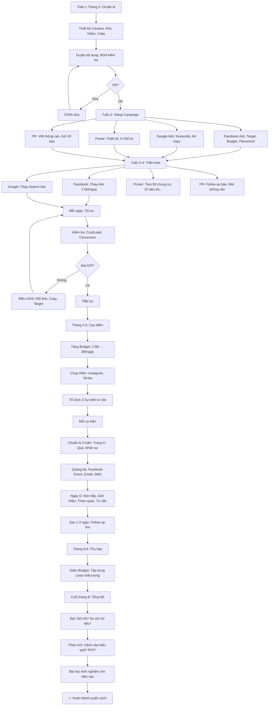

# SOP-01.2: QUẢNG BÁ VÀ TRUYỀN THÔNG TUYỂN SINH

## 1. THÔNG TIN QUY TRÌNH

| **Thuộc tính** | **Nội dung** |
|---|---|
| Mã SOP | SOP-01.2 |
| Tên quy trình | Quảng bá và truyền thông tuyển sinh |
| Quy trình cha | SOP-01: Tuyển sinh |
| Phiên bản | 1.0 |
| Tần suất | Liên tục (Cao điểm: Tháng 3-6) |

## 2. MỤC ĐÍCH

- **Tạo nhận diện**: PH biết đến trường
- **Thu hút Lead**: PH quan tâm, Đăng ký tư vấn
- **Chuyển đổi**: Lead → Đăng ký nhập học
- **Xây dựng thương hiệu**: Uy tín, Chuyên nghiệp

## 3. PHẠM VI ÁP DỤNG

Tất cả kênh quảng bá (Online + Offline)

## 4. KÊNH QUẢNG BÁ

### 4.1. Kênh Online (70% ngân sách)

```
╔══════════════════════════════════════════════════════════════════╗
║              KÊNH ONLINE - 140M/200M (70%)                       ║
╠══════════════════════════════════════════════════════════════════╣
║ 1. FACEBOOK ADS (80M - 40% tổng)                                 ║
║    • Mục tiêu: Tạo Lead                                          ║
║    • Hình thức: Video, Ảnh, Carousel                             ║
║    • Target: Phụ nữ 28-45 tuổi, Quận X,Y,Z, Quan tâm giáo dục    ║
║    • Budget: 2.5M/ngày (Tháng 4-5 - Cao điểm!)                   ║
║    • KPI: Cost/Lead ≤200K, Conversion ≥5%                        ║
╠══════════════════════════════════════════════════════════════════╣
║ 2. GOOGLE ADS (40M - 20%)                                        ║
║    • Loại: Search Ads (Tìm kiếm)                                 ║
║    • Keywords: "Trường tiểu học quận X", "Trường quốc tế Hà Nội" ║
║    • Budget: 1.3M/ngày                                           ║
║    • KPI: CPC ≤15K, Conversion ≥8%                               ║
╠══════════════════════════════════════════════════════════════════╣
║ 3. WEBSITE (10M - 5%)                                            ║
║    • SEO: Viết blog, Tối ưu từ khóa                              ║
║    • Landing page: Tuyển sinh 2024 (Đẹp, Nhanh, Form đơn giản!)  ║
║    • KPI: Traffic 10K/tháng, Bounce rate <50%                    ║
╠══════════════════════════════════════════════════════════════════╣
║ 4. YOUTUBE (5M - 2.5%)                                           ║
║    • Video: Giới thiệu trường (3-5 phút)                         ║
║    • Quảng cáo: TrueView (Chạy trước video khác)                 ║
╠══════════════════════════════════════════════════════════════════╣
║ 5. EMAIL MARKETING (3M - 1.5%)                                   ║
║    • Gửi: PH đã đăng ký (Nurture)                                ║
║    • Nội dung: Thông tin tuyển sinh, Ưu đãi, Sự kiện...          ║
║    • KPI: Open rate ≥30%, Click rate ≥5%                         ║
╠══════════════════════════════════════════════════════╣
║ 6. TIKTOK/INSTAGRAM (2M - 1%)                                    ║
║    • Video ngắn (15-60s): Cuộc sống trường, HS vui vẻ...         ║
║    • Hashtag: #TruongIQ #TuyenSinh2024                           ║
╚══════════════════════════════════════════════════════════════════╝
```

### 4.2. Kênh Offline (30% ngân sách)

```
╔══════════════════════════════════════════════════════════════════╗
║              KÊNH OFFLINE - 60M/200M (30%)                       ║
╠══════════════════════════════════════════════════════════════════╣
║ 1. SỰ KIỆN TƯ VẤN (30M - 15%)                                    ║
║    • Số lượng: 3 sự kiện × 10M                                   ║
║    • Thời gian: Tháng 3, 4, 5 (Thứ 7, 9h-12h)                    ║
║    • Nội dung: Tham quan trường, Tư vấn, Ưu đãi...               ║
║    • KPI: 200 PH/sự kiện, Conversion ≥40%                        ║
╠══════════════════════════════════════════════════════════════════╣
║ 2. POSTER, BANNER (20M - 10%)                                    ║
║    • Vị trí: Chung cư, Siêu thị, Công viên... (Bán kính 5km)     ║
║    • Số lượng: 500 poster A3, 20 banner 2m×3m                    ║
║    • Thời gian: Treo tháng 3-6                                   ║
╠══════════════════════════════════════════════════════════════════╣
║ 3. TRUYỀN THÔNG ĐẠI CHÚNG (Báo, TV) (8M - 4%)                   ║
║    • Báo giấy: 2 bài (Thanh niên, Gia đình & Xã hội)             ║
║    • TV: 1 phóng sự (VTV2 - Kết nối)                             ║
╠══════════════════════════════════════════════════════════════════╣
║ 4. CHƯƠNG TRÌNH GIỚI THIỆU (2M - 1%)                             ║
║    • PH giới thiệu PH mới → Cả 2 được giảm 5% học phí            ║
║    • Quà tặng: 200K/1 giới thiệu thành công                      ║
╚══════════════════════════════════════════════════════════════════╝
```

## 5. QUY TRÌNH THỰC HIỆN

### 5.1. Facebook Ads

**Bước 1: Thiết kế Creative (Tuần 1 tháng 3)**

**A. Ảnh/Video:**

```
VIDEO 1: "Một ngày tại IQ School" (60s)
00-10s: HS vào trường (Cổng đẹp, An toàn)
10-25s: Học trong lớp (GV dạy, HS vui vẻ)
25-40s: Hoạt động ngoại khóa (Thể thao, Nghệ thuật...)
40-50s: Ăn trưa (Bếp sạch, Đồ ăn ngon)
50-60s: Tan học (PH đón, HS vẫy tay)

→ Cuối video: Logo + Slogan + CTA "ĐĂNG KÝ NGAY!"

ẢNH 1: Campus đẹp
ẢNH 2: GV dạy (Nhiệt tình)
ẢNH 3: HS vui vẻ
```

**B. Nội dung (Copy):**

```
POST MẪU:

"🎓 TUYỂN SINH NĂM HỌC 2024-2025 🎓

👉 Bạn đang tìm trường TỐT cho con?
👉 Chất lượng QUỐC TẾ, Học phí HỢP LÝ?

IQ SCHOOL - Lựa chọn của 500 Phụ huynh!

✅ Chương trình song ngữ (Việt - Anh) chuẩn Cambridge
✅ GV 100% chứng chỉ quốc tế
✅ Cơ sở hiện đại (Phòng STEM, Thư viện số...)
✅ Học phí chỉ 5 triệu/năm (Rẻ hơn 30%!)

🎁 ƯU ĐÃI ĐẶC BIỆT (Chỉ đến 31/3):
💰 Giảm 10% học phí (Đăng ký sớm)
🎒 Tặng Balo + Đồ dùng học tập (Trị giá 500K)

📞 ĐĂNG KÝ TƯ VẤN NGAY:
👉 Hotline: 1900-xxxx
👉 Hoặc CLICK "ĐĂNG KÝ" bên dưới!

Số lượng CÓ HẠN! Nhanh tay! ⏰"

[Nút CTA: "ĐĂNG KÝ TƯ VẤN MIỄN PHÍ"]
```

**Bước 2: Setup Campaign**

```
Campaign Settings:

• Mục tiêu: Lead generation (Thu thập thông tin)
• Target:
  - Giới tính: Nữ (70%), Nam (30%)
  - Tuổi: 28-45
  - Địa điểm: 10km quanh trường
  - Sở thích: Giáo dục, Nuôi dạy con, Gia đình...
  - Hành vi: Có con 3-12 tuổi (Facebook biết!)
  
• Budget: 2.5M/ngày (Tháng 4-5 cao điểm)
           1.5M/ngày (Tháng 3, 6)
           0.5M/ngày (Tháng 7-8)
           
• Placement: Facebook + Instagram News Feed

• Call-to-Action: Form đăng ký ngay trên Facebook
  (PH không cần vào Website → Tăng Conversion!)
```

**Bước 3: Chạy Ads (Tháng 3-8)**

**Bước 4: Tối ưu hằng ngày**

```
Mỗi ngày (9h sáng):
BP Truyền thông kiểm tra:

• Cost/Lead: Hôm qua 180K (Mục tiêu ≤200K) ✅
• Conversion: 6% (Mục tiêu ≥5%) ✅
• Lead: 15 lead/ngày

Nếu tốt → Giữ nguyên!
Nếu xấu (VD: Cost/Lead 350K) → Điều chỉnh:
  • Đổi ảnh/video
  • Đổi copy
  • Thu hẹp target
```

### 5.2. Google Ads

**Bước 1: Keyword Research**

```
CÔNG CỤ: Google Keyword Planner

TÌM KEYWORDS:

| Keyword | Lượt tìm/tháng | CPC | Cạnh tranh |
|---------|----------------|-----|------------|
| "trường tiểu học quận X" | 1,000 | 12K | Cao |
| "trường quốc tế Hà Nội" | 2,500 | 18K | Rất cao |
| "trường song ngữ giá rẻ" | 500 | 10K | Trung bình |
| "tuyển sinh lớp 1" | 800 | 8K | Thấp ✅ |

CHỌN:
• "tuyển sinh lớp 1" (Rẻ, Ít cạnh tranh!)
• "trường tiểu học quận X" (Đúng target!)
• ... (Tổng 20 keywords)
```

**Bước 2: Viết Ad**

```
AD MẪU:

Headline 1: Tuyển Sinh Lớp 1 - IQ School
Headline 2: Chất Lượng Quốc Tế - Học Phí 5M
Headline 3: Giảm 10% Nếu Đăng Ký Trước 31/3

Description:
"Chương trình song ngữ, GV chứng chỉ quốc tế,
Cơ sở hiện đại. Đăng ký ngay để nhận ưu đãi!"

URL: https://iqschool.edu.vn/tuyen-sinh-2024

→ Landing page: Form đăng ký (Đơn giản!)
```

**Bước 3: Chạy + Tối ưu**

### 5.3. Sự kiện tư vấn (Offline)

**Bước 1: Lập kế hoạch sự kiện (1 tháng trước)**

```
═══════════════════════════════════════════════════════
  KẾ HOẠCH SỰ KIỆN "NGÀY HỘI TƯ VẤN TUYỂN SINH"
  Lần 1 - Tháng 3/2024
═══════════════════════════════════════════════════════

I. THÔNG TIN:
• Thời gian: 9h-12h, Thứ 7, 23/03/2024
• Địa điểm: Campus trường
• Đối tượng: PH quan tâm tuyển sinh
• Mục tiêu: 200 PH tham dự, 80 đăng ký (40%)

II. CHƯƠNG TRÌNH:

9h-9h30: Đón tiếp
• Check-in (Quét QR đăng ký)
• Phát tài liệu, Quà (Balo, Bút...)
• Trà, Nước

9h30-10h: Giới thiệu trường
• HT phát biểu (10 phút)
• Video giới thiệu (10 phút)
• Chia sẻ của PH cũ (10 phút)

10h-11h: Tham quan
• Chia nhóm (30 PH/nhóm)
• Tư vấn viên dẫn
• Xem: Lớp học, Thư viện, Bếp, Sân...

11h-11h30: Tư vấn 1-1
• PH gặp riêng Tư vấn viên
• Giải đáp thắc mắc
• Hỗ trợ đăng ký

11h30-12h: Kết thúc
• Phát voucher ưu đãi (Giảm 10% - Có hạn!)
• Chụp ảnh lưu niệm
• Gửi quà

III. NGÂN SÁCH: 10M

| Khoản | Chi phí |
|-------|---------|
| Trang trí | 2M |
| Quà tặng (200 × 100K) | 2M |
| Ăn uống | 3M |
| In ấn | 1M |
| Nhân sự | 1M |
| Dự phòng | 1M |

KỲ VỌNG:
• 200 PH tham dự
• 80 đăng ký (40%)
• Chi phí/Lead = 10M/200 = 50K (Rất rẻ!)
• Chi phí/HS nhập học = 10M/80 = 125K (Rẻ hơn Online!)

Trưởng BP TS ký: __________
═══════════════════════════════════════════════════════
```

**Bước 2: Chuẩn bị (3 tuần)**

**Bước 3: Tổ chức (Ngày G)**

**Bước 4: Follow-up (Sau 1-3 ngày)**

```
Tư vấn viên gọi điện/Nhắn tin:

"Chào quý PH,
Cảm ơn quý vị đã tham dự sự kiện hôm 23/3!

Quý vị đã quyết định chưa ạ?
Em có thể hỗ trợ gì thêm không?

Lưu ý: Ưu đãi 10% chỉ đến 31/3 (Còn 8 ngày!)

Trân trọng,
[Tên] - IQ School"

→ PH chưa quyết định → Tư vấn thêm!
→ PH đã quyết định → Hỗ trợ đăng ký!
```

### 5.4. Poster, Banner

**Bước 1: Thiết kế (Tuần 1 tháng 3)**

```
POSTER A3 (500 tờ):

┌─────────────────────────────────────┐
│  [Ảnh đẹp: HS vui vẻ trong lớp]     │
│                                     │
│     TUYỂN SINH NĂM 2024-2025        │
│         IQ SCHOOL                   │
│                                     │
│  ✅ Chất lượng Quốc tế              │
│  ✅ Học phí Hợp lý (5M/năm)         │
│  ✅ Ưu đãi đến 31/3: Giảm 10%!      │
│                                     │
│  📞 Hotline: 1900-xxxx              │
│  🌐 Website: iqschool.edu.vn        │
│  📍 Địa chỉ: 123 Đường X, Quận Y    │
│                                     │
│  [QR Code - Đăng ký nhanh!]         │
└─────────────────────────────────────┘
```

**Bước 2: In ấn (Tuần 2)**

**Bước 3: Treo (Tuần 3-4)**

```
VỊ TRÍ TREO:

• Chung cư: 50 tòa (Bán kính 5km) → 200 poster
  (Xin phép Ban quản lý trước!)
  
• Siêu thị: 10 siêu thị → 100 poster
  (Trả phí: 500K/siêu thị/tháng)
  
• Công viên: 5 công viên → 50 poster
  
• Trường MN: 20 trường → 100 poster
  (Treo gần cổng, PH đón con thấy!)
  
• Bệnh viện Nhi: 2 BV → 50 poster

NGUYÊN TẮC:
✅ Hợp pháp (Xin phép!)
✅ Dễ thấy (Tầm mắt)
✅ Thay mới (Mỗi tháng - Tránh phai, Rách)
```

### 5.5. PR (Public Relations)

**Bước 1: Viết Thông cáo báo chí (Press Release - QT07-PR01)**

```
═══════════════════════════════════════════════════════
           THÔNG CÁO BÁO CHÍ
═══════════════════════════════════════════════════════

TRƯỜNG IQ CHÍNH THỨC TUYỂN SINH NĂM HỌC 2024-2025

Hà Nội, Ngày 01/03/2024

Trường Liên cấp Quốc tế IQ (IQ School) chính thức 
khởi động tuyển sinh năm học 2024-2025 với nhiều 
ưu đãi hấp dẫn.

THÔNG TIN TUYỂN SINH:
• Cấp: Mầm non, Tiểu học, THCS
• Chỉ tiêu: 150 học sinh
• Hạn đăng ký: 31/8/2024

ƯU ĐÃI:
• Giảm 10% học phí (Đăng ký trước 31/3)
• Tặng Balo + Đồ dùng (Trị giá 500K)
• Anh/Chị em: Giảm 15%

Ông [Tên], Hiệu trưởng chia sẻ:
"Năm nay, Chúng tôi cam kết mang đến chất lượng 
 giáo dục tốt nhất với học phí hợp lý nhất!"

Liên hệ: 
• Hotline: 1900-xxxx
• Website: iqschool.edu.vn
• Email: tuyensinh@iqschool.edu.vn

Thông tin chi tiết: [Đính kèm Brochure]

Người liên hệ:
[Tên BP Truyền thông]
SĐT: __________
Email: __________
═══════════════════════════════════════════════════════
```

**Bước 2: Gửi cho 20 báo (Email + Gọi điện)**

**Bước 3: Follow-up (Sau 3 ngày)**

```
Gọi điện:
"Chào anh/chị [Tên phóng viên],
Em là [Tên] - IQ School.
Em đã gửi Thông cáo báo chí về tuyển sinh.
Anh/Chị đã nhận được chưa ạ?"

Phóng viên: "Nhận rồi!"

BP TT: "Em có thể mời anh/chị đến thăm trường không ạ?
        Em sẽ sắp xếp phỏng vấn HT!"

→ 5/20 báo đồng ý → Viết bài! ✅
```

## 6. LƯU ĐỒ QUY TRÌNH



## 7. BIỂU MẪU LIÊN QUAN

| **Mã** | **Tên** |
|---|---|
| QT07-PR01 | Thông cáo báo chí |
| QT07-CR01 | Creative (Ảnh, Video - File thiết kế) |
| QT07-AD01 | Mẫu Ad (Facebook, Google) |

## 8. TIÊU CHUẨN VÀ CHỈ TIÊU

| **Chỉ tiêu** | **Mục tiêu** |
|---|---|
| Cost/Lead (Facebook) | ≤200K |
| Cost/Lead (Google) | ≤250K |
| Cost/Lead (Sự kiện) | ≤50K |
| Conversion (Facebook) | ≥5% |
| Conversion (Sự kiện) | ≥40% |
| ROI tổng | ≥3 |

## 9. TRÁCH NHIỆM CỤ THỂ

| **Vai trò** | **Trách nhiệm** |
|---|---|
| **BP Truyền thông** | Thiết kế Creative, Chạy Ads, Tối ưu |
| **BP Tuyển sinh** | Tổ chức sự kiện, Tư vấn, Follow-up |
| **IT** | Xây dựng Landing page, Form đăng ký |
| **Kế toán** | Quản lý ngân sách |

## 10. LƯU Ý QUAN TRỌNG

- ⚠️ **Test A/B**: Chạy 2 phiên bản Ad → Xem phiên bản nào tốt hơn!
- ✅ **Tối ưu hằng ngày**: Không để chạy tự động! Phải theo dõi!
- 🔥 **Ưu đãi có hạn**: "Chỉ đến 31/3!" → Tạo Urgency → PH quyết định nhanh!
- ✅ **Tracking**: Dùng UTM, Pixel → Biết Lead từ kênh nào!

## 11. PHỤ LỤC

### 11.1. Lịch quảng bá (Content Calendar)

```
THÁNG 3:
• Tuần 1: Khởi động (Post giới thiệu, Ads nhẹ)
• Tuần 2: Tăng tốc (Tăng Ads, Treo poster)
• Tuần 3: Sự kiện 1 (23/3)
• Tuần 4: Follow-up sự kiện

THÁNG 4 (CAO ĐIỂM!):
• Tuần 1: Post ưu đãi (Giảm 10% sắp hết!)
• Tuần 2: Sự kiện 2 (13/4)
• Tuần 3: Ads mạnh (3M/ngày!)
• Tuần 4: Sự kiện 3 (27/4)

THÁNG 5:
• Tuần 1-4: Duy trì Ads (2M/ngày)

THÁNG 6-8:
• Thu hẹp (1M/ngày)
• Tập trung chốt Lead cũ
```

### 11.2. Ví dụ Creative hiệu quả

**Facebook Post đạt 100K views, 500 Lead!**

```
Ảnh: Bé gái cười tươi trong lớp (Ánh sáng đẹp!)

Copy:
"Con bạn có HẠNH PHÚC khi đến trường? 😊

Tại IQ School:
✅ Con được học trong lớp hiện đại
✅ Cô giáo yêu thương, Tận tâm
✅ Bạn bè thân thiện
✅ Học mà vui như chơi!

500 Phụ huynh đã CHỌN IQ!
Bạn thì sao? 💙

🎁 Đăng ký TRƯỚC 31/3:
💰 GIẢM 10% học phí
🎒 TẶNG Balo trị giá 500K!

👉 CLICK 'ĐĂNG KÝ' hoặc GỌI: 1900-xxxx"

[Nút: ĐĂNG KÝ TƯ VẤN]

→ Tại sao hiệu quả?
• Hình ảnh ĐẸP (Cảm xúc!)
• Câu hỏi (Kích thích suy nghĩ!)
• Social proof (500 PH đã chọn!)
• Ưu đãi (Giảm 10%!)
• CTA rõ ràng (ĐĂNG KÝ!)
```

## 12. FAQ

**Q1: Chạy Ads hết 80M, Nhưng chỉ được 200 Lead (Mục tiêu 400!). Xử lý?**  
A: 
- Dừng Ads ngay! (Không tốt!)
- Phân tích: Tại sao? (Creative xấu? Target sai? Giá cao?)
- Thử: Đổi Creative, Thu hẹp target
- Hoặc: Chuyển sang kênh khác (Sự kiện, Giới thiệu...)

**Q2: Đối thủ chạy Ads "Công kích" trường mình. Xử lý?**  
A: 
- KHÔNG đáp trả công kích! (Mất hình ảnh!)
- Tập trung quảng bá điểm MẠNH của mình!
- Nếu họ nói SAI SỰ THẬT → Gửi công văn yêu cầu gỡ, Kiện (Nếu cần)!

**Q3: PH phàn nàn "Quảng cáo quá nhiều, Spam!". Xử lý?**  
A: 
- Xin lỗi ngay!
- Cho PH "Unsubscribe" (Ngừng nhận quảng cáo)
- Giảm tần suất (3 post/ngày → 1 post/ngày)

---

**PHÊ DUYỆT**

| BP Truyền thông | Trưởng BP TS | Phó HT |
|---|---|---|
| [Họ tên] | [Họ tên] | [Họ tên] |
