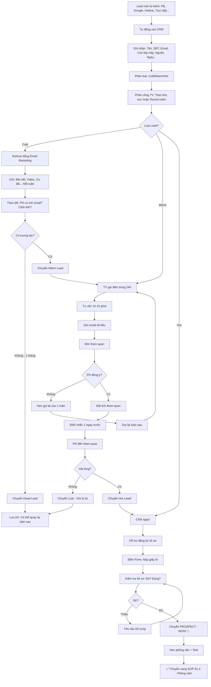

# SOP-01.3: TIẾP NHẬN VÀ XỬ LÝ HỒ SƠ TUYỂN SINH

## 1. THÔNG TIN QUY TRÌNH

| **Thuộc tính** | **Nội dung** |
|---|---|
| Mã SOP | SOP-01.3 |
| Tên quy trình | Tiếp nhận và xử lý hồ sơ tuyển sinh |
| Quy trình cha | SOP-01: Tuyển sinh |
| Phiên bản | 1.0 |
| Tần suất | Liên tục (Tháng 3-8) |

## 2. MỤC ĐÍCH

- **Tiếp nhận nhanh**: PH đăng ký → Phản hồi trong 24h
- **Quản lý hiệu quả**: Không để Lead thất thoát
- **Chuyển đổi cao**: Lead → Đăng ký → Nhập học
- **Trải nghiệm tốt**: PH hài lòng từ lần tiếp xúc đầu

## 3. PHẠM VI ÁP DỤNG

Tất cả Lead (PH quan tâm tuyển sinh)

## 4. PHÂN LOẠI LEAD

### 4.1. 4 loại Lead

```
╔══════════════════════════════════════════════════════════════════╗
║              4 LOẠI LEAD                                         ║
╠══════════════════════════════════════════════════════════════════╣
║ 1. COLD LEAD (Lạnh)                                              ║
║    • Vừa biết đến trường (Qua Ads, Poster...)                    ║
║    • Chưa có nhu cầu rõ ràng                                     ║
║    • Xử lý: Nurture (Nuôi dưỡng) bằng Email, Content...          ║
║    • Conversion: 5-10%                                           ║
╠══════════════════════════════════════════════════════════════════╣
║ 2. WARM LEAD (Ấm)                                                ║
║    • Đã tìm hiểu, So sánh trường                                 ║
║    • Có nhu cầu (Con lên lớp 1 năm sau...)                       ║
║    • Xử lý: Tư vấn, Mời tham quan                                ║
║    • Conversion: 20-30%                                          ║
╠══════════════════════════════════════════════════════════════════╣
║ 3. HOT LEAD (Nóng)                                               ║
║    • Sẵn sàng đăng ký (Đã tham quan, Hài lòng)                   ║
║    • Chỉ cần: Ưu đãi, Hỗ trợ hồ sơ                               ║
║    • Xử lý: Chốt ngay! Hỗ trợ tối đa!                            ║
║    • Conversion: 60-80%                                          ║
╠══════════════════════════════════════════════════════════════════╣
║ 4. DEAD LEAD (Chết)                                              ║
║    • Không còn quan tâm (Chọn trường khác, Không liên lạc được...)║
║    • Xử lý: Lưu trữ (Có thể quay lại năm sau!)                   ║
║    • Conversion: <1%                                             ║
╚══════════════════════════════════════════════════════════════════╝
```

### 4.2. Phễu chuyển đổi (Sales Funnel)

```
         1000 Lead (100%)
              │
              ↓
   [COLD: 400]  [WARM: 500]  [HOT: 100]
        │            │             │
        ↓            ↓             ↓
   Nurture      Tư vấn        Chốt ngay!
   (Email...)   (Call, Tour)  (Hỗ trợ)
        │            │             │
        ↓            ↓             ↓
   20 Đăng ký   150 Đăng ký   80 Đăng ký
   (5%)         (30%)         (80%)
        │            │             │
        └────────────┴─────────────┘
                     │
                     ↓
              250 ĐĂNG KÝ (25%)
                     │
                     ↓
              [Phỏng vấn + Test]
                     │
                     ↓
              190 ĐẬU (76%)
                     │
                     ↓
              [Hoàn thiện hồ sơ]
                     │
                     ↓
              150 NHẬP HỌC (60%)
                     
→ Conversion tổng: 150/1000 = 15%
→ Mất 850 Lead! Tìm cách giảm!
```

## 5. QUY TRÌNH TIẾP NHẬN

### 5.1. Tiếp nhận online (70% Lead)

**A. Lead từ Facebook Ads:**

```
PH click "ĐĂNG KÝ" trên Facebook Ad
→ Form hiện ra ngay:

┌─────────────────────────────────────┐
│  ĐĂNG KÝ TƯ VẤN TUYỂN SINH          │
├─────────────────────────────────────┤
│ Họ tên PH: [____________]           │
│ SĐT: [____________]                 │
│ Email: [____________]               │
│ Con học lớp: [Chọn: MN/1/2...]      │
│ Khu vực: [Chọn: Quận X/Y...]        │
│                                     │
│ [Nút: GỬI ĐĂNG KÝ]                  │
└─────────────────────────────────────┘

PH điền → Click GỬI
→ Thông tin tự động vào CRM!
→ PH nhận SMS ngay:
  "Cảm ơn quý vị đã đăng ký!
   Chúng tôi sẽ liên hệ trong 24h!"
```

**B. Lead từ Website:**

```
Tương tự Facebook, Nhưng:
• Form phức tạp hơn (Nhiều câu hỏi: Con năm nay lên mấy? Mong muốn gì?...)
• Có Chatbot (Trả lời tự động)
```

**C. Lead từ Hotline:**

```
PH gọi: 1900-xxxx

Tư vấn viên:
"IQ School xin chào! Em là [Tên]. Em có thể giúp gì ạ?"

PH: "Em muốn hỏi về tuyển sinh lớp 1!"

TV: "Dạ, Con quý vị năm nay lên lớp 1 ạ?"
[Hỏi thêm thông tin...]

"Em ghi nhận thông tin quý vị:
 • Họ tên: __________
 • SĐT: __________
 • Con lên lớp 1
 
 Em sẽ gửi email tài liệu cho quý vị!
 Quý vị có muốn đặt lịch tham quan không ạ?"

→ Nhập thông tin vào CRM ngay (Trong lúc gọi!)
```

### 5.2. Tiếp nhận offline (30% Lead)

**A. PH đến trường trực tiếp:**

```
Bảo vệ: "Chào quý vị! Quý vị đến trường có việc gì ạ?"

PH: "Em muốn hỏi về tuyển sinh!"

Bảo vệ: "Dạ, Mời quý vị vào Phòng Tuyển sinh! Ở đây ạ!"
[Dẫn đường]

---TẠI PHÒNG TUYỂN SINH---

Tư vấn viên: "Chào quý vị! Mời ngồi!"
[Pha trà/nước]

"Quý vị muốn hỏi về lớp nào ạ?"
[Tư vấn...]

"Em ghi nhận thông tin quý vị nhé!"
[Điền Form giấy hoặc Nhập CRM]

"Quý vị có muốn tham quan trường không ạ?"
→ Có → Dẫn đi ngay! (Nếu không bận)
→ Không → Hẹn ngày khác!
```

**B. Lead từ sự kiện:**

```
Sự kiện tư vấn:
• PH đến → Check-in (Scan QR)
• Thông tin tự động vào CRM!
• Sau sự kiện → Follow-up!
```

## 6. XỬ LÝ LEAD TRONG CRM

### 6.1. Nhập thông tin (Ngay khi nhận Lead)

```
CRM (Phần mềm quản lý Lead):

╔══════════════════════════════════════════════════════╗
║  THÔNG TIN LEAD                                      ║
╠══════════════════════════════════════════════════════╣
║ • Họ tên PH: Nguyễn Thị A                            ║
║ • SĐT: 0912-xxx-xxx                                  ║
║ • Email: nguyena@gmail.com                           ║
║ • Địa chỉ: Quận X                                    ║
║ • Con: Tên Bé B, 6 tuổi, Lên lớp 1 (2024)           ║
║ • Nguồn: Facebook Ads (Campaign: TS2024-FB01)        ║
║ • Ngày: 15/03/2024, 10:30                            ║
║ • Ghi chú: "PH quan tâm Tiếng Anh, Hỏi học phí"      ║
║                                                      ║
║ TRẠNG THÁI: 🟡 WARM LEAD                             ║
║ NGƯỜI PHỤ TRÁCH: Tư vấn viên X                       ║
║ HÀNH ĐỘNG KẾ TIẾP: Gọi điện tư vấn (Trong 24h)      ║
╚══════════════════════════════════════════════════════╝
```

### 6.2. Phân công (Tự động hoặc Thủ công)

```
QUY TẮC PHÂN CÔNG:

• Mỗi Tư vấn viên: Phụ trách 1 khu vực
  - TV1: Quận X
  - TV2: Quận Y
  - TV3: Quận Z
  
• Lead từ Quận X → Tự động phân cho TV1!

HOẶC:

• Round-robin: Chia đều
  - Lead 1 → TV1
  - Lead 2 → TV2
  - Lead 3 → TV3
  - Lead 4 → TV1 (Vòng lại!)
```

### 6.3. Follow-up (Trong 24h)

**Bước 1: Gọi điện (Lần 1 - Trong 24h)**

```
TV gọi: 0912-xxx-xxx

PH: "A lô?"

TV: "Chào quý PH, Em là [Tên] - IQ School.
     Quý vị đã đăng ký tư vấn tuyển sinh hôm qua.
     Giờ quý vị có tiện nói chuyện không ạ?"

PH: "Có!" (Hoặc "Giờ em bận, Chiều gọi lại!")

TV: "Dạ, Con quý vị năm nay lên lớp 1 ạ?
     [Hỏi thêm...]
     
     Quý vị quan tâm điểm nào nhất ạ?
     [PH: Chất lượng, Học phí, An toàn...]
     
     [Tư vấn cụ thể...]
     
     Quý vị có muốn đến tham quan trường không ạ?
     Em sắp xếp giúp quý vị!"

→ PH đồng ý → Đặt lịch!
→ PH từ chối → Hẹn gọi lại sau!

NHẬP CRM:
• Đã gọi: ✅
• Kết quả: Đặt lịch tham quan 20/3, 9h
• Ghi chú: "PH quan tâm Tiếng Anh, Học phí"
```

**Bước 2: Gửi Email (Sau khi gọi)**

```
Subject: Cảm ơn quý vị quan tâm IQ School!

Nội dung:

Kính gửi quý PH [Tên],

Cảm ơn quý vị đã quan tâm đến IQ School!

Như trao đổi qua điện thoại, Em gửi quý vị:
• Brochure giới thiệu trường [Đính kèm PDF]
• Bảng học phí chi tiết [Đính kèm]
• Video giới thiệu [Link YouTube]

LỊCH THAM QUAN:
• Ngày: 20/03/2024
• Giờ: 9:00
• Địa chỉ: 123 Đường X, Quận Y
[Link Google Maps]

Mọi thắc mắc, Liên hệ em:
• SĐT: __________
• Email: __________

Rất mong được gặp quý vị!

Trân trọng,
[Tên TV] - IQ School
```

**Bước 3: Nhắc lịch (1 ngày trước)**

```
SMS:
"Kính chào quý PH,
Nhắc lịch: MAI (20/3), 9h quý vị tham quan IQ School.
Địa chỉ: 123 Đường X.
Xác nhận: 1900-xxxx
IQ School"
```

### 5.4. Theo dõi hành trình Lead (Customer Journey)

**Ghi nhận mọi tương tác:**

```
LEAD: Nguyễn Thị A - 0912-xxx-xxx

LỊCH SỬ TƯƠNG TÁC:

15/03, 10:30: Đăng ký qua Facebook Ads
              → Phân cho TV1
              
15/03, 14:00: TV1 gọi điện lần 1
              → PH bận, Hẹn gọi lại chiều
              
15/03, 16:30: TV1 gọi lại
              → Tư vấn 15 phút
              → Đặt lịch tham quan 20/3
              
15/03, 17:00: Gửi email tài liệu
              → PH đã mở email (Tracking!)
              
19/03, 9:00: SMS nhắc lịch
              
20/03, 9:00: PH đến tham quan
              → Hài lòng!
              → Đăng ký hồ sơ ngay!
              
20/03, 10:00: Hỗ trợ điền hồ sơ
              → Hoàn thành!
              
25/03: Hẹn phỏng vấn + Test 30/3

→ CHUYỂN SANG PROSPECT (Đã đăng ký hồ sơ)!
```

## 7. QUẢN LÝ LEAD BẰNG CRM

### 7.1. Trạng thái Lead

**Workflow tự động:**

```
Lead mới → [NEW]
    ↓ (Sau 24h - TV gọi)
[CONTACTED] (Đã liên hệ)
    ↓ (PH đồng ý tham quan)
[QUALIFIED] (Tiềm năng)
    ↓ (PH đã tham quan)
[PROPOSAL] (Đang xem xét)
    ↓ (PH đăng ký hồ sơ)
[WON] - PROSPECT 🎉 (Thành công!)
    
Hoặc:
    ↓ (PH từ chối)
[LOST] - DEAD LEAD ❌ (Thất bại!)
```

### 7.2. Nhiệm vụ tự động (Task Automation)

```
CRM TỰ ĐỘNG TẠO TASK:

Lead mới (Trạng thái: NEW)
→ Task: "Gọi điện PH Nguyễn Thị A trong 24h"
   → Phân cho: TV1
   → Deadline: 16/03, 10:30
   
PH đồng ý tham quan
→ Task: "Chuẩn bị tài liệu cho PH A (Tham quan 20/3)"
   → Phân cho: NV Phòng TS
   → Deadline: 19/03
   
PH tham quan xong
→ Task: "Follow-up PH A (Sau 2 ngày)"
   → Phân cho: TV1
   → Deadline: 22/03

→ TV không bao giờ quên! Hệ thống nhắc!
```

### 7.3. Báo cáo tự động

```
Dashboard CRM (Xem real-time):

┌──────────────────────────────────────────────────┐
│  TỔNG QUAN LEAD - THÁNG 3                        │
├──────────────────────────────────────────────────┤
│ • Tổng Lead: 350                                 │
│ • New: 50 (14%)                                  │
│ • Contacted: 100 (29%)                           │
│ • Qualified: 120 (34%)                           │
│ • Proposal: 50 (14%)                             │
│ • Won (Đăng ký): 30 (9%) 🎉                      │
│ • Lost: 20 (6%)                                  │
│                                                  │
│ CONVERSION: 30/350 = 8.6%                        │
│ MỤC TIÊU: ≥10% → Chưa đạt! ⚠️                   │
│                                                  │
│ → HÀNH ĐỘNG: Tăng cường follow-up Lead cũ!       │
└──────────────────────────────────────────────────┘
```

## 8. LƯU ĐỒ QUY TRÌNH



## 9. BIỂU MẪU LIÊN QUAN

| **Mã** | **Tên** |
|---|---|
| QT07-F01 | Form đăng ký tư vấn (Online) |
| QT07-F02 | Form đăng ký hồ sơ tuyển sinh |
| QT07-BC01 | Báo cáo Lead tháng |

## 10. TIÊU CHUẨN VÀ CHỈ TIÊU

| **Chỉ tiêu** | **Mục tiêu** |
|---|---|
| Thời gian phản hồi Lead | ≤24h |
| Tỷ lệ Lead được gọi điện | 100% |
| Conversion (Lead → Đăng ký hồ sơ) | ≥25% |
| Tỷ lệ Lost (Do không follow-up kịp) | ≤10% |

## 11. TRÁCH NHIỆM CỤ THỂ

| **Vai trò** | **Trách nhiệm** |
|---|---|
| **Tư vấn viên** | Gọi điện, Tư vấn, Follow-up, Nhập CRM |
| **BP Tuyển sinh** | Giám sát, Phân công, Báo cáo |
| **IT** | Bảo trì CRM, Tích hợp (Facebook, Website...) |

## 12. LƯU Ý QUAN TRỌNG

- ⚠️ **24h vàng**: Lead mới → Gọi trong 24h! Chậm hơn → Mất Lead!
- ✅ **Ghi chú đầy đủ**: Mỗi lần gọi → Ghi lại! (Lần sau biết đã nói gì!)
- 🔥 **Kiên trì**: PH không nghe máy → Gọi lại! (Tối đa 3 lần/ngày)
- ✅ **Nhiệt tình**: Giọng nói vui vẻ, Tư vấn tận tâm → PH thích!

## 13. PHỤ LỤC

### 13.1. Script tư vấn điện thoại (Mẫu)

```
═══════════════════════════════════════════════════════
        SCRIPT TƯ VẤN ĐIỆN THOẠI
═══════════════════════════════════════════════════════

BƯỚC 1: CHÀO HỎI (5s)
"Chào quý PH, Em là [Tên] - IQ School.
 Quý vị đã đăng ký tư vấn. Giờ có tiện không ạ?"

BƯỚC 2: XÁC NHẬN THÔNG TIN (10s)
"Dạ, Con quý vị tên [Tên bé], Năm nay lên lớp 1 đúng không ạ?"

BƯỚC 3: HỎI NHU CẦU (30s)
"Quý vị đang tìm hiểu trường cho con?
 Quý vị quan tâm điểm nào nhất ạ?
 • Chất lượng?
 • Học phí?
 • Cơ sở?
 • An toàn?
 • Khác?"

[PH trả lời: "Em quan tâm Tiếng Anh!"]

BƯỚC 4: TƯ VẤN (2-3 phút)
"Dạ, IQ School có chương trình song ngữ Việt-Anh.
 Con học Tiếng Anh từ lớp 1!
 GV 100% có chứng chỉ quốc tế (IELTS, TOEFL...)
 
 [Giải thích thêm...]
 
 Quý vị có thắc mắc gì không ạ?"

[Trả lời thắc mắc...]

BƯỚC 5: MỜI THAM QUAN (30s)
"Quý vị có muốn đến xem trường không ạ?
 Để con và Quý vị tận mắt thấy cơ sở, Gặp GV!
 
 Quý vị thuận tiện ngày nào ạ?
 • Thứ 7 (9h-12h)?
 • Chủ nhật (9h-12h)?
 • Hoặc Ngày thường (Hẹn trước)?"

[PH chọn: "Thứ 7, 20/3, 9h"]

BƯỚC 6: XÁC NHẬN (20s)
"OK! Em ghi nhận:
 • Quý PH [Tên]
 • Thứ 7, 20/3, 9h
 • Tham quan + Tư vấn
 
 Em sẽ gửi email xác nhận và SMS nhắc 1 ngày trước!
 Xin cảm ơn quý vị! Hẹn gặp lại!"

TỔNG THỜI GIAN: 4-5 phút

LƯU Ý:
✅ Giọng vui vẻ, Nhiệt tình
✅ Lắng nghe PH (Đừng nói 1 mình!)
✅ Trả lời đúng trọng tâm
✅ Không nói xấu trường khác!
═══════════════════════════════════════════════════════
```

### 13.2. Xử lý Lead khó

**A. PH không nghe máy (3 lần):**

```
GIẢI PHÁP:
• Gửi SMS: "Chào quý PH, IQ School gọi 3 lần không được.
            Quý vị gọi lại: 1900-xxxx. Xin cảm ơn!"
• Gửi Email
• Chuyển trạng thái: "Chờ PH phản hồi"
• Sau 1 tuần vẫn không phản hồi → Chuyển Dead Lead
```

**B. PH thắc mắc khó (Không biết trả lời):**

```
PH: "Chương trình Toán của trường theo sách nào?"

TV: (Không biết!) 
"Dạ, Câu này em chưa rõ. Em sẽ hỏi BGH và Gọi lại quý vị chiều nay được không ạ?"

→ Hỏi GVCN/BGH
→ Gọi lại PH (Trong ngày!)
→ Trả lời đầy đủ!

KHÔNG: Nói bừa! → PH phát hiện → Mất lòng tin!
```

**C. PH so sánh với trường khác:**

```
PH: "Trường X học phí 4M, Sao trường các em 5M?"

TV: "Dạ, Trường X là trường tốt. Nhưng:
     • Trường X: Cơ sở cũ (Xây 2010)
     • IQ: Cơ sở mới (Xây 2023) - Hiện đại hơn!
     
     • Trường X: GV phổ thông
     • IQ: GV 100% chứng chỉ quốc tế
     
     Chất lượng cao hơn → Học phí cao hơn 1M là hợp lý ạ!
     
     Quý vị đến tham quan 2 trường, So sánh nhé!"

→ KHÔNG nói xấu trường khác!
→ NHẤN MẠNH điểm MẠNH của mình!
```

## 14. FAQ

**Q1: Lead quá nhiều (500/tháng), TV không xử lý nổi. Làm sao?**  
A: 
- Tuyển thêm TV (2-3 người)
- Hoặc: Giảm Ads (Giảm Lead xuống 300)
- Ưu tiên: Warm, Hot Lead (Bỏ qua Cold!)

**Q2: Conversion thấp (Lead → Đăng ký chỉ 10%, Mục tiêu 25%). Tại sao?**  
A: Kiểm tra:
- Lead có CHẤT LƯỢNG không? (Đúng đối tượng?)
  → Nếu sai target → Điều chỉnh Facebook Ads!
- TV có TƯ VẤN TỐT không?
  → Nghe lại cuộc gọi (Call recording)
  → Đào tạo lại TV!

**Q3: CRM quá phức tạp, TV không dùng. Xử lý?**  
A: 
- Đào tạo TV (1 ngày)
- Hoặc: Dùng CRM đơn giản hơn (VD: Google Sheet!)
- Bắt buộc: Phải dùng! Không dùng → Thất thoát Lead!

---

**PHÊ DUYỆT**

| Trưởng BP TS | Phó HT |
|---|---|
| [Họ tên] | [Họ tên] |
