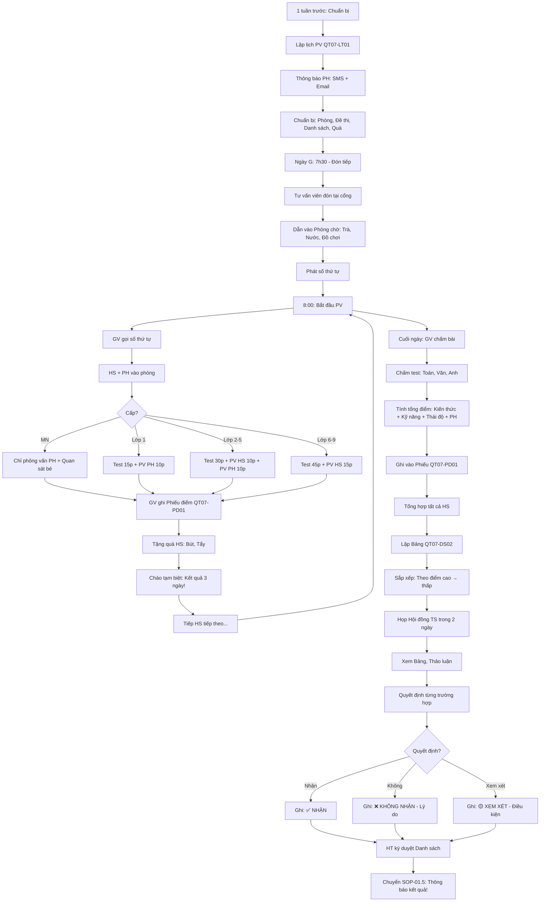

# SOP-01.4: TỔ CHỨC PHỎNG VẤN VÀ KIỂM TRA ĐẦU VÀO

## 1. THÔNG TIN QUY TRÌNH

| **Thuộc tính** | **Nội dung** |
|---|---|
| Mã SOP | SOP-01.4 |
| Tên quy trình | Tổ chức phỏng vấn và kiểm tra đầu vào |
| Quy trình cha | SOP-01: Tuyển sinh |
| Phiên bản | 1.0 |
| Tần suất | Theo lịch (Tháng 5-8, Mỗi tuần 1-2 đợt) |

## 2. MỤC ĐÍCH

- **Đánh giá năng lực**: HS có đủ trình độ học tại trường?
- **Phân lớp phù hợp**: HS vào lớp nào? (Chuẩn/Nâng cao)
- **Tuyển chọn**: Chọn HS tốt nhất (Nếu đăng ký nhiều hơn chỉ tiêu)
- **Tạo ấn tượng**: PH thấy trường chuyên nghiệp

## 3. PHẠM VI ÁP DỤNG

Tất cả HS đăng ký tuyển sinh (Lớp 1 trở lên)

**Lưu ý:** Mầm non KHÔNG cần Test (Quá nhỏ!)

## 4. HÌNH THỨC ĐÁNH GIÁ

### 4.1. Theo cấp học

```
╔══════════════════════════════════════════════════════════════════╗
║           HÌNH THỨC ĐÁNH GIÁ THEO CẤP                            ║
╠══════════════════════════════════════════════════════════════════╣
║ MẦM NON:                                                         ║
║  • KHÔNG test!                                                   ║
║  • Chỉ phỏng vấn PH (Tìm hiểu gia đình, Mong muốn...)            ║
║  • Quan sát bé (Vui vẻ? Giao tiếp?)                              ║
║  • Mục đích: Tìm hiểu, Tạo thiện cảm (Không loại!)               ║
╠══════════════════════════════════════════════════════════════════╣
║ LỚP 1:                                                           ║
║  • Test nhẹ (30 phút):                                           ║
║    - Nhận biết: Màu sắc, Hình khối, Số đếm (1-10)                ║
║    - Kỹ năng: Cầm bút, Tô màu                                    ║
║    - Giao tiếp: Nói chuyện với GV                                ║
║  • Phỏng vấn PH (15 phút)                                        ║
║  • Mục đích: Tìm hiểu năng lực cơ bản (Không loại - Trừ đặc biệt)║
╠══════════════════════════════════════════════════════════════════╣
║ LỚP 2-5 (Chuyển trường):                                         ║
║  • Test (60 phút):                                               ║
║    - Toán: 10 câu (Lớp dưới)                                     ║
║    - Văn: Đọc đoạn văn, Trả lời câu hỏi                          ║
║    - Anh: Giao tiếp cơ bản (Nếu trường quốc tế)                  ║
║  • Phỏng vấn HS (10 phút): Tại sao chuyển? Sở thích?             ║
║  • Mục đích: Xếp lớp phù hợp, Tuyển chọn (Nếu quá nhiều HS)      ║
╠══════════════════════════════════════════════════════════════════╣
║ LỚP 6-9:                                                         ║
║  • Test (90 phút):                                               ║
║    - Toán: 15 câu                                                ║
║    - Văn: Viết đoạn văn ngắn (200 từ)                            ║
║    - Anh: Nghe, Nói, Đọc, Viết                                   ║
║  • Phỏng vấn HS (15 phút): Định hướng, Ước mơ, Kỹ năng...        ║
║  • Mục đích: Tuyển chọn (Chỉ nhận HS đạt ≥60%)                   ║
╚══════════════════════════════════════════════════════════════════╝
```

### 4.2. Tiêu chí đánh giá

**Thang điểm 100:**

| **Tiêu chí** | **Điểm** | **Ghi chú** |
|---|---|---|
| **Kiến thức** | 50 | Test Toán, Văn, Anh |
| **Kỹ năng** | 20 | Giao tiếp, Tư duy, Sáng tạo... |
| **Thái độ** | 20 | Lịch sự, Tự tin, Hợp tác... |
| **Phỏng vấn PH** | 10 | Gia đình, Mong muốn, Cam kết... |

**Xếp loại:**

```
• 80-100: XUẤT SẮC → Nhận ngay! Có thể vào lớp Nâng cao!
• 60-79: TỐT → Nhận! Vào lớp Chuẩn!
• 40-59: TRUNG BÌNH → Xem xét (Nếu chỉ tiêu còn!)
• <40: YẾU → Không nhận! (Hoặc Đề nghị học lớp dưới)
```

## 5. QUY TRÌNH TỔ CHỨC

### 5.1. Chuẩn bị (1 tuần trước)

**Bước 1: Lập lịch phỏng vấn (QT07-LT01)**

```
═══════════════════════════════════════════════════════
    LỊCH PHỎNG VẤN - ĐỢT 1
    Ngày: Thứ 7, 30/03/2024
═══════════════════════════════════════════════════════

| Giờ | Mã HS | Họ tên | Lớp TS | Phòng | GV PV |
|-----|-------|--------|--------|-------|-------|
| 8:00 | TS001 | Nguyễn VA | 1 | P101 | Cô X |
| 8:30 | TS002 | Trần Thị B | 1 | P101 | Cô X |
| 9:00 | TS003 | Lê Văn C | 1 | P101 | Cô X |
| ... | ... | ... | ... | ... | ... |
| 8:00 | TS020 | Phạm Thị D | 6 | P102 | Thầy Y |
| ... | ... | ... | ... | ... | ... |

TỔNG: 50 HS (Lớp 1: 30, Lớp 6: 20)
GV phỏng vấn: 5 người
Phòng: 5 phòng

Trưởng BP TS ký: __________
═══════════════════════════════════════════════════════
```

**Bước 2: Thông báo PH (3 ngày trước)**

```
SMS + Email:

"Kính chào quý PH,

Con [Tên] được xếp lịch phỏng vấn:
• Ngày: Thứ 7, 30/03/2024
• Giờ: 8:00
• Địa điểm: Phòng 101, Trường IQ

YÊU CẦU:
• Đến đúng giờ (Trước 10 phút)
• Mang theo: CMND PH, Ảnh 3×4 (2 ảnh)
• Con mặc: Thoải mái, Gọn gàng

Mọi thắc mắc: 1900-xxxx

IQ School"
```

**Bước 3: Chuẩn bị vật chất**

```
PHÒNG PHỎNG VẤN:
□ Dọn sạch, Thoáng mát
□ Bàn ghế: 1 bàn GV, 2 ghế (HS + PH)
□ Bảng trắng, Bút (Nếu cần)
□ Nước uống (Cho HS, PH)

ĐỀ THI:
□ In sẵn (Số lượng = Số HS + 10% dự phòng)
□ Phong bì kín (Tránh lộ đề!)
□ Đáp án (Cho GV chấm)

DANH SÁCH:
□ In danh sách HS (Mỗi phòng 1 bản)
□ Phiếu điểm (QT07-PD01 - Mỗi HS 1 phiếu)

QUÀ TẶNG:
□ Bút chì, Tẩy (Tặng HS sau test)
```

### 5.2. Ngày phỏng vấn (Ngày G)

**Bước 4: Đón tiếp (7:30 - Trước 30 phút)**

```
Tư vấn viên tại cổng:
"Chào cháu! Chào quý PH!
 Cháu là em [Tên], Phỏng vấn lớp 1 ạ?"

PH: "Dạ!"

TV: "Mời quý vị và cháu vào Phòng chờ!"
[Dẫn đường]

TẠI PHÒNG CHỜ:
• Trà, Nước, Bánh
• Phát số thứ tự (Để gọi đúng thứ tự!)
• HS chơi (Đồ chơi, Sách tranh...)
```

**Bước 5: Phỏng vấn từng HS (30-60 phút/HS)**

**A. Lớp 1 (30 phút):**

```
8:00 - GV gọi: "Mời em số 1 - Nguyễn Văn A!"

HS + PH vào phòng

GV: "Chào cháu! Chào quý PH! Mời ngồi!"

PHẦN 1: Làm quen (5 phút)
GV: "Cháu tên gì?"
HS: "Con tên A ạ!"
GV: "A năm nay mấy tuổi?"
HS: "6 tuổi ạ!"
GV: "A thích gì?"
HS: "Con thích chơi bóng!"
GV: "Hay quá! Cô cũng thích bóng!"

PHẦN 2: Test (15 phút)
GV: "Giờ cô cho A làm bài nhé! A làm được bao nhiêu cũng được!"

[Phát đề]

ĐỀ TEST LỚP 1 (Mẫu):

Câu 1: Đếm số (Trỏ vào hình)
"Hình này có mấy quả táo?" [Hình: 5 quả táo]
□ 3  □ 4  □ 5  □ 6

Câu 2: Nhận biết màu
"Quả chuối màu gì?" [Hình: Quả chuối]
□ Đỏ  □ Vàng  □ Xanh

Câu 3-10: Tương tự (Hình khối, Phép cộng đơn giản...)

PHẦN 3: Phỏng vấn PH (10 phút)
[HS ra ngoài chơi, PH ở lại]

GV: "Con A rất vui vẻ!
     Quý PH mong muốn gì ở trường ạ?"
     
PH: [Trả lời...]

GV: "Quý vị có cam kết hợp tác với trường không?
     (Đưa con đến đúng giờ, Theo dõi học tập...)
     
PH: "Dạ có!"

GV: "Cảm ơn quý vị! Kết quả sẽ thông báo trong 3 ngày!"

CHẤM ĐIỂM:
• Kiến thức: 8/10 câu đúng → 40/50 điểm
• Kỹ năng (Cầm bút, Tô màu): Tốt → 18/20 điểm
• Thái độ (Vui vẻ, Lịch sự): Tốt → 18/20 điểm
• PH (Cam kết): Tốt → 8/10 điểm
TỔNG: 84/100 → XUẤT SẮC! ✅ NHẬN!
```

**B. Lớp 6-9 (60 phút):**

```
Test NẶNG hơn (45 phút):

• Toán (20 phút): 15 câu (Đại số, Hình học...)
• Văn (15 phút): Đọc văn, Trả lời 5 câu + Viết đoạn 200 từ
• Anh (10 phút): Nghe (Audio), Đọc (Passage), Viết câu

Phỏng vấn HS (15 phút):
"Em tại sao muốn học trường này?
 Em có sở thích gì?
 Em ước mơ làm gì sau này?"

→ Đánh giá: Tư duy, Giao tiếp, Tự tin...

Chấm điểm: Tổng 100 (Như trên)
```

### 5.3. Phòng phỏng vấn

**Bố trí:**

```
┌─────────────────────────────────────────────────┐
│            PHÒNG PHỎNG VẤN 101                  │
├─────────────────────────────────────────────────┤
│                                                 │
│          [Bảng trắng]                           │
│                                                 │
│      [Bàn GV]                                   │
│      Cô X ngồi                                  │
│                                                 │
│   [Bàn HS]        [Ghế PH]                      │
│   (HS làm bài)    (PH ngồi quan sát)            │
│                                                 │
│   [Đồ chơi] (Góc phòng - Nếu lớp 1)             │
│                                                 │
└─────────────────────────────────────────────────┘

KHÔNG KHÍ:
• Thân thiện, Không căng thẳng!
• GV mỉm cười, Động viên HS
• PH yên tâm quan sát
```

## 6. CHẤM ĐIỂM VÀ TỔNG HỢP

### 6.1. Chấm bài (Trong ngày hoặc Ngày hôm sau)

**Bước 1: GV chấm test**

```
Đề Toán lớp 6:

Câu 1: 2x + 3 = 9, x = ?
HS trả lời: x = 3 ✅ (Đúng!)

Câu 2: Tính diện tích hình vuông cạnh 5cm?
HS trả lời: 25cm² ✅

...

Tổng: 12/15 câu đúng → 40/50 điểm (Kiến thức)
```

**Bước 2: Ghi phiếu điểm (QT07-PD01)**

```
═══════════════════════════════════════════════════════
        PHIẾU ĐIỂM TUYỂN SINH
        Mã: TS-2024-001
═══════════════════════════════════════════════════════

Họ tên: Nguyễn Văn A
Lớp tuyển: 6
Ngày PV: 30/03/2024

I. KIẾN THỨC (50 điểm):
• Toán: 12/15 câu → 40/50 điểm
• Văn: Đọc hiểu tốt, Viết OK → 7/10 điểm (Bổ sung!)
• Anh: Giao tiếp tốt → 8/10 điểm

Tổng: 40 + 7 + 8 = 55/50... (Lỗi!)
→ Sửa: (40×50% + 7×25% + 8×25%)/50 = 38/50 điểm

II. KỸ NĂNG (20 điểm):
• Giao tiếp: 8/10
• Tư duy: 7/10
Tổng: 15/20

III. THÁI ĐỘ (20 điểm):
• Lịch sự: 9/10
• Tự tin: 8/10
Tổng: 17/20

IV. PHỎNG VẤN PH (10 điểm):
• Cam kết hợp tác: Tốt → 9/10

──────────────────────────────────────────────────────
TỔNG: 38 + 15 + 17 + 9 = 79/100

XẾP LOẠI: TỐT ✅
QUYẾT ĐỊNH: □ NHẬN  □ KHÔNG NHẬN  □ XEM XÉT

GV phỏng vấn ký: __________
═══════════════════════════════════════════════════════
```

**Bước 3: Tổng hợp (Sau khi chấm hết)**

```
BẢNG TỔNG HỢP ĐỢT 1 (50 HS):

| Mã | Họ tên | Lớp | Điểm | Xếp loại | Quyết định |
|----|--------|-----|------|----------|------------|
| TS001 | Nguyễn VA | 1 | 84 | Xuất sắc | ✅ Nhận |
| TS002 | Trần Thị B | 1 | 72 | Tốt | ✅ Nhận |
| TS003 | Lê Văn C | 1 | 45 | TB | 🟡 Xem xét |
| ... | ... | ... | ... | ... | ... |
| TS050 | Mai Văn Z | 6 | 35 | Yếu | ❌ Không nhận |

KẾT QUẢ:
• Xuất sắc (80-100): 15 HS (30%) → Nhận hết!
• Tốt (60-79): 25 HS (50%) → Nhận hết!
• TB (40-59): 8 HS (16%) → Xem xét (Nếu còn chỗ!)
• Yếu (<40): 2 HS (4%) → Không nhận!

QUYẾT ĐỊNH:
• Chỉ tiêu đợt này: 45
• Nhận: 40 (Xuất sắc + Tốt)
• Còn 5 chỗ → Nhận 5/8 HS TB (Chọn điểm cao nhất!)
```

### 5.4. Họp Hội đồng tuyển sinh (Sau mỗi đợt)

**Bước 4: Họp (Trong 2 ngày sau phỏng vấn)**

```
THÀNH PHẦN:
• HT (Hoặc Phó HT)
• Trưởng BP TS
• 3-5 GV đã phỏng vấn

NỘI DUNG:
1. Xem Bảng tổng hợp
2. Thảo luận các trường hợp khó:
   
   VD: HS C (45 điểm - TB)
   GV X: "Con C test yếu, Nhưng em rất lễ phép, Tự tin!
          Cô nghĩ nên cho em cơ hội!"
   GV Y: "Nhưng chỉ 45 điểm, Em sẽ học yếu mà!"
   
   HT: "Vậy nhé, Nhận em vào lớp Chuẩn (Không phải Nâng cao).
        GV sẽ hỗ trợ em thêm!"
   
   → Quyết định: NHẬN (Có điều kiện)
   
3. Phê duyệt danh sách cuối cùng

4. HT ký (QT07-DS02)
```

## 7. LƯU ĐỒ QUY TRÌNH



## 8. BIỂU MẪU LIÊN QUAN

| **Mã** | **Tên** |
|---|---|
| QT07-LT01 | Lịch phỏng vấn |
| QT07-PD01 | Phiếu điểm tuyển sinh |
| QT07-DS02 | Danh sách kết quả (HT ký) |
| QT07-DT01 | Đề test (Từng lớp) |

## 9. TIÊU CHUẨN VÀ CHỈ TIÊU

| **Chỉ tiêu** | **Mục tiêu** |
|---|---|
| Tỷ lệ HS tham gia phỏng vấn (Đã đăng ký) | ≥95% |
| Thời gian chấm điểm (Sau phỏng vấn) | ≤2 ngày |
| Tỷ lệ đậu | 70-80% (Không quá dễ, Không quá khó!) |
| PH hài lòng với quy trình PV | ≥90% |

## 10. TRÁCH NHIỆM CỤ THỂ

| **Vai trò** | **Trách nhiệm** |
|---|---|
| **GV phỏng vấn** | Phỏng vấn, Chấm điểm, Đề xuất |
| **Hội đồng TS** | Quyết định nhận/Không nhận |
| **BP TS** | Tổ chức, Lập lịch, Tổng hợp |
| **HT** | Ký duyệt danh sách cuối cùng |

## 11. LƯU Ý QUAN TRỌNG

- ⚠️ **Công bằng tuyệt đối**: Không thiên vị! (Dù con GV, Con quen...)
- ✅ **Thân thiện**: HS nhỏ dễ sợ! GV phải vui vẻ, Động viên!
- 🔥 **Bảo mật đề thi**: Không để lộ! (Tránh HS học trước!)
- ✅ **Ghi chú chi tiết**: Mỗi HS → Ghi nhận đặc điểm (Để xếp lớp sau!)

## 12. PHỤ LỤC

### 12.1. Mẫu đề test lớp 1

```
╔══════════════════════════════════════════════════════╗
║  ĐỀ TEST ĐẦU VÀO LỚP 1 - IQ SCHOOL                  ║
║  Năm học: 2024-2025                                  ║
╠══════════════════════════════════════════════════════╣
║ Họ tên: ____________  Ngày PV: ______                ║
║                                                      ║
║ Phần 1: TOÁN (5 câu)                                 ║
║                                                      ║
║ 1. Đếm số: [Hình 7 quả táo]                          ║
║    Có mấy quả? ____ quả                              ║
║                                                      ║
║ 2. So sánh: 5 ____ 3 (>,<,=)                         ║
║                                                      ║
║ 3. Phép cộng: 2 + 3 = ____                           ║
║                                                      ║
║ 4. Hình khối: [Hình vuông]                           ║
║    Đây là hình gì? ____________                      ║
║                                                      ║
║ 5. Màu sắc: [Quả chuối]                              ║
║    Quả chuối màu gì? ____________                    ║
║                                                      ║
║ Phần 2: KỸ NĂNG (3 câu)                              ║
║                                                      ║
║ 6. Tô màu: [Hình con mèo - Chưa tô]                  ║
║    Tô màu con mèo này!                               ║
║                                                      ║
║ 7. Nối điểm: [10 chấm tròn 1-10]                     ║
║    Nối theo thứ tự 1→2→3→...→10                      ║
║                                                      ║
║ 8. Kể chuyện: [Hình 4 ô: Trồng cây]                  ║
║    Kể cho cô nghe bức tranh này!                     ║
║                                                      ║
║ ĐIỂM: ____/100                                       ║
╚══════════════════════════════════════════════════════╝
```

### 12.2. Xử lý tình huống đặc biệt

**A. HS khóc, Không chịu làm bài:**

```
GV:
1. An ủi: "Không sao! Em đừng sợ!"
2. Cho bố/mẹ ở cạnh
3. Cho HS chơi đồ chơi (5 phút)
4. Khi HS bình tĩnh → Test lại!
5. Nếu vẫn khóc → Hoãn, Hẹn ngày khác!

KHÔNG: Ép HS! → HS sợ hơn!
```

**B. HS làm bài quá tốt (Nghi ngờ học trước):**

```
VD: HS lớp 1 làm đúng 10/10 câu!

GV:
1. Khen: "Giỏi quá!"
2. Hỏi thêm (Câu khó hơn - Không có trong đề):
   "3 + 5 = ?" (Không có trong đề)
   
Nếu HS trả lời đúng → Thật sự giỏi! ✅
Nếu không trả lời được → Có thể học trước đề! 🤔

→ Ghi chú: "HS có vẻ học trước, Nhưng nền tảng tốt!"
```

**C. PH ép "Con phải đậu!":**

```
PH: "Con em phải đậu! Tôi quen HT!"

GV:
"Dạ, Chúng em sẽ đánh giá công bằng!
 Nếu con đạt yêu cầu → Chắc chắn đậu!
 Quý vị yên tâm!"

→ KHÔNG hứa trước! Không vì quen mà thiên vị!
```

## 13. FAQ

**Q1: HS test yếu (30 điểm), Nhưng PH năn nỉ. Có nhận không?**  
A: TÙY:
- Nếu còn chỗ, Chưa đủ chỉ tiêu → Xem xét nhận (Lớp Chuẩn, Hỗ trợ thêm)
- Nếu đủ chỉ tiêu → KHÔNG! (Nhường chỗ HS tốt hơn!)

**Q2: Có nên cho PH xem đề thi không?**  
A: KHÔNG! (Bảo mật!)
Nhưng: Cho PH xem BÀI LÀM của con (Sau khi chấm) → OK!

**Q3: HS đặc biệt (Khuyết tật). Có test không?**  
A: CÓ! Nhưng:
- Điều chỉnh (VD: Khiếm thị → Đọc đề to, Cho thời gian nhiều hơn)
- Đánh giá theo khả năng (Không so với HS bình thường!)

---

**PHÊ DUYỆT**

| Trưởng BP TS | Phó HT | Hiệu trưởng |
|---|---|---|
| [Họ tên] | [Họ tên] | [Họ tên] |
