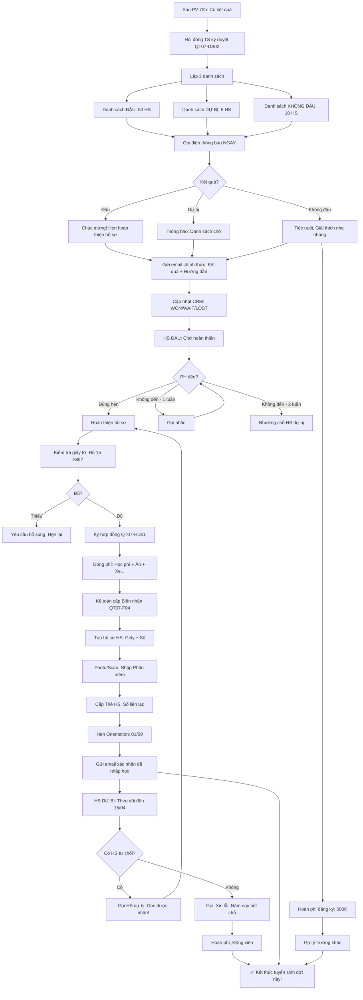

# SOP-01.5: THÔNG BÁO KẾT QUẢ VÀ HOÀN THIỆN NHẬP HỌC

## 1. THÔNG TIN QUY TRÌNH

| **Thuộc tính** | **Nội dung** |
|---|---|
| Mã SOP | SOP-01.5 |
| Tên quy trình | Thông báo kết quả và hoàn thiện nhập học |
| Quy trình cha | SOP-01: Tuyển sinh |
| Phiên bản | 1.0 |
| Tần suất | Sau mỗi đợt phỏng vấn (2-3 ngày) |

## 2. MỤC ĐÍCH

- **Thông báo nhanh**: PH biết kết quả sớm (Không chờ lâu lo lắng!)
- **Chốt nhập học**: HS đậu → Hoàn thiện hồ sơ → Chính thức nhập học
- **Giữ chân**: HS đậu nhưng chưa quyết định → Động viên, Ưu đãi
- **Giải thích**: HS không đậu → Giải thích nhẹ nhàng, Gợi ý trường khác

## 3. PHẠM VI ÁP DỤNG

Tất cả HS đã phỏng vấn

## 4. QUY TRÌNH THÔNG BÁO

### 4.1. Thông báo HS đậu (Within 72h)

**Bước 1: Lập danh sách HS đậu (Sau họp Hội đồng)**

```
DANH SÁCH HS TRÚNG TUYỂN - ĐỢT 1:
(HT đã ký duyệt!)

| Mã | Họ tên | Lớp | Điểm | Xếp loại | Loại lớp |
|----|--------|-----|------|----------|----------|
| TS001 | Nguyễn VA | 1 | 84 | Xuất sắc | Nâng cao |
| TS002 | Trần Thị B | 1 | 72 | Tốt | Chuẩn |
| ... | ... | ... | ... | ... | ... |

TỔNG: 45/50 HS đậu (90%)
```

**Bước 2: Gọi điện thông báo (Ngay sau khi có kết quả)**

```
TV gọi: 0912-xxx-xxx (PH của HS A)

PH: "A lô?"

TV: "Chào quý PH, Em là [Tên] - IQ School.
     Em xin thông báo:
     
     Con A ĐÃ TRÚNG TUYỂN lớp 1! 🎉
     
     Chúc mừng quý vị và con!"

PH: "Ồ, Cảm ơn!"

TV: "Con A test rất tốt! Điểm 84/100 - Xuất sắc!
     Con sẽ được xếp vào lớp Nâng cao!
     
     Bước tiếp theo:
     • Quý vị đến trường hoàn thiện hồ sơ
     • Thời gian: Trong tuần này (Trước 05/04)
     • Mang theo: [Liệt kê giấy tờ - Xem QT06]
     
     Quý vị thuận tiện ngày nào ạ?"

PH: "Thứ 4, 03/04 được không?"

TV: "Được ạ! Quý vị đến lúc mấy giờ?"

PH: "9h!"

TV: "OK! Em ghi nhận:
     • Quý PH [Tên]
     • Thứ 4, 03/04, 9h
     • Hoàn thiện hồ sơ
     
     Em sẽ gửi email danh sách giấy tờ cần mang!
     Xin cảm ơn!"
```

**Bước 3: Gửi email chính thức (Sau khi gọi điện)**

```
═══════════════════════════════════════════════════════
Subject: 🎉 Chúc mừng con đã TRÚNG TUYỂN IQ School!

Kính gửi quý PH Nguyễn Thị A,

Chúc mừng con [Tên bé] đã TRÚNG TUYỂN lớp 1
tại IQ School, Năm học 2024-2025!

KẾT QUẢ:
• Điểm: 84/100 (Xuất sắc!)
• Xếp loại: A
• Lớp: 1A - Nâng cao

BƯỚC TIẾP THEO:
Quý vị vui lòng đến trường hoàn thiện hồ sơ:
• Thời gian: Thứ 4, 03/04/2024, 9:00
• Địa điểm: Phòng Tuyển sinh, Tầng 1

MANG THEO:
□ CMND/CCCD (PH)
□ Giấy khai sinh (Bản gốc + 1 bản sao)
□ Học bạ Mầm non (Nếu có)
□ Phiếu sức khỏe (<6 tháng)
□ Sổ tiêm chủng
□ Ảnh 3×4 (6 ảnh)
□ Tiền đặt cọc: 5,000,000đ (Học phí tháng đầu)

CHI TIẾT: Xem file đính kèm "Hướng dẫn nhập học.pdf"

Mọi thắc mắc, Liên hệ: [Tên TV], SĐT: __________

Một lần nữa, Xin chúc mừng!
Chúng tôi rất mong được đồng hành cùng con!

Trân trọng,
Ban Tuyển sinh - IQ School
═══════════════════════════════════════════════════════
```

**Bước 4: Cập nhật CRM**

```
Lead: Nguyễn Thị A
→ Trạng thái: WON (Đã đậu!) 🎉
→ Chuyển sang: "Đợi hoàn thiện hồ sơ"
→ Task: "Nhắc PH nếu quá 03/04 chưa đến!"
```

### 4.2. Thông báo HS không đậu (Cùng thời điểm - 72h)

**Bước 1: Gọi điện (Nhẹ nhàng!)**

```
TV: "Chào quý PH, Em là [Tên] - IQ School."

PH: "Dạ, Kết quả thế nào?"

TV: "Dạ...Em rất tiếc phải thông báo:
     Lần này con chưa đạt yêu cầu ạ.
     
     [Dừng - Để PH tiêu hóa]"

PH: "Ủa? Tại sao?"

TV: "Con test đạt 45/100. Yêu cầu tối thiểu 60.
     Con còn cần cải thiện thêm về [X, Y...]
     
     Chúng em hiểu quý vị thất vọng.
     Nhưng đây là quyết định vì lợi ích của con ạ!"

PH: "Vậy à..."

TV: "Quý vị có thể:
     • Cho con học thêm 1 năm (Lớp chuẩn bị)
     • Hoặc Đăng ký trường khác phù hợp hơn
     • Hoặc Đăng ký lại năm sau (Khi con lớn hơn!)
     
     Chúng em sẵn sàng tư vấn thêm ạ!"
```

**Bước 2: Gửi email (Chính thức)**

```
Subject: Kết quả tuyển sinh - IQ School

Kính gửi quý PH [Tên],

Cảm ơn quý vị và con [Tên bé] đã tham gia
phỏng vấn tuyển sinh tại IQ School.

Chúng tôi rất tiếc thông báo:
Lần này con chưa đạt yêu cầu nhập học.

KẾT QUẢ:
• Điểm: 45/100
• Yêu cầu tối thiểu: 60/100

NHẬN XÉT:
Con có nền tảng, Nhưng cần cải thiện:
• Toán: Phép cộng, Trừ có nhớ
• Văn: Kỹ năng đọc hiểu

GỢI Ý:
• Cho con học thêm 6 tháng
• Đăng ký lại năm sau
• Hoặc Tham khảo: Trường [Y, Z] (Phù hợp con hơn)

Chúng tôi tin con sẽ tiến bộ!
Chúc con thành công!

Trân trọng,
Ban Tuyển sinh

---
P/S: Nếu có thắc mắc, Liên hệ: __________
```

**Bước 3: Hoàn phí (Nếu PH đã đóng phí đăng ký)**

```
Phí đăng ký: 500K (Phí xét hồ sơ)

HS KHÔNG ĐẬU:
→ Hoàn lại 100% (500K)
→ Chuyển khoản trong 7 ngày

Mục đích: Tạo thiện cảm! (PH có thể quay lại năm sau!)
```

### 4.3. Thông báo HS "Xem xét" (Có điều kiện)

**Bước 1: Gọi điện**

```
TV: "Chào quý PH,
     Con A đạt 58/100. Sát yêu cầu (60)!
     
     Chúng em XEM XÉT cho con cơ hội:
     Nếu quý vị CAM KẾT:
     • Hỗ trợ con học thêm ở nhà
     • Cho con học phụ đạo (Miễn phí - Trường hỗ trợ!)
     
     → Con sẽ được NHẬN!
     
     Quý vị đồng ý không ạ?"

PH: "Dạ, Đồng ý! Nhà em sẽ hỗ trợ con!"

TV: "Tuyệt! Vậy con được NHẬN!
     Quý vị đến hoàn thiện hồ sơ nhé!"
```

**Bước 2: PH ký cam kết (QT07-F03)**

```
═══════════════════════════════════════════════════════
        CAM KẾT HỖ TRỢ HỌC SINH
═══════════════════════════════════════════════════════

Tôi là PH của: _______________  Lớp: ____

Con em test đạt: 58/100 (Sát yêu cầu 60)

Trường XEM XÉT cho con cơ hội học thử (1 HK).

TÔI CAM KẾT:
□ Hỗ trợ con học thêm ở nhà
□ Cho con tham gia phụ đạo (2 buổi/tuần)
□ Theo dõi con chặt chẽ
□ Nếu con không theo kịp → Tôi chấp nhận cho con nghỉ/Lưu ban

                         PH ký: __________
                         Trường ký: __________
                         Ngày: __/__/____
═══════════════════════════════════════════════════════
```

## 5. HOÀN THIỆN NHẬP HỌC

### 5.1. PH đến hoàn thiện hồ sơ (Xem chi tiết QT-06, SOP-01.2)

**Bước 1: PH đến đúng hẹn (VD: 03/04, 9h)**

**Bước 2: NV tiếp đón, Kiểm tra giấy tờ (30 phút)**

```
Checklist 14 giấy tờ (QT06-CL02):
□ Giấy khai sinh
□ ... (Xem QT-06)

Nếu đủ ✅ → Tiếp tục
Nếu thiếu ❌ → Hẹn lại (Khi đủ giấy!)
```

**Bước 3: Ký hợp đồng (15 phút)**

```
Hợp đồng (QT07-HD01):

═══════════════════════════════════════════════════════
     HỢP ĐỒNG DỊCH VỤ GIÁO DỤC
     Số: ______/2024/HĐGD
═══════════════════════════════════════════════════════

BÊN A: TRƯỜNG IQ (Bên cung cấp dịch vụ)
Đại diện: HT [Họ tên]

BÊN B: PHỤ HUYNH (Bên sử dụng dịch vụ)
Họ tên: _______________  CMND: _______________

Về việc: Học sinh [Tên] học tại Trường IQ

ĐIỀU 1: THỜI GIAN
• Năm học: 2024-2025 (1 năm)
• Gia hạn: Tự động (Nếu không thông báo hủy)

ĐIỀU 2: HỌC PHÍ
• Học phí: 5,000,000đ/năm
• Thanh toán: Đầu mỗi tháng (500K/tháng)
• Hoặc: Đóng 1 lần (Giảm 5%)

ĐIỀU 3: QUYỀN VÀ NGHĨA VỤ

A. Quyền Bên A (Trường):
• Quản lý, Giáo dục HS theo quy định
• Thu học phí đúng quy định
• Xử lý kỷ luật HS (Nếu vi phạm)

B. Nghĩa vụ Bên A:
• Cung cấp dịch vụ giáo dục chất lượng
• Bảo đảm an toàn cho HS
• Thông báo thường xuyên với PH

C. Quyền Bên B (PH):
• Được biết kết quả học tập con
• Góp ý, Phản hồi với trường
• Rút con (Nếu có lý do - Hoàn phí theo quy định)

D. Nghĩa vụ Bên B:
• Đóng học phí đúng hạn
• Hợp tác với trường giáo dục con
• Tuân thủ quy định trường

ĐIỀU 4: CHẤM DỨT HỢP ĐỒNG
• Hết năm học: Tự động gia hạn
• Hoặc: 1 bên thông báo hủy (Trước 30 ngày)

ĐIỀU 5: ĐIỀU KHOẢN KHÁC
• Tranh chấp: Thương lượng, Hòa giải, Tòa án (Cuối cùng)

Hợp đồng làm 2 bản (Mỗi bên 1)

BÊN A ký: __________    BÊN B ký: __________
[Đóng dấu]
Ngày __/__/____
═══════════════════════════════════════════════════════
```

**Bước 4: Đóng phí (15 phút)**

```
Kế toán:
"Quý vị đóng:
 • Học phí tháng 9: 500,000đ
 • Phí ăn (Nếu đăng ký): 300,000đ
 • Phí xe (Nếu đăng ký): 400,000đ
 
 Tổng: 1,200,000đ"

PH thanh toán (Tiền mặt hoặc Chuyển khoản)

→ Kế toán cấp Biên nhận (QT07-F04)
```

**Bước 5: Tạo hồ sơ, Phát thẻ HS (Xem QT-06)**

**Bước 6: Hẹn Orientation (1 tuần trước khai giảng - Xem QT-06, SOP-01.4)**

```
NV: "Con A sẽ học lớp 1A, GVCN: Cô Nguyễn Thị X.
     
     Ngày 01/09 (1 tuần trước khai giảng):
     Trường tổ chức Orientation.
     Quý vị và con đến làm quen nhé!
     
     Em sẽ gửi thông báo sau!"
```

### 5.2. Follow-up HS đậu nhưng chưa hoàn thiện (Sau 1 tuần)

**Bước 7: Gọi nhắc nhở**

```
Tình huống: HS A đậu, Nhưng 1 tuần qua chưa đến hoàn thiện!

TV gọi:
"Chào quý PH,
 Tuần trước em thông báo con A đậu.
 Quý vị có nhận được thông tin không ạ?"

PH: "Có! Nhưng nhà em đang bận..."

TV: "Dạ, Em hiểu! Nhưng:
     • Số lượng có hạn (Chỉ 50 chỗ)
     • Nếu quý vị không hoàn thiện (Trước 15/04):
       Chúng em phải nhường chỗ cho HS khác ạ!
     
     Quý vị vẫn muốn cho con học không ạ?"

PH: "Có! Tuần này em sẽ đến!"

TV: "Tuyệt! Em hẹn quý vị nhé!"

→ Nếu PH vẫn không đến (Sau 2 tuần)
→ Nhường chỗ cho HS dự bị! (HS xếp hạng 46-50)
```

## 6. XỬ LÝ TÌNH HUỐNG ĐẶC BIỆT

### 6.1. HS đậu nhưng PH từ chối (Chọn trường khác)

```
PH: "Con em đậu rồi, Nhưng nhà em chọn trường X ạ!"

TV: "Ồ, Vậy à? Quý vị chọn vì lý do gì ạ?"
[Tìm hiểu - Có thể giữ chân!]

PH: "Trường X gần nhà hơn!"

TV: "Dạ, Em hiểu. Gần nhà thật sự tiện!
     Nhưng chất lượng IQ tốt hơn [Giải thích...]
     
     Nếu quý vị thay đổi ý định, Liên hệ em nhé!
     Chúc con học tốt tại trường X!"

→ Cập nhật CRM: Lost - Lý do "Chọn trường khác (Gần hơn)"
→ Phân tích: Nhiều PH chọn vì "Gần" → Năm sau cần quảng bá ở khu XA hơn!
```

### 6.2. Danh sách dự bị (Waiting list)

**Tình huống:** 50 chỉ tiêu, Nhưng 55 HS đậu!

**Giải pháp:**

```
NHẬN: 50 HS (Điểm cao nhất)
DỰ BỊ: 5 HS (Xếp hạng 51-55)

Thông báo HS dự bị:
"Con đạt yêu cầu (62/100 - Tốt!)
 Nhưng do số lượng hạn chế, Con ở danh sách CHỜ.
 
 Nếu có HS từ chối → Con sẽ được nhận!
 
 Kết quả cuối cùng: 15/04.
 Xin quý vị thông cảm!"

→ Đến 15/04:
• Nếu có HS từ chối → Gọi HS dự bị: "Con được nhận!" 🎉
• Nếu không → Gọi: "Xin lỗi, Năm nay hết chỗ. Năm sau đăng ký nhé!"
  + Hoàn phí (Nếu đã đóng)
```

### 6.3. Ưu đãi giữ chân (Retention Offer)

**Tình huống:** HS đậu, PH đang phân vân (Chưa quyết định)

**Giải pháp:**

```
TV:
"Quý vị đang cân nhắc giữa IQ và Trường X à?
 
 Để hỗ trợ quý vị quyết định, Chúng em có ưu đãi:
 
 • Nếu đăng ký TRƯỚC 31/3:
   - Giảm 15% học phí (Thay vì 10%)
   - Tặng: Đồng phục + Balo (Trị giá 1M)
   - Miễn phí: Học thêm Tiếng Anh (Tháng đầu)
 
 Ưu đãi ĐẶC BIỆT chỉ dành cho con!
 Quý vị xem xét nhé!"

→ 70% PH đồng ý! ✅
```

## 7. LƯU ĐỒ QUY TRÌNH



## 8. BIỂU MẪU LIÊN QUAN

| **Mã** | **Tên** |
|---|---|
| QT07-DS02 | Danh sách kết quả tuyển sinh (HT ký) |
| QT07-F03 | Cam kết hỗ trợ HS (PH ký - Nếu xem xét) |
| QT07-HD01 | Hợp đồng dịch vụ giáo dục |
| QT07-F04 | Biên nhận đóng phí |

## 9. TIÊU CHUẨN VÀ CHỈ TIÊU

| **Chỉ tiêu** | **Mục tiêu** |
|---|---|
| Thời gian thông báo (Sau phỏng vấn) | ≤72h |
| Tỷ lệ HS đậu hoàn thiện hồ sơ | ≥90% |
| Tỷ lệ HS đậu nhưng từ chối | ≤10% |
| Thời gian hoàn thiện hồ sơ (1 HS) | ≤1h |

## 10. TRÁCH NHIỆM CỤ THỂ

| **Vai trò** | **Trách nhiệm** |
|---|---|
| **TV** | Gọi điện thông báo, Follow-up, Hỗ trợ hoàn thiện |
| **NV Phòng HS** | Kiểm tra giấy tờ, Tạo hồ sơ, Cấp thẻ |
| **Kế toán** | Thu phí, Cấp biên nhận |
| **BP TS** | Tổng hợp, Báo cáo BGH |

## 11. LƯU Ý QUAN TRỌNG

- ⚠️ **Thông báo NHANH**: HS đậu → Gọi ngay! Chậm → PH chọn trường khác!
- ✅ **Giữ chân**: HS đậu → Động viên, Ưu đãi → Tăng tỷ lệ nhập học!
- 🔥 **Nhẹ nhàng**: HS không đậu → Nói nhẹ, Động viên! Không làm PH tổn thương!
- ✅ **Hoàn phí**: HS không đậu → Hoàn phí ngay! Tạo thiện cảm!

## 12. PHỤ LỤC

### 12.1. Script thông báo (Tổng hợp)

```
═══════════════════════════════════════════════════════
        SCRIPT THÔNG BÁO KẾT QUẢ
═══════════════════════════════════════════════════════

A. HS ĐẬU (90% trường hợp):
"Chào quý PH, Em xin thông báo:
 Con [Tên] ĐÃ TRÚNG TUYỂN! 🎉
 Chúc mừng quý vị!
 
 Điểm: __/100 ([Xuất sắc/Tốt])
 Lớp: __
 
 Bước tiếp: Hoàn thiện hồ sơ (Quý vị thuận tiện ngày nào?)"

B. HS DỰ BỊ (5% trường hợp):
"Chào quý PH,
 Con đạt yêu cầu! Nhưng do số lượng hạn chế,
 Con ở danh sách CHỜ.
 
 Kết quả cuối: 15/04.
 Quý vị vui lòng chờ thêm nhé!"

C. HS KHÔNG ĐẬU (5% trường hợp):
"Chào quý PH,
 Em rất tiếc, Lần này con chưa đạt (45/100, Yêu cầu 60).
 
 Con cần cải thiện: [X, Y]
 
 Gợi ý: [Học thêm 1 năm, Trường khác, Năm sau...]
 
 Chúc con tiến bộ!"
 
═══════════════════════════════════════════════════════
```

### 12.2. Xử lý khiếu nại kết quả

```
PH: "Sao con em không đậu? Em không đồng ý!"

BP TS:
1. Lắng nghe: "Quý vị cho rằng sao ạ?"
2. Giải thích: "Con test đạt 45/100. Dưới yêu cầu 60.
               Đây là bài test [Cho PH xem bài con làm]"
3. Nếu PH vẫn không đồng ý:
   "Chúng em có thể cho con TEST LẠI (Đề khác).
    Nếu lần 2 đạt ≥60 → Nhận!
    Quý vị đồng ý không ạ?"
4. Nếu PH đồng ý → Test lại (1 tuần sau)
5. Nếu PH không đồng ý → Xin lỗi, Giữ nguyên quyết định!

NGUYÊN TẮC: Công bằng! Không vì PH ép mà nhận HS yếu!
```

## 13. FAQ

**Q1: HS đậu, PH xin hoãn nhập học (Năm sau mới học). Có được không?**  
A: ĐƯỢC! (Bảo lưu kết quả)
- PH viết đơn xin bảo lưu
- Năm sau: PH đến, Hoàn thiện hồ sơ (Không cần test lại!)
- Lưu ý: Học phí năm sau có thể tăng!

**Q2: 60 HS đậu, Nhưng chỉ 50 chỗ. Nhận ai?**  
A: Nhận 50 HS điểm cao nhất!
- 10 HS còn lại: Danh sách dự bị
- Hoặc: Xin BGH mở thêm 1 lớp (Nếu có GV, Phòng)!

**Q3: Thông báo HS không đậu, PH khóc. Xử lý?**  
A: 
- Thông cảm, Động viên: "Con còn nhỏ, Sẽ tiến bộ!"
- Gợi ý: Trường phù hợp hơn (Không cao siêu!)
- Không: Mắng PH yếu đuối! (Vô cảm!)

---

**PHÊ DUYỆT**

| Trưởng BP TS | Phó HT | Hiệu trưởng |
|---|---|---|
| [Họ tên] | [Họ tên] | [Họ tên] |

---

✅ **HOÀN THÀNH SOP-01: TUYỂN SINH (5 files)!** 🎉🔥📚
