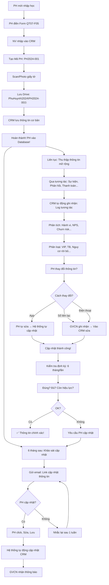

# SOP-02.1: QUẢN LÝ THÔNG TIN PHỤ HUYNH

## 1. THÔNG TIN QUY TRÌNH

| **Thuộc tính** | **Nội dung** |
|---|---|
| Mã SOP | SOP-02.1 |
| Tên quy trình | Quản lý thông tin phụ huynh |
| Quy trình cha | SOP-02: CRM Phụ huynh |
| Phiên bản | 1.0 |
| Tần suất | Liên tục (Cập nhật khi có thay đổi) |

## 2. MỤC ĐÍCH

- **Thu thập đầy đủ**: Thông tin PH chính xác, Đầy đủ
- **Quản lý tập trung**: Database duy nhất, Dễ truy cập
- **Bảo mật cao**: Thông tin PH được bảo vệ
- **Phục vụ tốt**: Biết rõ PH → Chăm sóc đúng cách

## 3. PHẠM VI ÁP DỤNG

Tất cả PH (Hiện tại + Tiềm năng)

## 4. THÔNG TIN CẦN THU THẬP

### 4.1. Thông tin cơ bản (Bắt buộc)

```
╔══════════════════════════════════════════════════════════════════╗
║           THÔNG TIN CƠ BẢN PHỤ HUYNH                            ║
╠══════════════════════════════════════════════════════════════════╣
║ A. THÔNG TIN CÁ NHÂN:                                            ║
║    • Họ tên: Nguyễn Văn A (Cha) / Trần Thị B (Mẹ)               ║
║    • Năm sinh: 1985 / 1987                                       ║
║    • CMND/CCCD: 001-xxx-xxx / 002-xxx-xxx                        ║
║    • Địa chỉ: 123 Đường X, Quận Y, TP.HCM                        ║
║    • Email: nguyenvana@gmail.com                                 ║
║    • SĐT: 0912-xxx-xxx (Cha) / 0913-xxx-xxx (Mẹ)                ║
║    • SĐT khẩn cấp: 0914-xxx-xxx (Ông nội)                        ║
╠══════════════════════════════════════════════════════════════════╣
║ B. THÔNG TIN HỌC SINH:                                           ║
║    • Họ tên: Nguyễn Văn C                                        ║
║    • Mã HS: HS2024-001                                           ║
║    • Lớp: 3A                                                     ║
║    • GVCN: Cô Nguyễn Thị X                                       ║
╠══════════════════════════════════════════════════════════════════╣
║ C. QUAN Hệ:                                                      ║
║    • Cha: Nguyễn Văn A (Liên hệ chính)                           ║
║    • Mẹ: Trần Thị B (Liên hệ phụ)                                ║
║    • Người giám hộ: Không (Bố Mẹ nuôi)                           ║
╠══════════════════════════════════════════════════════════════════╣
║ D. TÌNH TRẠNG:                                                   ║
║    • PH hiện tại: ✅ Có (Con đang học)                           ║
║    • Ngày nhập học: 01/09/2022                                   ║
║    • Trạng thái: 🟢 Đang học                                     ║
╚══════════════════════════════════════════════════════════════════╝
```

### 4.2. Thông tin mở rộng (Tùy chọn - Phục vụ CRM)

```
╔══════════════════════════════════════════════════════════════════╗
║           THÔNG TIN MỞ RỘNG (CRM)                               ║
╠══════════════════════════════════════════════════════════════════╣
║ A. NGHỀ NGHIỆP - THU NHẬP:                                       ║
║    • Nghề nghiệp: Cha: Kỹ sư IT / Mẹ: Giáo viên                 ║
║    • Công ty: FPT / Trường THCS X                                ║
║    • Thu nhập: 30-50M/tháng (Ước tính)                           ║
║    • Tầng lớp: Trung lưu                                         ║
╠══════════════════════════════════════════════════════════════════╣
║ B. SỞ THÍCH - QUAN TÂM:                                          ║
║    • Quan tâm: Chất lượng giáo dục, Tiếng Anh                    ║
║    • Sở thích: Du lịch, Đọc sách                                 ║
║    • Kênh thông tin: Facebook (Chủ yếu), Email                   ║
║    • Thiết bị: Smartphone (iPhone), Laptop                       ║
╠══════════════════════════════════════════════════════════════════╣
║ C. HÀNH VI:                                                      ║
║    • Tham gia sự kiện: 5/7 sự kiện (71% - Tích cực!)             ║
║    • Phản hồi: 2 lần (Góp ý xây dựng)                            ║
║    • Thanh toán: Đúng hạn (100%)                                 ║
║    • Tương tác: Thường xuyên (3 lần/tuần qua App)                ║
╠══════════════════════════════════════════════════════════════════╣
║ D. MỨC ĐỘ HÀI LÒNG:                                              ║
║    • NPS (Net Promoter Score): 9/10 (Promoter!)                  ║
║    • Khả năng giới thiệu: Cao (Đã giới thiệu 2 PH)               ║
║    • Khả năng rời bỏ (Churn): Thấp (0.1%)                        ║
║    • Nhóm: VIP - PH trung thành!                                 ║
╠══════════════════════════════════════════════════════════════════╣
║ E. LỊCH SỬ TƯƠNG TÁC (Log):                                      ║
║    • 01/09/2022: Nhập học                                        ║
║    • 15/10/2022: Tham gia Họp PH đầu năm                         ║
║    • 20/12/2022: Tham gia Hội diễn Giáng sinh                    ║
║    • 10/01/2023: Phản hồi (Góp ý về bếp ăn)                      ║
║    • 05/03/2023: Đóng học phí (Đúng hạn)                         ║
║    • ... (Tổng 50+ tương tác)                                    ║
╚══════════════════════════════════════════════════════════════════╝
```

## 5. QUY TRÌNH THU THẬP THÔNG TIN

### 5.1. Thu thập lần đầu (Khi nhập học - Xem QT-06, SOP-01.2)

**Bước 1: PH điền Form đăng ký (QT07-F05)**

```
═══════════════════════════════════════════════════════
    FORM THÔNG TIN PHỤ HUYNH - HỌC SINH
═══════════════════════════════════════════════════════

I. THÔNG TIN HỌC SINH:
Họ tên: _______________  Giới tính: □ Nam □ Nữ
Ngày sinh: __/__/____   Nơi sinh: _______________
Dân tộc: _______________  Quốc tịch: _______________

II. THÔNG TIN PHỤ HUYNH:

A. CHA:
Họ tên: _______________  Năm sinh: ____
CMND: _______________  Nơi cấp: _______________
Nghề nghiệp: _______________  Công ty: _______________
SĐT: _______________  Email: _______________

B. MẸ:
Họ tên: _______________  Năm sinh: ____
CMND: _______________  Nơi cấp: _______________
Nghề nghiệp: _______________  Công ty: _______________
SĐT: _______________  Email: _______________

C. ĐỊA CHỈ:
Địa chỉ thường trú: _______________
Địa chỉ tạm trú: _______________
SĐT khẩn cấp: _______________  (Họ tên người liên hệ: _______)

III. NGƯỜI LIÊN HỆ CHÍNH (Nhận thông báo):
□ Cha  □ Mẹ  □ Khác: _______________

IV. ĐỒNG Ý (Tích vào ô):
□ Tôi đồng ý cho trường sử dụng thông tin để liên lạc
□ Tôi đồng ý nhận thông báo qua: □ SMS  □ Email  □ App

                           PH ký: __________
                           Ngày: __/__/____
═══════════════════════════════════════════════════════
```

**Bước 2: NV nhập thông tin vào CRM**

```
Phần mềm CRM (VD: Salesforce, HubSpot, Hoặc tự xây dựng):

╔══════════════════════════════════════════════════════╗
║  THÊM PHỤ HUYNH MỚI                                  ║
╠══════════════════════════════════════════════════════╣
║ MÃ PH: [Tự động: PH2024-001]                         ║
║                                                      ║
║ HỌ TÊN CHA: [____________]                           ║
║ SĐT CHA: [____________]                              ║
║ EMAIL CHA: [____________]                            ║
║                                                      ║
║ HỌ TÊN MẸ: [____________]                            ║
║ SĐT MẸ: [____________]                               ║
║ EMAIL MẸ: [____________]                             ║
║                                                      ║
║ ĐỊA CHỈ: [____________]                              ║
║                                                      ║
║ HỌC SINH: [Chọn từ danh sách: Nguyễn Văn C]          ║
║                                                      ║
║ LIÊN HỆ CHÍNH: □ Cha  ☑ Mẹ                          ║
║                                                      ║
║ NHÓM: [Chọn: PH hiện tại]                            ║
║ TRẠNG THÁI: [Chọn: Đang học]                         ║
║                                                      ║
║ [Nút: LƯU]                                           ║
╚══════════════════════════════════════════════════════╝

→ Sau khi lưu: Thông tin vào Database!
→ Mã PH: PH2024-001 (Unique)
```

**Bước 3: Scan/Photo giấy tờ (Lưu trữ số)**

```
GIẤY TỜ CẦN SCAN:
□ CMND/CCCD (Cả Cha + Mẹ)
□ Giấy khai sinh (HS)
□ Sổ hộ khẩu

→ Lưu vào thư mục:
   Drive:\PhuHuynh\2024\PH2024-001\
   
   - CMND_Cha.pdf
   - CMND_Me.pdf
   - GiayKhaiSinh.pdf
   - SoHoKhau.pdf
```

### 5.2. Cập nhật thông tin (Khi có thay đổi)

**Bước 4: PH thông báo thay đổi**

**Cách 1: PH tự cập nhật qua App/Website**

```
PH đăng nhập App → "Hồ sơ" → "Chỉnh sửa"

VD: Thay đổi SĐT:
Cũ: 0912-xxx-xxx
Mới: 0911-yyy-yyy

→ Click "Lưu"
→ Hệ thống tự động cập nhật!
→ GVCN nhận thông báo: "PH A đã đổi SĐT!"
```

**Cách 2: PH thông báo cho GVCN (Qua Sổ liên lạc/Tin nhắn)**

```
PH viết Sổ:
"Cô ơi, Số điện thoại mẹ con đổi thành 0911-yyy-yyy ạ!"

GVCN:
1. Ghi nhận
2. Vào CRM → Tìm PH A → Sửa SĐT
3. Trả lời Sổ: "Cảm ơn cô! Thầy đã cập nhật!"
```

**Cách 3: Khảo sát định kỳ (6 tháng/lần)**

```
Mỗi 6 tháng, Gửi email/App:

"Kính chào quý PH,
 
 Để phục vụ quý vị tốt hơn, Vui lòng CẬP NHẬT thông tin:
 
 [Link: Cập nhật thông tin]
 
 • SĐT có thay đổi không?
 • Địa chỉ có thay đổi không?
 • Email có thay đổi không?
 
 Xin cảm ơn!"

→ PH click Link → Sửa → Lưu!
```

### 5.3. Làm giàu thông tin (Data Enrichment)

**Bước 5: Thu thập dần thông tin mở rộng (Qua tương tác)**

```
BAN ĐẦU: Chỉ có thông tin cơ bản
• Họ tên, SĐT, Email, Địa chỉ

SAU 6 THÁNG: Thêm thông tin
• Nghề nghiệp (PH tự điền khảo sát)
• Sở thích (Quan sát: PH thích tham gia sự kiện gì?)
• Hành vi (Tham gia 5/7 sự kiện → Tích cực!)
• NPS (Khảo sát hài lòng → 9/10 → Promoter!)

→ CRM TỰ ĐỘNG phân loại:
  "PH A là VIP!" (Vì: Tích cực, Hài lòng cao, Thanh toán đúng hạn)
```

## 6. QUẢN LÝ DATABASE

### 6.1. Cấu trúc Database

```
TABLE: PhuHuynh

| Cột | Kiểu | Mô tả |
|-----|------|-------|
| MaPH | VARCHAR(20) | PH2024-001 (Primary Key) |
| HoTenCha | VARCHAR(100) | Nguyễn Văn A |
| SDTCha | VARCHAR(15) | 0912-xxx-xxx |
| EmailCha | VARCHAR(100) | nguyenvana@gmail.com |
| HoTenMe | VARCHAR(100) | Trần Thị B |
| SDTMe | VARCHAR(15) | 0913-xxx-xxx |
| EmailMe | VARCHAR(100) | tranthib@gmail.com |
| DiaChi | TEXT | 123 Đường X... |
| LienHeChinh | VARCHAR(10) | Cha / Mẹ |
| MaHS | VARCHAR(20) | HS2024-001 (Foreign Key) |
| TrangThai | VARCHAR(20) | Đang học / Đã nghỉ |
| NgayTao | DATETIME | 2022-09-01 10:30:00 |
| NgayCapNhat | DATETIME | 2024-03-15 14:20:00 |
| ... | ... | (50+ cột khác...) |

═══════════════════════════════════════════════════════

TABLE: TuongTacPH (Lịch sử)

| Cột | Kiểu | Mô tả |
|-----|------|-------|
| MaTuongTac | INT | 1, 2, 3... (Auto increment) |
| MaPH | VARCHAR(20) | PH2024-001 (Foreign Key) |
| LoaiTuongTac | VARCHAR(50) | SMS, Email, Sự kiện, Phản hồi... |
| NoiDung | TEXT | "PH tham gia họp PH tháng 10" |
| NgayGio | DATETIME | 2023-10-15 09:00:00 |
| NguoiGhiNhan | VARCHAR(50) | GVCN X |
```

### 6.2. Phân quyền truy cập (Access Control)

```
╔══════════════════════════════════════════════════════════════════╗
║           PHÂN QUYỀN TRUY CẬP THÔNG TIN PH                      ║
╠══════════════════════════════════════════════════════════════════╣
║ 1. GVCN:                                                         ║
║    • XEM: Thông tin PH của HS lớp mình (100%)                    ║
║    • SỬA: Được (SĐT, Email, Địa chỉ...)                         ║
║    • XÓA: Không                                                  ║
╠══════════════════════════════════════════════════════════════════╣
║ 2. HIỆU TRƯỞNG:                                                  ║
║    • XEM: Tất cả PH (100%)                                       ║
║    • SỬA: Được                                                   ║
║    • XÓA: Được (Sau khi PH nghỉ học)                             ║
╠══════════════════════════════════════════════════════════════════╣
║ 3. BP QUAN HỆ PH:                                                ║
║    • XEM: Tất cả PH                                              ║
║    • SỬA: Được                                                   ║
║    • XUẤT DỮ LIỆU: Được (Phục vụ chiến dịch marketing)          ║
╠══════════════════════════════════════════════════════════════════╣
║ 4. GV PHỔ THÔNG:                                                 ║
║    • XEM: KHÔNG (Bảo mật!)                                       ║
║    • Ngoại trừ: GV bộ môn XEM SĐT PH (Để liên lạc học tập)      ║
╠══════════════════════════════════════════════════════════════════╣
║ 5. KẾ TOÁN:                                                      ║
║    • XEM: Thông tin cơ bản (Họ tên, SĐT - Để đòi nợ!)           ║
║    • SỬA: Không                                                  ║
╚══════════════════════════════════════════════════════════════════╝
```

### 6.3. Bảo mật thông tin (Data Security)

**A. Bảo mật kỹ thuật:**

```
• MÃ HÓA: Database được mã hóa (AES-256)
• BACKUP: Sao lưu mỗi ngày (3 bản: Local, Cloud, Offsite)
• FIREWALL: Chặn truy cập không hợp lệ
• 2FA: Đăng nhập phải xác thực 2 lớp (Mật khẩu + OTP)
```

**B. Bảo mật con người:**

```
• ĐÀO TẠO: NV được đào tạo về bảo mật (Không chia sẻ thông tin PH!)
• HỢP ĐỒNG: NV ký Cam kết bảo mật (Vi phạm → Sa thải!)
• AUDIT: Kiểm tra log truy cập (Ai xem thông tin gì, Khi nào?)
```

**C. Tuân thủ pháp luật:**

```
• Luật Bảo vệ dữ liệu cá nhân (2020): ✅ Tuân thủ
• GDPR (Nếu có PH nước ngoài): ✅ Tuân thủ
• PH có quyền: YÊU CẦU XÓA dữ liệu (Right to be forgotten)
```

## 7. LƯU ĐỒ QUY TRÌNH



## 8. BIỂU MẪU LIÊN QUAN

| **Mã** | **Tên** |
|---|---|
| QT07-F05 | Form thông tin PH-HS (Giấy) |
| QT07-BC03 | Báo cáo thống kê PH (Tháng) |

## 9. TIÊU CHUẨN VÀ CHỈ TIÊU

| **Chỉ tiêu** | **Mục tiêu** |
|---|---|
| Tỷ lệ PH có thông tin đầy đủ (15 trường bắt buộc) | 100% |
| Thời gian nhập thông tin PH mới (Vào CRM) | ≤30 phút |
| Tỷ lệ PH cập nhật thông tin khi có thay đổi | ≥80% |
| Tỷ lệ thông tin sai/lỗi | ≤2% |

## 10. TRÁCH NHIỆM CỤ THỂ

| **Vai trò** | **Trách nhiệm** |
|---|---|
| **NV Phòng HS** | Nhập thông tin PH mới, Scan giấy tờ |
| **GVCN** | Cập nhật thông tin PH lớp mình (Khi có thay đổi) |
| **BP Quan hệ PH** | Giám sát Database, Làm sạch dữ liệu (6 tháng/lần) |
| **IT** | Bảo trì CRM, Backup, Bảo mật |

## 11. LƯU Ý QUAN TRỌNG

- ⚠️ **Bảo mật tuyệt đối**: KHÔNG chia sẻ thông tin PH ra ngoài!
- ✅ **Chính xác**: Nhập đúng! Sai SĐT → Gọi không được!
- 🔥 **Cập nhật thường xuyên**: PH đổi SĐT → Cập nhật ngay! (Trong ngày!)
- ✅ **Backup**: Mỗi ngày! (Tránh mất dữ liệu!)

## 12. PHỤ LỤC

### 12.1. Quy trình làm sạch dữ liệu (Data Cleaning - 6 tháng/lần)

```
═══════════════════════════════════════════════════════
    QUY TRÌNH LÀM SẠCH DỮ LIỆU (6 THÁNG/LẦN)
═══════════════════════════════════════════════════════

BƯỚC 1: XUẤT DANH SÁCH PH (Từ CRM)

BƯỚC 2: KIỂM TRA:

A. Thông tin trùng lặp:
VD: 
• PH A: SĐT 0912-xxx-xxx
• PH B: SĐT 0912-xxx-xxx (Trùng!)

→ Kiểm tra: Có phải 1 người?
   • Có → Gộp 2 record!
   • Không → Sửa SĐT (Gọi lại PH xác nhận)

B. Thông tin sai:
VD:
• SĐT: 091-xxx-xxx (Thiếu 1 số!)
• Email: abc@gmailcom (Thiếu dấu ".")

→ Gọi PH xác nhận, Sửa!

C. Thông tin cũ:
VD:
• PH đã nghỉ học 2 năm, Nhưng vẫn trong Database!

→ Chuyển trạng thái: "Đã nghỉ" (KHÔNG xóa! Lưu trữ!)

BƯỚC 3: CẬP NHẬT CRM

BƯỚC 4: BÁO CÁO BGH (QT07-BC03):
"Đã làm sạch:
 • 50 PH trùng lặp → Gộp
 • 20 SĐT sai → Sửa
 • 100 PH đã nghỉ → Chuyển trạng thái"

KẾT QUẢ: Database SẠCH, CHÍNH XÁC!
═══════════════════════════════════════════════════════
```

### 12.2. Xử lý PH yêu cầu xóa dữ liệu (Right to be forgotten)

```
PH: "Tôi muốn trường XÓA hết thông tin tôi!"
(Theo Luật Bảo vệ dữ liệu cá nhân 2020)

BP Quan hệ PH:
1. Xác nhận: "Quý vị có chắc không? Xóa rồi không khôi phục được!"
2. Nếu PH đồng ý → Yêu cầu PH ký Đơn (QT07-F06)
3. Kiểm tra:
   • Con còn học không? → Còn → KHÔNG xóa! (Cần thiết!)
   • Con đã nghỉ? → Được xóa!
4. Xóa:
   • Từ CRM
   • Từ Drive (Giấy tờ scan)
   • Từ Backup (3 bản)
5. Gửi email xác nhận: "Đã xóa hoàn toàn!"

NGUYÊN TẮC: Tôn trọng quyền riêng tư PH!
```

### 12.3. Mẫu Dashboard CRM (Xem real-time)

```
┌──────────────────────────────────────────────────┐
│  DASHBOARD CRM - PHỤ HUYNH                       │
├──────────────────────────────────────────────────┤
│ TỔNG SỐ PH: 500                                  │
│  • Đang học: 480 (96%)                           │
│  • Đã nghỉ: 20 (4%)                              │
│                                                  │
│ PHÂN LOẠI:                                       │
│  • VIP: 100 (20%) 🌟                             │
│  • Trung bình: 350 (70%)                         │
│  • Nguy cơ rời bỏ: 30 (6%) ⚠️                   │
│  • Rời bỏ: 20 (4%)                               │
│                                                  │
│ NPS TRUNG BÌNH: 7.5/10 (Tốt!)                    │
│                                                  │
│ TƯƠNG TÁC THÁNG NÀY:                             │
│  • SMS: 1,500 tin                                │
│  • Email: 500 email                              │
│  • Sự kiện: 150 PH tham gia                      │
│                                                  │
│ CẢNH BÁO:                                        │
│  • 30 PH nguy cơ rời bỏ → Cần chăm sóc! ⚠️      │
│  • 5 PH SĐT sai → Cần cập nhật!                  │
└──────────────────────────────────────────────────┘
```

## 13. FAQ

**Q1: PH không muốn cung cấp Email. Bắt buộc không?**  
A: KHÔNG bắt buộc! (Nhưng khuyến khích!)
- Nếu PH không có Email → Dùng SMS!
- Nhưng: SMS tốn phí! Email miễn phí!

**Q2: CRM quá phức tạp, Trường nhỏ không cần. Có thể dùng Excel không?**  
A: ĐƯỢC! (Trường <200 HS)
- Tạo file Excel: PhuHuynh.xlsx
- Cột: Mã PH, Họ tên, SĐT, Email...
- LƯU Ý: Backup! Phân quyền (Không cho NV tùy tiện sửa!)

**Q3: PH thay đổi SĐT, Nhưng quên không báo. Xử lý?**  
A: 
- Hệ thống phát hiện: SMS gửi không thành công!
- GVCN gọi SĐT cũ → Không nghe máy
- → Gọi SĐT khẩn cấp (Ông bà, Người thân) → Hỏi SĐT mới!

---

**PHÊ DUYỆT**

| BP Quan hệ PH | Phó HT |
|---|---|
| [Họ tên] | [Họ tên] |
