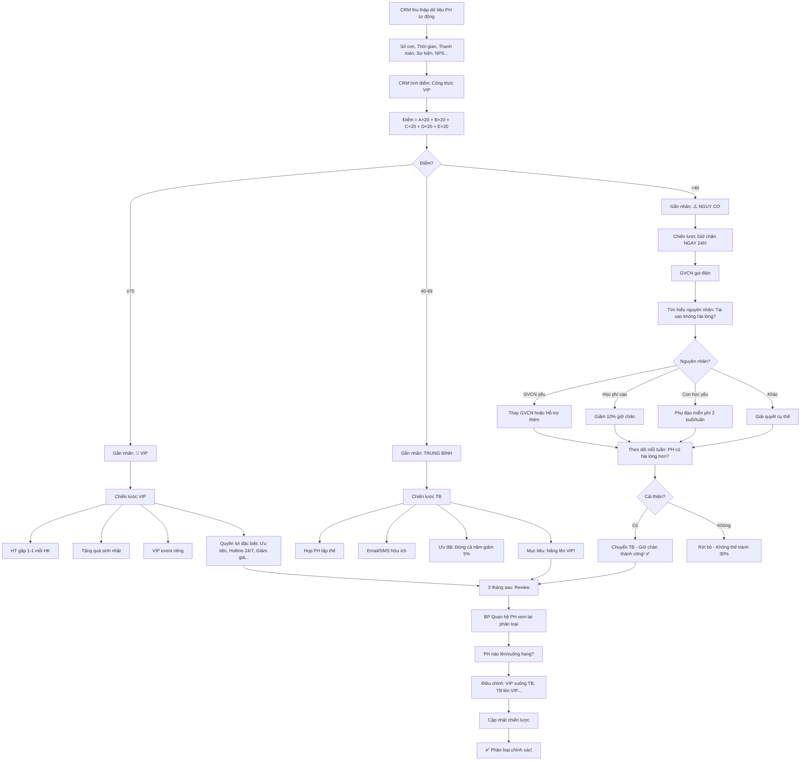

# SOP-02.2: PHÂN LOẠI VÀ PHÂN ĐOẠN PHỤ HUYNH

## 1. THÔNG TIN QUY TRÌNH

| **Thuộc tính** | **Nội dung** |
|---|---|
| Mã SOP | SOP-02.2 |
| Tên quy trình | Phân loại và phân đoạn phụ huynh |
| Quy trình cha | SOP-02: CRM Phụ huynh |
| Phiên bản | 1.0 |
| Tần suất | Liên tục (Tự động) + Review 3 tháng/lần |

## 2. MỤC ĐÍCH

- **Chăm sóc đúng đối tượng**: PH VIP → Chăm sóc đặc biệt, PH TB → Chăm sóc chuẩn
- **Tối ưu nguồn lực**: Tập trung vào PH quan trọng
- **Dự đoán rủi ro**: PH nào có nguy cơ rời bỏ? Giữ chân kịp thời!
- **Cá nhân hóa**: Mỗi nhóm PH → Chiến lược riêng

## 3. PHẠM VI ÁP DỤNG

Tất cả PH (Hiện tại + Tiềm năng)

## 4. CÁC TIÊU CHÍ PHÂN LOẠI

### 4.1. Theo giá trị (Value-based Segmentation)

```
╔══════════════════════════════════════════════════════════════════╗
║           PHÂN LOẠI THEO GIÁ TRỊ                                ║
╠══════════════════════════════════════════════════════════════════╣
║ 1. VIP (20% PH - Đóng góp 80% doanh thu!)                        ║
║    TIÊU CHÍ:                                                     ║
║    • Có ≥2 con học tại trường (Anh chị em)                       ║
║    • HOẶC: Học ≥3 năm (Trung thành!)                             ║
║    • HOẶC: Thanh toán 1 lần cả năm (Giảm 5%)                     ║
║    • HOẶC: Đăng ký dịch vụ cao cấp (Xe riêng, Học thêm...)       ║
║    • VÀ: NPS ≥8/10 (Hài lòng cao!)                               ║
║                                                                  ║
║    ĐẶC QUYỀN:                                                    ║
║    • Gặp HT mỗi HK (1-1 Meeting)                                 ║
║    • Ưu tiên đăng ký hoạt động (Đăng ký trước 1 tuần)            ║
║    • Quà tặng sinh nhật (Con + PH)                               ║
║    • Giảm 10% học phí con thứ 2, 15% con thứ 3                   ║
║    • Hotline riêng: VIP Hotline (Phục vụ 24/7)                   ║
╠══════════════════════════════════════════════════════════════════╣
║ 2. TRUNG BÌNH (70% PH)                                           ║
║    TIÊU CHÍ:                                                     ║
║    • 1 con học                                                   ║
║    • Học <3 năm                                                  ║
║    • Thanh toán theo tháng                                       ║
║    • NPS 5-7/10 (Hài lòng vừa phải)                              ║
║                                                                  ║
║    CHĂM SÓC:                                                     ║
║    • Họp PH mỗi HK (Tập thể)                                     ║
║    • Email/SMS thông báo (Hàng loạt)                             ║
║    • Sự kiện chung (Open house, Hội diễn...)                     ║
╠══════════════════════════════════════════════════════════════════╣
║ 3. NGUY CƠ RỜI BỎ (10% PH - CẢNH BÁO!)                          ║
║    TIÊU CHÍ:                                                     ║
║    • NPS <5/10 (Không hài lòng!)                                 ║
║    • HOẶC: Thanh toán trễ ≥2 lần                                 ║
║    • HOẶC: Không tham gia sự kiện (3 tháng liên tiếp)            ║
║    • HOẶC: Phản hồi tiêu cực (Khiếu nại nhiều)                   ║
║    • HOẶC: Ít tương tác (Không đọc Email, SMS...)                ║
║                                                                  ║
║    HÀNH ĐỘNG NGAY:                                               ║
║    • GVCN + BP Quan hệ PH gọi điện (Trong 24h!)                  ║
║    • Gặp trực tiếp (Nếu cần)                                     ║
║    • Tìm hiểu vấn đề, Giải quyết                                 ║
║    • Ưu đãi giữ chân (Giảm học phí, Miễn phí dịch vụ...)         ║
╚══════════════════════════════════════════════════════════════════╝
```

### 4.2. Theo hành vi (Behavioral Segmentation)

```
╔══════════════════════════════════════════════════════════════════╗
║           PHÂN LOẠI THEO HÀNH VI                                ║
╠══════════════════════════════════════════════════════════════════╣
║ 1. TÍCH CỰC (Engaged)                                            ║
║    • Tham gia ≥70% sự kiện                                       ║
║    • Đọc Email (Open rate ≥50%)                                  ║
║    • Tương tác App (≥3 lần/tuần)                                 ║
║    • Phản hồi (Góp ý xây dựng)                                   ║
║                                                                  ║
║    → CHIẾN LƯỢC: Duy trì! Tạo cơ hội cho PH tham gia nhiều hơn!  ║
╠══════════════════════════════════════════════════════════════════╣
║ 2. THỤNG ĐỘNG (Passive)                                          ║
║    • Tham gia 30-70% sự kiện                                     ║
║    • Đọc Email (Open rate 20-50%)                                ║
║    • Ít tương tác App (<1 lần/tuần)                              ║
║                                                                  ║
║    → CHIẾN LƯỢC: Kích thích! Gửi nội dung hấp dẫn, Mời tham gia!  ║
╠══════════════════════════════════════════════════════════════════╣
║ 3. THỜ Ơ (Inactive)                                              ║
║    • Tham gia <30% sự kiện                                       ║
║    • Không đọc Email (Open rate <20%)                            ║
║    • Không dùng App                                              ║
║                                                                  ║
║    → CHIẾN LƯỢC: Re-engage! Gọi điện, Tìm hiểu lý do!            ║
╚══════════════════════════════════════════════════════════════════╝
```

### 4.3. Theo nhân khẩu học (Demographic Segmentation)

```
╔══════════════════════════════════════════════════════════════════╗
║           PHÂN LOẠI THEO NHÂN KHẨU HỌC                          ║
╠══════════════════════════════════════════════════════════════════╣
║ 1. THU NHẬP CAO (>50M/tháng)                                     ║
║    • Nghề: Doanh nhân, Quản lý cấp cao                           ║
║    • Quan tâm: Uy tín, Kết nối, Dịch vụ cao cấp                  ║
║    • Chiến lược: Sự kiện VIP, Networking, Dịch vụ cá nhân hóa    ║
╠══════════════════════════════════════════════════════════════════╣
║ 2. THU NHẬP TRUNG BÌNH (15-50M)                                  ║
║    • Nghề: Nhân viên văn phòng, Giáo viên, Y tá...               ║
║    • Quan tâm: Chất lượng, Giá cả, An toàn                       ║
║    • Chiến lược: Cân bằng chất lượng-giá, Ưu đãi hợp lý          ║
╠══════════════════════════════════════════════════════════════════╣
║ 3. KHU VỰC ĐỊA LÝ:                                               ║
║    • Gần trường (<3km): 40% PH                                   ║
║      → Chiến lược: Sự kiện thường xuyên (Dễ tham gia!)           ║
║    • Trung bình (3-7km): 50% PH                                  ║
║      → Chiến lược: Xe đưa đón, Sự kiện cuối tuần                 ║
║    • Xa (>7km): 10% PH                                           ║
║      → Chiến lược: Online meeting, Video call                    ║
╚══════════════════════════════════════════════════════════════════╝
```

### 4.4. Theo vòng đời (Lifecycle Segmentation)

```
╔══════════════════════════════════════════════════════════════════╗
║           PHÂN LOẠI THEO VÒNG ĐỜI                               ║
╠══════════════════════════════════════════════════════════════════╣
║ 1. MỚI (New) - 0-6 tháng:                                        ║
║    • Mới nhập học (Chưa quen)                                    ║
║    • Chiến lược: Chào đón, Hướng dẫn, Hỗ trợ tối đa!             ║
║    • Mục tiêu: Giữ chân! (Tránh bỏ học sớm!)                     ║
╠══════════════════════════════════════════════════════════════════╣
║ 2. ĐANG PHÁT TRIỂN (Growing) - 6 tháng - 2 năm:                  ║
║    • Đã quen, Hài lòng                                           ║
║    • Chiến lược: Duy trì chất lượng, Mời tham gia sự kiện        ║
║    • Mục tiêu: Tăng Engagement, Khuyến khích giới thiệu!         ║
╠══════════════════════════════════════════════════════════════════╣
║ 3. TRUNG THÀNH (Loyal) - >2 năm:                                 ║
║    • Học lâu, Tin tưởng                                          ║
║    • Chiến lược: Tri ân, VIP treatment, Giảm giá anh chị em      ║
║    • Mục tiêu: Giữ mãi! Biến thành Brand Ambassador!             ║
╠══════════════════════════════════════════════════════════════════╣
║ 4. SẮP RỜI BỎ (At Risk) - Lớp 9 (Năm cuối):                      ║
║    • Sắp tốt nghiệp (Rời trường)                                 ║
║    • Chiến lược: Tri ân, Alumni program, Giữ liên lạc!           ║
║    • Mục tiêu: Biến thành Alumni, Giới thiệu PH mới!             ║
╚══════════════════════════════════════════════════════════════════╝
```

## 5. QUY TRÌNH PHÂN LOẠI

### 5.1. Phân loại tự động (Bằng CRM)

**Bước 1: CRM thu thập dữ liệu (Tự động)**

```
CRM theo dõi:
• Số con học: 2 (Anh + Em)
• Thời gian học: 3 năm
• Thanh toán: Đúng hạn 100%
• Tham gia sự kiện: 10/12 sự kiện (83%)
• NPS: 9/10
• Open email rate: 70%
```

**Bước 2: CRM tính điểm (Score)**

```
CÔNG THỨC TÍNH ĐIỂM VIP:

Điểm = (A × 20) + (B × 20) + (C × 20) + (D × 20) + (E × 20)

Trong đó:
A = Số con học / 3 (Tối đa 1 điểm)
    VD: 2 con → 2/3 = 0.67 điểm

B = Thời gian học / 5 năm (Tối đa 1 điểm)
    VD: 3 năm → 3/5 = 0.6 điểm

C = Tỷ lệ thanh toán đúng hạn
    VD: 100% → 1 điểm

D = Tỷ lệ tham gia sự kiện
    VD: 83% → 0.83 điểm

E = NPS / 10
    VD: 9/10 → 0.9 điểm

TÍNH TOÁN:
= (0.67×20) + (0.6×20) + (1×20) + (0.83×20) + (0.9×20)
= 13.4 + 12 + 20 + 16.6 + 18
= 80/100 điểm

→ ≥70 điểm = VIP! ✅
```

**Bước 3: CRM tự động gắn nhãn (Tag)**

```
PH: Nguyễn Văn A
→ Điểm: 80/100
→ Tự động gắn: 🌟 VIP
→ Chuyển vào Nhóm: "PH VIP"
```

**Bước 4: CRM kích hoạt chiến dịch (Campaign Automation)**

```
PH A vừa được gắn VIP
→ CRM tự động:
  • Gửi email chúc mừng:
    "Chúc mừng quý PH đã trở thành VIP!
     Quý vị sẽ nhận được:
     • Ưu tiên đăng ký hoạt động
     • Giảm 10% học phí con thứ 2
     • ..."
     
  • Thông báo cho BP Quan hệ PH:
    "PH A vừa lên VIP! Chăm sóc đặc biệt!"
    
  • Thông báo cho GVCN:
    "PH A là VIP! Lưu ý chăm sóc!"
```

### 5.2. Review và điều chỉnh (3 tháng/lần)

**Bước 5: BP Quan hệ PH review (Mỗi 3 tháng)**

```
XEM DANH SÁCH:

VIP (100 PH):
• Kiểm tra: Có PH nào không xứng đáng VIP?
  VD: PH B điểm còn 65 (Giảm từ 80!) → Chuyển TB!
  
• Kiểm tra: Có PH TB nào lên VIP?
  VD: PH C điểm tăng lên 75 → Chuyển VIP!

NGUY CƠ RỜI BỎ (30 PH):
• Kiểm tra: Đã giữ chân được chưa?
  VD: PH D - NPS tăng từ 4 → 7 → An toàn! Chuyển TB!
  
• Kiểm tra: Có PH mới rơi vào nguy cơ?
  VD: PH E - NPS giảm từ 7 → 3 → Cảnh báo!
```

**Bước 6: Điều chỉnh chiến lược**

```
PHÁT HIỆN:
• 30 PH VIP năm ngoái, Nay còn 25 (Mất 5!)
• Lý do: Con tốt nghiệp, Chuyển trường...

ĐIỀU CHỈNH:
• Tăng cường chăm sóc VIP (Tránh mất thêm!)
• Tìm cách nâng PH TB lên VIP (Có 10 PH sát 70 điểm!)
  → Ưu đãi, Khuyến khích!
```

## 6. CHIẾN LƯỢC THEO TỪNG NHÓM

### 6.1. Chiến lược PH VIP

```
╔══════════════════════════════════════════════════════════════════╗
║           CHIẾN LƯỢC PH VIP                                     ║
╠══════════════════════════════════════════════════════════════════╣
║ MỤC TIÊU: Giữ mãi! Biến thành Brand Ambassador!                 ║
║                                                                  ║
║ HÀNH ĐỘNG:                                                       ║
║ 1. MỖI HỌC KỲ:                                                   ║
║    • HT gặp 1-1 (30 phút/PH)                                     ║
║    • Lắng nghe: PH hài lòng? Có góp ý?                           ║
║    • Tri ân: Tặng quà (Trị giá 500K)                             ║
║                                                                  ║
║ 2. SINH NHẬT:                                                    ║
║    • Con: Tặng quà + Thiệp (GVCN trao)                           ║
║    • PH: Gửi email chúc mừng + Voucher giảm 5%                   ║
║                                                                  ║
║ 3. SỰ KIỆN:                                                      ║
║    • Mời VIP event (Riêng PH VIP - Sang trọng!)                  ║
║    • VD: "Gala Dinner tri ân PH VIP" (1 năm/lần)                 ║
║                                                                  ║
║ 4. QUYỀN LỢI:                                                    ║
║    • Ưu tiên đăng ký hoạt động (Đăng ký trước 1 tuần)            ║
║    • Hotline VIP (Phục vụ 24/7)                                  ║
║    • Giảm học phí con 2, 3... (10%, 15%...)                      ║
║                                                                  ║
║ 5. YÊU CẦU GIỚI THIỆU:                                           ║
║    • "Quý vị hài lòng? Giới thiệu bạn bè nhé!                    ║
║      Cả 2 bên được giảm 5%!"                                     ║
╚══════════════════════════════════════════════════════════════════╝
```

### 6.2. Chiến lược PH Trung bình

```
╔══════════════════════════════════════════════════════════════════╗
║           CHIẾN LƯỢC PH TRUNG BÌNH                              ║
╠══════════════════════════════════════════════════════════════════╣
║ MỤC TIÊU: Nâng lên VIP! (Hoặc Duy trì ổn định)                  ║
║                                                                  ║
║ HÀNH ĐỘNG:                                                       ║
║ 1. MỖI HỌC KỲ:                                                   ║
║    • Họp PH tập thể (GVCN + HT)                                  ║
║    • Thông báo kết quả, Kế hoạch...                              ║
║                                                                  ║
║ 2. TĂNG ENGAGEMENT:                                              ║
║    • Gửi email/SMS: Bài viết hữu ích, Video...                   ║
║    • Mời tham gia sự kiện (Open house, Hội diễn...)              ║
║    • Khảo sát: "PH hài lòng không?"                              ║
║                                                                  ║
║ 3. ƯU ĐÃI:                                                       ║
║    • "Đóng học phí cả năm → Giảm 5%!"                            ║
║    • "Giới thiệu PH mới → Giảm 5%!"                              ║
║    • "Đăng ký thêm dịch vụ (Xe, Ăn...) → Giảm 3%!"              ║
║    → Mục đích: Tăng điểm VIP!                                    ║
╚══════════════════════════════════════════════════════════════════╝
```

### 6.3. Chiến lược PH Nguy cơ rời bỏ

```
╔══════════════════════════════════════════════════════════════════╗
║           CHIẾN LƯỢC PH NGUY CƠ RỜI BỎ                         ║
╠══════════════════════════════════════════════════════════════════╣
║ MỤC TIÊU: Giữ chân! Tìm hiểu vấn đề, Giải quyết!                ║
║                                                                  ║
║ HÀNH ĐỘNG (NGAY TRONG 24H!):                                     ║
║                                                                  ║
║ BƯỚC 1: GVCN gọi điện                                            ║
║ "Chào quý PH,                                                    ║
║  Thầy nhận thấy gần đây quý vị ít tương tác với trường.         ║
║  Có vấn đề gì không ạ? Trường có thể hỗ trợ?"                   ║
║                                                                  ║
║ BƯỚC 2: Tìm hiểu nguyên nhân                                     ║
║ PH: "Con em học yếu, Cô không quan tâm!"                         ║
║ → Vấn đề: GVCN chưa hỗ trợ đủ!                                   ║
║                                                                  ║
║ BƯỚC 3: Giải quyết                                               ║
║ GVCN: "Xin lỗi quý vị! Thầy sẽ:                                  ║
║  • Hỗ trợ con thêm (2 buổi/tuần - Miễn phí!)                     ║
║  • Báo cáo tiến độ mỗi tuần                                      ║
║  • Gặp quý vị 1 tháng/lần!"                                      ║
║                                                                  ║
║ BƯỚC 4: Ưu đãi giữ chân (Nếu cần)                                ║
║ "Trường xin giảm 10% học phí tháng này (Xin lỗi!)                ║
║  Hy vọng quý vị cho trường cơ hội!"                              ║
║                                                                  ║
║ BƯỚC 5: Theo dõi (Mỗi tuần)                                      ║
║ GVCN gọi: "PH hài lòng chưa? Con có tiến bộ không?"              ║
║                                                                  ║
║ KẾT QUẢ:                                                         ║
║ • 70% PH được giữ chân! ✅                                       ║
║ • 30% vẫn rời bỏ (Không thể tránh)                               ║
╚══════════════════════════════════════════════════════════════════╝
```

## 7. LƯU ĐỒ QUY TRÌNH



## 8. BIỂU MẪU LIÊN QUAN

| **Mã** | **Tên** |
|---|---|
| QT07-BC04 | Báo cáo phân loại PH (3 tháng) |
| QT07-DS03 | Danh sách PH VIP |
| QT07-DS04 | Danh sách PH nguy cơ rời bỏ |

## 9. TIÊU CHUẨN VÀ CHỈ TIÊU

| **Chỉ tiêu** | **Mục tiêu** |
|---|---|
| Tỷ lệ PH VIP | 15-25% |
| Tỷ lệ PH nguy cơ rời bỏ | ≤10% |
| Tỷ lệ giữ chân PH nguy cơ (Thành công) | ≥70% |
| Tỷ lệ PH TB nâng lên VIP (Mỗi năm) | ≥10% |

## 10. TRÁCH NHIỆM CỤ THỂ

| **Vai trò** | **Trách nhiệm** |
|---|---|
| **CRM (Hệ thống)** | Tính điểm, Gắn nhãn tự động |
| **BP Quan hệ PH** | Review 3 tháng/lần, Điều chỉnh chiến lược |
| **GVCN** | Xử lý PH nguy cơ (Gọi điện, Giải quyết vấn đề) |
| **HT** | Gặp PH VIP mỗi HK |

## 11. LƯU Ý QUAN TRỌNG

- ⚠️ **Tự động hóa**: Dùng CRM! Không tính thủ công (Mất thời gian!)
- ✅ **Review thường xuyên**: 3 tháng/lần! (Tình hình PH thay đổi!)
- 🔥 **Ưu tiên PH nguy cơ**: Phát hiện → Xử lý NGAY 24h! (Chậm → Mất PH!)
- ✅ **Minh bạch**: PH VIP biết quyền lợi rõ ràng!

## 12. PHỤ LỤC

### 12.1. Ví dụ thực tế

**CASE 1: PH lên VIP**

```
PH NGUYỄN VĂN A:

NĂM 2022 (Năm đầu):
• 1 con học
• Điểm: 55/100 → TRUNG BÌNH

NĂM 2023:
• Con 2 nhập học (Anh chị em!)
• Tham gia tích cực sự kiện
• NPS: 9/10
• Điểm: 78/100 → LÊN VIP! 🌟

HÀNH ĐỘNG:
• CRM gửi email chúc mừng
• BP Quan hệ PH gọi điện:
  "Chúc mừng quý vị! Quý vị là VIP!
   Quý vị sẽ nhận:
   • Giảm 10% học phí con 2
   • Gặp HT mỗi HK
   • ..."
   
• HT hẹn gặp (Tháng sau)
• PH A rất hài lòng! ✅
```

**CASE 2: PH nguy cơ → Giữ chân thành công**

```
PH TRẦN THỊ B:

THÁNG 3:
• NPS: 3/10 (Không hài lòng!)
• CRM cảnh báo: ⚠️ NGUY CƠ!

NGÀY 15/03 (Phát hiện):
• BP Quan hệ PH thông báo GVCN
• GVCN gọi điện (Trong 2h!)

GVCN: "PH B không hài lòng gì ạ?"
PH B: "Con em học yếu, Cô không quan tâm!"

GVCN: "Xin lỗi! Từ tuần sau:
      • Cô hỗ trợ con thêm (2 buổi/tuần)
      • Báo cáo PH mỗi tuần
      OK không ạ?"

PH B: "Được!"

THÁNG 6 (3 tháng sau):
• Con B tiến bộ!
• PH B hài lòng!
• NPS: 7/10 → AN TOÀN! ✅
• Điểm: 50 → TRUNG BÌNH

→ GIỮ CHÂN THÀNH CÔNG! 🎉
```

### 12.2. Dashboard phân loại (Real-time)

```
┌──────────────────────────────────────────────────┐
│  DASHBOARD PHÂN LOẠI PH                          │
├──────────────────────────────────────────────────┤
│ TỔNG SỐ: 500 PH                                  │
│                                                  │
│ ├─ 🌟 VIP: 100 (20%)                             │
│ │   • Mới lên: 5 PH (Tháng này)                  │
│ │   • Xuống hạng: 2 PH                           │
│ │                                                │
│ ├─ TRUNG BÌNH: 350 (70%)                         │
│ │   • Ổn định                                    │
│ │                                                │
│ ├─ ⚠️ NGUY CƠ: 30 (6%)                          │
│ │   • Cần xử lý NGAY: 10 PH (Mới phát hiện!)    │
│ │   • Đang xử lý: 15 PH                          │
│ │   • Đã giữ chân: 5 PH (Tháng này)              │
│ │                                                │
│ └─ ❌ ĐÃ RỜI BỎ: 20 (4%)                         │
│     • Không giữ chân được (3 tháng vừa rồi)     │
│                                                  │
│ CHỈ TIÊU:                                        │
│ • Giữ chân PH nguy cơ: 70% (Đạt!) ✅             │
│ • Nâng TB → VIP: 10% (Đạt!) ✅                   │
└──────────────────────────────────────────────────┘
```

## 13. FAQ

**Q1: Tính điểm VIP quá phức tạp. Có cách đơn giản hơn không?**  
A: CÓ! (Dùng cho trường nhỏ)
- Đơn giản: ≥2 con học HOẶC Học ≥3 năm = VIP!
- Không cần tính điểm!

**Q2: PH VIP yêu cầu quá nhiều (Vượt quyền lợi). Xử lý?**  
A: 
- Lắng nghe, Giải thích:
  "Quyền lợi VIP là X, Y, Z. Yêu cầu của quý vị (A) nằm ngoài!"
- Nếu hợp lý → Xem xét (Báo BGH)
- Nếu không hợp lý → Từ chối nhẹ nhàng!

**Q3: Có nên công khai danh sách VIP không? (Để PH khác biết)**  
A: KHÔNG!
- Bảo mật! (PH khác không cần biết ai VIP!)
- Tránh: PH TB ghen tị, Không hài lòng!

---

**PHÊ DUYỆT**

| BP Quan hệ PH | Phó HT |
|---|---|
| [Họ tên] | [Họ tên] |
