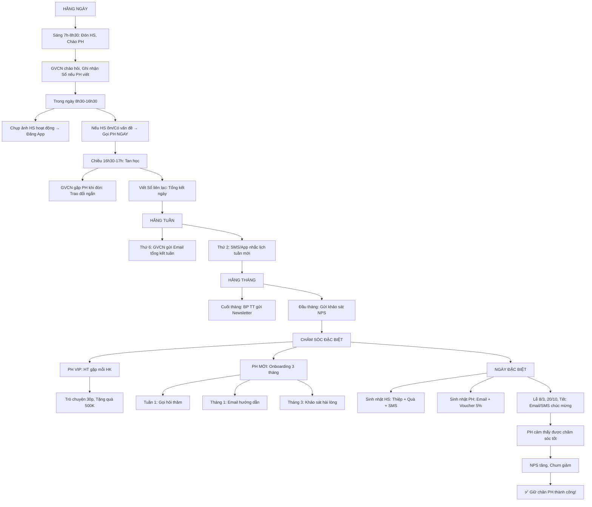

# SOP-02.3: CHĂM SÓC VÀ TƯƠNG TÁC VỚI PHỤ HUYNH

## 1. THÔNG TIN QUY TRÌNH

| **Thuộc tính** | **Nội dung** |
|---|---|
| Mã SOP | SOP-02.3 |
| Tên quy trình | Chăm sóc và tương tác với phụ huynh |
| Quy trình cha | SOP-02: CRM Phụ huynh |
| Phiên bản | 1.0 |
| Tần suất | Liên tục (Hằng ngày, Hằng tuần, Hằng tháng...) |

## 2. MỤC ĐÍCH

- **Giữ chân PH**: Chăm sóc tốt → PH hài lòng → Không rời bỏ
- **Tăng Engagement**: PH tương tác nhiều → Gắn bó với trường
- **Xây dựng cộng đồng**: PH kết nối với nhau → Cộng đồng mạnh
- **Thu thập phản hồi**: Qua tương tác → Biết PH nghĩ gì → Cải thiện

## 3. PHẠM VI ÁP DỤNG

Tất cả PH (Với mức độ khác nhau: VIP, TB, Nguy cơ...)

## 4. KÊNH TƯƠNG TÁC

### 4.1. Tổng quan các kênh

```
╔══════════════════════════════════════════════════════════════════╗
║           CÁC KÊNH TƯƠNG TÁC VỚI PH                             ║
╠══════════════════════════════════════════════════════════════════╣
║ 1. SỔ LIÊN LẠC (70% PH dùng)                                     ║
║    • Mục đích: Trao đổi hằng ngày (HS ăn gì, Học gì, Ngủ chưa...)║
║    • Tần suất: Mỗi ngày                                          ║
║    • Ưu điểm: Đơn giản, PH quen                                  ║
║    • Nhược điểm: Chậm (PH xem tối mới biết!)                     ║
╠══════════════════════════════════════════════════════════════════╣
║ 2. APP TRƯỜNG (50% PH dùng)                                      ║
║    • Mục đích: Thông báo real-time, Xem điểm, Xem ảnh HS...      ║
║    • Tần suất: Mỗi ngày                                          ║
║    • Ưu điểm: Nhanh, Tiện lợi, Tương tác 2 chiều                 ║
║    • Nhược điểm: PH lớn tuổi khó dùng                            ║
╠══════════════════════════════════════════════════════════════════╣
║ 3. EMAIL (80% PH có)                                             ║
║    • Mục đích: Thông báo chính thức, Tài liệu, Báo cáo...        ║
║    • Tần suất: 2-3 email/tuần                                    ║
║    • Ưu điểm: Chính thức, Lưu trữ được                           ║
║    • Nhược điểm: PH ít check (Open rate ~30%)                    ║
╠══════════════════════════════════════════════════════════════════╣
║ 4. SMS (100% PH có SĐT)                                          ║
║    • Mục đích: Thông báo khẩn (Nghỉ học, Đón muộn...)            ║
║    • Tần suất: Khi cần                                           ║
║    • Ưu điểm: 100% PH nhận được                                  ║
║    • Nhược điểm: Tốn phí (500đ/SMS)                              ║
╠══════════════════════════════════════════════════════════════════╣
║ 5. ĐIỆN THOẠI (Khi khẩn cấp)                                     ║
║    • Mục đích: Khẩn cấp (HS bị thương, Ốm...)                    ║
║    • Tần suất: Khi cần                                           ║
║    • Ưu điểm: Trực tiếp, Nhanh                                   ║
║    • Nhược điểm: Mất thời gian                                   ║
╠══════════════════════════════════════════════════════════════════╣
║ 6. HỌP PHỤ HUYNH (Tập thể)                                       ║
║    • Mục đích: Báo cáo HK, Kế hoạch, Trao đổi...                 ║
║    • Tần suất: 2 lần/năm (Đầu năm + Giữa năm)                    ║
║    • Ưu điểm: Gặp trực tiếp, Trao đổi sâu                        ║
║    • Nhược điểm: PH bận, Không đến hết (60-70%)                  ║
╠══════════════════════════════════════════════════════════════════╣
║ 7. GẶP 1-1 (Cá nhân)                                             ║
║    • Mục đích: Trao đổi riêng (HS có vấn đề, PH VIP...)          ║
║    • Tần suất: Khi cần (VIP: 1 HK/lần)                           ║
║    • Ưu điểm: Riêng tư, Sâu sắc                                  ║
║    • Nhược điểm: Mất thời gian (30 phút/PH)                      ║
╠══════════════════════════════════════════════════════════════════╣
║ 8. SỰ KIỆN (Cộng đồng)                                           ║
║    • Mục đích: Gắn kết PH, HS vui chơi, Thương hiệu...           ║
║    • Tần suất: 1-2 tháng/lần                                     ║
║    • Ưu điểm: Vui vẻ, Gắn kết                                    ║
║    • Nhược điểm: Tốn kém (5-10M/sự kiện)                         ║
╚══════════════════════════════════════════════════════════════════╝
```

## 5. QUY TRÌNH CHĂM SÓC HẰNG NGÀY

### 5.1. Sáng (7h-8h30): Đón HS, Chào PH

**Bước 1: GVCN + GV trực đón HS tại cổng**

```
7:00 - HS đến trường

GVCN: "Chào cháu! Chào bác!
       Hôm nay cháu khỏe không?"

HS: "Dạ khỏe ạ!"

GVCN (Với PH): "Bác A ạ,
               Hôm qua cháu làm bài rất tốt!
               Bác khen cháu nhé!"

PH: "Cảm ơn cô!"

→ TẠO ẤN TƯỢNG TỐT ngay từ sáng!
```

**Bước 2: Ghi nhận trong Sổ liên lạc (Nếu PH có ghi gì)**

```
PH viết Sổ:
"Cô ơi, Hôm qua con ho nhẹ.
 Cô để ý giúp!"

GVCN đọc → Ghi nhận:
"Cảm ơn bác! Cô sẽ để ý con!"

→ Trong ngày: Theo dõi HS!
```

### 5.2. Trong ngày (8h30-16h30): Cập nhật qua App

**Bước 3: Chụp ảnh HS hoạt động → Đăng App**

```
9h30 - Giờ học Toán:
GVCN chụp ảnh: HS đang làm bài (3-5 ảnh)

→ Đăng App (Album lớp 3A):
Caption: "Tiết Toán - Các em học Phép nhân!
         Các em rất chăm chỉ! 😊"

→ PH xem App (Ngay lập tức!):
"Ồ, Con mình đang học! Tập trung quá!"

→ PH cảm thấy: Yên tâm, Hài lòng! ✅
```

**Bước 4: Cập nhật tình trạng HS (Nếu có vấn đề)**

```
11h - HS A ốm, Sốt nhẹ:

GVCN:
1. Gọi điện PH NGAY:
   "Bác A ơi, Con sốt 37.8 độ.
    Bác đến đón con về khám bác sĩ nhé!"

2. Cập nhật App:
   "HS A bị sốt nhẹ, PH đã đến đón!"

3. Ghi Sổ sức khỏe (HS)

→ PH cảm thấy: Trường quan tâm! ✅
```

### 5.3. Chiều (16h30-17h): Tan học, Trao đổi

**Bước 5: GVCN gặp PH (Khi PH đón)**

```
16:30 - PH đón con:

GVCN: "Bác A ạ,
       Hôm nay con học tốt!
       Nhưng con chưa thuộc bảng cửu chương.
       Bác ôn lại cho con nhé!"

PH: "Vâng! Cảm ơn cô!"

→ PH biết rõ tình hình con!
```

**Bước 6: Viết Sổ liên lạc (Tổng kết ngày)**

```
GVCN viết Sổ:

"Hôm nay (15/03):
 • Học: Toán (Phép nhân), Văn (Tả cây)
 • Ăn: 1 bát cơm, Rau, Thịt (Ăn hết!)
 • Ngủ: 12h-13h30 (Ngủ ngon!)
 • Nhận xét: Con chăm chỉ! Tiến bộ!
 
 Nhắc nhở: Bác ôn bảng cửu chương cho con!
 
 GVCN X"

→ PH đọc (Tối):
"Cảm ơn cô! Con ăn ngon quá!"
```

## 6. QUY TRÌNH CHĂM SÓC HẰNG TUẦN

### 6.1. Cuối tuần (Thứ 6): Gửi Email tổng kết tuần

**Bước 7: GVCN viết Email (QT07-EM01)**

```
═══════════════════════════════════════════════════════
Subject: Báo cáo tuần 15-19/03 - Lớp 3A

Kính gửi quý PH lớp 3A,

Tuần này (15-19/03), Lớp học rất vui vẻ!

I. HỌC TẬP:
• Toán: Học Phép nhân (Bảng 2, 3, 4)
  - 25/30 em đã thuộc! Tốt lắm!
  - 5 em chưa thuộc → Bác ôn lại nhé!
  
• Văn: Tả cây (Cây xoài)
  - Các em viết rất hay!
  
• Anh: Unit 5 (Family)
  - Học từ vựng: Father, Mother, Brother...

II. HOẠT ĐỘNG:
• Thứ 4: Vui chơi sân trường (1 tiết)
• Thứ 6: Sinh nhật em Nguyễn Văn A (Cả lớp chúc mừng!)

III. NHẮC NHỞ:
• Tuần sau (22/03): Kiểm tra Toán (Phép nhân)
  → Bác ôn lại cho con nhé!
  
• Thứ 7 (27/03): Dã ngoại lớp (Vườn thú)
  → Đăng ký trên App (Trước 20/03)!

IV. ẢNH:
[Link album: 50 ảnh tuần này]

Mọi thắc mắc, Liên hệ cô:
SĐT: __________
Email: __________

Chúc PH cuối tuần vui vẻ!

GVCN Nguyễn Thị X
═══════════════════════════════════════════════════════

→ PH đọc (80% Open rate!)
→ PH cảm thấy: Biết rõ con học gì! Yên tâm! ✅
```

### 6.2. Đầu tuần (Thứ 2): Nhắc lịch tuần mới

**Bước 8: Gửi SMS/App**

```
SMS (Thứ 2, 7h):

"Chào quý PH lớp 3A!
 
 Tuần mới vui vẻ!
 
 Lịch tuần 22-26/03:
 • Thứ 3: Học thêm Tiếng Anh (15h-16h)
 • Thứ 5: Sinh nhật em B (Mang bánh nhé!)
 • Thứ 7: Dã ngoại (Đăng ký trên App!)
 
 GVCN X"

→ PH biết lịch → Chuẩn bị!
```

## 7. QUY TRÌNH CHĂM SÓC HẰNG THÁNG

### 7.1. Cuối tháng: Gửi Bản tin (Newsletter)

**Bước 9: BP Truyền thông biên tập Newsletter (QT07-NL01)**

```
═══════════════════════════════════════════════════════
      BẢN TIN IQ SCHOOL - THÁNG 3/2024
═══════════════════════════════════════════════════════

[Banner đẹp: HS vui vẻ]

CHÀO MỪNG QUÝ PHỤ HUYNH!

Tháng 3 đã qua với nhiều hoạt động ý nghĩa!

═══════════════════════════════════════════════════════
📚 TIN TỨC NỔI BẬT:

1. HS LỚP 5 ĐẠT GIẢI TOÁN QUỐC GIA!
   Em Nguyễn Văn A lớp 5B đạt Giải Nhì
   Olympic Toán toàn quốc!
   [Ảnh + Bài viết chi tiết...]

2. KHAI TRƯƠNG THƯ VIỆN SỐ!
   300 đầu sách điện tử!
   PH và HS đọc miễn phí!
   [Link: library.iqschool.edu.vn]

3. LỚP HỌC STEM MỚI!
   Tháng 4: Mở lớp STEM (Robot)
   Đăng ký: stem@iqschool.edu.vn

═══════════════════════════════════════════════════════
🎉 SỰ KIỆN THÁNG SAU:

• 05/04: Open House (Tham quan trường)
• 15/04: Hội diễn Văn nghệ
• 20/04: Gặp gỡ PH VIP (HT chủ trì)

→ Đăng ký tại: event.iqschool.edu.vn

═══════════════════════════════════════════════════════
💡 GÓC PHỤ HUYNH:

Bài viết: "5 Cách Giúp Con Học Toán Hiệu Quả"
[Link bài viết...]

Video: "Một Ngày Tại IQ School"
[Link YouTube...]

═══════════════════════════════════════════════════════
📸 ALBUM THÁNG 3:

[Link: 200 ảnh đẹp nhất tháng 3]

═══════════════════════════════════════════════════════

Cảm ơn quý vị đã đồng hành cùng IQ School!

HT Nguyễn Văn X
═══════════════════════════════════════════════════════

→ Gửi Email cho 500 PH
→ Open rate: 40-50%
→ PH cảm thấy: Trường chuyên nghiệp! ✅
```

### 7.2. Đầu tháng: Khảo sát hài lòng (NPS)

**Bước 10: Gửi khảo sát ngắn (1-2 phút)**

```
Email/App:

"Kính chào quý PH,

Quý vị hài lòng về IQ School không?

Chỉ 1 phút, Giúp chúng tôi cải thiện!

[Link khảo sát]

Câu hỏi:
1. Quý vị có giới thiệu IQ cho bạn bè không? (0-10)
2. Quý vị hài lòng về: Giảng dạy? An toàn? Ăn uống?
3. Góp ý khác?

Cảm ơn!
IQ School"

→ 30-40% PH trả lời
→ Phân tích → Cải thiện!
```

## 8. QUY TRÌNH CHĂM SÓC ĐẶC BIỆT

### 8.1. PH VIP: Chăm sóc riêng

**Mỗi HK:**

```
HT gặp riêng PH VIP (30 phút/PH):

HT: "Chào bác A! Mời bác ngồi!"
[Pha trà, Bánh...]

"Bác hài lòng về trường không?"

PH: "Vâng! Rất hài lòng!"

HT: "Con A học rất tốt!
     Cô X (GVCN) khen con nhiều lắm!
     
     Bác có góp ý gì không ạ?"

[Lắng nghe...]

"Cảm ơn bác! Chúng tôi sẽ cải thiện!
 
 À, Đây là quà nhỏ tri ân bác!"
[Tặng: Voucher 500K, Hoặc Quà]

→ PH VIP cảm thấy: Được trọng vị! ✅
```

### 8.2. PH mới: Onboarding (3 tháng đầu)

**Tuần 1:**

```
GVCN gọi điện:
"Chào bác A!
 Con mới học tuần đầu, Thích nghi chưa ạ?"

PH: "Con còn ngại lạ..."

GVCN: "Bình thường ạ! 1-2 tuần con sẽ quen!
       Bác yên tâm nhé!"
```

**Tháng 1:**

```
BP Quan hệ PH gửi Email:

"Chào mừng quý vị đến IQ School!

1 tháng đầu, Con có thích nghi không?

Hướng dẫn:
• Cách dùng App
• Cách xem điểm
• Cách đăng ký hoạt động

Mọi thắc mắc: hotline@iqschool.edu.vn

Chúc con học tốt!"
```

**Tháng 3:**

```
Khảo sát:
"3 tháng qua, Quý vị có hài lòng?
 Góp ý gì không?"

→ Nếu không hài lòng → Xử lý ngay!
→ Nếu hài lòng → Yên tâm!
```

### 8.3. Ngày đặc biệt (Sinh nhật, Lễ...)

**Sinh nhật HS:**

```
Sáng (Ngày sinh nhật):
• GVCN tặng Thiệp + Quà (Trị giá 100K)
• Cả lớp hát "Happy Birthday!"
• Chụp ảnh → Gửi PH!

Chiều:
• GVCN gửi SMS:
  "Chúc mừng sinh nhật con A!
   Chúc con học giỏi, Vui vẻ!
   GVCN X"

→ PH + HS rất vui! ✅
```

**Sinh nhật PH (Nếu biết):**

```
BP Quan hệ PH gửi Email:
"Chúc mừng sinh nhật bác A!
 Chúc bác sức khỏe, Hạnh phúc!
 
 Voucher giảm 5% học phí tháng này!"

→ PH bất ngờ, Vui! ✅
```

**Ngày Lễ (8/3, 20/10, Tết...):**

```
8/3 (Ngày Phụ nữ):
• HS làm thiệp tặng Mẹ (Giờ Mỹ thuật)
• GVCN gửi Email:
  "Chúc mừng 8/3!
   Chúc các bác luôn xinh đẹp, Hạnh phúc!"

TẾT:
• Gửi Thiệp điện tử (Hình đẹp!)
• SMS: "Chúc quý vị năm mới An khang, Thịnh vượng!"
```

## 9. LƯU ĐỒ QUY TRÌNH



## 10. BIỂU MẪU LIÊN QUAN

| **Mã** | **Tên** |
|---|---|
| QT07-EM01 | Email tổng kết tuần (Mẫu) |
| QT07-NL01 | Newsletter tháng (Mẫu) |
| QT07-KS01 | Khảo sát NPS (Form) |

## 11. TIÊU CHUẨN VÀ CHỈ TIÊU

| **Chỉ tiêu** | **Mục tiêu** |
|---|---|
| Tỷ lệ GVCN viết Sổ liên lạc hằng ngày | 100% |
| Tỷ lệ GVCN gửi Email tổng kết tuần | 100% |
| Open rate Email tuần | ≥60% |
| Open rate Newsletter tháng | ≥40% |
| Tỷ lệ PH trả lời khảo sát NPS | ≥30% |
| Thời gian phản hồi PH (Qua App/Email) | ≤24h |

## 12. TRÁCH NHIỆM CỤ THỂ

| **Vai trò** | **Trách nhiệm** |
|---|---|
| **GVCN** | Chăm sóc hằng ngày (Sổ, App, Email tuần) |
| **BP Truyền thông** | Newsletter tháng, Nội dung đẹp |
| **BP Quan hệ PH** | Khảo sát NPS, Chăm sóc VIP, PH mới |
| **HT** | Gặp PH VIP mỗi HK |

## 13. LƯU Ý QUAN TRỌNG

- ⚠️ **Chủ động**: ĐỪNG chờ PH hỏi! Chủ động cập nhật!
- ✅ **Thường xuyên**: Hằng ngày! (Sổ, App...) Không im lặng!
- 🔥 **Nhanh**: PH hỏi → Trả lời trong 24h! Chậm → PH không hài lòng!
- ✅ **Cá nhân hóa**: Gọi tên PH, Nhắc tên con → PH cảm thấy được chăm sóc!

## 14. PHỤ LỤC

### 14.1. Lịch chăm sóc (Mẫu 1 tuần)

```
═══════════════════════════════════════════════════════
    LỊCH CHĂM SÓC PH - TUẦN 15-19/03
═══════════════════════════════════════════════════════

THỨ 2:
□ 7h: Đón HS, Chào PH
□ 9h: Chụp ảnh HS học → Đăng App
□ 16h30: Trao đổi PH khi đón
□ 17h: Viết Sổ liên lạc
□ 19h: Gửi SMS lịch tuần

THỨ 3:
□ 7h: Đón HS, Chào PH
□ 10h: Chụp ảnh giờ Thể dục → Đăng App
□ 14h: HS A ốm → Gọi PH ngay!
□ 16h30: Trao đổi PH
□ 17h: Viết Sổ

THỨ 4:
□ 7h: Đón HS
□ 11h: Sinh nhật HS B → Chụp ảnh → Gửi PH
□ 16h30: Tặng thiệp sinh nhật cho HS B
□ 17h: Viết Sổ

THỨ 5:
□ 7h: Đón HS
□ 9h30: Chụp ảnh giờ Anh → Đăng App
□ 16h30: Trao đổi PH
□ 17h: Viết Sổ

THỨ 6:
□ 7h: Đón HS
□ 15h: Gửi Email tổng kết tuần ✅ QUAN TRỌNG!
□ 16h30: Trao đổi PH
□ 17h: Viết Sổ
═══════════════════════════════════════════════════════
```

### 14.2. Mẫu Sổ liên lạc (Tốt)

```
NGÀY 15/03/2024 - LỚP 3A

Kính chào quý PH,

HÔM NAY:
• Học: 
  - Toán: Phép nhân (Bảng 2, 3)
  - Văn: Tả cây xoài
  - Anh: Family (Unit 5)
  
• Ăn trưa:
  - Cơm, Thịt kho, Canh rau
  - Con A ăn 1 bát (Ngon miệng!)
  
• Ngủ trưa: 12h-13h30 (Ngủ ngon!)

NHẬN XÉT:
• Con học tốt! Tập trung!
• Nhưng chưa thuộc bảng cửu chương 2
  → Bác ôn lại giúp con nhé!

NHẮC NHỞ:
• Ngày mai: Mang bút màu (Giờ Mỹ thuật)
• Thứ 5: Kiểm tra Toán (Chuẩn bị!)

GVCN Nguyễn Thị X

---

→ PH CẢM THẤY: Rất chi tiết! Biết rõ con làm gì! ✅

(So với Sổ tệ: "Hôm nay con học tốt!" - Không nói gì!)
```

### 14.3. KPI chăm sóc PH (Dashboard)

```
┌──────────────────────────────────────────────────┐
│  KPI CHĂM SÓC PH - THÁNG 3                       │
├──────────────────────────────────────────────────┤
│ HẰNG NGÀY:                                       │
│ • Tỷ lệ viết Sổ: 98% (Mục tiêu: 100%) ⚠️       │
│   → 2 GV chưa viết: Nhắc nhở!                    │
│ • Tỷ lệ đăng ảnh App: 100% ✅                    │
│                                                  │
│ HẰNG TUẦN:                                       │
│ • Tỷ lệ gửi Email tuần: 100% ✅                  │
│ • Open rate: 65% (Mục tiêu: ≥60%) ✅             │
│                                                  │
│ HẰNG THÁNG:                                      │
│ • Newsletter: Đã gửi (01/03) ✅                  │
│ • Open rate: 45% (Mục tiêu: ≥40%) ✅             │
│ • NPS khảo sát: 35% PH trả lời ✅                │
│                                                  │
│ ĐẶC BIỆT:                                        │
│ • PH VIP: HT đã gặp 10/15 PH (67%) ⚠️           │
│   → Còn 5 PH chưa gặp!                           │
│ • Sinh nhật: 8 HS (Đã tặng quà hết!) ✅          │
└──────────────────────────────────────────────────┘
```

## 15. FAQ

**Q1: PH phàn nàn "GVCN viết Sổ quá ngắn!". Xử lý?**  
A: 
- Đào tạo lại GVCN: Viết CHI TIẾT! (Học gì, Ăn gì, Ngủ chưa...)
- Cho GVCN xem mẫu Sổ tốt (Phần 14.2)
- Kiểm tra: BP Quan hệ PH đọc Sổ ngẫu nhiên (Mỗi tuần)

**Q2: Gửi Newsletter, Nhưng Open rate thấp (20%). Tại sao?**  
A: 
- Tiêu đề chưa hấp dẫn! Thử: "🎉 HS Lớp 5 Đạt Giải Toán Quốc Gia!"
- Nội dung dài! Rút ngắn (1-2 phút đọc!)
- Gửi sai giờ! Gửi 19h-20h (PH đang rảnh!)

**Q3: PH VIP từ chối gặp HT. Xử lý?**  
A: 
- Hỏi: "Bác bận à? Tuần sau được không?"
- Nếu vẫn từ chối → OK! Không ép!
- Thay bằng: Video call (15 phút - Tiện hơn!)

---

**PHÊ DUYỆT**

| GVCN (Đại diện) | BP Quan hệ PH | Phó HT |
|---|---|---|
| [Họ tên] | [Họ tên] | [Họ tên] |
