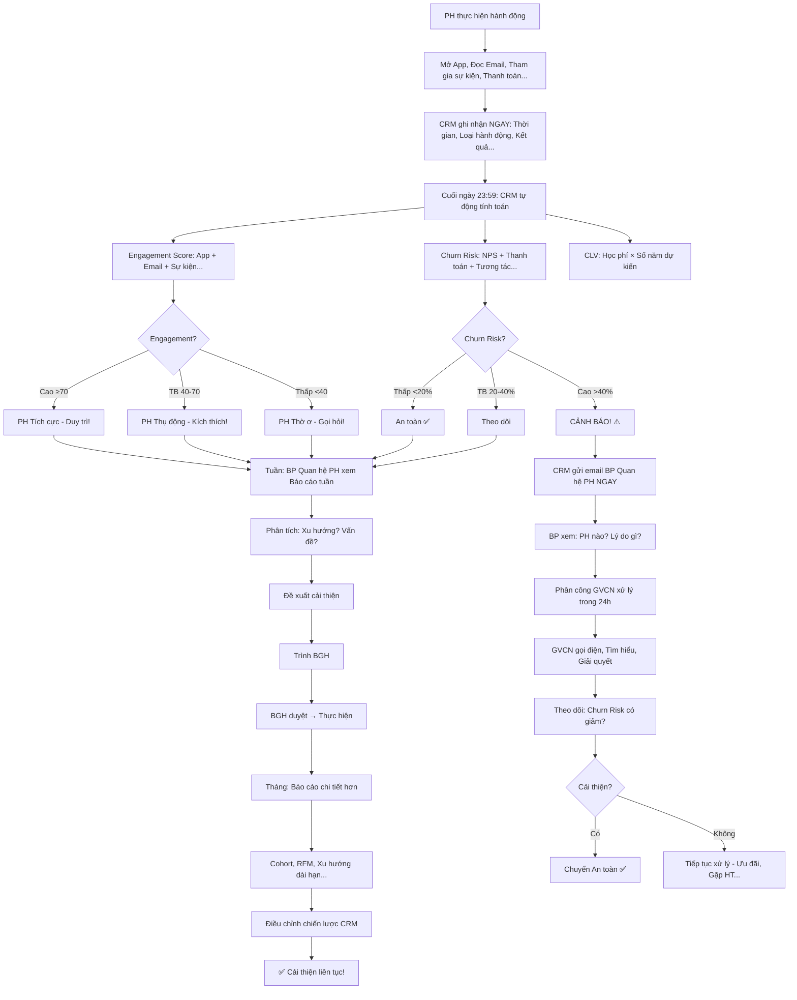

# SOP-02.4: THEO DÕI VÀ PHÂN TÍCH HÀNH VI

## 1. THÔNG TIN QUY TRÌNH

| **Thuộc tính** | **Nội dung** |
|---|---|
| Mã SOP | SOP-02.4 |
| Tên quy trình | Theo dõi và phân tích hành vi |
| Quy trình cha | SOP-02: CRM Phụ huynh |
| Phiên bản | 1.0 |
| Tần suất | Liên tục (Tự động) + Review tuần/tháng |

## 2. MỤC ĐÍCH

- **Dự đoán rủi ro**: PH nào sắp rời bỏ? Phát hiện sớm!
- **Tối ưu chiến lược**: Hiểu PH thích gì → Làm nhiều hơn!
- **Cá nhân hóa**: Biết hành vi từng PH → Chăm sóc đúng cách
- **Đo lường hiệu quả**: Chiến dịch nào tốt? ROI ra sao?

## 3. PHẠM VI ÁP DỤNG

Tất cả PH (Dữ liệu từ CRM, App, Email, SMS...)

## 4. CÁC CHỈ SỐ THEO DÕI (KPI)

### 4.1. Chỉ số Engagement (Tương tác)

```
╔══════════════════════════════════════════════════════════════════╗
║           CHỈ SỐ ENGAGEMENT                                      ║
╠══════════════════════════════════════════════════════════════════╣
║ 1. APP USAGE (Sử dụng App):                                      ║
║    • Số lần mở App/tuần: ____ lần                                ║
║      → Mục tiêu: ≥3 lần/tuần (Tích cực!)                         ║
║      → <1 lần/tuần (Ít tương tác! ⚠️)                           ║
║                                                                  ║
║    • Tính năng dùng nhiều nhất:                                  ║
║      - Xem điểm: 80% PH                                          ║
║      - Xem ảnh: 70% PH                                           ║
║      - Chat với GV: 40% PH                                       ║
║      - Đăng ký hoạt động: 30% PH                                 ║
║                                                                  ║
║    • Thời gian dùng App: ____ phút/ngày                          ║
║      → Mục tiêu: ≥5 phút/ngày                                    ║
╠══════════════════════════════════════════════════════════════════╣
║ 2. EMAIL ENGAGEMENT:                                             ║
║    • Open rate (Tỷ lệ mở): ____%                                 ║
║      → Tốt: ≥40%                                                 ║
║      → TB: 20-40%                                                ║
║      → Yếu: <20% (Không quan tâm!)                               ║
║                                                                  ║
║    • Click rate (Tỷ lệ click link): ____%                        ║
║      → Tốt: ≥10%                                                 ║
║      → TB: 5-10%                                                 ║
║      → Yếu: <5%                                                  ║
║                                                                  ║
║    • Thời gian đọc: ____ giây                                    ║
║      → Tốt: ≥60s (Đọc hết!)                                      ║
║      → Yếu: <10s (Chỉ lướt qua!)                                 ║
╠══════════════════════════════════════════════════════════════════╣
║ 3. SỰ KIỆN THAM GIA:                                             ║
║    • Tỷ lệ: __/__ sự kiện (___%)                                 ║
║      → Tích cực: ≥70%                                            ║
║      → Thụ động: 30-70%                                          ║
║      → Thờ ơ: <30%                                               ║
║                                                                  ║
║    • Loại sự kiện thích:                                         ║
║      - Họp PH: 60% tham gia                                      ║
║      - Dã ngoại: 80% tham gia (Thích nhất!)                      ║
║      - Workshop: 40% tham gia                                    ║
║      → Tổ chức nhiều Dã ngoại!                                   ║
╠══════════════════════════════════════════════════════════════════╣
║ 4. PHẢN HỒI:                                                     ║
║    • Số lần phản hồi: ____ lần (Góp ý, Khiếu nại...)             ║
║      → Nhiều (≥5): Quan tâm! (Hoặc Không hài lòng!)              ║
║      → Ít (0-1): Bình thường!                                    ║
║                                                                  ║
║    • Loại phản hồi:                                              ║
║      - Tích cực (Khen): 70%                                      ║
║      - Tiêu cực (Chê): 20%                                       ║
║      - Trung lập (Hỏi): 10%                                      ║
╚══════════════════════════════════════════════════════════════════╝
```

### 4.2. Chỉ số Hài lòng (Satisfaction)

```
╔══════════════════════════════════════════════════════════════════╗
║           CHỈ SỐ HÀI LÒNG                                        ║
╠══════════════════════════════════════════════════════════════════╣
║ 1. NPS (Net Promoter Score):                                     ║
║    Câu hỏi: "Quý vị có giới thiệu trường cho bạn bè không?"      ║
║    Thang điểm: 0-10                                              ║
║                                                                  ║
║    • 9-10: PROMOTER (Người quảng bá!) 🌟                         ║
║      → 40% PH (Mục tiêu!)                                        ║
║      → Họ sẽ giới thiệu PH mới!                                  ║
║                                                                  ║
║    • 7-8: PASSIVE (Thụ động)                                     ║
║      → 50% PH                                                    ║
║      → Hài lòng, Nhưng không nhiệt tình giới thiệu!              ║
║                                                                  ║
║    • 0-6: DETRACTOR (Chê bai!) ⚠️                               ║
║      → 10% PH (Nguy hiểm!)                                       ║
║      → Họ sẽ nói xấu trường!                                     ║
║                                                                  ║
║    TÍNH NPS:                                                     ║
║    NPS = % Promoter - % Detractor                                ║
║        = 40% - 10% = 30 (Tốt!)                                   ║
║                                                                  ║
║    Chuẩn:                                                        ║
║    • NPS ≥50: Xuất sắc!                                          ║
║    • NPS 30-50: Tốt!                                             ║
║    • NPS 0-30: Trung bình!                                       ║
║    • NPS <0: Tệ! (Nhiều Detractor!)                              ║
╠══════════════════════════════════════════════════════════════════╣
║ 2. CSAT (Customer Satisfaction):                                 ║
║    Câu hỏi: "Quý vị hài lòng về [X] không?"                      ║
║    Thang điểm: 1-5 sao                                           ║
║                                                                  ║
║    • Giảng dạy: 4.2/5 (Tốt!)                                     ║
║    • An toàn: 4.5/5 (Rất tốt!)                                   ║
║    • Ăn uống: 3.8/5 (TB - Cần cải thiện!)                        ║
║    • Cơ sở vật chất: 4.3/5                                       ║
║                                                                  ║
║    → Ưu tiên cải thiện: ĂN UỐNG!                                 ║
╠══════════════════════════════════════════════════════════════════╣
║ 3. CHURN RISK (Nguy cơ rời bỏ):                                  ║
║    Công thức dự đoán:                                            ║
║                                                                  ║
║    Churn Risk = Tổng điểm âm / 100                               ║
║                                                                  ║
║    Điểm âm nếu:                                                  ║
║    • NPS <5: -20 điểm                                            ║
║    • Thanh toán trễ ≥2 lần: -15 điểm                             ║
║    • Không tham gia sự kiện 3 tháng: -15 điểm                    ║
║    • Không mở Email 1 tháng: -10 điểm                            ║
║    • Không dùng App 1 tháng: -10 điểm                            ║
║    • Phản hồi tiêu cực ≥3: -20 điểm                              ║
║    • Không liên lạc với GVCN 1 tháng: -10 điểm                   ║
║                                                                  ║
║    VD: PH A có:                                                  ║
║    • NPS = 3 → -20                                               ║
║    • Trễ thanh toán 2 lần → -15                                  ║
║    • Không dùng App 2 tháng → -10                                ║
║    TỔNG: -45 điểm                                                ║
║                                                                  ║
║    → Churn Risk = 45% (CAO! ⚠️)                                 ║
║    → Cần xử lý NGAY!                                             ║
╚══════════════════════════════════════════════════════════════════╝
```

### 4.3. Chỉ số Tài chính (Financial)

```
╔══════════════════════════════════════════════════════════════════╗
║           CHỈ SỐ TÀI CHÍNH                                       ║
╠══════════════════════════════════════════════════════════════════╣
║ 1. CLV (Customer Lifetime Value - Giá trị trọn đời):             ║
║    CLV = Học phí/năm × Số năm học dự kiến                        ║
║                                                                  ║
║    VD: PH A:                                                     ║
║    • Học phí: 5M/năm                                             ║
║    • Con học lớp 3, Dự kiến học đến lớp 9 (6 năm nữa)           ║
║    • CLV = 5M × 6 = 30M                                          ║
║                                                                  ║
║    → PH A có giá trị 30M! (Quan trọng!)                          ║
║                                                                  ║
║    Nếu có 2 con:                                                 ║
║    • CLV = 30M × 2 = 60M (Rất quan trọng!)                       ║
╠══════════════════════════════════════════════════════════════════╣
║ 2. THANH TOÁN:                                                   ║
║    • Đúng hạn: ___% (Mục tiêu: 100%)                             ║
║    • Trễ 1-7 ngày: ___% (Chấp nhận!)                             ║
║    • Trễ >7 ngày: ___% (Nguy cơ!)                                ║
║    • Nợ quá hạn >30 ngày: ___% (Rất nguy hiểm!)                  ║
║                                                                  ║
║    → Theo dõi chặt! Nhắc nhở kịp thời!                           ║
╠══════════════════════════════════════════════════════════════════╣
║ 3. UPSELL/CROSS-SELL (Bán thêm):                                 ║
║    • Tỷ lệ PH đăng ký thêm dịch vụ:                              ║
║      - Xe đưa đón: 60%                                           ║
║      - Ăn trưa: 80%                                              ║
║      - Học thêm: 30%                                             ║
║                                                                  ║
║    • Doanh thu thêm/PH: ____ đồng/năm                            ║
║      → Mục tiêu: Tăng 10%/năm!                                   ║
╚══════════════════════════════════════════════════════════════════╝
```

## 5. QUY TRÌNH THEO DÕI

### 5.1. Theo dõi tự động (Bằng CRM)

**Bước 1: CRM thu thập dữ liệu (Real-time)**

```
MỖI HÀNH ĐỘNG CỦA PH → CRM GHI NHẬN:

09:30 - PH A mở App
→ CRM: +1 lần mở App (Ngày 15/03)

09:35 - PH A xem điểm HS
→ CRM: +1 lần xem điểm

09:40 - PH A xem album ảnh
→ CRM: +1 lần xem ảnh
→ Thời gian: 5 phút

10:00 - PH A đóng App
→ CRM: Tổng thời gian dùng = 30 phút

---

14:00 - Gửi Email cho PH A: "Newsletter tháng 3"
→ CRM: Email gửi thành công ✅

14:05 - PH A mở Email
→ CRM: Open! +1 Open rate

14:07 - PH A click link "Xem album"
→ CRM: Click! +1 Click rate

14:10 - PH A đọc 120 giây
→ CRM: Đọc kỹ! (≥60s)

---

19:00 - PH A viết Sổ liên lạc: "Cảm ơn cô!"
→ CRM: +1 tương tác (Tích cực!)

---

Cuối ngày:
CRM TỰ ĐỘNG tính:
• PH A: Engagement Score = 85/100 (Tích cực!)
• Churn Risk = 5% (Thấp - An toàn!)
```

**Bước 2: CRM tính toán chỉ số (Hằng ngày)**

```
CUỐI NGÀY (23:59):

CRM chạy script:
FOR mỗi PH:
  1. Tính Engagement Score
  2. Tính Churn Risk
  3. Nếu Churn Risk >40% → Cảnh báo!
  
VD:
PH A: Engagement 85, Churn 5% → OK ✅
PH B: Engagement 20, Churn 60% → CẢNH BÁO! ⚠️

→ Gửi email BP Quan hệ PH:
"PH B có nguy cơ rời bỏ 60%!
 Lý do:
 • NPS = 3
 • Không dùng App 2 tháng
 • Trễ thanh toán 2 lần
 
 → Xử lý NGAY!"
```

**Bước 3: Dashboard real-time (Xem bất kỳ lúc nào)**

```
BP Quan hệ PH mở Dashboard:

┌──────────────────────────────────────────────────┐
│  DASHBOARD HÀNH VI PH - REAL-TIME               │
├──────────────────────────────────────────────────┤
│ HÔM NAY (15/03):                                 │
│ • App: 250 PH mở (50% - Bình thường!)            │
│ • Email: Gửi 500, Open 180 (36% - Tốt!)         │
│                                                  │
│ TUẦN NÀY:                                        │
│ • Sự kiện: "Họp PH" (Thứ 7)                      │
│   - Đăng ký: 150/250 PH (60% - Tốt!)            │
│                                                  │
│ THÁNG NÀY:                                       │
│ • NPS trung bình: 7.2/10 (Giảm từ 7.5!) ⚠️      │
│ • Churn risk trung bình: 8% (Tăng từ 6%!) ⚠️    │
│                                                  │
│ CẢNH BÁO:                                        │
│ • 15 PH có Churn risk >40% ⚠️                   │
│   → Cần xử lý NGAY!                              │
│ • 50 PH không dùng App 1 tháng ⚠️               │
│   → Gọi hỏi thăm!                                │
└──────────────────────────────────────────────────┘
```

### 5.2. Phân tích định kỳ (Tuần/Tháng)

**Bước 4: Phân tích tuần (Mỗi thứ 2)**

```
BP Quan hệ PH xem Báo cáo tuần (QT07-BC05):

═══════════════════════════════════════════════════════
    BÁO CÁO HÀNH VI PH - TUẦN 8-14/03
═══════════════════════════════════════════════════════

I. ENGAGEMENT:
• App:
  - Trung bình: 2.5 lần mở/PH/tuần (Giảm từ 3!) ⚠️
  - Lý do: Ít cập nhật nội dung mới!
  
• Email:
  - Gửi: 2 email (Tuần học + Newsletter)
  - Open rate: 35% (TB)
  
• Sự kiện:
  - "Dã ngoại": 180/250 PH tham gia (72% - Tốt!)

II. HÀI LÒNG:
• NPS: 7.3/10 (Giảm nhẹ!)
• CSAT (Ăn uống): 3.7/5 (Giảm từ 3.8!)
  → Nguy cơ: Nhiều PH phản hồi "Đồ ăn nhạt!"

III. TÀI CHÍNH:
• Thanh toán đúng hạn: 95% (Tốt!)
• Nợ quá hạn: 5% (10 PH) → Nhắc nhở!

IV. CẢNH BÁO:
• 12 PH Churn risk >40% (Tăng 2 PH so với tuần trước!)
  → Danh sách: [PH A, B, C...]
  
V. ĐỀ XUẤT:
• Cải thiện đồ ăn (Nhiều PH phản hồi!)
• Tăng nội dung App (Đăng ảnh nhiều hơn!)
• Xử lý 12 PH nguy cơ (Gọi điện trong tuần này!)

BP Quan hệ PH ký: __________
═══════════════════════════════════════════════════════

→ Trình BGH (Thứ 3)
→ BGH duyệt → Thực hiện!
```

**Bước 5: Phân tích tháng (Đầu tháng sau)**

```
BÁO CÁO THÁNG (Chi tiết hơn):

• Xu hướng: NPS giảm 0.3 điểm (7.5 → 7.2)
  → Lý do: Đồ ăn + GVCN lớp 3B yếu (Nhiều PH phàn nàn!)
  → Giải pháp: Thay đầu bếp + Đào tạo GVCN 3B!
  
• Top 3 PH Tích cực nhất: A, B, C
  → Tặng quà tri ân!
  
• Top 10 PH Nguy cơ cao nhất: D, E, F...
  → Họp khẩn, Xử lý!
```

## 6. PHÂN TÍCH SÂU (Advanced Analytics)

### 6.1. Phân tích Cohort (Theo nhóm nhập học)

```
╔══════════════════════════════════════════════════════════════════╗
║           PHÂN TÍCH COHORT                                       ║
╠══════════════════════════════════════════════════════════════════╣
║ NHÓM NHẬP HỌC 2022 (100 PH):                                     ║
║  • Năm 1 (2022-2023): 100 PH (Retention 100%)                    ║
║  • Năm 2 (2023-2024): 95 PH (Retention 95% - Mất 5!)             ║
║  • Năm 3 (2024-2025): 90 PH (Retention 90% - Mất thêm 5!)        ║
║                                                                  ║
║  → Tỷ lệ Churn năm 1: 5%                                         ║
║  → Tỷ lệ Churn năm 2: 5% (Ổn định!)                              ║
║                                                                  ║
║  → DỰ ĐOÁN: Năm 4 còn ~85 PH (Churn 5%)                          ║
╠══════════════════════════════════════════════════════════════════╣
║ SO SÁNH:                                                         ║
║ • Nhóm 2021: Churn năm 1 = 10% (Cao hơn!)                        ║
║   → Lý do: Năm 2021 Covid, PH khó khăn tài chính!                ║
║                                                                  ║
║ • Nhóm 2022: Churn năm 1 = 5% (Tốt hơn!)                         ║
║   → Lý do: Chất lượng cải thiện, PH hài lòng hơn!                ║
╚══════════════════════════════════════════════════════════════════╝
```

### 6.2. Phân tích RFM (Recency, Frequency, Monetary)

```
╔══════════════════════════════════════════════════════════════════╗
║           PHÂN TÍCH RFM                                          ║
╠══════════════════════════════════════════════════════════════════╣
║ PH A:                                                            ║
║  • Recency (Gần đây): Lần tương tác cuối = 2 ngày trước (Tốt!)   ║
║  • Frequency (Tần suất): 50 tương tác/tháng (Cao!)               ║
║  • Monetary (Tiền): 5M/năm, 2 con = 10M/năm (Cao!)               ║
║                                                                  ║
║  → Nhóm: VIP - Chăm sóc đặc biệt!                                ║
╠══════════════════════════════════════════════════════════════════╣
║ PH B:                                                            ║
║  • Recency: 30 ngày trước (Lâu!)                                 ║
║  • Frequency: 5 tương tác/tháng (Thấp!)                          ║
║  • Monetary: 5M/năm, 1 con (TB)                                  ║
║                                                                  ║
║  → Nhóm: Nguy cơ rời bỏ - Xử lý ngay!                            ║
╚══════════════════════════════════════════════════════════════════╝
```

## 7. LƯU ĐỒ QUY TRÌNH



## 8. BIỂU MẪU LIÊN QUAN

| **Mã** | **Tên** |
|---|---|
| QT07-BC05 | Báo cáo hành vi PH (Tuần) |
| QT07-BC06 | Báo cáo hành vi PH (Tháng) |
| QT07-DS05 | Danh sách PH Churn risk cao |

## 9. TIÊU CHUẨN VÀ CHỈ TIÊU

| **Chỉ tiêu** | **Mục tiêu** |
|---|---|
| Engagement Score trung bình | ≥60/100 |
| Churn Risk trung bình | ≤10% |
| NPS | ≥50 |
| Open rate Email | ≥40% |
| Tỷ lệ PH dùng App hằng tuần | ≥50% |
| Thời gian phát hiện PH nguy cơ | ≤7 ngày |

## 10. TRÁCH NHIỆM CỤ THỂ

| **Vai trò** | **Trách nhiệm** |
|---|---|
| **CRM (Hệ thống)** | Thu thập, Tính toán, Cảnh báo tự động |
| **BP Quan hệ PH** | Xem Dashboard hằng ngày, Phân tích tuần/tháng, Xử lý PH nguy cơ |
| **Data Analyst** | Phân tích sâu (Cohort, RFM...), Đề xuất cải thiện |
| **BGH** | Duyệt đề xuất, Quyết định chiến lược |

## 11. LƯU Ý QUAN TRỌNG

- ⚠️ **Tự động hóa**: CRM phải tự tính! Không thủ công!
- ✅ **Xem hằng ngày**: Dashboard! (5 phút/ngày) Phát hiện sớm!
- 🔥 **Hành động nhanh**: PH nguy cơ → Xử lý trong 24h! Chậm → Mất PH!
- ✅ **Dữ liệu chính xác**: Sai input → Sai phân tích → Sai quyết định!

## 12. PHỤ LỤC

### 12.1. Công thức Churn Risk chi tiết

```
═══════════════════════════════════════════════════════
    CÔNG THỨC CHURN RISK (Dự đoán rời bỏ)
═══════════════════════════════════════════════════════

Churn Risk = Tổng điểm âm / 100

CHI TIẾT:

A. NPS:
• NPS 9-10: 0 điểm (An toàn!)
• NPS 7-8: -5 điểm
• NPS 5-6: -10 điểm
• NPS 3-4: -20 điểm
• NPS 0-2: -30 điểm (Rất nguy hiểm!)

B. THANH TOÁN:
• Đúng hạn 100%: 0 điểm
• Trễ 1 lần: -5 điểm
• Trễ 2 lần: -15 điểm
• Trễ ≥3 lần: -25 điểm

C. TƯƠNG TÁC:
• App:
  - Dùng hằng tuần: 0 điểm
  - Không dùng 1 tháng: -10 điểm
  - Không dùng ≥2 tháng: -20 điểm
  
• Email:
  - Open rate ≥40%: 0 điểm
  - Open rate 20-40%: -5 điểm
  - Open rate <20%: -10 điểm
  
• Sự kiện:
  - Tham gia ≥50%: 0 điểm
  - Tham gia 20-50%: -10 điểm
  - Không tham gia 3 tháng: -15 điểm

D. PHẢN HỒI:
• Phản hồi tích cực: 0 điểm
• Phản hồi tiêu cực 1-2 lần: -10 điểm
• Phản hồi tiêu cực ≥3 lần: -20 điểm
• Khiếu nại nghiêm trọng: -30 điểm

E. LIÊN HỆ GVCN:
• Liên hệ thường xuyên: 0 điểm
• Không liên hệ 1 tháng: -10 điểm
• Không liên hệ ≥2 tháng: -20 điểm

═══════════════════════════════════════════════════════

VÍ DỤ:

PH NGUYỄN VĂN A:
• NPS = 3 → -20 điểm
• Trễ thanh toán 2 lần → -15 điểm
• Không dùng App 2 tháng → -20 điểm
• Không tham gia sự kiện 3 tháng → -15 điểm
• Khiếu nại 1 lần → -10 điểm

TỔNG: -80 điểm

→ Churn Risk = 80% (RẤT CAO! 🚨)

HÀNH ĐỘNG:
1. GVCN gọi điện NGAY (Trong 2h!)
2. Tìm hiểu vấn đề
3. Gặp trực tiếp (Nếu cần)
4. Ưu đãi: Giảm 15% học phí 3 tháng
5. Theo dõi hằng tuần
═══════════════════════════════════════════════════════
```

### 12.2. Dashboard mẫu (Screenshot)

```
┌────────────────────────────────────────────────────────┐
│  DASHBOARD HÀNH VI PH - 15/03/2024, 9:30               │
├────────────────────────────────────────────────────────┤
│ TỔNG QUAN:                                             │
│ • Tổng PH: 500                                         │
│ • NPS trung bình: 7.2/10 (↓ 0.3 so với tháng trước)    │
│ • Churn risk TB: 8% (↑ 2% ⚠️)                         │
│                                                        │
│ HÔM NAY:                                               │
│ • App: 250/500 PH mở (50%)                             │
│ • Email gửi: 0 (Chưa gửi hôm nay)                      │
│                                                        │
│ TUẦN NÀY (8-14/03):                                    │
│ • Engagement trung bình: 62/100 (Tốt!)                 │
│ • Sự kiện: "Họp PH" (Thứ 7)                            │
│   - Đăng ký: 150/250 (60%)                             │
│                                                        │
│ CẢNH BÁO (QUAN TRỌNG!):                                │
│ ┌────────────────────────────────────────────────┐    │
│ │  15 PH CHURN RISK >40%! ⚠️                     │    │
│ │  → XEM CHI TIẾT                                │    │
│ └────────────────────────────────────────────────┘    │
│                                                        │
│ TOP 5 PH NGUY CƠ CAO NHẤT:                             │
│ 1. Nguyễn Văn A - 80% (🚨 Rất cao!)                   │
│    Lý do: NPS 3, Trễ TT, Không dùng App...            │
│    [Xem chi tiết] [Xử lý ngay]                         │
│                                                        │
│ 2. Trần Thị B - 65%                                    │
│    Lý do: Khiếu nại 3 lần, NPS 4...                   │
│    [Xem chi tiết] [Xử lý ngay]                         │
│                                                        │
│ 3-5. ... (Tương tự)                                    │
│                                                        │
│ [XEM TẤT CẢ 15 PH]                                     │
└────────────────────────────────────────────────────────┘
```

### 12.3. Case study: Giảm Churn từ 10% xuống 5%

```
═══════════════════════════════════════════════════════
    CASE STUDY: TRƯỜNG X - GIẢM CHURN THÀNH CÔNG
═══════════════════════════════════════════════════════

TÌNH HUỐNG (2022):
• Churn rate: 10%/năm (Cao!)
• Mất 50/500 PH = 250M doanh thu!

NGUYÊN NHÂN:
• Phát hiện chậm (PH đã quyết định rời bỏ!)
• Không biết PH không hài lòng về gì!

GIẢI PHÁP (2023):
1. Triển khai CRM theo dõi hành vi
2. Tính Churn Risk hằng ngày
3. Xử lý PH nguy cơ >40% trong 24h
4. Khảo sát NPS mỗi tháng
5. Cải thiện điểm yếu (Từ NPS feedback)

KẾT QUẢ (2024):
• Churn rate: 5% (Giảm một nửa! ✅)
• Giữ được 25 PH (= 125M doanh thu!)
• NPS: 7.5 → 8.2 (Tăng!)

BÀI HỌC:
• Phát hiện sớm = Cứu được!
• Dữ liệu chính xác → Quyết định đúng!
• Hành động nhanh → Giữ chân thành công!
═══════════════════════════════════════════════════════
```

## 13. FAQ

**Q1: CRM tính Churn Risk 60%, Nhưng PH không rời bỏ. Sai?**  
A: KHÔNG sai! (Churn Risk = Dự đoán - Không chính xác 100%!)
- 60% = Có 60% khả năng rời bỏ (Vẫn có 40% ở lại!)
- Nhưng: Cần xử lý! (Giảm risk xuống!)

**Q2: Theo dõi hành vi, PH có cảm thấy bị "theo dõi"? (Xâm phạm riêng tư?)**  
A: KHÔNG!
- Chỉ theo dõi hành vi trên hệ thống (App, Email...)
- Không theo dõi đời tư (Không cài camera nhà PH!)
- Mục đích: Phục vụ tốt hơn!

**Q3: PH Engagement thấp, Nhưng con học tốt, PH hài lòng. Có sao không?**  
A: OK! (Một số PH không thích công nghệ!)
- Miễn NPS cao, Thanh toán đúng hạn → An toàn!
- Không ép PH dùng App!

---

**PHÊ DUYỆT**

| Data Analyst | BP Quan hệ PH | Phó HT |
|---|---|---|
| [Họ tên] | [Họ tên] | [Họ tên] |
