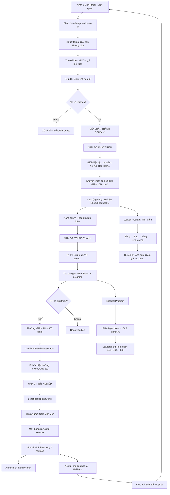

# SOP-02.5: PHÁT TRIỂN MỐI QUAN HỆ LÂU DÀI

## 1. THÔNG TIN QUY TRÌNH

| **Thuộc tính** | **Nội dung** |
|---|---|
| Mã SOP | SOP-02.5 |
| Tên quy trình | Phát triển mối quan hệ lâu dài |
| Quy trình cha | SOP-02: CRM Phụ huynh |
| Phiên bản | 1.0 |
| Tần suất | Liên tục (Chiến lược dài hạn) |

## 2. MỤC ĐÍCH

- **Giữ chân lâu dài**: PH ở lại 5-10 năm (Từ MN → THCS)
- **Tăng giá trị**: PH đăng ký thêm dịch vụ, Con 2, 3...
- **Biến thành Ambassador**: PH giới thiệu PH mới → Tuyển sinh miễn phí!
- **Cộng đồng mạnh**: PH kết nối nhau → Cộng đồng gắn bó

## 3. PHẠM VI ÁP DỤNG

Tất cả PH (Đặc biệt: PH trung thành, VIP)

## 4. CHIẾN LƯỢC DÀI HẠN

### 4.1. Vòng đời PH (Customer Lifecycle)

```
╔══════════════════════════════════════════════════════════════════╗
║           VÒNG ĐỜI PHỤ HUYNH (10 NĂM)                           ║
╠══════════════════════════════════════════════════════════════════╣
║ NĂM 1-2 (MẦM NON): GIAI ĐOẠN LÀM QUEN                           ║
║  • Mục tiêu: GIỮ CHÂN! (Tránh bỏ học sớm!)                       ║
║  • Hành động:                                                    ║
║    - Chào đón ấm áp (Welcome kit)                                ║
║    - Hỗ trợ tối đa (Hướng dẫn, Giải đáp...)                      ║
║    - Theo dõi sát (GVCN gọi PH mỗi tuần)                         ║
║    - Ưu đãi: Giảm 5% năm 2 (Nếu tiếp tục!)                       ║
║                                                                  ║
║  • Chỉ tiêu: Churn ≤10% (Giữ 90% PH!)                            ║
╠══════════════════════════════════════════════════════════════════╣
║ NĂM 3-5 (TIỂU HỌC): GIAI ĐOẠN PHÁT TRIỂN                        ║
║  • Mục tiêu: TĂNG GIÁ TRỊ! (Upsell/Cross-sell)                  ║
║  • Hành động:                                                    ║
║    - Giới thiệu dịch vụ thêm (Học thêm, Xe, Ăn...)               ║
║    - Khuyến khích anh chị em (Giảm 10% con 2!)                   ║
║    - Tạo cộng đồng (Sự kiện PH, Nhóm Facebook...)                ║
║    - Nâng cấp VIP (Nếu đủ điều kiện!)                            ║
║                                                                  ║
║  • Chỉ tiêu: 30% PH đăng ký thêm dịch vụ!                        ║
╠══════════════════════════════════════════════════════════════════╣
║ NĂM 6-9 (THCS): GIAI ĐOẠN TRUNG THÀNH                           ║
║  • Mục tiêu: BIẾN THÀNH AMBASSADOR!                              ║
║  • Hành động:                                                    ║
║    - Tri ân (Quà tặng, Sự kiện VIP...)                           ║
║    - Yêu cầu giới thiệu: "Bạn bè con học đâu?"                   ║
║    - Chương trình Referral (Cả 2 giảm 5%!)                       ║
║    - Mời làm Brand Ambassador (Đại diện trường!)                 ║
║                                                                  ║
║  • Chỉ tiêu: 40% PH giới thiệu ≥1 PH mới!                        ║
╠══════════════════════════════════════════════════════════════════╣
║ NĂM 9+ (TỐT NGHIỆP): GIAI ĐOẠN ALUMNI                           ║
║  • Mục tiêu: GIỮ LIÊN LẠC! (Alumni program)                      ║
║  • Hành động:                                                    ║
║    - Tổ chức Lễ tốt nghiệp ấn tượng                              ║
║    - Mời tham gia Alumni Network                                 ║
║    - Cập nhật tin tức trường (Mỗi HK)                            ║
║    - Mời về thăm trường (1 năm/lần)                              ║
║                                                                  ║
║  • Mục đích: Alumni giới thiệu PH mới!                           ║
║    (Họ đã trải nghiệm 10 năm → Uy tín cao!)                      ║
╚══════════════════════════════════════════════════════════════════╝
```

### 4.2. Loyalty Program (Chương trình Khách hàng thân thiết)

```
╔══════════════════════════════════════════════════════════════════╗
║           CHƯƠNG TRÌNH KHÁCH HÀNG THÂN THIẾT                    ║
╠══════════════════════════════════════════════════════════════════╣
║ CẤP BẬC (Dựa trên Điểm tích lũy):                                ║
║                                                                  ║
║ 1. ĐỒNG (0-999 điểm) - PH MỚI:                                   ║
║    • Quyền lợi cơ bản                                            ║
║    • Giảm 5% học phí năm 2                                       ║
║                                                                  ║
║ 2. BẠC (1000-2999 điểm) - PH 2-3 NĂM:                            ║
║    • Giảm 7% học phí                                             ║
║    • Ưu tiên đăng ký hoạt động                                   ║
║    • Quà sinh nhật (Con + PH)                                    ║
║                                                                  ║
║ 3. VÀNG (3000-4999 điểm) - PH 4-5 NĂM:                           ║
║    • Giảm 10% học phí                                            ║
║    • Hotline ưu tiên                                             ║
║    • Mời VIP event (Năm 2 lần)                                   ║
║    • Tặng voucher 500K (Sinh nhật)                               ║
║                                                                  ║
║ 4. KIM CƯƠNG (≥5000 điểm) - PH ≥6 NĂM:                           ║
║    • Giảm 15% học phí                                            ║
║    • Gặp HT mỗi HK                                               ║
║    • Miễn phí 1 dịch vụ (Xe/Ăn/Học thêm)                         ║
║    • Đặt tên phòng học (Theo tên PH - Vinh danh!)                ║
║    • Card VIP vĩnh viễn (Cả Alumni!)                             ║
╠══════════════════════════════════════════════════════════════════╣
║ CÁCH TÍCH ĐIỂM:                                                  ║
║  • Mỗi năm học: +500 điểm                                        ║
║  • Thanh toán đúng hạn: +100 điểm/năm                            ║
║  • Tham gia sự kiện: +50 điểm/sự kiện                            ║
║  • Giới thiệu PH mới (Thành công): +300 điểm                     ║
║  • Đăng ký con 2: +500 điểm                                      ║
║  • Phản hồi tích cực: +20 điểm                                   ║
║  • NPS 9-10: +100 điểm                                           ║
║                                                                  ║
║ VÍ DỤ: PH A:                                                     ║
║  • Học 5 năm: 500 × 5 = 2,500 điểm                               ║
║  • Thanh toán đúng hạn 5 năm: 100 × 5 = 500 điểm                 ║
║  • Giới thiệu 2 PH: 300 × 2 = 600 điểm                           ║
║  • Tham gia 10 sự kiện: 50 × 10 = 500 điểm                       ║
║  TỔNG: 4,100 điểm → CẤP VÀNG! 🥇                                 ║
╚══════════════════════════════════════════════════════════════════╝
```

### 4.3. Referral Program (Chương trình Giới thiệu)

```
╔══════════════════════════════════════════════════════════════════╗
║           CHƯƠNG TRÌNH GIỚI THIỆU                               ║
╠══════════════════════════════════════════════════════════════════╣
║ QUY TẮC:                                                         ║
║  1. PH cũ giới thiệu PH mới                                      ║
║  2. PH mới đăng ký thành công (Nhập học)                         ║
║  3. PH mới học ≥3 tháng (Đảm bảo không bỏ sớm!)                  ║
║  → Cả 2 bên nhận thưởng!                                         ║
╠══════════════════════════════════════════════════════════════════╣
║ THƯỞNG:                                                          ║
║                                                                  ║
║  A. PH CŨ (Người giới thiệu):                                    ║
║     • Giảm 5% học phí (Tháng tiếp theo)                          ║
║     • +300 điểm Loyalty                                          ║
║     • Quà tặng: 500K (Nếu giới thiệu ≥3 PH/năm)                  ║
║                                                                  ║
║  B. PH MỚI (Người được giới thiệu):                              ║
║     • Giảm 5% học phí (Tháng đầu)                                ║
║     • Tặng: Balo + Đồ dùng học tập (500K)                        ║
╠══════════════════════════════════════════════════════════════════╣
║ QUY TRÌNH:                                                       ║
║                                                                  ║
║  Bước 1: PH A (Cũ) nhận Mã giới thiệu (Trên App)                 ║
║          VD: REF-A123                                            ║
║                                                                  ║
║  Bước 2: PH A gửi cho PH B (Mới):                                ║
║          "Mời bạn đến trường X!                                  ║
║           Nhập mã: REF-A123 → Giảm 5%!"                          ║
║                                                                  ║
║  Bước 3: PH B đăng ký, Nhập mã REF-A123                          ║
║                                                                  ║
║  Bước 4: PH B nhập học thành công!                               ║
║                                                                  ║
║  Bước 5: Sau 3 tháng (PH B vẫn học):                             ║
║          → Hệ thống tự động:                                     ║
║            - PH A: Giảm 5% tháng 4                               ║
║            - PH A: +300 điểm                                     ║
║            - Gửi email chúc mừng!                                ║
╠══════════════════════════════════════════════════════════════════╣
║ LEADERBOARD (Bảng xếp hạng):                                     ║
║                                                                  ║
║  Top 3 PH giới thiệu nhiều nhất (Năm 2024):                      ║
║  1. Nguyễn Văn A: 8 PH 🥇                                        ║
║     → Tặng: Voucher du lịch 5M                                   ║
║  2. Trần Thị B: 5 PH 🥈                                          ║
║     → Tặng: Voucher 3M                                           ║
║  3. Lê Văn C: 3 PH 🥉                                            ║
║     → Tặng: Voucher 1M                                           ║
║                                                                  ║
║  → Công bố trên Website, Facebook (Với sự đồng ý của PH!)        ║
╚══════════════════════════════════════════════════════════════════╝
```

## 5. XÂY DỰNG CỘNG ĐỒNG

### 5.1. Nhóm Facebook PH

```
╔══════════════════════════════════════════════════════════════════╗
║           NHÓM FACEBOOK PHỤ HUYNH IQ SCHOOL                     ║
╠══════════════════════════════════════════════════════════════════╣
║ MỤC ĐÍCH:                                                        ║
║  • PH kết nối nhau (Chia sẻ kinh nghiệm nuôi con...)             ║
║  • PH hỏi đáp (Trường trả lời)                                   ║
║  • Tạo cộng đồng gắn bó                                          ║
╠══════════════════════════════════════════════════════════════════╣
║ QUY TẮC:                                                         ║
║  1. Chỉ PH hiện tại được vào (Duyệt bằng Email)                  ║
║  2. Không spam, Bán hàng (Trừ PH bán cho PH - OK!)               ║
║  3. Tôn trọng nhau (Không chửi, Gây gổ...)                       ║
║  4. Bảo mật (Không chia sẻ ảnh con người khác!)                  ║
╠══════════════════════════════════════════════════════════════════╣
║ NỘI DUNG:                                                        ║
║  • Trường đăng (30%):                                            ║
║    - Thông báo sự kiện                                           ║
║    - Bài viết hữu ích ("5 cách dạy con học Toán...")            ║
║    - Ảnh hoạt động HS                                            ║
║                                                                  ║
║  • PH đăng (70%):                                                ║
║    - Hỏi đáp: "Con khó ăn, Xử lý sao?"                           ║
║    - Chia sẻ kinh nghiệm: "Cách tôi dạy con đọc sách..."        ║
║    - Mua bán: "Bán sách cũ, Đồng phục cũ..."                    ║
║    - Tán gẫu: "Cuối tuần đi đâu chơi?"                           ║
╠══════════════════════════════════════════════════════════════════╣
║ QUẢN TRỊ:                                                        ║
║  • Admin: BP Quan hệ PH (1 người)                                ║
║  • Mod: 3 PH tình nguyện (PH tích cực!)                          ║
║  • Duyệt bài: Mỗi ngày (Xóa spam, Vi phạm...)                    ║
╠══════════════════════════════════════════════════════════════════╣
║ KPI:                                                             ║
║  • Thành viên: 400/500 PH (80% - Tốt!)                           ║
║  • Tương tác: 50 bài/ngày (Sôi nổi!)                             ║
║  • Engagement: 200 bình luận/ngày                                ║
╚══════════════════════════════════════════════════════════════════╝
```

### 5.2. Sự kiện Cộng đồng

```
╔══════════════════════════════════════════════════════════════════╗
║           SỰ KIỆN CỘNG ĐỒNG (1-2 THÁNG/LẦN)                     ║
╠══════════════════════════════════════════════════════════════════╣
║ 1. GIA ĐÌNH VUI NHỘN (Family Fun Day):                           ║
║    • Thời gian: Chủ nhật, 1 tháng/lần                            ║
║    • Nội dung: Trò chơi, Picnic, Thể thao...                     ║
║    • Mục đích: PH + HS + GV vui chơi, Gắn kết                    ║
║    • Chi phí: Miễn phí (Trường chi!)                             ║
║    • Tham gia: 200-300 người/lần                                 ║
╠══════════════════════════════════════════════════════════════════╣
║ 2. WORKSHOP PHỤ HUYNH:                                           ║
║    • Thời gian: Thứ 7, 2 tháng/lần                               ║
║    • Chủ đề:                                                     ║
║      - "Cách dạy con học Toán hiệu quả"                          ║
║      - "Kỹ năng sống cho trẻ"                                    ║
║      - "Dinh dưỡng cho trẻ"                                      ║
║    • Diễn giả: Chuyên gia (Mời ngoài) hoặc GV                    ║
║    • Chi phí: Miễn phí                                           ║
║    • Tham gia: 50-80 PH/lần                                      ║
╠══════════════════════════════════════════════════════════════════╣
║ 3. NETWORKING PH VIP:                                            ║
║    • Thời gian: 6 tháng/lần                                      ║
║    • Hình thức: Gala Dinner (Sang trọng!)                        ║
║    • Mục đích: PH VIP gặp nhau, Kết nối kinh doanh...            ║
║    • Tham gia: 50-80 PH VIP                                      ║
║    • Chi phí: Trường chi (5-10M)                                 ║
╠══════════════════════════════════════════════════════════════════╣
║ 4. TỪ THIỆN CỘNG ĐỒNG:                                           ║
║    • Thời gian: 1 năm/lần (Tết)                                  ║
║    • Nội dung: PH + HS quyên góp, Đi từ thiện                    ║
║    • Mục đích: Giáo dục lòng nhân ái, Tạo hình ảnh tốt           ║
║    • Tham gia: 100-150 người                                     ║
╚══════════════════════════════════════════════════════════════════╝
```

## 6. CHƯƠNG TRÌNH ALUMNI (Cựu Học sinh)

### 6.1. Alumni Network

```
╔══════════════════════════════════════════════════════════════════╗
║           MẠNG LƯỚI CỰU HỌC SINH                                ║
╠══════════════════════════════════════════════════════════════════╣
║ MỤC ĐÍCH:                                                        ║
║  • Giữ liên lạc với Alumni (Sau khi tốt nghiệp)                  ║
║  • Alumni giới thiệu PH mới (Uy tín cao!)                        ║
║  • Alumni về thăm, Chia sẻ kinh nghiệm với HS hiện tại           ║
╠══════════════════════════════════════════════════════════════════╣
║ HOẠT ĐỘNG:                                                       ║
║  1. LỄ TỐT NGHIỆP ẤN TƯỢNG:                                      ║
║     • Trang trọng (Lễ phục, Bằng...)                             ║
║     • Cảm động (Video hồi ức 10 năm...)                          ║
║     • Quà tặng: Album ảnh, USB (Toàn bộ ảnh 10 năm!)             ║
║                                                                  ║
║  2. ALUMNI CARD:                                                 ║
║     • Thẻ Alumni vĩnh viễn                                       ║
║     • Quyền lợi:                                                 ║
║       - Về thăm trường bất kỳ lúc nào                            ║
║       - Tham gia sự kiện Alumni                                  ║
║       - Giảm 10% nếu con họ học trường (Thế hệ 2!)              ║
║                                                                  ║
║  3. ALUMNI EVENT:                                                ║
║     • 1 năm/lần: "Homecoming Day"                                ║
║     • Alumni về thăm trường, Gặp GV cũ                           ║
║     • Chia sẻ: "Tôi đã thành công như thế nào?"                  ║
║                                                                  ║
║  4. ALUMNI NETWORK ONLINE:                                       ║
║     • Nhóm Facebook: "Alumni IQ School"                          ║
║     • LinkedIn: "IQ School Alumni Association"                   ║
║     • Mục đích: Alumni kết nối, Giúp đỡ nhau (Tìm việc...)       ║
╠══════════════════════════════════════════════════════════════════╣
║ KẾT QUẢ MONG ĐỢI:                                                ║
║  • 50% Alumni tham gia Network                                   ║
║  • 30% Alumni giới thiệu ≥1 PH mới                               ║
║  • 10% Alumni cho con học lại trường (Thế hệ 2!)                 ║
╚══════════════════════════════════════════════════════════════════╝
```

## 7. LƯU ĐỒ QUY TRÌNH



## 8. BIỂU MẪU LIÊN QUAN

| **Mã** | **Tên** |
|---|---|
| QT07-LP01 | Thẻ Loyalty (Đồng, Bạc, Vàng, Kim cương) |
| QT07-REF01 | Mã giới thiệu (Referral code) |
| QT07-AL01 | Thẻ Alumni |

## 9. TIÊU CHUẨN VÀ CHỈ TIÊU

| **Chỉ tiêu** | **Mục tiêu** |
|---|---|
| Tỷ lệ giữ chân năm 1 | ≥90% |
| Tỷ lệ PH đăng ký thêm dịch vụ (Năm 3-5) | ≥30% |
| Tỷ lệ PH giới thiệu (Năm 6-9) | ≥40% |
| Tỷ lệ Alumni tham gia Network | ≥50% |
| Tỷ lệ Alumni cho con học lại (Thế hệ 2) | ≥10% |

## 10. TRÁCH NHIỆM CỤ THỂ

| **Vai trò** | **Trách nhiệm** |
|---|---|
| **BP Quan hệ PH** | Quản lý Loyalty, Referral, Alumni program |
| **GVCN** | Giữ chân năm 1-2, Động viên giới thiệu |
| **BP Tuyển sinh** | Xử lý PH được giới thiệu, Phát triển Alumni Network |
| **HT** | Tri ân PH trung thành, Gặp PH VIP |

## 11. LƯU Ý QUAN TRỌNG

- ⚠️ **Đầu tư dài hạn**: Giữ PH 10 năm = CLV 50-60M! (Rất đáng!)
- ✅ **Giữ chân năm 1-2**: Quan trọng nhất! (Mất sớm = Mất vĩnh viễn!)
- 🔥 **Cộng đồng**: PH kết nối → Khó rời bỏ! (Vì thân với PH khác!)
- ✅ **Alumni**: Vàng! (Họ là người giới thiệu uy tín nhất!)

## 12. PHỤ LỤC

### 12.1. Case study: PH 10 năm

```
═══════════════════════════════════════════════════════
    CASE STUDY: PH NGUYỄN VĂN A - 10 NĂM TRUNG THÀNH
═══════════════════════════════════════════════════════

2015: Con A nhập học MN (3 tuổi)
• PH A: Hơi lo lắng (Con nhỏ, Lần đầu đi học!)
• Trường: Chào đón ấm áp, GVCN gọi mỗi tuần!
• Kết quả: PH A yên tâm, Hài lòng!

2017: Con A lên Tiểu học lớp 1
• Trường giới thiệu: "Đăng ký thêm Xe đưa đón?"
• PH A: Đồng ý! (Tiện!)
• CLV tăng: 5M → 9M/năm (+80%!)

2019: Con B (Em) nhập học MN
• Trường ưu đãi: Giảm 10% con 2!
• PH A rất vui!
• CLV tăng: 9M → 16M/năm (+78%!)

2020: Covid - Khó khăn
• Nhiều PH rút con (Không đủ tiền!)
• PH A: Vẫn ở lại! (Tin tưởng trường!)
• Trường: Tặng quà tri ân 500K!

2022: Con A lên lớp 6, Con B lên lớp 3
• PH A trở thành VIP! (2 con, 7 năm học!)
• Quyền lợi: Giảm 15%, Hotline 24/7, Gặp HT...
• PH A giới thiệu 3 PH mới! (Ambassador!)

2024: Con A lớp 9 (Sắp tốt nghiệp!)
• PH A: "10 năm rất vui! Cảm ơn trường!"
• Trường: Tặng quà tri ân 2M (Kỷ niệm 10 năm!)

2025: Con A tốt nghiệp THCS
• Lễ tốt nghiệp ấn tượng!
• PH A khóc (Cảm động!)
• Con A nhận Alumni Card!

2026: Con B vẫn học (Lớp 7)
• PH A vẫn là PH hiện tại!
• Tham gia Alumni Network (Con A!)
• CLV TỔNG: 16M × 10 năm = 160M! 🎉

KẾT LUẬN:
• Giữ chân năm 1-2 → Có PH 10 năm!
• 10 năm = 160M doanh thu!
• PH trung thành = Giới thiệu nhiều PH mới!
═══════════════════════════════════════════════════════
```

### 12.2. ROI của Loyalty Program

```
╔══════════════════════════════════════════════════════════════════╗
║           ROI LOYALTY PROGRAM                                    ║
╠══════════════════════════════════════════════════════════════════╣
║ CHI PHÍ (1 NĂM):                                                 ║
║  • Phần mềm Loyalty: 10M/năm                                     ║
║  • Quà tặng VIP: 100 PH × 500K = 50M                             ║
║  • Sự kiện: 30M                                                  ║
║  • Nhân sự: 20M (1 người quản lý)                                ║
║  TỔNG CHI: 110M                                                  ║
╠══════════════════════════════════════════════════════════════════╣
║ LỢI ÍCH:                                                         ║
║  • Giảm Churn 5% → Giữ được 25 PH                                ║
║    25 PH × 5M = 125M doanh thu/năm                               ║
║                                                                  ║
║  • PH giới thiệu: 50 PH mới (Không chi marketing!)               ║
║    50 PH × 5M = 250M doanh thu/năm                               ║
║                                                                  ║
║  • Upsell: 30% PH đăng ký thêm dịch vụ                           ║
║    150 PH × 2M = 300M doanh thu thêm/năm                         ║
║                                                                  ║
║  TỔNG LỢI: 125M + 250M + 300M = 675M                             ║
╠══════════════════════════════════════════════════════════════════╣
║ ROI:                                                             ║
║  ROI = (Lợi - Chi) / Chi                                         ║
║      = (675M - 110M) / 110M                                      ║
║      = 5.14                                                      ║
║                                                                  ║
║  → Chi 1đ → Thu về 5.14đ! RẤT ĐÁG! ✅                            ║
╚══════════════════════════════════════════════════════════════════╝
```

### 12.3. Mẫu Email tri ân PH 10 năm

```
Subject: 🎉 TRI ÂN 10 NĂM ĐỒNG HÀNH!

Kính gửi quý PH Nguyễn Văn A,

10 NĂM ĐÃ QUA!

Từ năm 2015 đến nay, Quý vị đã đồng hành cùng
IQ School suốt 10 năm!

2015: Con A (MN) - Năm đầu tiên
...
2025: Con A (Lớp 9) - Sắp tốt nghiệp!

10 năm là một hành trình dài!
Có lúc vui, Có lúc khó khăn!
Nhưng Quý vị luôn tin tưởng chúng tôi!

XIN CHÂN THÀNH CẢM ƠN!

Để tri ân, Chúng tôi xin tặng:
🎁 Voucher du lịch 5M (Gia đình 4 người)
🎁 Album ảnh 10 năm (200 ảnh đẹp nhất!)
🎁 Video kỷ niệm (Hành trình 10 năm của con!)

Một lần nữa, XIN CẢM ƠN!
Chúng tôi rất vinh dự được đồng hành cùng gia đình!

Trân trọng,
Hiệu trưởng Nguyễn Văn X
IQ School

---
P/S: Chúng tôi mong Con B (Đang lớp 7) sẽ tiếp tục
     học đến lớp 9! Để chúng tôi được phục vụ thêm 2 năm nữa! 😊
```

## 13. FAQ

**Q1: Loyalty Program tốn kém. Trường nhỏ có nên làm không?**  
A: NÊN! (Nhưng đơn giản hơn!)
- Không cần phần mềm phức tạp → Dùng Excel!
- Không cần quà đắt → Quà nhỏ (100-200K) cũng OK!
- Quan trọng: TINH THẦN tri ân! (Không phải giá trị!)

**Q2: PH giới thiệu, Nhưng PH mới không nhập học. Có thưởng không?**  
A: KHÔNG!
- Chỉ thưởng khi PH mới NHẬP HỌC + HỌC ≥3 THÁNG!
- Lý do: Tránh PH giới thiệu bừa (Để lấy thưởng!)

**Q3: Alumni không quan tâm Network. Xử lý?**  
A: Tạo giá trị!
- Networking: Alumni kết nối → Giúp tìm việc, Kinh doanh...
- Event hấp dẫn: Gặp bạn cũ, Nhớ thời học trò...
- Ưu đãi: Con Alumni học lại → Giảm 10%!

---

**PHÊ DUYỆT**

| BP Quan hệ PH | BP Tuyển sinh | Phó HT | Hiệu trưởng |
|---|---|---|---|
| [Họ tên] | [Họ tên] | [Họ tên] | [Họ tên] |

---

✅ **HOÀN THÀNH SOP-02: CRM PHỤ HUYNH (6 files)!** 🎉🔥📚
