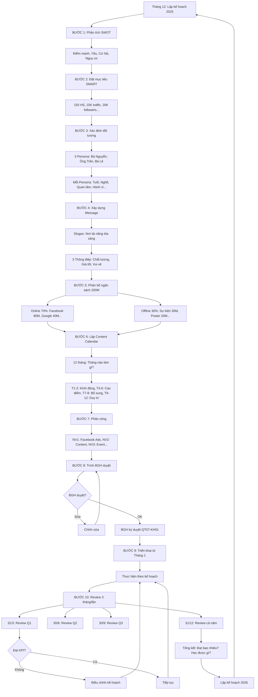

# SOP-03.1: LẬP KẾ HOẠCH TRUYỀN THÔNG

## 1. THÔNG TIN QUY TRÌNH

| **Thuộc tính** | **Nội dung** |
|---|---|
| Mã SOP | SOP-03.1 |
| Tên quy trình | Lập kế hoạch truyền thông |
| Quy trình cha | SOP-03: Truyền thông - Marketing |
| Phiên bản | 1.0 |
| Tần suất | Hằng năm (Tháng 12 cho năm sau) + Review 3 tháng/lần |

## 2. MỤC ĐÍCH

- **Định hướng rõ ràng**: Truyền thông gì, Khi nào, Ở đâu, Cho ai
- **Phân bổ nguồn lực**: Ngân sách, Nhân lực hợp lý
- **Đồng bộ**: Tất cả kênh cùng message, Cùng thời điểm
- **Đo lường được**: KPI rõ ràng → Đánh giá hiệu quả

## 3. PHẠM VI ÁP DỤNG

Tất cả hoạt động truyền thông (Online + Offline)

## 4. CẤU TRÚC KẾ HOẠCH

### 4.1. Phân tích tình hình (Situation Analysis)

```
╔══════════════════════════════════════════════════════════════════╗
║           PHÂN TÍCH TÌNH HÌNH (SWOT)                            ║
╠══════════════════════════════════════════════════════════════════╣
║ S - STRENGTHS (Điểm mạnh):                                       ║
║  • Chất lượng giảng dạy tốt (CSAT 4.2/5)                         ║
║  • GV 100% có chứng chỉ quốc tế                                  ║
║  • Cơ sở vật chất hiện đại (Xây 2023)                            ║
║  • Học phí hợp lý (5M - Rẻ hơn đối thủ 30%)                      ║
║  • PH hài lòng cao (NPS 7.2/10)                                  ║
╠══════════════════════════════════════════════════════════════════╣
║ W - WEAKNESSES (Điểm yếu):                                       ║
║  • Thương hiệu còn mới (3 năm - Chưa nổi!)                       ║
║  • Ngân sách marketing hạn chế (100M/năm)                        ║
║  • Team marketing nhỏ (3 người)                                  ║
║  • Chưa có nhiều thành tích (HS chưa có giải lớn)                ║
║  • Website traffic thấp (5K/tháng)                               ║
╠══════════════════════════════════════════════════════════════════╣
║ O - OPPORTUNITIES (Cơ hội):                                      ║
║  • Thị trường trường tư tăng 10%/năm                             ║
║  • PH ngày càng coi trọng chất lượng (Hơn giá rẻ)                ║
║  • Khu dân cư mới đang xây (5 tòa, 2000 căn)                     ║
║  • Social media phát triển (Facebook, TikTok...)                 ║
║  • Covid qua → PH sẵn sàng chi tiêu hơn                          ║
╠══════════════════════════════════════════════════════════════════╣
║ T - THREATS (Nguy cơ):                                           ║
║  • Đối thủ mạnh (Trường X - 10 năm, Marketing tốt)               ║
║  • Suy thoái kinh tế (PH giảm chi tiêu)                          ║
║  • Giá thuê mặt bằng tăng (Chi phí tăng → Học phí phải tăng?)    ║
║  • Luật quảng cáo thắt chặt (Facebook, Google...)                ║
╠══════════════════════════════════════════════════════════════════╣
║ KẾT LUẬN:                                                        ║
║  • PHÁT HUY: S (Chất lượng tốt, Giá rẻ!)                         ║
║  • KHẮC PHỤC: W (Xây dựng thương hiệu!)                          ║
║  • TẬN DỤNG: O (Marketing online, Khu dân cư mới!)               ║
║  • PHÒNG NGỪA: T (Theo dõi đối thủ, Ứng phó suy thoái!)          ║
╚══════════════════════════════════════════════════════════════════╝
```

### 4.2. Mục tiêu truyền thông (Communication Objectives)

```
╔══════════════════════════════════════════════════════════════════╗
║           MỤC TIÊU 2025 (SMART)                                 ║
╠══════════════════════════════════════════════════════════════════╣
║ S - SPECIFIC (Cụ thể):                                           ║
║  1. NHẬN DIỆN THƯƠNG HIỆU:                                       ║
║     • 50% PH trong bán kính 5km biết đến IQ School               ║
║     (Hiện tại: 20%)                                              ║
║                                                                  ║
║  2. TUYỂN SINH:                                                  ║
║     • 150 HS mới (MN: 50, TH: 60, THCS: 40)                      ║
║     • Cost/HS ≤1.5M (Tổng ngân sách 200M / 150 HS)               ║
║                                                                  ║
║  3. ONLINE PRESENCE:                                             ║
║     • Website traffic: 5K → 15K/tháng (+200%)                    ║
║     • Facebook followers: 10K → 20K (+100%)                      ║
║     • Instagram followers: 2K → 5K (+150%)                       ║
║                                                                  ║
║  4. ENGAGEMENT:                                                  ║
║     • Facebook Engagement rate: 3% → 5%                          ║
║     • Email open rate: 30% → 40%                                 ║
╠══════════════════════════════════════════════════════════════════╣
║ M - MEASURABLE (Đo lường được):                                  ║
║  • Tất cả có số liệu rõ ràng (%, Số lượng...)                    ║
║  • Công cụ: Google Analytics, Facebook Insights, CRM...          ║
╠══════════════════════════════════════════════════════════════════╣
║ A - ACHIEVABLE (Khả thi):                                        ║
║  • Dựa trên năm trước: 2024 tuyển 145 HS                         ║
║  • 2025: 150 HS (Tăng 3% - Hợp lý!)                              ║
║  • Ngân sách 200M (Tăng 25% so với năm trước - Đủ!)              ║
╠══════════════════════════════════════════════════════════════════╣
║ R - RELEVANT (Liên quan):                                        ║
║  • Mục tiêu truyền thông → Hỗ trợ mục tiêu kinh doanh!           ║
║  • Tuyển sinh → Doanh thu → Phát triển trường!                   ║
╠══════════════════════════════════════════════════════════════════╣
║ T - TIME-BOUND (Thời hạn):                                       ║
║  • Hoàn thành: 31/12/2025                                        ║
║  • Review: 3 tháng/lần (31/3, 30/6, 30/9, 31/12)                 ║
╚══════════════════════════════════════════════════════════════════╝
```

### 4.3. Đối tượng mục tiêu (Target Audience)

```
╔══════════════════════════════════════════════════════════════════╗
║           3 PERSONA PHỤ HUYNH                                   ║
╠══════════════════════════════════════════════════════════════════╣
║ PERSONA 1: BÀ NGUYỄN (40% ĐỐI TƯỢNG)                            ║
║                                                                  ║
║  Thông tin:                                                      ║
║  • Tuổi: 30-40                                                   ║
║  • Nghề: Nhân viên văn phòng, Giáo viên...                       ║
║  • Thu nhập: 15-30M/tháng                                        ║
║  • Khu vực: Quận X, Y (3-5km từ trường)                          ║
║                                                                  ║
║  Quan tâm:                                                       ║
║  • Chất lượng giảng dạy (Quan trọng nhất!)                       ║
║  • Học phí hợp lý (Nhạy cảm về giá!)                             ║
║  • An toàn                                                       ║
║                                                                  ║
║  Hành vi:                                                        ║
║  • Dùng Facebook nhiều (2h/ngày)                                 ║
║  • Tìm kiếm Google: "Trường tiểu học tốt quận X"                 ║
║  • Tin: Bạn bè giới thiệu (70%)                                  ║
║                                                                  ║
║  Message phù hợp:                                                ║
║  "Chất lượng quốc tế - Học phí hợp lý!"                          ║
║  "100% GV có chứng chỉ - Chỉ 5M/năm!"                            ║
╠══════════════════════════════════════════════════════════════════╣
║ PERSONA 2: ÔNG TRẦN (30% ĐỐI TƯỢNG)                             ║
║                                                                  ║
║  Thông tin:                                                      ║
║  • Tuổi: 35-45                                                   ║
║  • Nghề: Doanh nhân, Quản lý cấp cao                             ║
║  • Thu nhập: 50-100M/tháng                                       ║
║  • Khu vực: Trung tâm                                            ║
║                                                                  ║
║  Quan tâm:                                                       ║
║  • Uy tín (Quan trọng nhất!)                                     ║
║  • Kết nối (Con làm quen con nhà giàu!)                          ║
║  • Dịch vụ cao cấp                                               ║
║                                                                  ║
║  Hành vi:                                                        ║
║  • Ít lên mạng (Bận!)                                            ║
║  • Tin: Bạn bè (CEO, Doanh nhân) giới thiệu                      ║
║  • Thích: Sự kiện VIP                                            ║
║                                                                  ║
║  Message phù hợp:                                                ║
║  "Trường uy tín - Cộng đồng tinh hoa!"                           ║
║  "Chương trình quốc tế - Môi trường 5 sao!"                      ║
╠══════════════════════════════════════════════════════════════════╣
║ PERSONA 3: BÀ LÊ (30% ĐỐI TƯỢNG)                                ║
║                                                                  ║
║  Thông tin:                                                      ║
║  • Tuổi: 28-35                                                   ║
║  • Nghề: Freelancer, Khởi nghiệp                                 ║
║  • Thu nhập: 20-40M (Không ổn định)                              ║
║  • Khu vực: Khu đô thị mới                                       ║
║                                                                  ║
║  Quan tâm:                                                       ║
║  • Phương pháp dạy hiện đại (Montessori...)                      ║
║  • Công nghệ (App, Online...)                                    ║
║  • Sáng tạo                                                      ║
║                                                                  ║
║  Hành vi:                                                        ║
║  • Dùng TikTok, Instagram nhiều                                  ║
║  • Tìm review (Google, Facebook...)                              ║
║  • Tin: Influencer                                               ║
║                                                                  ║
║  Message phù hợp:                                                ║
║  "Phương pháp dạy hiện đại - Công nghệ số!"                      ║
║  "STEM, Coding - Chuẩn bị con cho tương lai!"                    ║
╚══════════════════════════════════════════════════════════════════╝
```

### 4.4. Thông điệp chính (Key Messages)

```
╔══════════════════════════════════════════════════════════════════╗
║           THÔNG ĐIỆP CHÍNH 2025                                 ║
╠══════════════════════════════════════════════════════════════════╣
║ SLOGAN:                                                          ║
║  "IQ SCHOOL - NƠI TÀI NĂNG TỎA SÁNG!"                            ║
║                                                                  ║
║  (Giải thích: IQ = Intelligence, TỎA SÁNG = Thành công!)         ║
╠══════════════════════════════════════════════════════════════════╣
║ 3 THÔNG ĐIỆP CHÍNH:                                              ║
║                                                                  ║
║  1. CHẤT LƯỢNG QUỐC TẾ:                                          ║
║     "100% GV có chứng chỉ quốc tế"                               ║
║     "Chương trình song ngữ chuẩn Cambridge"                      ║
║     "Cơ sở hiện đại - Thiết bị công nghệ cao"                    ║
║                                                                  ║
║  2. HỌC PHÍ HỢP LÝ:                                              ║
║     "Chỉ 5M/năm - Rẻ hơn trường cùng chất lượng 30%"             ║
║     "Chất lượng cao - Giá không cao!"                            ║
║                                                                  ║
║  3. HỌC TẬP VUI VẺ:                                              ║
║     "Học mà vui như chơi!"                                       ║
║     "500 HS hạnh phúc mỗi ngày!"                                 ║
║     "NPS 7.2/10 - PH hài lòng!"                                  ║
╠══════════════════════════════════════════════════════════════════╣
║ PROOF POINTS (Bằng chứng):                                       ║
║  • 500 HS đang học (Tin tưởng!)                                  ║
║  • 90% PH hài lòng (CSAT 4.2/5)                                  ║
║  • 50 PH giới thiệu PH mới/năm (Uy tín!)                         ║
║  • HS đạt giải Toán cấp quận (Năm 2024 - 3 giải!)                ║
╚══════════════════════════════════════════════════════════════════╝
```

## 5. CHIẾN LƯỢC TRUYỀN THÔNG

### 5.1. Phân bổ ngân sách (200M)

```
╔══════════════════════════════════════════════════════════════════╗
║           NGÂN SÁCH TRUYỀN THÔNG 2025: 200M                     ║
╠══════════════════════════════════════════════════════════════════╣
║ ONLINE (70% - 140M):                                             ║
║  1. Facebook Ads: 80M (40%)                                      ║
║     • Mục tiêu: Lead generation                                  ║
║     • KPI: 400 Lead, Cost/Lead ≤200K                             ║
║                                                                  ║
║  2. Google Ads: 40M (20%)                                        ║
║     • Search Ads (Từ khóa: "Trường tiểu học...")                 ║
║     • KPI: 200 Lead, Cost/Lead ≤200K                             ║
║                                                                  ║
║  3. SEO + Content: 10M (5%)                                      ║
║     • Viết blog (2 bài/tuần)                                     ║
║     • KPI: Traffic 15K/tháng                                     ║
║                                                                  ║
║  4. Influencer Marketing: 5M (2.5%)                              ║
║     • Hợp tác 5 Blogger mẹ (1M/người)                            ║
║     • KPI: 50 Lead/người                                         ║
║                                                                  ║
║  5. Video (YouTube, TikTok): 5M (2.5%)                           ║
║     • Sản xuất 20 video (250K/video)                             ║
║     • KPI: 500K views                                            ║
╠══════════════════════════════════════════════════════════════════╣
║ OFFLINE (30% - 60M):                                             ║
║  1. Sự kiện tư vấn: 30M (15%)                                    ║
║     • 3 sự kiện × 10M                                            ║
║     • KPI: 200 PH/sự kiện, 80 đăng ký                            ║
║                                                                  ║
║  2. Poster, Banner: 20M (10%)                                    ║
║     • 1000 poster, 50 banner                                     ║
║     • Vị trí: Chung cư, Siêu thị... (5km)                        ║
║                                                                  ║
║  3. PR (Báo, TV): 10M (5%)                                       ║
║     • 5 bài báo (2M/bài)                                         ║
║     • KPI: Reach 100K người                                      ║
╠══════════════════════════════════════════════════════════════════╣
║ KỲ VỌNG ROI:                                                     ║
║  • Chi: 200M                                                     ║
║  • Thu (150 HS × 5M): 750M                                       ║
║  • ROI = 750M/200M = 3.75 ✅                                     ║
╚══════════════════════════════════════════════════════════════════╝
```

### 5.2. Kế hoạch theo tháng (Content Calendar)

```
═══════════════════════════════════════════════════════
    KẾ HOẠCH TRUYỀN THÔNG 12 THÁNG (2025)
═══════════════════════════════════════════════════════

THÁNG 1-2: KHỞI ĐỘNG
• Mục tiêu: Làm ấm thị trường
• Hoạt động:
  - Chạy Facebook Ads nhẹ (2M/tháng)
  - Viết blog (8 bài)
  - Chuẩn bị sự kiện tháng 3
• KPI: 50 Lead/tháng

THÁNG 3-6: CAO ĐIỂM TUYỂN SINH!
• Mục tiêu: Tuyển 100/150 HS (67%)
• Hoạt động:
  - Tháng 3:
    • Sự kiện 1 (23/3)
    • Facebook Ads mạnh (8M)
    • Google Ads (4M)
    • PR: Báo đưa tin
  - Tháng 4:
    • Sự kiện 2 (13/4)
    • Facebook Ads (8M)
    • Influencer: 3 Blogger review
  - Tháng 5:
    • Sự kiện 3 (18/5)
    • Chạy Ads mạnh (10M)
  - Tháng 6:
    • Chốt Lead (Follow-up)
    • Giảm Ads (5M)
• KPI: 100 HS đăng ký

THÁNG 7-8: BỔ SUNG
• Mục tiêu: Tuyển 50 HS còn lại
• Hoạt động:
  - Ads nhẹ (3M/tháng)
  - Tập trung chốt Lead cũ
• KPI: 50 HS

THÁNG 9-12: DUY TRÌ THƯƠNG HIỆU
• Mục tiêu: Giữ brand awareness
• Hoạt động:
  - Post Facebook đều đặn (3 post/tuần)
  - Blog (2 bài/tuần)
  - Sự kiện cuối năm (Tháng 12)
• KPI: Engagement ổn định
═══════════════════════════════════════════════════════
```

## 6. LƯU ĐỒ QUY TRÌNH



## 7. BIỂU MẪU LIÊN QUAN

| **Mã** | **Tên** |
|---|---|
| QT07-KH01 | Kế hoạch truyền thông năm (BGH ký) |
| QT07-NS02 | Ngân sách truyền thông chi tiết |
| QT07-CC01 | Content Calendar (12 tháng) |

## 8. TIÊU CHUẨN VÀ CHỈ TIÊU

| **Chỉ tiêu** | **Mục tiêu** |
|---|---|
| Thời gian lập kế hoạch (Hoàn thành trước 31/12) | 100% |
| BGH phê duyệt kế hoạch | 100% |
| Tỷ lệ hoàn thành KPI (Cuối năm) | ≥80% |
| ROI truyền thông | ≥3 |

## 9. TRÁCH NHIỆM CỤ THỂ

| **Vai trò** | **Trách nhiệm** |
|---|---|
| **Trưởng BP Truyền thông** | Lập kế hoạch, Trình BGH, Điều phối thực hiện |
| **NV Marketing** | Hỗ trợ lập kế hoạch, Thực thi |
| **BP Tuyển sinh** | Đóng góp ý kiến (Mục tiêu tuyển sinh) |
| **BGH** | Duyệt kế hoạch, Phân bổ ngân sách |

## 10. LƯU Ý QUAN TRỌNG

- ⚠️ **Dựa trên dữ liệu**: Phân tích kỹ năm trước! Đạt gì? Thiếu gì?
- ✅ **Thực tế**: Ngân sách có hạn → Ưu tiên kênh hiệu quả!
- 🔥 **Linh hoạt**: Kế hoạch là kim chỉ nam, Nhưng có thể điều chỉnh!
- ✅ **Đo lường**: Mọi hoạt động phải có KPI!

## 11. PHỤ LỤC

### 11.1. Mẫu kế hoạch (Tóm tắt 1 trang)

```
═══════════════════════════════════════════════════════
   KẾ HOẠCH TRUYỀN THÔNG NĂM 2025
   TRƯỜNG LIÊN CẤP QUỐC TẾ IQ
═══════════════════════════════════════════════════════

I. MỤC TIÊU:
• Tuyển sinh: 150 HS
• Brand awareness: 50% PH (5km) biết IQ
• Website traffic: 15K/tháng
• Facebook followers: 20K

II. NGÂN SÁCH: 200M
• Online: 140M (70%)
• Offline: 60M (30%)

III. CHIẾN LƯỢC:
• Slogan: "Nơi tài năng tỏa sáng"
• Message: Chất lượng quốc tế - Giá hợp lý
• Target: 3 Persona (Bà Nguyễn, Ông Trần, Bà Lê)

IV. HOẠT ĐỘNG CHÍNH:
• Facebook Ads: 80M (Quanh năm)
• Google Ads: 40M (Tháng 3-6)
• 3 Sự kiện tư vấn: 30M (T3, T4, T5)
• Content: 100 blog posts
• Influencer: 5 Blogger

V. TIMELINE:
• T1-2: Khởi động
• T3-6: Cao điểm
• T7-8: Bổ sung
• T9-12: Duy trì

VI. KPI:
• 150 HS (100% chỉ tiêu)
• ROI ≥3
• Cost/HS ≤1.5M

VII. REVIEW: 3 tháng/lần

Trưởng BP TT ký: __________
HT duyệt: __________
Ngày: 15/12/2024
═══════════════════════════════════════════════════════
```

### 11.2. Checklist lập kế hoạch

```
□ Phân tích SWOT (S, W, O, T đầy đủ?)
□ Đặt mục tiêu SMART (Cụ thể? Đo lường? Thời hạn?)
□ Xác định Persona (≥3 Persona chi tiết?)
□ Xây dựng Message (Slogan? 3 thông điệp?)
□ Phân bổ ngân sách (Chi tiết từng khoản?)
□ Lập Content Calendar (12 tháng rõ ràng?)
□ Phân công (Ai làm gì?)
□ Đặt KPI (Mỗi hoạt động có KPI?)
□ Lên plan Review (3 tháng/lần?)
□ Trình BGH (PowerPoint đẹp?)
□ BGH ký duyệt (Có chữ ký?)
```

### 11.3. Bài học từ năm 2024

```
═══════════════════════════════════════════════════════
    BÀI HỌC TỪ NĂM 2024
═══════════════════════════════════════════════════════

THÀNH CÔNG:
✅ Facebook Ads hiệu quả (Cost/Lead 180K - Tốt!)
✅ Sự kiện tư vấn tốt (Conversion 40%!)
✅ Influencer Marketing OK (50 Lead/Blogger)

THẤT BẠI:
❌ Google Ads kém (Cost/Lead 350K - Cao!)
   → Lý do: Từ khóa sai, Landing page xấu
   → Năm 2025: Thuê chuyên gia!
   
❌ TikTok không hiệu quả (10 video, 0 Lead!)
   → Lý do: Nội dung không hấp dẫn
   → Năm 2025: Không làm TikTok nữa!
   
❌ PR báo giấy kém (5 bài, 20 Lead!)
   → Lý do: Ít người đọc báo giấy
   → Năm 2025: Chuyển sang báo online!

KẾT LUẬN:
• Tập trung: Facebook Ads, Sự kiện, Influencer!
• Cắt giảm: TikTok, Báo giấy!
• Cải thiện: Google Ads (Thuê chuyên gia!)
═══════════════════════════════════════════════════════
```

## 12. FAQ

**Q1: Ngân sách chỉ 100M (Không đủ 200M). Xử lý?**  
A: Ưu tiên kênh hiệu quả!
- Facebook Ads: 60M (Quan trọng nhất!)
- Sự kiện: 20M (1 sự kiện thay vì 3)
- Content: 10M
- Khác: 10M

**Q2: BGH không duyệt kế hoạch. Sửa thế nào?**  
A: Hỏi lý do!
- Ngân sách cao? → Giảm xuống!
- Mục tiêu thấp? → Tăng lên!
- Không rõ ràng? → Làm chi tiết hơn!

**Q3: Tháng 3 không đạt KPI. Có điều chỉnh kế hoạch không?**  
A: CÓ! (Kế hoạch là định hướng, Không cứng nhắc!)
- Phân tích: Tại sao không đạt?
- Điều chỉnh: Tăng ngân sách? Đổi kênh? Sửa message?
- Thực hiện: Ngay trong tháng 4!

---

**PHÊ DUYỆT**

| Trưởng BP Truyền thông | Phó HT | Hiệu trưởng |
|---|---|---|
| [Họ tên] | [Họ tên] | [Họ tên] |
