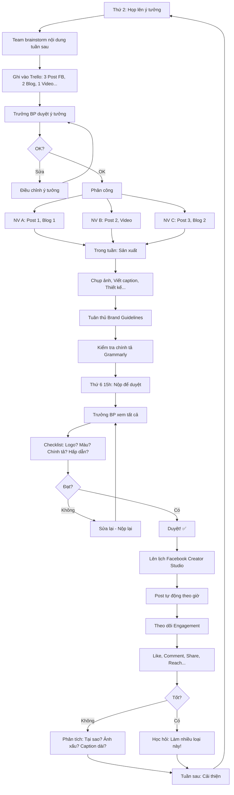

# SOP-03.2: QUẢN LÝ NỘI DUNG TRUYỀN THÔNG

## 1. THÔNG TIN QUY TRÌNH

| **Thuộc tính** | **Nội dung** |
|---|---|
| Mã SOP | SOP-03.2 |
| Tên quy trình | Quản lý nội dung truyền thông |
| Quy trình cha | SOP-03: Truyền thông - Marketing |
| Phiên bản | 1.0 |
| Tần suất | Liên tục (Hằng ngày/tuần) |

## 2. MỤC ĐÍCH

- **Nội dung chất lượng**: Hấp dẫn, Hữu ích, Đúng thương hiệu
- **Đồng bộ**: Tất cả kênh cùng tone, Cùng message
- **Hiệu quả**: Nội dung tạo Engagement cao, Lead nhiều
- **Bảo vệ thương hiệu**: Không có nội dung sai, Vi phạm

## 3. PHẠM VI ÁP DỤNG

Tất cả nội dung truyền thông (Facebook, Website, Email, Poster...)

## 4. NGUYÊN TẮC NỘI DUNG

### 4.1. Brand Guidelines (Hướng dẫn Thương hiệu)

```
╔══════════════════════════════════════════════════════════════════╗
║           BRAND GUIDELINES - IQ SCHOOL                          ║
╠══════════════════════════════════════════════════════════════════╣
║ 1. LOGO:                                                         ║
║    • Logo chính: [IQ SCHOOL] (Chữ to, Màu xanh #0066CC)          ║
║    • Slogan: "Nơi tài năng tỏa sáng" (Dưới logo)                 ║
║    • Kích thước tối thiểu: 2cm (In), 100px (Digital)             ║
║    • Không được: Méo logo, Đổi màu, Xoay...                      ║
╠══════════════════════════════════════════════════════════════════╣
║ 2. MÀU SẮC:                                                      ║
║    • Màu chính: Xanh IQ (#0066CC)                                ║
║    • Màu phụ: Vàng (#FFCC00), Trắng (#FFFFFF)                    ║
║    • Màu cấm: Đỏ, Đen (Trừ chữ)                                  ║
║                                                                  ║
║    Ý nghĩa:                                                      ║
║    • Xanh: Tin cậy, Chuyên nghiệp                                ║
║    • Vàng: Tươi sáng, Vui vẻ                                     ║
╠══════════════════════════════════════════════════════════════════╣
║ 3. FONT CHỮ:                                                     ║
║    • Tiêu đề: Montserrat Bold                                    ║
║    • Nội dung: Open Sans Regular                                 ║
║    • Không dùng: Times New Roman, Comic Sans...                  ║
╠══════════════════════════════════════════════════════════════════╣
║ 4. TONE & VOICE (Giọng điệu):                                    ║
║    • Thân thiện: "Chúng tôi", "Các em", "Quý vị"                 ║
║    • Tích cực: "Vui vẻ", "Hạnh phúc", "Tỏa sáng"                 ║
║    • Chuyên nghiệp: Ngôn ngữ chuẩn, Không lóng                   ║
║    • Tránh: Tiêu cực, Gây sợ hãi, Công kích đối thủ              ║
╠══════════════════════════════════════════════════════════════════╣
║ 5. HÌNH ẢNH:                                                     ║
║    • Chủ đề: HS vui vẻ, GV nhiệt tình, Cơ sở đẹp                 ║
║    • Chất lượng: Độ phân giải cao (≥1920×1080)                   ║
║    • Ánh sáng: Tươi sáng (Không tối, Ảm đạm!)                    ║
║    • Con người: Tự nhiên, Không dàn dựng quá!                    ║
║                                                                  ║
║    Cấm:                                                          ║
║    • Ảnh mờ, Xấu                                                 ║
║    • Ảnh vi phạm bản quyền (Lấy Google!)                         ║
║    • Ảnh HS không có sự đồng ý của PH                            ║
╠══════════════════════════════════════════════════════════════════╣
║ 6. VIDEO:                                                        ║
║    • Độ dài: 30s-3 phút (Ngắn gọn!)                              ║
║    • Chất lượng: ≥1080p                                          ║
║    • Âm thanh: Rõ ràng, Không ồn                                 ║
║    • Subtitle: Bắt buộc (Nhiều người xem không bật tiếng!)       ║
╚══════════════════════════════════════════════════════════════════╝
```

### 4.2. Quy trình sản xuất nội dung

```
╔══════════════════════════════════════════════════════════════════╗
║           QUY TRÌNH 5 BƯỚC                                      ║
╠══════════════════════════════════════════════════════════════════╣
║ BƯỚC 1: LÊN Ý TƯỞNG (Ideation)                                   ║
║  • Ai: Team Marketing (3 người)                                  ║
║  • Khi nào: Thứ 2 hằng tuần (9h-10h)                             ║
║  • Làm gì: Brainstorm ý tưởng nội dung tuần sau                  ║
║  • Tool: Trello (Ghi ý tưởng)                                    ║
║                                                                  ║
║  VD: Tuần 15-21/03:                                              ║
║  • Facebook (3 post):                                            ║
║    - Post 1: Ảnh HS học STEM (Wed)                               ║
║    - Post 2: Video GV chia sẻ (Fri)                              ║
║    - Post 3: Thông báo sự kiện 23/3 (Sun)                        ║
║  • Blog (2 bài):                                                 ║
║    - Bài 1: "5 cách dạy con học Toán"                            ║
║    - Bài 2: "Lợi ích của STEM"                                   ║
╠══════════════════════════════════════════════════════════════════╣
║ BƯỚC 2: LẬP KẾ HOẠCH (Planning)                                  ║
║  • Ai: Trưởng BP Truyền thông                                    ║
║  • Làm gì: Duyệt ý tưởng, Phân công                              ║
║  • Tool: Content Calendar (Google Sheet)                         ║
║                                                                  ║
║  VD:                                                             ║
║  • Post 1 (Ảnh STEM): Giao cho NV A (Chụp + Viết)                ║
║  • Post 2 (Video GV): Giao cho NV B (Quay + Edit)                ║
║  • Blog 1: Giao cho NV C (Viết)                                  ║
╠══════════════════════════════════════════════════════════════════╣
║ BƯỚC 3: SẢN XUẤT (Production)                                    ║
║  • Ai: NV được giao                                              ║
║  • Khi nào: Trong tuần (Deadline: Thứ 6)                         ║
║  • Làm gì:                                                       ║
║    - Chụp ảnh/Quay video                                         ║
║    - Viết caption/Bài blog                                       ║
║    - Thiết kế (Nếu cần)                                          ║
║                                                                  ║
║  QUY TẮC:                                                        ║
║  • Tuân thủ Brand Guidelines!                                    ║
║  • Kiểm tra chính tả (Grammarly)                                 ║
║  • Ảnh/Video chất lượng cao!                                     ║
╠══════════════════════════════════════════════════════════════════╣
║ BƯỚC 4: DUYỆT (Approval)                                         ║
║  • Ai: Trưởng BP Truyền thông                                    ║
║  • Khi nào: Thứ 6 (15h-17h)                                      ║
║  • Làm gì: Xem tất cả nội dung tuần sau                          ║
║                                                                  ║
║  CHECKLIST:                                                      ║
║  □ Đúng Brand Guidelines? (Logo, Màu, Font...)                   ║
║  □ Chính tả OK? (Không lỗi!)                                     ║
║  □ Message rõ ràng? (Người xem hiểu!)                            ║
║  □ Hấp dẫn? (Có thu hút không?)                                  ║
║  □ An toàn? (Không vi phạm pháp luật, Đạo đức...)                ║
║                                                                  ║
║  Nếu OK → Duyệt ✅                                               ║
║  Nếu không → Sửa lại!                                            ║
╠══════════════════════════════════════════════════════════════════╣
║ BƯỚC 5: XUẤT BẢN (Publishing)                                    ║
║  • Ai: NV Marketing                                              ║
║  • Khi nào: Theo lịch (Content Calendar)                         ║
║  • Tool: Facebook Creator Studio (Lên lịch tự động)              ║
║                                                                  ║
║  VD:                                                             ║
║  • Post 1: Thứ 4, 15/3, 9h                                       ║
║  • Post 2: Thứ 6, 17/3, 14h                                      ║
║  • Post 3: Chủ nhật, 19/3, 19h                                   ║
╚══════════════════════════════════════════════════════════════════╝
```

## 5. LOẠI NỘI DUNG

### 5.1. Facebook Post (3-5 post/tuần)

**A. Loại Post:**

```
╔══════════════════════════════════════════════════════════════════╗
║           5 LOẠI POST FACEBOOK                                  ║
╠══════════════════════════════════════════════════════════════════╣
║ 1. HOẠT ĐỘNG HỌC SINH (40%):                                     ║
║    • Album ảnh: HS học, Chơi, Ăn...                              ║
║    • Caption: "Giờ STEM - Các em làm Robot!"                     ║
║    • Mục đích: Cho PH thấy con vui vẻ!                           ║
║    • Tần suất: 2 post/tuần                                       ║
║                                                                  ║
║    Mẫu:                                                          ║
║    [Album 5 ảnh HS làm Robot]                                    ║
║    "🤖 GIỜ STEM HÔM NAY!                                         ║
║     Các em lớp 5A vừa hoàn thành Robot đầu tiên!                 ║
║     Nhìn các em vui quá! 😊                                      ║
║     #IQSchool #STEM #Robot"                                      ║
╠══════════════════════════════════════════════════════════════════╣
║ 2. THÀNH TÍCH (20%):                                             ║
║    • HS đạt giải, GV được tuyên dương...                         ║
║    • Caption: "Chúc mừng em A đạt Giải Nhì Toán!"                ║
║    • Mục đích: Chứng minh chất lượng!                            ║
║    • Tần suất: 1 post/tuần (Nếu có)                              ║
║                                                                  ║
║    Mẫu:                                                          ║
║    [Ảnh em A cầm giấy khen]                                      ║
║    "🏆 CHÚC MỪNG!                                                ║
║     Em Nguyễn Văn A - Lớp 5B                                     ║
║     Đạt Giải Nhì Olympic Toán cấp Quận!                          ║
║     Cô X và các bạn rất tự hào! 👏                               ║
║     #IQSchool #ThànhTích"                                        ║
╠══════════════════════════════════════════════════════════════════╣
║ 3. THÔNG BÁO - SỰ KIỆN (20%):                                    ║
║    • Sự kiện sắp diễn ra, Thông báo quan trọng...                ║
║    • Caption: "Ngày 23/3 - Open House!"                          ║
║    • Mục đích: Mời PH tham gia!                                  ║
║    • Tần suất: Khi cần                                           ║
║                                                                  ║
║    Mẫu:                                                          ║
║    [Poster sự kiện đẹp]                                          ║
║    "📢 THÔNG BÁO QUAN TRỌNG!                                     ║
║     NGÀY HỘI OPEN HOUSE                                          ║
║     🗓 Thứ 7, 23/03, 9h-12h                                      ║
║     📍 IQ School                                                 ║
║     🎁 Quà tặng + Ưu đãi đặc biệt!                               ║
║     👉 Đăng ký: [Link]                                           ║
║     #OpenHouse #TuyểnSinh"                                       ║
╠══════════════════════════════════════════════════════════════════╣
║ 4. NỘI DUNG HỮU ÍCH (15%):                                       ║
║    • Tips nuôi dạy con, Giáo dục...                              ║
║    • Caption: "5 cách dạy con học Toán hiệu quả"                 ║
║    • Mục đích: Giá trị cho PH → Theo dõi lâu dài!                ║
║    • Tần suất: 1 post/tuần                                       ║
║                                                                  ║
║    Mẫu:                                                          ║
║    [Infographic đẹp]                                             ║
║    "💡 5 CÁCH DẠY CON HỌC TOÁN HIỆU QUẢ:                         ║
║     1. Gắn với thực tế (Mua bán...)                              ║
║     2. Chơi game Toán                                            ║
║     3. Khen ngợi khi đúng                                        ║
║     4. Kiên nhẫn                                                 ║
║     5. Ôn tập đều đặn                                            ║
║     Quý vị thử nhé! 😊"                                          ║
╠══════════════════════════════════════════════════════════════════╣
║ 5. TƯƠNG TÁC (5%):                                               ║
║    • Hỏi đáp, Bình chọn...                                       ║
║    • Caption: "Quý vị muốn con học kỹ năng gì?"                  ║
║    • Mục đích: Tăng Engagement!                                  ║
║    • Tần suất: 1 post/2 tuần                                     ║
║                                                                  ║
║    Mẫu:                                                          ║
║    "❓ KHẢO SÁT:                                                 ║
║     Quý vị muốn con học kỹ năng gì?                              ║
║     A. Kỹ năng sống                                              ║
║     B. Coding                                                    ║
║     C. Tiếng Anh giao tiếp                                       ║
║     D. Thể thao                                                  ║
║     👉 Comment A/B/C/D nhé!"                                     ║
╚══════════════════════════════════════════════════════════════════╝
```

**B. Thời điểm đăng tốt nhất:**

```
Dựa trên Facebook Insights (IQ School):

• Thứ 2-5:
  - 9h: Tốt (PH đang rảnh - Mới đến công ty!)
  - 12h: TB (Giờ nghỉ trưa)
  - 19h-21h: Tốt nhất! (PH rảnh nhất!)

• Thứ 6:
  - 14h-16h: Tốt (PH hứng thú cuối tuần!)
  
• Thứ 7-CN:
  - 10h-12h: Tốt (PH nghỉ, Lên mạng nhiều!)
  - 19h-21h: Tốt

→ ƯU TIÊN: 19h-21h (Mọi ngày!)
```

### 5.2. Blog Post (2 bài/tuần)

**Cấu trúc Blog chuẩn SEO:**

```
═══════════════════════════════════════════════════════
    MẪU BLOG POST
═══════════════════════════════════════════════════════

TIÊU ĐỀ (Title):
"5 Cách Dạy Con Học Toán Hiệu Quả (PH Nên Biết!)"

→ Có số (5), Từ khóa (Dạy con học Toán), CTA (Nên biết!)

---

DESCRIPTION (160 ký tự):
"Toán khó? Con không thích? Thử 5 cách này! 
Đơn giản, Hiệu quả, PH nào cũng làm được!"

---

ẢNH NỔI BẬT:
[Ảnh đẹp: Con + PH học Toán vui vẻ]

---

NỘI DUNG:

1. MỞ BÀI (100 từ):
"Con bạn có sợ Toán không?
 Nhiều PH lo lắng con học Toán kém!
 Đừng lo! Hôm nay IQ School chia sẻ 5 cách đơn giản..."

2. NỘI DUNG (800 từ):

CÁCH 1: GẮN VỚI THỰC TẾ
"Toán không chỉ trên sách!
 VD: Đi chợ, Cho con tính tiền:
 '3 quả táo, 1 quả 10K, Tổng bao nhiêu?'
 → Con học mà không biết đang học! 😊"

[Ảnh minh họa]

CÁCH 2: CHƠI GAME TOÁN
"Tải app: 'Math Games for Kids'
 Con chơi 15 phút/ngày
 → Vừa vui, Vừa học!"

[Screenshot app]

CÁCH 3-5: ... (Tương tự)

3. KẾT BÀI (100 từ):
"5 cách trên rất đơn giản!
 PH thử ngay hôm nay!
 Con sẽ thích Toán hơn! 💙
 
 Chia sẻ nếu hữu ích!"

---

CTA (Call-to-Action):
[Nút: ĐĂNG KÝ TƯ VẤN MIỄN PHÍ]

---

TAGS:
#DạyConHọcToán #PhụHuynh #GiáoDục

---

LIÊN KẾT NỘI BỘ:
"Xem thêm: 
 • 10 Tips Nuôi Con Thông Minh
 • STEM Là Gì?"

═══════════════════════════════════════════════════════

KẾT QUẢ:
• Độ dài: 1000 từ (Tốt cho SEO!)
• Từ khóa: "Dạy con học Toán" (Xuất hiện 5 lần)
• Dễ đọc: Chia đoạn ngắn, Có ảnh
• CTA rõ ràng: Đăng ký tư vấn!
```

### 5.3. Video (1-2 video/tuần)

**Kịch bản Video mẫu:**

```
═══════════════════════════════════════════════════════
    KỊCH BẢN VIDEO: "MỘT NGÀY TẠI IQ SCHOOL"
    Độ dài: 2 phút
═══════════════════════════════════════════════════════

00:00-00:05: INTRO
[Cảnh: Logo IQ + Slogan]
Nhạc nền: Vui tươi
Text: "Một ngày tại IQ School"

00:05-00:20: SÁNG - ĐÓN HS
[Cảnh: HS vào cổng, GVCN chào]
Voiceover: "7h30 - Các em đến trường..."
[Cảnh: HS cười, Vẫy tay]

00:20-00:40: HỌC TRÊN LỚP
[Cảnh: HS học Toán, GV dạy nhiệt tình]
Voiceover: "9h - Giờ học bắt đầu..."
[Cảnh: HS giơ tay, Trả lời]

00:40-01:00: GIẢI LAO
[Cảnh: HS chơi sân trường, Vui vẻ]
Voiceover: "10h - Giờ ra chơi..."
[Cảnh: HS chạy nhảy, Cười]

01:00-01:20: ĂN TRƯA
[Cảnh: HS ăn, Đồ ăn ngon]
Voiceover: "11h30 - Bữa trưa..."
[Cảnh: HS ăn ngon miệng]

01:20-01:40: NGỦ TRƯA
[Cảnh: HS ngủ yên giấc]
Voiceover: "12h - Giờ ngủ trưa..."

01:40-01:55: CHIỀU - TAN HỌC
[Cảnh: PH đón, HS vẫy tay]
Voiceover: "16h30 - Tan học..."
[Cảnh: HS vui vẻ về nhà]

01:55-02:00: OUTRO
[Cảnh: Logo IQ]
Text: "IQ SCHOOL - NƠI TÀI NĂNG TỎA SÁNG"
"Đăng ký: 1900-xxxx"
"Website: iqschool.edu.vn"

═══════════════════════════════════════════════════════

SẢN XUẤT:
• Quay: 1 ngày (Thứ 4)
• Edit: 2 ngày (Thứ 5-6)
• Duyệt: Thứ 6
• Đăng: Chủ nhật, 19h

THIẾT BỊ:
• Camera: iPhone 14 (Đủ!)
• Micro: Rode (Âm thanh tốt)
• Edit: Adobe Premiere

CHI PHÍ: 0đ (Tự làm!)
```

## 6. LƯU ĐỒ QUY TRÌNH



## 7. BIỂU MẪU LIÊN QUAN

| **Mã** | **Tên** |
|---|---|
| QT07-CC01 | Content Calendar (Google Sheet) |
| QT07-BG01 | Brand Guidelines (PDF) |
| QT07-CL02 | Checklist duyệt nội dung |

## 8. TIÊU CHUẨN VÀ CHỈ TIÊU

| **Chỉ tiêu** | **Mục tiêu** |
|---|---|
| Tỷ lệ nội dung tuân thủ Brand Guidelines | 100% |
| Tỷ lệ nội dung được duyệt lần 1 | ≥80% |
| Facebook Engagement rate | ≥3% |
| Blog traffic | ≥1000 views/bài |
| Video views | ≥5000 views/video |

## 9. TRÁCH NHIỆM CỤ THỂ

| **Vai trò** | **Trách nhiệm** |
|---|---|
| **NV Marketing** | Sản xuất nội dung (Viết, Chụp, Quay...) |
| **Trưởng BP Truyền thông** | Duyệt nội dung, Đảm bảo chất lượng |
| **Designer** | Thiết kế (Poster, Infographic...) |
| **HT** | Duyệt nội dung nhạy cảm (Chính trị, Tôn giáo...) |

## 10. LƯU Ý QUAN TRỌNG

- ⚠️ **Chất lượng > Số lượng**: 3 post tốt > 10 post xấu!
- ✅ **Tuân thủ Brand Guidelines**: Đồng bộ → Chuyên nghiệp!
- 🔥 **Duyệt kỹ**: 1 post sai → Mất uy tín!
- ✅ **Học hỏi**: Post nào tốt → Làm nhiều hơn!

## 11. PHỤ LỤC

### 11.1. Content Calendar mẫu (1 tuần)

```
┌────────────────────────────────────────────────────────────────┐
│  CONTENT CALENDAR - TUẦN 15-21/03/2025                         │
├────────────────────────────────────────────────────────────────┤
│ THỨ HAI (15/3):                                                │
│  • Không đăng (Thứ 2 Engagement thấp!)                         │
├────────────────────────────────────────────────────────────────┤
│ THỨ BA (16/3):                                                 │
│  • 9h: Blog "5 Cách Dạy Con Học Toán"                          │
│    NV: C | Status: ✅ Đã duyệt                                │
├────────────────────────────────────────────────────────────────┤
│ THỨ TƯ (17/3):                                                 │
│  • 9h: Facebook Post 1 - Album ảnh STEM                        │
│    NV: A | Status: ✅ Đã duyệt | Scheduled: Creator Studio    │
├────────────────────────────────────────────────────────────────┤
│ THỨ NĂM (18/3):                                                │
│  • 14h: Blog "STEM Là Gì?"                                     │
│    NV: C | Status: ⏳ Đang viết                                │
├────────────────────────────────────────────────────────────────┤
│ THỨ SÁU (19/3):                                                │
│  • 14h: Facebook Post 2 - Video GV chia sẻ                     │
│    NV: B | Status: ⏳ Đang edit video                          │
├────────────────────────────────────────────────────────────────┤
│ THỨ BẢY (20/3):                                                │
│  • Không đăng                                                  │
├────────────────────────────────────────────────────────────────┤
│ CHỦ NHẬT (21/3):                                               │
│  • 19h: Facebook Post 3 - Thông báo sự kiện 23/3               │
│    NV: A | Status: ✅ Đã duyệt | Scheduled                    │
└────────────────────────────────────────────────────────────────┘
```

### 11.2. Những nội dung TUYỆT ĐỐI TRÁNH

```
❌ CẤM ĐĂNG:

1. CHÍNH TRỊ - TÔN GIÁO:
   • Không bình luận chính trị
   • Không đề cập tôn giáo (Trừ ngày Lễ chúc mừng chung!)

2. CÔNG KÍCH ĐỐI THỦ:
   • Không nói xấu trường khác
   • Không so sánh trực tiếp (VD: "Tốt hơn trường X!")

3. VI PHẠM PHÁP LUẬT:
   • Không ảnh HS không có sự đồng ý PH
   • Không ảnh vi phạm bản quyền
   • Không thông tin sai sự thật

4. TIÊU CỰC - GÂY SỢ HÃI:
   • Không: "Con không học tốt → Thất bại!"
   • Không: "Học phí rẻ vì trường khác quá đắt!"

5. NỘI DUNG KHÔNG LIÊN QUAN:
   • Không: Chuyện cá nhân NV
   • Không: Bán hàng (Trừ dịch vụ trường!)

VÍ DỤ SAI:
"Trường X học phí 7M - Quá đắt!
 IQ chỉ 5M - Rẻ hơn nhiều!"
→ SAI! (Công kích đối thủ!)

VÍ DỤ ĐÚNG:
"IQ School - Chất lượng quốc tế, Học phí hợp lý chỉ 5M!"
→ ĐÚNG! (Nhấn mạnh mình, Không nói đối thủ!)
```

### 11.3. KPI theo loại nội dung

```
┌────────────────────────────────────────────────────┐
│  KPI THEO LOẠI NỘI DUNG                            │
├────────────────────────────────────────────────────┤
│ FACEBOOK POST:                                     │
│ • Hoạt động HS: Reach 2K, Engagement 3%            │
│ • Thành tích: Reach 3K, Engagement 5% (Cao!)       │
│ • Thông báo: Reach 5K, Engagement 2%               │
│ • Nội dung hữu ích: Reach 1K, Engagement 4%        │
│ • Tương tác: Reach 500, Engagement 10% (Rất cao!)  │
├────────────────────────────────────────────────────┤
│ BLOG:                                              │
│ • Views: 1000/bài                                  │
│ • Time on page: ≥2 phút                            │
│ • Bounce rate: ≤50%                                │
├────────────────────────────────────────────────────┤
│ VIDEO:                                             │
│ • Views: 5000/video                                │
│ • Watch time: ≥50% (Xem ≥50% video)                │
│ • Share: ≥50 lần                                   │
└────────────────────────────────────────────────────┘
```

## 12. FAQ

**Q1: Đăng bao nhiêu post/ngày là đủ?**  
A: 
- Facebook: 1 post/ngày (Hoặc 3-5 post/tuần)
- Quá nhiều → PH chán! (Spam!)
- Quá ít → PH quên!

**Q2: Nội dung không Engagement. Tại sao?**  
A: Kiểm tra:
- Giờ đăng: Sai giờ? (Đăng 3h sáng → Ít người xem!)
- Nội dung: Nhàm chán? Không hấp dẫn?
- Ảnh: Xấu? Mờ?
- Caption: Dài? Khó hiểu?

**Q3: Có nên dùng ảnh stock (Ảnh có sẵn trên mạng)?**  
A: TỐT NHẤT KHÔNG!
- Ảnh thật (Của trường) → Chân thực, Tin cậy!
- Ảnh stock → Giả tạo, Không đúng thực tế!
- Nếu dùng → Ghi rõ nguồn (Tránh vi phạm bản quyền!)

---

**PHÊ DUYỆT**

| NV Marketing | Trưởng BP TT | Phó HT |
|---|---|---|
| [Họ tên] | [Họ tên] | [Họ tên] |
