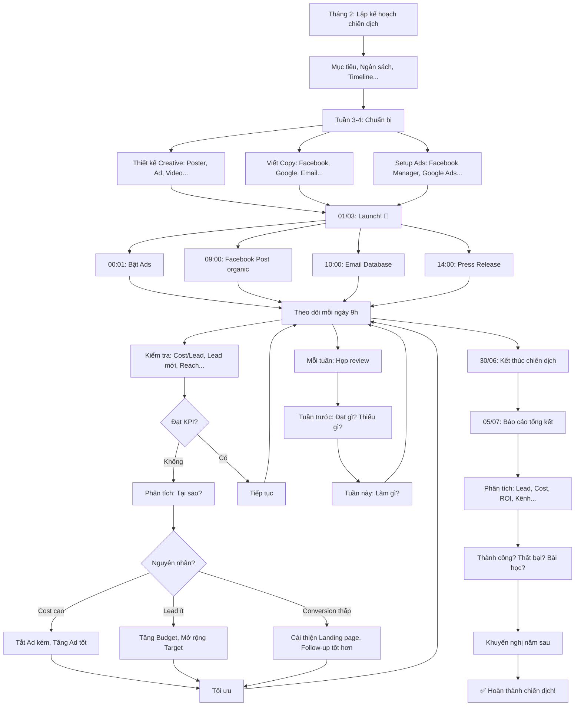

# SOP-03.3: THỰC HIỆN CHIẾN DỊCH MARKETING

## 1. THÔNG TIN QUY TRÌNH

| **Thuộc tính** | **Nội dung** |
|---|---|
| Mã SOP | SOP-03.3 |
| Tên quy trình | Thực hiện chiến dịch marketing |
| Quy trình cha | SOP-03: Truyền thông - Marketing |
| Phiên bản | 1.0 |
| Tần suất | Theo chiến dịch (3-6 chiến dịch/năm) |

## 2. MỤC ĐÍCH

- **Tuyển sinh hiệu quả**: Chiến dịch → Lead → HS mới
- **Xây dựng thương hiệu**: Nhận diện cao, Uy tín tốt
- **ROI cao**: Chi ít, Thu nhiều
- **Học hỏi**: Mỗi chiến dịch → Bài học kinh nghiệm

## 3. PHẠM VI ÁP DỤNG

Tất cả chiến dịch marketing (Online + Offline)

## 4. LOẠI CHIẾN DỊCH

### 4.1. Phân loại theo mục tiêu

```
╔══════════════════════════════════════════════════════════════════╗
║           4 LOẠI CHIẾN DỊCH                                     ║
╠══════════════════════════════════════════════════════════════════╣
║ 1. CHIẾN DỊCH TUYỂN SINH (Cao điểm: Tháng 3-6):                 ║
║    • Mục tiêu: Tuyển 150 HS                                      ║
║    • Ngân sách: 150M/năm (75%)                                   ║
║    • Kênh: Facebook Ads, Google Ads, Sự kiện...                  ║
║    • KPI: 600 Lead, Conversion 25% (150 HS)                      ║
╠══════════════════════════════════════════════════════════════════╣
║ 2. CHIẾN DỊCH BRAND AWARENESS (Quanh năm):                       ║
║    • Mục tiêu: 50% PH (5km) biết IQ School                       ║
║    • Ngân sách: 30M/năm (15%)                                    ║
║    • Kênh: Facebook organic, PR, Poster...                       ║
║    • KPI: Reach 100K người/năm                                   ║
╠══════════════════════════════════════════════════════════════════╣
║ 3. CHIẾN DỊCH SỰ KIỆN (3-4 lần/năm):                            ║
║    • Mục tiêu: Tạo trải nghiệm, Thu Lead                         ║
║    • Ngân sách: 15M/năm (7.5%)                                   ║
║    • Kênh: Sự kiện offline (Open House, Hội diễn...)             ║
║    • KPI: 500 PH tham gia, 150 Lead                              ║
╠══════════════════════════════════════════════════════════════════╣
║ 4. CHIẾN DỊCH RETENTION (Giữ chân - Quanh năm):                  ║
║    • Mục tiêu: Giữ PH hiện tại, Giảm Churn                       ║
║    • Ngân sách: 5M/năm (2.5%)                                    ║
║    • Kênh: Email, App, Loyalty program...                        ║
║    • KPI: Churn ≤5%                                              ║
╚══════════════════════════════════════════════════════════════════╝
```

## 5. QUY TRÌNH THỰC HIỆN CHIẾN DỊCH

### 5.1. Ví dụ: Chiến dịch Tuyển sinh Tháng 3-6/2025

**BƯỚC 1: Lập kế hoạch chiến dịch (Tháng 2)**

```
═══════════════════════════════════════════════════════
    KẾ HOẠCH CHIẾN DỊCH: TUYỂN SINH CAO ĐIỂM 2025
    Mã: CD-TS-2025-Q2
═══════════════════════════════════════════════════════

I. THÔNG TIN CHUNG:
• Tên: "Chiến dịch Tuyển sinh Cao điểm Q2/2025"
• Thời gian: 01/03 - 30/06/2025 (4 tháng)
• Ngân sách: ...
• Người chịu trách nhiệm: Trưởng BP Truyền thông

II. MỤC TIÊU SMART:
• Tuyển: ... 
• Lead: ...
• Cost/Lead: ...
• Cost/HS: ...
• Brand awareness: ...
Chỉ tiêu do quản lý phê duyệt theo tháng

III. ĐỐI TƯỢNG:
• 3 Persona: Bà Nguyễn (40%), Ông Trần (30%), Bà Lê (30%)
• Khu vực: 5km quanh trường
• Độ tuổi con: 3-12 tuổi

IV. MESSAGE:
• Slogan: "TUYỂN SINH 2025 - ƯU ĐÃI ĐẶC BIỆT!"
• 3 thông điệp:
  1. Chất lượng quốc tế - Học phí 5M
  2. Giảm 10% (Đăng ký trước 31/3)
  3. Tặng Balo + Đồ dùng 500K

V. CHIẾN THUẬT (4P):

A. PRODUCT (Sản phẩm):
• Chương trình song ngữ
• GV 100% chứng chỉ quốc tế
• Cơ sở hiện đại

B. PRICE (Giá):
• Học phí: Theo bảng học phí được duyệt
• Ưu đãi: Giảm 10% (Đăng ký sớm)
• So với thị trường: Học phí minh bạch, nhiều lựa chọn đóng phí & ưu đãi theo thời điểm

C. PLACE (Phân phối):
• Đăng ký: Online (Website, App, Facebook) 70%
• Đăng ký: Offline (Trực tiếp) 30%

D. PROMOTION (Quảng bá):
• Facebook Ads: 60M (50%)
• Google Ads: 30M (25%)
• Sự kiện: 20M (17%)
• PR: 10M (8%)

VI. TIMELINE: 
T-Theo sự kiện/đợt (T-4 tuần, T-3 tuần,...)
THÁNG 3 (Khởi động):
• Tuần 1: Launch chiến dịch (Facebook, Google Ads)
• Tuần 2: PR (5 bài báo)
• Tuần 3: Sự kiện 1 (23/3 - Open House)
• Tuần 4: Tăng Ads (Chốt ưu đãi 31/3!)

THÁNG 4 (Cao điểm):
• Tuần 1-4: Chạy Ads mạnh (8M/tuần)
• Tuần 2: Sự kiện 2 (13/4)
• Tuần 4: Sự kiện 3 (27/4)

THÁNG 5-6 (Duy trì):
• Giảm Ads (5M/tháng)
• Focus: Chốt Lead cũ

VII. KPI CHI TIẾT:

| Tháng | Lead | HS đăng ký | Chi phí | Cost/HS |
|-------|------|------------|---------|---------|
| 3 | 200 | 50 | 40M | 800K |
| 4 | 200 | 50 | 50M | 1M |
| 5 | 60 | 15 | 20M | 1.3M |
| 6 | 40 | 5 | 10M | 2M |
| Tổng | 500 | 120 | 120M | 1M ✅ |

VIII. ĐỘI NGŨ:
• Trưởng BP TT: Điều phối chung
• NV Marketing (2): Chạy Ads, Content
• Designer: Thiết kế
• BP Tuyển sinh (3): Tư vấn, Chốt Lead

IX. RỦI RO & GIẢI PHÁP:
• Rủi ro 1: Facebook cấm Ads (Vi phạm chính sách)
  → Giải pháp: Backup Google Ads (Tăng 20M)
  
• Rủi ro 2: Đối thủ cũng chạy Ads mạnh
  → Giải pháp: Nhấn mạnh USP (Chất lượng + Giá tốt!)
  
• Rủi ro 3: Sự kiện ít người tham gia (Mưa, Covid...)
  → Giải pháp: Online event (Zoom)

Trưởng BP TT ký: __________
HT duyệt: __________
Ngày: 15/02/2025
═══════════════════════════════════════════════════════
```

**BƯỚC 2: Chuẩn bị (Tuần 3-4 tháng 2)**

**A. Thiết kế Creative:**

```
THIẾT KẾ 1: POSTER SỰ KIỆN

┌─────────────────────────────────────┐
│  [Logo IQ School]                   │
│                                     │
│  🎉 NGÀY HỘI OPEN HOUSE 🎉          │
│                                     │
│  📅 Thứ 7, 23/03/2025               │
│  ⏰ 9:00 - 12:00                    │
│  📍 IQ School, 123 Đường X          │
│                                     │
│  ✅ Tham quan trường                │
│  ✅ Tư vấn 1-1                      │
│  ✅ Quà tặng 500K                   │
│  ✅ Ưu đãi: GIẢM 10%!               │
│     (Chỉ hôm nay!)                  │
│                                     │
│  👉 ĐĂNG KÝ NGAY!                   │
│  📞 1900-xxxx                       │
│  🌐 iqschool.edu.vn                 │
│                                     │
│  [QR Code]                          │
└─────────────────────────────────────┘

Màu: Xanh #0066CC (Chủ đạo), Vàng #FFCC00
Font: Montserrat Bold
Kích thước: A3 (In), 1080×1080 (Facebook)
```

**B. Viết Ad Copy:**

```
FACEBOOK AD (Mẫu 1):

TIÊU ĐỀ:
"TUYỂN SINH 2025 - ƯU ĐÃI ĐẶC BIỆT!"

HÌNH ẢNH:
[Ảnh đẹp: HS vui vẻ trong lớp]

NỘI DUNG:
"🎓 Con bạn lên lớp 1 năm nay?

IQ SCHOOL - Lựa chọn của 500 Phụ huynh!

✅ Chất lượng quốc tế
  • GV 100% chứng chỉ (IELTS, TOEFL...)
  • Chương trình song ngữ Cambridge
  • Cơ sở hiện đại (Xây 2023!)

✅ Học phí hợp lý: CHỈ 5M/năm
  (Rẻ hơn trường cùng chất lượng 30%!)

🎁 ƯU ĐÃI ĐẶC BIỆT (Đến 31/3):
💰 GIẢM 10% học phí (Đăng ký sớm!)
🎒 TẶNG Balo + Đồ dùng (500K!)

📢 Số lượng CÓ HẠN - Chỉ 150 chỗ!

👉 ĐĂNG KÝ TƯ VẤN NGAY:
📞 Hotline: 1900-xxxx
🌐 Hoặc CLICK 'ĐĂNG KÝ' bên dưới!

Nhanh tay kẻo hết chỗ! ⏰"

[Nút CTA: ĐĂNG KÝ TƯ VẤN MIỄN PHÍ]

TARGET:
• Giới tính: Nữ (70%), Nam (30%)
• Tuổi: 28-45
• Địa điểm: 10km quanh trường
• Sở thích: Giáo dục, Gia đình...

BUDGET: 2000đ/ngày/người (CPM)
KỲ VỌNG: Cost/Lead ≤200K
```

**C. Setup Ads:**

```
FACEBOOK ADS MANAGER:

CAMPAIGN:
• Mục tiêu: Lead generation
• Tên: "TS2025-Q2-Lead"
• Budget: 60M (Tháng 3-6)

AD SET 1: "PH Nữ 28-35 - Quận X,Y"
• Target: Nữ, 28-35, Quận X,Y
• Placement: Facebook + Instagram Feed
• Budget: 1.5M/ngày (Tháng 3-4)

AD SET 2: "PH Nữ 36-45 - Quận X,Y"
• Target: Nữ, 36-45, Quận X,Y
• Budget: 1M/ngày

AD SET 3: "PH Nam 35-45 - Doanh nhân"
• Target: Nam, 35-45, Job title: CEO, Manager...
• Budget: 0.5M/ngày

CREATIVE:
• Ad 1: Ảnh HS vui vẻ + Copy (Mẫu 1)
• Ad 2: Video "Một ngày tại IQ" + Copy ngắn
• Ad 3: Carousel (5 ảnh: Cơ sở, GV, HS...)

LEAD FORM:
Câu hỏi:
1. Họ tên PH: _______________
2. SĐT: _______________
3. Email: _______________
4. Con học lớp: [Chọn: MN/1/2...]
5. Khu vực: [Chọn: Quận X/Y...]

→ Submit → Dữ liệu tự động vào CRM!
```

**BƯỚC 3: Triển khai (01/03 - 30/06)**

**Ngày 01/03 (Ngày G - Launch!):**

```
00:01 - Launch Facebook Ads (3 Ad Sets)
→ Theo dõi: 1h/lần (6h đầu)

09:00 - Đăng Facebook Post:
"🎉 CHÍNH THỨC KHỞI ĐỘNG TUYỂN SINH 2025!
 Ưu đãi đặc biệt: GIẢM 10% (Đến 31/3!)
 Đăng ký ngay: [Link]"

10:00 - Gửi Email cho Database (2000 Lead cũ):
"Chào quý vị,
 Tuyển sinh 2025 đã mở!
 Ưu đãi sớm: Giảm 10%!
 [Link đăng ký]"

14:00 - Phát Press Release (5 báo):
"IQ School chính thức tuyển sinh 2025..."

15:00 - Kiểm tra Ads:
• Đã chạy? ✅
• Cost/Lead? 180K ✅ (Tốt!)
• Lead? 5 Lead (3h đầu) ✅

→ Tiếp tục theo dõi!
```

**Tuần 1-12 (Trong chiến dịch):**

```
MỖI NGÀY:
• 9h: Kiểm tra Ads (Cost/Lead, Lead mới...)
• 10h: Follow-up Lead mới (Gọi điện, Email)
• 14h: Đăng Facebook Post (Organic)
• 16h: Tổng hợp Lead ngày (Báo cáo)

MỖI TUẦN:
• Thứ 2: Họp review tuần trước
  - Đạt KPI? (Lead, Cost...)
  - Vấn đề? (Ads bị từ chối, Cost cao...)
  - Kế hoạch tuần này?
  
• Thứ 6: Chuẩn bị tuần sau
  - Creative mới (Nếu cũ kém hiệu quả)
  - Điều chỉnh Budget (Tăng/Giảm)

MỖI THÁNG:
• Ngày 5: Báo cáo tháng trước
• Ngày 10: Review + Điều chỉnh
```

**BƯỚC 4: Tối ưu (Liên tục)**

chỉ đánh giá khi đạt ngưỡng chi tiêu/hiển thị; nếu cao hơn mục tiêu 20–30% trong 2–3 ngày → giảm ngân sách/đổi creative; nêu rõ tiêu chí CTR/CPM để xác định lỗi hook/target

```
TÌNH HUỐNG 1: Cost/Lead cao (350K - Mục tiêu ≤240K!)

PHÂN TÍCH:
• Ad 1 (Ảnh): Cost/Lead 180K ✅ Tốt!
• Ad 2 (Video): Cost/Lead 400K ❌ Cao!
• Ad 3 (Carousel): Cost/Lead 600K ❌ Rất cao!

HÀNH ĐỘNG:
• TẮT Ad 3 ngay! (Không hiệu quả!)
• Giảm Budget Ad 2 (50%)
• Tăng Budget Ad 1 (100%) → Tận dụng Ad tốt!

KẾT QUẢ:
• Cost/Lead tuần sau: 220K ✅ (Đã cải thiện!)

───────────────────────────────────────────────────

TÌNH HUỐNG 2: Lead ít (Tuần 1: Chỉ 30 Lead, Mục tiêu 50!)

PHÂN TÍCH:
• Lý do: Ít người thấy Ads (Reach thấp!)

HÀNH ĐỘNG:
• Tăng Budget: 1.5M → 2.5M/ngày (+67%!)
• Mở rộng Target: Thêm Quận Z
• Chạy thêm kênh: Google Ads (Backup!)

KẾT QUẢ:
• Tuần 2: 55 Lead ✅ (Đã đạt!)
```

**BƯỚC 5: Đo lường & Báo cáo (Cuối chiến dịch - 05/07)**

```
═══════════════════════════════════════════════════════
    BÁO CÁO CHIẾN DỊCH: TUYỂN SINH Q2/2025
    Ngày: 05/07/2025
═══════════════════════════════════════════════════════

I. TỔNG QUAN:
• Thời gian: 01/03 - 30/06 (4 tháng)
• Ngân sách: 120M
• Kết quả: 125 HS đăng ký (104% mục tiêu 120 HS!) ✅

II. CHI TIẾT:

A. LEAD:
• Tổng Lead: 520 (Mục tiêu: 500) ✅
• Nguồn:
  - Facebook Ads: 350 Lead (67%)
  - Google Ads: 100 Lead (19%)
  - Sự kiện: 50 Lead (10%)
  - Khác: 20 Lead (4%)

B. CONVERSION:
• Lead → Đăng ký: 125/520 = 24% ✅
  (Mục tiêu: 24%)

C. CHI PHÍ:
• Tổng chi: ...
• Cost/Lead: ...
  (Mục tiêu: ...)
• Cost/HS: ...
  (Mục tiêu: ...)

D. ROI:
• Thu (.......): ......
• Chi: ...
• Lãi: ...
• ROI = ... 
  (Mục tiêu: ..)

III. PHÂN TÍCH KÊNH: 
(Kênh nào hiệu quả hơn thì tập trung kênh đó)

| Kênh | Chi phí | Lead | Cost/Lead | Conversion | HS | Cost/HS |
|------|---------|------|-----------|------------|----|---------|
| Facebook | 60M | 350 | 171K | 25% | 88 | 682K ✅ |
| Google | 30M | 100 | 300K | 20% | 20 | 1.5M ⚠️ |
| Sự kiện | 20M | 50 | 400K | 30% | 15 | 1.3M ⚠️ |
| PR | 10M | 20 | 500K | 10% | 2 | 5M ❌ |

KẾT LUẬN:
• Facebook: Hiệu quả nhất! ✅
• Google: TB (Cost cao hơn!)
• Sự kiện: Conversion cao, Nhưng Cost cao!
• PR: Kém! (Không tập trung năm sau!)

IV. THÀNH CÔNG:
✅ Đạt 104% mục tiêu HS!
✅ Cost/HS thấp (960K - Tốt!)
✅ ROI cao (5.2 - Xuất sắc!)
✅ Facebook Ads hiệu quả!

V. THẤT BẠI:
❌ PR kém (2 HS, Cost 5M/HS!)
❌ Google Ads chưa tốt (Cost/Lead 300K - Cao!)

VI. BÀI HỌC:
• Tập trung Facebook! (Kênh tốt nhất!)
• Cắt giảm PR (Không hiệu quả!)
• Cải thiện Google (Thuê chuyên gia?)
• Sự kiện OK (Duy trì!)

VII. KHUYẾN NGHỊ 2026:
• Tăng ngân sách Facebook: 60M → 80M (+33%)
• Giảm PR: 10M → 3M (-70%)
• Google: Thuê Agency (Tối ưu tốt hơn!)
• Sự kiện: Giữ nguyên 20M

Trưởng BP TT ký: __________
HT duyệt: __________
═══════════════════════════════════════════════════════
```

## 6. LƯU ĐỒ QUY TRÌNH



## 7. BIỂU MẪU LIÊN QUAN

| **Mã** | **Tên** |
|---|---|
| QT07-CD01 | Kế hoạch chiến dịch (Chi tiết) |
| QT07-BC07 | Báo cáo chiến dịch (Tổng kết) |
| QT07-CR02 | Creative (Ảnh, Video, Copy...) |

## 8. TIÊU CHUẨN VÀ CHỈ TIÊU

| **Chỉ tiêu** | **Mục tiêu** |
|---|---|
| Tỷ lệ đạt mục tiêu chiến dịch | ≥90% |
| ROI chiến dịch | ≥3 |
| Cost/Lead | ≤250K |
| Conversion (Lead → HS) | ≥20% |

## 9. TRÁCH NHIỆM CỤ THỂ

| **Vai trò** | **Trách nhiệm** |
|---|---|
| **Trưởng BP Truyền thông** | Lập kế hoạch, Điều phối, Báo cáo |
| **NV Marketing** | Chạy Ads, Tối ưu, Theo dõi hằng ngày |
| **Designer** | Thiết kế Creative |
| **BP Tuyển sinh** | Follow-up Lead, Chốt đăng ký |

## 10. LƯU Ý QUAN TRỌNG

- ⚠️ **Chuẩn bị kỹ**: 80% thành công nằm ở chuẩn bị!
- ✅ **Theo dõi chặt**: Mỗi ngày! (Phát hiện vấn đề sớm!)
- 🔥 **Tối ưu liên tục**: Không để Ads chạy tự động!
- ✅ **Học hỏi**: Mỗi chiến dịch → Bài học kinh nghiệm!

## 11. PHỤ LỤC

### 11.1. Checklist chuẩn bị chiến dịch

```
□ Kế hoạch chi tiết (QT07-CD01) - BGH ký?
□ Ngân sách phê duyệt?
□ Creative thiết kế xong? (Ảnh, Video, Poster...)
□ Copy viết xong? (Facebook, Google, Email...)
□ Ads setup xong? (Facebook Manager, Google Ads...)
□ Landing page sẵn sàng? (Form đăng ký OK?)
□ CRM tích hợp? (Lead tự động vào CRM?)
□ Team briefing? (Mọi người hiểu vai trò?)
□ Backup plan? (Nếu Ads bị cấm, Làm gì?)
□ KPI rõ ràng? (Mọi người biết đích đến?)
□ Tool theo dõi? (Dashboard, Báo cáo...)
```

### 11.2. Dashboard theo dõi chiến dịch (Real-time)

```
┌────────────────────────────────────────────────────────┐
│  DASHBOARD CHIẾN DỊCH TS-2025-Q2                       │
│  Cập nhật: 15/03/2025, 10:00                           │
├────────────────────────────────────────────────────────┤
│ TỔNG QUAN (15 NGÀY ĐẦU):                              │
│ • Ngân sách: 15M/120M (12.5%)                          │
│ • Lead: 75/500 (15%)                                   │
│ • HS đăng ký: 18/120 (15%)                             │
│ • On track! ✅                                         │
├────────────────────────────────────────────────────────┤
│ HÔM NAY (15/03):                                       │
│ • Chi phí: 2.2M                                        │
│ • Lead: 11 (Tốt!)                                      │
│ • Cost/Lead: 200K ✅                                   │
├────────────────────────────────────────────────────────┤
│ FACEBOOK ADS:                                          │
│ • Spend: 10M/60M (17%)                                 │
│ • Reach: 50K                                           │
│ • Lead: 50 (67% tổng Lead)                             │
│ • Cost/Lead: 200K ✅                                   │
│ • Top Ad: Ad 1 (Ảnh HS) - Cost 180K ✅               │
├────────────────────────────────────────────────────────┤
│ GOOGLE ADS:                                            │
│ • Spend: 3M/30M (10%)                                  │
│ • Lead: 15 (20% tổng Lead)                             │
│ • Cost/Lead: 200K ✅                                   │
├────────────────────────────────────────────────────────┤
│ SỰ KIỆN (23/03):                                       │
│ • Đăng ký: 120/200 (60%)                               │
│ • Còn 8 ngày! Cần 80 người nữa!                        │
├────────────────────────────────────────────────────────┤
│ CẢNH BÁO:                                              │
│ • Không có! All good! ✅                               │
└────────────────────────────────────────────────────────┘
```

### 11.3. Xử lý tình huống khẩn cấp

```
═══════════════════════════════════════════════════════
    TÌNH HUỐNG KHẨN CẤP
═══════════════════════════════════════════════════════

TÌNH HUỐNG 1: FACEBOOK CẤM ADS (Vi phạm chính sách!)

NGUYÊN NHÂN:
• Dùng từ cấm: "Tốt nhất", "Đảm bảo 100%"...
• Ảnh: Có logo của trường khác (Sai!)
• Landing page: Lỗi, Không mở được

HÀNH ĐỘNG NGAY (TRONG 2H!):
1. Tắt Ads ngay!
2. Sửa: Bỏ từ cấm, Đổi ảnh, Fix Landing page
3. Appeal (Kháng cáo) với Facebook
4. Trong khi chờ: Chuyển ngân sách sang Google Ads!

KẾT QUẢ:
• 2-3 ngày sau: Facebook duyệt lại ✅
• Không mất nhiều Lead! (Vì đã có Google backup!)

───────────────────────────────────────────────────

TÌNH HUỐNG 2: ĐỐI THỦ CÔNG KÍCH (Nói xấu trên Facebook!)

NỘI DUNG:
"Trường X (Đối thủ) Post:
 'IQ School chất lượng kém, GV yếu!
  Quý vị đừng cho con học!'"

HÀNH ĐỘNG:
1. KHÔNG đáp trả công kích! (Mất hình ảnh!)
2. Gửi công văn yêu cầu gỡ (Trong 24h)
3. Nếu không gỡ → Kiện!
4. Đồng thời: Post Facebook (Chứng minh chất lượng):
   "IQ School - 500 PH tin tưởng!
    NPS 7.2/10 - PH hài lòng!
    HS đạt giải Toán cấp Quận!
    [Ảnh chứng minh...]"

───────────────────────────────────────────────────

TÌNH HUỐNG 3: COVID QUAY LẠI (Đóng cửa trường!)

HÀNH ĐỘNG:
1. Dừng Ads offline (Sự kiện...)
2. Tăng Ads online (Facebook, Google...)
3. Sự kiện → Online (Zoom)
4. Thay Message: "Học online chất lượng!"

═══════════════════════════════════════════════════════
```

## 12. FAQ

**Q1: Chiến dịch không đạt mục tiêu (Chỉ 80 HS, Mục tiêu 120). Xử lý?**  
A: 
- Phân tích: Tại sao? (Lead ít? Conversion thấp? Cost cao?)
- Kéo dài chiến dịch (Thêm 1-2 tháng)
- Tăng ngân sách (Nếu ROI vẫn tốt!)
- Giảm chỉ tiêu (Năm sau thực tế hơn!)

**Q2: Có nên copy chiến dịch của đối thủ không?**  
A: 
- HỌC, nhưng KHÔNG copy nguyên si!
- Học ý tưởng → Điều chỉnh cho phù hợp trường mình!
- Sáng tạo riêng → Khác biệt!

**Q3: Chiến dịch thành công (ROI 5.2!). Có nên làm y hệt năm sau không?**  
A: KHÔNG!
- Thị trường thay đổi (Đối thủ học hỏi, Giá tăng...)
- Cải tiến: Học bài học → Làm tốt hơn!
- Thử nghiệm: Test kênh mới, Creative mới...

---

**PHÊ DUYỆT**

| Trưởng BP TT | Phó HT | Hiệu trưởng |
|---|---|---|
| [Họ tên] | [Họ tên] | [Họ tên] |
