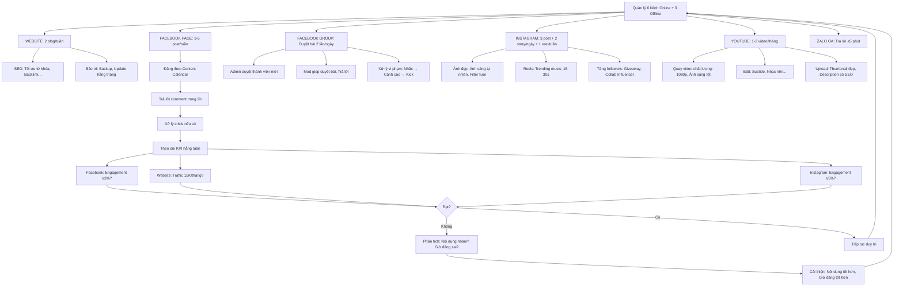

# SOP-03.4: QUẢN LÝ KÊNH TRUYỀN THÔNG

## 1. THÔNG TIN QUY TRÌNH

| **Thuộc tính** | **Nội dung** |
|---|---|
| Mã SOP | SOP-03.4 |
| Tên quy trình | Quản lý kênh truyền thông |
| Quy trình cha | SOP-03: Truyền thông - Marketing |
| Phiên bản | 1.0 |
| Tần suất | Liên tục (Quản lý hằng ngày) |

## 2. MỤC ĐÍCH

- **Hiện diện đồng bộ**: Mọi kênh cùng hoạt động, Cùng message
- **Tối ưu từng kênh**: Phát huy thế mạnh riêng
- **Tăng Engagement**: Tương tác cao, Community mạnh
- **Bảo vệ thương hiệu**: Crisis management kịp thời

## 3. PHẠM VI ÁP DỤNG

Tất cả kênh truyền thông (Online + Offline)

## 4. HỆ THỐNG KÊNH

### 4.1. Kênh Online (6 kênh chính)

```
╔══════════════════════════════════════════════════════════════════╗
║           6 KÊNH ONLINE                                         ║
╠══════════════════════════════════════════════════════════════════╣
║ 1. WEBSITE (iqschool.edu.vn):                                    ║
║    • Vai trò: Trung tâm thông tin, Hub chính                     ║
║    • Mục tiêu: 15K visitors/tháng                                ║
║    • Nội dung: Giới thiệu trường, Blog, Tuyển sinh...            ║
║    • Cập nhật: 2 blog/tuần, Thông báo khi cần                    ║
║    • KPI: Bounce rate ≤50%, Time on site ≥2 phút                 ║
╠══════════════════════════════════════════════════════════════════╣
║ 2. FACEBOOK PAGE (fb.com/iqschool):                              ║
║    • Vai trò: Kênh chính tương tác PH                            ║
║    • Followers: 20K (Mục tiêu 2025)                              ║
║    • Nội dung: Ảnh/Video HS, Thông báo, Tips...                  ║
║    • Đăng: 3-5 post/tuần                                         ║
║    • KPI: Engagement rate ≥3%, Reach ≥10K/post                   ║
╠══════════════════════════════════════════════════════════════════╣
║ 3. FACEBOOK GROUP (Nhóm PH IQ School):                           ║
║    • Vai trò: Cộng đồng PH                                       ║
║    • Thành viên: 400/500 PH (80%)                                ║
║    • Nội dung: PH hỏi đáp, Chia sẻ...                            ║
║    • Quản trị: 1 Admin (BP Quan hệ PH) + 3 Mod (PH)              ║
║    • KPI: 50 post/ngày, 200 comment/ngày                         ║
╠══════════════════════════════════════════════════════════════════╣
║ 4. INSTAGRAM (@iqschool):                                        ║
║    • Vai trò: Ảnh đẹp, Video ngắn                                ║
║    • Followers: 5K (Mục tiêu 2025)                               ║
║    • Nội dung: Ảnh HS, Cơ sở, Reels...                           ║
║    • Đăng: 3-4 post/tuần, 2 Stories/ngày                         ║
║    • KPI: Engagement rate ≥5%                                    ║
╠══════════════════════════════════════════════════════════════════╣
║ 5. YOUTUBE (IQ School Channel):                                  ║
║    • Vai trò: Video dài, Giới thiệu chi tiết                     ║
║    • Subscribers: 2K (Mục tiêu 2025)                             ║
║    • Nội dung: Tour trường, Sự kiện, Hướng dẫn...                ║
║    • Đăng: 1-2 video/tháng                                       ║
║    • KPI: 10K views/video                                        ║
╠══════════════════════════════════════════════════════════════════╣
║ 6. ZALO OA (Zalo Official Account):                              ║
║    • Vai trò: Tư vấn trực tiếp, Thông báo nhanh                  ║
║    • Followers: 3K                                               ║
║    • Nội dung: Thông báo, Trả lời tự động...                     ║
║    • KPI: Response time ≤5 phút                                  ║
╚══════════════════════════════════════════════════════════════════╝
```

### 4.2. Kênh Offline (3 kênh)

```
╔══════════════════════════════════════════════════════════════════╗
║           3 KÊNH OFFLINE                                        ║
╠══════════════════════════════════════════════════════════════════╣
║ 1. POSTER, BANNER (Bán kính 5km):                                ║
║    • Vị trí: 50 chung cư, 10 siêu thị, 5 công viên...            ║
║    • Số lượng: 500 poster A3, 20 banner 2m×3m                    ║
║    • Cập nhật: 3 tháng/lần (Tránh cũ, Rách)                      ║
║    • KPI: 50K người nhìn thấy/tháng (Ước tính)                   ║
╠══════════════════════════════════════════════════════════════════╣
║ 2. BÁO CHÍ (Print + Online):                                     ║
║    • Báo online: VnExpress, Dân Trí... (Ưu tiên!)                ║
║    • Báo giấy: Thanh Niên, Gia đình & Xã hội...                  ║
║    • Tần suất: 5 bài/năm                                         ║
║    • KPI: Reach 100K người/bài                                   ║
╠══════════════════════════════════════════════════════════════════╣
║ 3. BROCHURE (Tại trường):                                        ║
║    • Thiết kế: Đẹp, Đầy đủ thông tin                             ║
║    • Số lượng: 1000 bản/năm                                      ║
║    • Phát: PH đến tham quan, Sự kiện...                          ║
╚══════════════════════════════════════════════════════════════════╝
```

## 5. QUẢN LÝ TỪNG KÊNH

### 5.1. Website

**A. Cấu trúc Website:**

```
TRANG CHỦ (Homepage):
├── Hero Banner (Slider): 3-5 ảnh đẹp + CTA
├── Giới thiệu ngắn: Slogan, 3 điểm mạnh
├── Tin tức: 6 bài mới nhất
├── Thành tích: HS đạt giải, NPS...
├── Testimonial: 3 review PH
└── CTA: "Đăng ký tư vấn"

GIỚI THIỆU:
├── Về chúng tôi
├── Tầm nhìn - Sứ mệnh
├── Đội ngũ GV
└── Cơ sở vật chất (Album ảnh)

CHƯƠNG TRÌNH:
├── Mầm non
├── Tiểu học
├── THCS
└── Ngoại khóa

TUYỂN SINH:
├── Thông tin tuyển sinh
├── Học phí
├── Ưu đãi
└── Form đăng ký (Quan trọng!)

BLOG:
└── 100+ bài viết (Cập nhật 2/tuần)

LIÊN HỆ:
├── Thông tin liên hệ
├── Bản đồ
└── Form liên hệ
```

**B. SEO (Tối ưu công cụ tìm kiếm):**

```
ON-PAGE SEO:
• Từ khóa chính: "Trường tiểu học quốc tế Hà Nội"
• Từ khóa phụ: "Trường song ngữ", "Học phí 5M"...
• Title tag: "IQ School - Trường Quốc Tế | Chất Lượng - Giá Tốt"
• Meta description: 160 ký tự (Có từ khóa + CTA)
• URL thân thiện: /tuyen-sinh-2025 (Không /page?id=123)
• Alt text ảnh: "HS IQ School học STEM"
• Internal linking: Liên kết các bài blog
• Site speed: ≤3s (Tối ưu ảnh, Code...)

OFF-PAGE SEO:
• Backlink: 50 link từ báo, Website khác
• Google My Business: Đầy đủ, Ảnh đẹp
• Review: 50+ review (Google, Facebook)

TECHNICAL SEO:
• Mobile-friendly (70% traffic từ mobile!)
• HTTPS (Bảo mật)
• Sitemap: Submit lên Google
• Schema markup: Organization, School...

KẾT QUẢ:
• Rank Google: Top 3 với "Trường tiểu học quốc tế HN" ✅
• Traffic: 15K/tháng (Mục tiêu 2025)
```

**C. Bảo trì Website:**

```
HẰNG TUẦN:
• Thứ 3, Thứ 6: Đăng blog mới
• Kiểm tra: Link lỗi, Ảnh không hiện...

HẰNG THÁNG:
• Backup: Toàn bộ Website (Tránh mất dữ liệu!)
• Update: WordPress, Plugin... (Bảo mật!)
• Phân tích: Google Analytics (Traffic, Bounce rate...)

HẰNG QUÝ:
• Audit SEO: Rank từ khóa? Backlink?
• Update nội dung cũ (Thông tin lỗi thời)
```

### 5.2. Facebook Page

**A. Chiến lược Content:**

```
CONTENT MIX (1 tuần):

Thứ 2: Không đăng (Engagement thấp!)

Thứ 3 (9h): Post 1 - Hoạt động HS
[Album 5 ảnh HS học STEM]
"🤖 GIỜ STEM HÔM QUA..."

Thứ 4 (14h): Post 2 - Nội dung hữu ích
[Infographic]
"💡 5 CÁCH DẠY CON HỌC TOÁN..."

Thứ 5: Không đăng

Thứ 6 (14h): Post 3 - Video
[Video 60s: GV chia sẻ]
"🎓 CÔ NGUYỄN CHIA SẺ..."

Thứ 7 (10h): Post 4 - Thông báo sự kiện
[Poster đẹp]
"📢 OPEN HOUSE 23/03..."

Chủ nhật (19h): Post 5 - Tương tác
"❓ KHẢO SÁT: Quý vị muốn con học kỹ năng gì?"

→ 5 post/tuần, Đa dạng, Giờ tốt!
```

**B. Quản lý Community:**

```
TRẢ LỜI COMMENT (Trong 2h!):
• Tích cực: "Cảm ơn quý vị! 💙"
• Hỏi thông tin: "Dạ, Em gửi tin nhắn chi tiết ạ!"
• Tiêu cực: "Xin lỗi quý vị! Em sẽ báo BGH xử lý!"

XÓA COMMENT:
• Spam: Xóa ngay!
• Công kích, Chửi bới: Xóa + Ban (Nặng!)
• Hỏi thông tin: Không xóa, Trả lời!

CRISIS:
• PH chê công khai: "Trường X dạy kém!"
  → KHÔNG tranh cãi công khai!
  → Inbox riêng: "Quý vị, Em xin lỗi! Vấn đề gì ạ?"
  → Giải quyết offline!
```

**C. Facebook Ads (Xem SOP-03.3):**

### 5.3. Facebook Group (Nhóm PH)

**A. Quy tắc Nhóm:**

```
═══════════════════════════════════════════════════════
    QUY TẮC NHÓM PHỤ HUYNH IQ SCHOOL
═══════════════════════════════════════════════════════

1. THÀNH VIÊN:
   • Chỉ PH hiện tại (Duyệt bằng Email)
   • PH nghỉ học → Xóa khỏi nhóm

2. NỘI DUNG CHO PHÉP:
   ✅ Hỏi đáp nuôi dạy con
   ✅ Chia sẻ kinh nghiệm
   ✅ Mua bán (Đồ cũ, Sách...)
   ✅ Tán gẫu (Lành mạnh!)

3. NỘI DUNG CẤM:
   ❌ Spam, Quảng cáo (Trừ PH bán cho PH!)
   ❌ Chính trị, Tôn giáo
   ❌ Chửi bới, Gây gổ
   ❌ Ảnh con người khác (Không có sự đồng ý!)

4. XỬ LÝ VI PHẠM:
   • Lần 1: Nhắc nhở
   • Lần 2: Cảnh cáo
   • Lần 3: Kick khỏi nhóm!

Mọi thắc mắc: Liên hệ Admin!
═══════════════════════════════════════════════════════
```

**B. Vai trò Admin/Mod:**

```
ADMIN (BP Quan hệ PH):
• Duyệt thành viên mới (Kiểm tra Email)
• Duyệt bài đăng (Mỗi ngày 2 lần: 9h, 15h)
• Xử lý vi phạm (Xóa, Nhắc, Kick...)
• Đăng thông báo trường (Khi cần)

MOD (3 PH tình nguyện):
• Giúp Admin duyệt bài
• Trả lời câu hỏi PH (Nếu biết)
• Báo Admin nếu có vấn đề

QUYỀN LỢI MOD:
• Danh hiệu "Mod" (Vinh dự!)
• Ưu tiên đăng ký hoạt động
• Voucher 200K/năm (Tri ân!)
```

### 5.4. Instagram

**A. Chiến lược:**

```
╔══════════════════════════════════════════════════════════════════╗
║           INSTAGRAM STRATEGY                                    ║
╠══════════════════════════════════════════════════════════════════╣
║ ĐỐI TƯỢNG: PH trẻ (28-35 tuổi), Thích ảnh đẹp                   ║
║                                                                  ║
║ NỘI DUNG:                                                        ║
║  • FEED (3 post/tuần):                                           ║
║    - Ảnh HS đẹp (Ánh sáng tự nhiên, Góc đẹp)                     ║
║    - Ảnh cơ sở (Hiện đại, Sạch đẹp)                              ║
║    - Infographic (Tips nuôi con)                                 ║
║                                                                  ║
║  • STORIES (2 story/ngày):                                       ║
║    - Behind the scenes (Hậu trường)                              ║
║    - Poll, Quiz (Tương tác!)                                     ║
║    - Repost từ PH (Nếu PH tag @iqschool)                         ║
║                                                                  ║
║  • REELS (1 reel/tuần):                                          ║
║    - Video 15-30s (Trending music)                               ║
║    - Nội dung: HS vui vẻ, GV dạy...                              ║
║    - Hashtag: #IQSchool #HàNội #TrườngQuốcTế                     ║
╠══════════════════════════════════════════════════════════════════╣
║ AESTHETIC:                                                       ║
║  • Màu: Xanh, Vàng (Đồng bộ với Brand)                           ║
║  • Filter: Tươi sáng (Không tối!)                                ║
║  • Feed grid: Đẹp, Hài hòa (Nhìn tổng thể đẹp!)                  ║
╠══════════════════════════════════════════════════════════════════╣
║ TĂNG FOLLOWERS:                                                  ║
║  • Repost: Khuyến khích PH post + Tag @iqschool                  ║
║  • Giveaway: "Follow + Tag 3 bạn → Trúng voucher 500K!"          ║
║  • Collab: Hợp tác Influencer (Mẹ bỉm)                           ║
╚══════════════════════════════════════════════════════════════════╝
```

### 5.5. YouTube

**A. Loại Video:**

```
1. VIDEO TOUR TRƯỜNG (1 video):
   • Độ dài: 5 phút
   • Nội dung: Giới thiệu toàn bộ trường
   • Mục đích: PH xem trước khi đến

2. VIDEO SỰ KIỆN (3-4 video/năm):
   • VD: Open House, Hội diễn, Dã ngoại...
   • Độ dài: 3 phút
   • Mục đích: Cho PH thấy sự sôi động

3. VIDEO HƯỚNG DẪN (6 video/năm):
   • VD: "Cách đăng ký tuyển sinh", "Cách dùng App"...
   • Độ dài: 2 phút
   • Mục đích: Hỗ trợ PH

4. VIDEO TESTIMONIAL (6 video/năm):
   • PH chia sẻ cảm nhận (30-60s/PH)
   • Mục đích: Social proof!

THUMBNAIL:
• Đẹp, Chữ to, Kích thích click!
• VD: "Tour Trường IQ School 2025 🏫"

DESCRIPTION:
• 200-300 từ (Có từ khóa SEO)
• Link Website, Facebook...
• CTA: "Đăng ký tư vấn: [Link]"
```

## 6. LƯU ĐỒ QUY TRÌNH



## 7. BIỂU MẪU LIÊN QUAN

| **Mã** | **Tên** |
|---|---|
| QT07-CC01 | Content Calendar (Tất cả kênh) |
| QT07-KPI01 | KPI từng kênh (Tracking) |
| QT07-CR03 | Crisis Management Plan |

## 8. TIÊU CHUẨN VÀ CHỈ TIÊU

| **Kênh** | **KPI** | **Mục tiêu** |
|---|---|---|
| Website | Traffic | 15K/tháng |
| | Bounce rate | ≤50% |
| Facebook Page | Engagement | ≥3% |
| | Reach | ≥10K/post |
| Instagram | Engagement | ≥5% |
| | Followers | 5K (2025) |
| YouTube | Views | 10K/video |
| Facebook Group | Posts | 50/ngày |
| | Comments | 200/ngày |

## 9. TRÁCH NHIỆM CỤ THỂ

| **Vai trò** | **Trách nhiệm** |
|---|---|
| **NV Marketing 1** | Website, Facebook Page |
| **NV Marketing 2** | Instagram, YouTube |
| **BP Quan hệ PH** | Facebook Group (Admin) |
| **IT** | Website (Technical), Backup |

## 10. LƯU Ý QUAN TRỌNG

- ⚠️ **Đồng bộ**: Tất cả kênh cùng Message, Cùng Brand!
- ✅ **Phản hồi nhanh**: Comment, Inbox → Trả lời ≤2h!
- 🔥 **Crisis**: Xử lý ngay! Không để lan rộng!
- ✅ **Theo dõi KPI**: Tuần/tháng! Điều chỉnh kịp thời!

## 11. PHỤ LỤC

### 11.1. Crisis Management (Quản lý khủng hoảng)

```
═══════════════════════════════════════════════════════
    KỊCH BẢN XỬ LÝ KHỦNG HOẢNG
═══════════════════════════════════════════════════════

LEVEL 1: KHỦNG HOẢNG NHỎ (1 PH chê trên Facebook)

VD: PH comment: "Trường dạy kém, Con em học không hiểu!"

XỬ LÝ:
1. KHÔNG xóa comment! (PH sẽ chê nhiều hơn!)
2. Trả lời công khai (Trong 2h):
   "Xin lỗi quý vị! Em sẽ báo GVCN hỗ trợ con ngay!
    Quý vị inbox em số điện thoại nhé!"
3. Inbox riêng: Tìm hiểu, Giải quyết
4. Sau khi giải quyết: PH comment lại:
   "Cảm ơn trường đã hỗ trợ! Giờ con học tốt rồi!"

───────────────────────────────────────────────────

LEVEL 2: KHỦNG HOẢNG VỪA (10-20 PH chê)

VD: 15 PH comment: "Đồ ăn dở! Con không ăn!"

XỬ LÝ:
1. Họp khẩn BGH (Trong 2h!)
2. Xác minh: Có thật không? (Hỏi bếp!)
3. Nếu đúng:
   - Post Facebook xin lỗi (Trong 4h):
     "Xin lỗi quý vị về đồ ăn hôm qua!
      Chúng tôi đã thay đầu bếp!
      Cam kết: Chất lượng tốt hơn!"
   - Hành động: Thay đầu bếp thật!
   - Follow-up: Tuần sau, Post "Đồ ăn mới" + Ảnh
4. Nếu sai:
   - Post giải thích (Có bằng chứng: Ảnh, Video...)

───────────────────────────────────────────────────

LEVEL 3: KHỦNG HOẢNG LỚN (Viral, Báo đưa tin!)

VD: Báo đưa tin: "HS IQ School bị GV đánh!"

XỬ LÝ:
1. Họp khẩn BGH (NGAY!)
2. Điều tra: Có thật không?
3. Nếu đúng:
   - HT ra thông cáo báo chí (Trong 6h):
     "Chúng tôi xin lỗi sâu sắc!
      Đã đình chỉ GV vi phạm!
      Bồi thường PH!"
   - Họp báo (Nếu cần)
   - Hành động: Sa thải GV!
4. Nếu sai:
   - Thông cáo phủ nhận (Có bằng chứng!)
   - Yêu cầu báo đính chính
   - Kiện (Nếu cần!)

═══════════════════════════════════════════════════════
```

### 11.2. Content Calendar mẫu (1 tuần - Tất cả kênh)

```
┌────────────────────────────────────────────────────────────────┐
│  CONTENT CALENDAR TỔNG HỢP - TUẦN 15-21/03                     │
├────────────────────────────────────────────────────────────────┤
│ THỨ 2 (15/3):                                                  │
│  • Website: Blog "5 Cách Dạy Con Toán" (9h)                    │
│  • Instagram: Story (9h, 15h)                                  │
├────────────────────────────────────────────────────────────────┤
│ THỨ 3 (16/3):                                                  │
│  • Facebook Page: Post 1 - Album ảnh STEM (9h)                 │
│  • Instagram: Story (9h, 15h)                                  │
│  • Facebook Group: Duyệt bài (9h, 15h)                         │
├────────────────────────────────────────────────────────────────┤
│ THỨ 4 (17/3):                                                  │
│  • Instagram: Feed post - Ảnh HS (10h)                         │
│  • Instagram: Story (9h, 15h)                                  │
│  • Zalo OA: Thông báo "Sự kiện 23/3" (14h)                     │
├────────────────────────────────────────────────────────────────┤
│ THỨ 5 (18/3):                                                  │
│  • Website: Blog "STEM Là Gì?" (9h)                            │
│  • Instagram: Story (9h, 15h)                                  │
├────────────────────────────────────────────────────────────────┤
│ THỨ 6 (19/3):                                                  │
│  • Facebook Page: Post 2 - Video GV (14h)                      │
│  • Instagram: Reel (14h)                                       │
│  • Instagram: Story (9h, 15h)                                  │
├────────────────────────────────────────────────────────────────┤
│ THỨ 7 (20/3):                                                  │
│  • Facebook Page: Post 3 - Thông báo 23/3 (10h)                │
│  • Instagram: Feed post - Cơ sở (10h)                          │
│  • Instagram: Story (10h, 16h)                                 │
├────────────────────────────────────────────────────────────────┤
│ CHỦ NHẬT (21/3):                                               │
│  • Facebook Page: Post 4 - Khảo sát (19h)                      │
│  • Instagram: Story (10h, 19h)                                 │
│  • YouTube: Upload video "Tour trường" (10h)                   │
└────────────────────────────────────────────────────────────────┘
```

## 12. FAQ

**Q1: Quản lý quá nhiều kênh, Không kịp. Xử lý?**  
A: Ưu tiên!
- Kênh quan trọng: Facebook, Website (Tập trung!)
- Kênh phụ: Instagram, YouTube (Ít hơn!)
- Hoặc: Thuê thêm NV (Nếu ngân sách đủ!)

**Q2: Instagram Engagement thấp (1%). Tại sao?**  
A: Kiểm tra:
- Ảnh đẹp không? (Ảnh xấu → Không ai thích!)
- Giờ đăng: Sai giờ? (Đăng 3h sáng → Ít người xem!)
- Hashtag: Dùng đúng không? (#IQSchool #HàNội...)
- Reels: Có làm không? (Reels reach cao hơn Feed!)

**Q3: Có nên mua Followers/Likes không?**  
A: KHÔNG!
- Fake followers không tương tác!
- Facebook, Instagram phạt (Giảm reach!)
- Tốt hơn: Tăng organic (Chậm nhưng thật!)

---

**PHÊ DUYỆT**

| NV Marketing | Trưởng BP TT | Phó HT |
|---|---|---|
| [Họ tên] | [Họ tên] | [Họ tên] |
