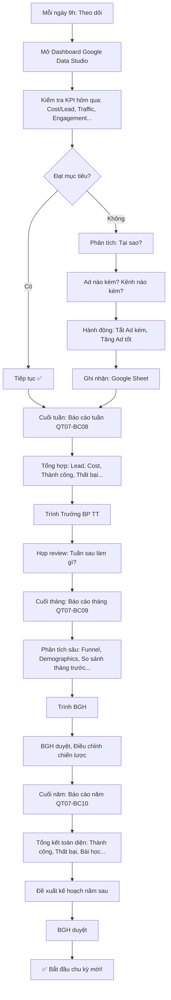

# SOP-03.5: ĐÁNH GIÁ HIỆU QUẢ TRUYỀN THÔNG

## 1. THÔNG TIN QUY TRÌNH

| **Thuộc tính** | **Nội dung** |
|---|---|
| Mã SOP | SOP-03.5 |
| Tên quy trình | Đánh giá hiệu quả truyền thông |
| Quy trình cha | SOP-03: Truyền thông - Marketing |
| Phiên bản | 1.0 |
| Tần suất | Liên tục (Real-time) + Báo cáo tuần/tháng/năm |

## 2. MỤC ĐÍCH

- **Đo lường chính xác**: Biết rõ hiệu quả từng kênh, Từng chiến dịch
- **Tối ưu ngân sách**: Chi nhiều vào kênh hiệu quả, Cắt kênh kém
- **Cải thiện liên tục**: Học từ dữ liệu → Làm tốt hơn
- **Báo cáo minh bạch**: BGH thấy rõ ROI

## 3. PHẠM VI ÁP DỤNG

Tất cả hoạt động truyền thông (Online + Offline)

## 4. HỆ THỐNG CHỈ SỐ (KPI)

### 4.1. KPI Marketing tổng thể

```
╔══════════════════════════════════════════════════════════════════╗
║           5 KPI QUAN TRỌNG NHẤT                                 ║
╠══════════════════════════════════════════════════════════════════╣
║ 1. TUYỂN SINH (Mục tiêu chính!):                                 ║
║    • Số HS đăng ký: 150 HS/năm                                   ║
║    • % Hoàn thành chỉ tiêu: ≥95%                                 ║
║    • So với năm trước: Tăng 5-10%                                ║
╠══════════════════════════════════════════════════════════════════╣
║ 2. COST (Chi phí):                                               ║
║    • Ngân sách tổng: 200M/năm                                    ║
║    • Cost/Lead: ≤250K                                            ║
║    • Cost/HS (Nhập học): ≤1.5M                                   ║
║    • % Ngân sách/Doanh thu: ≤30%                                 ║
╠══════════════════════════════════════════════════════════════════╣
║ 3. ROI (Return on Investment):                                   ║
║    • ROI = (Doanh thu - Chi phí) / Chi phí                       ║
║    • Mục tiêu: ROI ≥3 (Chi 1đ → Thu 3đ!)                         ║
║    • VD: Chi 200M → Thu 750M (150 HS × 5M)                       ║
║         ROI = 750/200 = 3.75 ✅                                  ║
╠══════════════════════════════════════════════════════════════════╣
║ 4. BRAND AWARENESS (Nhận diện thương hiệu):                      ║
║    • % PH biết IQ School (Bán kính 5km): 50%                     ║
║    • Top of mind: Top 3 (Hỏi "Trường quốc tế HN?")               ║
║    • NPS: ≥50 (PH sẵn sàng giới thiệu)                           ║
╠══════════════════════════════════════════════════════════════════╣
║ 5. ENGAGEMENT (Tương tác):                                       ║
║    • Facebook: Engagement rate ≥3%                               ║
║    • Website: Bounce rate ≤50%                                   ║
║    • Email: Open rate ≥40%                                       ║
╚══════════════════════════════════════════════════════════════════╝
```

### 4.2. KPI từng kênh chi tiết

```
╔══════════════════════════════════════════════════════════════════╗
║           KPI THEO KÊNH                                         ║
╠══════════════════════════════════════════════════════════════════╣
║ WEBSITE:                                                         ║
║  • Traffic: 15K visitors/tháng                                   ║
║  • Bounce rate: ≤50%                                             ║
║  • Time on site: ≥2 phút                                         ║
║  • Pages/session: ≥3 trang                                       ║
║  • Conversion rate (Form đăng ký): ≥3%                           ║
║    (450 visitors/ngày × 3% = 14 Lead/ngày)                       ║
╠══════════════════════════════════════════════════════════════════╣
║ FACEBOOK PAGE:                                                   ║
║  • Followers: 20K (Cuối 2025)                                    ║
║  • Reach: ≥10K người/post                                        ║
║  • Engagement rate: ≥3%                                          ║
║    (10K reach × 3% = 300 tương tác/post)                         ║
║  • Click-through rate (Link): ≥2%                                ║
║  • Lead/post (Nếu có CTA): ≥5 Lead                               ║
╠══════════════════════════════════════════════════════════════════╣
║ FACEBOOK ADS:                                                    ║
║  • Budget: 80M/năm                                               ║
║  • Impressions: ≥2M/năm                                          ║
║  • Reach: ≥500K người/năm                                        ║
║  • Click-through rate (CTR): ≥2%                                 ║
║  • Cost/Click: ≤5K                                               ║
║  • Cost/Lead: ≤200K                                              ║
║  • Lead: 400 Lead/năm                                            ║
║  • Conversion (Lead → HS): ≥25% (100 HS)                         ║
╠══════════════════════════════════════════════════════════════════╣
║ GOOGLE ADS:                                                      ║
║  • Budget: 40M/năm                                               ║
║  • Impressions: ≥1M/năm                                          ║
║  • CTR: ≥3% (Search ads tốt hơn FB!)                             ║
║  • Cost/Click: ≤8K                                               ║
║  • Cost/Lead: ≤250K                                              ║
║  • Lead: 160 Lead/năm                                            ║
║  • Conversion: ≥20% (32 HS)                                      ║
╠══════════════════════════════════════════════════════════════════╣
║ EMAIL MARKETING:                                                 ║
║  • Database: 2000 email                                          ║
║  • Gửi: 100 email/năm (2/tuần)                                   ║
║  • Open rate: ≥40%                                               ║
║  • Click rate: ≥10%                                              ║
║  • Unsubscribe rate: ≤2%                                         ║
╠══════════════════════════════════════════════════════════════════╣
║ INSTAGRAM:                                                       ║
║  • Followers: 5K (Cuối 2025)                                     ║
║  • Engagement rate: ≥5% (Cao hơn FB!)                            ║
║  • Reach: ≥5K/post                                               ║
║  • Story views: ≥2K/story                                        ║
╠══════════════════════════════════════════════════════════════════╣
║ YOUTUBE:                                                         ║
║  • Subscribers: 2K (Cuối 2025)                                   ║
║  • Views: 10K/video                                              ║
║  • Watch time: ≥50% (Xem ≥50% video)                             ║
║  • CTR (Thumbnail): ≥10%                                         ║
╚══════════════════════════════════════════════════════════════════╝
```

## 5. CÔNG CỤ ĐO LƯỜNG

### 5.1. Công cụ Online

```
╔══════════════════════════════════════════════════════════════════╗
║           CÔNG CỤ ĐO LƯỜNG                                      ║
╠══════════════════════════════════════════════════════════════════╣
║ 1. GOOGLE ANALYTICS (Website):                                   ║
║    • Đo: Traffic, Bounce rate, Time on site...                   ║
║    • Cài: Code GA trên Website                                   ║
║    • Xem: analytics.google.com                                   ║
║    • Tần suất: Mỗi ngày (15 phút)                                ║
╠══════════════════════════════════════════════════════════════════╣
║ 2. FACEBOOK INSIGHTS (Facebook Page):                            ║
║    • Đo: Reach, Engagement, Followers...                         ║
║    • Xem: Trực tiếp trên Facebook Page → Insights                ║
║    • Tần suất: Mỗi ngày                                          ║
╠══════════════════════════════════════════════════════════════════╣
║ 3. FACEBOOK ADS MANAGER (Facebook Ads):                          ║
║    • Đo: Impressions, CTR, Cost/Lead...                          ║
║    • Xem: business.facebook.com/adsmanager                       ║
║    • Tần suất: Mỗi ngày (2 lần: 9h, 15h)                         ║
╠══════════════════════════════════════════════════════════════════╣
║ 4. GOOGLE ADS (Google Ads):                                      ║
║    • Đo: Impressions, CTR, Cost/Click...                         ║
║    • Xem: ads.google.com                                         ║
║    • Tần suất: Mỗi ngày                                          ║
╠══════════════════════════════════════════════════════════════════╣
║ 5. MAILCHIMP / SENDINBLUE (Email Marketing):                     ║
║    • Đo: Open rate, Click rate, Unsubscribe...                   ║
║    • Xem: Trực tiếp trên tool                                    ║
║    • Tần suất: Sau mỗi email gửi                                 ║
╠══════════════════════════════════════════════════════════════════╣
║ 6. CRM (Lead, Conversion):                                       ║
║    • Đo: Số Lead, Conversion rate, Cost/HS...                    ║
║    • Xem: Dashboard CRM                                          ║
║    • Tần suất: Real-time!                                        ║
╠══════════════════════════════════════════════════════════════════╣
║ 7. GOOGLE DATA STUDIO (Dashboard tổng hợp):                      ║
║    • Tích hợp: GA + FB + Google Ads + CRM...                     ║
║    • Dashboard 1 màn hình: Xem tất cả KPI!                       ║
║    • Tần suất: Luôn mở! (Theo dõi real-time)                     ║
╚══════════════════════════════════════════════════════════════════╝
```

### 5.2. Dashboard tổng hợp (Mẫu)

```
┌────────────────────────────────────────────────────────────────┐
│  DASHBOARD MARKETING - REAL-TIME                               │
│  Cập nhật: 15/03/2025, 10:00                                   │
├────────────────────────────────────────────────────────────────┤
│ TỔNG QUAN (Năm 2025 - 75 ngày):                               │
│ • Ngân sách: 50M/200M (25%)                                    │
│ • Lead: 125/600 (21%) → Chậm hơn dự kiến! ⚠️                 │
│ • HS đăng ký: 30/150 (20%) → On track ✅                      │
│ • Cost/Lead: 400K (Mục tiêu ≤250K) → Cao! ⚠️                 │
│ • Cost/HS: 1.67M (Mục tiêu ≤1.5M) → Hơi cao! ⚠️              │
│ • ROI dự kiến: 3.0 (On track!) ✅                             │
├────────────────────────────────────────────────────────────────┤
│ WEBSITE (Tháng 3):                                             │
│ • Traffic: 12K/15K (80%) → Cần tăng! ⚠️                       │
│ • Bounce rate: 45% ✅ (Mục tiêu ≤50%)                         │
│ • Time on site: 2m30s ✅                                       │
│ • Conversion: 3.2% ✅                                          │
├────────────────────────────────────────────────────────────────┤
│ FACEBOOK ADS (Tháng 3):                                        │
│ • Spend: 20M/60M (33%)                                         │
│ • Lead: 40/400 (10%) → Chậm!                                   │
│ • Cost/Lead: 500K ❌ (Mục tiêu ≤200K!)                        │
│ • CTR: 1.5% ⚠️ (Mục tiêu ≥2%)                                │
│                                                                │
│ → HÀNH ĐỘNG: Tối ưu Ads! (Đổi Creative, Target...)            │
├────────────────────────────────────────────────────────────────┤
│ GOOGLE ADS (Tháng 3):                                          │
│ • Spend: 8M/40M (20%)                                          │
│ • Lead: 25/160 (16%)                                           │
│ • Cost/Lead: 320K ⚠️                                          │
│ • CTR: 2.8% ✅                                                 │
├────────────────────────────────────────────────────────────────┤
│ TOP 3 POST FACEBOOK (Tháng 3):                                │
│ 1. Post "HS đạt giải Toán": Reach 15K, Engagement 5% ✅       │
│ 2. Post "Video STEM": Reach 8K, Engagement 4% ✅              │
│ 3. Post "Open House 23/3": Reach 12K, Engagement 3% ✅        │
├────────────────────────────────────────────────────────────────┤
│ CẢNH BÁO:                                                      │
│ ⚠️ Facebook Ads: Cost/Lead 500K (Quá cao!)                    │
│ ⚠️ Website Traffic: Chỉ 12K (Thiếu 3K!)                       │
│                                                                │
│ → XỬ LÝ NGAY!                                                  │
└────────────────────────────────────────────────────────────────┘
```

## 6. QUY TRÌNH ĐÁNH GIÁ

### 6.1. Theo dõi hằng ngày (Daily Monitoring)

```
MỖI SÁNG 9H (15 PHÚT):

NV Marketing mở Dashboard:

1. KIỂM TRA KPI HÔM QUA:
   □ Facebook Ads: Chi bao nhiêu? Lead? Cost/Lead?
   □ Google Ads: Chi bao nhiêu? Lead? Cost/Lead?
   □ Website: Traffic? Bounce rate?
   □ Facebook Page: Reach? Engagement?

2. SO SÁNH VỚI MỤC TIÊU:
   • Cost/Lead hôm qua: 350K (Mục tiêu ≤250K) ⚠️
   → KHÔNG ĐẠT!

3. PHÂN TÍCH (NẾU KHÔNG ĐẠT):
   • Tại sao Cost/Lead cao?
   • Ad nào kém? (Xem từng Ad)
     - Ad 1: Cost/Lead 200K ✅ Tốt!
     - Ad 2: Cost/Lead 600K ❌ Kém!
   → Tắt Ad 2!

4. HÀNH ĐỘNG:
   • Tắt Ad 2 (9h30)
   • Tăng budget Ad 1 (50%)

5. GHI NHẬN:
   • Note vào Google Sheet: "15/03 - Tắt Ad 2 (Cost cao)"
```

### 6.2. Báo cáo tuần (Weekly Report)

```
═══════════════════════════════════════════════════════
    BÁO CÁO TUẦN 8-14/03/2025
═══════════════════════════════════════════════════════

I. TỔNG QUAN:
• Ngân sách: 8M (Tuần này)
• Lead: 20 (Mục tiêu: 15) ✅ Vượt!
• Cost/Lead: 400K (Mục tiêu: ≤250K) ⚠️ Cao!
• HS đăng ký: 5 (Conversion 25%) ✅

II. PHÂN TÍCH KÊNH:

A. FACEBOOK ADS:
• Spend: 5M
• Lead: 12 (60% tổng Lead)
• Cost/Lead: 417K ⚠️
• Best Ad: Ad 1 (Ảnh HS) - Cost 200K ✅
• Worst Ad: Ad 3 (Carousel) - Cost 800K ❌
  → Đã tắt Ad 3 (14/03)!

B. GOOGLE ADS:
• Spend: 2M
• Lead: 6 (30% tổng Lead)
• Cost/Lead: 333K ⚠️
• CTR: 3.2% ✅

C. ORGANIC (Website, Facebook Page):
• Lead: 2 (10%)
• Cost: 1M (Content, SEO...)
• Cost/Lead: 500K ⚠️

III. THÀNH CÔNG:
✅ Vượt chỉ tiêu Lead (20 vs 15)
✅ Conversion tốt (25%)
✅ Facebook Ad 1 hiệu quả (Cost 200K)

IV. THẤT BẠI:
❌ Cost/Lead cao (400K vs 250K)
❌ Facebook Ad 3 kém (Cost 800K)

V. HÀNH ĐỘNG TUẦN SAU:
• Tập trung Ad 1 (Tăng budget 50%)
• Test Ad 4 (Mới) - Video
• Cải thiện Landing page (Giảm Bounce rate)

Người lập: NV Marketing A
Duyệt: Trưởng BP TT
Ngày: 15/03/2025
═══════════════════════════════════════════════════════
```

### 6.3. Báo cáo tháng (Monthly Report)

```
BÁO CÁO THÁNG (Chi tiết hơn Báo cáo tuần):

I. TỔNG QUAN:
• Ngân sách: 30M
• Lead: 75 (Mục tiêu: 50) ✅ Vượt 50%!
• HS đăng ký: 18 (Conversion 24%)
• Cost/Lead: 400K ⚠️
• Cost/HS: 1.67M ⚠️
• ROI dự kiến: 3.0 ✅

II. PHÂN TÍCH SÂU:

A. LEAD THEO NGUỒN:
| Nguồn | Lead | % | Cost | Cost/Lead |
|-------|------|---|------|-----------|
| FB Ads | 45 | 60% | 18M | 400K ⚠️ |
| Google | 18 | 24% | 6M | 333K ⚠️ |
| Organic | 12 | 16% | 6M | 500K ⚠️ |

B. CONVERSION FUNNEL:
• Impressions (FB + Google): 500K
• Click: 10K (CTR 2%)
• Landing page: 8K (80% - Tốt!)
• Lead: 75 (Conversion 0.9%)
• HS đăng ký: 18 (Conversion từ Lead 24%)

C. DEMOGRAPHICS:
• Giới tính: 70% Nữ, 30% Nam
• Tuổi: 60% (30-40 tuổi), 40% (40-50 tuổi)
• Khu vực: 80% (5km), 20% (>5km)

III. SO SÁNH VỚI THÁNG TRƯỚC:
• Lead: 75 vs 60 (+25%) ✅
• Cost/Lead: 400K vs 350K (+14%) ⚠️
• HS đăng ký: 18 vs 12 (+50%) ✅

IV. KHUYẾN NGHỊ:
• Tối ưu Ads (Giảm Cost/Lead từ 400K → 250K)
• Tăng budget (Nếu tối ưu thành công!)
• Test kênh mới (Influencer?)
```

### 6.4. Báo cáo năm (Annual Report)

```
BÁO CÁO NĂM 2025 (Tổng kết toàn diện):

I. TỔNG QUAN:
• Ngân sách: 195M/200M (98%)
• Lead: 620/600 (103%) ✅
• HS đăng ký: 155/150 (103%) ✅
• Cost/Lead: 315K (Vượt mục tiêu 250K) ⚠️
• Cost/HS: 1.26M ✅ (Mục tiêu ≤1.5M)
• ROI: 4.0 ✅ (Mục tiêu ≥3)

II. PHÂN TÍCH TOÀN DIỆN:
(Giống Báo cáo tháng, Nhưng chi tiết hơn!)

III. THÀNH CÔNG NĂM 2025:
✅ Hoàn thành 103% chỉ tiêu HS!
✅ ROI 4.0 (Xuất sắc!)
✅ Facebook Ads hiệu quả (Kênh chính!)

IV. THẤT BẠI:
❌ Cost/Lead cao hơn mục tiêu (315K vs 250K)
❌ Google Ads chưa tốt
❌ PR kém (Cost/HS 5M!)

V. BÀI HỌC:
• Facebook là kênh tốt nhất → Năm 2026: Tăng 80M → 100M!
• PR không hiệu quả → Cắt: 10M → 3M
• Google Ads cần cải thiện → Thuê Agency!

VI. KẾ HOẠCH 2026:
• Chỉ tiêu: 180 HS (+16%)
• Ngân sách: 220M (+10%)
• Kênh mới: Influencer Marketing (10M)
```

## 7. LƯU ĐỒ QUY TRÌNH



## 8. BIỂU MẪU LIÊN QUAN

| **Mã** | **Tên** |
|---|---|
| QT07-BC08 | Báo cáo tuần (Marketing) |
| QT07-BC09 | Báo cáo tháng (Marketing) |
| QT07-BC10 | Báo cáo năm (Marketing) |
| QT07-DS06 | Dashboard KPI (Google Data Studio) |

## 9. TIÊU CHUẨN VÀ CHỈ TIÊU

| **Chỉ tiêu** | **Mục tiêu** |
|---|---|
| Tần suất theo dõi (Dashboard) | Mỗi ngày |
| Tỷ lệ báo cáo đúng hạn (Tuần/Tháng) | 100% |
| Độ chính xác dữ liệu | ≥95% |
| Thời gian xử lý KPI không đạt | ≤24h |

## 10. TRÁCH NHIỆM CỤ THỂ

| **Vai trò** | **Trách nhiệm** |
|---|---|
| **NV Marketing** | Theo dõi hằng ngày, Lập báo cáo tuần |
| **Trưởng BP Truyền thông** | Duyệt báo cáo tuần, Lập báo cáo tháng, Trình BGH |
| **Data Analyst** | Setup Dashboard, Phân tích sâu |
| **BGH** | Duyệt báo cáo tháng/năm, Quyết định chiến lược |

## 11. LƯU Ý QUAN TRỌNG

- ⚠️ **Theo dõi real-time**: Dashboard luôn mở! Phát hiện vấn đề sớm!
- ✅ **Hành động nhanh**: KPI không đạt → Xử lý trong 24h!
- 🔥 **Học hỏi**: Mỗi báo cáo → Bài học kinh nghiệm!
- ✅ **Minh bạch**: BGH thấy rõ ROI → Tin tưởng Marketing!

## 12. PHỤ LỤC

### 12.1. Công thức tính KPI quan trọng

```
═══════════════════════════════════════════════════════
    CÔNG THỨC TÍNH KPI
═══════════════════════════════════════════════════════

1. ROI (Return on Investment):
   ROI = (Doanh thu - Chi phí) / Chi phí
   
   VD: Chi 200M, Thu 750M (150 HS × 5M)
       ROI = (750M - 200M) / 200M = 2.75
   
   Ý nghĩa: Chi 1đ → Lãi 2.75đ!

2. Cost/Lead:
   Cost/Lead = Tổng chi phí / Số Lead
   
   VD: Chi 60M (Facebook), Lead 300
       Cost/Lead = 60M / 300 = 200K

3. Cost/HS (Nhập học):
   Cost/HS = Tổng chi phí / Số HS đăng ký
   
   VD: Chi 200M, 150 HS
       Cost/HS = 200M / 150 = 1.33M

4. Conversion Rate (Chuyển đổi):
   Conversion = (Số HS / Số Lead) × 100%
   
   VD: Lead 600, HS 150
       Conversion = (150/600) × 100% = 25%

5. CTR (Click-Through Rate):
   CTR = (Click / Impressions) × 100%
   
   VD: Impressions 100K, Click 2K
       CTR = (2K/100K) × 100% = 2%

6. Engagement Rate (Facebook):
   Engagement = (Like + Comment + Share) / Reach × 100%
   
   VD: Reach 10K, Like 200, Comment 50, Share 50
       Engagement = (200+50+50) / 10K × 100% = 3%

7. Bounce Rate (Website):
   Bounce = (Visitors rời ngay / Tổng visitors) × 100%
   
   VD: 1000 visitors, 450 rời ngay
       Bounce = 450/1000 × 100% = 45%

═══════════════════════════════════════════════════════
```

### 12.2. Benchmark (So sánh với ngành)

```
╔══════════════════════════════════════════════════════════════════╗
║           BENCHMARK - NGÀNH GIÁO DỤC                            ║
╠══════════════════════════════════════════════════════════════════╣
║ Facebook Ads:                                                    ║
║  • CTR: 1-2% (TB), ≥3% (Tốt)                                     ║
║  • Cost/Click: 5-10K (TB)                                        ║
║  • Cost/Lead: 200-500K (TB)                                      ║
║                                                                  ║
║ Google Ads (Search):                                             ║
║  • CTR: 3-5% (TB), ≥7% (Tốt)                                     ║
║  • Cost/Click: 5-15K (TB)                                        ║
║  • Cost/Lead: 300-800K (TB)                                      ║
║                                                                  ║
║ Website:                                                         ║
║  • Bounce rate: 40-60% (TB), ≤40% (Tốt)                          ║
║  • Time on site: 2-3 phút (TB)                                   ║
║  • Pages/session: 2-3 (TB)                                       ║
║                                                                  ║
║ Email:                                                           ║
║  • Open rate: 20-30% (TB), ≥40% (Tốt)                            ║
║  • Click rate: 5-10% (TB)                                        ║
║                                                                  ║
║ ROI:                                                             ║
║  • ROI 1-2: Kém                                                  ║
║  • ROI 2-3: TB                                                   ║
║  • ROI 3-5: Tốt ✅                                               ║
║  • ROI >5: Xuất sắc! 🌟                                          ║
╚══════════════════════════════════════════════════════════════════╝
```

## 13. FAQ

**Q1: Dashboard phức tạp, Khó hiểu. Đơn giản hóa?**  
A: 
- Chỉ hiển thị KPI quan trọng (5-7 KPI)
- Dùng biểu đồ (Dễ nhìn hơn số!)
- Màu sắc: Xanh (Đạt), Đỏ (Không đạt)

**Q2: Cost/Lead cao (500K, Mục tiêu 250K). Cải thiện?**  
A: 
- Tối ưu Ads: Đổi Creative, Target, Landing page
- Thử kênh khác (Google, Influencer...)
- Hoặc: Chấp nhận! (Nếu ROI vẫn tốt!)

**Q3: ROI thấp (1.5, Mục tiêu 3). Xử lý?**  
A: 
- Tăng học phí? (5M → 6M, Thu tăng!)
- Giảm chi phí marketing? (Cắt kênh kém!)
- Hoặc: Dừng marketing! (ROI 1.5 = Thua lỗ!)

---

**PHÊ DUYỆT**

| NV Marketing | Data Analyst | Trưởng BP TT | Phó HT | HT |
|---|---|---|---|---|
| [Họ tên] | [Họ tên] | [Họ tên] | [Họ tên] | [Họ tên] |

---

✅ **HOÀN THÀNH SOP-03: TRUYỀN THÔNG - MARKETING (6 files)!** 🎉🔥📚
