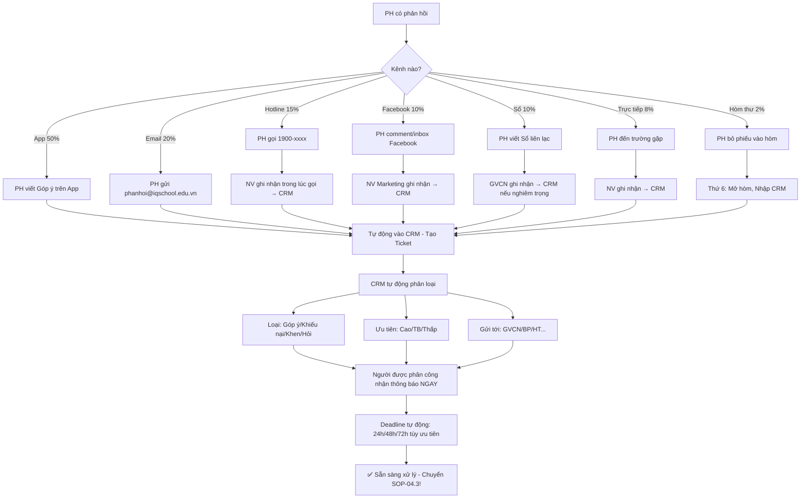

# SOP-04.1: THIẾT LẬP KÊNH PHẢN HỒI

## 1. THÔNG TIN QUY TRÌNH

| **Thuộc tính** | **Nội dung** |
|---|---|
| Mã SOP | SOP-04.1 |
| Tên quy trình | Thiết lập kênh phản hồi |
| Quy trình cha | SOP-04: Tiếp nhận phản hồi |
| Phiên bản | 1.0 |
| Tần suất | Thường trực (24/7) |

## 2. MỤC ĐÍCH

- **Lắng nghe PH**: PH có thể phản hồi bất kỳ lúc nào, Bằng bất kỳ cách nào
- **Tiếp nhận đầy đủ**: Không bỏ sót phản hồi nào
- **Phản hồi nhanh**: PH không phải chờ lâu
- **Cải thiện liên tục**: Phản hồi → Hành động → Tốt hơn!

## 3. PHẠM VI ÁP DỤNG

Tất cả loại phản hồi (Góp ý, Khiếu nại, Khen ngợi, Thắc mắc...)

## 4. HỆ THỐNG KÊNH PHẢN HỒI

### 4.1. Kênh Online (80% phản hồi)

```
╔══════════════════════════════════════════════════════════════════╗
║           6 KÊNH ONLINE                                         ║
╠══════════════════════════════════════════════════════════════════╣
║ 1. APP TRƯỜNG (50% phản hồi):                                    ║
║    • Tính năng: "Góp ý" (Trên App)                               ║
║    • PH viết: Nội dung + Đính kèm ảnh/video (Nếu có)             ║
║    • Gửi đến: BP Quan hệ PH (Tự động)                            ║
║    • Thời gian phản hồi: ≤24h                                    ║
║    • Ưu điểm: Nhanh, Tiện (PH dùng App hằng ngày!)               ║
╠══════════════════════════════════════════════════════════════════╣
║ 2. EMAIL (20% phản hồi):                                         ║
║    • Địa chỉ: phanhoi@iqschool.edu.vn                            ║
║    • PH gửi email: Bất kỳ lúc nào                                ║
║    • Thời gian phản hồi: ≤48h                                    ║
║    • Ưu điểm: Chính thức, Lưu trữ được                           ║
╠══════════════════════════════════════════════════════════════════╣
║ 3. HOTLINE (15% phản hồi):                                       ║
║    • Số: 1900-xxxx                                               ║
║    • Phục vụ: 8h-17h (Thứ 2-6), 8h-12h (Thứ 7)                   ║
║    • Sau giờ: Máy trả lời tự động (Ghi nhận, Gọi lại sáng mai!)  ║
║    • Thời gian phản hồi: Ngay (Real-time!)                       ║
║    • Ưu điểm: Nhanh nhất, Trực tiếp                              ║
╠══════════════════════════════════════════════════════════════════╣
║ 4. FACEBOOK (10% phản hồi):                                      ║
║    • PH comment hoặc Inbox                                       ║
║    • Thời gian phản hồi: ≤2h                                     ║
║    • Ưu điểm: PH quen dùng                                       ║
║    • Nhược điểm: Công khai (Nếu comment!)                        ║
╠══════════════════════════════════════════════════════════════════╣
║ 5. WEBSITE (3% phản hồi):                                        ║
║    • Form liên hệ: iqschool.edu.vn/lien-he                       ║
║    • Thời gian phản hồi: ≤48h                                    ║
╠══════════════════════════════════════════════════════════════════╣
║ 6. ZALO OA (2% phản hồi):                                        ║
║    • Chat trực tiếp                                              ║
║    • Thời gian phản hồi: ≤30 phút (Giờ hành chính)              ║
╚══════════════════════════════════════════════════════════════════╝
```

### 4.2. Kênh Offline (20% phản hồi)

```
╔══════════════════════════════════════════════════════════════════╗
║           3 KÊNH OFFLINE                                        ║
╠══════════════════════════════════════════════════════════════════╣
║ 1. SỔ LIÊN LẠC (10% phản hồi):                                   ║
║    • PH viết Sổ: "Cô ơi, Con em..."                              ║
║    • GVCN đọc → Trả lời ngay (Trong ngày!)                       ║
║    • Nếu nghiêm trọng → Báo BP Quan hệ PH                        ║
║    • Ưu điểm: Trực tiếp với GVCN                                 ║
╠══════════════════════════════════════════════════════════════════╣
║ 2. GẶP TRỰC TIẾP (8% phản hồi):                                  ║
║    • PH đến trường gặp:                                          ║
║      - GVCN (Vấn đề nhỏ)                                         ║
║      - BP Quan hệ PH (Vấn đề to)                                 ║
║      - HT (Vấn đề rất nghiêm trọng!)                             ║
║    • Thời gian: Hẹn trước (Hoặc đến bất kỳ lúc nào!)             ║
║    • Ưu điểm: Trao đổi sâu, Giải quyết nhanh                     ║
╠══════════════════════════════════════════════════════════════════╣
║ 3. HÒM THƯ GÓP Ý (2% phản hồi):                                   ║
║    • Vị trí: Hành lang trường (Gần cổng)                         ║
║    • Hình thức: Hòm kín (PH bỏ phiếu vô danh)                    ║
║    • Mở hòm: Mỗi thứ 6, 16h                                      ║
║    • Xử lý: BP Quan hệ PH đọc, Phân loại, Trả lời (Nếu có SĐT)   ║
║    • Ưu điểm: Vô danh (PH dám nói thật!)                         ║
╚══════════════════════════════════════════════════════════════════╝
```

## 5. QUY TRÌNH THIẾT LẬP KÊNH

### 5.1. Kênh App (Quan trọng nhất!)

**BƯỚC 1: Phát triển tính năng "Góp ý" (App)**

```
GIAO DIỆN APP:

┌─────────────────────────────────────┐
│  [Menu] IQ SCHOOL APP               │
├─────────────────────────────────────┤
│  • Trang chủ                        │
│  • Điểm số                          │
│  • Thông báo                        │
│  • Album ảnh                        │
│  • Lịch học                         │
│  • 💬 GÓP Ý (MỚI!)                  │
│  • Cài đặt                          │
└─────────────────────────────────────┘

PH click "Góp ý":

┌─────────────────────────────────────┐
│  GÓP Ý CHO NHÀ TRƯỜNG               │
├─────────────────────────────────────┤
│ Loại góp ý:                         │
│  ○ Góp ý xây dựng                   │
│  ○ Khiếu nại                        │
│  ○ Khen ngợi                        │
│  ○ Thắc mắc                         │
│                                     │
│ Nội dung:                           │
│ [_____________________________]     │
│ [_____________________________]     │
│ [_____________________________]     │
│                                     │
│ Đính kèm:                           │
│  [📷 Chọn ảnh] [🎥 Quay video]     │
│                                     │
│ Gửi tới:                            │
│  ○ GVCN (Vấn đề lớp)                │
│  ○ BP Quan hệ PH (Vấn đề trường)    │
│  ○ Hiệu trưởng (Vấn đề nghiêm trọng)│
│                                     │
│ ☑ Vô danh (Không hiện tên tôi)      │
│                                     │
│ [Nút: GỬI GÓP Ý]                    │
└─────────────────────────────────────┘

PH click GỬI:
→ Thông tin tự động vào CRM!
→ PH nhận thông báo: "Cảm ơn! Chúng tôi sẽ phản hồi trong 24-48h!"
```

**BƯỚC 2: Tích hợp CRM (Nhận phản hồi tự động)**

```
PH gửi góp ý qua App
→ API gửi dữ liệu đến CRM
→ CRM tạo Ticket (Mã: PH2025-001)

THÔNG TIN TICKET:
• Mã: PH2025-001
• PH: Nguyễn Văn A (Hoặc "Vô danh")
• Loại: Khiếu nại
• Nội dung: "Đồ ăn hôm nay dở, Con không ăn!"
• Ảnh: [Ảnh đồ ăn.jpg]
• Gửi tới: BP Quan hệ PH
• Ngày: 15/03/2025, 10:30
• Trạng thái: 🟡 CHỜ XỬ LÝ
• Deadline: 16/03/2025, 10:30 (24h sau)

→ BP Quan hệ PH nhận email ngay:
"Bạn có 1 phản hồi mới (Khiếu nại - Ưu tiên!)
 Deadline: 24h
 [Link xem chi tiết]"
```

### 5.2. Kênh Hotline

**BƯỚC 3: Setup Hotline (1900-xxxx)**

```
HỆ THỐNG HOTLINE:

A. THIẾT BỊ:
• Tổng đài ảo (Cloud PBX): Stringee, CloudFone...
• Chi phí: 2M/tháng
• Số máy nhánh: 3 (BP Quan hệ PH, GVCN, Kế toán...)

B. PHÂN LUỒNG TỰ ĐỘNG (IVR):
PH gọi 1900-xxxx → Máy trả lời tự động:

"Xin chào, IQ School!
 
 Nhấn 1: Tư vấn tuyển sinh
 Nhấn 2: Góp ý, Khiếu nại
 Nhấn 3: Kế toán (Học phí)
 Nhấn 0: Gặp tổng đài viên"

PH nhấn 2 (Góp ý):
→ Chuyển máy BP Quan hệ PH (0912-xxx-xxx)

C. GHI ÂM:
• Tất cả cuộc gọi được ghi âm (Tự động)
• Lưu trữ: 6 tháng
• Mục đích: Kiểm tra chất lượng phục vụ, Làm bằng chứng (Nếu tranh chấp)

D. THEO DÕI:
• CRM ghi nhận: Ai gọi, Lúc nào, Nội dung gì, Ai trả lời, Kết quả?
• Dashboard: Số cuộc gọi/ngày, Thời gian chờ, % Hài lòng...
```

### 5.3. Kênh Email

**BƯỚC 4: Setup Email chuyên dụng**

```
EMAIL: phanhoi@iqschool.edu.vn

SETUP:
• Domain: iqschool.edu.vn (Chuyên nghiệp!)
• Không dùng: Gmail cá nhân (Kém chuyên nghiệp!)
• Tích hợp: CRM (Email vào → Tự động tạo Ticket!)
• Auto-reply: "Cảm ơn quý vị! Chúng tôi sẽ phản hồi trong 48h!"

MẪU EMAIL TỰ ĐỘNG (Auto-reply):

Subject: Đã nhận được góp ý của quý vị!

Kính gửi quý PH,

Cảm ơn quý vị đã gửi góp ý cho IQ School!

Chúng tôi đã nhận được email của quý vị lúc 10:30, 15/03/2025.
Mã phản hồi: PH2025-001

Chúng tôi sẽ xử lý và phản hồi quý vị trong vòng 48h.

Nếu khẩn cấp, Vui lòng gọi: 1900-xxxx

Trân trọng,
Ban Quan hệ Phụ huynh
IQ School
```

### 5.4. Kênh Offline

**BƯỚC 5: Lắp đặt Hòm thư góp ý**

```
VỊ TRÍ: Hành lang trường (Gần cổng - PH dễ thấy!)

THIẾT KẾ:

┌─────────────────────────────────────┐
│  [Logo IQ School]                   │
│                                     │
│  HÒM THƯ GÓP Ý                      │
│                                     │
│  Quý vị vui lòng:                   │
│  • Viết góp ý vào phiếu             │
│  • Bỏ vào hòm                       │
│                                     │
│  Chúng tôi lắng nghe! 💙            │
│                                     │
│  [Khe bỏ phiếu]                     │
│                                     │
│  Mở hòm: Thứ 6 hằng tuần            │
└─────────────────────────────────────┘

PHIẾU GÓP Ý (Để bên cạnh hòm):

┌─────────────────────────────────────┐
│  PHIẾU GÓP Ý                        │
├─────────────────────────────────────┤
│ Họ tên (Tùy chọn): ____________     │
│ Con học lớp: ____                   │
│ SĐT (Nếu muốn phản hồi): ______     │
│                                     │
│ Loại góp ý:                         │
│  □ Góp ý   □ Khiếu nại              │
│  □ Khen    □ Thắc mắc               │
│                                     │
│ Nội dung:                           │
│ [_____________________________]     │
│ [_____________________________]     │
│ [_____________________________]     │
│                                     │
│ Ngày: __/__/____                    │
└─────────────────────────────────────┘

MỞ HÒM (Mỗi thứ 6, 16h):
• BP Quan hệ PH + 1 GV (Chứng kiến)
• Lấy hết phiếu (VD: 20 phiếu)
• Nhập vào CRM (Tạo Ticket)
• Xử lý (Trong tuần sau)
```

## 6. QUẢN LÝ PHẢN HỒI BẰNG CRM

### 6.1. Hệ thống Ticketing

```
╔══════════════════════════════════════════════════════════════════╗
║           HỆ THỐNG TICKET (Phiếu phản hồi)                      ║
╠══════════════════════════════════════════════════════════════════╣
║ MỖI PHẢN HỒI = 1 TICKET:                                         ║
║                                                                  ║
║ TICKET #PH2025-001:                                              ║
║  • Loại: Khiếu nại                                               ║
║  • Độ ưu tiên: 🔴 CAO (Khiếu nại nghiêm trọng!)                 ║
║  • PH: Nguyễn Văn A - 0912-xxx-xxx                               ║
║  • Con: Lớp 3A                                                   ║
║  • Kênh: App                                                     ║
║  • Ngày: 15/03/2025, 10:30                                       ║
║  • Nội dung: "Đồ ăn dở, Con không ăn!"                           ║
║  • Ảnh: [Ảnh đồ ăn.jpg]                                          ║
║  • Người phụ trách: BP Quan hệ PH                                ║
║  • Deadline: 16/03, 10:30 (24h - Vì ưu tiên cao!)                ║
║  • Trạng thái: 🟡 CHỜ XỬ LÝ                                      ║
╠══════════════════════════════════════════════════════════════════╣
║ WORKFLOW (Luồng xử lý):                                          ║
║  1. 🟡 Chờ xử lý (Mới tạo)                                        ║
║  2. 🔵 Đang xử lý (BP đã nhận, Đang xử lý)                        ║
║  3. 🟢 Đã giải quyết (Đã phản hồi PH)                             ║
║  4. ⚫ Đóng (PH hài lòng, Kết thúc!)                              ║
╠══════════════════════════════════════════════════════════════════╣
║ ĐỘ ƯU TIÊN:                                                      ║
║  • 🔴 CAO (Khiếu nại nghiêm trọng): Xử lý trong 24h!             ║
║  • 🟠 TRUNG BÌNH (Góp ý, Khiếu nại nhẹ): 48h                     ║
║  • 🟢 THẤP (Khen, Thắc mắc): 72h                                 ║
╚══════════════════════════════════════════════════════════════════╝
```

### 6.2. Quy tắc phân loại tự động

```
CRM TỰ ĐỘNG PHÂN LOẠI:

Nội dung có từ:
• "Kém", "Tệ", "Dở", "Không hài lòng"...
  → Khiếu nại, Ưu tiên 🔴 CAO

• "Góp ý", "Đề xuất", "Nên"...
  → Góp ý, Ưu tiên 🟠 TB

• "Tốt", "Giỏi", "Cảm ơn"...
  → Khen, Ưu tiên 🟢 THẤP

• "Hỏi", "?", "Thắc mắc"...
  → Thắc mắc, Ưu tiên 🟠 TB

GỬI TỚI:
• "GV", "Cô", "Thầy", "Lớp"...
  → GVCN

• "Đồ ăn", "Bếp"...
  → Phụ trách Bếp + BP Quan hệ PH

• "Học phí", "Tiền"...
  → Kế toán

• "Hiệu trưởng"...
  → HT

• Khác → BP Quan hệ PH (Mặc định)
```

## 7. LƯU ĐỒ QUY TRÌNH



## 8. BIỂU MẪU LIÊN QUAN

| **Mã** | **Tên** |
|---|---|
| QT07-F07 | Phiếu góp ý (Giấy - Hòm thư) |
| QT07-HD02 | Hướng dẫn sử dụng kênh phản hồi (Cho PH) |

## 9. TIÊU CHUẨN VÀ CHỈ TIÊU

| **Chỉ tiêu** | **Mục tiêu** |
|---|---|
| Số kênh phản hồi hoạt động | ≥6 kênh |
| Tỷ lệ Uptime (Hệ thống hoạt động) | ≥99% |
| Thời gian phản hồi trung bình | ≤48h |
| Tỷ lệ phản hồi bị bỏ sót | 0% |

## 10. TRÁCH NHIỆM CỤ THỂ

| **Vai trò** | **Trách nhiệm** |
|---|---|
| **IT** | Phát triển App, Tích hợp CRM, Bảo trì Hotline |
| **BP Quan hệ PH** | Quản lý Ticket, Xử lý phản hồi |
| **NV Marketing** | Theo dõi Facebook, Ghi nhận phản hồi |
| **GVCN** | Nhận phản hồi qua Sổ, Xử lý hoặc Chuyển BP |

## 11. LƯU Ý QUAN TRỌNG

- ⚠️ **Nhiều kênh**: PH có nhiều lựa chọn! (App, Email, Hotline...)
- ✅ **Dễ dùng**: Giao diện đơn giản! (PH lớn tuổi cũng dùng được!)
- 🔥 **Thường trực 24/7**: App, Email không bao giờ đóng!
- ✅ **Không bỏ sót**: CRM ghi nhận hết! (Không phản hồi nào bị quên!)

## 12. PHỤ LỤC

### 12.1. Hướng dẫn PH sử dụng kênh phản hồi

```
═══════════════════════════════════════════════════════
    HƯỚNG DẪN GÓP Ý CHO NHÀ TRƯỜNG
    (Phát cho PH đầu năm học)
═══════════════════════════════════════════════════════

Kính gửi quý Phụ huynh,

IQ School luôn lắng nghe quý vị!

QUÝ VỊ CÓ THỂ GÓP Ý QUA:

1. APP IQ SCHOOL:
   • Mở App → Menu "Góp ý"
   • Viết nội dung → Gửi
   • Phản hồi: 24-48h

2. EMAIL:
   • Gửi: phanhoi@iqschool.edu.vn
   • Phản hồi: 48h

3. HOTLINE:
   • Gọi: 1900-xxxx
   • Giờ: 8h-17h (T2-6), 8h-12h (T7)
   • Phản hồi: Ngay!

4. FACEBOOK:
   • Inbox: fb.com/iqschool
   • Phản hồi: 2h

5. SỔ LIÊN LẠC:
   • Viết Sổ → GVCN trả lời (Trong ngày)

6. GẶP TRỰC TIẾP:
   • Đến trường → Gặp BP Quan hệ PH
   • Hẹn trước: 0912-xxx-xxx

7. HÒM THƯ:
   • Viết phiếu → Bỏ hòm (Vô danh!)
   • Mở hòm: Thứ 6

MỌI PHẢN HỒI ĐỀU ĐƯỢC XỬ LÝ!
Xin cảm ơn quý vị!

Trân trọng,
Ban Giám hiệu
═══════════════════════════════════════════════════════
```

### 12.2. Thống kê kênh phản hồi (Tháng 3)

```
┌────────────────────────────────────────────────────┐
│  THỐNG KÊ KÊNH PHẢN HỒI - THÁNG 3/2025            │
├────────────────────────────────────────────────────┤
│ TỔNG SỐ: 150 phản hồi                             │
│                                                    │
│ THEO KÊNH:                                         │
│  • App: 75 (50%)                                   │
│  • Email: 30 (20%)                                 │
│  • Hotline: 22 (15%)                               │
│  • Facebook: 15 (10%)                              │
│  • Sổ: 5 (3%)                                      │
│  • Trực tiếp: 2 (1%)                               │
│  • Hòm thư: 1 (1%)                                 │
│                                                    │
│ THEO LOẠI:                                         │
│  • Góp ý: 80 (53%)                                 │
│  • Khiếu nại: 40 (27%)                             │
│  • Khen: 20 (13%)                                  │
│  • Hỏi: 10 (7%)                                    │
│                                                    │
│ THỜI GIAN PHẢN HỒI TB:                             │
│  • App: 20h ✅ (Mục tiêu ≤24h)                    │
│  • Email: 35h ✅ (Mục tiêu ≤48h)                  │
│  • Hotline: 0h ✅ (Ngay!)                         │
│  • Facebook: 1.5h ✅ (Mục tiêu ≤2h)               │
│                                                    │
│ TỶ LỆ HÀI LÒNG (Sau xử lý):                        │
│  • Rất hài lòng: 60%                               │
│  • Hài lòng: 30%                                   │
│  • Chưa hài lòng: 10% (15 PH) → Xử lý lại!        │
└────────────────────────────────────────────────────┘
```

### 12.3. Dashboard Ticketing (Real-time)

```
┌────────────────────────────────────────────────────┐
│  DASHBOARD TICKET - 15/03/2025, 10:00             │
├────────────────────────────────────────────────────┤
│ HÔM NAY:                                           │
│ • Ticket mới: 8                                    │
│ • Đang xử lý: 15                                   │
│ • Đã giải quyết: 5                                 │
│ • Đóng: 3                                          │
├────────────────────────────────────────────────────┤
│ CẢNH BÁO:                                          │
│ ⚠️ 3 Ticket quá hạn! (Deadline đã qua!)           │
│  • #PH2025-005: Quá 2 ngày                        │
│  • #PH2025-008: Quá 1 ngày                        │
│  • #PH2025-012: Quá 4h                            │
│                                                    │
│ → XỬ LÝ NGAY!                                      │
├────────────────────────────────────────────────────┤
│ TUẦN NÀY:                                          │
│ • Tổng: 50 ticket                                  │
│ • Đã xử lý: 45 (90%)                               │
│ • Chưa xử lý: 5 (10%)                              │
│ • Thời gian TB: 30h ✅ (Mục tiêu ≤48h)           │
│ • Tỷ lệ hài lòng: 85% ✅                          │
└────────────────────────────────────────────────────┘
```

## 13. FAQ

**Q1: PH phản hồi qua nhiều kênh (Vừa App, Vừa Email). Xử lý?**  
A: 
- CRM phát hiện trùng (Cùng PH, Cùng nội dung)
- Gộp thành 1 Ticket!
- Trả lời 1 lần (Qua kênh PH dùng gần nhất)

**Q2: Hòm thư ít người dùng (1 phiếu/tháng). Có nên bỏ?**  
A: GIỮ!
- Có PH ngại nói công khai → Chỉ dùng Hòm (Vô danh!)
- Chi phí thấp (Chỉ 1M - Mua hòm + In phiếu)

**Q3: PH phản hồi bằng tiếng Anh. Xử lý?**  
A: 
- Trả lời bằng tiếng Anh! (Trường quốc tế mà!)
- Nhờ GV tiếng Anh (Nếu NV không giỏi)

---

**PHÊ DUYỆT**

| IT | BP Quan hệ PH | Phó HT |
|---|---|---|
| [Họ tên] | [Họ tên] | [Họ tên] |
