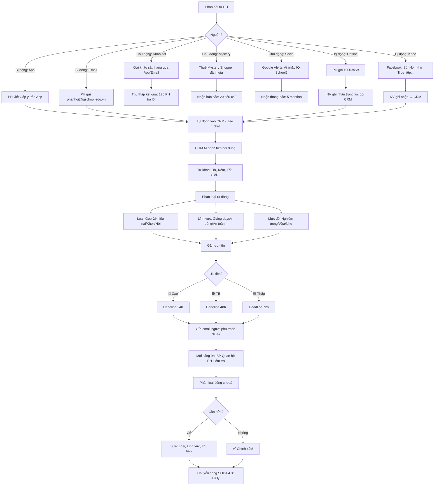

# SOP-04.2: THU THẬP VÀ PHÂN LOẠI PHẢN HỒI

## 1. THÔNG TIN QUY TRÌNH

| **Thuộc tính** | **Nội dung** |
|---|---|
| Mã SOP | SOP-04.2 |
| Tên quy trình | Thu thập và phân loại phản hồi |
| Quy trình cha | SOP-04: Tiếp nhận phản hồi |
| Phiên bản | 1.0 |
| Tần suất | Liên tục (24/7) |

## 2. MỤC ĐÍCH

- **Thu thập đầy đủ**: Không bỏ sót phản hồi nào
- **Phân loại chính xác**: Xử lý đúng người, Đúng thời gian
- **Ưu tiên hợp lý**: Vấn đề nghiêm trọng → Xử lý trước!
- **Phân tích được**: Biết PH phản hồi gì nhiều → Cải thiện!

## 3. PHẠM VI ÁP DỤNG

Tất cả phản hồi từ PH (Qua mọi kênh)

## 4. PHÂN LOẠI PHẢN HỒI

### 4.1. Theo tính chất (4 loại)

```
╔══════════════════════════════════════════════════════════════════╗
║           4 LOẠI PHẢN HỒI                                       ║
╠══════════════════════════════════════════════════════════════════╣
║ 1. GÓP Ý (50% phản hồi):                                         ║
║    Định nghĩa: PH đề xuất cải thiện (Xây dựng!)                  ║
║                                                                  ║
║    VD:                                                           ║
║    • "Nên có thêm lớp STEM!"                                     ║
║    • "Đồ ăn nên đa dạng hơn!"                                    ║
║    • "Sân chơi nên có thêm xích đu!"                             ║
║                                                                  ║
║    XỬ LÝ:                                                        ║
║    • Ưu tiên: 🟠 TRUNG BÌNH (48h)                               ║
║    • Cảm ơn PH → Xem xét → Thực hiện (Nếu hợp lý!)               ║
╠══════════════════════════════════════════════════════════════════╣
║ 2. KHIẾU NẠI (30% phản hồi):                                     ║
║    Định nghĩa: PH không hài lòng, Yêu cầu giải quyết!            ║
║                                                                  ║
║    VD:                                                           ║
║    • "GV không quan tâm con em!"                                 ║
║    • "Đồ ăn dở, Con không ăn!"                                   ║
║    • "Học phí tăng quá cao!"                                     ║
║                                                                  ║
║    XỬ LÝ:                                                        ║
║    • Ưu tiên: 🔴 CAO (24h - Nghiêm trọng!)                      ║
║    • Xin lỗi → Điều tra → Giải quyết → Báo cáo PH                ║
╠══════════════════════════════════════════════════════════════════╣
║ 3. KHEN NGỢI (15% phản hồi):                                     ║
║    Định nghĩa: PH hài lòng, Cảm ơn!                              ║
║                                                                  ║
║    VD:                                                           ║
║    • "Cô X dạy rất tốt! Cảm ơn cô!"                              ║
║    • "Trường rất tốt! Con em rất vui!"                           ║
║                                                                  ║
║    XỬ LÝ:                                                        ║
║    • Ưu tiên: 🟢 THẤP (72h)                                     ║
║    • Cảm ơn PH → Khen GV → Đăng Facebook (Nếu PH cho phép!)      ║
╠══════════════════════════════════════════════════════════════════╣
║ 4. THẮC MẮC (5% phản hồi):                                       ║
║    Định nghĩa: PH hỏi thông tin                                  ║
║                                                                  ║
║    VD:                                                           ║
║    • "Học phí tháng 4 bao nhiêu?"                                ║
║    • "Lớp con em học sách nào?"                                  ║
║                                                                  ║
║    XỬ LÝ:                                                        ║
║    • Ưu tiên: 🟠 TRUNG BÌNH (24h)                               ║
║    • Trả lời ngay! (Đơn giản!)                                   ║
╚══════════════════════════════════════════════════════════════════╝
```

### 4.2. Theo mức độ nghiêm trọng (3 cấp)

```
╔══════════════════════════════════════════════════════════════════╗
║           3 CẤP ĐỘ NGHIÊM TRỌNG                                 ║
╠══════════════════════════════════════════════════════════════════╣
║ CẤP 1: NGHIÊM TRỌNG (10% - 🔴 ƯU TIÊN CAO!):                    ║
║  • An toàn: "HS bị thương!", "Bếp không sạch!"                   ║
║  • Bạo lực: "GV đánh HS!", "HS bị bắt nạt!"                      ║
║  • Tài chính: "Trường thu sai phí!"                              ║
║  • Uy tín: "GV có hành vi không đúng mực!"                       ║
║                                                                  ║
║  XỬ LÝ: TRONG 4H! (Báo HT ngay!)                                 ║
╠══════════════════════════════════════════════════════════════════╣
║ CẤP 2: VỪA PHẢI (60% - 🟠 ưu tiên TB):                          ║
║  • Chất lượng: "GV dạy không hay!", "Đồ ăn nhạt!"                ║
║  • Dịch vụ: "Xe đón muộn!", "Không trả lời điện thoại!"          ║
║  • Cơ sở: "Lớp nóng!", "WC bẩn!"                                 ║
║                                                                  ║
║  XỬ LÝ: TRONG 24-48H                                             ║
╠══════════════════════════════════════════════════════════════════╣
║ CẤP 3: NHẸ (30% - 🟢 Ưu tiên thấp):                             ║
║  • Góp ý nhỏ: "Nên có thêm sách!", "Lớp nên trang trí đẹp hơn!"  ║
║  • Khen: "Cô X dạy tốt!"                                         ║
║  • Hỏi: "Lịch nghỉ Tết thế nào?"                                 ║
║                                                                  ║
║  XỬ LÝ: TRONG 72H                                                ║
╚══════════════════════════════════════════════════════════════════╝
```

### 4.3. Theo lĩnh vực (8 lĩnh vực)

```
╔══════════════════════════════════════════════════════════════════╗
║           PHÂN LOẠI THEO LĨNH VỰC                               ║
╠══════════════════════════════════════════════════════════════════╣
║ 1. GIẢNG DẠY (30%):                                              ║
║    • GV dạy, Chương trình, Học liệu...                           ║
║    • VD: "Cô X dạy tốt!", "Sách khó quá!"                        ║
║    • Chuyển: GVCN (Nếu riêng lớp) hoặc Phó HT (Chung)            ║
╠══════════════════════════════════════════════════════════════════╣
║ 2. ĂN UỐNG (20%):                                                ║
║    • Đồ ăn, Bếp, Dinh dưỡng...                                   ║
║    • VD: "Đồ ăn ngon!", "Canh mặn!"                              ║
║    • Chuyển: Phụ trách Bếp                                       ║
╠══════════════════════════════════════════════════════════════════╣
║ 3. AN TOÀN (15%):                                                ║
║    • PCCC, Bảo vệ, Y tế...                                       ║
║    • VD: "HS bị thương!", "Bảo vệ thiếu!"                        ║
║    • Chuyển: Phụ trách An toàn → Báo HT (Nếu nghiêm trọng!)      ║
╠══════════════════════════════════════════════════════════════════╣
║ 4. CƠ SỞ VẬT CHẤT (10%):                                         ║
║    • Phòng học, Sân, WC, Điều hòa...                             ║
║    • VD: "Lớp nóng!", "WC bẩn!"                                  ║
║    • Chuyển: Phụ trách CSVC                                      ║
╠══════════════════════════════════════════════════════════════════╣
║ 5. TÀI CHÍNH (10%):                                              ║
║    • Học phí, Thu chi, Hoàn phí...                               ║
║    • VD: "Tại sao tháng này đóng 6M?"                            ║
║    • Chuyển: Kế toán                                             ║
╠══════════════════════════════════════════════════════════════════╣
║ 6. XE ĐƯA ĐÓN (5%):                                              ║
║    • Tài xế, Tuyến xe, Đón muộn...                               ║
║    • VD: "Xe đón muộn 30 phút!"                                  ║
║    • Chuyển: Phụ trách Xe                                        ║
╠══════════════════════════════════════════════════════════════════╣
║ 7. GVCN (5%):                                                    ║
║    • GVCN chăm sóc, Liên lạc...                                  ║
║    • VD: "Cô không trả lời tin nhắn!"                            ║
║    • Chuyển: GVCN (Nếu nhẹ) hoặc Phó HT (Nếu nặng)               ║
╠══════════════════════════════════════════════════════════════════╣
║ 8. KHÁC (5%):                                                    ║
║    • Không thuộc 7 lĩnh vực trên                                 ║
║    • Chuyển: BP Quan hệ PH (Xử lý chung)                         ║
╚══════════════════════════════════════════════════════════════════╝
```

## 5. QUY TRÌNH THU THẬP

### 5.1. Thu thập chủ động (Proactive)

**A. Khảo sát định kỳ (Mỗi tháng):**

```
═══════════════════════════════════════════════════════
    KHẢO SÁT HÀI LÒNG THÁNG 3/2025
    (Gửi qua Email + App)
═══════════════════════════════════════════════════════

Kính chào quý PH,

Vui lòng dành 2 phút đánh giá IQ School tháng 3!

[Link khảo sát]

CÂU HỎI:

1. Quý vị hài lòng về Giảng dạy?
   ⭐ ⭐ ⭐ ⭐ ⭐ (1-5 sao)

2. Quý vị hài lòng về Ăn uống?
   ⭐ ⭐ ⭐ ⭐ ⭐

3. Quý vị hài lòng về An toàn?
   ⭐ ⭐ ⭐ ⭐ ⭐

4. Quý vị hài lòng về Cơ sở?
   ⭐ ⭐ ⭐ ⭐ ⭐

5. Quý vị hài lòng về GVCN?
   ⭐ ⭐ ⭐ ⭐ ⭐

6. NPS: Quý vị có giới thiệu IQ cho bạn bè? (0-10)
   0 1 2 3 4 5 6 7 8 9 10

7. Góp ý khác? (Tùy chọn)
   [_________________________________]

[Nút: GỬI]

Cảm ơn quý vị!
═══════════════════════════════════════════════════════

TỶ LỆ TRẢ LỜI: 35-40% (175-200 PH/500)

KẾT QUẢ:
• Giảng dạy: 4.2/5 ✅
• Ăn uống: 3.8/5 ⚠️ (Thấp nhất!)
• An toàn: 4.5/5 ✅
• Cơ sở: 4.3/5 ✅
• GVCN: 4.0/5 ✅
• NPS: 7.2/10 ✅

PHÂN TÍCH:
• ĂN UỐNG thấp nhất (3.8) → Ưu tiên cải thiện!
• 50 PH góp ý: "Đồ ăn nhạt, Ít rau..."
  → Hành động: Thay đầu bếp, Thực đơn đa dạng hơn!
```

**B. Mystery Shopping (Khách hàng bí mật - 1 quý/lần):**

```
THUÊ: Công ty Mystery Shopping

NHIỆM VỤ:
• Giả làm PH mới → Đến tham quan trường
• Đánh giá:
  - Bảo vệ: Thái độ? Hướng dẫn?
  - Tư vấn viên: Nhiệt tình? Chuyên nghiệp?
  - GVCN: Thân thiện?
  - Cơ sở: Sạch? Đẹp?
  
→ Báo cáo: 20 tiêu chí (Mỗi tiêu chí 1-5 sao)

KẾT QUẢ (Quý 1/2025):
• Bảo vệ: 4/5 (Tốt!)
• Tư vấn viên: 3.5/5 (TB - Cần đào tạo!)
• GVCN: 4.5/5 (Rất tốt!)
• Cơ sở: 4/5 (Tốt!)

→ Hành động: Đào tạo Tư vấn viên!
```

**C. Social Listening (Lắng nghe mạng xã hội):**

```
CÔNG CỤ: Google Alerts, Social Mention...

THEO DÕI:
• Từ khóa: "IQ School", "Trường IQ"
• Mỗi khi ai đó nhắc trên Facebook, Blog, Forum...
  → Nhận thông báo ngay!

VD:
15/03, 10:30 - PH B đăng Facebook cá nhân:
"Hôm nay đưa con đến IQ School.
 Trường đẹp, GV nhiệt tình!
 Hài lòng! 😊"

→ Nhận thông báo ngay!
→ Like, Comment: "Cảm ơn quý vị! 💙"

HOẶC:

15/03, 14:00 - PH C đăng Group "Mẹ Hà Nội":
"Trường IQ dạy kém, GV không quan tâm!"

→ Nhận thông báo!
→ Inbox riêng: "Quý vị, Em xin lỗi! Vấn đề gì ạ?"
→ Giải quyết!

→ Mục đích: Phát hiện phản hồi (Cả tích cực + tiêu cực!)
```

### 5.2. Thu thập bị động (Passive)

**A. PH tự phản hồi (Qua kênh đã thiết lập):**

```
PH tự viết:
• App: 75 phản hồi/tháng
• Email: 30 phản hồi/tháng
• Hotline: 22 phản hồi/tháng
• Facebook: 15 phản hồi/tháng
• Sổ: 5 phản hồi/tháng
• Trực tiếp: 2 phản hồi/tháng
• Hòm thư: 1 phản hồi/tháng

TỔNG: 150 phản hồi/tháng (30% PH phản hồi!)

→ CRM tự động ghi nhận hết!
```

## 6. QUY TRÌNH PHÂN LOẠI

### 6.1. Phân loại tự động (AI/CRM)

```
CRM NHẬN PHẢN HỒI:

Nội dung: "Đồ ăn hôm nay dở, Con em không ăn!"

CRM PHÂN TÍCH (AI):
• Từ khóa: "Dở", "Không ăn" → Tiêu cực!
• Chủ đề: "Đồ ăn" → Lĩnh vực: ĂN UỐNG
• Loại: KHIẾU NẠI (Vì tiêu cực!)
• Mức độ: 🟠 VỪA PHẢI (Không đe dọa an toàn)

→ TỰ ĐỘNG GẮN NHÃN:
  • Loại: Khiếu nại
  • Lĩnh vực: Ăn uống
  • Ưu tiên: 🟠 TB (48h)
  • Chuyển: Phụ trách Bếp + BP Quan hệ PH

→ Gửi email thông báo:
"Bạn có 1 khiếu nại mới (Ăn uống)
 Deadline: 17/03, 10:30
 [Link xem]"
```

### 6.2. Kiểm tra thủ công (Manual Review)

```
BP Quan hệ PH xem lại (Mỗi sáng 9h):

• CRM phân loại đúng không?
  VD: CRM gắn "Góp ý", Nhưng đọc kỹ → Thực chất là "Khiếu nại"!
  → Sửa lại: "Khiếu nại", Ưu tiên 🔴 CAO!

• Ưu tiên đúng không?
  VD: CRM gắn 🟠 TB, Nhưng nội dung rất nghiêm trọng!
  → Sửa: 🔴 CAO!

→ Mục đích: CRM không hoàn hảo! Cần con người kiểm tra!
```

## 7. LƯU ĐỒ QUY TRÌNH



## 8. BIỂU MẪU LIÊN QUAN

| **Mã** | **Tên** |
|---|---|
| QT07-KS02 | Khảo sát hài lòng tháng (Form) |
| QT07-BC11 | Báo cáo phản hồi tháng |
| QT07-TK01 | Thống kê phản hồi (Theo loại, Lĩnh vực...) |

## 9. TIÊU CHUẨN VÀ CHỈ TIÊU

| **Chỉ tiêu** | **Mục tiêu** |
|---|---|
| Tỷ lệ phản hồi được ghi nhận (Vào CRM) | 100% |
| Độ chính xác phân loại tự động (AI) | ≥85% |
| Thời gian phân loại (1 phản hồi) | ≤1 phút (Tự động!) |
| Tỷ lệ PH phản hồi mỗi tháng | ≥30% |

## 10. TRÁCH NHIỆM CỤ THỂ

| **Vai trò** | **Trách nhiệm** |
|---|---|
| **PH** | Phản hồi qua kênh (App, Email, Hotline...) |
| **CRM (Hệ thống)** | Thu thập, Phân loại tự động |
| **BP Quan hệ PH** | Kiểm tra phân loại, Điều chỉnh (Nếu sai) |
| **IT** | Bảo trì CRM, Tích hợp các kênh |

## 11. LƯU Ý QUAN TRỌNG

- ⚠️ **Không bỏ sót**: Mọi phản hồi đều quan trọng! (Kể cả Hòm thư!)
- ✅ **Tự động hóa**: AI phân loại → Nhanh! (Thủ công → Chậm!)
- 🔥 **Kiểm tra**: AI không hoàn hảo → Cần con người kiểm tra!
- ✅ **Phân loại đúng**: Sai loại → Xử lý sai người → Chậm!

## 12. PHỤ LỤC

### 12.1. Thống kê phản hồi (Tháng 3)

```
┌────────────────────────────────────────────────────┐
│  THỐNG KÊ PHẢN HỒI - THÁNG 3/2025                 │
├────────────────────────────────────────────────────┤
│ TỔNG: 150 phản hồi                                │
│                                                    │
│ THEO LOẠI:                                         │
│ • Góp ý: 75 (50%)                                  │
│ • Khiếu nại: 45 (30%)                              │
│ • Khen: 22 (15%)                                   │
│ • Hỏi: 8 (5%)                                      │
│                                                    │
│ THEO LĨNH VỰC:                                     │
│ • Giảng dạy: 45 (30%)                              │
│ • Ăn uống: 30 (20%) ⚠️ Nhiều nhất!               │
│ • An toàn: 22 (15%)                                │
│ • CSVC: 15 (10%)                                   │
│ • Tài chính: 15 (10%)                              │
│ • Xe: 8 (5%)                                       │
│ • GVCN: 8 (5%)                                     │
│ • Khác: 7 (5%)                                     │
│                                                    │
│ THEO ƯU TIÊN:                                      │
│ • 🔴 Cao: 15 (10%)                                │
│ • 🟠 TB: 90 (60%)                                 │
│ • 🟢 Thấp: 45 (30%)                               │
│                                                    │
│ THEO KÊNH:                                         │
│ • App: 75 (50%)                                    │
│ • Email: 30 (20%)                                  │
│ • Hotline: 22 (15%)                                │
│ • Facebook: 15 (10%)                               │
│ • Sổ: 5 (3%)                                       │
│ • Trực tiếp: 2 (1%)                                │
│ • Hòm thư: 1 (1%)                                  │
│                                                    │
│ PHÂN TÍCH:                                         │
│ • ĂN UỐNG có nhiều phản hồi nhất (30 - 20%)       │
│   → Vấn đề! Cần cải thiện!                        │
│ • App là kênh chính (75 - 50%)                     │
│   → Tốt! PH dùng App nhiều!                       │
└────────────────────────────────────────────────────┘
```

### 12.2. Ma trận phân loại nhanh

```
╔══════════════════════════════════════════════════════════════════╗
║           MA TRẬN PHÂN LOẠI NHANH                               ║
╠══════════════════════════════════════════════════════════════════╣
║ Nội dung → Loại → Ưu tiên → Deadline → Chuyển                    ║
║                                                                  ║
║ "GV đánh con em!"                                                ║
║ → Khiếu nại → 🔴 Cao → 4h → HT                                  ║
║                                                                  ║
║ "Đồ ăn dở!"                                                      ║
║ → Khiếu nại → 🟠 TB → 24h → Phụ trách Bếp                       ║
║                                                                  ║
║ "Nên có thêm STEM!"                                              ║
║ → Góp ý → 🟠 TB → 48h → Phó HT                                  ║
║                                                                  ║
║ "Cô X dạy tốt!"                                                  ║
║ → Khen → 🟢 Thấp → 72h → GVCN (Để biết, Khen!)                  ║
║                                                                  ║
║ "Học phí tháng 4 bao nhiêu?"                                     ║
║ → Hỏi → 🟠 TB → 24h → Kế toán                                   ║
╚══════════════════════════════════════════════════════════════════╝
```

### 12.3. Mẫu Ticket đầy đủ

```
═══════════════════════════════════════════════════════
    TICKET #PH2025-015
═══════════════════════════════════════════════════════

THÔNG TIN CHUNG:
• Mã: PH2025-015
• Ngày tạo: 15/03/2025, 10:30
• Kênh: App

PHỤ HUYNH:
• Họ tên: Nguyễn Văn A
• SĐT: 0912-xxx-xxx
• Email: nguyenvana@gmail.com
• Con: Nguyễn Văn B, Lớp 3A, GVCN: Cô X

NỘI DUNG:
"Đồ ăn hôm nay dở, Con em không ăn!
 Canh mặn quá, Thịt khô!
 Mong trường cải thiện!"

ẢNH ĐÍNH KÈM:
[Ảnh đồ ăn.jpg - Click để xem]

PHÂN LOẠI:
• Loại: ⚠️ KHIẾU NẠI
• Lĩnh vực: 🍲 ĂN UỐNG
• Mức độ: 🟠 VỪA PHẢI
• Ưu tiên: 🟠 TRUNG BÌNH
• Deadline: 16/03/2025, 10:30 (24h)

PHÂN CÔNG:
• Người phụ trách: Phụ trách Bếp + BP Quan hệ PH
• Thông báo: ✅ Đã gửi email (10:31)

TRẠNG THÁI: 🟡 CHỜ XỬ LÝ

HÀNH ĐỘNG (Timeline):
[15/03, 10:30] Ticket tạo
[15/03, 10:31] Email gửi Phụ trách Bếp
[15/03, 14:00] Phụ trách Bếp kiểm tra → Xác nhận: "Thật sự mặn!"
[15/03, 15:00] Gọi điện PH xin lỗi
[15/03, 16:00] Hành động: Nhắc bếp giảm muối!
[15/03, 17:00] Gửi email PH: "Đã xử lý!"
[16/03, 9:00] PH trả lời: "Cảm ơn!"
[16/03, 9:05] Đóng Ticket ✅

KẾT QUẢ: PH hài lòng! Giải quyết trong 23h! ✅
═══════════════════════════════════════════════════════
```

## 13. FAQ

**Q1: PH phản hồi vô danh (Hòm thư), Không có SĐT. Làm sao phản hồi?**  
A: 
- Nếu nội dung chung (VD: "Đồ ăn dở") → Xử lý, Cải thiện (Không cần phản hồi riêng!)
- Nếu riêng (VD: "Con lớp 3A...") → Tìm PH (Hỏi GVCN), Gọi điện giải thích!

**Q2: AI phân loại sai (50% sai!). Xử lý?**  
A: 
- Đào tạo lại AI (Thêm dữ liệu, Cải thiện thuật toán)
- Hoặc: Phân loại thủ công! (Nếu AI quá tệ!)

**Q3: Quá nhiều phản hồi (300/tháng), Không xử lý nổi. Làm sao?**  
A: 
- Tuyển thêm NV (BP Quan hệ PH: 1 → 2 người)
- Tự động hóa (Chatbot trả lời thắc mắc đơn giản!)
- Ưu tiên (Xử lý 🔴 Cao trước, 🟢 Thấp sau!)

---

**PHÊ DUYỆT**

| BP Quan hệ PH | IT | Phó HT |
|---|---|---|
| [Họ tên] | [Họ tên] | [Họ tên] |
