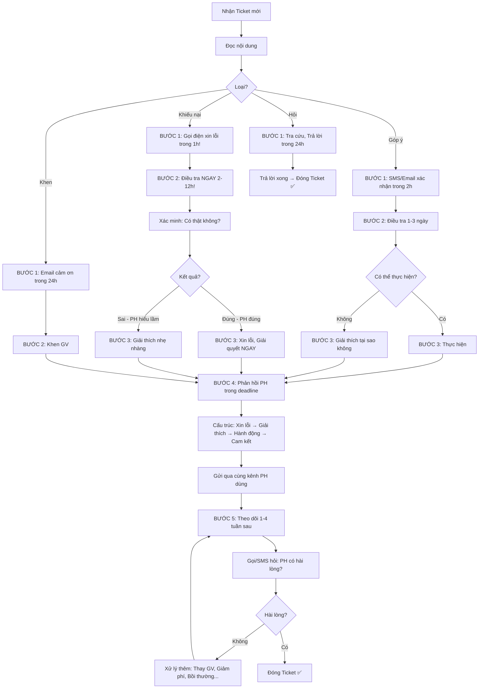

# SOP-04.3: XỬ LÝ VÀ PHẢN HỒI

## 1. THÔNG TIN QUY TRÌNH

| **Thuộc tính** | **Nội dung** |
|---|---|
| Mã SOP | SOP-04.3 |
| Tên quy trình | Xử lý và phản hồi |
| Quy trình cha | SOP-04: Tiếp nhận phản hồi |
| Phiên bản | 1.0 |
| Tần suất | Liên tục (Theo Ticket) |

## 2. MỤC ĐÍCH

- **Giải quyết vấn đề**: PH phản hồi → Trường hành động → Vấn đề được giải quyết!
- **PH hài lòng**: Xử lý nhanh, Đúng cách → PH cảm thấy được lắng nghe
- **Cải thiện**: Khiếu nại → Sửa ngay → Không tái diễn!
- **Xây dựng lòng tin**: PH thấy trường nghiêm túc → Tin tưởng!

## 3. PHẠM VI ÁP DỤNG

Tất cả Ticket (Góp ý, Khiếu nại, Khen, Hỏi)

## 4. QUY TRÌNH XỬ LÝ CHUNG

### 4.1. 5 bước xử lý (Standard Process)

```
╔══════════════════════════════════════════════════════════════════╗
║           5 BƯỚC XỬ LÝ PHẢN HỒI                                 ║
╠══════════════════════════════════════════════════════════════════╣
║ BƯỚC 1: TIẾP NHẬN (Ngay khi nhận Ticket)                         ║
║  • Đọc kỹ: PH phản hồi gì?                                       ║
║  • Xác nhận: "Đã nhận, Đang xử lý!"                              ║
║  • Thời gian: ≤2h (Kể từ khi PH gửi)                             ║
║                                                                  ║
║  VD:                                                             ║
║  PH gửi App (10:30) → BP nhận thông báo (10:31)                  ║
║  → BP gọi điện/SMS PH (12:00 - Trong 2h!):                       ║
║    "Chào quý PH, Em đã nhận góp ý của quý vị!                    ║
║     Em đang xử lý, Sẽ báo quý vị sớm!"                           ║
╠══════════════════════════════════════════════════════════════════╣
║ BƯỚC 2: ĐIỀU TRA (2-12h tùy mức độ)                              ║
║  • Xác minh: Có thật không?                                      ║
║  • Thu thập bằng chứng: Ảnh, Video, Hỏi NV...                    ║
║  • Tìm nguyên nhân gốc: Tại sao xảy ra?                          ║
║                                                                  ║
║  VD: "Đồ ăn dở!"                                                 ║
║  → Phụ trách Bếp kiểm tra: Thật sự mặn? Khô?                     ║
║  → Hỏi đầu bếp: Tại sao? (Cho nhầm muối?)                        ║
║  → Kết luận: Đầu bếp mới, Chưa quen liều lượng!                  ║
╠══════════════════════════════════════════════════════════════════╣
║ BƯỚC 3: GIẢI QUYẾT (Ngay sau điều tra)                           ║
║  • Hành động cụ thể: Sửa lỗi ngay!                               ║
║  • Ngắn hạn: Xử lý triệu chứng (VD: Giảm muối!)                  ║
║  • Dài hạn: Xử lý nguyên nhân gốc (VD: Đào tạo đầu bếp!)         ║
║                                                                  ║
║  VD: "Đồ ăn mặn!"                                                ║
║  → Ngắn hạn: Nhắc bếp giảm muối (Ngay hôm đó!)                   ║
║  → Dài hạn: Đào tạo đầu bếp (Tuần sau), Có quy chuẩn muối!       ║
╠══════════════════════════════════════════════════════════════════╣
║ BƯỚC 4: PHẢN HỒI PH (Trong deadline!)                            ║
║  • Cấu trúc: Xin lỗi → Giải thích → Hành động → Cam kết          ║
║  • Kênh: Cùng kênh PH dùng (PH gửi App → Trả lời App!)           ║
║  • Thời gian: Trong deadline (24h/48h/72h)                       ║
║                                                                  ║
║  VD: (Xem mẫu dưới!)                                             ║
╠══════════════════════════════════════════════════════════════════╣
║ BƯỚC 5: THEO DÕI (1-2 tuần sau)                                  ║
║  • Kiểm tra: PH có hài lòng? Vấn đề có tái diễn?                 ║
║  • Follow-up: Gọi điện/SMS hỏi thăm                              ║
║  • Đóng Ticket: Khi PH hài lòng!                                 ║
║                                                                  ║
║  VD:                                                             ║
║  1 tuần sau: Gọi PH A:                                           ║
║  "Dạ, Tuần này đồ ăn có tốt hơn không ạ?"                        ║
║  PH: "Vâng! Tốt hơn rồi! Cảm ơn!"                                ║
║  → Đóng Ticket ✅                                                ║
╚══════════════════════════════════════════════════════════════════╝
```

## 5. XỬ LÝ THEO TỪNG LOẠI

### 5.1. Xử lý GÓP Ý

```
VD: PH góp ý: "Nên có thêm lớp STEM!"

BƯỚC 1: Tiếp nhận (Trong 2h)
SMS: "Cảm ơn quý vị góp ý!
      Chúng tôi sẽ xem xét!"

BƯỚC 2: Điều tra (1 ngày)
• Hỏi BGH: "Có thể mở lớp STEM không?"
• Hỏi GV: "Có ai dạy STEM không?"
• Ước tính: Chi phí? (Thiết bị, GV...)

BƯỚC 3: Quyết định
• BGH họp: "Đồng ý! Mở lớp STEM (Tháng 4)!"

BƯỚC 4: Phản hồi PH (Trong 48h)
Email:

"Kính chào quý PH,

Cảm ơn quý vị đã góp ý về lớp STEM!

Chúng tôi đã xem xét và QUYẾT ĐỊNH:
✅ MỞ LỚP STEM (Tháng 4/2025!)

Chi tiết:
• Thời gian: Thứ 7, 9h-11h
• Nội dung: Lập trình, Robot...
• GV: Thầy Y (Chứng chỉ STEM quốc tế)
• Học phí: 500K/tháng

Quý vị đăng ký cho con: stem@iqschool.edu.vn

Một lần nữa, Cảm ơn góp ý quý báu!

Trân trọng,
IQ School"

BƯỚC 5: Theo dõi
• 1 tuần sau: Gọi PH: "Quý vị đăng ký STEM chưa ạ?"
• Nếu PH hài lòng → Đóng Ticket ✅
```

### 5.2. Xử lý KHIẾU NẠI

```
VD: PH khiếu nại: "GV không quan tâm con em! Con học yếu mà cô không hỗ trợ!"

BƯỚC 1: Tiếp nhận (NGAY - Trong 1h!)
Gọi điện:
"Chào quý PH,
 Em đã nhận phản hồi của quý vị!
 Em xin lỗi vì điều này!
 Em sẽ kiểm tra và Báo quý vị trong 24h!
 OK không ạ?"

PH: "Được!"

BƯỚC 2: Điều tra (Trong 12h)
• Hỏi GVCN: "Cô có biết con A học yếu không?
             Cô đã hỗ trợ chưa?"
             
GVCN: "Em biết con A yếu. Nhưng em bận quá,
       Chưa hỗ trợ được!"

→ Kết luận: GVCN SAI! (Không làm tròn nhiệm vụ!)

BƯỚC 3: Giải quyết
• Phó HT nhắc nhở GVCN:
  "Cô phải hỗ trợ con A!
   2 buổi/tuần, Báo cáo PH mỗi tuần!
   Nếu không → Kỷ luật!"
   
GVCN: "Vâng! Em sẽ hỗ trợ ngay!"

BƯỚC 4: Phản hồi PH (Trong 24h)
Gọi điện:
"Chào quý PH,
 
 Về vấn đề quý vị phản hồi:
 
 1. XIN LỖI:
    Chúng em xin lỗi vì cô X chưa hỗ trợ con!
 
 2. NGUYÊN NHÂN:
    Cô X bận, Chưa sắp xếp được thời gian!
    (Không phải cô không quan tâm!)
 
 3. HÀNH ĐỘNG:
    Từ tuần này:
    • Cô X sẽ hỗ trợ con 2 buổi/tuần (Miễn phí!)
    • Cô sẽ báo cáo quý vị mỗi tuần!
 
 4. CAM KẾT:
    Nếu 1 tháng con không tiến bộ:
    • Chúng em sẽ thay GVCN!
    • Hoặc Giảm 10% học phí!
 
 Quý vị đồng ý không ạ?"

PH: "Vâng! Cảm ơn!"

BP: "Cảm ơn quý vị đã phản hồi!
     Giúp chúng em cải thiện!"

BƯỚC 5: Theo dõi (Mỗi tuần - 4 tuần)
• Tuần 1: Gọi PH: "Cô X đã hỗ trợ con chưa ạ?"
  PH: "Vâng! Cô hỗ trợ rồi!"
  
• Tuần 2: Gọi: "Con có tiến bộ không ạ?"
  PH: "Có! Con làm bài tốt hơn!"
  
• Tuần 3: Gọi: "Quý vị còn góp ý gì không ạ?"
  PH: "Không! Hài lòng rồi!"
  
• Tuần 4: Gọi: "Tháng này con thế nào ạ?"
  PH: "Tốt! Con tiến bộ nhiều! Cảm ơn cô X!"
  
→ Đóng Ticket ✅ (PH hài lòng!)
```

### 5.3. Xử lý KHEN NGỢI

```
VD: PH khen: "Cô X dạy rất tốt! Con em tiến bộ nhiều! Cảm ơn cô!"

BƯỚC 1: Tiếp nhận
• Đọc → Vui! 😊

BƯỚC 2: Cảm ơn PH (Trong 24h)
Email:
"Kính chào quý PH,

Cảm ơn quý vị đã chia sẻ!
Chúng tôi rất vui khi con tiến bộ!

Cô X là GV tận tâm!
Chúng tôi sẽ chuyển lời cảm ơn của quý vị!

Trân trọng,
IQ School"

BƯỚC 3: Khen GV (Ngay!)
• Phó HT gọi cô X:
  "Cô X ơi, PH A khen cô dạy tốt!
   Giỏi lắm! BGH rất hài lòng!"
   
Cô X: "Cảm ơn BGH!"

• Ghi nhận vào Hồ sơ GV (Phục vụ đánh giá cuối năm!)

BƯỚC 4: Chia sẻ (Nếu PH cho phép)
• Hỏi PH: "Em có thể đăng lên Facebook không ạ?"
• PH đồng ý → Đăng:
  "PH A chia sẻ:
   'Cô X dạy rất tốt! Con em tiến bộ nhiều!'
   Cảm ơn quý vị tin tưởng IQ! 💙"

BƯỚC 5: Đóng Ticket ✅
```

### 5.4. Xử lý THẮC MẮC

```
VD: PH hỏi: "Học phí tháng 4 bao nhiêu?"

BƯỚC 1: Tra cứu (5 phút)
• Hỏi Kế toán: "PH A tháng 4 đóng bao nhiêu?"
• Kế toán: "500K (Học phí) + 300K (Ăn) = 800K"

BƯỚC 2: Trả lời (Trong 24h)
SMS:
"Kính chào quý PH,
 
 Học phí tháng 4:
 • Học phí: 500K
 • Ăn: 300K
 • Tổng: 800K
 
 Đóng trước ngày 5/4 nhé!
 
 IQ School"

BƯỚC 3: Đóng Ticket ✅ (Đơn giản!)
```

## 6. XỬ LÝ KHIẾU NẠI ĐẶC BIỆT

### 6.1. Khiếu nại nghiêm trọng (🔴 CAO)

```
═══════════════════════════════════════════════════════
    CASE: GV ĐÁNH HỌC SINH!
═══════════════════════════════════════════════════════

10:30 - PH gửi App:
"GV X đánh con em! Con khóc suốt! Tôi rất tức giận!"
[Ảnh: Tay con bầm tím]

10:31 - CRM cảnh báo: 🔴 NGHIÊM TRỌNG!
→ Email HT, Phó HT, BP Quan hệ PH NGAY!

10:35 - BP gọi điện PH (TRONG 5 PHÚT!):
"Chào quý PH,
 Em đã nhận phản hồi!
 Em XIN LỖI SÂU SẮC!
 
 BGH đang họp khẩn!
 Em sẽ báo quý vị trong 4h!
 Quý vị vui lòng đợi!"

10:40 - HỌP KHẨN BGH (10 phút):
• HT: "Điều tra ngay!"
• Phó HT: "Vâng!"

11:00 - Phó HT điều tra:
• Hỏi GV X: "Cô có đánh HS không?"
  GV X: "Có! Vì con nghịch quá! Em đánh nhẹ thôi!"
  
• Xem Camera: (Xác nhận: GV X đánh HS!)

• Kết luận: GV X VI PHẠM NGHIÊM TRỌNG!

12:00 - BGH họp quyết định:
• ĐÌNH CHỈ GV X (Ngay!)
• Xin lỗi PH + Bồi thường 5M
• Báo Sở GD (Nếu PH yêu cầu!)

13:00 - Phó HT gọi PH (Trong 4h - Đúng hứa!):
"Chào quý PH,
 
 Chúng tôi đã điều tra!
 XÁC NHẬN: GV X có đánh con! (Xem Camera!)
 
 CHÚNG TÔI XIN LỖI SÂU SẮC!
 
 HÀNH ĐỘNG:
 1. ĐÌNH CHỈ GV X (Ngay hôm nay!)
 2. Bồi thường quý vị: 5M
 3. Thay GVCN mới (Cô Y - Tốt hơn!)
 4. Cam kết: KHÔNG tái diễn!
 
 Quý vị có chấp nhận không ạ?"

PH: "Vâng! Cảm ơn trường xử lý nhanh!"

14:00 - Gửi email chính thức (Văn bản):
[Chi tiết như trên + Giấy bồi thường 5M]

15:00 - THỰC HIỆN:
• GV X về nhà (Sa thải!)
• Cô Y nhận lớp (Ngay!)
• Chuyển 5M cho PH (Trong ngày!)

1 TUẦN SAU:
• Gọi PH: "Con có ổn không ạ? Cô Y thế nào?"
PH: "Tốt! Con thích cô Y!"

2 TUẦN SAU:
• Gọi PH: "Mọi thứ OK không ạ?"
PH: "Vâng! Hài lòng rồi!"

→ Đóng Ticket ✅

KẾT QUẢ:
• Giải quyết: 3.5h (Rất nhanh!)
• PH hài lòng: ✅
• Bài học: Đào tạo GV về Kỷ luật tích cực (Không đánh HS!)
═══════════════════════════════════════════════════════
```

### 6.2. Khiếu nại vừa phải (🟠 TB)

```
VD: "Đồ ăn nhạt, Con không ăn!"

XỬ LÝ (Chi tiết ở Mục 4.1 - 5 bước)

MẪU PHẢN HỒI (Email):

Subject: Đã xử lý góp ý của quý vị!

Kính chào quý PH Nguyễn Văn A,

Cảm ơn quý vị đã phản hồi về đồ ăn!

1. XIN LỖI:
   Chúng tôi xin lỗi vì bữa ăn hôm 15/03 không đạt!

2. NGUYÊN NHÂN:
   Đầu bếp mới, Chưa quen liều lượng muối!

3. HÀNH ĐỘNG:
   • Đã nhắc nhở đầu bếp (Ngay 15/03!)
   • Hôm nay (16/03): Đồ ăn đã tốt hơn!
   • Tuần sau: Đào tạo đầu bếp, Có quy chuẩn!

4. CAM KẾT:
   Tháng 4: Chất lượng đồ ăn sẽ tốt hơn!
   Nếu quý vị vẫn không hài lòng → Miễn phí ăn 1 tháng!

Mọi thắc mắc, Liên hệ: 1900-xxxx

Trân trọng,
Ban Quan hệ PH

---

1 TUẦN SAU: Gọi điện follow-up!
```

### 6.3. Khiếu nại không có cơ sở (PH hiểu lầm)

```
VD: PH khiếu nại: "Tháng này sao đóng 1.2M? Hợp đồng chỉ 500K!"

BƯỚC 1: Tiếp nhận
BƯỚC 2: Điều tra
• Hỏi Kế toán: "PH A đóng đúng không?"
• Kế toán: "Đúng! 500K (Học phí) + 300K (Ăn) + 400K (Xe) = 1.2M"
• Kết luận: PH HIỂU LẦM! (Quên phí ăn, xe!)

BƯỚC 3: Giải thích (Nhẹ nhàng!)
Gọi điện:
"Chào quý PH,
 
 Em đã kiểm tra!
 Quý vị đóng: 500K + 300K (Ăn) + 400K (Xe) = 1.2M
 
 Đúng hợp đồng ạ! (Em gửi hợp đồng cho quý vị xem lại!)
 
 Có lẽ quý vị quên phí ăn, xe!
 
 Quý vị có thắc mắc gì không ạ?"

PH: "À! Em quên mất! Xin lỗi!"

BP: "Không sao ạ! Mọi thắc mắc, Liên hệ em nhé!"

BƯỚC 4: Gửi email (Hợp đồng, Chi tiết phí)
BƯỚC 5: Đóng Ticket ✅ (PH đã hiểu!)

→ KHÔNG: Nói "Quý vị sai!", "Quý vị không đọc kỹ!" (Mất lòng!)
→ NÊN: Giải thích nhẹ nhàng, Gửi chứng từ!
```

## 7. LƯU ĐỒ QUY TRÌNH



## 8. BIỂU MẪU LIÊN QUAN

| **Mã** | **Tên** |
|---|---|
| QT07-XL01 | Mẫu phản hồi (Email, SMS - Theo loại) |
| QT07-BB01 | Biên bản điều tra (Khiếu nại nghiêm trọng) |
| QT07-BT01 | Biên bản bồi thường |

## 9. TIÊU CHUẨN VÀ CHỈ TIÊU

| **Chỉ tiêu** | **Mục tiêu** |
|---|---|
| Thời gian xác nhận (Bước 1) | ≤2h (Khiếu nại: ≤1h!) |
| Thời gian xử lý (Bước 1-4) | ≤Deadline (24h/48h/72h) |
| Tỷ lệ PH hài lòng (Sau xử lý) | ≥85% |
| Tỷ lệ khiếu nại được giải quyết | 100% |

## 10. TRÁCH NHIỆM CỤ THỂ

| **Vai trò** | **Trách nhiệm** |
|---|---|
| **BP Quan hệ PH** | Điều phối, Xử lý, Phản hồi PH |
| **Người được phân công** | Điều tra, Giải quyết (GVCN, Bếp, CSVC...) |
| **HT** | Quyết định (Nếu nghiêm trọng: Sa thải, Bồi thường...) |
| **Kế toán** | Xử lý bồi thường (Nếu có) |

## 11. LƯU Ý QUAN TRỌNG

- ⚠️ **Nhanh**: PH phản hồi → Xác nhận NGAY (≤2h)! Chậm → PH giận hơn!
- ✅ **Xin lỗi chân thành**: Dù đúng/sai, Xin lỗi trước! (Hạ nhiệt!)
- 🔥 **Hành động thực**: Không chỉ nói! PHẢI làm!
- ✅ **Follow-up**: Giải quyết xong → Gọi lại hỏi! (PH cảm động!)

## 12. PHỤ LỤC

### 12.1. Thống kê xử lý (Tháng 3)

```
┌────────────────────────────────────────────────────┐
│  THỐNG KÊ XỬ LÝ PHẢN HỒI - THÁNG 3               │
├────────────────────────────────────────────────────┤
│ TỔNG: 150 Ticket                                  │
│                                                    │
│ ĐÃ ĐÓNG: 140 (93%) ✅                            │
│ ĐANG XỬ LÝ: 8 (5%)                                │
│ QUÁ HẠN: 2 (1%) ⚠️                               │
│                                                    │
│ THỜI GIAN XỬ LÝ TB:                                │
│ • 🔴 Cao: 8h (Mục tiêu ≤24h) ✅                  │
│ • 🟠 TB: 30h (Mục tiêu ≤48h) ✅                  │
│ • 🟢 Thấp: 50h (Mục tiêu ≤72h) ✅                │
│                                                    │
│ PH HÀI LÒNG (Sau xử lý):                           │
│ • Rất hài lòng: 90 (64%)                           │
│ • Hài lòng: 40 (29%)                               │
│ • Chưa hài lòng: 10 (7%) ⚠️                       │
│                                                    │
│ → 7% chưa hài lòng: Xử lý lại!                    │
└────────────────────────────────────────────────────┘
```

### 12.2. Top 10 vấn đề thường gặp

```
TOP 10 PHẢN HỒI THÁNG 3 (Xếp theo số lượng):

1. Đồ ăn (30 phản hồi):
   • "Nhạt", "Mặn", "Ít rau"...
   → Hành động: Cải thiện thực đơn!

2. GV chưa hỗ trợ HS yếu (20):
   → Hành động: Nhắc GV, Phụ đạo miễn phí!

3. Lớp nóng (15):
   → Hành động: Bật điều hòa sớm hơn!

4. Xe đón muộn (12):
   → Hành động: Thay tài xế, Tối ưu tuyến!

5. GVCN không trả lời tin nhắn (10):
   → Hành động: Quy định GVCN phải trả lời trong 24h!

6. Học phí tăng (8):
   → Giải thích: Do lạm phát, Chi phí tăng!

7. Sân chơi thiếu (8):
   → Hành động: Mua thêm đồ chơi (5M)!

8. WC bẩn (7):
   → Hành động: Tăng tần suất dọn (3 lần/ngày → 5 lần)!

9. Khen cô X (5):
   → Hành động: Khen cô X!

10. Thắc mắc lịch nghỉ Tết (5):
    → Trả lời!

PHÂN TÍCH:
• ĂN UỐNG (30) chiếm nhiều nhất → Ưu tiên số 1!
• Hành động: Thay đầu bếp, Đào tạo, Khảo sát PH về thực đơn!
```

## 13. FAQ

**Q1: PH khiếu nại, Nhưng không đúng sự thật. Xử lý?**  
A: 
- Giải thích nhẹ nhàng (Có bằng chứng: Ảnh, Video, Camera...)
- KHÔNG nói: "Quý vị nói dối!"
- NÊN: "Có lẽ quý vị hiểu lầm! Thực tế là..."

**Q2: Xử lý xong, Nhưng PH vẫn không hài lòng. Làm gì?**  
A: 
- Gặp trực tiếp (Trao đổi sâu hơn!)
- HT gặp (Nếu cần!)
- Ưu đãi: Giảm học phí, Bồi thường...
- Cuối cùng: Chấp nhận! (Không thể làm hài lòng 100% PH!)

**Q3: Quá nhiều khiếu nại (100/tháng). Xử lý?**  
A: 
- Tìm nguyên nhân gốc: Vấn đề lớn nào? (Đồ ăn? GV? CSVC?)
- Giải quyết gốc! (Không xử lý từng case!)
- VD: 50 khiếu nại về đồ ăn → Thay đầu bếp! (1 lần giải quyết hết!)

---

**PHÊ DUYỆT**

| BP Quan hệ PH | Phó HT | Hiệu trưởng |
|---|---|---|
| [Họ tên] | [Họ tên] | [Họ tên] |
