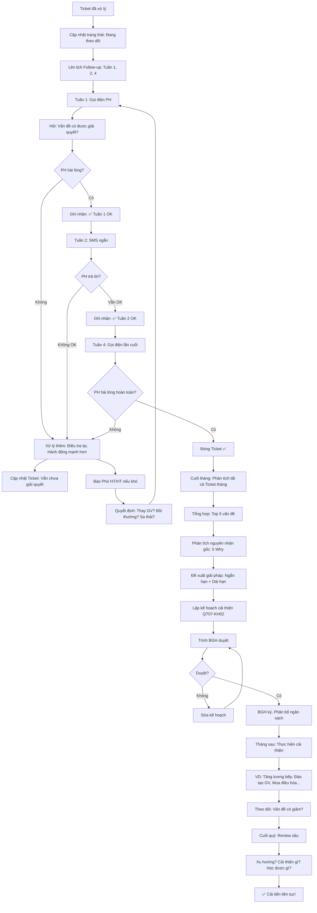

# SOP-04.4: THEO DÕI VÀ CẢI THIỆN

## 1. THÔNG TIN QUY TRÌNH

| **Thuộc tính** | **Nội dung** |
|---|---|
| Mã SOP | SOP-04.4 |
| Tên quy trình | Theo dõi và cải thiện |
| Quy trình cha | SOP-04: Tiếp nhận phản hồi |
| Phiên bản | 1.0 |
| Tần suất | Liên tục (Sau khi xử lý) + Review tháng/quý |

## 2. MỤC ĐÍCH

- **Đảm bảo hiệu quả**: Xử lý rồi → Vấn đề có thật sự được giải quyết?
- **PH hài lòng**: Follow-up → PH cảm thấy được quan tâm!
- **Tránh tái diễn**: Nguyên nhân gốc được xử lý → Không lặp lại!
- **Cải thiện liên tục**: Phân tích xu hướng → Cải tiến hệ thống!

## 3. PHẠM VI ÁP DỤNG

Tất cả Ticket đã xử lý (Đặc biệt: Khiếu nại)

## 4. QUY TRÌNH THEO DÕI

### 4.1. Follow-up ngắn hạn (1-4 tuần sau khi xử lý)

```
╔══════════════════════════════════════════════════════════════════╗
║           LỊCH FOLLOW-UP                                        ║
╠══════════════════════════════════════════════════════════════════╣
║ VD: Ticket #PH2025-015 (Khiếu nại: "Đồ ăn dở!")                 ║
║     Đã xử lý: 16/03 (Nhắc bếp, Cải thiện!)                       ║
╠══════════════════════════════════════════════════════════════════╣
║ TUẦN 1 (23/03 - 1 tuần sau xử lý):                               ║
║  • Gọi điện PH A:                                                ║
║    "Chào quý PH,                                                 ║
║     Tuần này đồ ăn có tốt hơn không ạ?"                          ║
║                                                                  ║
║  • PH: "Vâng! Tốt hơn rồi! Cảm ơn!"                              ║
║  • BP: "Em rất vui! Quý vị còn góp ý gì không ạ?"                ║
║  • PH: "Không! OK rồi!"                                          ║
║                                                                  ║
║  → Ghi nhận CRM: "Tuần 1 - PH hài lòng!"                         ║
╠══════════════════════════════════════════════════════════════════╣
║ TUẦN 2 (30/03):                                                  ║
║  • SMS ngắn:                                                     ║
║    "Quý PH A, Đồ ăn tuần này OK không ạ?                         ║
║     Góp ý: 1900-xxxx. IQ School"                                 ║
║                                                                  ║
║  • PH trả lời SMS: "OK!"                                         ║
║  → Ghi nhận: "Tuần 2 - PH hài lòng!"                             ║
╠══════════════════════════════════════════════════════════════════╣
║ TUẦN 3 (06/04):                                                  ║
║  • Không liên hệ (Tránh quấy rầy!)                               ║
║  • Chỉ theo dõi: PH có phản hồi lại không?                       ║
║    → Không → Tốt! (Đã ổn!)                                      ║
╠══════════════════════════════════════════════════════════════════╣
║ TUẦN 4 (13/04 - 1 tháng sau):                                    ║
║  • Gọi điện lần cuối:                                            ║
║    "Quý PH A,                                                    ║
║     1 tháng qua đồ ăn thế nào ạ?"                                ║
║                                                                  ║
║  • PH: "Tốt! Không vấn đề gì!"                                   ║
║  • BP: "Tuyệt! Cảm ơn quý vị đã góp ý!                           ║
║         Giúp chúng em cải thiện!"                                ║
║                                                                  ║
║  → ĐÓNG TICKET ✅ (Hoàn toàn giải quyết!)                        ║
╚══════════════════════════════════════════════════════════════════╝
```

### 4.2. Theo dõi dài hạn (3-6 tháng)

```
THEO DÕI XU HƯỚNG:

THÁNG 3:
• 30 khiếu nại về Ăn uống
• Đã xử lý: Thay đầu bếp, Cải thiện thực đơn

THÁNG 4:
• 20 khiếu nại về Ăn uống (Giảm 33%!) ✅
• Vẫn còn! Chưa hết!

THÁNG 5:
• 10 khiếu nại về Ăn uống (Giảm thêm 50%!) ✅
• Tốt hơn nhiều!

THÁNG 6:
• 5 khiếu nại về Ăn uống (Giảm thêm 50%!) ✅
• Gần như hết!

KẾT LUẬN:
• Cải thiện THÀNH CÔNG! (30 → 5, Giảm 83%!)
• Hành động đúng! (Thay đầu bếp hiệu quả!)
• Duy trì: Theo dõi tiếp! (Tránh tái diễn!)
```

## 5. CẢI THIỆN HỆ THỐNG

### 5.1. Phân tích nguyên nhân gốc (Root Cause Analysis)

```
╔══════════════════════════════════════════════════════════════════╗
║           5 WHY (5 TẠI SAO?)                                    ║
╠══════════════════════════════════════════════════════════════════╣
║ VẤN ĐỀ: 30 PH khiếu nại "Đồ ăn dở!" (Tháng 3)                   ║
║                                                                  ║
║ WHY 1: Tại sao đồ ăn dở?                                         ║
║ → Vì: Mặn, Khô                                                   ║
║                                                                  ║
║ WHY 2: Tại sao mặn, Khô?                                         ║
║ → Vì: Đầu bếp cho muối, Nước nhiều                               ║
║                                                                  ║
║ WHY 3: Tại sao đầu bếp cho nhiều?                                ║
║ → Vì: Đầu bếp mới, Chưa quen liều lượng                         ║
║                                                                  ║
║ WHY 4: Tại sao thuê đầu bếp chưa quen?                           ║
║ → Vì: Đầu bếp cũ nghỉ đột ngột, Tuyển vội!                      ║
║                                                                  ║
║ WHY 5: Tại sao đầu bếp cũ nghỉ đột ngột?                         ║
║ → Vì: Lương thấp, Làm việc áp lực!                               ║
║                                                                  ║
║ NGUYÊN NHÂN GỐC: Lương đầu bếp thấp! ✅                          ║
╠══════════════════════════════════════════════════════════════════╣
║ GIẢI PHÁP:                                                       ║
║  • Ngắn hạn: Đào tạo đầu bếp mới (1 tuần)                        ║
║  • Dài hạn: Tăng lương đầu bếp (10M → 12M)                       ║
║              → Giữ đầu bếp giỏi lâu dài!                         ║
║              → Không phải tuyển vội nữa!                         ║
╚══════════════════════════════════════════════════════════════════╝
```

### 5.2. Xây dựng quy chuẩn (Standardization)

```
SAU KHI PHÂN TÍCH:

Vấn đề: Đầu bếp mới không biết liều lượng
→ Giải pháp: Xây dựng QUY CHUẨN!

═══════════════════════════════════════════════════════
    QUY CHUẨN NẤU ĂN - IQ SCHOOL
    (Sau khi có 30 khiếu nại về đồ ăn!)
═══════════════════════════════════════════════════════

MÓN: CANH RONG BIỂN

NGUYÊN LIỆU (50 suất):
• Rong biển: 500g
• Thịt băm: 1kg
• Trứng: 10 quả
• Muối: 50g ✅ (QUY CHUẨN!)
• Nước mắm: 30ml
• Hành: 100g

QUY TRÌNH:
1. Rửa rong biển (5 phút)
2. Luộc nước (10 phút)
3. Cho rong + thịt (5 phút)
4. Nêm: MUỐI 50G (Đúng quy chuẩn!) ✅
5. Trứng, Hành (2 phút)
→ Hoàn thành!

KIỂM TRA:
• Nếm: Mặn vừa? (Không quá mặn, Không nhạt!)
• Nếu sai → Điều chỉnh!

───────────────────────────────────────────────────

→ Tất cả món ăn có Quy chuẩn!
→ Đầu bếp mới làm theo → Không sai!
→ Giảm khiếu nại! ✅
═══════════════════════════════════════════════════════
```

### 5.3. Đào tạo nhân viên (Training)

```
PHÁT HIỆN: 10 khiếu nại "GVCN không trả lời tin nhắn!"

PHÂN TÍCH:
• Nguyên nhân: GVCN không biết phải trả lời trong bao lâu!
• Giải pháp: Đào tạo + Quy định!

HÀNH ĐỘNG:

A. QUY ĐỊNH MỚI:
"GVCN phải trả lời tin nhắn PH trong 24h!
 Vi phạm → Phê bình!"

B. ĐÀO TẠO (1 buổi - 2h):
• Chủ đề: "Kỹ năng giao tiếp với PH"
• Nội dung:
  - Tầm quan trọng (PH = Khách hàng!)
  - Cách trả lời (Lịch sự, Nhanh chóng!)
  - Thực hành (Role play)

C. KIỂM TRA:
• Tháng sau: Còn khiếu nại không?
  → Giảm từ 10 → 2! ✅ Hiệu quả!
```

## 6. CHU TRÌNH PDCA (Cải tiến liên tục)

### 6.1. Áp dụng PDCA cho từng vấn đề

```
╔══════════════════════════════════════════════════════════════════╗
║           CHU TRÌNH PDCA - VẤN ĐỀ ĐỒ ĂN                        ║
╠══════════════════════════════════════════════════════════════════╣
║ P - PLAN (Lập kế hoạch):                                         ║
║  • Vấn đề: 30 khiếu nại "Đồ ăn dở!" (Tháng 3)                    ║
║  • Nguyên nhân gốc (5 Why): Lương đầu bếp thấp!                  ║
║  • Mục tiêu: Giảm khiếu nại xuống ≤5 (Tháng 6)                   ║
║  • Giải pháp:                                                    ║
║    - Ngắn hạn: Đào tạo đầu bếp (1 tuần)                          ║
║    - Dài hạn: Tăng lương 10M → 12M (+20%)                        ║
║    - Xây dựng Quy chuẩn nấu ăn                                   ║
╠══════════════════════════════════════════════════════════════════╣
║ D - DO (Thực hiện):                                              ║
║  • 20/03: Đào tạo đầu bếp (2 ngày)                               ║
║  • 25/03: Tăng lương (12M)                                       ║
║  • 01/04: Ra Quy chuẩn (50 món)                                  ║
║  • Áp dụng từ 01/04!                                             ║
╠══════════════════════════════════════════════════════════════════╣
║ C - CHECK (Kiểm tra):                                            ║
║  • Tháng 4: 20 khiếu nại (Giảm 33%!) ✅                          ║
║  • Tháng 5: 10 khiếu nại (Giảm 50%!) ✅                          ║
║  • Tháng 6: 5 khiếu nại (Giảm 50%!) ✅ ĐẠT MỤC TIÊU!            ║
╠══════════════════════════════════════════════════════════════════╣
║ A - ACT (Hành động):                                             ║
║  • THÀNH CÔNG! → Duy trì:                                        ║
║    - Lương 12M                                                   ║
║    - Quy chuẩn 50 món                                            ║
║    - Đào tạo đầu bếp mới (Khi tuyển)                             ║
║                                                                  ║
║  • Chuẩn hóa: Ghi vào SOP-03 (QT-01 - Quản lý bếp ăn):           ║
║    "Lương đầu bếp ≥12M"                                          ║
║    "Tất cả món có Quy chuẩn"                                     ║
╚══════════════════════════════════════════════════════════════════╝
```

### 6.2. Follow-up từng PH (Cá nhân)

```
TICKET #PH2025-015 (Đồ ăn dở - PH A):

Đã xử lý: 16/03
Trạng thái: 🔵 ĐANG THEO DÕI

LỊCH SỬ FOLLOW-UP:

[23/03 - Tuần 1] Gọi điện
BP: "Đồ ăn tuần này thế nào ạ?"
PH: "Tốt hơn rồi!"
→ Ghi nhận: ✅ Hài lòng

[30/03 - Tuần 2] SMS
BP: "Đồ ăn tuần này OK không ạ?"
PH: "OK!"
→ Ghi nhận: ✅ Hài lòng

[13/04 - Tuần 4] Gọi điện
BP: "1 tháng qua, Con ăn tốt chưa ạ?"
PH: "Vâng! Con ăn ngon! Cảm ơn trường!"
→ Ghi nhận: ✅ Rất hài lòng

[15/04] ĐÓNG TICKET ✅
• Lý do: PH hài lòng hoàn toàn!
• Thời gian xử lý tổng: 30 ngày
• Kết quả: Thành công!
```

## 7. PHÂN TÍCH VÀ CẢI THIỆN

### 7.1. Phân tích tháng (Đầu tháng sau)

```
═══════════════════════════════════════════════════════
    PHÂN TÍCH PHẢN HỒI THÁNG 3/2025
═══════════════════════════════════════════════════════

I. TỔNG QUAN:
• Tổng phản hồi: 150
• Đã xử lý: 140 (93%)
• Đang xử lý: 8 (5%)
• Quá hạn: 2 (1%) ⚠️

II. TOP 5 VẤN ĐỀ:
1. Ăn uống (30 - 20%)
2. GV chưa hỗ trợ HS yếu (20 - 13%)
3. Lớp nóng (15 - 10%)
4. Xe đón muộn (12 - 8%)
5. GVCN không trả lời (10 - 7%)

III. PHÂN TÍCH NGUYÊN NHÂN GỐC:

Vấn đề 1: ĂN UỐNG (30)
• Nguyên nhân: Đầu bếp mới, Lương thấp
• Giải pháp: Tăng lương, Đào tạo, Quy chuẩn
• Deadline: 01/04
• Người thực hiện: Phụ trách Bếp

Vấn đề 2: GV CHƯA HỖ TRỢ HS YẾU (20)
• Nguyên nhân: GV không có thời gian
• Giải pháp: Quy định bắt buộc (2 buổi/tuần)
• Deadline: 25/03
• Người thực hiện: Phó HT

Vấn đề 3-5: ... (Tương tự)

IV. KẾ HOẠCH CẢI THIỆN THÁNG 4:
• Ưu tiên 1: Ăn uống (Tháng 4: Giảm xuống ≤15!)
• Ưu tiên 2: GV hỗ trợ (Giảm xuống ≤10!)
• Ưu tiên 3-5: Xử lý song song

V. NGÂN SÁCH:
• Tăng lương bếp: 2M/tháng × 12 = 24M/năm
• Đào tạo GV: 5M
• Mua điều hòa thêm: 20M
• Tổng: 49M

→ Trình BGH duyệt!

Người lập: BP Quan hệ PH
Duyệt: Phó HT
Ngày: 05/04/2025
═══════════════════════════════════════════════════════
```

### 7.2. Review quý (Sâu hơn)

```
BÁO CÁO QUÝ 1 (Tháng 1-3):

I. XU HƯỚNG:
• Tháng 1: 120 phản hồi
• Tháng 2: 135 phản hồi (Tăng 12%)
• Tháng 3: 150 phản hồi (Tăng 11%)

→ Phản hồi TĂNG! (Tốt hay Xấu?)

PHÂN TÍCH:
• Tăng vì: PH dùng App nhiều hơn! (Dễ phản hồi!)
• Không phải: PH không hài lòng hơn! (NPS vẫn 7.2!)
→ TỐT! ✅

II. TOP 3 VẤN ĐỀ QUÝ 1:
1. Ăn uống: 80 phản hồi (18%)
2. GV chưa hỗ trợ: 50 (11%)
3. Lớp nóng: 40 (9%)

III. ĐÃ CẢI THIỆN GÌ?
✅ Vấn đề 1 (Ăn uống): Đang giải quyết (Tăng lương, Quy chuẩn...)
✅ Vấn đề 2 (GV hỗ trợ): Đã quy định bắt buộc!
✅ Vấn đề 3 (Nóng): Đã mua thêm 5 điều hòa!

IV. KẾT QUẢ (Dự kiến Quý 2):
• Ăn uống: Giảm 80 → 30 (-62%)
• GV hỗ trợ: Giảm 50 → 20 (-60%)
• Lớp nóng: Giảm 40 → 10 (-75%)

→ Quý 2 sẽ tốt hơn nhiều!
```

## 8. LƯU ĐỒ QUY TRÌNH



## 9. BIỂU MẪU LIÊN QUAN

| **Mã** | **Tên** |
|---|---|
| QT07-KH02 | Kế hoạch cải thiện (Theo phản hồi) |
| QT07-5W01 | Phân tích 5 Why (Nguyên nhân gốc) |
| QT07-BC12 | Báo cáo cải thiện (Tháng/Quý) |

## 10. TIÊU CHUẨN VÀ CHỈ TIÊU

| **Chỉ tiêu** | **Mục tiêu** |
|---|---|
| Tỷ lệ Ticket được follow-up | 100% (Khiếu nại bắt buộc!) |
| Tỷ lệ PH hài lòng sau follow-up | ≥90% |
| Tỷ lệ vấn đề tái diễn (Cùng vấn đề) | ≤10% |
| Số vấn đề được cải thiện (Mỗi quý) | ≥3 vấn đề |

## 11. TRÁCH NHIỆM CỤ THỂ

| **Vai trò** | **Trách nhiệm** |
|---|---|
| **BP Quan hệ PH** | Follow-up PH, Phân tích tháng/quý, Lập kế hoạch cải thiện |
| **Phó HT** | Điều phối thực hiện cải thiện, Báo cáo BGH |
| **Người liên quan** | Thực hiện cải thiện (GVCN, Bếp, CSVC...) |
| **BGH** | Duyệt kế hoạch, Phân bổ ngân sách cải thiện |

## 12. LƯU Ý QUAN TRỌNG

- ⚠️ **Follow-up bắt buộc**: Đặc biệt Khiếu nại! (Không xử lý rồi bỏ!)
- ✅ **Xử lý gốc**: Không xử lý triệu chứng! (Tìm nguyên nhân gốc - 5 Why!)
- 🔥 **Hành động thực**: Không chỉ "Hứa"! PHẢI làm!
- ✅ **Cải tiến liên tục**: PDCA! (Plan → Do → Check → Act!)

## 13. PHỤ LỤC

### 13.1. Mẫu lịch Follow-up (1 tháng)

```
┌────────────────────────────────────────────────────┐
│  LỊCH FOLLOW-UP - TICKET #PH2025-015              │
├────────────────────────────────────────────────────┤
│ Vấn đề: Đồ ăn dở                                  │
│ PH: Nguyễn Văn A - 0912-xxx-xxx                   │
│ Đã xử lý: 16/03                                   │
├────────────────────────────────────────────────────┤
│ LỊCH:                                              │
│                                                    │
│ ☑ 23/03 (Tuần 1): Gọi điện                        │
│   Kết quả: PH hài lòng ✅                         │
│                                                    │
│ ☑ 30/03 (Tuần 2): SMS                             │
│   Kết quả: PH trả lời OK ✅                       │
│                                                    │
│ □ 06/04 (Tuần 3): Không liên hệ                   │
│   (Theo dõi thụ động)                              │
│                                                    │
│ □ 13/04 (Tuần 4): Gọi điện lần cuối               │
│   Nếu OK → Đóng Ticket ✅                         │
│                                                    │
│ Người phụ trách: BP Quan hệ PH                    │
└────────────────────────────────────────────────────┘
```

### 13.2. Bảng theo dõi cải thiện (Tracking)

```
╔══════════════════════════════════════════════════════════════════╗
║           BẢNG THEO DÕI CẢI THIỆN                               ║
╠══════════════════════════════════════════════════════════════════╣
║ Vấn đề: ĂN UỐNG                                                  ║
║ Nguyên nhân gốc: Lương thấp → Đầu bếp kém                        ║
║ Giải pháp: Tăng lương 10M → 12M                                  ║
║ Deadline: 01/04                                                  ║
║ Ngân sách: 24M/năm                                               ║
║ Người thực hiện: Phụ trách Bếp                                   ║
║                                                                  ║
║ KẾT QUẢ (Theo tháng):                                            ║
║                                                                  ║
║ | Tháng | Khiếu nại | Mục tiêu | % Giảm | Trạng thái |          ║
║ |-------|-----------|----------|--------|------------|          ║
║ | 3 | 30 | - | - | Baseline |                                   ║
║ | 4 | 20 | ≤25 | -33% | ✅ Đạt |                                ║
║ | 5 | 10 | ≤15 | -50% | ✅ Đạt |                                ║
║ | 6 | 5 | ≤5 | -50% | ✅ Đạt mục tiêu! |                        ║
║                                                                  ║
║ KẾT LUẬN:                                                        ║
║ • THÀNH CÔNG! Giảm 83% (30 → 5) trong 3 tháng!                  ║
║ • Giải pháp HIỆU QUẢ! Duy trì!                                   ║
╚══════════════════════════════════════════════════════════════════╝
```

### 13.3. Case study: Cải thiện thành công

```
═══════════════════════════════════════════════════════
    CASE STUDY: CẢI THIỆN ĐỒ ĂN THÀNH CÔNG
    TRƯỜNG IQ - 2025
═══════════════════════════════════════════════════════

TÌNH HUỐNG (Tháng 3):
• 30/150 phản hồi (20%) về Đồ ăn! ⚠️
• PH phàn nàn: Mặn, Khô, Ít rau...
• CSAT Ăn uống: 3.5/5 (Thấp!)
• Nguy cơ: PH rời bỏ!

PHÂN TÍCH (5 Why):
→ Nguyên nhân gốc: Lương đầu bếp thấp (10M)
  → Đầu bếp giỏi không ở lâu
  → Phải tuyển mới liên tục
  → Đầu bếp mới chưa quen

GIẢI PHÁP (PDCA):
• PLAN: Tăng lương 10M → 12M, Quy chuẩn 50 món
• DO: Thực hiện từ 01/04
• CHECK: Theo dõi tháng 4, 5, 6
• ACT: Duy trì (Nếu thành công!)

KẾT QUẢ (Tháng 6):
• Khiếu nại: 30 → 5 (Giảm 83%!) ✅
• CSAT Ăn uống: 3.5 → 4.2 (Tăng 20%!) ✅
• PH hài lòng: 90% → 95% ✅
• Churn: 8% → 5% (Giảm!) ✅

CHI PHÍ:
• Tăng lương: 24M/năm
• ROI: Giữ được 10 PH (Đã định rời bỏ vì đồ ăn!)
       10 PH × 5M = 50M doanh thu
       ROI = 50M / 24M = 2.08 ✅ Đáng!

BÀI HỌC:
• Đầu tư vào con người! (Tăng lương → Giữ người giỏi!)
• Phản hồi PH = Vàng! (Giúp phát hiện vấn đề sớm!)
• PDCA hiệu quả! (Cải tiến có hệ thống!)
═══════════════════════════════════════════════════════
```

## 14. FAQ

**Q1: Follow-up quá nhiều lần (4 lần/tháng), PH phiền. Xử lý?**  
A: Linh hoạt!
- Nếu Tuần 1 PH đã rất hài lòng → Không cần Tuần 2, 4!
- Nếu vấn đề nhỏ (VD: Hỏi thông tin) → Không cần follow-up!
- Chỉ follow-up: Khiếu nại nghiêm trọng!

**Q2: PH vẫn không hài lòng (Sau 1 tháng theo dõi). Làm gì?**  
A: 
- Gặp trực tiếp (HT gặp!)
- Đề xuất: Giảm học phí 50%, Hoặc Chuyển trường (Hỗ trợ!)
- Cuối cùng: Chấp nhận rời bỏ! (Không ép PH ở lại!)

**Q3: Cải thiện rồi, Nhưng vấn đề lại xuất hiện (Tái diễn). Tại sao?**  
A: 
- Chưa xử lý ĐÚNG nguyên nhân gốc!
- VD: Tăng lương bếp, Nhưng không Quy chuẩn → Vẫn sai!
- Làm lại: 5 Why → Tìm nguyên nhân thật!

---

**PHÊ DUYỆT**

| BP Quan hệ PH | Phó HT | Hiệu trưởng |
|---|---|---|
| [Họ tên] | [Họ tên] | [Họ tên] |
