# SOP-04.5: BÁO CÁO VÀ ĐÁNH GIÁ

## 1. THÔNG TIN QUY TRÌNH

| **Thuộc tính** | **Nội dung** |
|---|---|
| Mã SOP | SOP-04.5 |
| Tên quy trình | Báo cáo và đánh giá |
| Quy trình cha | SOP-04: Tiếp nhận phản hồi |
| Phiên bản | 1.0 |
| Tần suất | Tuần/Tháng/Quý/Năm |

## 2. MỤC ĐÍCH

- **Minh bạch**: BGH thấy rõ PH phản hồi gì, Xử lý thế nào
- **Đo lường hiệu quả**: Hệ thống phản hồi có hoạt động tốt không?
- **Quyết định đúng**: Dựa trên dữ liệu → Cải thiện đúng chỗ!
- **Trách nhiệm**: Ai xử lý tốt/Kém → Khen thưởng/Nhắc nhở

## 3. PHẠM VI ÁP DỤNG

Tất cả hoạt động tiếp nhận và xử lý phản hồi

## 4. HỆ THỐNG BÁO CÁO

### 4.1. Báo cáo tuần (Mỗi thứ 2)

```
═══════════════════════════════════════════════════════
    BÁO CÁO PHẢN HỒI TUẦN 8-14/03/2025
    Mã: QT07-BC13-W11
═══════════════════════════════════════════════════════

I. TỔNG QUAN:
• Tổng phản hồi: 35
• Đã xử lý: 32 (91%)
• Đang xử lý: 3 (9%)
• Quá hạn: 0 ✅

II. THEO LOẠI:
• Góp ý: 18 (51%)
• Khiếu nại: 10 (29%)
• Khen: 5 (14%)
• Hỏi: 2 (6%)

III. THEO LĨNH VỰC:
| Lĩnh vực | Số lượng | % |
|----------|----------|---|
| Ăn uống | 8 | 23% |
| Giảng dạy | 7 | 20% |
| An toàn | 6 | 17% |
| CSVC | 5 | 14% |
| Tài chính | 4 | 11% |
| Xe | 3 | 9% |
| GVCN | 2 | 6% |

IV. THEO ƯU TIÊN:
• 🔴 Cao: 3 (9%)
• 🟠 TB: 22 (63%)
• 🟢 Thấp: 10 (28%)

V. THỜI GIAN XỬ LÝ:
• 🔴 Cao: 6h TB (Mục tiêu ≤24h) ✅
• 🟠 TB: 28h TB (Mục tiêu ≤48h) ✅
• 🟢 Thấp: 55h TB (Mục tiêu ≤72h) ✅

VI. PH HÀI LÒNG:
• Rất hài lòng: 20 (63%)
• Hài lòng: 10 (31%)
• Chưa hài lòng: 2 (6%) ⚠️
  → Ticket #PH2025-020, #025 (Đang xử lý lại!)

VII. HIGHLIGHT:

A. THÀNH CÔNG:
✅ Ticket #PH2025-015 (Đồ ăn): Xử lý nhanh (16h), PH rất hài lòng!
✅ 0 Ticket quá hạn! (Tuần đầu tiên!)
✅ 94% PH hài lòng (Rất tốt!)

B. VẤN ĐỀ:
⚠️ Ăn uống vẫn nhiều (8/35 = 23%)
⚠️ 2 PH chưa hài lòng (#020, #025)

VIII. KẾ HOẠCH TUẦN SAU:
• Xử lý lại 2 Ticket chưa hài lòng
• Tập trung cải thiện Ăn uống (Gặp đầu bếp!)

Người lập: BP Quan hệ PH
Ngày: 15/03/2025
═══════════════════════════════════════════════════════

→ Gửi email Phó HT, HT (Mỗi thứ 2)
```

### 4.2. Báo cáo tháng (Ngày 5 tháng sau)

```
BÁO CÁO THÁNG (Chi tiết hơn Báo cáo tuần):

═══════════════════════════════════════════════════════
    BÁO CÁO PHẢN HỒI THÁNG 3/2025
    Mã: QT07-BC13-M03
═══════════════════════════════════════════════════════

I. TỔNG QUAN:
• Tổng phản hồi: 150 (So với tháng 2: 135, Tăng 11%)
• Đã xử lý: 140 (93%)
• PH hài lòng: 128/140 (91%) ✅

II. TOP 5 VẤN ĐỀ (Chi tiết):

1. ĂN UỐNG (30 phản hồi - 20%):
   Nội dung:
   • "Mặn" (12 PH)
   • "Khô" (8 PH)
   • "Ít rau" (6 PH)
   • "Đa dạng" (4 PH)
   
   Nguyên nhân gốc: Đầu bếp mới, Lương thấp
   
   Giải pháp đã thực hiện:
   • 20/03: Đào tạo đầu bếp (2 ngày)
   • 25/03: Tăng lương 10M → 12M
   • 01/04: Ra Quy chuẩn 50 món
   
   Kết quả dự kiến:
   • Tháng 4: Giảm xuống ≤20 phản hồi

2. GV CHƯA HỖ TRỢ HS YẾU (20 - 13%):
   [Chi tiết tương tự...]

3-5. [Chi tiết tương tự...]

III. PHÂN TÍCH THEO KÊNH:
• App: 75 (50%) - Kênh chính!
• Email: 30 (20%)
• Hotline: 22 (15%)
• ... 

IV. SO SÁNH VỚI THÁNG TRƯỚC:

| Chỉ tiêu | Tháng 2 | Tháng 3 | Thay đổi |
|----------|---------|---------|----------|
| Tổng phản hồi | 135 | 150 | +11% |
| Khiếu nại | 35 | 45 | +29% ⚠️ |
| Thời gian xử lý TB | 32h | 28h | -12% ✅ |
| PH hài lòng | 88% | 91% | +3% ✅ |

→ Khiếu nại TĂNG 29% (Không tốt!)
→ Cần cải thiện gấp!

V. ĐỀ XUẤT:
• Ưu tiên cải thiện Ăn uống (Tháng 4)
• Ngân sách: 49M (Tăng lương, Điều hòa...)
• Deadline: Tháng 6 giảm khiếu nại xuống ≤30

VI. PHỤ LỤC:
• Phụ lục 1: Danh sách 150 Ticket (Excel)
• Phụ lục 2: Chi tiết Top 5 vấn đề (Word)
• Phụ lục 3: Kế hoạch cải thiện (QT07-KH02)

Người lập: BP Quan hệ PH
Duyệt: Phó HT
Trình: HT
Ngày: 05/04/2025
═══════════════════════════════════════════════════════

→ Trình BGH họp (Ngày 10/04)
→ BGH duyệt → Thực hiện!
```

### 4.3. Báo cáo quý (Ngày 10 tháng đầu quý sau)

```
BÁO CÁO QUÝ 1 (Sâu sắc nhất!):

═══════════════════════════════════════════════════════
    BÁO CÁO PHẢN HỒI QUÝ 1/2025 (Tháng 1-3)
    Mã: QT07-BC13-Q1
═══════════════════════════════════════════════════════

I. TỔNG QUAN:
• Tổng phản hồi: 405 (T1: 120, T2: 135, T3: 150)
• Xu hướng: TĂNG đều (+12%/tháng)
• Lý do tăng: PH dùng App nhiều hơn! (Tốt!)

II. PHÂN TÍCH XU HƯỚNG:

A. TOP 3 VẤN ĐỀ QUÝ 1:
1. Ăn uống: 80 (20%)
2. GV chưa hỗ trợ: 50 (12%)
3. Lớp nóng: 40 (10%)

B. XU HƯỚNG TỪNG VẤN ĐỀ:

| Vấn đề | T1 | T2 | T3 | Xu hướng |
|--------|----|----|----| ---------|
| Ăn uống | 20 | 25 | 30 | TĂNG ⚠️ |
| GV hỗ trợ | 15 | 18 | 20 | TĂNG ⚠️ |
| Lớp nóng | 10 | 12 | 15 | TĂNG ⚠️ |

→ Tất cả đều TĂNG! Nguy hiểm!

III. PHÂN TÍCH NGUYÊN NHÂN:
(Dùng 5 Why cho từng vấn đề - Xem SOP-04.4)

IV. ĐÃ CẢI THIỆN GÌ?
✅ Ăn uống: Tăng lương bếp, Quy chuẩn (01/04)
✅ GV hỗ trợ: Quy định bắt buộc (25/03)
✅ Lớp nóng: Mua 5 điều hòa (30/03)

V. DỰ ĐOÁN QUÝ 2:
• Ăn uống: 80 → 30 (-62%)
• GV hỗ trợ: 50 → 20 (-60%)
• Lớp nóng: 40 → 10 (-75%)

→ Quý 2 sẽ tốt hơn NHIỀU!

VI. NGÂN SÁCH ĐÃ CHI (Cải thiện):
• Tăng lương bếp: 24M/năm
• Đào tạo GV: 5M
• Điều hòa: 20M
• Tổng: 49M

VII. ROI CẢI THIỆN:
• Chi: 49M
• Giữ được: 20 PH (Đã định rời bỏ!)
• Doanh thu giữ được: 20 × 5M = 100M
• ROI = 100M / 49M = 2.04 ✅ Đáng!

VIII. KHUYẾN NGHỊ QUÝ 2:
• Theo dõi sát Ăn uống (Có thật sự cải thiện?)
• Đào tạo thêm GV (Kỹ năng hỗ trợ HS)
• Mua thêm 5 điều hòa (Vẫn còn lớp nóng!)

Người lập: BP Quan hệ PH
Duyệt: Phó HT
Trình: HT
Ngày: 10/04/2025
═══════════════════════════════════════════════════════

→ Trình BGH họp Quý (Ngày 15/04)
```

### 4.4. Báo cáo năm (Ngày 15/01 năm sau)

```
BÁO CÁO NĂM 2025 (Tổng thể!):

═══════════════════════════════════════════════════════
    BÁO CÁO PHẢN HỒI NĂM 2025
    Mã: QT07-BC13-2025
═══════════════════════════════════════════════════════

I. TỔNG QUAN:
• Tổng phản hồi: 1,500 (125/tháng TB)
• So với 2024: 1,200 (Tăng 25%)
• Lý do tăng: PH dùng App nhiều hơn! ✅

II. PHÂN BỔ:
• Góp ý: 750 (50%)
• Khiếu nại: 450 (30%)
• Khen: 225 (15%)
• Hỏi: 75 (5%)

III. TOP 10 VẤN ĐỀ NĂM:
1. Ăn uống: 200 (13%)
2. GV chưa hỗ trợ: 150 (10%)
3. Lớp nóng: 100 (7%)
4-10. ... (Chi tiết)

IV. ĐÃ CẢI THIỆN GÌ?

A. ĂN UỐNG:
• Vấn đề: 200 phản hồi cả năm
• Cao điểm: Tháng 3 (30 phản hồi)
• Giải pháp: Tăng lương bếp, Quy chuẩn
• Kết quả: Tháng 12 chỉ còn 5 phản hồi! ✅

B. GV HỖ TRỢ:
• Giải pháp: Quy định bắt buộc, Đào tạo
• Kết quả: Giảm 50% (150 → 75) ✅

C. LỚP NÓNG:
• Giải pháp: Mua 10 điều hòa (20M)
• Kết quả: Giảm 75% (100 → 25) ✅

V. HIỆU SUẤT XỬ LÝ:
• Thời gian TB: 30h (Mục tiêu ≤48h) ✅
• Tỷ lệ quá hạn: 2% (30/1500) ✅
• PH hài lòng: 90% ✅

VI. ROI:
• Chi phí cải thiện: 120M (Lương, Điều hòa, Đào tạo...)
• Giữ được: 50 PH (Đã định rời bỏ vì khiếu nại!)
• Doanh thu giữ: 50 × 5M = 250M
• ROI = 250M / 120M = 2.08 ✅

VII. THÀNH CÔNG 2025:
✅ 90% PH hài lòng sau xử lý!
✅ Giảm 3 vấn đề lớn nhất (Ăn, GV, Lớp)!
✅ Không có khủng hoảng lớn!

VIII. THÁCH THỨC 2025:
⚠️ Phản hồi tăng 25% (Nhiều việc!)
⚠️ Vẫn còn vấn đề (Xe đón muộn, GVCN...)

IX. MỤC TIÊU 2026:
• Tổng phản hồi: Giữ ổn định 1,500 (Không tăng!)
• Khiếu nại: Giảm 30% (450 → 315)
• Thời gian xử lý: ≤24h TB (Từ 30h)
• PH hài lòng: ≥95% (Từ 90%)

X. KẾ HOẠCH 2026:
• Tuyển thêm 1 NV (BP Quan hệ PH: 1 → 2)
• Đầu tư CRM tốt hơn (AI phân loại chính xác hơn!)
• Đào tạo toàn bộ NV (Kỹ năng xử lý khiếu nại)
• Ngân sách cải thiện: 150M

Người lập: BP Quan hệ PH
Duyệt: Phó HT
Trình: HT
Ngày: 15/01/2026
═══════════════════════════════════════════════════════

→ Trình Hội đồng Giáo dục (Ngày 20/01)
```

## 5. ĐÁNH GIÁ HIỆU SUẤT

### 5.1. KPI hệ thống phản hồi

```
╔══════════════════════════════════════════════════════════════════╗
║           KPI HỆ THỐNG PHẢN HỒI                                 ║
╠══════════════════════════════════════════════════════════════════╣
║ 1. TỐC ĐỘ XỬ LÝ:                                                 ║
║    • Thời gian xác nhận (Bước 1): ≤2h                            ║
║      → Năm 2025: 1.5h TB ✅                                      ║
║                                                                  ║
║    • Thời gian xử lý tổng: ≤48h TB                               ║
║      → Năm 2025: 30h TB ✅                                       ║
║                                                                  ║
║    • Tỷ lệ quá hạn: ≤5%                                          ║
║      → Năm 2025: 2% ✅                                           ║
╠══════════════════════════════════════════════════════════════════╣
║ 2. CHẤT LƯỢNG XỬ LÝ:                                             ║
║    • Tỷ lệ PH hài lòng (Sau xử lý): ≥85%                         ║
║      → Năm 2025: 90% ✅                                          ║
║                                                                  ║
║    • Tỷ lệ Ticket đóng thành công: ≥95%                          ║
║      → Năm 2025: 97% ✅                                          ║
║                                                                  ║
║    • Tỷ lệ vấn đề tái diễn: ≤10%                                 ║
║      → Năm 2025: 8% ✅                                           ║
╠══════════════════════════════════════════════════════════════════╣
║ 3. HIỆU QUẢ CẢI THIỆN:                                           ║
║    • Số vấn đề được cải thiện/năm: ≥5                            ║
║      → Năm 2025: 8 vấn đề ✅                                     ║
║                                                                  ║
║    • Tỷ lệ giảm khiếu nại (Sau cải thiện): ≥50%                  ║
║      → VD: Ăn uống 30 → 5 (Giảm 83%) ✅                          ║
║                                                                  ║
║    • ROI cải thiện: ≥2                                           ║
║      → Năm 2025: 2.08 ✅                                         ║
╠══════════════════════════════════════════════════════════════════╣
║ 4. TỔNG THỂ:                                                     ║
║    • NPS (Sau khi cải thiện): ≥50                                ║
║      → Năm 2025: 7.2/10 → NPS ≈45 (Gần đạt!)                    ║
║                                                                  ║
║    • Churn rate: ≤5%                                             ║
║      → Năm 2025: 5% ✅ (Đạt!)                                   ║
║                                                                  ║
║    • % PH phản hồi: ≥30%                                         ║
║      → Năm 2025: 35% ✅ (PH tích cực!)                          ║
╚══════════════════════════════════════════════════════════════════╝
```

### 5.2. Đánh giá cá nhân (NV xử lý phản hồi)

```
ĐÁNH GIÁ CUỐI NĂM (NV):

NV: Nguyễn Văn A (BP Quan hệ PH)

I. SỐ LƯỢNG:
• Tổng Ticket phụ trách: 1,200/1,500 (80%)
• Đã xử lý: 1,150 (96%)
• Quá hạn: 20 (2%) ✅

II. CHẤT LƯỢNG:
• PH hài lòng: 92% ✅ (Cao hơn TB 90%!)
• Thời gian xử lý TB: 25h ✅ (Nhanh hơn TB 30h!)

III. THÀNH TÍCH:
✅ Xử lý tốt Ticket #PH2025-015 (Đồ ăn - PH rất hài lòng!)
✅ Phát hiện nguyên nhân gốc (5 Why) → Cải thiện hiệu quả!
✅ Không có khiếu nại nào leo thang!

IV. CẦN CẢI THIỆN:
⚠️ 20 Ticket quá hạn (Cần quản lý thời gian tốt hơn!)

V. XẾP LOẠI: A (Xuất sắc!)

VI. KHEN THƯỞNG:
• Thưởng: 5M (Làm việc tốt!)
• Tăng lương: 10% (Năm sau)

Người đánh giá: Phó HT
Ngày: 20/12/2025
```

## 6. LƯU ĐỒ QUY TRÌNH

```mermaid
graph TD
    A[Mỗi thứ 2: Lập báo cáo tuần] --> B[Tổng hợp: 35 phản hồi tuần trước]
    B --> C[Phân tích: Loại, Lĩnh vực, Thời gian, PH hài lòng...]
    C --> D[Gửi Phó HT, HT]
    
    D --> E[Ngày 5: Lập báo cáo tháng]
    E --> F[Tổng hợp 4 tuần: 150 phản hồi]
    F --> G[Phân tích sâu: Top 5 vấn đề, Xu hướng, So sánh tháng trước...]
    G --> H[Đề xuất cải thiện]
    H --> I[Trình BGH ngày 10]
    
    I --> J{BGH duyệt?}
    J -->|Không| K[Sửa lại]
    K --> I
    J -->|Có| L[BGH ký, Phân bổ ngân sách cải thiện]
    
    L --> M[Tháng sau: Thực hiện cải thiện]
    M --> N[VD: Tăng lương bếp, Mua điều hòa...]
    
    N --> O[Ngày 10 đầu quý sau: Báo cáo quý]
    O --> P[Tổng hợp 3 tháng: 405 phản hồi]
    P --> Q[Phân tích xu hướng: Tăng? Giảm?]
    Q --> R[Đánh giá cải thiện: Có hiệu quả?]
    R --> S[5 Why: Tìm nguyên nhân gốc]
    S --> T[Đề xuất giải pháp dài hạn]
    T --> U[Trình BGH]
    
    U --> V[Ngày 15/01 năm sau: Báo cáo năm]
    V --> W[Tổng hợp 12 tháng: 1,500 phản hồi]
    W --> X[Phân tích toàn diện: Top 10 vấn đề, Xu hướng, Cải thiện...]
    X --> Y[ROI cải thiện: Chi bao nhiêu? Giữ được bao nhiêu PH?]
    Y --> Z[Đánh giá NV: Ai xử lý tốt? Khen thưởng!]
    Z --> AA[Mục tiêu năm sau]
    AA --> AB[Trình Hội đồng Giáo dục]
    AB --> AC[✅ Hoàn thành chu kỳ năm!]
```



## 7. BIỂU MẪU LIÊN QUAN

| **Mã** | **Tên** |
|---|---|
| QT07-BC13-Wxx | Báo cáo tuần (xx = Số tuần) |
| QT07-BC13-Mxx | Báo cáo tháng (xx = 01-12) |
| QT07-BC13-Qx | Báo cáo quý (x = 1-4) |
| QT07-BC13-YYYY | Báo cáo năm (YYYY = 2025, 2026...) |

## 8. TIÊU CHUẨN VÀ CHỈ TIÊU

| **Chỉ tiêu** | **Mục tiêu** |
|---|---|
| Tỷ lệ báo cáo đúng hạn | 100% |
| Độ chính xác báo cáo | ≥95% |
| BGH đọc và duyệt báo cáo | 100% |
| Tỷ lệ đề xuất được thực hiện | ≥80% |

## 9. TRÁCH NHIỆM CỤ THỂ

| **Vai trò** | **Trách nhiệm** |
|---|---|
| **BP Quan hệ PH** | Lập báo cáo tuần/tháng/quý/năm |
| **Phó HT** | Duyệt báo cáo, Trình BGH |
| **BGH** | Đọc báo cáo, Duyệt đề xuất cải thiện |
| **Kế toán** | Hỗ trợ tính ROI cải thiện |

## 10. LƯU Ý QUAN TRỌNG

- ⚠️ **Báo cáo đúng hạn**: Tuần (Thứ 2), Tháng (Ngày 5), Quý (Ngày 10)!
- ✅ **Dữ liệu chính xác**: Báo cáo sai → Quyết định sai!
- 🔥 **Hành động**: Không chỉ báo cáo! Phải ĐỀ XUẤT cải thiện!
- ✅ **Minh bạch**: BGH thấy rõ ROI → Sẵn sàng chi tiền cải thiện!

## 11. PHỤ LỤC

### 11.1. Template Báo cáo tuần (Excel)

```
┌────────────────────────────────────────────────────────────────┐
│  BÁO CÁO TUẦN - SHEET 1: TỔNG QUAN                             │
├────────────────────────────────────────────────────────────────┤
│ Tuần: 8-14/03                                                  │
│ Tổng: 35                                                       │
│ Đã xử lý: 32 (91%)                                             │
│ Quá hạn: 0                                                     │
├────────────────────────────────────────────────────────────────┤
│  SHEET 2: CHI TIẾT 35 TICKET                                   │
├────────────────────────────────────────────────────────────────┤
│ Mã | PH | Loại | Lĩnh vực | Ưu tiên | Thời gian | Trạng thái  │
│----|----|----- |----------|---------|-----------|-------------|
│ 001| A  | Khiếu| Ăn       | Cao     | 16h       | Đóng ✅    │
│ 002| B  | Góp ý| GV       | TB      | 28h       | Đóng ✅    │
│ ...| ...| ...  | ...      | ...     | ...       | ...         │
├────────────────────────────────────────────────────────────────┤
│  SHEET 3: BIỂU ĐỒ                                              │
├────────────────────────────────────────────────────────────────┤
│ [Biểu đồ tròn: Theo Loại]                                      │
│ [Biểu đồ cột: Theo Lĩnh vực]                                   │
│ [Biểu đồ đường: Thời gian xử lý TB theo tuần]                  │
└────────────────────────────────────────────────────────────────┘
```

### 11.2. Checklist trước khi trình BGH

```
□ Dữ liệu đầy đủ? (Tất cả Ticket đã nhập?)
□ Tính toán đúng? (%, Tổng, TB...)
□ Biểu đồ rõ ràng? (Dễ hiểu!)
□ Phân tích sâu? (Tại sao? Nguyên nhân?)
□ Đề xuất cụ thể? (Làm gì? Chi phí? Deadline?)
□ So sánh với kỳ trước? (Tốt hơn? Xấu hơn?)
□ ROI tính rõ? (BGH quan tâm ROI!)
□ PowerPoint đẹp? (Trình BGH - Phải chuyên nghiệp!)
□ Phó HT duyệt? (Trước khi trình!)
□ File PDF? (Gửi kèm email!)
```

### 11.3. Dashboard tổng hợp (Cho BGH - 1 màn hình)

```
┌────────────────────────────────────────────────────────────────┐
│  DASHBOARD PHẢN HỒI - NĂM 2025 (CHO BGH)                       │
├────────────────────────────────────────────────────────────────┤
│ TỔNG QUAN:                                                     │
│ • Tổng phản hồi: 1,500 (Tăng 25% vs 2024) ✅                  │
│ • PH hài lòng: 90% ✅                                          │
│ • Churn: 5% ✅ (Mục tiêu ≤5%)                                 │
├────────────────────────────────────────────────────────────────┤
│ [BIỂU ĐỒ ĐƯỜNG - Phản hồi theo tháng]                         │
│ Tháng: 1  2  3  4  5  6  7  8  9  10  11  12                   │
│ Số:    120 135 150 130 125 120 110 105 100 95  90  85         │
│        ↑  ↑  ↑  ↓  ↓  ↓  ↓  ↓  ↓  ↓  ↓  ↓                    │
│ → Cao điểm T1-3, Giảm dần T4-12! (Cải thiện hiệu quả!)        │
├────────────────────────────────────────────────────────────────┤
│ [BIỂU ĐỒ TRÒN - Top 5 Vấn đề]                                 │
│ • Ăn uống: 20%                                                 │
│ • GV hỗ trợ: 12%                                               │
│ • Lớp nóng: 10%                                                │
│ • Xe: 8%                                                       │
│ • GVCN: 7%                                                     │
├────────────────────────────────────────────────────────────────┤
│ [BẢNG - ROI Cải thiện]                                         │
│ • Chi phí: 120M                                                │
│ • Giữ được: 50 PH (250M)                                       │
│ • ROI: 2.08 ✅                                                 │
├────────────────────────────────────────────────────────────────┤
│ ĐỀ XUẤT 2026:                                                  │
│ • Tuyển thêm 1 NV (30M/năm)                                    │
│ • Nâng cấp CRM (20M)                                           │
│ • Đào tạo NV (10M)                                             │
│ → Tổng: 60M                                                    │
│ → KỲ VỌNG: Giảm Churn 5% → 3%, Tăng NPS 45 → 55!              │
│                                                                │
│ [Nút: DUYỆT] [Nút: TỪ CHỐI]                                   │
└────────────────────────────────────────────────────────────────┘
```

## 12. FAQ

**Q1: Báo cáo quá dài (50 trang), BGH không đọc. Xử lý?**  
A: 
- Tóm tắt 1 trang (Executive Summary) ở đầu!
- BGH đọc tóm tắt → Nếu quan tâm → Đọc chi tiết!
- Dùng biểu đồ (Dễ hiểu hơn chữ!)

**Q2: Đề xuất cải thiện, Nhưng BGH không duyệt (Không có tiền!). Xử lý?**  
A: 
- Ưu tiên: Chọn vấn đề quan trọng nhất! (Không đề xuất hết!)
- Chứng minh ROI: "Chi 20M → Giữ 10 PH = 50M!" → BGH dễ duyệt hơn!
- Hoặc: Giải pháp không tốn tiền! (VD: Quy định, Đào tạo...)

**Q3: Báo cáo năm, BGH nói "Làm tốt lắm!". Thế là xong?**  
A: CHƯA!
- Đề xuất mục tiêu năm sau!
- Đề xuất ngân sách!
- BGH duyệt → Bắt đầu chu kỳ mới!

---

**PHÊ DUYỆT**

| BP Quan hệ PH | Phó HT | Hiệu trưởng |
|---|---|---|
| [Họ tên] | [Họ tên] | [Họ tên] |

---

✅ **HOÀN THÀNH SOP-04: TIẾP NHẬN PHẢN HỒI (6 files)!** 🎉🔥📚
