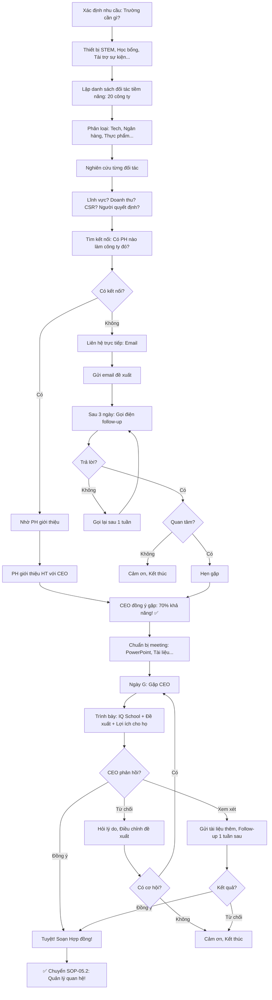

# SOP-05.1: XÂY DỰNG MẠNG LƯỚI ĐỐI TÁC

## 1. THÔNG TIN QUY TRÌNH

| **Thuộc tính** | **Nội dung** |
|---|---|
| Mã SOP | SOP-05.1 |
| Tên quy trình | Xây dựng mạng lưới đối tác |
| Quy trình cha | SOP-05: Hợp tác doanh nghiệp |
| Phiên bản | 1.0 |
| Tần suất | Liên tục (Mục tiêu: +5 đối tác/năm) |

## 2. MỤC ĐÍCH

- **Nguồn lực dồi dào**: Đối tác tài trợ → Học bổng, Thiết bị, Sự kiện...
- **Cơ hội cho HS**: Thực tập, Tham quan, Học hỏi...
- **Uy tín**: Nhiều đối tác lớn → Thương hiệu mạnh!
- **Win-win**: Trường có lợi, Đối tác cũng có lợi (CSR, Tuyển dụng...)

## 3. PHẠM VI ÁP DỤNG

Tất cả doanh nghiệp, Tổ chức tiềm năng

## 4. LOẠI ĐỐI TÁC

### 4.1. Phân loại theo lĩnh vực

```
╔══════════════════════════════════════════════════════════════════╗
║           6 LOẠI ĐỐI TÁC                                        ║
╠══════════════════════════════════════════════════════════════════╣
║ 1. CÔNG NGHỆ (Tech Companies):                                   ║
║    • VD: FPT, Viettel, VNG, Google, Microsoft...                 ║
║    • Hợp tác:                                                    ║
║      - Tài trợ thiết bị (Máy tính, Tablet...)                    ║
║      - Đào tạo GV (AI, Coding...)                                ║
║      - Học bổng con NV (Giảm 20% học phí)                        ║
║      - Tuyển dụng: PH làm IT → Giới thiệu việc                   ║
║    • Lợi ích cho họ: CSR, Tuyển dụng sớm (HS giỏi STEM!)         ║
╠══════════════════════════════════════════════════════════════════╣
║ 2. TÀI CHÍNH - NGÂN HÀNG:                                        ║
║    • VD: Vietcombank, Techcombank, BIDV...                       ║
║    • Hợp tác:                                                    ║
║      - Học bổng (10 suất × 5M = 50M/năm)                         ║
║      - Tài trợ sự kiện (10M/sự kiện)                             ║
║      - Giáo dục tài chính (Workshop cho HS)                      ║
║    • Lợi ích cho họ: Thương hiệu (Logo trên Banner trường!)      ║
╠══════════════════════════════════════════════════════════════════╣
║ 3. THỰC PHẨM - DINH DƯỠNG:                                       ║
║    • VD: Vinamilk, TH True Milk, Nestlé...                       ║
║    • Hợp tác:                                                    ║
║      - Tài trợ sữa (500 HS × 200K/tháng = 100M/năm!)             ║
║      - Workshop dinh dưỡng (Cho PH)                              ║
║    • Lợi ích cho họ: Marketing (PH biết sản phẩm → Mua!)         ║
╠══════════════════════════════════════════════════════════════════╣
║ 4. GIÁO DỤC (Trường, Công ty đào tạo):                           ║
║    • VD: British Council, IDP, Trường quốc tế khác...            ║
║    • Hợp tác:                                                    ║
║      - Chia sẻ chương trình, Học liệu                            ║
║      - Đào tạo GV                                                ║
║      - Trao đổi HS (Du học)                                      ║
║    • Lợi ích: Học hỏi lẫn nhau!                                  ║
╠══════════════════════════════════════════════════════════════════╣
║ 5. DU LỊCH - GIẢI TRÍ:                                           ║
║    • VD: Vinpearl, Sun World, Rạp CGV...                         ║
║    • Hợp tác:                                                    ║
║      - Giảm giá cho PH, HS (20-30%)                              ║
║      - Tài trợ sự kiện Dã ngoại                                  ║
║    • Lợi ích: 500 HS + PH = 2000 khách hàng tiềm năng!           ║
╠══════════════════════════════════════════════════════════════════╣
║ 6. KHÁC (Y tế, Luật, Xây dựng...):                               ║
║    • VD: Bệnh viện, Công ty luật, Vinhomes...                    ║
║    • Hợp tác: Tùy lĩnh vực                                       ║
╚══════════════════════════════════════════════════════════════════╝
```

### 4.2. Phân loại theo quy mô

```
╔══════════════════════════════════════════════════════════════════╗
║           3 CẤP ĐỐI TÁC                                         ║
╠══════════════════════════════════════════════════════════════════╣
║ 1. ĐỐI TÁC CHIẾN LƯỢC (Strategic Partner - 5 đối tác):          ║
║    • Quy mô: Tập đoàn lớn (FPT, Viettel, Vingroup...)            ║
║    • Hợp tác: Sâu rộng, Lâu dài (≥3 năm)                         ║
║    • Tài trợ: ≥100M/năm                                          ║
║    • Quyền lợi:                                                  ║
║      - Logo nổi bật (Banner 5m × 2m tại cổng!)                   ║
║      - Đặt tên phòng (VD: "Phòng STEM - FPT")                    ║
║      - Mention mọi sự kiện                                       ║
║      - Gặp HT mỗi quý                                            ║
╠══════════════════════════════════════════════════════════════════╣
║ 2. ĐỐI TÁC CHÍNH (Major Partner - 10 đối tác):                  ║
║    • Quy mô: Công ty lớn                                         ║
║    • Hợp tác: 1-3 năm                                            ║
║    • Tài trợ: 20-100M/năm                                        ║
║    • Quyền lợi:                                                  ║
║      - Logo trên Website, Banner...                              ║
║      - Mention sự kiện lớn                                       ║
╠══════════════════════════════════════════════════════════════════╣
║ 3. ĐỐI TÁC PHỤ (Minor Partner - 15 đối tác):                    ║
║    • Quy mô: Công ty vừa, Nhỏ                                    ║
║    • Hợp tác: 1 năm (Gia hạn nếu tốt!)                           ║
║    • Tài trợ: <20M/năm                                           ║
║    • Quyền lợi:                                                  ║
║      - Logo trên Website                                         ║
║      - Cảm ơn trong sự kiện                                      ║
╠══════════════════════════════════════════════════════════════════╣
║ TỔNG: 30 đối tác (Mục tiêu 2025)                                 ║
║ Tài trợ: 500M/năm (Trung bình 17M/đối tác)                       ║
╚══════════════════════════════════════════════════════════════════╝
```

## 5. QUY TRÌNH TÌM KIẾM ĐỐI TÁC

### 5.1. Xác định đối tác tiềm năng (Target Partners)

**BƯỚC 1: Lập danh sách mục tiêu (Target List)**

```
╔══════════════════════════════════════════════════════════════════╗
║           DANH SÁCH ĐỐI TÁC TIỀM NĂNG 2025                     ║
╠══════════════════════════════════════════════════════════════════╣
║ NHÓM 1: CÔNG NGHỆ (5 đối tác mục tiêu)                           ║
║                                                                  ║
║  1. FPT (Tập đoàn):                                              ║
║     • Lý do chọn: Lớn, Uy tín, Quan tâm giáo dục                 ║
║     • Mong muốn: Tài trợ 100M (Máy tính + Học bổng)              ║
║     • Lợi ích cho họ: Tuyển dụng HS giỏi STEM                    ║
║     • Người liên hệ: CEO Trương Gia Bình (Tìm email, SĐT...)     ║
║     • Kế hoạch: Gửi email → Gọi điện → Gặp trực tiếp             ║
║                                                                  ║
║  2. Viettel (Tập đoàn):                                          ║
║     [Chi tiết tương tự...]                                       ║
║                                                                  ║
║  3-5. Google, Microsoft, VNG...                                  ║
╠══════════════════════════════════════════════════════════════════╣
║ NHÓM 2: NGÂN HÀNG (3 đối tác)                                    ║
║  1. Vietcombank                                                  ║
║  2. Techcombank                                                  ║
║  3. BIDV                                                         ║
╠══════════════════════════════════════════════════════════════════╣
║ NHÓM 3-6: [Tương tự...]                                          ║
║                                                                  ║
║ TỔNG: 20 đối tác mục tiêu (Kỳ vọng 10 đồng ý = 50%)             ║
╚══════════════════════════════════════════════════════════════════╝
```

**BƯỚC 2: Nghiên cứu đối tác (Research)**

```
ĐỐI TÁC: FPT

NGHIÊN CỨU:
• Lĩnh vực: Công nghệ, Giáo dục, Viễn thông
• Doanh thu: 50,000 tỷ/năm (2024)
• Nhân sự: 40,000 người
• Văn phòng: Hà Nội, HCM, Đà Nẵng...

CHIẾN LƯỢC CSR (Corporate Social Responsibility):
• Quan tâm: Giáo dục, STEM, Công nghệ
• Đã tài trợ: 50 trường (2020-2024)
• Ngân sách CSR: 100 tỷ/năm

NGƯỜI RA QUYẾT ĐỊNH:
• CEO: Trương Gia Bình (Email: ceo@fpt.com.vn)
• Phó CEO (Phụ trách CSR): Nguyễn Văn A
• Trưởng BP CSR: Trần Thị B (Email: csr@fpt.com.vn)

KẾT NỐI:
• Có PH của IQ làm FPT? → CÓ! (PH Lê Văn C - Manager FPT!)
  → Nhờ PH C giới thiệu! ✅

ĐÁNH GIÁ:
• Khả năng hợp tác: CAO (80%)
• Lý do: FPT quan tâm giáo dục, IQ có chương trình STEM!
```

### 5.2. Tiếp cận đối tác (Outreach)

**BƯỚC 3: Gửi email giới thiệu (Cold Email)**

```
═══════════════════════════════════════════════════════
Subject: Đề xuất hợp tác Giáo dục - IQ School × FPT

Kính gửi Ông Trương Gia Bình (CEO FPT),

Tôi là Nguyễn Văn X, Hiệu trưởng Trường Liên cấp
Quốc tế IQ (IQ School - Hà Nội).

GIỚI THIỆU VỀ IQ SCHOOL:
• 500 học sinh (Mầm non - THCS)
• Chương trình song ngữ, Chú trọng STEM
• 100% GV có chứng chỉ quốc tế

ĐỀ XUẤT HỢP TÁC:
Chúng tôi mong muốn hợp tác với FPT trong lĩnh vực:
1. Tài trợ thiết bị STEM (50 máy tính - 100M)
2. Học bổng con NV FPT (Giảm 20% học phí)
3. Tuyển dụng HS tốt nghiệp (Thực tập, Làm việc)

LỢI ÍCH CHO FPT:
• CSR: Đóng góp giáo dục (Hình ảnh tốt!)
• Tuyển dụng: HS IQ giỏi STEM (Nguồn nhân lực!)
• Marketing: Logo FPT tại trường (500 HS + PH = 2000 người!)

Chúng tôi rất mong được gặp và trao đổi!

Tài liệu đính kèm:
• Brochure IQ School.pdf
• Đề xuất hợp tác chi tiết.pdf

Trân trọng,
Nguyễn Văn X
Hiệu trưởng IQ School
SĐT: __________
Email: __________
═══════════════════════════════════════════════════════

→ Gửi (Thứ 2, 9h - Giờ tốt!)
```

**BƯỚC 4: Follow-up (Sau 3 ngày)**

```
Nếu không trả lời → Gọi điện:

"Chào ông [Tên],
 Tôi là HT IQ School.
 Tôi đã gửi email đề xuất hợp tác.
 Ông đã nhận được chưa ạ?"

CEO: "Nhận rồi! Nhưng tôi bận..."

HT: "Vâng! Ông có 15 phút tuần sau không ạ?
     Tôi đến gặp, Trình bày chi tiết!"

CEO: "Được! Thứ 5, 10h!"

HT: "Cảm ơn ông! Hẹn gặp!"

→ Ghi nhận CRM: "Hẹn gặp 25/03, 10h, Văn phòng FPT"
```

**BƯỚC 5: Gặp trực tiếp (Meeting)**

```
25/03, 10h - Văn phòng FPT:

HT + BP Hợp tác đến gặp CEO FPT

AGENDA (30 phút):

00-05: Giới thiệu IQ School (PowerPoint)
• 500 HS, Chương trình STEM, NPS 7.2...

05-10: Đề xuất hợp tác
• 3 hình thức: Thiết bị, Học bổng, Tuyển dụng
• Chi phí: 100M/năm (Thiết bị)

10-20: Lợi ích cho FPT
• CSR: Hình ảnh tốt (Báo chí đưa tin!)
• Tuyển dụng: HS IQ giỏi STEM (Tuyển sớm!)
• Marketing: 2000 người thấy logo FPT!

20-25: Q&A
CEO: "100M nhiều quá!"
HT: "Có thể giảm xuống 50M ạ! (25 máy thay vì 50)"

CEO: "OK! Tôi sẽ xem xét!"

25-30: Kết thúc
HT: "Cảm ơn ông! Ông phản hồi khi nào ạ?"
CEO: "1 tuần sau!"

HT: "Vâng! Em sẽ gửi tài liệu thêm!"

→ Rời văn phòng
→ Gửi email cảm ơn (Trong ngày!)
```

**BƯỚC 6: Follow-up (1 tuần sau)**

```
Gọi điện:
"Chào ông, Ông đã xem xét đề xuất chưa ạ?"

CEO: "Vâng! Chúng tôi ĐỒNG Ý!
      50M, 25 máy tính!"

HT: "Tuyệt! Cảm ơn ông rất nhiều!
     Chúng tôi sẽ soạn Hợp đồng!"

→ Chuyển SOP-05.2: Ký Hợp đồng!
```

## 6. CHIẾN LƯỢC TÌM KIẾM

### 6.1. Networking (Kết nối)

```
╔══════════════════════════════════════════════════════════════════╗
║           3 CÁCH NETWORKING                                     ║
╠══════════════════════════════════════════════════════════════════╣
║ 1. QUA PHỤ HUYNH (Hiệu quả nhất!):                               ║
║    • PH của IQ làm FPT → Nhờ giới thiệu CEO!                     ║
║    • VD: PH Lê Văn C (Manager FPT):                              ║
║      HT: "Bác C ơi, Bác có thể giới thiệu trường với CEO FPT     ║
║            được không ạ?"                                        ║
║      PH C: "Được! Để em sắp xếp!"                                ║
║                                                                  ║
║    → 1 tuần sau: CEO FPT đồng ý gặp! ✅                          ║
║    → Tỷ lệ thành công: 70%! (Rất cao!)                           ║
╠══════════════════════════════════════════════════════════════════╣
║ 2. SỰ KIỆN DOANH NGHIỆP:                                         ║
║    • Tham dự: Hội thảo, Networking event, CSR forum...           ║
║    • VD: "Diễn đàn Trách nhiệm Xã hội 2025"                      ║
║      → HT đi → Gặp 20 CEO → Đổi danh thiếp                       ║
║      → Gửi email sau → 5 CEO trả lời! ✅                         ║
╠══════════════════════════════════════════════════════════════════╣
║ 3. LIÊN HỆ TRỰC TIẾP (Cold Outreach):                            ║
║    • Gửi email → Gọi điện → Gặp mặt                              ║
║    • Tỷ lệ thành công: Thấp (10-20%)                             ║
║    • Nhưng: Gửi nhiều → Vẫn có kết quả!                          ║
║      VD: Gửi 50 email → 10 trả lời → 5 gặp → 2 đồng ý! ✅        ║
╚══════════════════════════════════════════════════════════════════╝
```

## 7. LƯU ĐỒ QUY TRÌNH



## 8. BIỂU MẪU LIÊN QUAN

| **Mã** | **Tên** |
|---|---|
| QT07-DS07 | Danh sách đối tác tiềm năng (Target list) |
| QT07-NC01 | Nghiên cứu đối tác (Research) |
| QT07-DX01 | Đề xuất hợp tác (Proposal - PowerPoint) |

## 9. TIÊU CHUẨN VÀ CHỈ TIÊU

| **Chỉ tiêu** | **Mục tiêu** |
|---|---|
| Số đối tác mục tiêu (Target list)/năm | ≥20 |
| Tỷ lệ chuyển đổi (Target → Partner) | ≥30% (6/20) |
| Số đối tác mới/năm | ≥5 |
| Tổng đối tác cuối năm | ≥30 |

## 10. TRÁCH NHIỆM CỤ THỂ

| **Vai trò** | **Trách nhiệm** |
|---|---|
| **BP Hợp tác** | Lập danh sách, Nghiên cứu, Liên hệ, Gặp mặt |
| **HT** | Gặp CEO đối tác lớn, Ký Hợp đồng |
| **BP Quan hệ PH** | Tìm PH có kết nối với đối tác |
| **Phó HT** | Hỗ trợ, Giám sát |

## 11. LƯU Ý QUAN TRỌNG

- ⚠️ **Win-win**: Đối tác phải có lợi! (Không chỉ xin tiền!)
- ✅ **Networking**: Qua PH hiệu quả nhất! (Tỷ lệ 70% vs 10%!)
- 🔥 **Chuẩn bị kỹ**: Nghiên cứu đối tác → Đề xuất phù hợp!
- ✅ **Kiên trì**: Từ chối → Thử lại! Hoặc Tìm đối tác khác!

## 12. PHỤ LỤC

### 12.1. Mẫu PowerPoint đề xuất (15 slides)

```
═══════════════════════════════════════════════════════
    ĐỀ XUẤT HỢP TÁC: IQ SCHOOL × FPT
    Ngày: 25/03/2025
═══════════════════════════════════════════════════════

SLIDE 1: Bìa
[Logo IQ + Logo FPT]
"Đề xuất Hợp tác Giáo dục"

SLIDE 2: Giới thiệu IQ School
• 500 HS, 40 GV
• Chương trình song ngữ, STEM
• NPS 7.2/10

SLIDE 3: Tầm nhìn IQ
"Đào tạo thế hệ trẻ Công nghệ!"

SLIDE 4: Tại sao cần FPT?
• IQ có HS giỏi, Nhưng thiếu thiết bị!
• FPT có công nghệ, Muốn CSR!
→ Hợp tác = Win-win!

SLIDE 5-8: 3 Đề xuất hợp tác
(Chi tiết từng đề xuất...)

SLIDE 9-12: Lợi ích cho FPT
• CSR: Hình ảnh tốt
• Tuyển dụng: Nguồn nhân lực
• Marketing: 2000 người

SLIDE 13: Ngân sách
• 100M (50 máy × 2M/máy)
• Hoặc 50M (25 máy)

SLIDE 14: Timeline
• Tháng 4: Ký Hợp đồng
• Tháng 5: Bàn giao thiết bị
• Tháng 6: Sự kiện ra mắt (Báo chí đưa tin!)

SLIDE 15: Cảm ơn!
"Rất mong được hợp tác với FPT!
 Liên hệ: __________"

═══════════════════════════════════════════════════════
```

### 12.2. Thống kê tìm kiếm đối tác (Năm 2025)

```
┌────────────────────────────────────────────────────┐
│  THỐNG KÊ TÌM KIẾM ĐỐI TÁC - NĂM 2025            │
├────────────────────────────────────────────────────┤
│ TỔNG ĐỐI TÁC MỤC TIÊU: 20                        │
│                                                    │
│ TIẾP CẬN:                                          │
│ • Gửi email: 20 (100%)                             │
│ • Trả lời: 12 (60%)                                │
│ • Đồng ý gặp: 8 (40%)                              │
│ • Gặp xong: 8 (100%)                               │
│ • Đồng ý hợp tác: 6 (75%) ✅                      │
│                                                    │
│ TỶ LỆ CHUYỂN ĐỔI TỔNG:                            │
│ 6/20 = 30% ✅ (Đạt mục tiêu!)                     │
│                                                    │
│ 6 ĐỐI TÁC MỚI 2025:                               │
│ 1. FPT: 50M (Máy tính)                             │
│ 2. Vietcombank: 30M (Học bổng)                     │
│ 3. Vinamilk: 80M (Sữa)                             │
│ 4. British Council: 20M (Đào tạo GV)               │
│ 5. Vinpearl: 15M (Dã ngoại)                        │
│ 6. Bệnh viện A: 5M (Khám sức khỏe)                 │
│                                                    │
│ TỔNG TÀI TRỢ: 200M! 🎉                            │
│ (Vượt mục tiêu 100M!)                              │
└────────────────────────────────────────────────────┘
```

## 13. FAQ

**Q1: Gửi 20 email, Không ai trả lời. Tại sao?**  
A: 
- Email chưa hấp dẫn! (Tiêu đề nhàm chán, Nội dung dài...)
- Gửi sai người! (Gửi NV cấp thấp → Không quyết định được!)
- Thử: Gọi điện trước → Sau đó mới gửi email!

**Q2: Đối tác từ chối vì "Không có ngân sách CSR". Xử lý?**  
A: 
- Đề xuất hình thức khác (Không cần tiền!):
  - Tuyển dụng HS (Miễn phí cho họ!)
  - Workshop (Họ gửi diễn giả đến - Không tốn tiền!)
- Hoặc: Đề xuất năm sau (Khi họ có ngân sách!)

**Q3: Có nên "Ép" PH giới thiệu không?**  
A: KHÔNG!
- Nhờ nhẹ nhàng: "Bác có quen ai FPT không ạ?"
- Nếu PH không muốn → OK! Không ép!

---

**PHÊ DUYỆT**

| BP Hợp tác | Phó HT | Hiệu trưởng |
|---|---|---|
| [Họ tên] | [Họ tên] | [Họ tên] |
