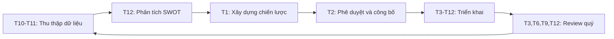

# QUY TẮC 08: QUẢN TRỊ & CHIẾN LƯỢC

## 1. TỔNG QUAN

### 1.1. Giới thiệu
Quy tắc 08 thiết lập hệ thống quản trị và chiến lược toàn diện cho trường học, đảm bảo định hướng phát triển rõ ràng, quản lý hiệu quả và tăng trưởng bền vững. Đây là nền tảng cho sự phát triển dài hạn và thành công của tổ chức giáo dục.

### 1.2. Mục đích
- Xác định và truyền đạt tầm nhìn, sứ mệnh, giá trị cốt lõi
- Thiết lập hệ thống mục tiêu và KPI rõ ràng (OKR)
- Xây dựng và bảo vệ thương hiệu trường học
- Phát triển mạng lưới đối tác chiến lược
- Quản lý rủi ro một cách chủ động và hiệu quả
- Lập kế hoạch mở rộng và phát triển cơ sở mới

### 1.3. Phạm vi áp dụng
Áp dụng cho:
- Ban Giám hiệu và Ban Quản trị
- Tất cả các phòng ban và bộ phận
- Toàn thể cán bộ, giáo viên, nhân viên
- Các bên liên quan (phụ huynh, đối tác, cộng đồng)

## 2. CẤU TRÚC QUẢN TRỊ

### 2.1. Hội đồng Quản trị (Board of Directors)
**Vai trò**:
- Quyết định chiến lược tổng thể
- Phê duyệt ngân sách và kế hoạch lớn
- Giám sát hoạt động Ban Giám hiệu
- Đảm bảo tuân thủ pháp luật và đạo đức

**Cấu trúc**:
- Chủ tịch Hội đồng
- Thành viên độc lập (3-5 người)
- Đại diện nhà sáng lập/cổ đông
- Chuyên gia tư vấn (giáo dục, tài chính, pháp lý)

**Họp**: 4 lần/năm (quý)

### 2.2. Ban Giám hiệu (Executive Leadership Team)
**Cấu trúc**:
- Hiệu trưởng (Principal/Superintendent)
- Phó Hiệu trưởng Học thuật
- Phó Hiệu trưởng Hành chính
- Giám đốc Tài chính (CFO)
- Giám đốc Nhân sự (CHRO)
- Giám đốc Phát triển (CDO)

**Họp**: Hàng tuần (Leadership Meeting)

### 2.3. Ban Cố vấn Chiến lược (Strategic Advisory Board)
**Thành viên**:
- Chuyên gia giáo dục quốc tế
- Lãnh đạo doanh nghiệp
- Alumni thành công
- Đại diện phụ huynh

**Vai trò**: Tư vấn, kết nối, hỗ trợ

## 3. HỆ THỐNG QUY TRÌNH

### 3.1. SOP-01: Tầm nhìn - Sứ mệnh
**Mục tiêu**: Xác định và truyền đạt định hướng dài hạn của trường
**Nội dung**: [SOP-01_Tam_nhin_Su_menh](./SOP-01_Tam_nhin_Su_menh/SOP-01_Tam_nhin_Su_menh.md)

**Các quy trình con**:
1. SOP-01.1: Xây dựng tầm nhìn - sứ mệnh - giá trị
2. SOP-01.2: Phổ biến và truyền thông nội bộ
3. SOP-01.3: Tích hợp vào hoạt động hàng ngày
4. SOP-01.4: Đánh giá và cập nhật định kỳ
5. SOP-01.5: Xây dựng văn hóa tổ chức

### 3.2. SOP-02: Lập OKR chiến lược
**Mục tiêu**: Thiết lập và quản lý hệ thống mục tiêu và kết quả then chốt
**Nội dung**: [SOP-02_Lap_OKR_chien_luoc](./SOP-02_Lap_OKR_chien_luoc/SOP-02_Lap_OKR_chien_luoc.md)

**Các quy trình con**:
1. SOP-02.1: Xây dựng OKR cấp tổ chức
2. SOP-02.2: Cascading OKR xuống các phòng ban
3. SOP-02.3: Theo dõi và đánh giá OKR
4. SOP-02.4: Review và điều chỉnh OKR
5. SOP-02.5: Kết nối OKR với đánh giá nhân sự

### 3.3. SOP-03: Quản trị thương hiệu
**Mục tiêu**: Xây dựng, bảo vệ và phát triển thương hiệu trường học
**Nội dung**: [SOP-03_Quan_tri_thuong_hieu](./SOP-03_Quan_tri_thuong_hieu/SOP-03_Quan_tri_thuong_hieu.md)

**Các quy trình con**:
1. SOP-03.1: Xây dựng định vị thương hiệu
2. SOP-03.2: Thiết kế nhận diện thương hiệu
3. SOP-03.3: Quản lý trải nghiệm thương hiệu
4. SOP-03.4: Bảo vệ và giám sát thương hiệu
5. SOP-03.5: Đo lường giá trị thương hiệu

### 3.4. SOP-04: Quan hệ đối tác chiến lược
**Mục tiêu**: Phát triển mạng lưới đối tác mang lại giá trị chiến lược
**Nội dung**: [SOP-04_Quan_he_doi_tac](./SOP-04_Quan_he_doi_tac/SOP-04_Quan_he_doi_tac.md)

**Các quy trình con**:
1. SOP-04.1: Xác định đối tác chiến lược
2. SOP-04.2: Đàm phán và ký kết hợp tác
3. SOP-04.3: Quản lý quan hệ đối tác chiến lược
4. SOP-04.4: Joint ventures và liên doanh
5. SOP-04.5: Đánh giá và phát triển đối tác

### 3.5. SOP-05: Quản trị rủi ro
**Mục tiêu**: Nhận diện, đánh giá và kiểm soát các rủi ro tiềm ẩn
**Nội dung**: [SOP-05_Quan_tri_rui_ro](./SOP-05_Quan_tri_rui_ro/SOP-05_Quan_tri_rui_ro.md)

**Các quy trình con**:
1. SOP-05.1: Nhận diện và đánh giá rủi ro
2. SOP-05.2: Lập kế hoạch ứng phó rủi ro
3. SOP-05.3: Quản lý khủng hoảng và truyền thông
4. SOP-05.4: Bảo hiểm và chuyển giao rủi ro
5. SOP-05.5: Đánh giá và cải tiến hệ thống

### 3.6. SOP-06: Phát triển cơ sở mới
**Mục tiêu**: Lập kế hoạch và triển khai mở rộng cơ sở vật chất
**Nội dung**: [SOP-06_Phat_trien_co_so_moi](./SOP-06_Phat_trien_co_so_moi/SOP-06_Phat_trien_co_so_moi.md)

**Các quy trình con**:
1. SOP-06.1: Nghiên cứu và phân tích thị trường
2. SOP-06.2: Lập kế hoạch và dự toán đầu tư
3. SOP-06.3: Thiết kế và xây dựng cơ sở mới
4. SOP-06.4: Tuyển dụng và đào tạo đội ngũ
5. SOP-06.5: Vận hành và quản lý cơ sở mới

## 4. QUY TRÌNH HOẠCH ĐỊNH CHIẾN LƯỢC

### 4.1. Chu kỳ hoạch định (Annual Strategic Planning Cycle)



### 4.2. Các bước thực hiện

#### Bước 1: Thu thập dữ liệu và phân tích (Tháng 10-11)
**Hoạt động**:
- Đánh giá kết quả năm hiện tại
- Phân tích môi trường bên ngoài (PESTEL)
- Phân tích cạnh tranh (5 Forces)
- Khảo sát stakeholders (phụ huynh, học sinh, giáo viên)
- Benchmarking với các trường hàng đầu

**Output**: Strategic Analysis Report

#### Bước 2: Phân tích SWOT (Tháng 12)
**Workshop chiến lược** (2-3 ngày):
- Tham gia: BGH, Trưởng phòng ban
- Phân tích Strengths, Weaknesses, Opportunities, Threats
- Xác định các vấn đề chiến lược (Strategic Issues)
- Brainstorm initiatives

**Output**: SWOT Analysis và Strategic Issues List

#### Bước 3: Xây dựng chiến lược (Tháng 1)
**Nội dung**:
- Xác định hoặc cập nhật Vision, Mission, Values
- Đặt Strategic Goals (3-5 năm)
- Lập OKR năm mới
- Xác định Strategic Initiatives
- Phân bổ nguồn lực và ngân sách

**Output**: Strategic Plan (20-30 trang)

#### Bước 4: Phê duyệt và công bố (Tháng 2)
**Quy trình**:
- BGH trình Hội đồng Quản trị
- Điều chỉnh theo góp ý
- Phê duyệt chính thức
- Công bố cho toàn trường
- Cascading xuống các phòng ban

**Output**: Approved Strategic Plan + Communication Plan

#### Bước 5: Triển khai (Tháng 3-12)
**Hoạt động**:
- Các phòng ban lập Action Plan chi tiết
- Triển khai các initiatives
- Tracking KPI hàng tháng
- Họp review quý (Tháng 3, 6, 9, 12)

**Output**: Quarterly Review Reports

## 5. FRAMEWORK PHÂN TÍCH CHIẾN LƯỢC

### 5.1. PESTEL Analysis (Môi trường vĩ mô)
- **Political**: Chính sách giáo dục, quy định pháp lý
- **Economic**: Kinh tế, sức mua, học phí
- **Social**: Xu hướng xã hội, dân số, văn hóa
- **Technological**: Công nghệ giáo dục, số hóa
- **Environmental**: Môi trường, phát triển bền vững
- **Legal**: Luật lao động, giáo dục, thuế

### 5.2. Porter's Five Forces (Phân tích cạnh tranh)
1. **Đối thủ cạnh tranh**: Các trường tư thục khác
2. **Người mua (phụ huynh)**: Sức mạnh thương lượng
3. **Nhà cung cấp**: Giáo viên, đối tác chương trình
4. **Người vào mới**: Trường mới thành lập
5. **Sản phẩm thay thế**: Du học sớm, homeschooling, online learning

### 5.3. SWOT Analysis
**Strengths** (Điểm mạnh):
- Chất lượng giảng dạy
- Cơ sở vật chất
- Danh tiếng thương hiệu
- Chương trình học tiên tiến
- Đội ngũ giáo viên giỏi

**Weaknesses** (Điểm yếu):
- Chi phí vận hành cao
- Phụ thuộc vào thị trường địa phương
- Thiếu quy mô (scale)

**Opportunities** (Cơ hội):
- Tầng lớp trung lưu tăng
- Nhu cầu giáo dục chất lượng cao
- Xu hướng song ngữ, STEM
- Hợp tác quốc tế

**Threats** (Thách thức):
- Cạnh tranh gay gắt
- Thay đổi chính sách
- Suy thoái kinh tế
- Công nghệ thay đổi nhanh

### 5.4. Value Chain Analysis
**Hoạt động chính**:
- Tuyển sinh (Marketing & Enrollment)
- Giảng dạy (Teaching & Learning)
- Hỗ trợ học sinh (Student Services)
- Phát triển chương trình (Curriculum Development)

**Hoạt động hỗ trợ**:
- Nhân sự
- Tài chính
- IT
- Cơ sở vật chất

## 6. CHIẾN LƯỢC PHÁT TRIỂN

### 6.1. Chiến lược tăng trưởng (Growth Strategy)

**Ansoff Matrix**:
```
                    Thị trường hiện tại | Thị trường mới
------------------------------------------------------------
Sản phẩm hiện tại | Market Penetration  | Market Development
                  | (Tăng thị phần)     | (Mở rộng địa lý)
------------------------------------------------------------
Sản phẩm mới      | Product Development | Diversification
                  | (Chương trình mới)  | (Dịch vụ mới)
```

**Ví dụ**:
- **Market Penetration**: Tăng số học sinh tại cơ sở hiện tại
- **Market Development**: Mở thêm cơ sở ở thành phố khác
- **Product Development**: Thêm chương trình IB, AP, A-Level
- **Diversification**: Mở trung tâm đào tạo giáo viên, consulting

### 6.2. Chiến lược cạnh tranh (Competitive Strategy)

**3 Strategies của Porter**:
1. **Cost Leadership**: Tối ưu chi phí (khó áp dụng cho trường tư thục cao cấp)
2. **Differentiation**: Khác biệt hóa (chương trình độc đáo, giáo viên quốc tế, cơ sở hiện đại)
3. **Focus**: Tập trung (niche market, ví dụ: STEM school, Arts school)

**Khuyến nghị**: Differentiation + Focus

### 6.3. Chiến lược số hóa (Digital Transformation)
- Hệ thống quản lý học sinh (LMS, SIS)
- Ứng dụng mobile cho phụ huynh
- Online learning platform
- AI trong cá nhân hóa học tập
- Big Data analytics

### 6.4. Chiến lược quốc tế hóa (Internationalization)
- Chương trình song ngữ/đa ngữ
- Giáo viên quốc tế
- Chương trình trao đổi học sinh
- Hợp tác với trường nước ngoài
- Chứng chỉ quốc tế (IB, Cambridge, AP)

## 7. CHỈ SỐ ĐÁNH GIÁ CHIẾN LƯỢC (STRATEGIC KPI)

### 7.1. Tài chính
- Doanh thu hàng năm: Tăng ≥ 15%/năm
- EBITDA margin: ≥ 20%
- ROI: ≥ 15%
- Debt to Equity: ≤ 1.5

### 7.2. Khách hàng
- Số học sinh: Tăng ≥ 10%/năm
- Retention rate: ≥ 95%
- NPS (Net Promoter Score): ≥ 60
- Brand awareness: Top 3 trong khu vực

### 7.3. Học thuật
- Điểm trung bình: Tăng 5% so với năm trước
- Tỷ lệ đỗ đại học top: ≥ 80%
- Học bổng quốc tế: ≥ 30% học sinh lớp 12
- Giải thưởng quốc gia/quốc tế: ≥ 20 giải/năm

### 7.4. Vận hành
- Teacher turnover: ≤ 10%/năm
- Employee satisfaction: ≥ 4.2/5.0
- Capacity utilization: 85-95%
- IT system uptime: ≥ 99%

### 7.5. Phát triển
- Số cơ sở mới: 1 cơ sở/2-3 năm
- Chương trình mới: 2-3 chương trình/năm
- Đối tác chiến lược: ≥ 10 đối tác
- R&D investment: 3-5% doanh thu

## 8. QUẢN TRỊ DỰ ÁN CHIẾN LƯỢC

### 8.1. Strategic Initiative Portfolio
Mỗi initiative cần có:
- **Charter**: Mô tả, mục tiêu, phạm vi
- **Owner**: Sponsor (BGH) + Project Lead
- **Timeline**: Start date, milestones, end date
- **Budget**: Chi phí dự kiến
- **KPI**: Chỉ số đo lường thành công

### 8.2. Governance Model
**Steering Committee**:
- Họp hàng tháng
- Review tiến độ các initiatives
- Giải quyết vấn đề, bottleneck
- Reallocate resources nếu cần

**Project Teams**:
- Cross-functional
- Họp hàng tuần
- Execute action plan
- Report to Steering Committee

## 9. VĂN HÓA VÀ LÃNH ĐẠO CHIẾN LƯỢC

### 9.1. Leadership Competencies
**Năng lực lãnh đạo cần có**:
- Vision and Strategic Thinking
- Change Management
- Decision Making
- Communication and Influence
- Emotional Intelligence
- Innovation and Creativity

### 9.2. Organizational Culture
**Văn hóa mong muốn**:
- **Excellence**: Xuất sắc trong mọi việc
- **Innovation**: Sáng tạo và đổi mới
- **Collaboration**: Hợp tác và chia sẻ
- **Integrity**: Chính trực và minh bạch
- **Care**: Quan tâm và hỗ trợ

### 9.3. Change Management
**Kotter's 8 Steps**:
1. Create urgency (Tạo tính cấp thiết)
2. Build guiding coalition (Xây dựng đội lãnh đạo)
3. Form strategic vision (Xác định tầm nhìn)
4. Enlist volunteer army (Truyền đạt cho mọi người)
5. Enable action (Gỡ bỏ rào cản)
6. Generate short-term wins (Tạo thắng lợi ngắn hạn)
7. Sustain acceleration (Duy trì đà)
8. Institute change (Thể chế hóa)

## 10. CÔNG CỤ VÀ MẪU BIỂU

### 10.1. Công cụ hoạch định
- Strategy Canvas
- Business Model Canvas
- Balanced Scorecard
- OKR Framework
- SWOT, PESTEL templates

### 10.2. Công cụ quản lý
- Project management: Asana, Monday.com
- OKR tracking: Weekdone, 15Five
- Dashboard: Power BI, Tableau
- Communication: Microsoft Teams, Slack

### 10.3. Mẫu biểu
- Strategic Plan Template
- OKR Template
- Business Case Template
- Project Charter Template
- Quarterly Review Template

## 11. TRÁCH NHIỆM CHUNG

### 11.1. Ban Giám hiệu
- Lãnh đạo quá trình hoạch định chiến lược
- Phê duyệt và triển khai kế hoạch
- Giám sát và đánh giá kết quả
- Điều chỉnh chiến lược khi cần

### 11.2. Trưởng phòng ban
- Tham gia xây dựng chiến lược
- Triển khai chiến lược trong phạm vi phòng ban
- Quản lý dự án chiến lược được giao
- Báo cáo tiến độ và kết quả

### 11.3. Toàn thể nhân viên
- Hiểu rõ tầm nhìn, sứ mệnh, chiến lược
- Đóng góp ý tưởng và phản hồi
- Thực hiện nhiệm vụ được giao
- Hỗ trợ các initiatives chiến lược

## 12. TÀI LIỆU THAM KHẢO
- "Good Strategy Bad Strategy" - Richard Rumelt
- "Blue Ocean Strategy" - W. Chan Kim
- "Playing to Win" - A.G. Lafley
- "Measure What Matters" - John Doerr (OKR)
- "The Balanced Scorecard" - Robert Kaplan
- ISO 9001:2015 Quality Management
- EFQM Excellence Model

---

**Ngày ban hành**: 01/01/2024  
**Người phê duyệt**: Hội đồng Quản trị  
**Người soạn thảo**: Ban Giám hiệu  
**Ngày xem xét lại**: 01/01/2025

---

**LƯU Ý**: Tài liệu này là nền tảng cho quản trị và phát triển chiến lược của trường. Mọi thay đổi lớn phải được Hội đồng Quản trị phê duyệt.
