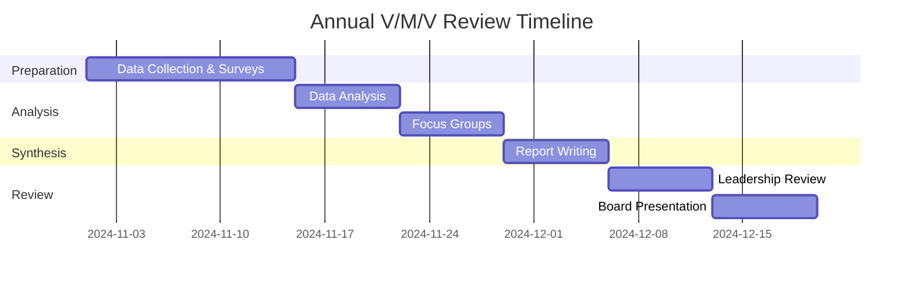

# SOP-01.4: ĐÁNH GIÁ VÀ CẬP NHẬT ĐỊNH KỲ

## 1. MỤC ĐÍCH
Quy định quy trình đánh giá hiệu quả và cập nhật tầm nhìn, sứ mệnh, giá trị cốt lõi định kỳ, đảm bảo:
- V/M/V luôn relevant và phù hợp với context
- Đo lường được mức độ awareness và alignment
- Nhận diện gaps và cơ hội cải thiện
- Quyết định informed về việc giữ nguyên hoặc điều chỉnh
- Continuous improvement của V/M/V management

## 2. PHẠM VI ÁP DỤNG
Áp dụng cho:
- Ban Giám hiệu (chủ trì)
- Phòng Nhân sự / Phát triển Tổ chức
- Phòng Marketing / Communications
- Hội đồng Quản trị (phê duyệt thay đổi lớn)
- Toàn thể stakeholders (cung cấp feedback)

## 3. CHU KỲ ĐÁNH GIÁ

### 3.1. Đánh giá thường xuyên (Quarterly)
**Tần suất**: Mỗi quý (Tháng 3, 6, 9, 12)
**Mục đích**: Monitor awareness và engagement
**Phương pháp**: Quick pulse surveys, observational data
**Output**: Quarterly dashboard update
**Chủ trì**: HR hoặc Comms team

### 3.2. Đánh giá toàn diện (Annual)
**Tần suất**: Hàng năm (Tháng 11-12)
**Mục đích**: Comprehensive review, inform strategic planning
**Phương pháp**: Surveys, focus groups, data analysis
**Output**: Annual V/M/V Review Report
**Chủ trì**: BGH với support từ teams

### 3.3. Đánh giá chiến lược (Every 3-5 years)
**Tần suất**: 3-5 năm hoặc khi có major changes
**Mục đích**: Fundamental review, potential major updates
**Phương pháp**: Full stakeholder engagement process (như SOP-01.1)
**Output**: Decision to keep, refine, or overhaul
**Chủ trì**: BGH + Board

## 4. QUY TRÌNH ĐÁNH GIÁ HÀNG QUÝ

### 4.1. Chuẩn bị (1 tuần trước end of quarter)
**Activities**:
- Pull data từ các nguồn
- Chuẩn bị survey (nếu có)
- Schedule review meeting

**Data Sources**:
```
1. Recognition Data:
   - Số nominations nhận được
   - Distribution across values
   - Participation rate

2. HR Data:
   - Performance review scores (values component)
   - Exit interview mentions của V/M/V
   - Onboarding feedback

3. Communication Metrics:
   - Newsletter opens/clicks (values content)
   - Social media engagement
   - Intranet page views

4. Behavioral Observations:
   - Meeting practices (values check-ins)
   - Decision-making (values frameworks used)
   - Anecdotal evidence từ leaders
```

### 4.2. Pulse Survey (Optional, 5-10 phút)
**Đối tượng**: Sample of staff (30-50 người rotating)
**Tần suất**: 1-2 quý/năm

**Questions** (5-7 questions):
```
1. Nhớ được bao nhiêu Core Values? [Open text]

2. Trong quý vừa qua, bạn có thấy values được thể hiện?
   ○ Thường xuyên  ○ Thỉnh thoảng  ○ Hiếm khi  ○ Không

3. Bạn có áp dụng values vào công việc không?
   ○ Thường xuyên  ○ Thỉnh thoảng  ○ Hiếm khi  ○ Không

4. Share 1 example gần đây về values in action.
   [Open text]

5. Values nào bạn thấy cần strengthen hơn?
   [Select từ list]

6. Overall, values có help guide công việc của bạn?
   1 ○ 2 ○ 3 ○ 4 ○ 5 ○
   (Not at all → Extremely helpful)

7. Góp ý/suggestion? [Optional, open text]
```

### 4.3. Review Meeting (1-2 giờ)
**Participants**: BGH + HR Lead + Comms Lead

**Agenda**:
```
00:00-00:15: Review quantitative data
            - Dashboard walkthrough
            - Trends và patterns
            
00:15-00:30: Review qualitative feedback
            - Survey results
            - Stories và examples
            - Concerns raised
            
00:30-00:45: Gap Analysis
            - Where are we strong?
            - Where are we weak?
            - Specific areas of concern?
            
00:45-01:00: Action Planning
            - What to continue?
            - What to start?
            - What to stop?
            - Quick wins vs. longer-term
            
01:00-01:15: Assignments và next steps
            - Who does what by when?
            - Communication plan
            
01:15-01:30: Buffer & wrap-up
```

### 4.4. Dashboard Update
**Quarterly V/M/V Dashboard** (1 page):
```
AWARENESS:
├─ % staff recall Vision: [XX%] 
├─ % staff recall Mission: [XX%]
└─ % staff recall ≥3 Values: [XX%]

ENGAGEMENT:
├─ Recognition nominations: [XX] (+/- vs. last Q)
├─ Values content engagement: [XX%]
└─ Training participation: [XX%]

BEHAVIOR:
├─ Performance ratings (values): [X.X/5.0]
├─ Self-reported practice: [XX%]
└─ Stories collected: [XX]

SENTIMENT:
├─ Helpfulness rating: [X.X/5.0]
└─ Positive mentions: [XX%]

TOP INSIGHTS:
• [Insight 1]
• [Insight 2]
• [Insight 3]

ACTION ITEMS:
□ [Action 1] - Owner - Due date
□ [Action 2] - Owner - Due date
□ [Action 3] - Owner - Due date
```

**Distribution**: BGH, Trưởng phòng ban

### 4.5. Action Implementation
**Follow-through**:
- Execute action items
- Monitor progress
- Report back next quarter

**Common Actions**:
- Refresh communication (if awareness dipping)
- Launch mini-campaign for specific value
- Address specific gaps (e.g., training)
- Celebrate successes
- Fix broken processes

## 5. QUY TRÌNH ĐÁNH GIÁ HÀNG NĂM

### 5.1. Timeline và Overview
**Timing**: Tháng 11-12 (trước strategic planning)
**Duration**: 6-8 tuần
**Effort**: Significant investment



### 5.2. Phase 1: Data Collection (2 tuần)

#### 5.2.1. Comprehensive Survey
**Đối tượng**: 
- All staff (mandatory)
- Sample of students (grades 6-12, n=100-200)
- Sample of parents (n=200-300)
- Alumni (optional, n=50-100)

**Staff Survey** (15-20 phút, 30-40 questions):

**Section A: Awareness & Understanding** (10 questions)
```
1. Viết ra Vision của trường (đúng hoặc gần đúng)
   [Open text]

2. Viết ra Mission của trường
   [Open text]

3. List tất cả Core Values bạn nhớ
   [Open text]

4-8. Cho mỗi value, rate hiểu biết của bạn:
   1 = Don't understand → 5 = Fully understand

9. Overall, bạn hiểu rõ V/M/V của trường?
   1 ○ 2 ○ 3 ○ 4 ○ 5 ○

10. Bạn có thể giải thích V/M/V cho người khác?
    ○ Yes, easily  ○ Somewhat  ○ No
```

**Section B: Relevance & Alignment** (8 questions)
```
11. V/M/V có reflect who we are as a school?
    1 ○ 2 ○ 3 ○ 4 ○ 5 ○

12. V/M/V có guide công việc hàng ngày của bạn?
    1 ○ 2 ○ 3 ○ 4 ○ 5 ○

13. Bạn có thấy V/M/V trong decisions của trường?
    ○ Always  ○ Often  ○ Sometimes  ○ Rarely  ○ Never

14. Bạn có proud về V/M/V của trường?
    1 ○ 2 ○ 3 ○ 4 ○ 5 ○

15. Your personal values align với trường?
    1 ○ 2 ○ 3 ○ 4 ○ 5 ○

16-18. Cho mỗi statement, rate agreement:
   - "Our vision is inspiring" [1-5]
   - "Our mission is clear" [1-5]
   - "Our values are distinctive" [1-5]
```

**Section C: Behavior & Practice** (8 questions)
```
19. Bạn có actively practice values trong công việc?
    ○ Daily  ○ Weekly  ○ Monthly  ○ Rarely  ○ Never

20-24. Cho mỗi value, bạn demonstrate bao nhiêu:
   [Value 1]: 1 ○ 2 ○ 3 ○ 4 ○ 5 ○
   [Value 2]: 1 ○ 2 ○ 3 ○ 4 ○ 5 ○
   [Etc.]

25. Share 1-2 examples cụ thể về khi bạn lived values.
    [Open text - required]

26. Bạn có recognize colleagues cho values không?
    ○ Multiple times  ○ Once  ○ No, but want to  ○ No
```

**Section D: Integration & Support** (6 questions)
```
27. Values có được integrated vào:
    □ Performance reviews
    □ Recognition programs
    □ Decision-making
    □ Training/PD
    □ Hiring
    □ Other: _______

28. Bạn có receive adequate resources/training về values?
    ○ Yes  ○ Somewhat  ○ No

29. Leadership có model values effectively?
    1 ○ 2 ○ 3 ○ 4 ○ 5 ○

30. Colleagues có hold each other accountable?
    1 ○ 2 ○ 3 ○ 4 ○ 5 ○

31. Overall culture strength:
    1 ○ 2 ○ 3 ○ 4 ○ 5 ○

32. Nếu bạn refer trường cho friend, V/M/V có là lý do?
    ○ Yes, major reason  ○ Yes, minor reason  ○ No
```

**Section E: Areas for Improvement** (4-5 questions)
```
33. Value nào trường demonstrate tốt nhất?
    [Select one + explain why]

34. Value nào trường cần improve?
    [Select one + explain why]

35. Suggestions để strengthen V/M/V?
    [Open text]

36. Anything to keep, change, or remove?
    [Open text]

37. Additional comments?
    [Open text - optional]
```

**Parent/Student Surveys**: Simplified version, 10-15 questions, focus trên:
- Awareness of V/M/V
- Observability trong school experience
- Alignment với expectations
- Impact on students

#### 5.2.2. Performance Data Analysis
**Pull from systems**:
```
HR Data (Past 12 months):
├─ Performance review ratings (values component)
├─ 360 feedback scores
├─ Recognition program data
├─ Exit interview transcripts (mentions of values)
├─ Engagement survey results
└─ Retention rates by values alignment

Learning Data:
├─ Training completion rates (values-related)
├─ PD hours logged
└─ Certification achievements

Operational Data:
├─ Decision-making (values framework usage)
├─ Incident reports (values violations)
├─ Compliance issues
└─ Customer complaints/praise (values mentioned)
```

#### 5.2.3. Observation & Documentation Review
**Conduct observations**:
- Attend 3-5 meetings (various levels)
- Observe decision-making processes
- Review meeting minutes (values mentions)
- Check physical environment (displays, wear & tear)

**Document review**:
- Strategic plan alignment
- Policy updates
- Communications (frequency, messaging)
- External perceptions (media, reviews)

### 5.3. Phase 2: Analysis (1 tuần)

#### 5.3.1. Quantitative Analysis
**Survey Data**:
- Descriptive statistics (means, frequencies)
- Trend analysis (vs. previous years)
- Segmentation analysis (by role, tenure, department)
- Correlation analysis (values → engagement, retention)

**Key Metrics**:
```
AWARENESS METRICS:
• Vision recall accuracy: [XX%]
• Mission recall accuracy: [XX%]
• Values recall (≥3): [XX%]
• Understanding rating: [X.X/5.0]

ALIGNMENT METRICS:
• Relevance rating: [X.X/5.0]
• Guiding influence: [X.X/5.0]
• Decision visibility: [XX% "Often" or "Always"]
• Personal alignment: [X.X/5.0]
• Pride level: [X.X/5.0]

BEHAVIOR METRICS:
• Practice frequency: [XX% "Daily" or "Weekly"]
• Self-assessment by value: [X.X/5.0 each]
• Recognition participation: [XX%]
• Examples provided quality: [High/Med/Low]

INTEGRATION METRICS:
• Perceived integration: [XX% in each area]
• Resource adequacy: [XX% "Yes"]
• Leadership modeling: [X.X/5.0]
• Peer accountability: [X.X/5.0]
• Culture strength: [X.X/5.0]

OVERALL HEALTH SCORE: [XX/100]
(Weighted composite of above)
```

**Benchmarking**:
- Compare với previous years
- Compare với industry standards (nếu có)
- Compare với best-in-class organizations

#### 5.3.2. Qualitative Analysis
**Open-ended Responses**:
- Thematic coding (identify recurring themes)
- Sentiment analysis (positive/neutral/negative)
- Extract representative quotes
- Identify outliers and edge cases

**Common Themes** (examples):
```
Strengths:
• "Values are clearly communicated"
• "Leadership walks the talk"
• "Feel proud to work here"

Gaps:
• "Not sure how values apply to my role"
• "Recognition seems selective"
• "Values used inconsistently in decisions"

Suggestions:
• "More training on practical application"
• "Better examples from different departments"
• "Make values part of onboarding earlier"
```

**Story Analysis**:
- Collect best examples of values in action
- Identify which values have most/least stories
- Assess quality and diversity of examples

#### 5.3.3. Integration Assessment
**Scorecard by Process**:
```
Process Area                 | Integration | Quality | Impact
-----------------------------|-------------|---------|-------
Strategic Planning           | ✅ Yes      | High    | High
OKR Setting                  | ✅ Yes      | High    | High
Hiring                       | ✅ Yes      | Medium  | High
Onboarding                   | ✅ Yes      | High    | Medium
Performance Management       | ⚠️ Partial  | Medium  | Medium
Recognition                  | ✅ Yes      | High    | High
Decision-making              | ⚠️ Partial  | Low     | Medium
Training & Development       | ⚠️ Partial  | Medium  | Low
Student Curriculum           | ❌ No       | N/A     | Low
Parent Communications        | ✅ Yes      | Low     | Low
Physical Environment         | ✅ Yes      | Medium  | Low
External Communications      | ✅ Yes      | High    | Medium

Overall Integration: 75% (9/12 areas)
Priority Gaps: Decision-making, Student curriculum
```

### 5.4. Phase 3: Focus Groups (1 tuần)

#### 5.4.1. Planning
**Purpose**: Deep dive vào survey findings, explore nuances

**Groups** (3-5 sessions, 60-90 phút each):
1. Leadership Team (BGH + Trưởng phòng)
2. Teachers (mix of levels, tenures)
3. Non-teaching Staff
4. Students (grades 9-12)
5. Parents (optional)

**Facilitation**: 
- Internal trained facilitator hoặc external
- Note-taker
- Record audio (với permission)

#### 5.4.2. Discussion Guide
**Introduction** (5 phút):
- Purpose và ground rules
- Confidentiality assurance
- Encourage candor

**Part 1: Reflection** (20 phút):
```
1. When you think about our V/M/V, what comes to mind?
   - First impressions?
   - Feelings?

2. Can you share a recent example of values in action?
   - What happened?
   - Impact?

3. Where do you see values most clearly?
   - Which areas of school life?
   - Which values are most visible?
```

**Part 2: Gaps & Challenges** (20 phút):
```
4. Where do you NOT see values being lived?
   - Specific examples?
   - Why do you think that is?

5. What makes it hard to live values?
   - Barriers?
   - Conflicts or trade-offs?

6. Are there situations where values seem to not apply?
   - When?
   - Why?
```

**Part 3: Ideas & Solutions** (20 phút):
```
7. What would help you live values more fully?
   - Resources?
   - Support?
   - Changes needed?

8. If you could change one thing about V/M/V, what would it be?
   - Add/remove/modify?
   - Why?

9. What's working well that we should keep or expand?
   - Best practices?
   - Success stories?
```

**Wrap-up** (5-10 phút):
- Any final thoughts?
- Thank you và next steps

#### 5.4.3. Analysis
- Transcribe recordings
- Thematic coding
- Compare với survey findings (triangulation)
- Identify consensus và outliers
- Extract powerful quotes

### 5.5. Phase 4: Synthesis & Reporting (1 tuần)

#### 5.5.1. Annual V/M/V Review Report
**Structure** (25-35 pages):

```
EXECUTIVE SUMMARY (2 pages)
• Key findings
• Overall health score
• Major recommendations
• Decision required

1. INTRODUCTION (2 pages)
   • Purpose và methodology
   • Participation rates
   • Limitations

2. AWARENESS & UNDERSTANDING (4-5 pages)
   • Survey results
   • Trends over time
   • Gaps identified
   • Recommendations

3. RELEVANCE & ALIGNMENT (4-5 pages)
   • Stakeholder perspectives
   • Alignment assessment
   • Pride và advocacy
   • Recommendations

4. BEHAVIOR & PRACTICE (5-6 pages)
   • Self-reported practice
   • Observable behaviors
   • Stories collected
   • Recognition data
   • Recommendations

5. INTEGRATION ASSESSMENT (5-6 pages)
   • Process-by-process review
   • Strengths và gaps
   • Best practices
   • Recommendations

6. QUALITATIVE INSIGHTS (3-4 pages)
   • Themes from open-ended responses
   • Focus group findings
   • Quotes và stories
   • Outlier perspectives

7. OVERALL ASSESSMENT (2-3 pages)
   • V/M/V Health Score
   • Strengths (celebrate)
   • Gaps (address)
   • Trends (monitor)

8. RECOMMENDATIONS (3-4 pages)
   • Keep, start, stop
   • Quick wins vs. strategic initiatives
   • Priorities for next year
   • Resource requirements

9. DECISION POINT (1-2 pages)
   • Options:
     A. Keep as-is, strengthen execution
     B. Minor refinements (wording)
     C. Moderate updates (add/remove value)
     D. Major overhaul (full review)
   • Recommendation với rationale

10. APPENDICES
    • Detailed data tables
    • Survey instrument
    • Focus group guide
    • Full list of stories
    • Verbatim comments (selected)
```

#### 5.5.2. Supporting Materials
**Dashboard** (1 page visual):
- Key metrics at a glance
- Trends over 3 years
- Traffic light indicators (red/yellow/green)

**Presentation Deck** (15-20 slides):
- For BGH review
- For Board presentation
- Executive summary focus

**Action Plan** (2-3 pages):
- Specific initiatives for next year
- Owners và timelines
- Resource requirements
- Success metrics

### 5.6. Phase 5: Review & Decision (2 tuần)

#### 5.6.1. Leadership Review (1 tuần)
**BGH Meeting** (2-3 giờ):
```
Agenda:
00:00-00:30: Report walkthrough
00:30-01:00: Discussion of findings
01:00-01:30: Debate recommendations
01:30-02:00: Decision on path forward
02:00-02:30: Action planning
```

**Possible Decisions**:

**Option A: Keep as-is, strengthen execution**
- V/M/V are still relevant và well-received
- Issues are với implementation, not content
- Focus: Improve integration, communication, accountability

**Option B: Minor refinements**
- Overall strong, but small tweaks needed
- Examples:
  - Clarify wording of one statement
  - Update definition của một value
  - Add one behavior example
- Process: Internal wordsmithing, no major stakeholder engagement

**Option C: Moderate updates**
- One or two values need change
- Or mission needs sharpening
- Examples:
  - Add a new value (emerged as important)
  - Remove/replace a value (not resonating)
  - Refine mission (clearer, more current)
- Process: Mini-version of SOP-01.1 (4-6 tuần)

**Option D: Major overhaul**
- Fundamental misalignment
- Context has changed dramatically
- Major strategic shift
- Process: Full SOP-01.1 (3-6 tháng)

**Most common**: Option A or B (80% of time)

#### 5.6.2. Board Presentation (1 tuần sau)
**If decision involves change** (Option C or D):
- Present findings và recommendation
- Q&A và discussion
- Seek approval to proceed
- Timeline và resource requirements

**If keeping as-is** (Option A or B):
- Inform Board of review results
- Highlight successes
- Share action plan for strengthening
- No approval needed (FYI only)

### 5.7. Phase 6: Communication & Action (Ongoing)

#### 5.7.1. Communicate Results
**Internal Communication**:
```
Audience: All staff
Format: Email + Town Hall + Report available
Message:
"We conducted our annual V/M/V review. Here's what we learned:
• [Top 3 positives]
• [1-2 areas for improvement]
• [What we'll do differently next year]
Thank you for your participation and commitment!"
```

**Transparency**:
- Share high-level results
- Celebrate successes
- Acknowledge gaps honestly
- Show action plan

#### 5.7.2. Action Plan Execution
**Implement recommendations**:
- Assign owners
- Set milestones
- Track progress
- Report quarterly

**Examples of actions**:
```
If gap in "Decision-making":
□ Develop decision framework training
□ Create decision log template
□ Require values rationale in proposals
□ Review decisions quarterly

If gap in "Student curriculum":
□ Develop values curriculum guide
□ Train teachers
□ Create lesson plan templates
□ Integrate into assessments

If gap in "Recognition frequency":
□ Simplify nomination process
□ Increase visibility of program
□ Set participation targets
□ Recognize recognizers
```

#### 5.7.3. Continuous Improvement
**Throughout the year**:
- Monitor action plan progress
- Adjust based on feedback
- Collect ongoing stories và examples
- Maintain momentum

**Prepare for next cycle**:
- Improve survey based on learnings
- Refine analysis methods
- Strengthen focus group facilitation
- Build on successes

## 6. QUY TRÌNH ĐÁNH GIÁ CHIẾN LƯỢC (3-5 NĂM)

### 6.1. Triggers for Strategic Review
**Scheduled**: Every 3-5 years (proactive)

**Unscheduled** (reactive):
- Major leadership change (new Principal/CEO)
- Ownership change (acquisition, merger)
- Significant strategy shift (new markets, programs)
- Regulatory changes affecting mission
- Sustained poor performance on V/M/V metrics
- Major crisis affecting reputation
- Competitive landscape shift

### 6.2. Process
**Essentially repeat SOP-01.1**:
- Full stakeholder engagement
- Deep analysis (internal + external)
- Workshop và co-creation
- Testing và validation
- Board approval

**Differences from initial development**:
- Have baseline (current V/M/V) to compare
- More data và history available
- May keep some elements, change others
- Higher bar for change (status quo bias)

### 6.3. Decision Criteria
**When to keep**:
✅ Still inspiring và relevant
✅ Strong alignment và buy-in
✅ Unique và differentiating
✅ Execution issues only (not content)
✅ Consistent với trajectory

**When to change**:
❌ Feels dated hoặc out of touch
❌ Low buy-in or engagement
❌ Generic, could be anyone's
❌ Fundamental misalignment with reality
❌ Strategy has pivoted significantly

### 6.4. Implementation of Major Changes
**If significant changes**:
- Treat như new launch (SOP-01.2)
- Change management process
- Re-training và re-integration
- Sunset old, embrace new
- Monitor transition carefully

**Timeline**: 6-12 tháng for full transition

## 7. MEASUREMENT SCORECARD

### 7.1. V/M/V Health Score (Composite)
**Weighting**:
```
Awareness (20%):
├─ Vision recall: [XX%] × 0.07
├─ Mission recall: [XX%] × 0.07
└─ Values recall: [XX%] × 0.06

Alignment (30%):
├─ Relevance rating: [X.X/5] × 0.10
├─ Guiding influence: [X.X/5] × 0.10
└─ Personal alignment: [X.X/5] × 0.10

Behavior (30%):
├─ Practice frequency: [XX%] × 0.10
├─ Self-assessment: [X.X/5] × 0.10
└─ Recognition participation: [XX%] × 0.10

Integration (20%):
├─ Process integration: [XX%] × 0.10
└─ Culture strength: [X.X/5] × 0.10

TOTAL: [XX/100]
```

**Interpretation**:
- 90-100: Excellent (World-class)
- 80-89: Strong (Industry-leading)
- 70-79: Good (Solid, some gaps)
- 60-69: Fair (Significant improvement needed)
- < 60: Poor (Urgent action required)

### 7.2. Leading vs. Lagging Indicators
**Leading** (predict future health):
- Communication frequency
- Training completion rates
- Recognition nominations
- Leadership modeling observations

**Lagging** (outcome measures):
- Awareness scores
- Engagement scores
- Retention rates
- Culture surveys

Track both for comprehensive picture.

## 8. TOOLS & TEMPLATES

### 8.1. Survey Instruments
- Staff Annual Survey (full version)
- Staff Pulse Survey (quarterly)
- Student Survey (age-appropriate versions)
- Parent Survey
- Alumni Survey

### 8.2. Analysis Tools
- Survey Analysis Dashboard (Excel/Power BI)
- Thematic Coding Guide
- Focus Group Analysis Template
- Integration Assessment Scorecard

### 8.3. Reporting Templates
- Quarterly Dashboard (1 page)
- Annual Review Report (full template)
- Executive Summary (2 pages)
- Board Presentation (slides)

### 8.4. Action Planning Tools
- Action Plan Template
- Project Charter (for major initiatives)
- Progress Tracker
- Communication Plan

## 9. ROLES & RESPONSIBILITIES

### 9.1. Quarterly Review
- **Lead**: HR Director hoặc Comms Director
- **Support**: Data analyst, survey admin
- **Review**: BGH (1-2 giờ meeting)
- **Approve**: Principal/Superintendent

### 9.2. Annual Review
- **Sponsor**: Principal/Superintendent
- **Project Lead**: HR Director
- **Core Team**: HR, Comms, Strategy leads
- **Data Analysis**: Internal analyst hoặc external consultant
- **Focus Groups**: Trained facilitator
- **Report**: Lead + team
- **Review**: BGH → Board
- **Approve**: Board (if changes needed)

### 9.3. Strategic Review
- **Sponsor**: Board Chair
- **Lead**: Principal + Consultant (often)
- **Engagement**: Full stakeholder process
- **Approve**: Board

## 10. BUDGET

### 10.1. Quarterly Review
```
Staff time (internal):           ~50 hours
Survey tool (if external):       1-2 triệu VNĐ/year
---
Cost per quarter:                Minimal (mostly internal)
```

### 10.2. Annual Review
```
Staff time (internal):           ~200 hours
Survey platform (if needed):     2-3 triệu VNĐ
Focus group facilitator:         5-10 triệu VNĐ
Data analysis (if external):     10-20 triệu VNĐ
Report design/production:        3-5 triệu VNĐ
---
Annual total:                    20-40 triệu VNĐ
```

### 10.3. Strategic Review
```
Full process (similar to SOP-01.1):
Consultant (if hired):           50-150 triệu VNĐ
Plus all other costs:            50-100 triệu VNĐ
---
Total:                           100-250 triệu VNĐ
```

## 11. PHỤ LỤC

### Phụ lục A: Complete Survey Instruments
### Phụ lục B: Focus Group Detailed Guide
### Phụ lục C: Dashboard Examples
### Phụ lục D: Annual Report Template
### Phụ lục E: Action Plan Examples

---

**Ngày ban hành**: 01/01/2024  
**Người phê duyệt**: Ban Giám hiệu  
**Người soạn thảo**: Phòng Nhân sự  
**Ngày xem xét lại**: 01/01/2025

